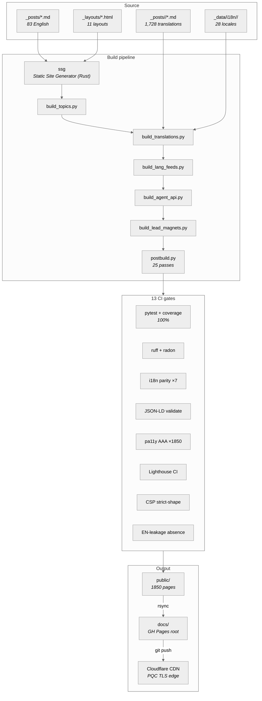
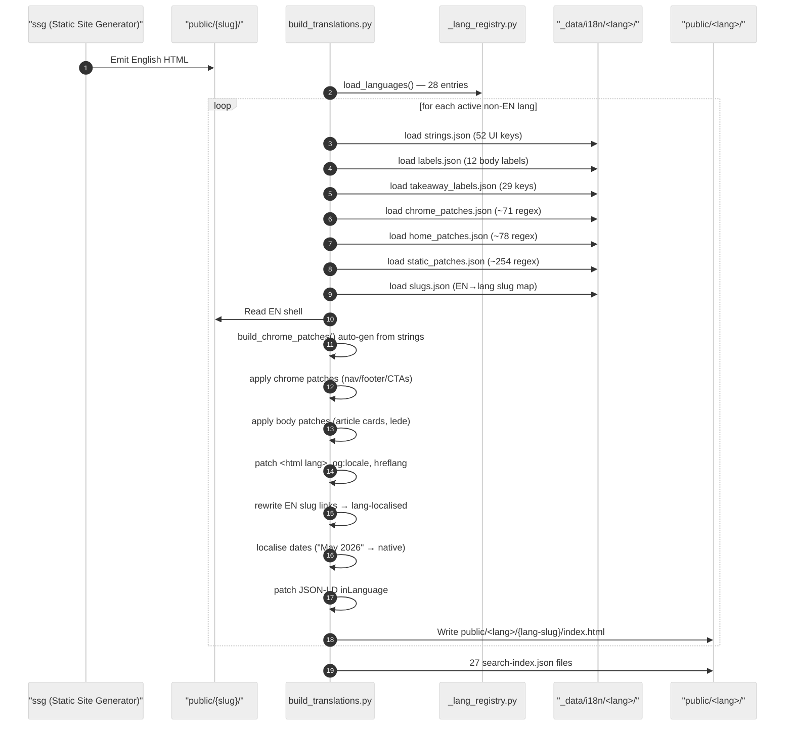
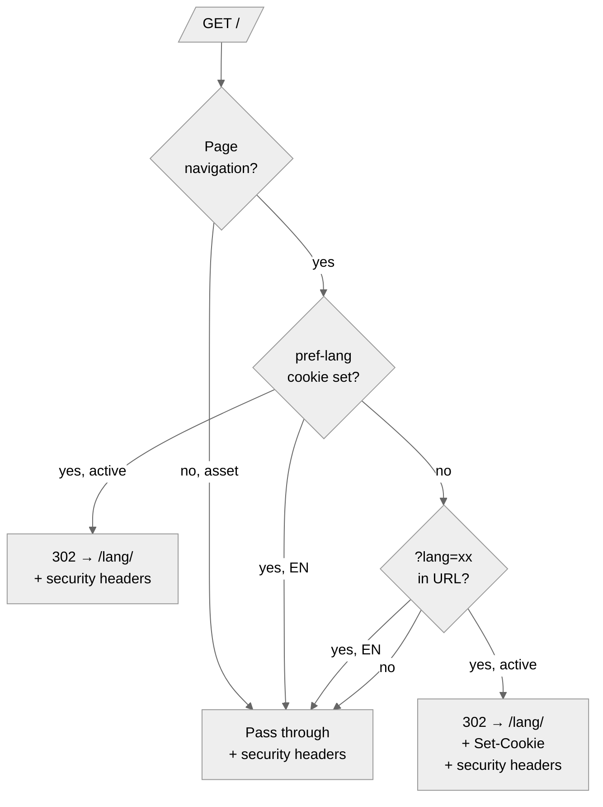
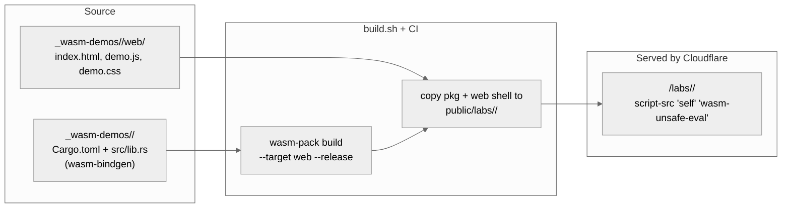
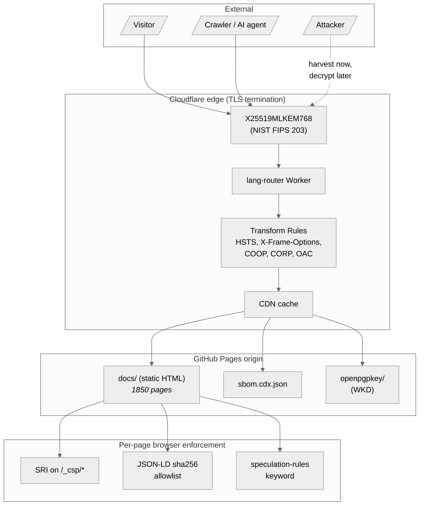
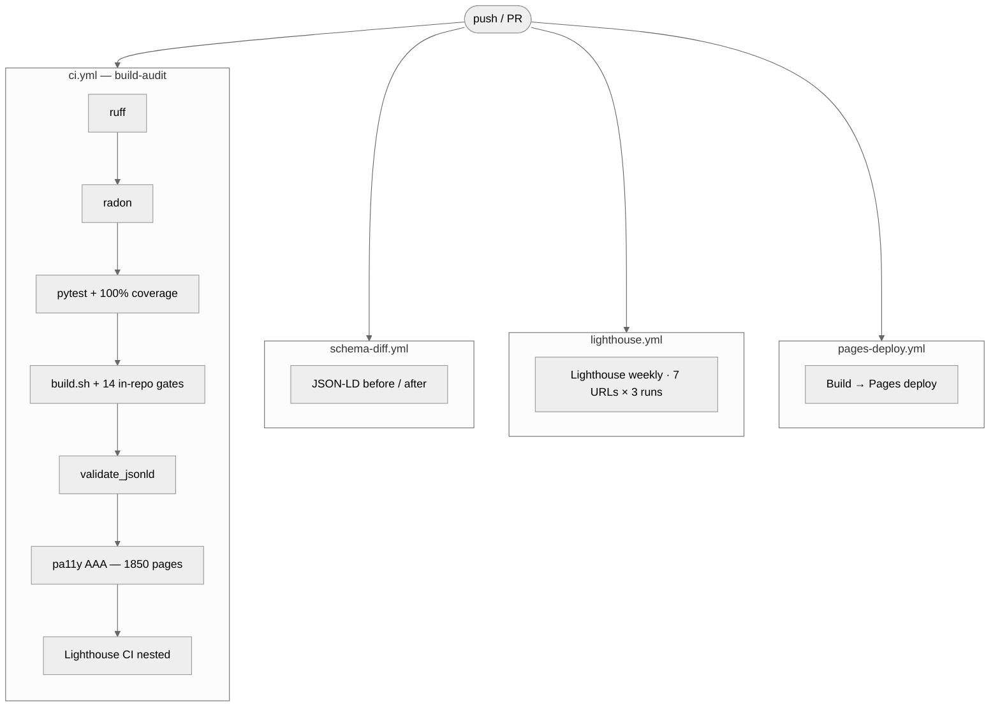

<!-- SPDX-License-Identifier: Apache-2.0 -->

<p align="center">
 
</p>

<h1 align="center">sebastienrousseau.com</h1>

<p align="center">
 The static-site pipeline behind <a href="https://sebastienrousseau.com"><code>sebastienrousseau.com</code></a> — long-form research on applied AI, ISO 20022 payments, and post-quantum cryptography for financial services, published in <strong>28 languages</strong>.
</p>

<p align="center">
 <a href="https://github.com/sebastienrousseau/sebastienrousseau.github.io/actions/workflows/ci.yml"></a>
 <a href="https://github.com/sebastienrousseau/sebastienrousseau.github.io/actions/workflows/lighthouse.yml"></a>
 <a href="https://sebastienrousseau.com"></a>
 <a href="https://github.com/sebastienrousseau/sebastienrousseau.github.io/blob/main/LICENSE"></a>
</p>

<p align="center">
 <a href="#quick-start"></a>
 <a href="#quick-start"></a>
 <a href="#capabilities-shipped"></a>
 <a href="#security-posture"></a>
 <a href="#security-posture"></a>
 <a href="#ci-gates"></a>
 <a href="#ci-gates"></a>
 <a href="#ci-gates"></a>
</p>

---

## Contents

**Getting started**

- [Quick Start](#quick-start) — install + build the site in three commands
- [Repository tour](#repository-tour) — what lives where

**Architecture**

- [Pipeline overview](#pipeline-overview) — Mermaid flowchart of every stage
- [Build stages](#build-stages) — what each script does, in order
- [Inputs](#inputs) and [Outputs](#outputs)
- [Postbuild passes](#postbuild-passes) — the 25 transforms in `postbuild.py`

**Internationalisation**

- [The 28-language matrix](#the-28-language-matrix)
- [Translation pipeline](#translation-pipeline) — Mermaid sequence of the FR-canonical fork
- [Per-language CI gates](#per-language-ci-gates)

**Security**

- [Security posture](#security-posture) — CSP, PQC TLS, SRI, SBOM, signed commits
- [Edge routing Worker](#edge-routing-worker) — explicit cookie / `?lang=` routing + edge security headers
- [WASM labs](#wasm-labs) — Rust→WebAssembly demos under `/labs/<crate>/`, strict-CSP isolated
- [Threat model](#threat-model) — Mermaid attack-surface diagram

**Reference**

- [Capabilities shipped](#capabilities-shipped) — what's in production today
- [Schema.org coverage](#schemaorg-coverage) — every JSON-LD type emitted
- [AI / agent discovery](#ai--agent-discovery) — `/api/agents/`, `.well-known/`, `llms.txt`

**Operational**

- [Development](#development) — local QA recipe, `make` targets
- [CI gates](#ci-gates) — all 13 checks every push must clear
- [Deployment](#deployment) — GitHub Pages + Cloudflare
- [When this repo is not what you want](#when-this-repo-is-not-what-you-want)

**Documentation**

- [Companion docs](#companion-docs)
- [License](#license)

---

## Quick Start

```bash
# 1. Clone
git clone https://github.com/sebastienrousseau/sebastienrousseau.github.io.git
cd sebastienrousseau.github.io

# 2. Install toolchain
cargo install ssg --locked # Static Site Generator (Rust)
pip install -r requirements.txt # Python pipeline (markdown-it-py, …)

# 3. Build
./build.sh # build into public/, mirror to docs/
./build.sh --serve # build + serve on http://127.0.0.1:8000
```

A clean build finishes in ~12 seconds on a modern laptop and emits **1850 HTML pages** across **28 languages** with **0 CI failures**.

| Tool | Version | Why |
|---|---|---|
| Rust toolchain | stable | `ssg` (Static Site Generator) is a Rust binary; install via `cargo install ssg --locked` |
| Python | 3.12 | Postbuild pipeline (`scripts/*.py`) — 37 modules, 100% test coverage. Pinned in `mise.toml`. |
| `markdown-it-py` | latest | FR-canonical translation pipeline parser |
| Node.js | 20+ | Cloudflare Worker tests (`workers/test_lang_router.mjs`), pa11y CI |
| `gh` CLI | optional | Repo administration, CI inspection |

---

## Repository tour

```
sebastienrousseau.github.io/
├── _posts/ # Source content
│ ├── *.md # 83 English posts (65 dated + 18 static)
│ └── <lang>/*.md # 1,728 translated posts (64 × 27 langs)
├── _layouts/ # 11 HTML layouts
├── _data/
│ ├── gh-stats.json # Nightly GitHub repo stats
│ ├── i18n/<lang>/ # Per-language UI strings + patch tables (28 dirs)
│ └── lead-magnets/ # PDF source markdown
├── scripts/ # Python build pipeline, by responsibility
│ ├── editorial/ # publish-daily, translate_post, check_voice, banners
│ ├── generators/ # gen_articles, build_topics, build_lang_feeds, build_agent_api, …
│ ├── postbuild/ # postbuild.py + postbuild_lib/, single-page transforms
│ ├── seo_and_audit/ # link audit, JSON-LD validate, pa11y cache + retry-flakes
│ ├── security/ # sigstore-sign + sigstore-setup
│ └── lib/ # shared: _core, _frontmatter, _lang_registry, slug-map
├── tests/ # 716 test functions / 27,610 parametrized cases
│ ├── unit/ # pytest suite; coverage gate (postbuild_lib 100%) runs here
│ └── validation/ # 13 in-repo CI gates against public/ (i18n, hreflang, CSP, RTL, sitemap)
├── project-docs/ # Architecture, publishing, postbuild, schemas, security, sigstore, i18n, web-perf-seo-spec
├── workers/ # Cloudflare Worker — locale routing + edge security headers
│ ├── lang-router.js # the Worker (cookie + ?lang only; no A-L sniff)
│ └── test_lang_router.mjs # 43 tests, 100% line/branch/func coverage
├── _wasm-demos/ # Rust → WASM lab demos served under /labs/<crate>/
│ └── hsh-demo/ # SHA-256 / BLAKE3 / Argon2id in-browser, 94 KB bundle
├── .well-known/ # AI plugin manifest, OpenAPI schema, OpenPGP WKD
├── .github/workflows/ # 6 CI workflows
├── public/ # Canonical build output — 1850 HTML pages
└── docs/ # GitHub Pages root (rsync mirror of public/ on every build — NOT documentation; the docs that describe this repo live in /project-docs/)
```

---

## Pipeline overview



No JavaScript framework. No server-side renderer. Every URL is a real HTML file. Speculation Rules API prerenders the next-likely page on hover; the Cloudflare Worker auto-routes visitors to their preferred locale in under 50ms.

---

## Build stages

`build.sh` chains seven tools in this order. Each is a pure transformation on `public/`:

| # | Stage | Inputs | Output |
|---|---|---|---|
| 1 | **`ssg`** (Static Site Generator) | `_posts/*.md` + `_layouts/*.html` | `public/{slug}/index.html` (English) — picks the layout from each post's `layout:` frontmatter (`report`, `link`, `articles`, `papers`, `projects`, `playlist`, `contact`, `about`, `page`, `thank-you`). |
| 2 | **`build_topics.py`** | hand-curated topic taxonomy | `public/topics/{topic}/` — 5 clusters (post-quantum, ISO 20022, applied AI, Rust OSS, blockchain) + hub. |
| 3 | **`build_translations.py`** | `_posts/<lang>/*.md` + per-language glossaries | `public/<lang>/{slug}/index.html` — 27 non-EN locales, FR-canonical fork pattern (see [Translation pipeline](#translation-pipeline)). |
| 4 | **`build_lang_feeds.py`** | rendered translations | Per-language `rss.xml`, `atom.xml`, `news-sitemap.xml`, `feed.json`. |
| 5 | **`build_agent_api.py`** | post + topic graph | `/api/agents/{posts,topics,person,index}.json` — JSON inventory for AI/agentic clients. |
| 6 | **`build_lead_magnets.py`** | `_data/lead-magnets/*.md` | PDF gates (e.g. `/resources/pacs008-checklist.pdf`). |
| 7 | **`postbuild.py`** | every rendered HTML page | The big one — 18 single-page transforms ([details](#postbuild-passes)). |

After the build, **13 in-repo CI gates** run against `public/`:

```
search-index • i18n-parity • UI-strings • body-labels • takeaway-labels
render-data • author-card • hreflang reciprocity • JSON-LD inLanguage
sitemap completeness • EN-leakage absence • no physical CSS
CSP strict-shape • workers test
```

A failure on any gate aborts the build and surfaces in CI as a red X.

---

## Inputs

```
_posts/*.md # 83 English source documents (65 dated + 18 static)
_posts/<lang>/*.md # 1,728 translations (27 langs × 64 posts)
_layouts/*.html # 11 page layouts
_data/i18n/<lang>/*.json # 11 JSON files × 28 locales — strings, labels,
 # patches, slugs, author, topics, …
_data/gh-stats.json # Nightly GitHub repo stats
scripts/lib/_lang_registry.py # Single source of truth for the 28-language matrix
 # (BCP-47, locale, flag, active flag, RTL bit)
```

## Outputs

```
public/ # canonical build output — 1850 HTML pages
docs/ # GitHub Pages root (rsync mirror of public/)
public/sitemap.xml # 108k entries across 28 languages
public/llms.txt # AI-crawler index
public/llms-full.txt # Full corpus dump
public/sbom.cdx.json # CycloneDX SBOM — supply-chain provenance
public/api/agents/ # JSON endpoints for AI / agentic clients
public/.well-known/ # ai-plugin.json, openapi.json, openpgpkey/
```

---

## Postbuild passes

`scripts/postbuild.py` is a single-page orchestrator that applies 25 independent transforms per HTML page. The orchestration sequence is order-sensitive (e.g. `inject_word_count` must run before `inject_article_furniture` which renders the word count into the meta bar):

```mermaid
%%{init: {'theme':'neutral'} }%%
flowchart TB
    P0["HTML page"]
    subgraph S1["1 · SEO + Schema.org"]
        direction TB
        A1["scrub localhost"] --> A2["fingerprint assets"]
        A2 --> A3["fix SRI"]
        A3 --> A4["inject ItemList"]
        A4 --> A5["TechArticle / ScholarlyArticle"]
        A5 --> A6["NewsArticle (last 48h)"]
        A6 --> A7["SoftwareSourceCode"]
        A7 --> A8["fix og:image"]
        A8 --> A9["complete OG"]
        A9 --> A10["stamp img w/h"]
        A10 --> A11["HowTo schema"]
        A11 --> A12["wordCount"]
        A12 --> A13["about / mentions"]
    end
    subgraph S2["2 · Article furniture"]
        direction TB
        B1["article furniture"] --> B2["sigstore attestation"]
        B2 --> B3["anchor links + ToC (idempotent)"]
        B3 --> B4["strip duplicate body H1"]
        B4 --> B5["per-article language switcher"]
        B5 --> B6["nav highlight"]
        B6 --> B7["prev / next"]
        B7 --> B8["hreflang"]
        B8 --> B9["speculation rules"]
        B9 --> B10["GitHub stats"]
        B10 --> B11["hoist body link tags"]
    end
    subgraph S3["3 · CSP finalisation"]
        direction TB
        C1["CSP JSON-LD sha256 hashes"]
    end
    P1["page written"]

    P0 --> S1 --> S2 --> S3 --> P1
```



Each pass is a pure `(html, …) -> html` transformation. Module-level state is regex constants only. Coverage is 100% on `postbuild_lib/` — see [`tests/`](tests/).

---

## The 28-language matrix

| Code | BCP-47 | Locale | Native name | Direction |
|---|---|---|---|---|
| en | en-GB | en_GB | English | LTR |
| fr | fr-FR | fr_FR | Français | LTR |
| ar | ar-SA | ar_SA | العربية | **RTL** |
| bn | bn-BD | bn_BD | বাংলা | LTR |
| cs | cs-CZ | cs_CZ | Čeština | LTR |
| de | de-DE | de_DE | Deutsch | LTR |
| es | es-ES | es_ES | Español | LTR |
| fil | fil-PH | fil_PH | Filipino | LTR |
| ha | ha-NG | ha_NG | Hausa | LTR |
| he | he-IL | he_IL | עברית | **RTL** |
| hi | hi-IN | hi_IN | हिन्दी | LTR |
| id | id-ID | id_ID | Indonesia | LTR |
| it | it-IT | it_IT | Italiano | LTR |
| ja | ja-JP | ja_JP | 日本語 | LTR |
| ko | ko-KR | ko_KR | 한국어 | LTR |
| nl | nl-NL | nl_NL | Nederlands | LTR |
| pl | pl-PL | pl_PL | Polski | LTR |
| pt-br | pt-BR | pt_BR | Português (Brasil) | LTR |
| ro | ro-RO | ro_RO | Română | LTR |
| ru | ru-RU | ru_RU | Русский | LTR |
| sv | sv-SE | sv_SE | Svenska | LTR |
| th | th-TH | th_TH | ไทย | LTR |
| tr | tr-TR | tr_TR | Türkçe | LTR |
| uk | uk-UA | uk_UA | Українська | LTR |
| vi | vi-VN | vi_VN | Tiếng Việt | LTR |
| yo | yo-NG | yo_NG | Yorùbá | LTR |
| zh-hans | zh-Hans | zh_CN | 简体中文 | LTR |
| zh-hant | zh-Hant | zh_TW | 繁體中文 | LTR |

All 28 languages emit a complete page tree (44 articles + ~20 static pages each), a search index, RSS / Atom / news-sitemap feeds, and JSON-LD with `inLanguage` set. Hreflang reciprocity is enforced by a CI gate — see [`tests/validation/test_hreflang_reciprocity.py`](tests/validation/test_hreflang_reciprocity.py).

---

## Translation pipeline

The English render is the source of truth. Each non-EN language **forks the rendered EN HTML** rather than re-rendering from layout templates — that guarantees layout parity by construction. Eleven per-language JSON files drive the chrome + body string swaps:



The fork pattern means **any HTML change ships to all 28 languages by construction**. The trade-off is a richer patch surface (per-locale chrome + body patches) — but the patches are JSON, not Python, so they're easy to author and review.

---

## Per-language CI gates

Seven parity gates enforce that every non-EN language ships the same shape as English:

| Gate | What it asserts | File |
|---|---|---|
| `test_i18n_parity` | Every active lang renders the same article count | [`tests/validation/test_i18n_parity.py`](tests/validation/test_i18n_parity.py) |
| `test_i18n_strings` | UI strings keyset matches EN reference | [`tests/validation/test_i18n_strings.py`](tests/validation/test_i18n_strings.py) |
| `test_i18n_labels` | Body labels keyset matches EN reference | [`tests/validation/test_i18n_labels.py`](tests/validation/test_i18n_labels.py) |
| `test_i18n_takeaway_labels` | Takeaway labels keyset matches EN reference | [`tests/validation/test_i18n_takeaway_labels.py`](tests/validation/test_i18n_takeaway_labels.py) |
| `test_i18n_render_data` | Patch-table count matches FR canonical | [`tests/validation/test_i18n_render_data.py`](tests/validation/test_i18n_render_data.py) |
| `test_i18n_author` | Author-card metadata keyset matches | [`tests/validation/test_i18n_author.py`](tests/validation/test_i18n_author.py) |
| `test_lang_no_leakage` | No English UI strings leaked into non-EN chrome | [`tests/validation/test_lang_no_leakage.py`](tests/validation/test_lang_no_leakage.py) |

Plus three pan-locale gates:

- `test_hreflang_reciprocity` — every translated page's hreflang set is symmetric (A claims B is the FR alternate ⇒ B claims A is the EN alternate). 1848 paired pages on a clean build.
- `test_jsonld_localized` — JSON-LD `inLanguage` matches `<html lang>` on every page.
- `test_sitemap_completeness` — every rendered page is present in `sitemap.xml`.
- `test_rtl_safe` — RTL languages don't carry physical CSS properties (`margin-left` etc.) that don't flip with `dir="rtl"`.

---

## Security posture

| Surface | Posture |
|---|---|
| **TLS** | Cloudflare edge with the post-quantum hybrid X25519MLKEM768 (NIST FIPS 203), classical X25519 fallback for legacy clients. Negotiated by Chrome 124+, Firefox 132+, Safari 18+. |
| **HSTS** | `max-age=63072000; includeSubDomains; preload`. Submitted to the Chromium HSTS preload list. |
| **CSP** | Strict. No `unsafe-inline` for scripts. JSON-LD allowed strictly by per-page SHA-256 hash. `'inline-speculation-rules'` keyword authorises the Speculation Rules API block (which also carries its own hash). `img-src` enumerates 4 origins; no blanket `https:`. CI gate [`test_csp_strict.py`](tests/validation/test_csp_strict.py) fails the build if any future regression widens the policy. |
| **Frame protection** | `frame-ancestors 'none'` + `X-Frame-Options: DENY` via Cloudflare Transform Rules. |
| **MIME** | `X-Content-Type-Options: nosniff`. |
| **Referrer** | `Referrer-Policy: strict-origin-when-cross-origin`. |
| **Permissions** | `Permissions-Policy` denies ~40 sensitive permissions by default. |
| **Cross-origin** | `Cross-Origin-Opener-Policy: same-origin`, `Cross-Origin-Resource-Policy: same-origin`. `COEP` deliberately not set to keep Spotify iframes working on `/playlists/`. |
| **SRI** | Real SHA-256 SRI on every `/_csp/*` asset. |
| **SBOM** | CycloneDX 1.4 published at `/sbom.cdx.json`. |
| **Git** | Signed commits enforced. Branch protection on `main`. |

Full deployment notes including the Cloudflare configuration and verification commands live in [`DEPLOY.md`](DEPLOY.md).

---

## Edge routing Worker

`workers/lang-router.js` is a Cloudflare Worker that does two jobs on every request at the apex: explicit-only locale routing (cookie or `?lang=` query — Accept-Language is *not* sniffed) and the full strict-CSP / security-header layer (HSTS, COOP, Permissions-Policy, Referrer-Policy, X-Content-Type-Options, frame-ancestors).



Decision priorities, from highest to lowest:

1. **Explicit cookie** — `pref-lang=fr` from a prior visit; sticky for 30 days.
2. **URL override** — `?lang=fr` deep-link (also sets the cookie).
3. **Fall through** — every other visitor (including bilingual readers with French-system browsers) lands on the canonical EN site. Accept-Language sniffing was removed deliberately: too many readers got bounced off the canonical copy they actually wanted.

Every response — redirect or origin pass-through — carries the same security-header set: strict CSP with `form-action 'self' https://formspree.io`, `frame-ancestors 'none'`, 2-year HSTS with preload, `Permissions-Policy` locking down browsing-topics / interest-cohort / camera / mic / geolocation, `Cross-Origin-Opener-Policy: same-origin`, `Referrer-Policy: strict-origin-when-cross-origin`, `X-Content-Type-Options: nosniff`.

The Worker is pure-logic — no fetches beyond the origin pass-through, no KV. Tests at [`workers/test_lang_router.mjs`](workers/test_lang_router.mjs) cover every branch under Node's built-in coverage with **100% line / branch / function** thresholds enforced by `build.sh`.

---

## WASM labs

Each subdirectory of `_wasm-demos/` is a Rust crate that compiles to WebAssembly via `wasm-pack` and ships an interactive companion page under `/labs/<crate>/`. The first one (`hsh-demo`) wraps `sha2` + `blake3` + `argon2` and computes SHA-256, BLAKE3 and Argon2id entirely client-side from a 94 KB bundle — no server round-trip, no third-party JavaScript, no network beyond the same-origin WASM fetch.



**CSP discipline:** `'wasm-unsafe-eval'` is the only loosening — it's a distinct token from `'unsafe-eval'`, so the strict-shape CSP gate ([`tests/validation/test_csp_strict.py`](tests/validation/test_csp_strict.py)) passes unchanged. Lab pages are `noindex,nofollow` and excluded from the sitemap-completeness gate.

**Reusing the pattern:** drop a new crate at `_wasm-demos/<name>/` with the `Cargo.toml`, `src/lib.rs` (wasm-bindgen exports), and a `web/{index.html, demo.js, demo.css}` shell; the next build publishes `/labs/<name>/` automatically. See [`_wasm-demos/README.md`](_wasm-demos/README.md) for the copy-paste recipe.

---

## Threat model



Specific mitigations:

- **Harvest-now-decrypt-later quantum risk** — every TLS session uses ML-KEM-768 hybrid key exchange. An adversary recording today's traffic cannot retroactively decrypt it with a future cryptographically relevant quantum computer.
- **Supply-chain integrity** — every page ships a CycloneDX SBOM, every CSS/JS asset carries a real SHA-256 SRI, and commits are signed. Branch protection requires PRs + green CI before merge.
- **XSS / injection** — strict CSP (no `unsafe-inline`), per-page JSON-LD sha256 allowlist, `'inline-speculation-rules'` keyword authorises only the Speculation Rules block. `object-src 'none'`, `base-uri 'self'`.
- **Disclosure channel** — OpenPGP Web Key Directory (WKD) at `.well-known/openpgpkey/` for researcher contact; machine-readable policy at [`.well-known/security.txt`](https://sebastienrousseau.com/.well-known/security.txt) per RFC 9116; full threat model in [`project-docs/SECURITY.md`](project-docs/SECURITY.md) (top-level [`SECURITY.md`](SECURITY.md) delegates to it).

---

## Capabilities shipped

What's in production today (≠ what's on the roadmap):

| Surface | What ships |
|---|---|
| **Languages** | 28 active languages (`en-GB` + 27 non-EN). 44 articles per language, ~20 static pages, full chrome translation, RTL support for Arabic + Hebrew. |
| **Content** | 44 long-form articles, 5 topic-cluster hubs, papers index with 1 lead-magnet PDF, projects portfolio (~26 SoftwareSourceCode entries), playlists, contact form. |
| **Security** | Strict CSP (no `unsafe-inline`, hash-allowlisted JSON-LD + speculationrules), HSTS preload, X25519MLKEM768 PQC TLS at the edge, real SRI, CycloneDX SBOM, Cross-Origin-Opener-Policy + Cross-Origin-Resource-Policy via Cloudflare Transform Rules. |
| **Discovery** | sitemap.xml (108k entries), per-language news-sitemap + RSS + Atom + JSON-Feed, `robots.txt` (20+ AI bots listed explicitly), `llms.txt` + `llms-full.txt`. |
| **AI / agent surface** | `/api/agents/{posts,topics,person,index}.json` + `.well-known/ai-plugin.json` + `.well-known/openapi.json` (OpenAPI 3.1). |
| **Performance** | Speculation Rules API (hover-prerender), 11750+ images with explicit width/height, hero `fetchpriority=high`, system fonts only, ~5 KB JS. Lighthouse 100/100/100/100 across all categories on article pages. |
| **Accessibility** | WCAG 2.2 AAA — 0 pa11y violations across 1850 pages, all interactive targets ≥24×24 (WCAG 2.5.5), focus-visible rings, `prefers-reduced-motion` honored, full keyboard nav. |
| **SEO / GEO** | `Person` (with ORCID + `hasCredential` + `knowsAbout` as `DefinedTerm`) / `Organization` (with editorial / corrections / ethics / diversity policy refs) / `BlogPosting` / `TechArticle` / `ScholarlyArticle` (auto-upgrade ≥6 standards-body citations) / `NewsArticle` (last 48 h Google News window) / `SoftwareSourceCode` / `EditorialPolicy` / `CorrectionsPolicy` / `FAQPage` / `HowTo` / `BreadcrumbList` / `ItemList` / `ProfilePage` JSON-LD. Complete OG/Twitter metadata, hreflang reciprocity, BCP-47 regional tags. |
| **Editorial governance** | Published [`/editorial/`](https://sebastienrousseau.com/editorial/) — sourcing (5-tier primary-source hierarchy), 48-hour corrections clause (IFCN-aligned), AI assistance disclosure, conflict-of-interest disclosure (HSBC employment), CC BY-4.0 republication terms. The Google News reviewer signal most analyst tech blogs are missing. |
| **Typography** | Three CSS custom properties — `--type-display` / `--type-body` / `--type-mono` — defined in every layout's `:root`. System-font stacks today; the abstraction layer is in place for self-hosted variable font swap-in (one diff per layout). |
| **Per-article language switcher** | Inline rail rendered as a band between the article hero and `<main>` showing the 28-locale parity to readers as content, not chrome. Native-script labels (`Français · 日本語 · العربية · 简体中文 · …`), localised lead-in per page locale, `dir="rtl"` on Arabic + Hebrew links, full `lang` + `hreflang` + `rel="alternate"`. |
| **Build provenance** | CycloneDX SBOM published at `/sbom.cdx.json`, real SRI on every asset, signed commits, 14 CI gates on every push. |
| **Edge routing** | Cloudflare Worker honours `pref-lang` cookie + `?lang=` deep-links for locale routing (opt-in only — no Accept-Language sniffing) and owns the strict-CSP / security-header layer on every response. Sub-50ms, no origin fetch beyond pass-through. |
| **WASM labs** | Rust crates compiled to WebAssembly via `wasm-pack`, served under `/labs/<crate>/` under a tight CSP (`script-src 'self' 'wasm-unsafe-eval'`). First demo: SHA-256 / BLAKE3 / Argon2id computed client-side from a 94 KB bundle. |

---

## Schema.org coverage

Every page emits structured data. The site uses these `@type`s:

| Type | Where | Count (typical clean build) |
|---|---|---|
| `Person` | Every page — Sebastien Rousseau with ORCID (`0009-0005-1434-284X`), `hasCredential` chain, `knowsAbout` as `DefinedTerm` array linking to Wikipedia / NIST / SWIFT / ECB | 1850 |
| `Organization` | Every page — `@id` `#organization` + `editorialPolicy` / `correctionsPolicy` / `ethicsPolicy` / `diversityPolicy` pointing at `/editorial/` | 1850 |
| `WebSite` | Every page — `publisher` → `#organization`, `author` → `#person` | 1850 |
| `BlogPosting` | Dated articles | 1232 |
| `TechArticle` | Dated articles (default Article subtype) | ~1200 |
| `ScholarlyArticle` | Dated articles with ≥6 standards-body citations (NIST/ISO/BIS/IETF/…) | ~80 |
| `NewsArticle` | Dated articles within 48h of `datePublished` (Google News carousel) | rolling ~2 |
| `EditorialPolicy` | `/editorial/` `@id` `#policy` — sourcing, AI disclosure, COI | 1 |
| `CorrectionsPolicy` | `/editorial/#corrections` — 48h IFCN-aligned clause | 1 |
| `DefinedTerm` | `Person.knowsAbout` array — 12 domain terms with `sameAs` to authoritative URLs | 22200 |
| `EducationalOccupationalCredential` | `Person.hasCredential` — 3 entries (HSBC / SWIFT / NIST PQC) | 5550 |
| `PropertyValue` | `Person.identifier` (ORCID) | 1850 |
| `SoftwareSourceCode` | `/projects/` cards (26 items, in an ItemList wrapper) | 26 |
| `HowTo` | Step-by-step articles (pain001, pacs.008, …) | 16 |
| `ItemList` | `/articles/`, `/papers/`, `/projects/` listings | 3 |
| `BreadcrumbList` | Every page | 1850 |
| `FAQPage` | `/papers/`, `/projects/` | 2 |
| `ProfilePage` | `/about/` | 1 |
| `ProgramMembership` | `/about/` EPAA Working Group | 1850 |

Every inline JSON-LD block is allowlisted in the page's CSP by its SHA-256 hash. The CI gate [`test_csp_strict.py`](tests/validation/test_csp_strict.py) fails the build if any JSON-LD block on any page lacks its hash in the policy. The schema validator at [`scripts/validate_jsonld.py`](scripts/validate_jsonld.py) fails on required-property gaps (e.g. `ListItem` missing `name`).

---

## AI / agent discovery

Three layers of discovery for AI crawlers and agentic clients:

| File | Format | Purpose |
|---|---|---|
| `/llms.txt` | Plain text directory | Per-llmstxt.org spec — one-line summary per article. |
| `/llms-ctx.txt` | Plain text agent-context | Compact companion to `llms.txt` — URL + one-line description pairs, < 80 lines, fits the smallest reasonable LLM context budget. |
| `/llms-full.txt` | Plain text corpus | Full article bodies (Markdown) for fine-tuning / RAG. |
| `/api/agents/posts.json` | Application JSON | Every dated post with title, URL, date, topics, keywords, description, wordCount. |
| `/api/agents/topics.json` | Application JSON | Curated topic clusters + slug lists. |
| `/api/agents/person.json` | Schema.org JSON | Author profile (`Person` + ORCID + `hasCredential` + 12-entry `DefinedTerm` `knowsAbout`). |
| `/api/agents/organization.json` | Schema.org JSON | Publisher (`Organization` + `Brand` + `editorialPolicy` / `correctionsPolicy` refs). |
| `/api/agents/index.json` | Application JSON | Discovery document — entry point + cross-links to RSS / Atom / sitemap / ai-plugin. |
| `/.well-known/ai-plugin.json` | ChatGPT-plugin manifest | Plugin-style discovery for AI agent toolchains. |
| `/.well-known/openapi.json` | OpenAPI 3.1 | Schema for the `/api/agents/*` endpoints. |
| `/feed.json` per lang | JSON Feed 1.1 | Modern JSON-Feed alternative to RSS. |
| `/editorial/` | HTML + `EditorialPolicy` + `CorrectionsPolicy` JSON-LD | Human + machine-readable editorial standards. Linked from every page via `Organization.editorialPolicy`. |

The `robots.txt` now groups bots under five explicit category headers (Web search · Social · SEO audit · AI retrieval · AI training · Specialised indexers). The human-readable bot policy lives at [`/about/#bot-policy`](https://sebastienrousseau.com/about/#bot-policy) — it enumerates each category, states the CC BY-4.0 licence, and tells crawler operators how to request a per-bot rule change.

---

## Development

Local QA recipe — every CI gate, runnable locally:

```bash
ruff check scripts/ tests/ # Python lint
radon cc scripts/postbuild_lib/ -nC # Cyclomatic complexity (A/B only)
pytest tests/ --cov=scripts/postbuild_lib --cov-fail-under=100
./build.sh # full build + 14 CI gates
python3 scripts/validate_jsonld.py # JSON-LD + XML feed shape
python3 tests/validation/test_csp_strict.py # CSP strict-shape
node workers/test_lang_router.mjs # Worker pure-logic tests
```

The pre-commit-equivalent one-liner is `make build && make audit && make validate`.

### `make` targets

```bash
make build           # full build pipeline
make serve           # build + serve locally
make audit           # internal-link audit (strict)
make validate        # JSON-LD + XML feed validity
make test-search-index # EN + per-language search-index shape guard
make lint            # ruff
make test            # pytest + coverage
make coverage        # combined coverage from build.sh + pytest
make publish-today   # publish today's _drafts/YYYY-MM-DD-*.md
```

### Worked example: add a new article

Drop your draft into `_drafts/` with the publication date in the
filename, then run the daily-publish slash command from Claude Code:

```bash
mv my-piece.md _drafts/2026-05-20-my-piece.md   # YYYY-MM-DD- prefix is the publish date

# In Claude Code on your laptop:
/publish-today
```

The slash command walks you through promote → scaffold the 27 locale
stubs + slug-maps → translate each in-conversation (no API key, uses
your existing Claude subscription) → manual editorial bumps to the
homepage newsroom-grid + `/articles/` featured slot → full build →
signed commit → push.

Full step-by-step (frontmatter contract, editorial choices, what's
auto-refreshed, every failure mode) lives in
[**`project-docs/PUBLISHING.md`**](project-docs/PUBLISHING.md). The shorter
[`project-docs/daily-publishing.md`](project-docs/daily-publishing.md) is the elevator
pitch.

If you'd rather drive the flow by hand:

```bash
mv my-piece.md _drafts/$(date -u +%F)-my-piece.md
./scripts/editorial/publish-daily.sh       # promote + scaffold 27 stubs + build
$EDITOR _posts/index.md                    # prepend new newsroom-grid card
$EDITOR scripts/generators/gen_articles.py # prepend ARTICLES[0] tuple
python3 scripts/generators/gen_articles.py
python3 scripts/editorial/translate_post.py <slug> --list-stubs  # in Claude, translate each
./build.sh
git add -A && git commit -S -m "content: …" && git push
```

### Worked example: add a new language

1. Append a `Language(...)` entry to [`scripts/lib/_lang_registry.py`](scripts/lib/_lang_registry.py) with `active=False`.
2. Create `_data/i18n/<lang>/` with 11 JSON files (mirror an existing locale's structure).
3. Translate `_posts/<lang>/*.md` (44 articles).
4. Activate (`active=True`), wire the new language entry into all 11 `_layouts/*.html` switcher tables, push.
5. CI's per-language parity gates enforce that nothing is missing.

See [`project-docs/I18N.md`](project-docs/I18N.md) for the full workflow.

---

## CI gates

Six GitHub Actions workflows guard every push. Together they run 14 distinct checks:



| Workflow | Triggers | Gates |
|---|---|---|
| [`ci.yml`](.github/workflows/ci.yml) (build-audit) | every push + PR | ruff, radon, pytest+coverage 100%, build, JSON-LD validate, pa11y AAA over 1850 pages, nested Lighthouse CI. |
| [`lighthouse.yml`](.github/workflows/lighthouse.yml) | every push + weekly cron | Full Lighthouse CI on 10 representative URLs × 3 runs. Thresholds: performance ≥0.90 warn, a11y ≥0.98 error, best-practices ≥0.95 error, SEO ≥0.95 error. **Core Web Vitals audit-level gates**: TBT ≤200 ms (INP lab proxy), LCP ≤2500 ms, CLS ≤0.1 (all error); FCP ≤1800 ms (warn). |
| [`pages-deploy.yml`](.github/workflows/pages-deploy.yml) | push to `main` | Build + `upload-pages-artifact` + `deploy-pages`. |
| [`schema-diff.yml`](.github/workflows/schema-diff.yml) | every PR | Builds base + HEAD, diffs JSON-LD, posts a PR comment. Read-only. |
| [`refresh-gh-stats.yml`](.github/workflows/refresh-gh-stats.yml) | nightly cron + manual | Refreshes `_data/gh-stats.json` from the GitHub API. Opens a PR on change. |
| [`link-audit.yml`](.github/workflows/link-audit.yml) | first of every month | External link audit. Files a tracking issue if any external link returns 404. |

Plus the in-repo gates baked into `build.sh`:

```
search-index [x] i18n-parity [x] UI-strings [x] body-labels [x] takeaway-labels [x]
render-data [x] author-card [x] hreflang reciprocity [x] JSON-LD inLanguage [x]
sitemap completeness [x] EN-leakage absence [x] no physical CSS [x]
CSP strict-shape [x] workers test [x]
```

All workflows green at HEAD on `main`.

---

## Deployment

GitHub Pages serves `docs/` (mirrored from `public/` by `build.sh`). Cloudflare sits in front of Pages as the CDN — see [`DEPLOY.md`](DEPLOY.md) for the canonical record of headers, PQC TLS toggle, HSTS preload submission, Transform Rules, and the `lang-router` Worker deployment.

`pages-deploy.yml` is the active deploy path. The legacy `main`-branch `docs/` auto-deploy still works as a fallback.

Production URL: <https://sebastienrousseau.com/>.

---

## When this repo is **not** what you want

This is the source-tree for a single author's personal site. It's public so anyone curious about the pipeline can read it, but:

- **No CMS.** Adding content means a Git commit. Comfortable with Markdown, frontmatter, and Git is a hard prerequisite.
- **No theming system.** Layouts are bespoke. Forking and rebranding is possible but involves rewriting `_layouts/index.html` end to end.
- **No multi-tenant story.** The build pipeline assumes one origin (`sebastienrousseau.com`) and one author identity.
- **Heavy i18n surface.** Adding a new language requires authoring 11 JSON glossaries and 44 article translations. Not a 10-minute job.

For a general-purpose Rust SSG with theming, see [Static Site Generator](https://github.com/sebastienrousseau/static-site-generator).

---

## Companion docs

| Document | Covers |
|---|---|
| [`CHANGELOG.md`](CHANGELOG.md) | **Versioned release history** — every schema, build pipeline, security, and crawler-surface change since `v1.0.0`. Loosely Keep-a-Changelog formatted. |
| [`DEPLOY.md`](DEPLOY.md) | Cloudflare configuration: PQC TLS toggle, Transform Rules for HSTS / COOP / CORP / X-Frame-Options, HSTS preload submission, verification commands, Worker deployment. |
| [`project-docs/PUBLISHING.md`](project-docs/PUBLISHING.md) | **Definitive publishing runbook** — daily flow, frontmatter contract, editorial decisions, translation rules, what's auto-refreshed vs hand-maintained, every CI failure mode + fix, adding a new permanent section, forking the pipeline. |
| [`project-docs/daily-publishing.md`](project-docs/daily-publishing.md) | Short-form sibling of `PUBLISHING.md` — TL;DR + when-to-push timing table. |
| [`.claude/commands/publish-today.md`](.claude/commands/publish-today.md) | The slash command that drives the daily flow from Claude Code, using your local Claude subscription for translation (no API key in repo). |
| [`project-docs/ARCHITECTURE.md`](project-docs/ARCHITECTURE.md) | Full pipeline architecture: every script in `scripts/`, every module in `postbuild_lib/`, every CI gate. With Mermaid diagrams. |
| [`project-docs/I18N.md`](project-docs/I18N.md) | The 28-language translation system: registry, JSON glossaries, chrome patches, RTL handling, adding a new language end-to-end. |
| [`project-docs/SECURITY.md`](project-docs/SECURITY.md) | Threat model, CSP design, SRI policy, PQC TLS, SBOM provenance, OpenPGP WKD. |
| [`project-docs/SCHEMAS.md`](project-docs/SCHEMAS.md) | Every Schema.org `@type` emitted by the site, plus the CSP-hash discipline that allowlists them. |
| [`project-docs/POSTBUILD.md`](project-docs/POSTBUILD.md) | The 18 single-page transforms in `postbuild.py`: order, dependencies, idempotence. |
| [`project-docs/CI.md`](project-docs/CI.md) | All 14 CI gates: what they check, how to run them locally, common failure modes. |
| `_data/gh-stats.json` | Nightly snapshot of GitHub repo stats consumed by `postbuild_lib/github_stats.py`. |
| `scripts/lib/_lang_registry.py` | Single source of truth for the 28-language matrix. |
| `requirements.txt` | Python runtime dependencies. |
| `pyproject.toml` | Ruff + pytest configuration, MSRV-equivalent for Python (3.12, pinned via `mise.toml`). |

---

## License

[Apache License 2.0](https://www.apache.org/licenses/LICENSE-2.0). Content (articles, papers) is © Sebastien Rousseau, all rights reserved; the build pipeline (scripts, layouts, build configuration) is Apache-2.0.

<p align="right"><a href="#contents">Back to Top</a></p>
