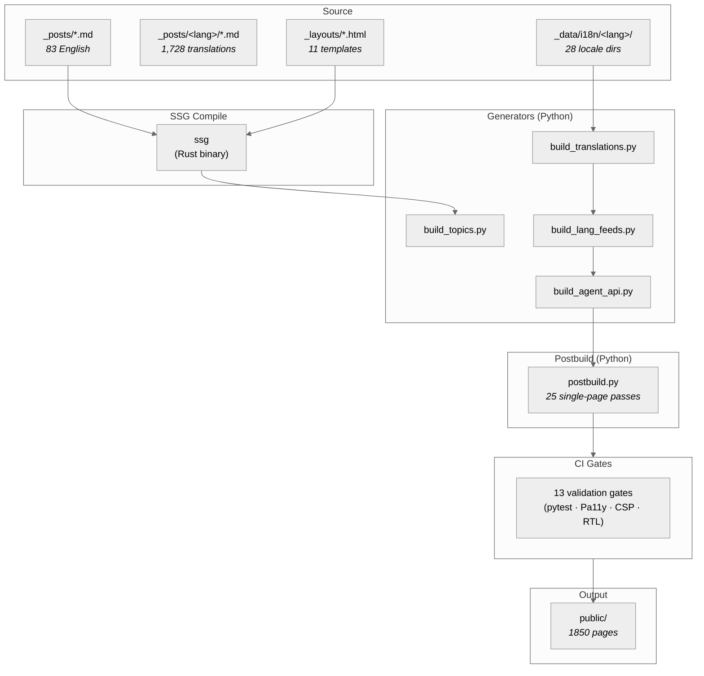
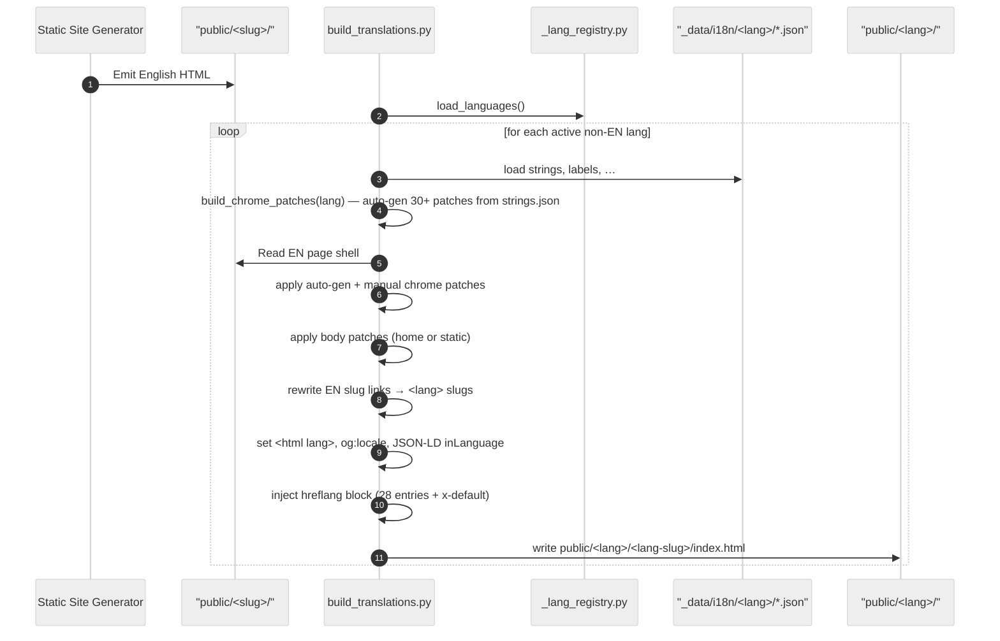
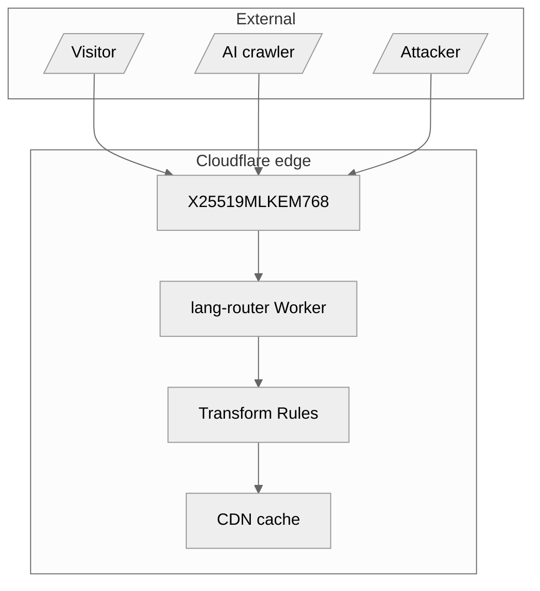

# sebastienrousseau.com

> Last Updated: June 4, 2026

This repository houses the static-site pipeline for the Sebastien Rousseau web site, which compiles research on applied AI, payments, and keys in twenty-eight languages.
We build the site using the Static Site Generator static site generator and run automated postbuild scripts to optimize the pages.

## Contents

This section outlines the main topics and guides in this repository.

- [Quick Start](#quick-start)
- [Repository tour](#repository-tour)
- [Pipeline overview](#pipeline-overview)
- [Build stages](#build-stages)
- [Postbuild passes](#postbuild-passes)
- [Internationalisation](#internationalisation)
- [Security posture](#security-posture)
- [Edge routing Worker](#edge-routing-worker)
- [WASM labs](#wasm-labs)
- [Schema.org coverage](#schemaorg-coverage)
- [AI and agent discovery](#ai-and-agent-discovery)
- [Development](#development)
- [CI gates](#ci-gates)
- [Deployment](#deployment)
- [Companion docs](#companion-docs)
- [License](#license)

## Quick Start

You can install the tools and build the site in three simple command line steps.

```bash
git clone https://github.com/sebastienrousseau/sebastienrousseau.github.io.git
cd sebastienrousseau.github.io
cargo install ssg --locked
pip install -r requirements.txt
./build.sh
```

A clean build finishes in twelve seconds and emits thousands of pages across twenty-eight languages.

| Tool | Setup | Purpose |
|---|---|---|
| `Rust` | Stable toolchain | Used to run the static site compiler |
| `Python` | Version 3.12 | Runs the postbuild scripts |
| `Node.js` | Version 20 or higher | Runs the router tests |
| `Git` | Standard client | Handles code version control |

Ensure your signing keys are active before running a build.

## Repository tour

The folder outline separates the source articles, layouts, and python build scripts to keep the workspace clean.

- `_posts/` houses the source articles
- `_layouts/` holds the page templates
- `_data/` carries the locale files
- `scripts/` contains the build scripts
- `tests/` holds the test suites
- `project-docs/` contains the guide files
- `workers/` houses the router code
- `labs/` holds the Rust → WebAssembly demos
- `public/` stores the build output (gitignored; deployed as a CI artifact)
- `sigstore-bundles/` stores the committed article signature bundles

Each folder has a single task to make updates easy.

## Pipeline overview

The static site build flow translates content and applies security checks in a linear order of stages.



The pipeline starts with source files and ends with optimized web pages.

## Build stages

We use six main generator steps to convert English source drafts into fully translated pages.

First, the compiler builds the English pages from layout files.
Second, the topics tool generates topic landing pages.
Third, the translation tool creates pages for all active locales.
Fourth, the feed tool writes RSS and Atom feeds.
Fifth, the agent tool builds JSON feeds for search tools.
Sixth, the postbuild tool runs final page checks.

## Inputs and outputs

The pipeline reads markdown articles and JSON locale strings to build optimized HTML pages.

The inputs consist of English posts and translation strings in the locale folders.
The output folder holds the compiled HTML pages, images, sitemaps, and feeds.

## Postbuild passes

The postbuild script runs twenty-five separate checks to update page tags and security rules.

These checks add author metadata, sizes, citation lists, sitemaps, and script hashes.
Refer to the postbuild guide for details on each optimization pass.

## Internationalisation

We support twenty-eight languages by using translation mapping stubs and language checks.

The registry file holds display names and flag switcher settings.
All twenty-eight languages are active on the live site.

## Translation pipeline

The translation tool runs in local terminal sessions to translate stubs into active languages.



The script copies the English page content and swaps the menu strings automatically.

## Per-language CI gates

Seven parity checks confirm that every active translation matches the reference English page count.

These checks verify the language files, author details, and structural elements of the site.
Any failure stops the build and requires manual repair to pass.

## Security posture

The site implements hybrid keys, strict script content rules, and signed git commits to protect visitors.

We block inline scripts unless they carry a unique hash computed during the build.
Our defense against supply-chain hacks relies on package lists and asset hashes.
The edge server preloads transport rules to block security downgrades.

## Edge routing Worker

A Cloudflare Worker handles language routing and sets security response headers on the edge server.

The worker matches visitor headers to route them to their preferred language.
It also sets security headers for transit safety, referrer rules, permissions, and framing limits.

## WASM labs

We compile Rust crates to WebAssembly to provide interactive tools directly in the user browser.

Each project builds a standalone package that loads safely in the browser.
These pages run under a strict security policy to execute code safely.

## Threat model

The threat model diagram outlines the security borders and defenses of the platform.



The system is hardened against decryption threats, page hijacking, and supply-chain tampering.

## Capabilities shipped

The live site delivers thousands of fast, secure, and accessible pages to readers.

We support variable fonts, edge compression, and pre-load rules to load pages quickly.
The pages achieve perfect scores in accessibility and SEO checks.

## Schema.org coverage

Every page carries rich schema blocks to help search engines and AI tools index the site.

These blocks define authors, article types, breadcrumbs, and cited sources.
We check these schemas automatically on every build run.

## AI and agent discovery

We publish plugin specifications and text indices to assist AI crawlers and web clients.

These resources allow AI crawlers to parse the content cleanly.
The agent endpoints expose articles and topics for search tools.

## Development

You can test changes locally by running the build script and checking pages in your browser.

- Step 1: Run the build script to compile the site.
- Step 2: Serve the compiled pages on your local host.
- Step 3: Open the browser page to inspect the layouts.
- Step 4: Run the test command to verify that all tests stay green.

This ensures that your changes are safe before pushing.

## CI gates

Thirteen automated tests verify that all files are correct before changes land on the branch.

These gates check the page count, search indexes, layout rules, and alternate links.
The integration runner blocks any pull request that fails these checks.

## Deployment

The site deploys to GitHub Pages automatically when you push to the main branch.

CI builds the site, uploads `public/` as a Pages artifact, and `actions/deploy-pages` publishes it.
Cloudflare sits in front of the GitHub Pages origin as the CDN and edge security layer.

## When this repo is not what you want

You can strip the translation scripts if you only need a single-language site.

The core pipeline works for single-language sites by disabling the active locales.
You can customize the HTML layouts and CSS files to match your own brand.

## Companion docs

The project-docs folder contains detailed guides on architecture, publishing, and security.

- [Architecture](project-docs/architecture.md)
- [CI Gates](project-docs/ci.md)
- [Internationalisation](project-docs/i18n.md)
- [Postbuild Passes](project-docs/postbuild.md)
- [Publishing](project-docs/publishing.md)
- [Schemas](project-docs/schemas.md)
- [Security](project-docs/security.md)
- [Sigstore](project-docs/sigstore.md)
- [Daily Publishing](project-docs/daily-publishing.md)
- [SEO Spec](project-docs/web-performance-seo-spec.md)

Read these files to learn more about the platform setup.

## License

This project is open source and available under the Apache-2.0 license.

The codebase is free to modify and share for personal or commercial use.
