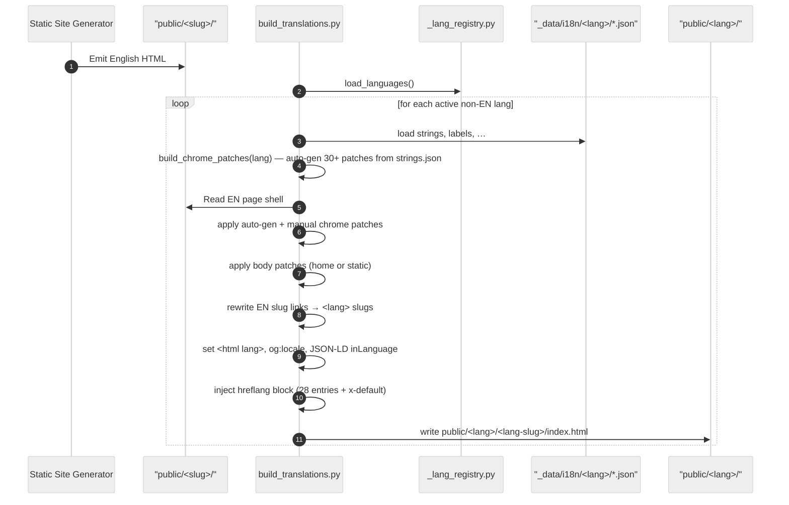
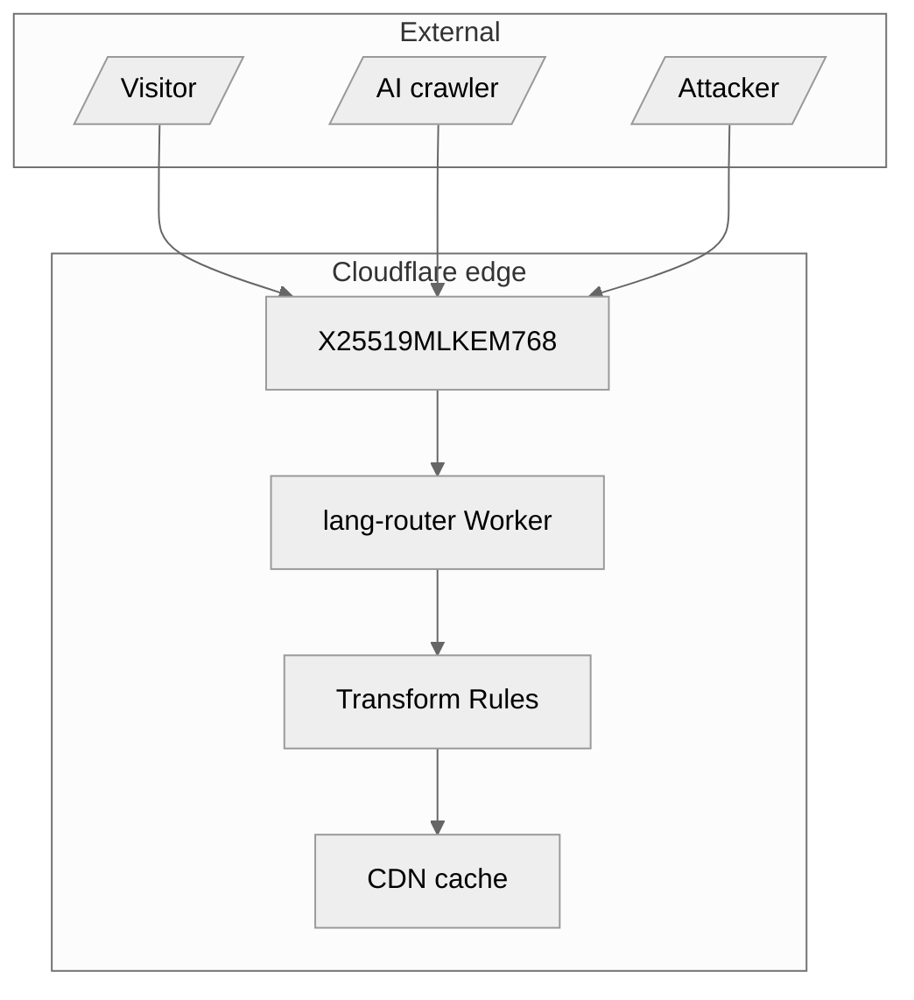

<!-- SPDX-License-Identifier: Apache-2.0 -->

<p align="center">
  
</p>

<h1 align="center">sebastienrousseau.com</h1>

<p align="center">
  A secure, 28-language static-site pipeline for research on applied AI,
  payments, and post-quantum cryptography — a Rust SSG core with automated
  Python generators and postbuild passes.
</p>

<p align="center">
  <a href="https://github.com/sebastienrousseau/sebastienrousseau.github.io/actions"></a>
  <a href="https://github.com/sebastienrousseau/sebastienrousseau.github.io/blob/main/LICENSE"></a>
  <a href="https://scorecard.dev/viewer/?uri=github.com/sebastienrousseau/sebastienrousseau.github.io"></a>
</p>

---

## Contents

**Getting started**

- [Install](#install) — toolchain prerequisites
- [Quick Start](#quick-start) — clone, build, serve
- [Layout](#layout) — repository folder map

**Pipeline**

- [Pipeline overview](#pipeline-overview) — source → compile → generate → postbuild → CI
- [Build stages](#build-stages) — the six generator steps
- [Postbuild passes](#postbuild-passes) — per-page transforms
- [Internationalisation](#internationalisation) — 28 locales, translation pipeline, parity gates

**Platform**

- [Security](#security) — CSP/SRI, PQC transport, signed commits, threat model
- [Edge routing Worker](#edge-routing-worker) — Cloudflare language routing
- [WASM labs](#wasm-labs) — Rust → WebAssembly demos
- [Discovery](#discovery) — Schema.org + AI/agent endpoints

**Operational**

- [Development](#development) — local build + test loop
- [CI gates](#ci-gates) — what blocks a merge
- [Deployment](#deployment) — GitHub Pages + Cloudflare
- [Reuse](#reuse) — adapting the pipeline for your own site
- [Companion docs](#companion-docs)
- [License](#license)

---

## Install

| Tool | Version | Purpose |
| :--- | :--- | :--- |
| Rust | stable | Runs the `ssg` static-site compiler |
| Python | 3.12 | Runs the generators + postbuild passes |
| Node.js | 22 | Runs the router + accessibility tests |
| Git | any | Version control + signed commits |

Ensure your commit-signing key is active before building.

## Quick Start

With [mise](https://mise.jdx.dev) installed, one command provisions the entire
pinned toolchain (Rust + `ssg`, Python 3.12 + deps, Node 22 + pa11y-ci) and the
dev tools:

```bash
git clone https://github.com/sebastienrousseau/sebastienrousseau.github.io.git
cd sebastienrousseau.github.io
make bootstrap   # provision the pinned toolchain + dependencies (idempotent)
make build       # emits public/ across 28 locales — first build target: under 10 min
```

`make serve` builds and serves on <http://127.0.0.1:8000>. Ensure your
commit-signing key is active before committing.

<details>
<summary>Manual setup (without mise)</summary>

```bash
cargo install ssg --locked --version 0.0.44   # Rust SSG compiler (pinned, ADR-0002)
pip install -r requirements.txt               # Python build dependencies
./build.sh                                     # emits public/ across 28 locales
```

</details>

## Layout

| Path | Contents |
| :--- | :--- |
| `_posts/` | Source articles (EN + 27 locale subdirs) |
| `_layouts/` | Page templates |
| `_data/` | Locale strings + taxonomy |
| `scripts/` | Build, generator, postbuild, and audit tooling |
| `tests/` | Unit + validation suites |
| `project-docs/` | Architecture, CI, security, publishing guides |
| `workers/` | Cloudflare edge router |
| `labs/` | Rust → WebAssembly demos |
| `public/` | Build output (gitignored; deployed as a CI artifact) |
| `sigstore-bundles/` | Committed article signature bundles |

## Pipeline overview

Source files compile, translate, and pass security checks in a linear order of stages — markdown and locale strings in, optimised HTML, sitemaps, and feeds out.


## Build stages

Six generator steps turn English source drafts into fully translated pages:

1. **Compile** — `ssg` renders the English pages from templates.
2. **Topics** — `build_topics.py` generates topic landing pages.
3. **Translate** — `build_translations.py` renders every active locale.
4. **Feeds** — `build_lang_feeds.py` writes RSS and Atom feeds.
5. **Agent API** — `build_agent_api.py` emits JSON feeds for crawlers and search tools.
6. **Postbuild** — `postbuild.py` runs the final per-page passes.

## Postbuild passes

`postbuild.py` runs ~25 single-page passes that add author metadata, image dimensions, citation lists, sitemaps, and per-page CSP script hashes. See [Postbuild Passes](project-docs/postbuild.md) for each pass.

## Internationalisation

Twenty-eight languages are active on the live site. The language registry (`scripts/lib/_lang_registry.py`) holds display names and switcher settings; locale strings live under `_data/i18n/<lang>/`.

`build_translations.py` runs locally to render every active non-English locale from the English page shell:



**Parity gates.** Seven checks confirm every active translation matches the reference English page count, author details, and structure. Any failure stops the build.

## Security

The site ships hybrid post-quantum TLS, a strict per-page Content-Security-Policy, Subresource Integrity on every asset, and signed Git commits. Inline scripts are allowed only by a build-time SHA-256 hash; supply-chain integrity rests on a CycloneDX SBOM and asset hashes; the edge preloads HSTS to block downgrades. See [Security](project-docs/security.md).



## Edge routing Worker

A Cloudflare Worker (`workers/lang-router.js`) matches visitor `Accept-Language` headers to route to the preferred locale, and sets edge response headers for transport security, referrer policy, permissions, and framing.

## WASM labs

Rust crates compiled to WebAssembly power interactive, client-side demos. Each demo builds a standalone package that loads under a strict CSP. See [`labs/`](labs/).

## Discovery

Every page carries Schema.org JSON-LD (author, article type, breadcrumbs, cited sources), validated on every build. The site also publishes agent endpoints and text indices (`/api/agents/…`, `/llms-full.txt`) so AI crawlers can parse content and enumerate articles and topics.

## Development

```bash
./build.sh          # compile the full site to public/
./build.sh --serve  # build, then serve public/ on http://127.0.0.1:8000
make test           # run the unit suite
make verify         # full repo-integrity regression suite (mirrors CI)
```

Build, serve, inspect in the browser, and confirm the tests are green before pushing.

`make verify` is the one-command regression gate: it runs lint + type-check,
the full build with its 37 in-build gates (CSP, SRI, i18n parity/hreflang,
search-index), the unit suite against the freshly-built tree, then JSON-LD
validation, a strict internal-link audit, and SBOM generation — the same set CI
enforces before deploy. Run it after `make bootstrap` (it needs the pinned
`ssg` 0.0.44).

## CI gates

Static analysis (ruff, mypy, complexity, duplication), the unit + validation suites, an internal-link audit, JSON-LD validation, a 4-shard Pa11y accessibility pass, and Lighthouse all run on every pull request. A failing gate blocks the merge. See [CI Gates](project-docs/ci.md).

## Deployment

Pushing to `main` triggers CI, which builds the site, uploads `public/` as a Pages artifact, and publishes it with `actions/deploy-pages`. Cloudflare sits in front of the GitHub Pages origin as the CDN and edge-security layer.

## Reuse

The pipeline works for a single-language site by disabling the active locales in the language registry; the translation scripts can then be removed. Customise `_layouts/` and the CSS to rebrand.

## Companion docs

- [Architecture](project-docs/architecture.md)
- [CI Gates](project-docs/ci.md)
- [Internationalisation](project-docs/i18n.md)
- [Postbuild Passes](project-docs/postbuild.md)
- [Publishing](project-docs/publishing.md)
- [Schemas](project-docs/schemas.md)
- [Security](project-docs/security.md)
- [Sigstore](project-docs/sigstore.md)
- [Daily Publishing](project-docs/daily-publishing.md)
- [SEO Spec](project-docs/web-performance-seo-spec.md)

## License

Licensed under [Apache-2.0](LICENSE). See [CHANGELOG.md](CHANGELOG.md) for release history.

<p align="right"><a href="#contents">Back to Top</a></p>
