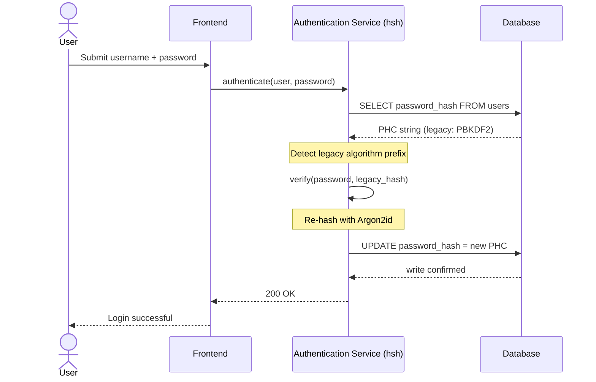
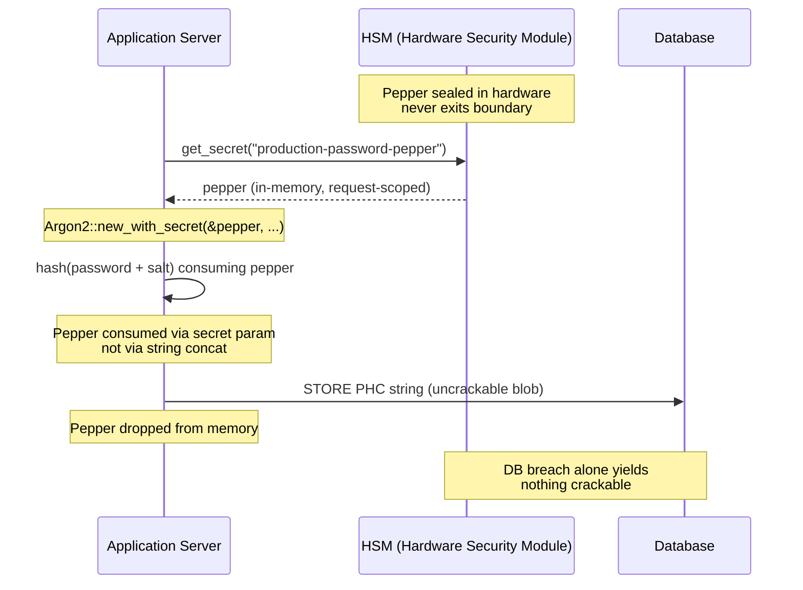

---
# Front Matter (YAML)
author: "contact@sebastienrousseau.com (Sebastien Rousseau)"
banner_alt: "Abstract cryptographic vault structure illuminated by blue and gold light — visualising the secure, memory-safe boundary where legacy password hashes are upgraded to Argon2id in real-time"
banner_height: "1597"
banner_width: "2584"
banner: "https://cloudcdn.pro/stocks/images/crypto-vault-XyZ1bLQnP9.webp"
cdn: "https://cloudcdn.pro"
charset: "UTF-8"
cname: "sebastienrousseau.com"
copyright: "© Copyright 2025 - 2026 - Sebastien Rousseau. All rights reserved."
date: "June 22, 2026"
description: "hsh is a pure-Rust cryptographic framework that enables tier-1 banks to migrate legacy password hashes to Argon2id with zero downtime, integrating HSM peppering and eliminating C-based FFI memory vulnerabilities to meet DORA resilience mandates."
format-detection: "telephone=no"
hreflang: "en"
icon: "https://cloudcdn.pro/clients/sebastienrousseau/v1/logos/sebastienrousseau.svg"
id: "https://sebastienrousseau.com/2026-06-22-hsh-zero-downtime-cryptographic-stewardship-rust-banking-2026"
image_alt: "Black and White Portrait of Sebastien Rousseau"
image_height: "162"
image_width: "162"
image: "https://cloudcdn.pro/stocks/images/sebastien-rousseau.png"
keywords: "hsh, Rust cryptography, password hashing, Argon2id, banking security, HSM interlock, DORA compliance, Basel III, zero-downtime migration, memory safety, PBKDF2, scrypt, cyber recovery"
language: "en-GB"
last_reviewed: "2026-06-22"
layout: "report"
locale: "en_GB"
logo_alt: "Logo for Sebastien Rousseau"
logo_height: "44"
logo_width: "44"
logo: "https://cloudcdn.pro/clients/sebastienrousseau/v1/logos/sebastienrousseau.svg"
measurementID: "G-169G4ET5HQ"
name: "Sebastien Rousseau"
permalink: "https://sebastienrousseau.com/2026-06-22-hsh-zero-downtime-cryptographic-stewardship-rust-banking-2026"
rating: "general"
referrer: "no-referrer"
robots: "index, follow"
schema: "FAQPage, Article"
seo_title: "hsh: Zero-Downtime Cryptographic Stewardship in Rust for Banking"
short_name: "sebastienrousseau"
subtitle: "How a pure-Rust cryptographic framework enables banks to seamlessly upgrade legacy passwords to Argon2id with HSM interlocks — and what it means for DORA and Basel III compliance."
tags: "hsh, Rust, banking, cryptography, Argon2id, HSM, DORA, Basel-III, security, open-source, operational-resilience"
theme-color: "0, 83, 191"
title: "Securing Password Management in Enterprise Banking: Multi-Algorithm Hashing and Upgrades with hsh"
url: "https://sebastienrousseau.com/2026-06-22-hsh-zero-downtime-cryptographic-stewardship-rust-banking-2026"
viewport: "width=device-width, initial-scale=1, shrink-to-fit=no"

# RSS
atom_link: "https://sebastienrousseau.com/2026-06-22-hsh-zero-downtime-cryptographic-stewardship-rust-banking-2026/rss.xml"
category: "Technology"
generator: "Static Site Generator (SSG) (version 0.0.40)"
item_description: "hsh is a pure-Rust cryptographic framework that enables tier-1 banks to migrate legacy password hashes to Argon2id with zero downtime, integrating HSM peppering and eliminating C-based FFI memory vulnerabilities to meet DORA resilience mandates."
item_pub_date: "Mon, 22 Jun 2026 07:07:07 +0000"
item_title: "Securing Password Management in Enterprise Banking: Multi-Algorithm Hashing and Upgrades with hsh"
pub_date: "Mon, 22 Jun 2026 07:07:07 +0000"
type: "article"

# Twitter Card
twitter_card: "summary_large_image"
twitter_creator: "@wwdseb"
twitter_description: "hsh enables tier-1 banks to migrate legacy password hashes to Argon2id with zero downtime, HSM interlocks, and memory-safe Rust."
twitter_image: "https://cloudcdn.pro/clients/sebastienrousseau/v1/logos/sebastienrousseau.svg"
twitter_title: "hsh: Zero-Downtime Cryptographic Stewardship in Rust"
twitter_url: "https://sebastienrousseau.com/2026-06-22-hsh-zero-downtime-cryptographic-stewardship-rust-banking-2026"

excerpt: "In the era of GPU-accelerated decryption and DORA mandates, cryptographic rot is a systemic risk. Every legacy PBKDF2 or scrypt hash resting in a banking database is a countdown to compromise. hsh changes the paradigm with zero-downtime, memory-safe upgrades..."

# Added by fix_hsh_frontmatter.py (template completeness)
apple_mobile_web_app_orientations: "portrait"
apple_touch_icon_sizes: "192x192"
apple-mobile-web-app-capable: "yes"
apple-mobile-web-app-status-bar-inset: "black"
apple-mobile-web-app-status-bar-style: "black-translucent"
apple-touch-fullscreen: "yes"
author_location: "London, United Kingdom"
author_twitter: "@wwdseb"
author_website: "https://sebastienrousseau.com"
docs: https://validator.w3.org/feed/docs/rss2.html
item_guid: "https://sebastienrousseau.com/2026-06-22-hsh-zero-downtime-cryptographic-stewardship-rust-banking-2026/rss.xml"
item_link: "https://sebastienrousseau.com/2026-06-22-hsh-zero-downtime-cryptographic-stewardship-rust-banking-2026/rss.xml"
last_build_date: "Mon, 22 Jun 2026 06:06:06 +0000"
managing_editor: "contact@sebastienrousseau.com (Sebastien Rousseau)"
menu: "active"
msapplication-navbutton-color: "0, 83, 191"
site_components: "Kaishi, Kaishi Builder, Kaishi CLI, Kaishi Templates, Kaishi Themes"
site_last_updated: "2023-07-05"
site_software: "Static Site Generator, Rust"
site_standards: "HTML5, CSS3, RSS, Atom, JSON, XML, YAML, Markdown, TOML"
ttl: "60"
twitter_site: "@wwdseb"
webmaster: "contact@sebastienrousseau.com"
apple-mobile-web-app-title: "hsh: Rust password hashing"
thanks: "Thanks for reading!"
twitter_image_alt: "Black and White Portrait of Sebastien Rousseau"
---

# Securing Password Management in Enterprise Banking: Multi-Algorithm Hashing and Upgrades with hsh

<aside class="post-lead" aria-label="Article summary">
<p class="post-lead-tldr"><strong>TL;DR.</strong> <a href="https://github.com/sebastienrousseau/hsh">hsh</a> is an open-source, pure-Rust cryptographic framework that enables tier-1 banks to migrate legacy password hashes to modern standards like Argon2id with zero service interruption. By integrating HSM-backed peppering and enforcing strict memory safety without C-based FFI wrappers, it closes the cryptographic rot vulnerabilities that directly threaten DORA and Basel III compliance.</p>
<p class="post-lead-heading"><strong>Key takeaways</strong></p>
<ul class="post-lead-takeaways">
  <li><strong>The cryptographic rot problem.</strong> Legacy algorithms like PBKDF2 weaken exponentially as hardware accelerates, expanding the attack surface for credential-stuffing and offline brute-force campaigns.</li>
  <li><strong>Zero-downtime migration.</strong> The <code>verify_and_upgrade</code> pattern rehashes user credentials transparently during standard login events, eliminating the operational risk of bulk database migrations.</li>
  <li><strong>Hardware interlock and peppering.</strong> Hashes are wrapped using Hardware Security Modules (HSMs) or cloud KMS architectures, ensuring that a database breach alone yields no crackable candidate passwords.</li>
  <li><strong>Memory safety as a regulatory baseline.</strong> Rewritten entirely in safe Rust and enforced via strict dependency hygiene, hsh eliminates the buffer overflow and supply-chain risks inherent in legacy C-based cryptographic libraries.</li>
</ul>
<p class="post-lead-related"><strong>Related reading:</strong> <a href="https://sebastienrousseau.com/2026-06-20-http-handle-zero-dependency-edge-ingress-banking-rust-2026">http-handle: High-Performance, Zero-Dependency Edge Ingress for Banking in 2026</a>, <a href="https://sebastienrousseau.com/2026-06-07-autonomous-treasury-index-programmable-liquidity-tokenised-deposits-2026/index.html">The Autonomous Treasury Index in 2026</a>.</p>
</aside>
Most enterprise banking authentication still rests on a password layer hardened to a 2018 threat model. The hardware that breaks it has moved on. As GPU farms scale and cryptographically relevant quantum computers (CRQCs) approach, legacy hashing — PBKDF2, early scrypt — decays under every hour of compute attackers spend on the offline crack queue. The decay is silent: nothing in the production database tells you the hash that was strong yesterday no longer is.

Under the [Digital Operational Resilience Act (DORA)](https://eur-lex.europa.eu/eli/reg/2022/2554/oj), leaving un-rotated, legacy cryptographic assets in production is no longer technical debt. It is named regulatory liability.

[hsh](https://github.com/sebastienrousseau/hsh) closes the gap. A pure-Rust framework, it manages multiple hash formats side-by-side and upgrades weak credentials in-flight during active login sessions. Authentication infrastructure aligns to 2026 resilience mandates without a maintenance window, without a forced reset, without a single second of downtime.

## 01. The Cryptographic Rot Problem in Banking

To understand the necessity of a framework like hsh, one must understand the lifecycle of a password hash. Algorithms do not age gracefully; they decay relative to the hardware available to break them.

**The ASIC/GPU acceleration gap.** Algorithms like PBKDF2 were designed to be computationally expensive for CPUs. Today, attackers use highly parallelised GPUs to execute offline dictionary attacks. A legacy hash generated in 2018 is vastly weaker against a 2026 adversary.

**The big-bang migration risk.** When a CISO decides to upgrade from PBKDF2 to a memory-hard algorithm like Argon2id, they cannot reverse the hashes to re-encrypt them. Traditional solutions—forcing multi-million-user password resets—cause massive customer friction and operational risk.

**The C-library supply chain.** Historically, banking middleware has relied on libraries like `argonautica` or raw C bindings for hashing. These libraries carry a hidden supply-chain risk: a single memory-buffer overflow in the authentication module can lead to remote code execution (RCE) at the most privileged layer of the banking stack.

### Algorithm comparison — hardware resistance and tuning surface

The three algorithms a bank realistically encounters in a migration corpus differ less in cryptographic primitive choice and more in how they age under hardware pressure. The table below summarises the practical posture.

| Algorithm | Memory-hard | GPU / ASIC resistance | Tuning surface | 2026 status |
| ---- | ---- | ---- | ---- | ---- |
| **PBKDF2** | No | Low — vectorises on GPU; sub-millisecond per guess on commodity hardware. | Iteration count only. | Legacy. Acceptable only as a verify-side fallback during migration. |
| **scrypt** | Yes (modest) | Medium — memory cost defeats simple GPU farms; ASIC-amortisable at scale. | `N` (CPU/memory), `r` (block size), `p` (parallelism). | Deprecated for greenfield. Active in migration corpora. |
| **Argon2id** | Yes (high) | High — memory- and time-hard; resists side-channel and TMTO attacks. | Memory cost (`m`), time cost (`t`), parallelism (`p`), secret (pepper). | Recommended default. OWASP, NIST SP 800-63B-4 draft, FedRAMP. |

The takeaway for the migration plan is narrow: PBKDF2 is a *verify-side* state, not a *write-side* destination. Every successful login on a PBKDF2 record should produce an Argon2id record on the way out.

## 02. The hsh 2026 Architecture Lens

The framework is structured across five core layers, each engineered to mitigate a specific category of operational risk.

### Table 1: hsh Architecture Layers and Risk Mitigation

| Layer | Design Decision | Why It Matters | Risk if Mishandled |
| ---- | ---- | ---- | ---- |
| **Cryptographic Primitives** | Unified PHC String Format supporting Argon2id, scrypt, and PBKDF2 | Provides best-in-class resistance to GPU attacks while maintaining backward compatibility. | Data silos; weak algorithms allowing 100B+ guesses/second offline. |
| **Policy Engine** | `verify_and_upgrade` dispatch | Automates the transition from legacy to modern policies dynamically on login. | Security rot; active users remaining on easily cracked legacy hash types. |
| **Hardware Interlock** | HSM and Cloud KMS "peppering" capabilities | Ensures that a database breach alone does not expose candidate passwords. | Offline brute-force attacks succeeding after a SQL injection breach. |
| **Security Hygiene** | `deny.toml` enforcement and pure Rust | Blocks insecure FFI and untrusted external C-dependencies entirely. | Catastrophic supply chain attacks and memory-corruption CVEs. |

## 03. The Zero-Downtime Rehash Pathway

The `verify_and_upgrade` pattern solves data migration through an intelligent, state-aware dispatching system that requires zero database downtime.

When a user submits their credentials, hsh reads the stored Password Hashing Competition (PHC) string. If it contains a legacy hash (e.g., an outdated PBKDF2 configuration), the system executes the following flow:

1. **Identification:** Parses the legacy algorithm and its specific parameters.
2. **Verification:** Validates the candidate password against the legacy hash.
3. **Real-Time Upgrade:** Upon a successful match, it takes the plaintext candidate password in memory and immediately computes a new hash using the highly secure Argon2id policy.
4. **Persistence:** It returns the new PHC string to the banking application, which overwrites the legacy record in the database.

This process is entirely transparent to the end-user. It effectively migrates the most active accounts to the highest security tier on day one, dramatically reducing the bank's attack surface organically over time.

The sequence below shows what happens during a single login event when the stored record is on a legacy algorithm. The user sees nothing change; the bank's authentication estate strengthens by one record.



### Implementation pattern — `verify_and_upgrade` dispatch

The integration surface inside an authentication service is small. The legacy code path stays as the fallback; the new code path is the dispatcher.

```rust
use hsh::{Hasher, UpgradeResult};

struct UserRecord {
    username: String,
    password_hash: String, // PHC string
}

async fn authenticate(user: UserRecord, password_attempt: &str) -> Result<bool, AuthError> {
    let hasher = Hasher::new();
    match hasher.verify_and_upgrade(password_attempt, &user.password_hash) {
        Ok(UpgradeResult::Verified(is_valid)) => Ok(is_valid),
        Ok(UpgradeResult::Upgraded(new_hash)) => {
            db::update_user_hash(&user.username, new_hash).await?;
            Ok(true)
        }
        Err(_) => Err(AuthError::InvalidCredentials),
    }
}
```

Three properties matter:

- **State-awareness.** `verify_and_upgrade` inspects the PHC string prefix. If the algorithm marker is legacy, the framework triggers the re-hash automatically against the configured Argon2id policy. No branching in the calling code.
- **Atomicity.** Re-hashing happens only after the legacy verification succeeds, inside the same authentication event. There is no separate batch job, no scheduled migration window, and no destructive bulk migration to roll back.
- **Persistence.** The `UpgradeResult::Upgraded` variant carries the new PHC string. The application persists it through the same data path that already exists for the legacy record — no parallel write surface, no two-phase write protocol.

**Failure modes.** If the database write fails or the KMS is briefly unreachable during the upgrade write, the session still succeeds against the legacy hash and the record stays on the old algorithm. The next successful login retries the upgrade. There is no half-migrated state and no user-visible failure — the migration is monotonic across login events, and the per-record cost of a failed upgrade is exactly one extra retry on the next login.

## 04. Peppered Hashes via HSM / KMS Interlock

Standard password hashing protects against direct database leaks, but if an attacker gains both the database (hashes and salts), they can execute offline cracking. 

hsh introduces a robust "peppered" security layer. By integrating with Hardware Security Modules (HSMs) or cloud-native Key Management Services (KMS), the final Argon2id output is cryptographically wrapped with a high-entropy key that never leaves the secure hardware boundary. If the user database is exfiltrated, the attacker possesses only encrypted blobs. They cannot begin cracking passwords without also breaching the bank's physically isolated HSM infrastructure.

The architecture diagram below traces the secret path. The pepper never lands in the database; the database never holds anything addressable on its own. The two stores can fail independently — the system only loses confidentiality if both fail together.



### Implementation pattern — HSM-backed peppered Argon2id

The pepper is sourced from the HSM at request time, not from a configuration file. `Argon2::new_with_secret` consumes it through the algorithm's secret parameter, not via string concatenation.

```rust
use argon2::{
    Argon2, Algorithm, Version, Params,
    PasswordHasher, PasswordVerifier,
    password_hash::{PasswordHash, SaltString, rand_core::OsRng},
};

async fn authenticate_with_hsm(
    user: UserRecord,
    password_attempt: &str,
) -> Result<bool, AuthError> {
    let pepper = hsm::client::get_secret("production-password-pepper").await?;
    let hasher = Argon2::new_with_secret(
        &pepper,
        Algorithm::Argon2id,
        Version::V0x13,
        Params::default(),
    )
    .map_err(|_| AuthError::Internal)?;

    let parsed = PasswordHash::new(&user.password_hash)
        .map_err(|_| AuthError::InvalidCredentials)?;
    if hasher.verify_password(password_attempt.as_bytes(), &parsed).is_ok() {
        if is_legacy_hash(&user.password_hash) {
            let new_hash = hasher
                .hash_password(
                    password_attempt.as_bytes(),
                    &SaltString::generate(&mut OsRng),
                )
                .map_err(|_| AuthError::Internal)?
                .to_string();
            db::update_user_hash(&user.username, new_hash).await?;
        }
        return Ok(true);
    }
    Err(AuthError::InvalidCredentials)
}
```

Three DORA-aligned consequences fall out of this shape:

- **Key rotation as a key-management problem.** The pepper lives behind the HSM/KMS boundary, not in the database. Rotation becomes a key-management change, not a re-hashing campaign across the user estate. New hashes bind to the current pepper version; old hashes verify under their bound version until they upgrade naturally.
- **Separation of duties.** The service identity that reads the pepper must be auditable and least-privileged. A full database exfiltration without the corresponding HSM grant yields nothing crackable. An HSM-grant compromise without the database yields nothing addressable. The blast radius of either single failure is bounded.
- **Avoid length extension and concat bugs.** Using Argon2's secret parameter rather than string concatenation removes a whole class of cryptographic gotchas — length-extension, mis-typed UTF-8 concatenation, salt/pepper-ordering bugs — from the implementation surface.

## 05. Regulatory Alignment: DORA, Basel III, and SM&CR

- **DORA Articles 5 and 6:** Requires financial entities to maintain ICT risk management frameworks. A strategy relying on un-rotated, decade-old password hashes violates these principles. hsh provides a documented, automated mechanism to continuously uplift cryptographic protections.
- **Basel III:** Links regulatory capital to the probability and severity of loss events. By implementing Argon2id with HSM interlock, the severity of a database breach is drastically reduced, supporting quantifiable arguments for lower operational risk capital allocation.
- **SM&CR Accountability:** Approving an architecture that actively remediates cryptographic rot provides named senior managers with a verifiable, documentable chain of risk reduction.

## Conclusion

Deploy-and-forget password hashing is over. DORA has moved cryptographic passivity from technical debt into named regulatory liability, and the hardware curve gets steeper every year. hsh's contribution is not a stronger algorithm — Argon2id has been available for years. The contribution is the operational machinery to migrate to it without scheduling downtime, without forcing user resets, and without trusting C-based FFI shims with the bank's authentication path.

The [hsh source code](https://github.com/sebastienrousseau/hsh) is available under the MIT and Apache 2.0 dual licence.

<aside class="author-card" aria-label="About the author"><span class="author-card-body"><strong class="author-card-name"><a href="/about/index.html">Sebastien Rousseau</a></strong><span class="author-card-bio">Senior banking technologist writing on applied AI, ISO 20022 migration, post-quantum cryptography for financial services, and the structural transformation of wholesale payments.</span><span class="author-credentials">20+ years across HSBC Commercial & Investment Bank, PayPal, Barclays, Shazam. <a href="https://www.linkedin.com/in/sebastienrousseau/" rel="external noopener">LinkedIn</a> &middot; <a href="https://github.com/sebastienrousseau" rel="external noopener">GitHub</a></span></span></aside>
<p class="post-reviewed">Last reviewed <time datetime="2026-06-22">2026-06-22</time>.</p>