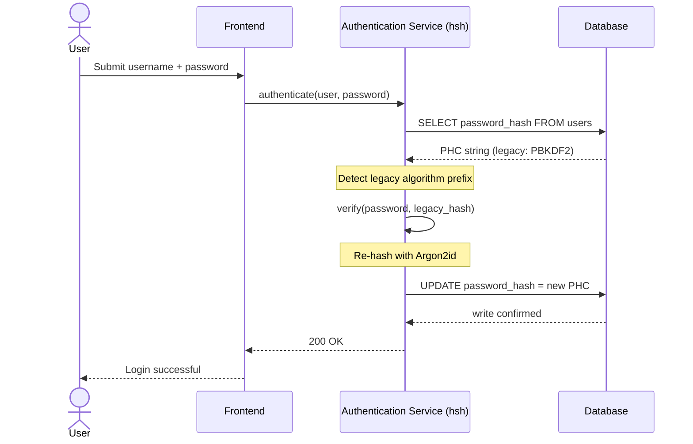
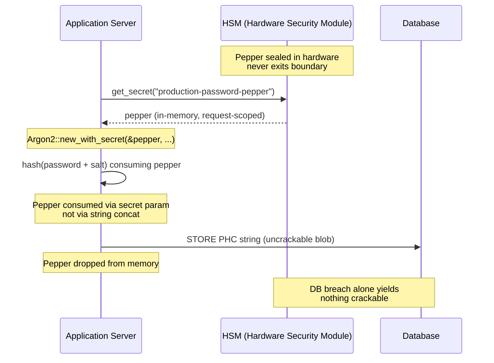

---
# Front Matter (YAML)
author: "contact@sebastienrousseau.com (Sebastien Rousseau)"
banner_alt: "নীল ও সোনালি আলোয় উদ্ভাসিত বিমূর্ত ক্রিপ্টোগ্রাফিক ভল্ট কাঠামো — মেমোরি-নিরাপদ সীমানার দৃশ্যায়ন, যেখানে লিগ্যাসি পাসওয়ার্ড হ্যাশ রিয়েল-টাইমে Argon2id-এ উন্নীত হয়"
banner_height: "1597"
banner_width: "2584"
banner: "https://cloudcdn.pro/stocks/images/crypto-vault-XyZ1bLQnP9.webp"
cdn: "https://cloudcdn.pro"
charset: "UTF-8"
cname: "sebastienrousseau.com"
copyright: "© Copyright 2025 - 2026 - Sebastien Rousseau. All rights reserved."
date: "২২ জুন, ২০২৬"
description: "hsh — pure-Rust ক্রিপ্টোগ্রাফিক ফ্রেমওয়ার্ক; টিয়ার-১ ব্যাংককে শূন্য ডাউনটাইমে Argon2id-এ মাইগ্রেশন, HSM পেপারিং ও DORA পরিপালনে সক্ষম করে।"
format-detection: "telephone=no"
hreflang: "bn"
icon: "https://cloudcdn.pro/clients/sebastienrousseau/v1/logos/sebastienrousseau.svg"
id: "https://sebastienrousseau.com/2026-06-22-hsh-zero-downtime-cryptographic-stewardship-rust-banking-2026"
image_alt: "সেবাস্তিয়ান রুসোর সাদা-কালো প্রতিকৃতি"
image_height: "162"
image_width: "162"
image: "https://cloudcdn.pro/stocks/images/sebastien-rousseau.png"
keywords: "hsh, Rust ক্রিপ্টোগ্রাফি, পাসওয়ার্ড হ্যাশিং, Argon2id, ব্যাংকিং নিরাপত্তা, HSM ইন্টারলক, DORA পরিপালন, Basel III, শূন্য-ডাউনটাইম মাইগ্রেশন, মেমোরি নিরাপত্তা, PBKDF2, scrypt, সাইবার পুনরুদ্ধার"
language: "bn-BD"
last_reviewed: "2026-06-22"
layout: "report"
locale: "bn_BD"
logo_alt: "সেবাস্তিয়ান রুসোর লোগো"
logo_height: "44"
logo_width: "44"
logo: "https://cloudcdn.pro/clients/sebastienrousseau/v1/logos/sebastienrousseau.svg"
measurementID: "G-169G4ET5HQ"
name: "Sebastien Rousseau"
permalink: "https://sebastienrousseau.com/2026-06-22-hsh-zero-downtime-cryptographic-stewardship-rust-banking-2026"
rating: "general"
referrer: "no-referrer"
robots: "index, follow"
schema: "FAQPage, Article"
seo_title: "hsh: ব্যাংকিংয়ের জন্য Rust-এ শূন্য-ডাউনটাইম ক্রিপ্টো স্টুয়ার্ডশিপ"
short_name: "sebastienrousseau"
subtitle: "কীভাবে একটি pure-Rust ক্রিপ্টোগ্রাফিক ফ্রেমওয়ার্ক ব্যাংককে HSM ইন্টারলকসহ লিগ্যাসি পাসওয়ার্ডকে Argon2id-এ নির্বিঘ্নে উন্নীত করতে সক্ষম করে — এবং DORA ও Basel III পরিপালনের জন্য এর অর্থ কী।"
tags: "hsh, Rust, ব্যাংকিং, ক্রিপ্টোগ্রাফি, Argon2id, HSM, DORA, Basel-III, নিরাপত্তা, ওপেন-সোর্স, পরিচালন-স্থিতিস্থাপকতা"
theme-color: "0, 83, 191"
title: "এন্টারপ্রাইজ ব্যাংকিংয়ে পাসওয়ার্ড ব্যবস্থাপনা সুরক্ষিত করা: hsh-এর মাধ্যমে মাল্টি-অ্যালগরিদম হ্যাশিং ও আপগ্রেড"
url: "https://sebastienrousseau.com/2026-06-22-hsh-zero-downtime-cryptographic-stewardship-rust-banking-2026"
viewport: "width=device-width, initial-scale=1, shrink-to-fit=no"

# RSS
atom_link: "https://sebastienrousseau.com/2026-06-22-hsh-zero-downtime-cryptographic-stewardship-rust-banking-2026/rss.xml"
category: "Technology"
generator: "Static Site Generator (SSG) (version 0.0.40)"
item_description: "hsh — pure-Rust ক্রিপ্টোগ্রাফিক ফ্রেমওয়ার্ক; টিয়ার-১ ব্যাংককে শূন্য ডাউনটাইমে Argon2id-এ মাইগ্রেশন, HSM পেপারিং ও DORA পরিপালনে সক্ষম করে।"
item_pub_date: "Mon, 22 Jun 2026 07:07:07 +0000"
item_title: "এন্টারপ্রাইজ ব্যাংকিংয়ে পাসওয়ার্ড ব্যবস্থাপনা সুরক্ষিত করা: hsh-এর মাধ্যমে মাল্টি-অ্যালগরিদম হ্যাশিং ও আপগ্রেড"
pub_date: "Mon, 22 Jun 2026 07:07:07 +0000"
type: "article"

# Twitter Card
twitter_card: "summary_large_image"
twitter_creator: "@wwdseb"
twitter_description: "hsh টিয়ার-১ ব্যাংককে শূন্য ডাউনটাইমে লিগ্যাসি পাসওয়ার্ড হ্যাশ Argon2id-এ স্থানান্তরে, HSM ইন্টারলকে ও মেমোরি-নিরাপদ Rust-এ সক্ষম করে।"
twitter_image: "https://cloudcdn.pro/clients/sebastienrousseau/v1/logos/sebastienrousseau.svg"
twitter_title: "hsh: Rust-এ শূন্য-ডাউনটাইম ক্রিপ্টোগ্রাফিক স্টুয়ার্ডশিপ"
twitter_url: "https://sebastienrousseau.com/2026-06-22-hsh-zero-downtime-cryptographic-stewardship-rust-banking-2026"

excerpt: "GPU-ত্বরিত ডিক্রিপশন ও DORA নির্দেশনার যুগে ক্রিপ্টোগ্রাফিক ক্ষয় একটি সিস্টেমিক ঝুঁকি। ব্যাংকিং ডেটাবেসে পড়ে থাকা প্রতিটি লিগ্যাসি PBKDF2 বা scrypt হ্যাশ আপসের দিকে এগোনো একটি কাউন্টডাউন। hsh এই ছবি বদলে দেয় — শূন্য-ডাউনটাইম, মেমোরি-নিরাপদ আপগ্রেডের মাধ্যমে..."

# Added by fix_hsh_frontmatter.py (template completeness)
apple_mobile_web_app_orientations: "portrait"
apple_touch_icon_sizes: "192x192"
apple-mobile-web-app-capable: "yes"
apple-mobile-web-app-status-bar-inset: "black"
apple-mobile-web-app-status-bar-style: "black-translucent"
apple-touch-fullscreen: "yes"
author_location: "London, United Kingdom"
author_twitter: "@wwdseb"
author_website: "https://sebastienrousseau.com"
docs: https://validator.w3.org/feed/docs/rss2.html
item_guid: "https://sebastienrousseau.com/2026-06-22-hsh-zero-downtime-cryptographic-stewardship-rust-banking-2026/rss.xml"
item_link: "https://sebastienrousseau.com/2026-06-22-hsh-zero-downtime-cryptographic-stewardship-rust-banking-2026/rss.xml"
last_build_date: "Mon, 22 Jun 2026 06:06:06 +0000"
managing_editor: "contact@sebastienrousseau.com (Sebastien Rousseau)"
menu: "active"
msapplication-navbutton-color: "0, 83, 191"
site_components: "Kaishi, Kaishi Builder, Kaishi CLI, Kaishi Templates, Kaishi Themes"
site_last_updated: "2023-07-05"
site_software: "Static Site Generator, Rust"
site_standards: "HTML5, CSS3, RSS, Atom, JSON, XML, YAML, Markdown, TOML"
ttl: "60"
twitter_site: "@wwdseb"
webmaster: "contact@sebastienrousseau.com"
apple-mobile-web-app-title: "hsh: Rust password hashing"
thanks: "পড়ার জন্য ধন্যবাদ!"
twitter_image_alt: "সেবাস্তিয়ান রুসোর সাদা-কালো প্রতিকৃতি"
---

# এন্টারপ্রাইজ ব্যাংকিংয়ে পাসওয়ার্ড ব্যবস্থাপনা সুরক্ষিত করা: hsh-এর মাধ্যমে মাল্টি-অ্যালগরিদম হ্যাশিং ও আপগ্রেড

<aside class="post-lead" aria-label="Article summary">
<p class="post-lead-tldr"><strong>TL;DR.</strong> <a href="https://github.com/sebastienrousseau/hsh">hsh</a> একটি ওপেন-সোর্স, pure-Rust ক্রিপ্টোগ্রাফিক ফ্রেমওয়ার্ক — যা টিয়ার-১ ব্যাংককে শূন্য সেবা-বিঘ্নে লিগ্যাসি পাসওয়ার্ড হ্যাশ Argon2id-এর মতো আধুনিক মানে স্থানান্তরে সক্ষম করে। HSM-সমর্থিত পেপারিং সংহত করে এবং C-ভিত্তিক FFI র‍্যাপার ছাড়াই কঠোর মেমোরি নিরাপত্তা প্রয়োগ করে, এটি সেই ক্রিপ্টোগ্রাফিক ক্ষয় দুর্বলতা বন্ধ করে যা সরাসরি DORA ও Basel III পরিপালনকে হুমকিতে ফেলে।</p>
<p class="post-lead-heading"><strong>মূল শিক্ষা</strong></p>
<ul class="post-lead-takeaways">
  <li><strong>ক্রিপ্টোগ্রাফিক ক্ষয়ের সমস্যা।</strong> PBKDF2-এর মতো লিগ্যাসি অ্যালগরিদম হার্ডওয়্যার ত্বরণের সঙ্গে সূচকীয় হারে দুর্বল হয়, ক্রেডেনশিয়াল-স্টাফিং ও অফলাইন ব্রুট-ফোর্স অভিযানের জন্য আক্রমণ পৃষ্ঠ বিস্তৃত হয়।</li>
  <li><strong>শূন্য-ডাউনটাইম মাইগ্রেশন।</strong> <code>verify_and_upgrade</code> প্যাটার্ন স্বাভাবিক লগইন ঘটনাকালে ব্যবহারকারীর ক্রেডেনশিয়াল স্বচ্ছভাবে রিহ্যাশ করে — গণহারে ডেটাবেস মাইগ্রেশনের পরিচালন ঝুঁকি দূর হয়।</li>
  <li><strong>হার্ডওয়্যার ইন্টারলক ও পেপারিং।</strong> Hardware Security Module (HSM) বা ক্লাউড KMS আর্কিটেকচার ব্যবহার করে হ্যাশ মোড়ানো হয় — নিশ্চিত করে শুধুমাত্র ডেটাবেস ভঙ্গের ফলে কোনো ক্র্যাক-যোগ্য প্রার্থী পাসওয়ার্ড পাওয়া যায় না।</li>
  <li><strong>নিয়ন্ত্রক বেসলাইন হিসেবে মেমোরি নিরাপত্তা।</strong> সম্পূর্ণভাবে নিরাপদ Rust-এ পুনর্লিখিত এবং কঠোর নির্ভরতা স্বাস্থ্যবিধির মাধ্যমে প্রয়োগকৃত, hsh সেই বাফার ওভারফ্লো ও সরবরাহ-শৃঙ্খল ঝুঁকি দূর করে যা লিগ্যাসি C-ভিত্তিক ক্রিপ্টোগ্রাফিক লাইব্রেরির অন্তর্নিহিত।</li>
</ul>
<p class="post-lead-related"><strong>সংশ্লিষ্ট পাঠ:</strong> <a href="https://sebastienrousseau.com/2026-06-20-http-handle-zero-dependency-edge-ingress-banking-rust-2026">http-handle: ২০২৬-এ ব্যাংকিংয়ের জন্য উচ্চ-পারফরম্যান্স, শূন্য-নির্ভরতা এজ ইনগ্রেস</a>, <a href="https://sebastienrousseau.com/2026-06-07-autonomous-treasury-index-programmable-liquidity-tokenised-deposits-2026/index.html">২০২৬-এ স্বায়ত্ত ট্রেজারি সূচক</a>।</p>
</aside>
বেশিরভাগ এন্টারপ্রাইজ ব্যাংকিং অথেনটিকেশন এখনো এমন এক পাসওয়ার্ড স্তরের উপর নির্ভর করে যা ২০১৮ সালের হুমকি মডেলের জন্য কঠোর। যে হার্ডওয়্যার তা ভাঙে — সেটি এগিয়ে গেছে। GPU ফার্ম বাড়ার সাথে এবং ক্রিপ্টোগ্রাফিকভাবে প্রাসঙ্গিক কোয়ান্টাম কম্পিউটার (CRQC) কাছাকাছি আসার সাথে, লিগ্যাসি হ্যাশিং — PBKDF2, প্রাথমিক scrypt — আক্রমণকারীদের অফলাইন ক্র্যাক কিউতে ব্যয় করা প্রতি ঘণ্টার কম্পিউটে ক্ষয় হয়। ক্ষয় নীরব: প্রোডাকশন ডেটাবেসের কিছুই আপনাকে জানায় না যে গতকাল যে হ্যাশ শক্তিশালী ছিল আজ আর তা নয়।

[Digital Operational Resilience Act (DORA)](https://eur-lex.europa.eu/eli/reg/2022/2554/oj)-র অধীনে, প্রোডাকশনে অ-আবর্তিত, লিগ্যাসি ক্রিপ্টোগ্রাফিক সম্পদ রেখে যাওয়া আর প্রযুক্তিগত ঋণ নয়। এটি নামকৃত নিয়ন্ত্রক দায়।

[hsh](https://github.com/sebastienrousseau/hsh) এই ব্যবধান বন্ধ করে। একটি pure-Rust ফ্রেমওয়ার্ক — এটি একাধিক হ্যাশ ফরম্যাট পাশাপাশি পরিচালনা করে এবং সক্রিয় লগইন সেশনের সময় উড়ন্ত অবস্থায় দুর্বল ক্রেডেনশিয়াল আপগ্রেড করে। অথেনটিকেশন পরিকাঠামো ২০২৬-এর স্থিতিস্থাপকতা নির্দেশনার সঙ্গে সামঞ্জস্যপূর্ণ হয় — কোনো রক্ষণাবেক্ষণ উইন্ডো ছাড়া, কোনো জোরপূর্বক রিসেট ছাড়া, এক সেকেন্ডের ডাউনটাইম ছাড়া।

## ০১. ব্যাংকিংয়ে ক্রিপ্টোগ্রাফিক ক্ষয়ের সমস্যা

hsh-এর মতো একটি ফ্রেমওয়ার্কের প্রয়োজনীয়তা বুঝতে হলে, প্রথমে পাসওয়ার্ড হ্যাশের জীবনচক্র বুঝতে হবে। অ্যালগরিদম মার্জিতভাবে বয়স্ক হয় না; তারা সেই হার্ডওয়্যারের তুলনায় ক্ষয় হয় — যা তাদের ভাঙার জন্য উপলব্ধ।

**ASIC/GPU ত্বরণের ফারাক।** PBKDF2-এর মতো অ্যালগরিদম CPU-র জন্য গণনাগতভাবে ব্যয়বহুল হিসেবে ডিজাইন করা হয়েছিল। আজ, আক্রমণকারীরা অত্যন্ত সমান্তরাল GPU ব্যবহার করে অফলাইন অভিধান আক্রমণ চালায়। ২০১৮ সালে তৈরি একটি লিগ্যাসি হ্যাশ ২০২৬-এর প্রতিপক্ষের বিরুদ্ধে অনেক বেশি দুর্বল।

**বিগ-ব্যাং মাইগ্রেশন ঝুঁকি।** যখন একজন CISO PBKDF2 থেকে Argon2id-এর মতো একটি মেমোরি-হার্ড অ্যালগরিদমে আপগ্রেড করার সিদ্ধান্ত নেন, তিনি হ্যাশ বিপরীত করে পুনরায় এনক্রিপ্ট করতে পারেন না। প্রচলিত সমাধান — কয়েক মিলিয়ন ব্যবহারকারীকে পাসওয়ার্ড রিসেটে বাধ্য করা — বিশাল গ্রাহক ঘর্ষণ ও পরিচালন ঝুঁকি তৈরি করে।

**C-লাইব্রেরি সরবরাহ শৃঙ্খল।** ঐতিহাসিকভাবে, ব্যাংকিং মিডলওয়্যার হ্যাশিংয়ের জন্য `argonautica`-র মতো লাইব্রেরি বা কাঁচা C বাইন্ডিংয়ের উপর নির্ভর করেছে। এই লাইব্রেরিগুলো একটি লুকানো সরবরাহ-শৃঙ্খল ঝুঁকি বহন করে: অথেনটিকেশন মডিউলে একটি একক মেমোরি-বাফার ওভারফ্লো ব্যাংকিং স্ট্যাকের সবচেয়ে বিশেষাধিকারপ্রাপ্ত স্তরে রিমোট কোড এক্সিকিউশন (RCE) ঘটাতে পারে।

### অ্যালগরিদম তুলনা — হার্ডওয়্যার প্রতিরোধ ও টিউনিং পৃষ্ঠ

মাইগ্রেশন কর্পাসে একটি ব্যাংক বাস্তবে যে তিনটি অ্যালগরিদমের মুখোমুখি হয় — তাদের পার্থক্য ক্রিপ্টোগ্রাফিক প্রিমিটিভ পছন্দে কম, বরং হার্ডওয়্যার চাপে কীভাবে বয়স্ক হয় তাতেই বেশি। নিচের সারণি ব্যবহারিক অবস্থান সংক্ষেপে তুলে ধরে।

| অ্যালগরিদম | মেমোরি-হার্ড | GPU / ASIC প্রতিরোধ | টিউনিং পৃষ্ঠ | ২০২৬ অবস্থা |
| ---- | ---- | ---- | ---- | ---- |
| **PBKDF2** | না | নিম্ন — GPU-তে ভেক্টরাইজ হয়; পণ্য হার্ডওয়্যারে প্রতি অনুমানে সাব-মিলিসেকেন্ড। | শুধুমাত্র পুনরাবৃত্তি সংখ্যা। | লিগ্যাসি। মাইগ্রেশনের সময় শুধুমাত্র যাচাই-পার্শ্ব ফলব্যাক হিসেবে গ্রহণযোগ্য। |
| **scrypt** | হ্যাঁ (পরিমিত) | মাঝারি — মেমোরি খরচ সরল GPU ফার্মকে পরাজিত করে; বড় স্কেলে ASIC-অ্যামর্টাইজযোগ্য। | `N` (CPU/মেমোরি), `r` (ব্লক আকার), `p` (সমান্তরালতা)। | গ্রিনফিল্ডের জন্য অবচিত। মাইগ্রেশন কর্পাসে সক্রিয়। |
| **Argon2id** | হ্যাঁ (উচ্চ) | উচ্চ — মেমোরি- ও সময়-হার্ড; সাইড-চ্যানেল ও TMTO আক্রমণ প্রতিরোধ করে। | মেমোরি খরচ (`m`), সময় খরচ (`t`), সমান্তরালতা (`p`), গোপন (পেপার)। | প্রস্তাবিত ডিফল্ট। OWASP, NIST SP 800-63B-4 খসড়া, FedRAMP। |

মাইগ্রেশন পরিকল্পনার জন্য সারমর্ম সংকীর্ণ: PBKDF2 একটি *যাচাই-পার্শ্ব* অবস্থা, *লেখা-পার্শ্ব* গন্তব্য নয়। PBKDF2 রেকর্ডে প্রতিটি সফল লগইনের প্রস্থানে একটি Argon2id রেকর্ড তৈরি হওয়া উচিত।

## ০২. hsh ২০২৬ আর্কিটেকচার দৃষ্টিকোণ

ফ্রেমওয়ার্কটি পাঁচটি মূল স্তরে গঠিত — প্রতিটি একটি নির্দিষ্ট পরিচালন ঝুঁকি বিভাগ প্রশমিত করতে প্রকৌশলিত।

### সারণি ১: hsh আর্কিটেকচার স্তর ও ঝুঁকি প্রশমন

| স্তর | ডিজাইন সিদ্ধান্ত | কেন গুরুত্বপূর্ণ | অপব্যবস্থাপনার ঝুঁকি |
| ---- | ---- | ---- | ---- |
| **ক্রিপ্টোগ্রাফিক প্রিমিটিভ** | Argon2id, scrypt ও PBKDF2 সমর্থনকারী একীভূত PHC স্ট্রিং ফরম্যাট | পশ্চাদমুখী সামঞ্জস্য বজায় রেখে GPU আক্রমণের বিরুদ্ধে সেরা-শ্রেণির প্রতিরোধ দেয়। | ডেটা সাইলো; দুর্বল অ্যালগরিদম প্রতি সেকেন্ডে ১০০ বিলিয়নেরও বেশি অফলাইন অনুমান অনুমোদন করছে। |
| **নীতি ইঞ্জিন** | `verify_and_upgrade` ডিসপ্যাচ | লগইনে গতিশীলভাবে লিগ্যাসি থেকে আধুনিক নীতিতে রূপান্তর স্বয়ংক্রিয় করে। | নিরাপত্তা ক্ষয়; সক্রিয় ব্যবহারকারী সহজে ক্র্যাক-যোগ্য লিগ্যাসি হ্যাশ ধরনে থেকে যাচ্ছে। |
| **হার্ডওয়্যার ইন্টারলক** | HSM ও Cloud KMS "পেপারিং" সক্ষমতা | নিশ্চিত করে শুধুমাত্র ডেটাবেস ভঙ্গে প্রার্থী পাসওয়ার্ড উন্মোচিত হয় না। | SQL ইনজেকশন ভঙ্গের পরে অফলাইন ব্রুট-ফোর্স আক্রমণ সফল হচ্ছে। |
| **নিরাপত্তা স্বাস্থ্যবিধি** | `deny.toml` প্রয়োগ ও pure Rust | অনিরাপদ FFI ও অবিশ্বস্ত বাহ্যিক C-নির্ভরতা সম্পূর্ণরূপে আটকায়। | বিপর্যয়কর সরবরাহ শৃঙ্খল আক্রমণ ও মেমোরি-দুর্নীতি CVE। |

## ০৩. শূন্য-ডাউনটাইম রিহ্যাশ পথ

`verify_and_upgrade` প্যাটার্ন একটি বুদ্ধিমান, অবস্থা-সচেতন ডিসপ্যাচিং সিস্টেমের মাধ্যমে ডেটা মাইগ্রেশনের সমস্যা সমাধান করে — যার জন্য শূন্য ডেটাবেস ডাউনটাইম প্রয়োজন।

যখন একজন ব্যবহারকারী তাদের ক্রেডেনশিয়াল জমা দেয়, hsh সংরক্ষিত Password Hashing Competition (PHC) স্ট্রিং পড়ে। যদি এটি একটি লিগ্যাসি হ্যাশ ধারণ করে (যেমন একটি পুরোনো PBKDF2 কনফিগারেশন), সিস্টেম নিম্নলিখিত প্রবাহ কার্যকর করে:

1. **শনাক্তকরণ:** লিগ্যাসি অ্যালগরিদম ও এর নির্দিষ্ট প্যারামিটার পার্স করে।
2. **যাচাইকরণ:** লিগ্যাসি হ্যাশের বিপরীতে প্রার্থী পাসওয়ার্ড বৈধতা দেয়।
3. **রিয়েল-টাইম আপগ্রেড:** সফল মিল পাওয়া গেলে, এটি মেমোরিতে থাকা প্লেইনটেক্সট প্রার্থী পাসওয়ার্ড নেয় এবং অবিলম্বে অত্যন্ত নিরাপদ Argon2id নীতি ব্যবহার করে একটি নতুন হ্যাশ গণনা করে।
4. **স্থায়িত্ব:** এটি ব্যাংকিং অ্যাপ্লিকেশনে নতুন PHC স্ট্রিং ফেরত দেয় — যা ডেটাবেসে লিগ্যাসি রেকর্ড ওভাররাইট করে।

এই প্রক্রিয়া শেষ-ব্যবহারকারীর কাছে সম্পূর্ণ স্বচ্ছ। এটি কার্যকরভাবে সবচেয়ে সক্রিয় অ্যাকাউন্টগুলোকে প্রথম দিনেই সর্বোচ্চ নিরাপত্তা স্তরে স্থানান্তরিত করে — সময়ের সঙ্গে স্বাভাবিকভাবে ব্যাংকের আক্রমণ পৃষ্ঠ নাটকীয়ভাবে কমিয়ে আনে।

নিচের সিকোয়েন্স দেখায় একটি একক লগইন ঘটনার সময় কী ঘটে — যখন সংরক্ষিত রেকর্ড একটি লিগ্যাসি অ্যালগরিদমে আছে। ব্যবহারকারী কোনো পরিবর্তন দেখেন না; ব্যাংকের অথেনটিকেশন এস্টেট এক রেকর্ড পরিমাণে শক্তিশালী হয়।



### বাস্তবায়ন প্যাটার্ন — `verify_and_upgrade` ডিসপ্যাচ

একটি অথেনটিকেশন সার্ভিসের ভিতরে ইন্টিগ্রেশন পৃষ্ঠ ছোট। লিগ্যাসি কোড পথ ফলব্যাক হিসেবেই থাকে; নতুন কোড পথটিই ডিসপ্যাচার।

```rust
use hsh::{Hasher, UpgradeResult};

struct UserRecord {
    username: String,
    password_hash: String, // PHC string
}

async fn authenticate(user: UserRecord, password_attempt: &str) -> Result<bool, AuthError> {
    let hasher = Hasher::new();
    match hasher.verify_and_upgrade(password_attempt, &user.password_hash) {
        Ok(UpgradeResult::Verified(is_valid)) => Ok(is_valid),
        Ok(UpgradeResult::Upgraded(new_hash)) => {
            db::update_user_hash(&user.username, new_hash).await?;
            Ok(true)
        }
        Err(_) => Err(AuthError::InvalidCredentials),
    }
}
```

তিনটি বৈশিষ্ট্য গুরুত্বপূর্ণ:

- **অবস্থা-সচেতনতা।** `verify_and_upgrade` PHC স্ট্রিং উপসর্গ পরিদর্শন করে। অ্যালগরিদম মার্কার লিগ্যাসি হলে, ফ্রেমওয়ার্ক কনফিগারকৃত Argon2id নীতির বিপরীতে স্বয়ংক্রিয়ভাবে রিহ্যাশ ট্রিগার করে। কলিং কোডে কোনো শাখা প্রয়োজন নেই।
- **পরমাণুতা।** লিগ্যাসি যাচাই সফল হওয়ার পরই রিহ্যাশ ঘটে, একই অথেনটিকেশন ঘটনার ভিতরে। কোনো আলাদা ব্যাচ জব নেই, কোনো নির্ধারিত মাইগ্রেশন উইন্ডো নেই, এবং ফেরানোর জন্য কোনো ধ্বংসাত্মক গণহারে মাইগ্রেশনও নেই।
- **স্থায়িত্ব।** `UpgradeResult::Upgraded` ভ্যারিয়েন্ট নতুন PHC স্ট্রিং বহন করে। অ্যাপ্লিকেশন এটিকে সেই একই ডেটা পথের মাধ্যমে স্থায়ী করে — যা লিগ্যাসি রেকর্ডের জন্য ইতিমধ্যেই আছে — কোনো সমান্তরাল লেখা পৃষ্ঠ নেই, কোনো দ্বি-পর্যায়ের লেখা প্রোটোকল নেই।

**ব্যর্থতার ধরন।** আপগ্রেড লেখার সময় ডেটাবেস লেখা ব্যর্থ হলে বা KMS সংক্ষিপ্তভাবে অগম্য হলে, সেশন এখনও লিগ্যাসি হ্যাশের বিপরীতে সফল হয় এবং রেকর্ড পুরোনো অ্যালগরিদমেই থেকে যায়। পরবর্তী সফল লগইন আপগ্রেডটি পুনরায় চেষ্টা করে। কোনো অর্ধ-মাইগ্রেটেড অবস্থা নেই এবং ব্যবহারকারী-দৃশ্যমান কোনো ব্যর্থতা নেই — মাইগ্রেশন লগইন ঘটনাগুলো জুড়ে একমুখী, এবং একটি ব্যর্থ আপগ্রেডের প্রতি-রেকর্ড খরচ পরবর্তী লগইনে ঠিক একটি অতিরিক্ত পুনঃপ্রচেষ্টা।

## ০৪. HSM / KMS ইন্টারলকের মাধ্যমে পেপার্ড হ্যাশ

স্ট্যান্ডার্ড পাসওয়ার্ড হ্যাশিং সরাসরি ডেটাবেস ফাঁসের বিরুদ্ধে রক্ষা করে — কিন্তু আক্রমণকারী যদি ডেটাবেস (হ্যাশ ও সল্ট) উভয়ই হাতে পায়, তারা অফলাইন ক্র্যাকিং চালাতে পারে।

hsh একটি দৃঢ় "পেপার্ড" নিরাপত্তা স্তর প্রবর্তন করে। Hardware Security Module (HSM) বা ক্লাউড-নেটিভ Key Management Service (KMS)-এর সঙ্গে সংহত করে, চূড়ান্ত Argon2id আউটপুট একটি উচ্চ-এনট্রপি কী দিয়ে ক্রিপ্টোগ্রাফিকভাবে মোড়ানো হয় — যে কী কখনও নিরাপদ হার্ডওয়্যার সীমানা ছাড়ে না। যদি ব্যবহারকারী ডেটাবেস বের করে নেওয়া হয়, আক্রমণকারী শুধুমাত্র এনক্রিপ্টেড ব্লব ধারণ করে। তারা ব্যাংকের শারীরিকভাবে বিচ্ছিন্ন HSM পরিকাঠামোতে ভঙ্গ না করে পাসওয়ার্ড ক্র্যাকিং শুরু করতে পারে না।

নিচের আর্কিটেকচার ডায়াগ্রামটি গোপনীয় পথ অনুসরণ করে। পেপার কখনও ডেটাবেসে নামে না; ডেটাবেস নিজে থেকে অ্যাড্রেসেবল কিছু ধারণ করে না। দুটি স্টোর স্বাধীনভাবে ব্যর্থ হতে পারে — সিস্টেম কেবল তখনই গোপনীয়তা হারায় যখন দুটি একসঙ্গে ব্যর্থ হয়।



### বাস্তবায়ন প্যাটার্ন — HSM-সমর্থিত পেপার্ড Argon2id

পেপার অনুরোধের সময়ে HSM থেকে উৎস হয়, কোনো কনফিগারেশন ফাইল থেকে নয়। `Argon2::new_with_secret` এটিকে অ্যালগরিদমের গোপন প্যারামিটারের মাধ্যমে গ্রহণ করে, স্ট্রিং সংযোজনের মাধ্যমে নয়।

```rust
use argon2::{
    Argon2, Algorithm, Version, Params,
    PasswordHasher, PasswordVerifier,
    password_hash::{PasswordHash, SaltString, rand_core::OsRng},
};

async fn authenticate_with_hsm(
    user: UserRecord,
    password_attempt: &str,
) -> Result<bool, AuthError> {
    let pepper = hsm::client::get_secret("production-password-pepper").await?;
    let hasher = Argon2::new_with_secret(
        &pepper,
        Algorithm::Argon2id,
        Version::V0x13,
        Params::default(),
    )
    .map_err(|_| AuthError::Internal)?;

    let parsed = PasswordHash::new(&user.password_hash)
        .map_err(|_| AuthError::InvalidCredentials)?;
    if hasher.verify_password(password_attempt.as_bytes(), &parsed).is_ok() {
        if is_legacy_hash(&user.password_hash) {
            let new_hash = hasher
                .hash_password(
                    password_attempt.as_bytes(),
                    &SaltString::generate(&mut OsRng),
                )
                .map_err(|_| AuthError::Internal)?
                .to_string();
            db::update_user_hash(&user.username, new_hash).await?;
        }
        return Ok(true);
    }
    Err(AuthError::InvalidCredentials)
}
```

এই গঠন থেকে তিনটি DORA-সঙ্গতিপূর্ণ পরিণতি বেরিয়ে আসে:

- **কী আবর্তন একটি কী-ব্যবস্থাপনা সমস্যা হিসেবে।** পেপার HSM/KMS সীমানার পিছনে থাকে, ডেটাবেসে নয়। আবর্তন ব্যবহারকারী এস্টেট জুড়ে একটি রিহ্যাশিং অভিযান নয়, বরং একটি কী-ব্যবস্থাপনা পরিবর্তন হয়ে ওঠে। নতুন হ্যাশ বর্তমান পেপার সংস্করণের সঙ্গে আবদ্ধ হয়; পুরোনো হ্যাশ স্বাভাবিকভাবে আপগ্রেড না হওয়া পর্যন্ত তাদের আবদ্ধ সংস্করণের অধীনে যাচাই হয়।
- **দায়িত্ব পৃথকীকরণ।** যে সার্ভিস পরিচয় পেপার পড়ে, তা অডিটযোগ্য ও সর্বনিম্ন-বিশেষাধিকারপ্রাপ্ত হতে হবে। সংশ্লিষ্ট HSM মঞ্জুরি ছাড়া একটি সম্পূর্ণ ডেটাবেস বের করে নেওয়া কিছুই ক্র্যাক-যোগ্য দেয় না। ডেটাবেস ছাড়া একটি HSM-মঞ্জুরি আপস কিছুই সম্বোধনযোগ্য দেয় না। যেকোনো একক ব্যর্থতার ক্ষতির পরিধি সীমাবদ্ধ।
- **দৈর্ঘ্য-সম্প্রসারণ ও কনক্যাট বাগ এড়ানো।** স্ট্রিং সংযোজনের পরিবর্তে Argon2-এর গোপন প্যারামিটার ব্যবহার করলে — দৈর্ঘ্য-সম্প্রসারণ, ভুল-টাইপ করা UTF-8 সংযোজন, সল্ট/পেপার-ক্রম বাগ — এর মতো একটি পুরো শ্রেণির ক্রিপ্টোগ্রাফিক ফাঁদ বাস্তবায়ন পৃষ্ঠ থেকে সরানো হয়।

## ০৫. নিয়ন্ত্রক সামঞ্জস্য: DORA, Basel III ও SM&CR

- **DORA Article 5 ও 6:** আর্থিক সত্তাগুলোকে ICT ঝুঁকি ব্যবস্থাপনা ফ্রেমওয়ার্ক বজায় রাখতে বাধ্য করে। অ-আবর্তিত, এক দশক পুরোনো পাসওয়ার্ড হ্যাশের উপর নির্ভরশীল কৌশল এই নীতি লঙ্ঘন করে। hsh ক্রিপ্টোগ্রাফিক সুরক্ষা ক্রমাগত উন্নয়নের জন্য একটি নথিভুক্ত, স্বয়ংক্রিয় প্রক্রিয়া প্রদান করে।
- **Basel III:** নিয়ন্ত্রক মূলধনকে ক্ষতির ঘটনার সম্ভাবনা ও তীব্রতার সঙ্গে সংযুক্ত করে। HSM ইন্টারলকসহ Argon2id বাস্তবায়ন করলে ডেটাবেস ভঙ্গের তীব্রতা নাটকীয়ভাবে কমে — যা কম পরিচালন-ঝুঁকি মূলধন বরাদ্দের জন্য পরিমাপযোগ্য যুক্তিকে সমর্থন করে।
- **SM&CR জবাবদিহিতা:** এমন একটি আর্কিটেকচার অনুমোদন করা যা সক্রিয়ভাবে ক্রিপ্টোগ্রাফিক ক্ষয় প্রতিকার করে — নামকৃত সিনিয়র ম্যানেজারদের একটি যাচাইযোগ্য, নথিভুক্ত ঝুঁকি হ্রাসের শৃঙ্খল প্রদান করে।

## উপসংহার

ডিপ্লয়-ও-ভুলে-যাও পাসওয়ার্ড হ্যাশিংয়ের যুগ শেষ। DORA ক্রিপ্টোগ্রাফিক নিষ্ক্রিয়তাকে প্রযুক্তিগত ঋণ থেকে নামকৃত নিয়ন্ত্রক দায়ে স্থানান্তরিত করেছে — এবং হার্ডওয়্যার বক্ররেখা প্রতি বছর আরও খাড়া হচ্ছে। hsh-এর অবদান একটি শক্তিশালী অ্যালগরিদম নয় — Argon2id বছরের পর বছর উপলব্ধ। অবদানটি হল সেই পরিচালনাগত যন্ত্রপাতি — যা ডাউনটাইম নির্ধারণ ছাড়াই, ব্যবহারকারীকে রিসেটে বাধ্য না করেই এবং ব্যাংকের অথেনটিকেশন পথে C-ভিত্তিক FFI শিমকে বিশ্বাস না করেই এতে স্থানান্তর করে।

[hsh সোর্স কোড](https://github.com/sebastienrousseau/hsh) MIT ও Apache 2.0 দ্বৈত লাইসেন্সের অধীনে উপলব্ধ।

<aside class="author-card" aria-label="About the author"><span class="author-card-body"><strong class="author-card-name"><a href="/about/index.html">Sebastien Rousseau</a></strong><span class="author-card-bio">সিনিয়র ব্যাংকিং প্রযুক্তিবিদ — প্রয়োগকৃত AI, ISO 20022 মাইগ্রেশন, আর্থিক সেবার জন্য পোস্ট-কোয়ান্টাম ক্রিপ্টোগ্রাফি ও পাইকারি পেমেন্টের কাঠামোগত রূপান্তর নিয়ে লেখেন।</span><span class="author-credentials">HSBC Commercial & Investment Bank, PayPal, Barclays, Shazam জুড়ে ২০+ বছর। <a href="https://www.linkedin.com/in/sebastienrousseau/" rel="external noopener">LinkedIn</a> &middot; <a href="https://github.com/sebastienrousseau" rel="external noopener">GitHub</a></span></span></aside>
<p class="post-reviewed">সর্বশেষ পর্যালোচনা <time datetime="2026-06-22">2026-06-22</time>।</p>
