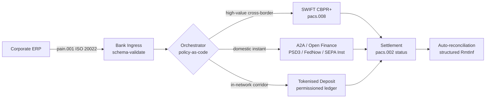

---

# Front Matter (YAML)

author: "contact@sebastienrousseau.com (Sebastien Rousseau)"
banner_alt: "ভোরবেলা গভীর-জলের বন্দরে কন্টেইনার জাহাজ — ২০২৬-এ ISO 20022, ওপেন ফিনান্স ও টোকেনাইজড-ডিপোজিট নিষ্পত্তি নেটওয়ার্ক জুড়ে কর্পোরেট মূল্যের বহু-রেল, আন্তঃসীমান্ত চলাচলের প্রতীক"
banner_height: "1597"
banner_width: "2584"
banner: "https://cloudcdn.pro/stocks/images/viktor-forgacs-KxVRDiFdTVo.webp"
cdn: "https://cloudcdn.pro"
charset: "UTF-8"
cname: "sebastienrousseau.com"
copyright: "© Copyright 2025 - 2026 - Sebastien Rousseau. All rights reserved."
date: "২৪ জুন, ২০২৬"
description: "২০২৬-এ ISO 20022, A2A, PSD3/FiDA-র অধীন ওপেন ফিনান্স ও টোকেনাইজড ডিপোজিট কীভাবে SWIFT-এর পাশাপাশি আন্তঃসীমান্ত কর্পোরেট ট্রেজারিকে পুনর্গঠন করছে।"
format-detection: "telephone=no"
hreflang: "bn"
icon: "https://cloudcdn.pro/clients/sebastienrousseau/v1/logos/sebastienrousseau.svg"
id: "https://sebastienrousseau.com/2026-06-24-cross-border-iso-20022-open-finance-tokenised-deposits-treasury-2026"
image_alt: "সেবাস্তিয়ান রুসোর সাদা-কালো প্রতিকৃতি"
image_height: "162"
image_width: "162"
image: "https://cloudcdn.pro/stocks/images/sebastien-rousseau.png"
keywords: "আন্তঃসীমান্ত পেমেন্ট, ISO 20022, ওপেন ফিনান্স, PSD3, FiDA, টোকেনাইজড ডিপোজিট, স্টেবলকয়েন, A2A, ট্রেজারি, CIB, Nexi, Mastercard, মাল্টি-রেল, pacs.008, pain.001, SWIFT, FedNow, SEPA Instant, RTP, CBPR+"
language: "bn-BD"
last_reviewed: "2026-06-24"
layout: "report"
locale: "bn_BD"
logo_alt: "সেবাস্তিয়ান রুসোর লোগো"
logo_height: "44"
logo_width: "44"
logo: "https://cloudcdn.pro/clients/sebastienrousseau/v1/logos/sebastienrousseau.svg"
menu: ""
measurementID: "G-169G4ET5HQ"
name: "Sebastien Rousseau"
permalink: "https://sebastienrousseau.com/2026-06-24-cross-border-iso-20022-open-finance-tokenised-deposits-treasury-2026"
rating: "general"
referrer: "no-referrer"
robots: "index, follow"
schema: "FAQPage, Article"
seo_title: "আন্তঃসীমান্ত ২০২৬: ISO 20022, ওপেন ফিনান্স, টোকেনাইজড রেল"
short_name: "sebastienrousseau"
subtitle: "২০২৬-এ আন্তঃসীমান্ত কর্পোরেট ট্রেজারি মাল্টি-রেল মেকানিক্সে চলে — অভিন্ন ব্যাকরণ হিসেবে ISO 20022, গ্রাহকমুখী রেল হিসেবে A2A ও ওপেন ফিনান্স, পাইকারি নিষ্পত্তির লেগ হিসেবে টোকেনাইজড ডিপোজিট, এবং দীর্ঘ লেজ এখনও SWIFT-এ নোঙর করা।"
tags: "আন্তঃসীমান্ত পেমেন্ট, ISO 20022, ওপেন ফিনান্স, PSD3, FiDA, টোকেনাইজড ডিপোজিট, A2A, ট্রেজারি, CIB, মাল্টি-রেল, pacs.008, pain.001, SWIFT, FedNow, SEPA Instant, RTP, CBPR+"
theme-color: "0, 83, 191"
title: "আন্তঃসীমান্ত ২০২৬: কর্পোরেট ট্রেজারিতে ISO 20022, ওপেন ফিনান্স ও টোকেনাইজড ডিপোজিট"
url: "https://sebastienrousseau.com/2026-06-24-cross-border-iso-20022-open-finance-tokenised-deposits-treasury-2026"
viewport: "width=device-width, initial-scale=1, shrink-to-fit=no"

# RSS - The RSS feed front matter (YAML).
atom_link: "https://sebastienrousseau.com/2026-06-24-cross-border-iso-20022-open-finance-tokenised-deposits-treasury-2026/rss.xml"
category: "Technology"
docs: https://validator.w3.org/feed/docs/rss2.html
generator: "Static Site Generator (SSG) (version 0.0.26)"
item_description: "২০২৬-এ ISO 20022, A2A, PSD3/FiDA-র অধীন ওপেন ফিনান্স ও টোকেনাইজড ডিপোজিট কীভাবে SWIFT-এর পাশাপাশি আন্তঃসীমান্ত কর্পোরেট ট্রেজারিকে পুনর্গঠন করছে।"
item_guid: "https://sebastienrousseau.com/2026-06-24-cross-border-iso-20022-open-finance-tokenised-deposits-treasury-2026/rss.xml"
item_link: "https://sebastienrousseau.com/2026-06-24-cross-border-iso-20022-open-finance-tokenised-deposits-treasury-2026/rss.xml"
item_pub_date: "Wed, 24 Jun 2026 07:07:07 +0000"
item_title: "আন্তঃসীমান্ত ২০২৬: কর্পোরেট ট্রেজারিতে ISO 20022, ওপেন ফিনান্স ও টোকেনাইজড ডিপোজিট"
last_build_date: "Wed, 24 Jun 2026 06:06:06 +0000"
managing_editor: "contact@sebastienrousseau.com (Sebastien Rousseau)"
pub_date: "Wed, 24 Jun 2026 07:07:07 +0000"
ttl: "60"
type: "article"
webmaster: "contact@sebastienrousseau.com"

# Apple - The Apple front matter (YAML).
apple_mobile_web_app_orientations: "portrait"
apple_touch_icon_sizes: "192x192"
apple-mobile-web-app-capable: "yes"
apple-mobile-web-app-status-bar-inset: "black"
apple-mobile-web-app-status-bar-style: "black-translucent"
apple-mobile-web-app-title: "আন্তঃসীমান্ত ২০২৬: ISO 20022, ওপেন ফিনান্স, টোকেনাইজড রেল"
apple-touch-fullscreen: "yes"

# MS Application - The MS Application front matter (YAML).

msapplication-navbutton-color: "0, 83, 191"

# Twitter Card - The Twitter Card front matter (YAML).

twitter_card: "summary_large_image"
twitter_creator: "@wwdseb"
twitter_description: "২০২৬-এ ISO 20022, A2A, PSD3/FiDA-র অধীন ওপেন ফিনান্স ও টোকেনাইজড ডিপোজিট কীভাবে SWIFT-এর পাশাপাশি আন্তঃসীমান্ত কর্পোরেট ট্রেজারিকে পুনর্গঠন করছে।"
twitter_image: "https://cloudcdn.pro/clients/sebastienrousseau/v1/logos/sebastienrousseau.svg"
twitter_image_alt: "সেবাস্তিয়ান রুসোর লোগো"
twitter_site: "@wwdseb"
twitter_title: "আন্তঃসীমান্ত ২০২৬: ISO 20022, ওপেন ফিনান্স, টোকেনাইজড রেল"
twitter_url: "https://sebastienrousseau.com/2026-06-24-cross-border-iso-20022-open-finance-tokenised-deposits-treasury-2026"

excerpt: "২০২৬-এ আন্তঃসীমান্ত কর্পোরেট ট্রেজারি একটি মাল্টি-রেল প্রকৌশল সমস্যা। ISO 20022 হল অভিন্ন ব্যাকরণ, PSD3/FiDA-র অধীন A2A ও ওপেন ফিনান্স গ্রাহকমুখী রেল, টোকেনাইজড ডিপোজিট পাইকারি নিষ্পত্তির লেগ সামলায় এবং SWIFT এখনও দীর্ঘ লেজ নোঙর করে। আকর্ষণীয় কাজটি অর্কেস্ট্রেশন স্তরে, মডেলে নয়।"

# Humans.txt - The Humans.txt front matter (YAML).
author_website: "https://sebastienrousseau.com"
author_twitter: "@wwdseb"
author_location: "London, UK"
thanks: "পড়ার জন্য ধন্যবাদ!"
site_last_updated: "2026-06-24"
site_standards: "HTML5, CSS3, RSS, Atom, JSON, XML, YAML, Markdown, TOML"
site_components: "Kaishi, Kaishi Builder, Kaishi CLI, Kaishi Templates, Kaishi Themes"
site_software: "Static Site Generator, Rust"

---

# আন্তঃসীমান্ত ২০২৬: কর্পোরেট ট্রেজারিতে ISO 20022, ওপেন ফিনান্স ও টোকেনাইজড ডিপোজিট

<!-- lead-start -->
<aside class="post-lead" aria-label="নিবন্ধ সারসংক্ষেপ">

<strong>সংক্ষেপে।</strong> ২০২৬-এ আন্তঃসীমান্ত কর্পোরেট ট্রেজারি সমান্তরালভাবে চারটি রেলে চলে — SWIFT CBPR+, PSD3/FiDA-র অধীন তাৎক্ষণিক A2A, টোকেনাইজড ডিপোজিট এবং স্টেবলকয়েন রেল — অভিন্ন ব্যাকরণ হিসেবে ISO 20022 দ্বারা সেলাই করা। CIB ও কর্পোরেট ট্রেজারি দলের জন্য কাজটি অর্কেস্ট্রেশন, রেল নির্বাচন নয়।

<strong>মূল শিক্ষা</strong>

<ul class="post-lead-takeaways">
  <li><strong>মাল্টি-রেল ডিফল্ট।</strong> কোনো একক রেল প্রতিটি করিডোর, প্রতিটি টিকেট সাইজ, প্রতিটি কাট-অফ ক্লিয়ার করে না। ট্রেজারি প্রতি পেমেন্টে রেল বেছে নেয়, প্রতি ব্যাংকে নয়।</li>
  <li><strong>ISO 20022 হল অভিন্ন ভাষা।</strong> pacs.008, pacs.009 ও pain.001 এখন RTGS, তাৎক্ষণিক, A2A ও টোকেনাইজড-ডিপোজিট রেল জুড়ে রেমিট্যান্স ডেটা বহন করে — রাউটিং সিদ্ধান্তকে রেল-লকড নয়, ডেটা-চালিত করে।</li>
  <li><strong>ওপেন ফিনান্স পরিধি বিস্তৃত করে।</strong> PSD3 ও FiDA ওপেন-ব্যাংকিং মডেলকে পেনশন, বিমা ও ট্রেজারি ডেটায় ঠেলে দেয়; Nexi ও Mastercard সেই অর্কেস্ট্রেশন স্তর গড়ছে যা কর্পোরেট ব্যবহার করে।</li>
  <li><strong>টোকেনাইজড ডিপোজিট হল পাইকারি লেগ।</strong> ব্যাংক-জারিকৃত টোকেনাইজড ডিপোজিট ও সমন্বিত স্টেবলকয়েন রেল গ্রাহকমুখী তাৎক্ষণিক রেলের নিচে বসে এবং পাইকারি লেগ প্রায় T+0-এ নিষ্পত্তি করে।</li>
</ul>

<strong>সংশ্লিষ্ট পাঠ:</strong> <a href="https://sebastienrousseau.com/2026-06-07-autonomous-treasury-index-programmable-liquidity-tokenised-deposits-2026">স্বায়ত্ত ট্রেজারি ইনডেক্স ২০২৬: প্রোগ্রামেবল লিকুইডিটি ও টোকেনাইজড ডিপোজিট</a>, <a href="https://sebastienrousseau.com/2026-06-15-pacs008-automation-iso-20022-interbank-payments-2026">pacs.008 অটোমেশন: ২০২৬-এ ISO 20022 আন্তঃব্যাংক পেমেন্ট</a>।

</aside>
<!-- lead-end -->

একটি ইউরোপীয় শিল্প কর্পোরেট বুধবার সকালে একজন ব্রাজিলিয়ান সরবরাহকারীকে EUR 4.2 মিলিয়ন প্রদান করে। ট্রেজারি ওয়ার্কস্টেশন একটি ব্যাংক বেছে নেয় না। এটি একটি রেল বেছে নেয় — রেলের একটি ক্রম। গ্রাহকমুখী নির্দেশনা একটি A2A pain.001 বার্তা হিসেবে অবতরণ করে, PSD3-এর অধীন একটি ওপেন ফিনান্স প্রদানকারীর মাধ্যমে রাউট করা। ব্যাংক এটি একটি CIB প্রাইভেট নেটওয়ার্কের ভেতরে টোকেনাইজড ডিপোজিটে দুটি কারেসপন্ডেন্ট অধিক্ষেত্রে নিয়ে যায়। দীর্ঘ লেজ — একজন উপ-সরবরাহকারীর কাছে USD 80,000 ইনভয়েস ক্লিনআপ যার সঙ্গে কোনো টোকেনাইজড-ডিপোজিট সম্পর্ক নেই — এখনও pacs.008 হিসেবে SWIFT CBPR+-এ চলে। গ্রাহক একটি পেমেন্ট দেখেন। আর্কিটেকচার চারটি রেল দেখে। ISO 20022 হল একমাত্র কারণ এটি একসঙ্গে আটকে থাকে।

এটিই সেই অপারেটিং মডেল যা Mastercard বর্ণনা করে যখন এটি [ওপেন ব্যাংকিং থেকে ওপেন ফিনান্সে বিবর্তন](https://www.mastercard.com/us/en/news-and-trends/Insights/2026/open-banking-to-open-finance-the-evolution-of-financial-data.html "Mastercard: ওপেন ব্যাংকিং থেকে ওপেন ফিনান্স, আর্থিক ডেটার বিবর্তন") সম্পর্কে কথা বলে — ডেটা ও পেমেন্ট একটি অর্কেস্ট্রেশন স্তরে মিলিত, সিস্টেম দ্বারা রেল নির্বাচিত, গ্রাহক দ্বারা নয়। সিনিয়র ব্যাংকিং প্রযুক্তিবিদদের জন্য আকর্ষণীয় প্রশ্ন হল কোন রেল জিতবে তা নয়। এটি হল অর্কেস্ট্রেশন স্তর কীভাবে প্রকৌশল করা, পরিচালিত ও মিলিত হয়।

## ০১. কার্ড থেকে A2A — ওপেন ফিনান্স স্থানান্তর

কার্ড রেল চলে যাচ্ছে না। এগুলো পুনর্বিন্যাস হচ্ছে।

২০২৫ এবং ২০২৬ জুড়ে, [PSD3 এবং Financial Data Access (FiDA) নিয়ন্ত্রণ](https://www.consultancy.uk/news/42202/orchestrating-open-banking-for-platform-growth-2026-outlook "Consultancy.uk: প্ল্যাটফর্ম বৃদ্ধির জন্য ওপেন ব্যাংকিং অর্কেস্ট্রেট, ২০২৬ আউটলুক") পেমেন্ট অ্যাকাউন্টের বাইরে পেনশন, বন্ধক, সঞ্চয়, বিমা ও কর্পোরেট ট্রেজারি ডেটায় ওপেন-ব্যাংকিং বাধ্যবাধকতা সম্প্রসারিত করেছে। কর্পোরেট ট্রেজারিতে এর সরাসরি প্রভাব: একজন CIB রিলেশনশিপ ম্যানেজার এখন কর্পোরেটের নির্দেশে একটি API কন্ট্রাক্টের মাধ্যমে একাধিক ব্যাংক জুড়ে একটি কর্পোরেটের সম্পূর্ণ লিকুইডিটি চিত্র গ্রহণ করতে পারেন।

দুটি অপারেটর দৃশ্যমানভাবে সেই অর্কেস্ট্রেশন স্তর গড়ছে যা কর্পোরেটরা ব্যবহার করবে। Nexi SEPA Instant ও সর্ব-ইউরোপীয় RTGS করিডোর জুড়ে A2A সূচনায় তার অ্যাকোয়ারিং পদচিহ্ন সম্প্রসারিত করেছে, প্রান্ত-থেকে-প্রান্ত ISO 20022 নেটিভ। Aiia ও Finicity অধিগ্রহণের উপর নোঙর করা Mastercard-এর ওপেন ফিনান্স প্ল্যাটফর্ম নিচে ডেটা-অ্যাগ্রিগেশন ও সম্মতি স্তর প্রদান করে, একই API এস্টেটের মাধ্যমে পেমেন্ট সূচনা উন্মোচিত করে যা পূর্বে কার্ড অনুমোদন পরিবেশন করত।

স্থানান্তরটি তিনটি কারণে গুরুত্বপূর্ণ:

1. **ইউনিট ইকোনমিকস।** PSD3-এর অধীন সূচিত A2A পেমেন্ট থেকে ইন্টারচেঞ্জ সরিয়ে দেয়। উচ্চ-টিকেট B2B প্রবাহের জন্য সঞ্চয় বস্তুগত; কম-টিকেট গ্রাহক প্রবাহের জন্য মার্চেন্ট কস্ট স্ট্যাক ভেঙে পড়ে।
2. **ডেটা গুণমান।** ISO 20022-এর অধীন A2A কাঠামোগত রেমিট্যান্স ডেটা বহন করে যা কার্ড কখনোই পারত না। ৯৫%-এর ওপরে অটো-পুনর্মিলন হার এখন টেবিল-স্টেক।
3. **ঝুঁকি মডেল।** A2A হল একটি ক্রেডিট ট্রান্সফার, কার্ড অনুমোদন নয়। জালিয়াতি পৃষ্ঠ, চার্জব্যাক মডেল ও বিরোধ মডেল সবই ভিন্ন। কর্পোরেট ট্রেজারি দলকে বুঝতে হবে গ্রাহক সুরক্ষা স্তর পুনর্নির্মিত হচ্ছে, উত্তরাধিকার সূত্রে পাওয়া যাচ্ছে না।

২০২৬-এ একটি মাল্টি-রেল প্রস্তাব বিক্রি করা CIB অর্কেস্ট্রেশন বিক্রি করছে — অ্যাক্সেস নয়। অ্যাক্সেস এখন নিয়ন্ত্রিত।

## ০২. রেল জুড়ে অভিন্ন ভাষা হিসেবে ISO 20022

মাল্টি-রেল আদৌ কার্যকর হওয়ার কারণ হল বার্তা ফরম্যাট এখন রেল জুড়ে সামঞ্জস্যপূর্ণ।

পেমেন্ট ও মার্কেট ইনফ্রাস্ট্রাকচার সংক্রান্ত BIS কমিটি (CPMI) তার [ISO 20022 হারমোনাইজেশন প্রয়োজনীয়তায় আন্তঃসীমান্ত পেমেন্ট উন্নতকরণের জন্য](https://www.bis.org/cpmi/publ/d230.pdf "BIS CPMI: আন্তঃসীমান্ত পেমেন্ট উন্নতকরণের জন্য ISO 20022 হারমোনাইজেশন প্রয়োজনীয়তা") স্থাপত্য যুক্তি স্পষ্ট করেছে। নভেম্বর ২০২৫-এ CBPR+-এ কাট-ওভার আন্তঃসীমান্ত আন্তঃব্যাংক বার্তার জন্য MT103 / MT202 যুগ বন্ধ করেছে। সেই বিন্দু থেকে, প্রতিটি প্রধান রেল — SWIFT, FedNow, SEPA Instant, RTP এবং এশিয়া ও লাতিন আমেরিকার প্রধান তাৎক্ষণিক পেমেন্ট সিস্টেম — একই pacs.008 / pacs.009 / pain.001 ব্যাকরণে কথা বলে।

কর্পোরেট ট্রেজারির জন্য বাস্তব পরিণতি:

- **রাউটিং ডেটা-চালিত।** ট্রেজারি ওয়ার্কস্টেশন একটি pain.001 একবার পড়ে এবং করিডোর, টিকেট সাইজ, কাট-অফ ও প্রতিপক্ষ সম্পর্কের ভিত্তিতে প্রতি পেমেন্টে রেল সিদ্ধান্ত নিতে পারে — বার্তা পুনঃম্যাপ না করে।
- **রেমিট্যান্স ডেটা হপ থেকে বাঁচে।** কাঠামোগত রেমিট্যান্স ক্ষেত্র (`<RmtInf><Strd>`) কারেসপন্ডেন্ট লেগ জুড়ে ছাঁটাই ছাড়াই বহন করে। অটো-পুনর্মিলন হার বাড়ে কারণ ডেটা আর রেল সীমানায় হারিয়ে যায় না।
- **নিষেধাজ্ঞা স্ক্রিনিং অডিটযোগ্য হয়।** LEI রেফারেন্সসহ কাঠামোগত `<Dbtr>` / `<Cdtr>` / `<DbtrAgt>` / `<CdtrAgt>` ক্ষেত্র মুক্ত-পাঠ্য নাম স্ক্রিনিংকে প্রতিস্থাপন করে। হিট রেট পড়ে। তদন্ত সারি সংকুচিত হয়।

নিচের ডায়াগ্রামটি একটি একক pain.001-কে ব্যাংকের ইনগ্রেস হয়ে, পলিসি-অ্যাজ-কোড অর্কেস্ট্রেটরে, এবং করিডোর ও টিকেট সাইজ যে রেল দাবি করে সেখানে বের হওয়া পর্যন্ত অনুসরণ করে — এক বার্তা, বহু রেল, কোনো পুনঃম্যাপিং নেই।

এই সামঞ্জস্যের খরচ হল প্রকৌশল শৃঙ্খলা। ISO 20022 অনুমতিমূলক। দুটি ব্যাংক সম্পূর্ণ CBPR+ কমপ্লায়েন্ট হতে পারে এবং এখনও pacs.008 বার্তা তৈরি করতে পারে যেগুলো ক্ষেত্র ব্যবহার, ক্যারেক্টার সেট ও রেমিট্যান্স-ডেটা কাঠামোয় ভিন্ন। ২০২৬-এ আন্তঃসীমান্তে যে CIB জেতে সে স্ট্যান্ডার্ডের চেয়ে কঠোর একটি বার্তা প্রোফাইল প্রয়োগ করে — এবং পার্সে প্রত্যাখ্যান করে, নিষ্পত্তিতে নয়।

## ০৩. টোকেনাইজড ডিপোজিট এবং স্থিতিশীল রেল

পাইকারি নিষ্পত্তি লেগ হল যেখানে রেলের গল্প আকর্ষণীয় হয়ে ওঠে।

২০২৬ চিত্র, [অটোমেশন, আকস্মিকতা রেল, ISO 20022 ও স্টেবলকয়েনের Trade Treasury Payments বিশ্লেষণে](https://tradetreasurypayments.com/articles/automation-contingency-rails-iso-20022-and-stablecoins-the-2026-trends-reshaping-corporate-finance-and-b2b-payments "Trade Treasury Payments: অটোমেশন, আকস্মিকতা রেল, ISO 20022 ও স্টেবলকয়েন, কর্পোরেট ফিনান্স ও B2B পেমেন্ট পুনর্গঠনকারী ২০২৬-এর প্রবণতা") ভালোভাবে ধরা পড়েছে, পাইকারি নিষ্পত্তি স্তরকে দুটি কাঠামোগতভাবে ভিন্ন মডেলে ভাগ করে।

**ব্যাংক-জারিকৃত টোকেনাইজড ডিপোজিট।** একটি বাণিজ্যিক ব্যাংক একটি অনুমতিপ্রাপ্ত লেজারে একটি টোকেনাইজড দায় ইস্যু করে — JPM Coin, HSBC-র Orion-সংযুক্ত ডিপোজিট টোকেন, প্রধান ইউরোপীয় CIB সমতুল্য। টোকেন ইস্যুকারী ব্যাংকের ওপর একটি প্রত্যক্ষ দাবি। নেটওয়ার্কের ভেতরে নিষ্পত্তি প্রায় T+0। কমপ্লায়েন্স ইস্যুকারী ব্যাংকের দায়িত্ব। রেল সম্পূর্ণ নিয়ন্ত্রিত, সম্পূর্ণ ট্রেসেবল ও ইস্যুকারী অন-বোর্ডেড অংশগ্রহণকারীদের মধ্যে সীমাবদ্ধ।

**সমন্বিত স্টেবলকয়েন রেল।** একটি নিয়ন্ত্রিত স্টেবলকয়েন — সম্পূর্ণ সংরক্ষিত, নিরীক্ষিত এবং MiCA বা সমতুল্য আঞ্চলিক ব্যবস্থার অধীনে পরিচালিত — এমন একটি করিডোর নিষ্পত্তি করে যেখানে ব্যাংক-জারিকৃত টোকেনাইজড ডিপোজিট এখনও পৌঁছায় না। টোকেন রিজার্ভের ওপর একটি দাবি, ব্যাংক ব্যালেন্স শীটে নয়। কমপ্লায়েন্স ইস্যুকারী, অন-র‍্যাম্প ও অফ-র‍্যাম্পের মধ্যে ভাগ করা।

দুটি মডেল প্রতিযোগিতা করছে না। এগুলো স্ট্যাকড। ২০২৬-এ একটি CIB আন্তঃসীমান্ত পণ্য সাধারণত ইন-নেটওয়ার্ক লেগের জন্য ব্যাংক-জারিকৃত টোকেনাইজড ডিপোজিট এবং সেই করিডোরের জন্য একটি নিয়ন্ত্রিত স্টেবলকয়েন ব্যবহার করে যেখানে ইন-নেটওয়ার্ক রেল শেষ হয়। কর্পোরেট একটি ISO 20022 পেমেন্ট দেখেন। নিচের নিষ্পত্তি গল্প মাল্টি-টোকেন।

বোর্ড-স্তরের প্রশ্ন একই যা পরিচালন-ঝুঁকি কমিটিগুলো প্রথম প্রোগ্রামেবল-লিকুইডিটি পাইলট থেকে জিজ্ঞাসা করছে: টোকেনে কে ক্রেডিট এক্সপোজার বহন করে, এবং কতক্ষণ? টোকেনাইজড ডিপোজিট একটি পরিষ্কার উত্তর দেয় — ইস্যুকারী ব্যাংক, বার্ন পর্যন্ত। সমন্বিত স্টেবলকয়েন রেল আরও সূক্ষ্ম উত্তর দেয় — রিজার্ভ, অডিট চক্র ও মুক্তির গ্যারান্টির অধীন। যে ট্রেজারি দল প্রতি রেল প্রতি করিডোরে উত্তর নথিভুক্ত করে না সে তার ব্যালেন্স শীটে অপরিমাপিত ক্রেডিট ঝুঁকি বহন করছে।

## ০৪. স্বায়ত্ত ট্রেজারি স্ট্যাক

রেল স্তরের ওপরে অর্কেস্ট্রেশন স্তর বসে। অর্কেস্ট্রেশন স্তরের ওপরে এজেন্ট স্তর বসে।

আমি [স্বায়ত্ত ট্রেজারি ইনডেক্স ২০২৬: প্রোগ্রামেবল লিকুইডিটি ও টোকেনাইজড ডিপোজিট](https://sebastienrousseau.com/2026-06-07-autonomous-treasury-index-programmable-liquidity-tokenised-deposits-2026 "Sebastien Rousseau: স্বায়ত্ত ট্রেজারি ইনডেক্স ২০২৬")-এ বিস্তারিতভাবে আর্কিটেকচার নির্ধারণ করেছি। সংক্ষিপ্ত সংস্করণ: ২০২৬-এ এজেন্টিক ট্রেজারি হল অর্কেস্ট্রেশন স্তর, পলিসি-অ্যাজ-কোড হিসেবে প্রকাশিত, সীমাবদ্ধ এজেন্ট এর ভেতরে কার্যকর করে।

স্ট্যাক হল:

1. **রেল স্তর।** SWIFT CBPR+, তাৎক্ষণিক A2A, টোকেনাইজড ডিপোজিট, নিয়ন্ত্রিত স্টেবলকয়েন। প্রতিটি রেলের একটি প্রকাশিত প্রোফাইল, কাট-অফ টেবিল, কস্ট কার্ভ ও নিষ্পত্তি-চূড়ান্ততা মডেল রয়েছে।
2. **অর্কেস্ট্রেশন স্তর।** ISO 20022 ভেতরে, ISO 20022 বাইরে। করিডোর, টিকেট, কাট-অফ, প্রতিপক্ষ সম্পর্ক ও পলিসির ভিত্তিতে প্রতি পেমেন্টে রেল সিদ্ধান্ত। পলিসি ভার্সনযুক্ত, স্বাক্ষরিত ও অডিটযোগ্য।
3. **এজেন্ট স্তর।** সীমাবদ্ধ ট্রেজারি এজেন্ট টুল-কল সীমানা, অডিট লগ ও কিল সুইচ সহ অর্কেস্ট্রেশন পলিসি কার্যকর করে। এজেন্ট রেল বেছে নেয় না। পলিসি রেল বেছে নেয়। এজেন্ট পলিসি চালায়।
4. **পুনর্মিলন স্তর।** ISO 20022 pacs.008 / pacs.002 / camt.054 বার্তা মূল pain.001 নির্দেশের বিপরীতে পুনর্মিলন করে, কাঠামোগত রেমিট্যান্স ডেটা ম্যানুয়াল হস্তক্ষেপ ছাড়াই লুপ বন্ধ করে।

২০২৬-এ এই স্ট্যাক বিক্রি করা CIB একসঙ্গে চারটি জিনিস বিক্রি করছে — এবং সেগুলোর আলাদাভাবে মূল্য নির্ধারণ করছে। যে কর্পোরেট এটি কিনছে সে রেল জুড়ে অপশনালিটি কিনছে, একটি বার্তা মান, একটি পলিসি স্তর, একটি পুনর্মিলন ফিড সহ। সেটিই স্থাপত্য স্থানান্তর। বাকি সব বাস্তবায়ন বিশদ।

## উপসংহার

২০২৬-এ আন্তঃসীমান্ত কর্পোরেট ট্রেজারি একটি মাল্টি-রেল প্রকৌশল সমস্যা। ISO 20022 হল সেই ব্যাকরণ যা মাল্টি-রেলকে কার্যকর করে। PSD3 ও FiDA ডেটা পরিধি প্রশস্ত করে এবং কর্পোরেট ট্রেজারি ওয়ার্কফ্লোতে ওপেন ফিনান্সকে জোর করে। টোকেনাইজড ডিপোজিট ও নিয়ন্ত্রিত স্টেবলকয়েন পাইকারি নিষ্পত্তি লেগ সামলায়। SWIFT এখনও দীর্ঘ লেজ নোঙর করে।

যে CIB জেতে সে অর্কেস্ট্রেশন স্তর গড়ে — সেই নয় যে একটি একক রেল বেছে নেয় এবং তার ওপর ফ্র্যাঞ্চাইজি বাজি ধরে। যে কর্পোরেট ট্রেজারি দল জেতে সে প্রতি রেল প্রতি করিডোরে ক্রেডিট এক্সপোজার নথিভুক্ত করে, নিয়ন্ত্রকের প্রয়োজনের চেয়ে কঠোর একটি ISO 20022 প্রোফাইল প্রয়োগ করে এবং রেল সিদ্ধান্তকে পলিসি হিসেবে গণ্য করে, প্রতি-পেমেন্ট বিচার আহ্বান হিসেবে নয়।

আকর্ষণীয় কাজটি অর্কেস্ট্রেশন স্তরে। সতর্কভাবে এটি গড়ুন।

<!-- enrich-start -->
<aside class="author-card" aria-label="লেখক সম্পর্কে"><strong class="author-card-name"><a href="/about/index.html">Sebastien Rousseau</a></strong>সিনিয়র ব্যাংকিং প্রযুক্তিবিদ, ফলিত AI, ISO 20022 মাইগ্রেশন, আর্থিক পরিষেবার জন্য পোস্ট-কোয়ান্টাম ক্রিপ্টোগ্রাফি ও পাইকারি পেমেন্টের কাঠামোগত রূপান্তর নিয়ে লেখেন।HSBC Commercial &amp; Investment Bank, PayPal, Barclays, Shazam, AKQA, Virgin Group জুড়ে ২০+ বছর। <a href="/about/index.html">পূর্ণ প্রোফাইল</a> &middot; <a href="https://www.linkedin.com/in/sebastienrousseau/" rel="external noopener">LinkedIn</a> &middot; <a href="https://github.com/sebastienrousseau" rel="external noopener">GitHub</a></aside>

সর্বশেষ পর্যালোচনা <time datetime="2026-06-24">2026-06-24</time>।

<!-- enrich-end -->
