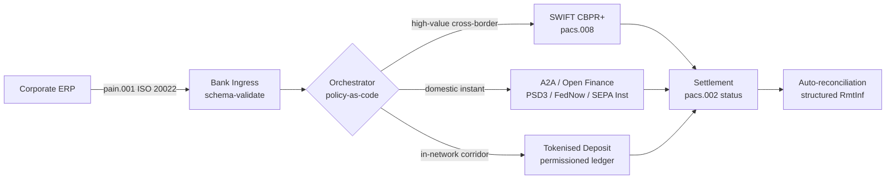

---

# Front Matter (YAML)

author: "contact@sebastienrousseau.com (Sebastien Rousseau)"
banner_alt: "Kontejnerová loď v hlubokovodním přístavu za úsvitu — symbolizuje multi-railový, přeshraniční pohyb korporátní hodnoty napříč ISO 20022, open finance a sítěmi pro zúčtování tokenizovaných depozit v roce 2026"
banner_height: "1597"
banner_width: "2584"
banner: "https://cloudcdn.pro/stocks/images/viktor-forgacs-KxVRDiFdTVo.webp"
cdn: "https://cloudcdn.pro"
charset: "UTF-8"
cname: "sebastienrousseau.com"
copyright: "© Copyright 2025 - 2026 - Sebastien Rousseau. All rights reserved."
date: "24. června 2026"
description: "Jak ISO 20022, A2A, open finance pod PSD3/FiDA a tokenizované depozity přeměňují přeshraniční korporátní treasury vedle SWIFT v roce 2026."
format-detection: "telephone=no"
hreflang: "cs"
icon: "https://cloudcdn.pro/clients/sebastienrousseau/v1/logos/sebastienrousseau.svg"
id: "https://sebastienrousseau.com/2026-06-24-cross-border-iso-20022-open-finance-tokenised-deposits-treasury-2026"
image_alt: "Černobílý portrét Sebastiena Rousseaua"
image_height: "162"
image_width: "162"
image: "https://cloudcdn.pro/stocks/images/sebastien-rousseau.png"
keywords: "přeshraniční platby, ISO 20022, open finance, PSD3, FiDA, tokenizované depozity, stablecoiny, A2A, treasury, CIB, Nexi, Mastercard, multi-rail, pacs.008, pain.001, SWIFT, FedNow, SEPA Instant, RTP, CBPR+"
language: "cs-CZ"
last_reviewed: "2026-06-24"
layout: "report"
locale: "cs_CZ"
logo_alt: "Logo Sebastiena Rousseaua"
logo_height: "44"
logo_width: "44"
logo: "https://cloudcdn.pro/clients/sebastienrousseau/v1/logos/sebastienrousseau.svg"
menu: ""
measurementID: "G-169G4ET5HQ"
name: "Sebastien Rousseau"
permalink: "https://sebastienrousseau.com/2026-06-24-cross-border-iso-20022-open-finance-tokenised-deposits-treasury-2026"
rating: "general"
referrer: "no-referrer"
robots: "index, follow"
schema: "FAQPage, Article"
seo_title: "Přeshraniční platby 2026: ISO 20022, open finance, tokenizace"
short_name: "sebastienrousseau"
subtitle: "Přeshraniční korporátní treasury v roce 2026 funguje na multi-railové mechanice — ISO 20022 jako společná gramatika, A2A a open finance jako rail směrem k zákazníkovi, tokenizované depozity jako velkoobchodní zúčtovací noha, přičemž SWIFT stále zajišťuje dlouhý chvost."
tags: "přeshraniční platby, ISO 20022, open finance, PSD3, FiDA, tokenizované depozity, A2A, treasury, CIB, multi-rail, pacs.008, pain.001, SWIFT, FedNow, SEPA Instant, RTP, CBPR+"
theme-color: "0, 83, 191"
title: "Přeshraniční platby 2026: ISO 20022, open finance a tokenizované depozity v korporátní treasury"
url: "https://sebastienrousseau.com/2026-06-24-cross-border-iso-20022-open-finance-tokenised-deposits-treasury-2026"
viewport: "width=device-width, initial-scale=1, shrink-to-fit=no"

# RSS - The RSS feed front matter (YAML).
atom_link: "https://sebastienrousseau.com/2026-06-24-cross-border-iso-20022-open-finance-tokenised-deposits-treasury-2026/rss.xml"
category: "Technology"
docs: https://validator.w3.org/feed/docs/rss2.html
generator: "Static Site Generator (SSG) (version 0.0.26)"
item_description: "Jak ISO 20022, A2A, open finance pod PSD3/FiDA a tokenizované depozity přeměňují přeshraniční korporátní treasury vedle SWIFT v roce 2026."
item_guid: "https://sebastienrousseau.com/2026-06-24-cross-border-iso-20022-open-finance-tokenised-deposits-treasury-2026/rss.xml"
item_link: "https://sebastienrousseau.com/2026-06-24-cross-border-iso-20022-open-finance-tokenised-deposits-treasury-2026/rss.xml"
item_pub_date: "Wed, 24 Jun 2026 07:07:07 +0000"
item_title: "Přeshraniční platby 2026: ISO 20022, open finance a tokenizované depozity v korporátní treasury"
last_build_date: "Wed, 24 Jun 2026 06:06:06 +0000"
managing_editor: "contact@sebastienrousseau.com (Sebastien Rousseau)"
pub_date: "Wed, 24 Jun 2026 07:07:07 +0000"
ttl: "60"
type: "article"
webmaster: "contact@sebastienrousseau.com"

# Apple - The Apple front matter (YAML).
apple_mobile_web_app_orientations: "portrait"
apple_touch_icon_sizes: "192x192"
apple-mobile-web-app-capable: "yes"
apple-mobile-web-app-status-bar-inset: "black"
apple-mobile-web-app-status-bar-style: "black-translucent"
apple-mobile-web-app-title: "Přeshraniční platby 2026: ISO 20022, open finance"
apple-touch-fullscreen: "yes"

# MS Application - The MS Application front matter (YAML).

msapplication-navbutton-color: "0, 83, 191"

# Twitter Card - The Twitter Card front matter (YAML).

twitter_card: "summary_large_image"
twitter_creator: "@wwdseb"
twitter_description: "Jak ISO 20022, A2A, open finance pod PSD3/FiDA a tokenizované depozity přeměňují přeshraniční korporátní treasury vedle SWIFT v roce 2026."
twitter_image: "https://cloudcdn.pro/clients/sebastienrousseau/v1/logos/sebastienrousseau.svg"
twitter_image_alt: "Logo Sebastiena Rousseaua"
twitter_site: "@wwdseb"
twitter_title: "Přeshraniční platby 2026: ISO 20022, open finance, tokenizace"
twitter_url: "https://sebastienrousseau.com/2026-06-24-cross-border-iso-20022-open-finance-tokenised-deposits-treasury-2026"

excerpt: "Přeshraniční korporátní treasury v roce 2026 je multi-railový inženýrský problém. ISO 20022 je společná gramatika, A2A a open finance pod PSD3/FiDA jsou rail směrem k zákazníkovi, tokenizované depozity obstarávají velkoobchodní zúčtovací nohu a SWIFT stále zajišťuje dlouhý chvost. Zajímavá práce je ve vrstvě orchestrace, nikoli v modelu."

# Humans.txt - The Humans.txt front matter (YAML).
author_website: "https://sebastienrousseau.com"
author_twitter: "@wwdseb"
author_location: "London, UK"
thanks: "Děkujeme za přečtení!"
site_last_updated: "2026-06-24"
site_standards: "HTML5, CSS3, RSS, Atom, JSON, XML, YAML, Markdown, TOML"
site_components: "Kaishi, Kaishi Builder, Kaishi CLI, Kaishi Templates, Kaishi Themes"
site_software: "Static Site Generator, Rust"

---

# Přeshraniční platby 2026: ISO 20022, open finance a tokenizované depozity v korporátní treasury

<!-- lead-start -->
<aside class="post-lead" aria-label="Shrnutí článku">

<strong>TL;DR.</strong> Přeshraniční korporátní treasury v roce 2026 funguje na čtyřech railech paralelně — SWIFT CBPR+, instantní A2A pod PSD3/FiDA, tokenizované depozity a stablecoinové raily — sešité dohromady ISO 20022 jako společnou gramatikou. Práce pro týmy CIB a korporátní treasury spočívá v orchestraci, nikoli ve volbě railu.

<strong>Klíčové závěry</strong>

<ul class="post-lead-takeaways">
  <li><strong>Multi-rail je výchozí stav.</strong> Žádný jediný rail nepokrývá každý koridor, každou velikost transakce, každý cut-off. Treasury volí rail podle platby, nikoli podle banky.</li>
  <li><strong>ISO 20022 je lingua franca.</strong> pacs.008, pacs.009 a pain.001 nyní přenášejí remitenční data napříč RTGS, instantními, A2A i tokenizovanými depozitními raily — rozhodování o směrování je řízeno daty, ne railem.</li>
  <li><strong>Open finance rozšiřuje perimetr.</strong> PSD3 a FiDA posouvají model otevřeného bankovnictví do penzí, pojištění a treasury dat; Nexi a Mastercard staví vrstvu orchestrace, kterou korporáty konzumují.</li>
  <li><strong>Tokenizované depozity jsou velkoobchodní nohou.</strong> Bankou vydávané tokenizované depozity a integrované stablecoinové raily leží pod instantním railem směrem k zákazníkovi a zúčtovávají velkoobchodní nohu téměř v T+0.</li>
</ul>

<strong>Doporučené čtení:</strong> <a href="https://sebastienrousseau.com/2026-06-07-autonomous-treasury-index-programmable-liquidity-tokenised-deposits-2026">Index autonomní treasury 2026: programovatelná likvidita a tokenizované depozity</a>, <a href="https://sebastienrousseau.com/2026-06-15-pacs008-automation-iso-20022-interbank-payments-2026">Automatizace pacs.008: ISO 20022 mezibankovní platby v roce 2026</a>.

</aside>
<!-- lead-end -->

Evropský průmyslový korporát platí brazilskému dodavateli ve středu ráno 4,2 milionu EUR. Treasury workstation nevybírá banku. Vybírá rail — sekvenci railů. Instrukce směrem k zákazníkovi přistává jako A2A zpráva pain.001 směrovaná poskytovatelem open finance pod PSD3. Banka ji posílá přes dvě korespondenční jurisdikce na tokenizovaných depozitech uvnitř privátní sítě CIB. Dlouhý chvost — vyrovnání faktury na 80 000 USD subdodavateli bez vztahu k tokenizovaným depozitům — stále jede po SWIFT CBPR+ jako pacs.008. Zákazník vidí jednu platbu. Architektura vidí čtyři raily. ISO 20022 je jediný důvod, proč to drží pohromadě.

Přesně tento provozní model popisuje Mastercard, když mluví o [vývoji od open bankingu k open finance](https://www.mastercard.com/us/en/news-and-trends/Insights/2026/open-banking-to-open-finance-the-evolution-of-financial-data.html "Mastercard: od open bankingu k open finance, vývoj finančních dat") — data a platby spojené do jedné vrstvy orchestrace, kde rail volí systém, ne zákazník. Zajímavá otázka pro vrcholové bankovní technology nezní, který rail vyhraje. Zní, jak je vrstva orchestrace navržena, řízena a rekonciliována.

## 01. Od karet k A2A — posun k open finance

Karetní raily nezanikají. Jsou přerámovány.

V průběhu let 2025 a 2026 [PSD3 a nařízení o přístupu k finančním datům (FiDA)](https://www.consultancy.uk/news/42202/orchestrating-open-banking-for-platform-growth-2026-outlook "Consultancy.uk: orchestrating open banking for platform growth, 2026 outlook") rozšířily povinnost open bankingu nad rámec platebních účtů na penze, hypotéky, spoření, pojištění a data korporátní treasury. Implikace pro korporátní treasury je přímá: relationship manager CIB nyní může konzumovat kompletní obrázek likvidity korporátu napříč více bankami přes jeden API kontrakt, na základě instrukce korporátu.

Dva operátoři viditelně staví vrstvu orchestrace, kterou budou korporáty konzumovat. Nexi rozšířila svou akviziční stopu do iniciace A2A napříč SEPA Instant a panevropskými RTGS koridory, plně ISO 20022 nativně end-to-end. Platforma open finance od Mastercardu — ukotvená v jeho akvizici Aiia a Finicity — poskytuje pod tím vrstvu agregace dat a souhlasu, přičemž iniciace plateb je vystavena přes stejné API portfolio, které dříve sloužilo autorizaci karet.

Tento posun je důležitý ze tří důvodů:

1. **Jednotková ekonomika.** A2A iniciované pod PSD3 odstraňuje interchange z platby. U vysokoobjemových B2B toků je úspora zásadní; u nízkoobjemových spotřebitelských toků se nákladová struktura obchodníka hroutí.
2. **Kvalita dat.** A2A pod ISO 20022 přenáší strukturovaná remitenční data, jaká karty nikdy nemohly. Míra automatické rekonciliace nad 95 % je nyní samozřejmostí.
3. **Rizikový model.** A2A je úvěrový převod, nikoli karetní autorizace. Plocha podvodů, model chargebacků a model sporů jsou všechny odlišné. Týmy korporátní treasury musí pochopit, že vrstva ochrany zákazníka se přestavuje, nikoli dědí.

CIB prodávající multi-railovou nabídku v roce 2026 prodává orchestraci — ne přístup. Přístup je nyní regulován.

## 02. ISO 20022 jako lingua franca napříč raily

Důvod, proč je multi-rail vůbec proveditelný, je ten, že formát zprávy je nyní napříč raily konzistentní.

Výbor BIS pro platby a tržní infrastrukturu (CPMI) jasně vyložil architektonickou argumentaci ve svém dokumentu [požadavky harmonizace ISO 20022 pro zlepšení přeshraničních plateb](https://www.bis.org/cpmi/publ/d230.pdf "BIS CPMI: ISO 20022 harmonisation requirements for enhancing cross-border payments"). Přechod na CBPR+ v listopadu 2025 uzavřel éru MT103 / MT202 pro přeshraniční mezibankovní zprávy. Od toho okamžiku každý hlavní rail — SWIFT, FedNow, SEPA Instant, RTP a hlavní instantní platební systémy v Asii a Latinské Americe — mluví stejnou gramatikou pacs.008 / pacs.009 / pain.001.

Praktický důsledek pro korporátní treasury:

- **Směrování je řízeno daty.** Treasury workstation může pain.001 přečíst jednou a rozhodnout o railu podle platby na základě koridoru, velikosti transakce, cut-offu a vztahu protistrany — bez přemapování zprávy.
- **Remitenční data přežijí přeskok.** Strukturovaná remitenční pole (`<RmtInf><Strd>`) projdou korespondenčními nohami bez ořezání. Míra automatické rekonciliace stoupá, protože data se na hranici railu už neztrácejí.
- **Sankční screening se stává auditovatelným.** Strukturovaná pole `<Dbtr>` / `<Cdtr>` / `<DbtrAgt>` / `<CdtrAgt>` s odkazy LEI nahrazují screening jmen ve volném textu. Míra zásahů klesá. Vyšetřovací fronty se zkracují.

Diagram níže sleduje jedinou pain.001 přes ingress banky, do orchestrátoru policy-as-code a ven na rail, který diktuje koridor a velikost transakce — jedna zpráva, mnoho railů, žádné přemapování.

Cenou této konzistence je inženýrská disciplína. ISO 20022 je permisivní. Dvě banky mohou být plně v souladu s CBPR+ a přesto produkovat zprávy pacs.008, které se liší v použití polí, znakové sadě a struktuře remitenčních dat. CIB, která vyhrává na přeshraničních platbách v roce 2026, vynucuje přísnější profil zpráv, než standard vyžaduje — a odmítá při parsování, ne při zúčtování.

## 03. Tokenizované depozity a stabilní raily

Velkoobchodní zúčtovací noha je místo, kde příběh railů začíná být zajímavý.

Obraz roku 2026, dobře zachycený v [analýze Trade Treasury Payments o automatizaci, záložních railech, ISO 20022 a stablecoinech](https://tradetreasurypayments.com/articles/automation-contingency-rails-iso-20022-and-stablecoins-the-2026-trends-reshaping-corporate-finance-and-b2b-payments "Trade Treasury Payments: automation, contingency rails, ISO 20022 and stablecoins, the 2026 trends reshaping corporate finance and B2B payments"), dělí vrstvu velkoobchodního zúčtování na dva strukturálně odlišné modely.

**Bankou vydávané tokenizované depozity.** Komerční banka vydává tokenizovaný závazek na povolovaném ledgeru — JPM Coin, depozitní token HSBC napojený na Orion, ekvivalenty hlavních evropských CIB. Token je přímou pohledávkou vůči vydávající bance. Zúčtování je téměř T+0 uvnitř sítě. Compliance je odpovědností vydávající banky. Rail je plně regulovaný, plně dohledatelný a omezený na účastníky, které vydavatel přijal.

**Integrované stablecoinové raily.** Regulovaný stablecoin — plně rezervovaný, auditovaný a operující pod MiCA nebo ekvivalentním regionálním režimem — zúčtovává koridor, kam bankou vydávané tokenizované depozity zatím nedosáhnou. Token je pohledávkou vůči rezervě, nikoli vůči bankovní rozvaze. Compliance je sdílená mezi vydavatelem, on-rampem a off-rampem.

Tyto dva modely si nekonkurují. Jsou navrstveny. Přeshraniční produkt CIB v roce 2026 typicky používá bankou vydávané tokenizované depozity pro vnitrosíťovou nohu a regulovaný stablecoin pro koridor, kde vnitrosíťový rail končí. Korporát vidí jednu platbu ISO 20022. Zúčtovací příběh pod tím je multi-tokenový.

Otázka na úrovni představenstva je stejná, jakou si výbory pro provozní riziko kladou od prvních pilotních programů programovatelné likvidity: kdo nese úvěrovou expozici na tokenu a jak dlouho? Tokenizované depozity dávají čistou odpověď — vydávající banka, dokud nedojde k burn. Integrované stablecoinové raily dávají nuancovanější odpověď — rezerva, podléhající auditnímu cyklu a záruce výplaty. Treasury tým, který nedokumentuje odpověď podle railu a podle koridoru, nese na své rozvaze neměřené úvěrové riziko.

## 04. Autonomní treasury stack

Nad vrstvou railu leží vrstva orchestrace. Nad vrstvou orchestrace leží vrstva agentů.

Architekturu jsem detailně rozpracoval v textu [Index autonomní treasury 2026: programovatelná likvidita a tokenizované depozity](https://sebastienrousseau.com/2026-06-07-autonomous-treasury-index-programmable-liquidity-tokenised-deposits-2026 "Sebastien Rousseau: Index autonomní treasury 2026"). Krátká verze: agentní treasury v roce 2026 je vrstva orchestrace vyjádřená jako policy-as-code, s ohraničenými agenty, kteří v ní vykonávají.

Stack je:

1. **Vrstva railu.** SWIFT CBPR+, instantní A2A, tokenizované depozity, regulované stablecoiny. Každý rail má publikovaný profil, tabulku cut-offů, nákladovou křivku a model finality zúčtování.
2. **Vrstva orchestrace.** ISO 20022 dovnitř, ISO 20022 ven. Rozhodnutí o railu podle platby na základě koridoru, transakce, cut-offu, vztahu protistrany a politiky. Politika je verzovaná, podepsaná a auditovatelná.
3. **Vrstva agentů.** Ohraničení treasury agenti vykonávají orchestrační politiku s hranicemi volání nástrojů, audit logy a kill switchi. Agent rail nevybírá. Rail vybírá politika. Agent politiku spouští.
4. **Rekonciliační vrstva.** Zprávy ISO 20022 pacs.008 / pacs.002 / camt.054 rekonciliují vůči původní instrukci pain.001, přičemž strukturovaná remitenční data uzavírají smyčku bez manuálního zásahu.

CIB prodávající tento stack v roce 2026 prodává čtyři věci najednou — a oceňuje je samostatně. Korporát, který jej kupuje, kupuje volitelnost napříč raily, s jedním standardem zpráv, jednou vrstvou politik a jedním rekonciliačním feedem. To je architektonický posun. Vše ostatní je implementační detail.

## Závěr

Přeshraniční korporátní treasury v roce 2026 je multi-railový inženýrský problém. ISO 20022 je gramatika, která činí multi-rail zvládnutelným. PSD3 a FiDA rozšiřují datový perimetr a tlačí open finance do workflow korporátní treasury. Tokenizované depozity a regulované stablecoiny obstarávají velkoobchodní zúčtovací nohu. SWIFT stále zajišťuje dlouhý chvost.

CIB, která vyhrává, je ta, která staví vrstvu orchestrace — ne ta, která si vybere jediný rail a vsadí na něj svou franšízu. Tým korporátní treasury, který vyhrává, je ten, který dokumentuje úvěrovou expozici podle railu a podle koridoru, vynucuje přísnější profil ISO 20022, než vyžaduje regulátor, a zachází s rozhodnutím o railu jako s politikou, nikoli jako s úsudkovým rozhodnutím podle platby.

Zajímavá práce je ve vrstvě orchestrace. Postavte ji pečlivě.

<!-- enrich-start -->
<aside class="author-card" aria-label="O autorovi"><strong class="author-card-name"><a href="/about/index.html">Sebastien Rousseau</a></strong>Vrcholový bankovní technolog píšící o aplikované AI, migraci ISO 20022, postkvantové kryptografii pro finanční služby a strukturální transformaci velkoobchodních plateb.20+ let napříč HSBC Commercial &amp; Investment Bank, PayPal, Barclays, Shazam, AKQA, Virgin Group. <a href="/about/index.html">Úplný profil</a> &middot; <a href="https://www.linkedin.com/in/sebastienrousseau/" rel="external noopener">LinkedIn</a> &middot; <a href="https://github.com/sebastienrousseau" rel="external noopener">GitHub</a></aside>

Naposledy revidováno <time datetime="2026-06-24">2026-06-24</time>.

<!-- enrich-end -->
