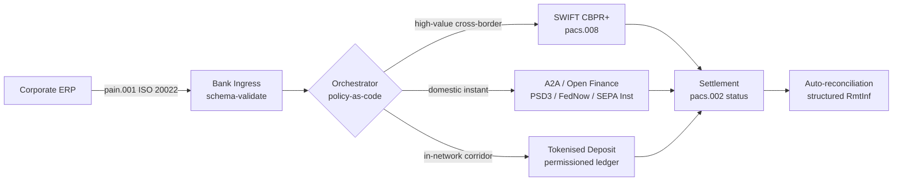

---

# Front Matter (YAML)

author: "contact@sebastienrousseau.com (Sebastien Rousseau)"
banner_alt: "Containerschiff in einem Tiefwasserhafen im Morgengrauen — Sinnbild für die mehrgleisige, grenzüberschreitende Bewegung von Unternehmenswerten über ISO 20022, Open Finance und tokenisierte Einlagen-Settlement-Netze im Jahr 2026"
banner_height: "1597"
banner_width: "2584"
banner: "https://cloudcdn.pro/stocks/images/viktor-forgacs-KxVRDiFdTVo.webp"
cdn: "https://cloudcdn.pro"
charset: "UTF-8"
cname: "sebastienrousseau.com"
copyright: "© Copyright 2025 - 2026 - Sebastien Rousseau. Alle Rechte vorbehalten."
date: "24. Juni 2026"
description: "Wie ISO 20022, A2A, Open Finance unter PSD3/FiDA und tokenisierte Einlagen die grenzüberschreitende Firmenkunden-Treasury 2026 neben SWIFT neu ordnen."
format-detection: "telephone=no"
hreflang: "de"
icon: "https://cloudcdn.pro/clients/sebastienrousseau/v1/logos/sebastienrousseau.svg"
id: "https://sebastienrousseau.com/2026-06-24-cross-border-iso-20022-open-finance-tokenised-deposits-treasury-2026"
image_alt: "Schwarz-Weiß-Porträt von Sebastien Rousseau"
image_height: "162"
image_width: "162"
image: "https://cloudcdn.pro/stocks/images/sebastien-rousseau.png"
keywords: "grenzüberschreitender Zahlungsverkehr, ISO 20022, Open Finance, PSD3, FiDA, tokenisierte Einlagen, Stablecoins, A2A, Treasury, CIB, Nexi, Mastercard, Multi-Rail, pacs.008, pain.001, SWIFT, FedNow, SEPA Instant, RTP, CBPR+"
language: "de-DE"
last_reviewed: "2026-06-24"
layout: "report"
locale: "de_DE"
logo_alt: "Logo von Sebastien Rousseau"
logo_height: "44"
logo_width: "44"
logo: "https://cloudcdn.pro/clients/sebastienrousseau/v1/logos/sebastienrousseau.svg"
menu: ""
measurementID: "G-169G4ET5HQ"
name: "Sebastien Rousseau"
permalink: "https://sebastienrousseau.com/2026-06-24-cross-border-iso-20022-open-finance-tokenised-deposits-treasury-2026"
rating: "general"
referrer: "no-referrer"
robots: "index, follow"
schema: "FAQPage, Article"
seo_title: "Cross-Border 2026: ISO 20022, Open Finance, tokenisierte Rails"
short_name: "sebastienrousseau"
subtitle: "Grenzüberschreitende Firmenkunden-Treasury 2026 läuft auf Multi-Rail-Mechanik — ISO 20022 als gemeinsame Grammatik, A2A und Open Finance als kundenseitige Schiene, tokenisierte Einlagen als Wholesale-Settlement-Bein, während SWIFT weiterhin den Long Tail trägt."
tags: "grenzüberschreitender Zahlungsverkehr, ISO 20022, Open Finance, PSD3, FiDA, tokenisierte Einlagen, A2A, Treasury, CIB, Multi-Rail, pacs.008, pain.001, SWIFT, FedNow, SEPA Instant, RTP, CBPR+"
theme-color: "0, 83, 191"
title: "Cross-Border 2026: ISO 20022, Open Finance und tokenisierte Einlagen in der Firmenkunden-Treasury"
url: "https://sebastienrousseau.com/2026-06-24-cross-border-iso-20022-open-finance-tokenised-deposits-treasury-2026"
viewport: "width=device-width, initial-scale=1, shrink-to-fit=no"

# RSS - The RSS feed front matter (YAML).
atom_link: "https://sebastienrousseau.com/2026-06-24-cross-border-iso-20022-open-finance-tokenised-deposits-treasury-2026/rss.xml"
category: "Technology"
docs: https://validator.w3.org/feed/docs/rss2.html
generator: "Static Site Generator (SSG) (version 0.0.26)"
item_description: "Wie ISO 20022, A2A, Open Finance unter PSD3/FiDA und tokenisierte Einlagen die grenzüberschreitende Firmenkunden-Treasury 2026 neben SWIFT neu ordnen."
item_guid: "https://sebastienrousseau.com/2026-06-24-cross-border-iso-20022-open-finance-tokenised-deposits-treasury-2026/rss.xml"
item_link: "https://sebastienrousseau.com/2026-06-24-cross-border-iso-20022-open-finance-tokenised-deposits-treasury-2026/rss.xml"
item_pub_date: "Wed, 24 Jun 2026 07:07:07 +0000"
item_title: "Cross-Border 2026: ISO 20022, Open Finance und tokenisierte Einlagen in der Firmenkunden-Treasury"
last_build_date: "Wed, 24 Jun 2026 06:06:06 +0000"
managing_editor: "contact@sebastienrousseau.com (Sebastien Rousseau)"
pub_date: "Wed, 24 Jun 2026 07:07:07 +0000"
ttl: "60"
type: "article"
webmaster: "contact@sebastienrousseau.com"

# Apple - The Apple front matter (YAML).
apple_mobile_web_app_orientations: "portrait"
apple_touch_icon_sizes: "192x192"
apple-mobile-web-app-capable: "yes"
apple-mobile-web-app-status-bar-inset: "black"
apple-mobile-web-app-status-bar-style: "black-translucent"
apple-mobile-web-app-title: "Cross-Border 2026: ISO 20022, Open Finance, tokenisierte Rails"
apple-touch-fullscreen: "yes"

# MS Application - The MS Application front matter (YAML).

msapplication-navbutton-color: "0, 83, 191"

# Twitter Card - The Twitter Card front matter (YAML).

twitter_card: "summary_large_image"
twitter_creator: "@wwdseb"
twitter_description: "Wie ISO 20022, A2A, Open Finance unter PSD3/FiDA und tokenisierte Einlagen die grenzüberschreitende Firmenkunden-Treasury 2026 neben SWIFT neu ordnen."
twitter_image: "https://cloudcdn.pro/clients/sebastienrousseau/v1/logos/sebastienrousseau.svg"
twitter_image_alt: "Logo von Sebastien Rousseau"
twitter_site: "@wwdseb"
twitter_title: "Cross-Border 2026: ISO 20022, Open Finance, tokenisierte Rails"
twitter_url: "https://sebastienrousseau.com/2026-06-24-cross-border-iso-20022-open-finance-tokenised-deposits-treasury-2026"

excerpt: "Grenzüberschreitende Firmenkunden-Treasury 2026 ist ein mehrgleisiges Engineering-Problem. ISO 20022 ist die gemeinsame Grammatik, A2A und Open Finance unter PSD3/FiDA sind die kundenseitige Schiene, tokenisierte Einlagen tragen das Wholesale-Settlement-Bein, und SWIFT verankert weiterhin den Long Tail. Die interessante Arbeit liegt in der Orchestrierungsschicht, nicht im Modell."

# Humans.txt - The Humans.txt front matter (YAML).
author_website: "https://sebastienrousseau.com"
author_twitter: "@wwdseb"
author_location: "London, UK"
thanks: "Danke fürs Lesen!"
site_last_updated: "2026-06-24"
site_standards: "HTML5, CSS3, RSS, Atom, JSON, XML, YAML, Markdown, TOML"
site_components: "Kaishi, Kaishi Builder, Kaishi CLI, Kaishi Templates, Kaishi Themes"
site_software: "Static Site Generator, Rust"

---

# Cross-Border 2026: ISO 20022, Open Finance und tokenisierte Einlagen in der Firmenkunden-Treasury

<!-- lead-start -->
<aside class="post-lead" aria-label="Artikel-Zusammenfassung">

<strong>TL;DR.</strong> Grenzüberschreitende Firmenkunden-Treasury läuft 2026 auf vier Schienen parallel — SWIFT CBPR+, instant A2A unter PSD3/FiDA, tokenisierte Einlagen und Stablecoin-Rails — zusammengehalten durch ISO 20022 als gemeinsame Grammatik. Die Aufgabe für CIB- und Corporate-Treasury-Teams ist Orchestrierung, nicht Schienenauswahl.

<strong>Kernaussagen</strong>

<ul class="post-lead-takeaways">
  <li><strong>Multi-Rail ist der Standard.</strong> Keine einzelne Schiene klärt jeden Korridor, jede Ticketgröße, jeden Cut-off. Die Treasury wählt die Schiene pro Zahlung, nicht pro Bank.</li>
  <li><strong>ISO 20022 ist die Lingua franca.</strong> pacs.008, pacs.009 und pain.001 tragen Remittance-Daten heute über RTGS-, Instant-, A2A- und tokenisierte-Einlagen-Schienen — Routing-Entscheidungen werden datengetrieben statt schienen-gebunden.</li>
  <li><strong>Open Finance weitet den Perimeter.</strong> PSD3 und FiDA tragen das Open-Banking-Modell in Renten, Versicherungen und Treasury-Daten; Nexi und Mastercard bauen die Orchestrierungsschicht, die Firmenkunden konsumieren.</li>
  <li><strong>Tokenisierte Einlagen sind das Wholesale-Bein.</strong> Bankseitig emittierte tokenisierte Einlagen und integrierte Stablecoin-Rails liegen unter der kundenseitigen Instant-Schiene und settlen das Wholesale-Bein nahe T+0.</li>
</ul>

<strong>Weiterführende Lektüre:</strong> <a href="https://sebastienrousseau.com/2026-06-07-autonomous-treasury-index-programmable-liquidity-tokenised-deposits-2026">Der Autonomous-Treasury-Index 2026: Programmierbare Liquidität und tokenisierte Einlagen</a>, <a href="https://sebastienrousseau.com/2026-06-15-pacs008-automation-iso-20022-interbank-payments-2026">pacs.008-Automatisierung: ISO 20022 im Interbankenzahlungsverkehr 2026</a>.

</aside>
<!-- lead-end -->

Ein europäischer Industriekonzern zahlt an einem Mittwochmorgen 4,2 Mio. EUR an einen brasilianischen Lieferanten. Die Treasury-Workstation wählt keine Bank. Sie wählt eine Schiene — eine Sequenz von Schienen. Die kundenseitige Anweisung landet als A2A-pain.001-Nachricht, geroutet über einen Open-Finance-Anbieter unter PSD3. Die Bank überträgt zwei Korrespondenzjurisdiktionen über tokenisierte Einlagen in einem privaten CIB-Netz. Der Long Tail — eine USD-80.000-Rechnungsbereinigung an einen Unterlieferanten ohne tokenisierte-Einlagen-Beziehung — läuft weiterhin über SWIFT CBPR+ als pacs.008. Der Kunde sieht eine Zahlung. Die Architektur sieht vier Schienen. ISO 20022 ist der einzige Grund, warum es hält.

Das ist das Betriebsmodell, das Mastercard beschreibt, wenn es über [die Entwicklung von Open Banking zu Open Finance](https://www.mastercard.com/us/en/news-and-trends/Insights/2026/open-banking-to-open-finance-the-evolution-of-financial-data.html "Mastercard: Open Banking zu Open Finance, die Entwicklung von Finanzdaten") spricht — Daten und Zahlungen verschmolzen zu einer Orchestrierungsschicht, in der das System die Schiene wählt, nicht der Kunde. Die interessante Frage für Senior-Banking-Technologen ist nicht, welche Schiene gewinnt. Es ist, wie die Orchestrierungsschicht konstruiert, gesteuert und abgestimmt wird.

## 01. Von Karten zu A2A — die Open-Finance-Verschiebung

Die Karten-Rails verschwinden nicht. Sie werden neu eingeordnet.

Über 2025 hinweg und bis 2026 hinein haben [PSD3 und die Financial-Data-Access-Regulierung (FiDA)](https://www.consultancy.uk/news/42202/orchestrating-open-banking-for-platform-growth-2026-outlook "Consultancy.uk: Orchestrierung von Open Banking für Plattformwachstum, Ausblick 2026") die Open-Banking-Pflicht über Zahlungskonten hinaus auf Renten, Hypotheken, Sparprodukte, Versicherungen und Firmenkunden-Treasury-Daten ausgeweitet. Die Konsequenz für die Firmenkunden-Treasury ist direkt: Ein CIB-Relationship-Manager kann nun das vollständige Liquiditätsbild eines Firmenkunden über mehrere Banken hinweg über einen API-Vertrag konsumieren — auf Weisung des Firmenkunden.

Zwei Akteure bauen sichtbar die Orchestrierungsschicht, die Firmenkunden konsumieren werden. Nexi hat seine Acquiring-Präsenz auf A2A-Initiation über SEPA Instant und paneuropäische RTGS-Korridore ausgeweitet, ISO 20022 nativ Ende-zu-Ende. Mastercards Open-Finance-Plattform — verankert auf der Übernahme von Aiia und Finicity — liefert die Datenaggregations- und Einwilligungsschicht darunter, wobei die Zahlungsinitiierung über dasselbe API-Estate erfolgt, das zuvor Kartenautorisierungen bedient hat.

Die Verschiebung zählt aus drei Gründen:

1. **Stückkostenökonomie.** A2A initiiert unter PSD3 streicht das Interchange aus der Zahlung. Für hochpreisige B2B-Flows ist die Einsparung materiell; für niedrigpreisige Konsumentenflows kollabiert der Händler-Kostenstack.
2. **Datenqualität.** A2A unter ISO 20022 trägt strukturierte Remittance-Daten, die Karten nie tragen konnten. Auto-Reconciliation-Raten über 95 % sind heute Mindeststandard.
3. **Risikomodell.** A2A ist eine Überweisung, keine Kartenautorisierung. Die Betrugsoberfläche, das Chargeback-Modell und das Dispute-Modell sind allesamt anders. Corporate-Treasury-Teams müssen verstehen, dass die Kundenschutzschicht neu aufgebaut, nicht geerbt wird.

Die CIB, die 2026 ein Multi-Rail-Angebot verkauft, verkauft Orchestrierung — keinen Zugang. Zugang ist heute reguliert.

## 02. ISO 20022 als Lingua franca über Schienen hinweg

Der Grund, warum Multi-Rail überhaupt funktioniert, ist, dass das Nachrichtenformat über die Schienen hinweg konsistent ist.

Das BIS Committee on Payments and Market Infrastructures (CPMI) hat das architektonische Argument in seinen [ISO-20022-Harmonisierungsanforderungen zur Verbesserung grenzüberschreitender Zahlungen](https://www.bis.org/cpmi/publ/d230.pdf "BIS CPMI: ISO-20022-Harmonisierungsanforderungen zur Verbesserung grenzüberschreitender Zahlungen") klar gemacht. Der Cut-over auf CBPR+ im November 2025 hat die MT103-/MT202-Ära für grenzüberschreitende Interbanken-Nachrichten beendet. Ab diesem Zeitpunkt sprechen alle wichtigen Schienen — SWIFT, FedNow, SEPA Instant, RTP und die wichtigsten Instant-Payment-Systeme in Asien und Lateinamerika — dieselbe pacs.008-/pacs.009-/pain.001-Grammatik.

Die praktische Konsequenz für die Firmenkunden-Treasury:

- **Routing ist datengetrieben.** Die Treasury-Workstation liest eine pain.001 einmal und entscheidet die Schiene pro Zahlung anhand Korridor, Ticketgröße, Cut-off und Gegenparteibeziehung — ohne die Nachricht neu zu mappen.
- **Remittance-Daten überleben den Hop.** Strukturierte Remittance-Felder (`<RmtInf><Strd>`) tragen durch Korrespondenz-Beine ohne Trunkierung. Auto-Reconciliation-Raten steigen, weil die Daten nicht mehr an der Schienengrenze verloren gehen.
- **Sanktions-Screening wird prüfbar.** Strukturierte `<Dbtr>`-/`<Cdtr>`-/`<DbtrAgt>`-/`<CdtrAgt>`-Felder mit LEI-Referenzen ersetzen Freitext-Namens-Screening. Trefferraten sinken. Untersuchungs-Queues schrumpfen.

Das folgende Diagramm verfolgt eine einzelne pain.001 durch die Ingress-Schicht der Bank, hinein in den Policy-as-Code-Orchestrator und hinaus auf die Schiene, die Korridor und Ticketgröße verlangen — eine Nachricht, viele Schienen, kein Re-Mapping.

Die Kosten dieser Konsistenz heißen Engineering-Disziplin. ISO 20022 ist permissiv. Zwei Banken können vollständig CBPR+-konform sein und dennoch pacs.008-Nachrichten produzieren, die sich in Feldnutzung, Zeichensatz und Remittance-Datenstruktur unterscheiden. Die CIB, die 2026 grenzüberschreitend gewinnt, erzwingt ein strikteres Nachrichtenprofil als der Standard verlangt — und weist beim Parsen ab, nicht beim Settlement.

## 03. Tokenisierte Einlagen und stabile Rails

Das Wholesale-Settlement-Bein ist die Stelle, an der die Schienen-Story interessant wird.

Das Bild für 2026, gut eingefangen in der [Trade-Treasury-Payments-Analyse zu Automatisierung, Contingency-Rails, ISO 20022 und Stablecoins](https://tradetreasurypayments.com/articles/automation-contingency-rails-iso-20022-and-stablecoins-the-2026-trends-reshaping-corporate-finance-and-b2b-payments "Trade Treasury Payments: Automatisierung, Contingency-Rails, ISO 20022 und Stablecoins — die 2026-Trends, die Corporate Finance und B2B-Zahlungen neu ordnen"), teilt die Wholesale-Settlement-Schicht in zwei strukturell verschiedene Modelle.

**Bankseitig emittierte tokenisierte Einlagen.** Eine Geschäftsbank emittiert eine tokenisierte Verbindlichkeit auf einem permissioned Ledger — JPM Coin, HSBCs Orion-verknüpftes Deposit Token, die wichtigsten europäischen CIB-Pendants. Der Token ist ein direkter Anspruch gegen die emittierende Bank. Settlement ist nahe T+0 innerhalb des Netzes. Compliance liegt in der Verantwortung der emittierenden Bank. Die Schiene ist vollständig reguliert, vollständig nachverfolgbar und auf Teilnehmer beschränkt, die der Emittent onboarded hat.

**Integrierte Stablecoin-Rails.** Ein regulierter Stablecoin — vollständig gedeckt, geprüft und unter MiCA oder einem äquivalenten regionalen Regime operierend — settlet einen Korridor, den bankseitig emittierte tokenisierte Einlagen noch nicht erreichen. Der Token ist ein Anspruch an die Reserve, nicht an die Bilanz einer Bank. Compliance wird zwischen Emittent, On-Ramp und Off-Ramp geteilt.

Die beiden Modelle konkurrieren nicht. Sie stapeln. Ein CIB-Cross-Border-Produkt nutzt 2026 typischerweise bankseitig emittierte tokenisierte Einlagen für das In-Network-Bein und einen regulierten Stablecoin für den Korridor, an dem die In-Network-Schiene endet. Der Firmenkunde sieht eine ISO-20022-Zahlung. Die Settlement-Story darunter ist Multi-Token.

Die Vorstandsfrage ist dieselbe, die operationelle Risikoausschüsse seit den ersten Pilotprojekten zu programmierbarer Liquidität stellen: Wer trägt das Kreditrisiko des Tokens, und wie lange? Tokenisierte Einlagen liefern eine klare Antwort — die emittierende Bank, bis zum Burn. Integrierte Stablecoin-Rails liefern eine nuanciertere — die Reserve, vorbehaltlich Prüfzyklus und Rückgabegarantie. Ein Treasury-Team, das die Antwort nicht pro Schiene und pro Korridor dokumentiert, trägt unbemessenes Kreditrisiko in seiner Bilanz.

## 04. Der autonome Treasury-Stack

Über der Schienenschicht liegt die Orchestrierungsschicht. Über der Orchestrierungsschicht liegt die Agentenschicht.

Ich habe die Architektur im Detail in [Der Autonomous-Treasury-Index 2026: Programmierbare Liquidität und tokenisierte Einlagen](https://sebastienrousseau.com/2026-06-07-autonomous-treasury-index-programmable-liquidity-tokenised-deposits-2026 "Sebastien Rousseau: Der Autonomous-Treasury-Index 2026") dargelegt. Die Kurzfassung: Agentische Treasury ist 2026 die Orchestrierungsschicht, ausgedrückt als Policy-as-Code, mit begrenzten Agenten, die darin ausführen.

Der Stack ist:

1. **Schienenschicht.** SWIFT CBPR+, instant A2A, tokenisierte Einlagen, regulierte Stablecoins. Jede Schiene hat ein veröffentlichtes Profil, eine Cut-off-Tabelle, eine Kostenkurve und ein Settlement-Finality-Modell.
2. **Orchestrierungsschicht.** ISO 20022 rein, ISO 20022 raus. Schienenentscheidung pro Zahlung anhand Korridor, Ticket, Cut-off, Gegenparteibeziehung und Policy. Die Policy ist versioniert, signiert und auditierbar.
3. **Agentenschicht.** Begrenzte Treasury-Agenten führen die Orchestrierungs-Policy mit Werkzeugaufruf-Grenzen, Audit-Protokollen und Notabschaltungen aus. Der Agent wählt nicht die Schiene. Die Policy wählt die Schiene. Der Agent führt die Policy aus.
4. **Reconciliation-Schicht.** ISO-20022-Nachrichten pacs.008 / pacs.002 / camt.054 stimmen gegen die ursprüngliche pain.001-Anweisung ab — strukturierte Remittance-Daten schließen die Schleife ohne manuellen Eingriff.

Die CIB, die 2026 diesen Stack verkauft, verkauft vier Dinge gleichzeitig — und preist sie getrennt. Der Firmenkunde, der ihn kauft, kauft Optionalität über Schienen hinweg, mit einem Nachrichtenstandard, einer Policy-Schicht, einem Reconciliation-Feed. Das ist die architektonische Verschiebung. Alles andere ist Implementierungsdetail.

## Fazit

Grenzüberschreitende Firmenkunden-Treasury ist 2026 ein mehrgleisiges Engineering-Problem. ISO 20022 ist die Grammatik, die Multi-Rail handhabbar macht. PSD3 und FiDA weiten den Datenperimeter und drücken Open Finance in den Workflow der Firmenkunden-Treasury. Tokenisierte Einlagen und regulierte Stablecoins tragen das Wholesale-Settlement-Bein. SWIFT verankert weiterhin den Long Tail.

Die CIB, die gewinnt, ist diejenige, die die Orchestrierungsschicht baut — nicht diejenige, die auf eine einzelne Schiene setzt und die Franchise darauf verwettet. Das Corporate-Treasury-Team, das gewinnt, ist dasjenige, das das Kreditrisiko pro Schiene und pro Korridor dokumentiert, ein strikteres ISO-20022-Profil erzwingt, als der Regulator verlangt, und die Schienenentscheidung als Policy behandelt, nicht als zahlungsbezogenes Ermessen.

Die interessante Arbeit liegt in der Orchestrierungsschicht. Bauen Sie sie sorgfältig.

<!-- enrich-start -->
<aside class="author-card" aria-label="Über den Autor"><strong class="author-card-name"><a href="/about/index.html">Sebastien Rousseau</a></strong>Senior Banking Technologist, schreibt zu angewandter KI, ISO-20022-Migration, Post-Quantum-Kryptografie für Finanzdienstleistungen und der strukturellen Transformation des Wholesale-Zahlungsverkehrs.20+ Jahre bei HSBC Commercial &amp; Investment Bank, PayPal, Barclays, Shazam, AKQA, Virgin Group. <a href="/about/index.html">Vollständiges Profil</a> &middot; <a href="https://www.linkedin.com/in/sebastienrousseau/" rel="external noopener">LinkedIn</a> &middot; <a href="https://github.com/sebastienrousseau" rel="external noopener">GitHub</a></aside>

Zuletzt geprüft am <time datetime="2026-06-24">2026-06-24</time>.

<!-- enrich-end -->
