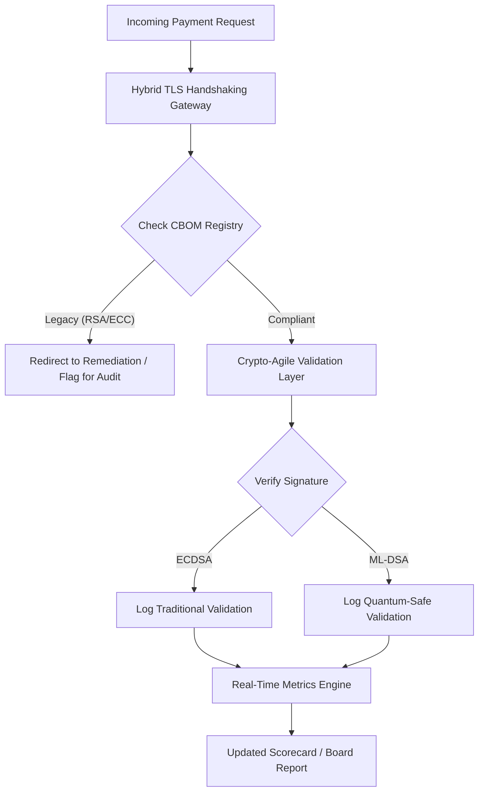

---
# Front Matter (YAML)
author: "contact@sebastienrousseau.com (Sebastien Rousseau)"
banner_alt: "Abstrakter digitaler Sitzungssaal-Tisch, der sich in Quantengitter auflöst — visualisiert die strategische Governance, die für die Migration der Kernbankeninfrastruktur auf FIPS 203 und 204 erforderlich ist"
banner_height: "1597"
banner_width: "2584"
banner: "https://cloudcdn.pro/stocks/images/quantum-governance-AbC123XyZ.webp"
cdn: "https://cloudcdn.pro"
charset: "UTF-8"
cname: "sebastienrousseau.com"
copyright: "© Copyright 2025 - 2026 - Sebastien Rousseau. Alle Rechte vorbehalten."
date: "29. Juni 2026"
description: "Der Post-Quantum-Security-Scorecard 2026 liefert Vorständen und Senior Management einen treuhänderischen Metrikrahmen, um Cryptographic Bill of Materials (CBOM), HNDL-Exposure und die Migrationsgeschwindigkeit zu NIST FIPS 203/204 in der Tier-1-Bankeninfrastruktur zu verfolgen."
format-detection: "telephone=no"
hreflang: "de"
icon: "https://cloudcdn.pro/clients/sebastienrousseau/v1/logos/sebastienrousseau.svg"
id: "https://sebastienrousseau.com/2026-06-29-post-quantum-security-scorecard-board-level-fiduciary-agility-2026"
image_alt: "Schwarz-Weiß-Porträt von Sebastien Rousseau"
image_height: "162"
image_width: "162"
image: "https://cloudcdn.pro/stocks/images/sebastienrousseau.webp"
keywords: "Post-Quanten-Kryptografie, PQC-Scorecard, NIST FIPS 203, NIST FIPS 204, CBOM, HNDL, Banken-Governance, Krypto-Agilität, KyberLib, DORA-Compliance, SM&CR, Quantenresilienz"
language: "de-DE"
last_reviewed: "2026-06-29"
layout: "report"
locale: "de_DE"
logo_alt: "Logo von Sebastien Rousseau"
logo_height: "44"
logo_width: "44"
logo: "https://cloudcdn.pro/clients/sebastienrousseau/v1/logos/sebastienrousseau.svg"
measurementID: "G-169G4ET5HQ"
name: "Sebastien Rousseau"
permalink: "https://sebastienrousseau.com/2026-06-29-post-quantum-security-scorecard-board-level-fiduciary-agility-2026"
rating: "general"
referrer: "no-referrer"
robots: "index, follow"
schema: "FAQPage, Article"
seo_title: "Post-Quantum-Security-Scorecard 2026: Vorstands-Rahmenwerk"
short_name: "sebastienrousseau"
subtitle: "Wie Vorstände die Migration auf NIST FIPS 203 und 204 messen und steuern müssen — mit Nachverfolgung der CBOM-Vollständigkeit und Eindämmung der Harvest-Now-Decrypt-Later-(HNDL)-Exposure im Corporate Treasury."
tags: "Post-Quanten, Kryptografie, Banken, Governance, DORA, FIPS-203, FIPS-204, CBOM, HNDL, KyberLib, SM&CR"
theme-color: "0, 83, 191"
title: "Post-Quantum-Security-Scorecard 2026: Ein Metrikrahmen auf Vorstandsebene"
url: "https://sebastienrousseau.com/2026-06-29-post-quantum-security-scorecard-board-level-fiduciary-agility-2026"
viewport: "width=device-width, initial-scale=1, shrink-to-fit=no"

# RSS
atom_link: "https://sebastienrousseau.com/2026-06-29-post-quantum-security-scorecard-board-level-fiduciary-agility-2026/rss.xml"
category: "Technology"
generator: "Static Site Generator (SSG) (version 0.0.40)"
item_description: "Der Post-Quantum-Security-Scorecard 2026 liefert Vorständen einen treuhänderischen Metrikrahmen für CBOM, HNDL-Exposure und NIST-Migrationsgeschwindigkeit."
item_pub_date: "Mon, 29 Jun 2026 07:07:07 +0000"
item_title: "Post-Quantum-Security-Scorecard 2026: Ein Metrikrahmen auf Vorstandsebene"
pub_date: "Mon, 29 Jun 2026 07:07:07 +0000"
type: "article"

# Twitter Card
twitter_card: "summary_large_image"
twitter_creator: "@wwdseb"
twitter_description: "Post-Quantum-Security-Scorecard 2026: Wie Bankenvorstände kryptografische Agilität, CBOM-Vollständigkeit und HNDL-Exposure messen."
twitter_image: "https://cloudcdn.pro/clients/sebastienrousseau/v1/logos/sebastienrousseau.svg"
twitter_title: "Post-Quantum-Security-Scorecard 2026 für Bankenvorstände"
twitter_url: "https://sebastienrousseau.com/2026-06-29-post-quantum-security-scorecard-board-level-fiduciary-agility-2026"

excerpt: "Stand Juni 2026: Post-Quanten-Kryptografie (PQC) ist vom experimentellen technischen Thema zur primären treuhänderischen Pflicht geworden. Vorstände müssen die systematische Migration der Altverschlüsselung jetzt überwachen..."

# Template-completeness keys (parity with hsh/noyalib shape)
apple_mobile_web_app_orientations: "portrait"
apple_touch_icon_sizes: "192x192"
apple-mobile-web-app-capable: "yes"
apple-mobile-web-app-status-bar-inset: "black"
apple-mobile-web-app-status-bar-style: "black-translucent"
apple-touch-fullscreen: "yes"
apple-mobile-web-app-title: "PQC-Scorecard 2026"
author_location: "London, Vereinigtes Königreich"
author_twitter: "@wwdseb"
author_website: "https://sebastienrousseau.com"
docs: https://validator.w3.org/feed/docs/rss2.html
item_guid: "https://sebastienrousseau.com/2026-06-29-post-quantum-security-scorecard-board-level-fiduciary-agility-2026/rss.xml"
item_link: "https://sebastienrousseau.com/2026-06-29-post-quantum-security-scorecard-board-level-fiduciary-agility-2026/rss.xml"
last_build_date: "Mon, 29 Jun 2026 06:06:06 +0000"
managing_editor: "contact@sebastienrousseau.com (Sebastien Rousseau)"
menu: "active"
msapplication-navbutton-color: "0, 83, 191"
site_components: "Kaishi, Kaishi Builder, Kaishi CLI, Kaishi Templates, Kaishi Themes"
site_last_updated: "2023-07-05"
site_software: "Static Site Generator, Rust"
site_standards: "HTML5, CSS3, RSS, Atom, JSON, XML, YAML, Markdown, TOML"
thanks: "Danke fürs Lesen!"
ttl: "60"
twitter_image_alt: "Schwarz-Weiß-Porträt von Sebastien Rousseau"
twitter_site: "@wwdseb"
webmaster: "contact@sebastienrousseau.com"
---

# Post-Quantum-Security-Scorecard 2026: Ein Metrikrahmen auf Vorstandsebene für treuhänderische kryptografische Agilität

<aside class="post-lead" aria-label="Artikelzusammenfassung">

<strong>Kurzfassung.</strong> Stand Juni 2026: Post-Quanten-Kryptografie (PQC) ist vom experimentellen technischen Thema zur primären treuhänderischen Pflicht geworden. Vorstände müssen die systematische Migration der Altverschlüsselung auf NIST FIPS 203 und 204 überwachen, um systemische Finanz- und Betriebsrisiken im Rahmen von DORA einzudämmen.

<strong>Wesentliche Erkenntnisse</strong>

<ul class="post-lead-takeaways">
  <li><strong>G20-Ausrichtung und harte Fristen.</strong> Internationale Regulatoren haben die späten 2020er als harte Frist für quantensichere Umstellungen festgelegt und verlangen von Instituten den Nachweis quantifizierbarer Migrationsfortschritte.</li>
  <li><strong>Cryptographic Bill of Materials (CBOM).</strong> Analog zu einer Software-BOM ist eine CBOM ein lebendes, automatisiertes Inventar sämtlicher kryptografischer Assets, das die Sichtbarkeit über die gesamte Lieferkette sicherstellt.</li>
  <li><strong>Harvest-Now-Decrypt-Later-(HNDL)-Exposure.</strong> Angreifer fangen heute verschlüsselte hochwertige Wholesale-Zahlungsdaten ab und speichern sie. Die Eindämmung erfordert die sofortige Einführung hybrider PQC-Architekturen.</li>
  <li><strong>Treuhänderische Governance über Krypto-Agilität.</strong> Krypto-Agilität ist eine messbare Governance-Kennzahl. Die Fähigkeit, kryptografische Primitive ohne Neuentwicklung des Kernsystems auszutauschen (mit Bibliotheken wie KyberLib), ist heute eine Vorstandsverantwortung unter SM&CR.</li>
</ul>

<strong>Weiterführende Lektüre:</strong> <a href="https://sebastienrousseau.com/2026-06-12-kyberlib-post-quantum-banking-migration-standards-code-2026">KyberLib und die Post-Quanten-Bankenmigration 2026</a>, <a href="https://sebastienrousseau.com/2023-11-19-crystals-kyber-the-safeguarding-algorithm-in-a-quantum-age/index.html">CRYSTALS-Kyber: Der Schutzalgorithmus im Quantenzeitalter</a>.

</aside>
Post-Quanten-Sicherheit ist kein Forschungsprojekt mehr. Die „Aufsichtsuhr" tickt auf die Durchsetzungsfristen Ende der 2020er Jahre zu. Die Finalisierung von [NIST FIPS 203 (ML-KEM)](https://csrc.nist.gov/pubs/fips/203/final) und [NIST FIPS 204 (ML-DSA)](https://csrc.nist.gov/pubs/fips/204/final) hat die Standards für Schlüsselkapselung und digitale Signaturen festgeschrieben.

Aufsichtsbehörden erwarten von Tier-1-Banken jetzt mehr als Pilotprogramme. 2026 hat sich der Fokus auf die Industrialisierung dieser Standards verlagert. Wer keinen klaren Migrationspfad nachweisen kann, riskiert erhebliche regulatorische Sanktionen unter dem [Digital Operational Resilience Act (DORA)](https://eur-lex.europa.eu/eli/reg/2022/2554/oj) und mögliche persönliche Haftung für Direktoren, die die absehbare Bedrohung durch quantenfähige Entschlüsselung ignorieren.

## 01. Der Quanten-Scorecard auf Vorstandsebene

Die folgenden Kennzahlen liefern Vorständen einen standardisierten Rahmen, um die Quantenbereitschaft und kryptografische Gesundheit in den Commercial-and-Investment-Banking-(CIB)-Beständen zu bewerten.

### Tabelle 1: PQC-Scorecard-Metriken und Toleranzen

| Metrik | Mathematische Formel | Vom Vorstand genehmigte Toleranzen | Risiko bei Toleranzüberschreitung |
| ---- | ---- | ---- | ---- |
| **Inventory Completeness Percentage (ICP)** | (Identifizierte Krypto-Assets / Geschätzte Gesamt-Assets) × 100 | > 98 % | Schatten-Verschlüsselung und blinde Flecken in den Datenpfaden des hochwertigen Clearings. |
| **HNDL Exposure Rate (HER)** | (Langlebige Daten auf Legacy-Krypto / Gesamte langlebige Daten) × 100 | < 5 % | Dauerhafte Kompromittierung von Geschäftsgeheimnissen, Staatsschuldenbüchern und Wholesale-Zahlungsdaten. |
| **NIST Migration Progress Rate (MPR)** | (Systeme mit FIPS 203/204 / Gesamte kritische Systeme) × 100 | > 60 % (bis Jahresende 2026) | Regulatorische Non-Compliance und Ausschluss von G20-konformen Gegenparteien. |
| **Crypto-Agility Readiness Index (CARI)** | (Anwendungen mit abstrahierten Krypto-Schichten / Gesamte Kern-Anwendungen) × 100 | > 85 % | Schwere technische Schulden und Unfähigkeit, auf künftige Algorithmus-Abkündigungen zu reagieren. |

## 02. Die Cryptographic Bill of Materials (CBOM)

Die ICP-Metrik wird über eine umfassende **CBOM-Discovery-Phase** baseliniert. Dies ist ein automatisierter Prozess, der jeden kryptografischen Endpunkt im Unternehmen identifiziert.

- **Endpunkt-Discovery:** Scannen interner und Cloud-Netzwerke nach aktiven TLS-Sitzungen, um Legacy-RSA- oder -ECC-Nutzung zu identifizieren.
- **Schlüsselinventar:** Zuordnung öffentlicher/privater Schlüsselpaare zu ihren jeweiligen Eigentümern und Erfassung exakter Ablaufdaten.
- **Abhängigkeits-Mapping:** Identifikation von Drittanbieter-Bibliotheken und APIs, die auf veralteten Algorithmen beruhen.

Diese Discovery-Phase schafft eine einzige Wahrheitsquelle und versetzt den CISO in die Lage, die kryptografische Gesundheit mit derselben Granularität wie die Finanzleistung zu berichten.

## 03. HNDL-Exposure im Wholesale-Zahlungsverkehr beseitigen

Angreifer zielen aktiv auf Wholesale-Zahlungen und langlebige Unternehmensdatenbanken. Diese „Harvest-Now-Decrypt-Later"-(HNDL)-Angriffe umfassen das Abfangen und Archivieren des heute verschlüsselten Datenverkehrs.

Selbst wenn ein kryptografisch relevanter Quantencomputer (CRQC) heute nicht existiert, sind die jetzt abgefangenen Daten in Zukunft angreifbar. Die Eindämmung erfordert die vorrangige Migration langlebiger Daten (z. B. Identitätsdatensätze, 30-jährige Anleiheverträge und rechtliche Archive), was die HER-Metrik unmittelbar senkt. Die Aufrüstung der Zahlungskanäle auf hybride PQC-traditionelle Verschlüsselung (mit ML-KEM neben X25519) bietet sofortigen Schutz gegen Archivbedrohungen.

## 04. Krypto-Agilität über gut entworfene Schnittstellen operationalisieren

Krypto-Agilität wird durch Engineering-Abstraktionen realisiert. Moderne Bibliotheken wie [KyberLib](https://sebastienrousseau.com/2026-06-12-kyberlib-post-quantum-banking-migration-standards-code-2026) zeigen, wie Entwickler quantensichere Module implementieren können, ohne den gesamten Anwendungsstack neu zu schreiben.

- **Abstrahierte Wrapper:** Anwendungen rufen eine generische `encrypt()`- oder `sign()`-Funktion auf, statt algorithmusspezifischer Routinen.
- **Austausch zur Laufzeit:** Das zugrunde liegende Modul lässt sich per Konfigurationsänderung von ECDSA auf ML-DSA umstellen — ohne komplexe Code-Deployments.

Diese Architektur stellt sicher, dass die Organisation in Stunden statt in Jahren reagieren kann, falls ein bestimmter PQC-Algorithmus künftig kompromittiert wird.

## 05. Der quantensichere Ingress-Validierungs-Workflow

Das folgende Diagramm illustriert den Lebenszyklus von Daten, die in einer quantenagilen Bankenumgebung den sicheren Perimeter passieren.

## Fazit

Der kryptografische Bestand einer Tier-1-Bank ist keine reine CISO-Angelegenheit mehr. Er ist treuhänderische Infrastruktur. NIST FIPS 203 und 204 setzen die Algorithmen; DORA Artikel 5 setzt die Verantwortungsfläche; SM&CR bindet sie an einen namentlich benannten Senior Manager. Der obige Scorecard — Inventory Completeness, HNDL Exposure, Migration Progress, Krypto-Agilität — liefert dem Vorstand die vier Zahlen, die er braucht, um diesen Bestand zu steuern, ohne den kryptografischen Code lesen zu müssen.

Die wichtigste Zahl ist HNDL Exposure. Jeder mit Legacy-Krypto verschlüsselte Datensatz, der heute in einem Wholesale-Zahlungsarchiv liegt, wird an dem Tag lesbar sein, an dem der erste kryptografisch relevante Quantencomputer ausgeliefert wird. Der Countdown läuft lautlos und asymmetrisch: Verteidiger können nur auf die Daten reagieren, die sie halten, Angreifer können auf Daten reagieren, die sie bereits vor Jahren exfiltriert haben. Ein 30-jähriger Unternehmensanleihevertrag, der 2024 mit RSA-2048 verschlüsselt wurde, ist ein Vertrag, der seine Vertraulichkeitsgarantie an dem Tag verliert, an dem ein CRQC in Betrieb geht.

[KyberLib](https://sebastienrousseau.com/2026-06-12-kyberlib-post-quantum-banking-migration-standards-code-2026) und seinesgleichen machen aus einer mehrjährigen Plattform-Neuentwicklung eine Konfigurationsänderung. Es ist nicht Aufgabe des Vorstands, den Code zu schreiben. Aufgabe des Vorstands ist es zu verlangen, dass der Crypto-Agility Readiness Index — der Anteil der Kernanwendungen hinter einer abstrahierten kryptografischen Schnittstelle — binnen zwölf Monaten die 85-%-Marke überschreitet, und den Quartals-Scorecard zu lesen.

<aside class="author-card" aria-label="Über den Autor"><strong class="author-card-name"><a href="/about/index.html">Sebastien Rousseau</a></strong>Senior Banking Technologist, schreibt über angewandte KI, ISO-20022-Migration, Post-Quanten-Kryptografie für Finanzdienstleistungen und die strukturelle Transformation des Wholesale-Zahlungsverkehrs.20+ Jahre bei HSBC Commercial & Investment Bank, PayPal, Barclays, Shazam. <a href="https://www.linkedin.com/in/sebastienrousseau/" rel="external noopener">LinkedIn</a> &middot; <a href="https://github.com/sebastienrousseau" rel="external noopener">GitHub</a></aside>

Zuletzt überprüft <time datetime="2026-06-29">2026-06-29</time>.

