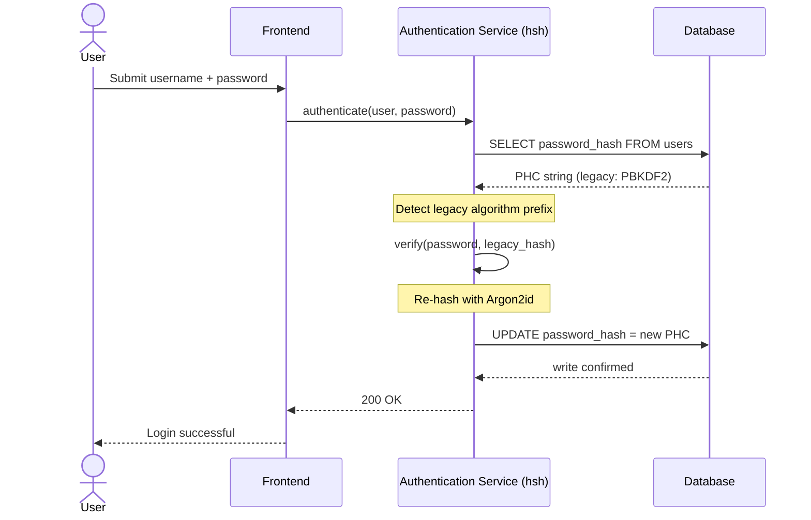
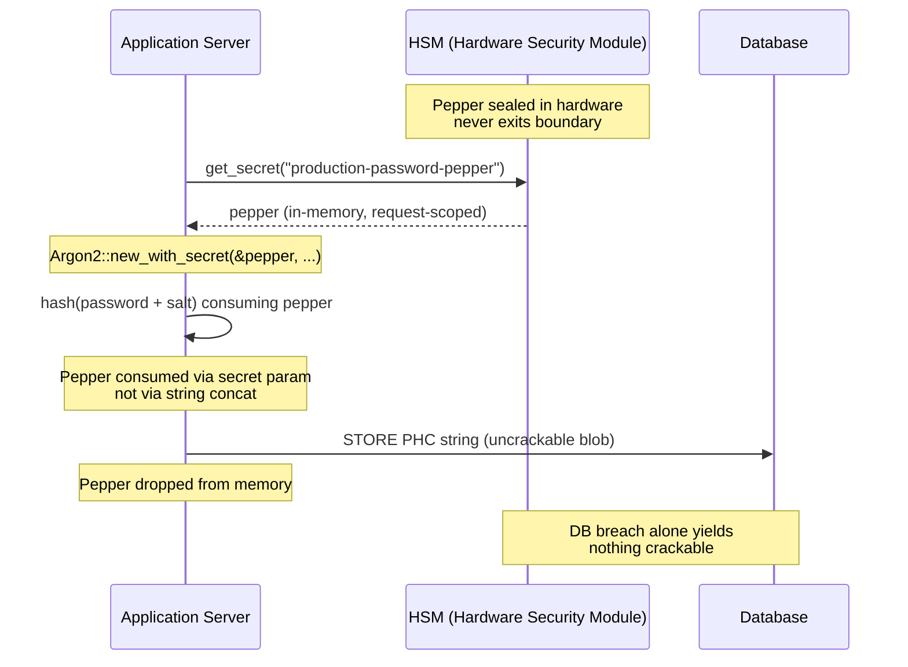

---
# Front Matter (YAML)
author: "contact@sebastienrousseau.com (Sebastien Rousseau)"
banner_alt: "Abstract na cryptographic vault structure na iniilawan ng blue at gold na liwanag — sumisimbolo sa secure at memory-safe na hangganan kung saan ina-upgrade ang mga legacy password hash patungong Argon2id sa real time"
banner_height: "1597"
banner_width: "2584"
banner: "https://cloudcdn.pro/stocks/images/crypto-vault-XyZ1bLQnP9.webp"
cdn: "https://cloudcdn.pro"
charset: "UTF-8"
cname: "sebastienrousseau.com"
copyright: "© Copyright 2025 - 2026 - Sebastien Rousseau. All rights reserved."
date: "Hunyo 22, 2026"
description: "Ang hsh ay isang pure-Rust cryptographic framework na nagbibigay-daan sa mga tier-1 bank na mag-migrate ng legacy password hash patungong Argon2id nang walang downtime, may HSM peppering at memory-safe na DORA-aligned na disenyo."
format-detection: "telephone=no"
hreflang: "fil"
icon: "https://cloudcdn.pro/clients/sebastienrousseau/v1/logos/sebastienrousseau.svg"
id: "https://sebastienrousseau.com/2026-06-22-hsh-zero-downtime-cryptographic-stewardship-rust-banking-2026"
image_alt: "Black and White Portrait of Sebastien Rousseau"
image_height: "162"
image_width: "162"
image: "https://cloudcdn.pro/stocks/images/sebastien-rousseau.png"
keywords: "hsh, Rust cryptography, password hashing, Argon2id, banking security, HSM interlock, DORA compliance, Basel III, zero-downtime migration, memory safety, PBKDF2, scrypt, cyber recovery"
language: "fil-PH"
last_reviewed: "2026-06-22"
layout: "report"
locale: "fil_PH"
logo_alt: "Logo for Sebastien Rousseau"
logo_height: "44"
logo_width: "44"
logo: "https://cloudcdn.pro/clients/sebastienrousseau/v1/logos/sebastienrousseau.svg"
measurementID: "G-169G4ET5HQ"
name: "Sebastien Rousseau"
permalink: "https://sebastienrousseau.com/2026-06-22-hsh-zero-downtime-cryptographic-stewardship-rust-banking-2026"
rating: "general"
referrer: "no-referrer"
robots: "index, follow"
schema: "FAQPage, Article"
seo_title: "hsh: Zero-Downtime Cryptographic Stewardship sa Rust"
short_name: "sebastienrousseau"
subtitle: "Paano binibigyang-daan ng isang pure-Rust cryptographic framework ang mga bangko na seamless na i-upgrade ang mga legacy password patungong Argon2id na may HSM interlock — at ano ang ibig sabihin nito para sa DORA at Basel III compliance."
tags: "hsh, Rust, banking, cryptography, Argon2id, HSM, DORA, Basel-III, security, open-source, operational-resilience"
theme-color: "0, 83, 191"
title: "Pag-secure ng Password Management sa Enterprise Banking: Multi-Algorithm Hashing at Upgrade gamit ang hsh"
url: "https://sebastienrousseau.com/2026-06-22-hsh-zero-downtime-cryptographic-stewardship-rust-banking-2026"
viewport: "width=device-width, initial-scale=1, shrink-to-fit=no"

# RSS
atom_link: "https://sebastienrousseau.com/2026-06-22-hsh-zero-downtime-cryptographic-stewardship-rust-banking-2026/rss.xml"
category: "Technology"
generator: "Static Site Generator (SSG) (version 0.0.40)"
item_description: "Ang hsh ay isang pure-Rust cryptographic framework na nagbibigay-daan sa mga tier-1 bank na mag-migrate ng legacy password hash patungong Argon2id nang walang downtime, may HSM peppering at memory-safe na DORA-aligned na disenyo."
item_pub_date: "Mon, 22 Jun 2026 07:07:07 +0000"
item_title: "Pag-secure ng Password Management sa Enterprise Banking: Multi-Algorithm Hashing at Upgrade gamit ang hsh"
pub_date: "Mon, 22 Jun 2026 07:07:07 +0000"
type: "article"

# Twitter Card
twitter_card: "summary_large_image"
twitter_creator: "@wwdseb"
twitter_description: "Ang hsh ay nagbibigay-daan sa mga tier-1 bank na mag-migrate ng legacy password hash patungong Argon2id nang walang downtime, may HSM interlock at memory-safe Rust."
twitter_image: "https://cloudcdn.pro/clients/sebastienrousseau/v1/logos/sebastienrousseau.svg"
twitter_title: "hsh: Zero-Downtime Cryptographic Stewardship sa Rust"
twitter_url: "https://sebastienrousseau.com/2026-06-22-hsh-zero-downtime-cryptographic-stewardship-rust-banking-2026"

excerpt: "Sa panahon ng GPU-accelerated decryption at DORA mandate, systemic risk na ang cryptographic rot. Bawat legacy PBKDF2 o scrypt hash na nakaupo sa isang banking database ay isang countdown patungong compromise. Binabago ng hsh ang modelo sa pamamagitan ng zero-downtime, memory-safe na upgrade..."

# Added by fix_hsh_frontmatter.py (template completeness)
apple_mobile_web_app_orientations: "portrait"
apple_touch_icon_sizes: "192x192"
apple-mobile-web-app-capable: "yes"
apple-mobile-web-app-status-bar-inset: "black"
apple-mobile-web-app-status-bar-style: "black-translucent"
apple-touch-fullscreen: "yes"
author_location: "London, United Kingdom"
author_twitter: "@wwdseb"
author_website: "https://sebastienrousseau.com"
docs: https://validator.w3.org/feed/docs/rss2.html
item_guid: "https://sebastienrousseau.com/2026-06-22-hsh-zero-downtime-cryptographic-stewardship-rust-banking-2026/rss.xml"
item_link: "https://sebastienrousseau.com/2026-06-22-hsh-zero-downtime-cryptographic-stewardship-rust-banking-2026/rss.xml"
last_build_date: "Mon, 22 Jun 2026 06:06:06 +0000"
managing_editor: "contact@sebastienrousseau.com (Sebastien Rousseau)"
menu: "active"
msapplication-navbutton-color: "0, 83, 191"
site_components: "Kaishi, Kaishi Builder, Kaishi CLI, Kaishi Templates, Kaishi Themes"
site_last_updated: "2023-07-05"
site_software: "Static Site Generator, Rust"
site_standards: "HTML5, CSS3, RSS, Atom, JSON, XML, YAML, Markdown, TOML"
ttl: "60"
twitter_site: "@wwdseb"
webmaster: "contact@sebastienrousseau.com"
apple-mobile-web-app-title: "hsh: Rust password hashing"
thanks: "Salamat sa pagbabasa!"
twitter_image_alt: "Black and White Portrait of Sebastien Rousseau"
---

# Pag-secure ng Password Management sa Enterprise Banking: Multi-Algorithm Hashing at Upgrade gamit ang hsh

<aside class="post-lead" aria-label="Buod ng artikulo">
<p class="post-lead-tldr"><strong>TL;DR.</strong> Ang <a href="https://github.com/sebastienrousseau/hsh">hsh</a> ay isang open-source at pure-Rust cryptographic framework na nagbibigay-daan sa mga tier-1 bank na mag-migrate ng legacy password hash patungo sa mga modernong standard tulad ng Argon2id nang walang service interruption. Sa pamamagitan ng pag-integrate ng HSM-backed peppering at mahigpit na memory safety nang walang C-based FFI wrapper, sinasara nito ang mga cryptographic rot vulnerability na direktang nagbabanta sa DORA at Basel III compliance.</p>
<p class="post-lead-heading"><strong>Mga pangunahing takeaway</strong></p>
<ul class="post-lead-takeaways">
  <li><strong>Ang problema ng cryptographic rot.</strong> Ang mga legacy algorithm tulad ng PBKDF2 ay humihina nang exponentially habang bumibilis ang hardware, na nagpapalawak ng attack surface para sa credential-stuffing at offline brute-force na kampanya.</li>
  <li><strong>Zero-downtime migration.</strong> Ang <code>verify_and_upgrade</code> pattern ay nag-rerehash ng user credential nang transparent sa panahon ng standard login event, inaalis ang operational risk ng bulk database migration.</li>
  <li><strong>Hardware interlock at peppering.</strong> Ang mga hash ay binabalot gamit ang Hardware Security Modules (HSM) o cloud KMS architecture, tinitiyak na ang isang database breach lamang ay hindi magbibigay ng crackable na candidate password.</li>
  <li><strong>Memory safety bilang regulatory baseline.</strong> Buong-buong isinulat sa safe Rust at ipinapatupad sa pamamagitan ng strict dependency hygiene, inaalis ng hsh ang buffer overflow at supply-chain risk na likas sa mga legacy C-based cryptographic library.</li>
</ul>
<p class="post-lead-related"><strong>Kaugnay na babasahin:</strong> <a href="https://sebastienrousseau.com/2026-06-20-http-handle-zero-dependency-edge-ingress-banking-rust-2026">http-handle: High-Performance at Zero-Dependency Edge Ingress para sa Banking sa 2026</a>, <a href="https://sebastienrousseau.com/2026-06-07-autonomous-treasury-index-programmable-liquidity-tokenised-deposits-2026/index.html">The Autonomous Treasury Index in 2026</a>.</p>
</aside>
Karamihan sa enterprise banking authentication ay nakaupo pa rin sa isang password layer na pinatibay laban sa threat model ng 2018. Ang hardware na bumabasag dito ay lumampas na roon. Habang lumalaki ang mga GPU farm at papalapit ang cryptographically relevant quantum computer (CRQC), ang legacy hashing — PBKDF2, maagang scrypt — ay nabubulok bawat oras na ginugugol ng attacker sa offline crack queue. Tahimik ang pagkabulok: walang nasa production database ang magsasabi sa iyo na ang hash na malakas kahapon ay hindi na malakas ngayon.

Sa ilalim ng [Digital Operational Resilience Act (DORA)](https://eur-lex.europa.eu/eli/reg/2022/2554/oj), ang pag-iiwan ng hindi pinaikot at legacy na cryptographic asset sa production ay hindi na technical debt. Pinangalanan na itong regulatory liability.

Sinasara ng [hsh](https://github.com/sebastienrousseau/hsh) ang puwang. Bilang isang pure-Rust framework, namamahala ito ng maraming hash format nang magkatabi at ina-upgrade ang mahihinang credential habang aktibo ang login session. Naiaayon ang authentication infrastructure sa mga resilience mandate ng 2026 nang walang maintenance window, walang forced reset, at walang isang segundo ng downtime.

## 01. Ang Problema ng Cryptographic Rot sa Banking

Upang maunawaan ang pangangailangan ng isang framework tulad ng hsh, dapat unawain ang lifecycle ng isang password hash. Hindi tumatanda nang maayos ang mga algorithm; nabubulok sila kaugnay ng hardware na maaaring bumasag sa kanila.

**Ang ASIC/GPU acceleration gap.** Ang mga algorithm tulad ng PBKDF2 ay dinisenyo upang maging computationally expensive para sa CPU. Sa ngayon, ginagamit ng mga attacker ang highly parallelised GPU upang magsagawa ng offline dictionary attack. Ang isang legacy hash na nabuo noong 2018 ay napakahina laban sa isang adversary ng 2026.

**Ang big-bang migration risk.** Kapag napagpasyahan ng isang CISO na mag-upgrade mula PBKDF2 patungo sa isang memory-hard algorithm tulad ng Argon2id, hindi nila maibabalik ang mga hash upang i-re-encrypt. Ang mga tradisyonal na solusyon — pagpilit sa multi-million-user na password reset — ay nagdudulot ng malaking customer friction at operational risk.

**Ang C-library supply chain.** Sa kasaysayan, umaasa ang banking middleware sa mga library tulad ng `argonautica` o raw C binding para sa hashing. Ang mga library na ito ay may dalang nakatago na supply-chain risk: ang isang memory-buffer overflow lamang sa authentication module ay maaaring humantong sa remote code execution (RCE) sa pinaka-privileged na layer ng banking stack.

### Paghahambing ng algorithm — hardware resistance at tuning surface

Ang tatlong algorithm na realistikong nakakaharap ng isang bangko sa isang migration corpus ay hindi gaanong nagkakaiba sa pagpili ng cryptographic primitive — nagkakaiba sila sa kung paano sila tumatanda sa ilalim ng hardware pressure. Ibinubuod ng talahanayan sa ibaba ang praktikal na postura.

| Algorithm | Memory-hard | GPU / ASIC resistance | Tuning surface | 2026 status |
| ---- | ---- | ---- | ---- | ---- |
| **PBKDF2** | Hindi | Mababa — nag-ve-vectorise sa GPU; sub-millisecond bawat hula sa commodity hardware. | Iteration count lamang. | Legacy. Tinatanggap lamang bilang verify-side fallback habang nasa migration. |
| **scrypt** | Oo (katamtaman) | Katamtaman — tinatalo ng memory cost ang mga simpleng GPU farm; ASIC-amortisable sa malaking sukat. | `N` (CPU/memory), `r` (block size), `p` (parallelism). | Deprecated para sa greenfield. Aktibo sa mga migration corpus. |
| **Argon2id** | Oo (mataas) | Mataas — memory- at time-hard; lumalaban sa side-channel at TMTO attack. | Memory cost (`m`), time cost (`t`), parallelism (`p`), secret (pepper). | Inirerekomendang default. OWASP, NIST SP 800-63B-4 draft, FedRAMP. |

Makitid ang takeaway para sa migration plan: ang PBKDF2 ay isang *verify-side* state, hindi isang *write-side* destination. Bawat matagumpay na login sa isang PBKDF2 record ay dapat magprodyus ng isang Argon2id record sa labasan.

## 02. Ang Architecture Lens ng hsh 2026

Ang framework ay nakabuo sa limang core layer, bawat isa ay inihandog upang ibsan ang isang tiyak na kategorya ng operational risk.

### Table 1: Mga architecture layer ng hsh at risk mitigation

| Layer | Design decision | Bakit ito mahalaga | Panganib kung mali ang paghawak |
| ---- | ---- | ---- | ---- |
| **Cryptographic Primitives** | Unified PHC String Format na sumusuporta sa Argon2id, scrypt, at PBKDF2 | Nagbibigay ng best-in-class na resistensya laban sa GPU attack habang pinapanatili ang backward compatibility. | Data silo; mahihinang algorithm na nagpapahintulot ng 100B+ na hula bawat segundo nang offline. |
| **Policy Engine** | `verify_and_upgrade` dispatch | Ina-automate ang paglipat mula sa legacy patungo sa mga modernong patakaran nang dynamic sa login. | Security rot; mga aktibong user na nananatili sa madaling mabasag na legacy hash type. |
| **Hardware Interlock** | HSM at Cloud KMS na "peppering" capabilities | Tinitiyak na hindi ilalantad ng isang database breach lamang ang mga candidate password. | Matagumpay na offline brute-force attack matapos ang isang SQL injection breach. |
| **Security Hygiene** | `deny.toml` enforcement at pure Rust | Ganap na hinaharangan ang insecure na FFI at hindi pinagkakatiwalaang external C-dependency. | Catastrophic supply chain attack at memory-corruption CVE. |

## 03. Ang Zero-Downtime Rehash Pathway

Niresolba ng `verify_and_upgrade` pattern ang data migration sa pamamagitan ng isang intelligent at state-aware na dispatching system na nangangailangan ng zero database downtime.

Kapag isinumite ng isang user ang kanilang credential, binabasa ng hsh ang naka-store na Password Hashing Competition (PHC) string. Kung naglalaman ito ng isang legacy hash (hal., isang outdated na PBKDF2 configuration), isinasagawa ng system ang sumusunod na daloy:

1. **Identification:** Pina-parse ang legacy algorithm at ang mga partikular nitong parameter.
2. **Verification:** Vina-validate ang candidate password laban sa legacy hash.
3. **Real-Time Upgrade:** Sa matagumpay na pagtutugma, kinukuha nito ang plaintext candidate password sa memory at agad na nagkokompute ng bagong hash gamit ang highly secure na Argon2id policy.
4. **Persistence:** Ibinabalik nito ang bagong PHC string sa banking application, na nag-o-overwrite sa legacy record sa database.

Ang prosesong ito ay ganap na transparent sa end-user. Epektibong nagmi-migrate ito ng mga pinaka-aktibong account patungo sa pinakamataas na security tier sa unang araw, kapansin-pansing pinapaliit ang attack surface ng bangko nang organiko sa paglipas ng panahon.

Ipinapakita ng sequence sa ibaba kung ano ang nangyayari sa isang login event kapag ang naka-store na record ay nasa isang legacy algorithm. Walang nakikitang pagbabago ang user; lumalakas ng isang record ang authentication estate ng bangko.



### Implementation pattern — `verify_and_upgrade` dispatch

Maliit ang integration surface sa loob ng isang authentication service. Nananatili ang legacy code path bilang fallback; ang bagong code path ang dispatcher.

```rust
use hsh::{Hasher, UpgradeResult};

struct UserRecord {
    username: String,
    password_hash: String, // PHC string
}

async fn authenticate(user: UserRecord, password_attempt: &str) -> Result<bool, AuthError> {
    let hasher = Hasher::new();
    match hasher.verify_and_upgrade(password_attempt, &user.password_hash) {
        Ok(UpgradeResult::Verified(is_valid)) => Ok(is_valid),
        Ok(UpgradeResult::Upgraded(new_hash)) => {
            db::update_user_hash(&user.username, new_hash).await?;
            Ok(true)
        }
        Err(_) => Err(AuthError::InvalidCredentials),
    }
}
```

Mahalaga ang tatlong katangian:

- **State-awareness.** Ina-inspect ng `verify_and_upgrade` ang PHC string prefix. Kung legacy ang algorithm marker, awtomatikong tina-trigger ng framework ang re-hash laban sa naka-configure na Argon2id policy. Walang branching sa calling code.
- **Atomicity.** Ang re-hashing ay nangyayari lamang matapos magtagumpay ang legacy verification, sa loob ng parehong authentication event. Walang hiwalay na batch job, walang naka-iskedyul na migration window, at walang destructive na bulk migration na ibabalik.
- **Persistence.** Dala ng `UpgradeResult::Upgraded` variant ang bagong PHC string. Pina-persist ito ng application sa pamamagitan ng parehong data path na umiiral na para sa legacy record — walang parallel write surface, walang two-phase write protocol.

**Mga failure mode.** Kung mabigo ang database write o panandaliang hindi maabot ang KMS sa panahon ng upgrade write, matagumpay pa rin ang session laban sa legacy hash at nananatili ang record sa lumang algorithm. Sinusubukan muli ng susunod na matagumpay na login ang upgrade. Walang half-migrated na state at walang nakikita ng user na pagkabigo — monotonic ang migration sa mga login event, at ang per-record na halaga ng isang nabigong upgrade ay eksaktong isang karagdagang retry sa susunod na login.

## 04. Peppered Hashes sa pamamagitan ng HSM / KMS Interlock

Ang standard na password hashing ay nagpoprotekta laban sa direktang database leak, ngunit kung makukuha ng isang attacker ang database (mga hash at salt), maaari silang magsagawa ng offline cracking.

Nagpapakilala ang hsh ng matatag na "peppered" security layer. Sa pamamagitan ng pag-integrate sa mga Hardware Security Module (HSM) o cloud-native na Key Management Service (KMS), ang panghuling Argon2id output ay cryptographically binabalot ng isang high-entropy na key na hindi kailanman umaalis sa secure na hardware boundary. Kung ma-exfiltrate ang user database, ang attacker ay may hawak lamang na encrypted blob. Hindi nila maaaring simulan ang pag-crack ng mga password nang hindi rin nilalabag ang physically isolated na HSM infrastructure ng bangko.

Sinusubaybayan ng architecture diagram sa ibaba ang landas ng sikreto. Hindi kailanman dumadaong ang pepper sa database; walang hawak ang database na sa kanyang sarili ay ma-a-address. Maaaring mabigo nang independiyente ang dalawang store — nawawalan lamang ang sistema ng confidentiality kung magkasamang mabigo ang dalawa.



### Implementation pattern — HSM-backed peppered Argon2id

Ang pepper ay nagmumula sa HSM sa oras ng request, hindi mula sa configuration file. Kinukunsumo ito ng `Argon2::new_with_secret` sa pamamagitan ng secret parameter ng algorithm, hindi sa pamamagitan ng string concatenation.

```rust
use argon2::{
    Argon2, Algorithm, Version, Params,
    PasswordHasher, PasswordVerifier,
    password_hash::{PasswordHash, SaltString, rand_core::OsRng},
};

async fn authenticate_with_hsm(
    user: UserRecord,
    password_attempt: &str,
) -> Result<bool, AuthError> {
    let pepper = hsm::client::get_secret("production-password-pepper").await?;
    let hasher = Argon2::new_with_secret(
        &pepper,
        Algorithm::Argon2id,
        Version::V0x13,
        Params::default(),
    )
    .map_err(|_| AuthError::Internal)?;

    let parsed = PasswordHash::new(&user.password_hash)
        .map_err(|_| AuthError::InvalidCredentials)?;
    if hasher.verify_password(password_attempt.as_bytes(), &parsed).is_ok() {
        if is_legacy_hash(&user.password_hash) {
            let new_hash = hasher
                .hash_password(
                    password_attempt.as_bytes(),
                    &SaltString::generate(&mut OsRng),
                )
                .map_err(|_| AuthError::Internal)?
                .to_string();
            db::update_user_hash(&user.username, new_hash).await?;
        }
        return Ok(true);
    }
    Err(AuthError::InvalidCredentials)
}
```

Tatlong DORA-aligned na konsekwensya ang lumilitaw mula sa hugis na ito:

- **Ang key rotation bilang key-management problem.** Ang pepper ay nakatira sa likod ng HSM/KMS boundary, hindi sa database. Nagiging key-management change ang rotation, hindi isang re-hashing campaign sa buong user estate. Ang mga bagong hash ay umuugnay sa kasalukuyang pepper version; ang mga lumang hash ay nagve-verify sa ilalim ng kanilang bound version hanggang sa natural silang mag-upgrade.
- **Separation of duties.** Ang service identity na nagbabasa ng pepper ay dapat auditable at least-privileged. Ang isang buong database exfiltration nang walang katumbas na HSM grant ay hindi nagbibigay ng anumang ma-crack. Ang isang HSM-grant compromise nang walang database ay hindi nagbibigay ng anumang ma-address. Nahahanggahan ang blast radius ng alinmang single failure.
- **Iwasan ang length extension at concat bug.** Ang paggamit sa secret parameter ng Argon2 sa halip na string concatenation ay nag-aalis ng isang buong klase ng mga cryptographic gotcha — length-extension, mis-typed UTF-8 concatenation, salt/pepper-ordering bug — mula sa implementation surface.

## 05. Regulatory Alignment: DORA, Basel III, at SM&CR

- **DORA Articles 5 at 6:** Iniaatas sa mga financial entity na panatilihin ang mga ICT risk management framework. Lumalabag sa mga prinsipyong ito ang isang strategy na umaasa sa hindi pinaikot at sampung-taong-gulang na password hash. Nagbibigay ang hsh ng documented at automated na mekanismo upang tuluy-tuloy na itaas ang cryptographic protection.
- **Basel III:** Iniuugnay ang regulatory capital sa probabilidad at severity ng loss event. Sa pamamagitan ng pagpapatupad ng Argon2id na may HSM interlock, kapansin-pansing nababawasan ang severity ng isang database breach, na sumusuporta sa quantifiable na argumento para sa mas mababang operational risk capital allocation.
- **SM&CR Accountability:** Ang pag-apruba sa isang architecture na aktibong nire-remediate ang cryptographic rot ay nagbibigay sa mga pinangalanang senior manager ng verifiable at documentable na chain ng risk reduction.

## Konklusyon

Tapos na ang deploy-and-forget na password hashing. Inilipat ng DORA ang cryptographic passivity mula technical debt patungo sa named regulatory liability, at lalong nagiging matarik ang hardware curve bawat taon. Hindi mas malakas na algorithm ang ambag ng hsh — matagal nang available ang Argon2id. Ang ambag ay ang operational machinery upang mag-migrate patungo rito nang hindi nag-iiskedyul ng downtime, hindi pinipilit ang user na mag-reset, at hindi nagtitiwala sa mga C-based FFI shim sa authentication path ng bangko.

Available ang [source code ng hsh](https://github.com/sebastienrousseau/hsh) sa ilalim ng MIT at Apache 2.0 dual licence.

<aside class="author-card" aria-label="Tungkol sa may-akda"><span class="author-card-body"><strong class="author-card-name"><a href="/about/index.html">Sebastien Rousseau</a></strong><span class="author-card-bio">Senior banking technologist na sumusulat tungkol sa applied AI, ISO 20022 migration, post-quantum cryptography para sa financial services, at sa structural transformation ng wholesale payments.</span><span class="author-credentials">20+ taon sa HSBC Commercial & Investment Bank, PayPal, Barclays, Shazam. <a href="https://www.linkedin.com/in/sebastienrousseau/" rel="external noopener">LinkedIn</a> &middot; <a href="https://github.com/sebastienrousseau" rel="external noopener">GitHub</a></span></span></aside>
<p class="post-reviewed">Huling sinuri noong <time datetime="2026-06-22">2026-06-22</time>.</p>
