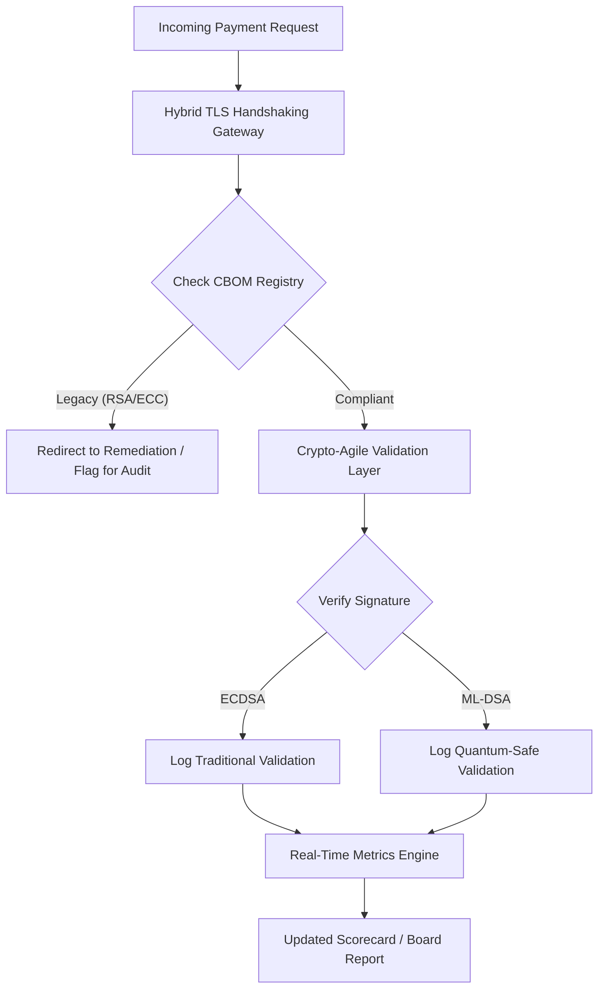

---
# Front Matter (YAML)
author: "contact@sebastienrousseau.com (Sebastien Rousseau)"
banner_alt: "Abstract digital boardroom table na natutunaw papuntang quantum lattice — pagpapakita ng strategic governance na kailangan upang ilipat ang core banking infrastructure tungo sa FIPS 203 at 204"
banner_height: "1597"
banner_width: "2584"
banner: "https://cloudcdn.pro/stocks/images/quantum-governance-AbC123XyZ.webp"
cdn: "https://cloudcdn.pro"
charset: "UTF-8"
cname: "sebastienrousseau.com"
copyright: "© Copyright 2025 - 2026 - Sebastien Rousseau. All rights reserved."
date: "Hunyo 29, 2026"
description: "Naghahatid ang 2026 Post-Quantum Security Scorecard sa mga board at senior management ng fiduciary metric framework upang subaybayan ang CBOM, HNDL exposure, at NIST FIPS 203/204 migration velocity sa tier-1 banking."
format-detection: "telephone=no"
hreflang: "fil"
icon: "https://cloudcdn.pro/clients/sebastienrousseau/v1/logos/sebastienrousseau.svg"
id: "https://sebastienrousseau.com/2026-06-29-post-quantum-security-scorecard-board-level-fiduciary-agility-2026"
image_alt: "Black and White Portrait of Sebastien Rousseau"
image_height: "162"
image_width: "162"
image: "https://cloudcdn.pro/stocks/images/sebastienrousseau.webp"
keywords: "post-quantum cryptography, PQC scorecard, NIST FIPS 203, NIST FIPS 204, CBOM, HNDL, banking governance, crypto-agility, KyberLib, DORA compliance, SM&CR, quantum resilience"
language: "fil-PH"
last_reviewed: "2026-06-29"
layout: "report"
locale: "fil_PH"
logo_alt: "Logo for Sebastien Rousseau"
logo_height: "44"
logo_width: "44"
logo: "https://cloudcdn.pro/clients/sebastienrousseau/v1/logos/sebastienrousseau.svg"
measurementID: "G-169G4ET5HQ"
name: "Sebastien Rousseau"
permalink: "https://sebastienrousseau.com/2026-06-29-post-quantum-security-scorecard-board-level-fiduciary-agility-2026"
rating: "general"
referrer: "no-referrer"
robots: "index, follow"
schema: "FAQPage, Article"
seo_title: "2026 Post-Quantum Security Scorecard: Framework para sa Board"
short_name: "sebastienrousseau"
subtitle: "Paano dapat sukatin at pamahalaan ng mga board ang migration tungo sa NIST FIPS 203 at 204, sinusubaybayan ang CBOM completeness at pinapaliit ang Harvest-Now-Decrypt-Later (HNDL) exposure sa corporate treasury."
tags: "post-quantum, cryptography, banking, governance, DORA, FIPS-203, FIPS-204, CBOM, HNDL, KyberLib, SM&CR"
theme-color: "0, 83, 191"
title: "Ang 2026 Post-Quantum Security Scorecard: Isang Board-Level Metric Framework"
url: "https://sebastienrousseau.com/2026-06-29-post-quantum-security-scorecard-board-level-fiduciary-agility-2026"
viewport: "width=device-width, initial-scale=1, shrink-to-fit=no"

# RSS
atom_link: "https://sebastienrousseau.com/2026-06-29-post-quantum-security-scorecard-board-level-fiduciary-agility-2026/rss.xml"
category: "Technology"
generator: "Static Site Generator (SSG) (version 0.0.40)"
item_description: "Naghahatid ang 2026 Post-Quantum Security Scorecard sa mga board ng fiduciary metric framework upang subaybayan ang CBOM, HNDL exposure, at NIST migration velocity."
item_pub_date: "Mon, 29 Jun 2026 07:07:07 +0000"
item_title: "Ang 2026 Post-Quantum Security Scorecard: Isang Board-Level Metric Framework"
pub_date: "Mon, 29 Jun 2026 07:07:07 +0000"
type: "article"

# Twitter Card
twitter_card: "summary_large_image"
twitter_creator: "@wwdseb"
twitter_description: "Ang 2026 Post-Quantum Security Scorecard: Paano sinusukat ng mga banking board ang cryptographic agility, CBOM completeness, at HNDL exposure."
twitter_image: "https://cloudcdn.pro/clients/sebastienrousseau/v1/logos/sebastienrousseau.svg"
twitter_title: "Ang 2026 Post-Quantum Security Scorecard para sa Banking Boards"
twitter_url: "https://sebastienrousseau.com/2026-06-29-post-quantum-security-scorecard-board-level-fiduciary-agility-2026"

excerpt: "Hanggang Hunyo 2026, ang post-quantum cryptography (PQC) ay lumipat mula sa eksperimentong teknikal na alalahanin tungong pangunahing fiduciary obligation. Dapat nang pangasiwaan ng mga board ang sistematikong migration ng legacy encryption..."

# Template-completeness keys (parity with hsh/noyalib shape)
apple_mobile_web_app_orientations: "portrait"
apple_touch_icon_sizes: "192x192"
apple-mobile-web-app-capable: "yes"
apple-mobile-web-app-status-bar-inset: "black"
apple-mobile-web-app-status-bar-style: "black-translucent"
apple-touch-fullscreen: "yes"
apple-mobile-web-app-title: "PQC Scorecard 2026"
author_location: "London, United Kingdom"
author_twitter: "@wwdseb"
author_website: "https://sebastienrousseau.com"
docs: https://validator.w3.org/feed/docs/rss2.html
item_guid: "https://sebastienrousseau.com/2026-06-29-post-quantum-security-scorecard-board-level-fiduciary-agility-2026/rss.xml"
item_link: "https://sebastienrousseau.com/2026-06-29-post-quantum-security-scorecard-board-level-fiduciary-agility-2026/rss.xml"
last_build_date: "Mon, 29 Jun 2026 06:06:06 +0000"
managing_editor: "contact@sebastienrousseau.com (Sebastien Rousseau)"
menu: "active"
msapplication-navbutton-color: "0, 83, 191"
site_components: "Kaishi, Kaishi Builder, Kaishi CLI, Kaishi Templates, Kaishi Themes"
site_last_updated: "2023-07-05"
site_software: "Static Site Generator, Rust"
site_standards: "HTML5, CSS3, RSS, Atom, JSON, XML, YAML, Markdown, TOML"
thanks: "Salamat sa pagbabasa!"
ttl: "60"
twitter_image_alt: "Black and White Portrait of Sebastien Rousseau"
twitter_site: "@wwdseb"
webmaster: "contact@sebastienrousseau.com"
---

# Ang 2026 Post-Quantum Security Scorecard: Isang Board-Level Metric Framework para sa Fiduciary Cryptographic Agility

<aside class="post-lead" aria-label="Buod ng artikulo">

<strong>TL;DR.</strong> Hanggang Hunyo 2026, ang post-quantum cryptography (PQC) ay lumipat mula sa eksperimentong teknikal na alalahanin tungong pangunahing fiduciary obligation. Dapat nang pangasiwaan ng mga board ang sistematikong migration ng legacy encryption tungo sa pamantayan ng NIST FIPS 203 at 204 upang mabawasan ang systemic financial at operational risk sa ilalim ng DORA.

<strong>Mga pangunahing takeaway</strong>

<ul class="post-lead-takeaways">
  <li><strong>G20 alignment at matitigas na deadline.</strong> Itinakda ng mga international regulator ang huling bahagi ng 2020s bilang matigas na deadline para sa quantum-safe transition, na nag-aatas sa mga institusyon na magpakita ng masusukat na migration progress.</li>
  <li><strong>Ang Cryptographic Bill of Materials (CBOM).</strong> Katumbas ng software BOM, ang CBOM ay isang live, automated na imbentaryo ng lahat ng cryptographic asset, mahalaga upang matiyak ang visibility sa buong supply chain.</li>
  <li><strong>Harvest-Now-Decrypt-Later (HNDL) exposure.</strong> Kasalukuyang humaharang at nag-iimbak ang mga kalaban ng encrypted high-value wholesale payment data; ang pagpapagaan nito ay nangangailangan ng agarang deployment ng hybrid PQC architecture.</li>
  <li><strong>Fiduciary governance sa pamamagitan ng crypto-agility.</strong> Ang crypto-agility ay isang masusukat na governance metric. Ang kakayahang magpalit ng cryptographic primitive nang walang core system re-engineering (gamit ang mga library tulad ng KyberLib) ay isang board-level accountability na sa ilalim ng SM&CR.</li>
</ul>

<strong>Karagdagang babasahin:</strong> <a href="https://sebastienrousseau.com/2026-06-12-kyberlib-post-quantum-banking-migration-standards-code-2026">Ang KyberLib at ang Post-Quantum Banking Migration sa 2026</a>, <a href="https://sebastienrousseau.com/2023-11-19-crystals-kyber-the-safeguarding-algorithm-in-a-quantum-age/index.html">CRYSTALS-Kyber: Ang Safeguarding Algorithm sa Quantum Age</a>.

</aside>
Hindi na isang research project ang post-quantum security. Tumitiktok na ang "supervisory clock" patungo sa huling bahagi ng 2020s enforcement deadline. Ang pagfa-finalise ng [NIST FIPS 203 (ML-KEM)](https://csrc.nist.gov/pubs/fips/203/final) at [NIST FIPS 204 (ML-DSA)](https://csrc.nist.gov/pubs/fips/204/final) ay nag-codify sa pamantayan para sa key encapsulation at digital signature.

Inaasahan na ngayon ng mga regulatory body na lumampas sa mga pilot programme ang mga Tier-1 bank. Sa 2026, lumipat ang focus sa industrialisation ng mga pamantayang ito. Ang pagpalya na magpakita ng malinaw na migration path ay nagdadala ng malaking regulatory penalty sa ilalim ng [Digital Operational Resilience Act (DORA)](https://eur-lex.europa.eu/eli/reg/2022/2554/oj) at posibleng personal liability para sa mga director na hindi pinapansin ang nakikinitang banta ng quantum-enabled decryption.

## 01. Ang Board-Level Quantum Scorecard

Nagbibigay ang sumusunod na mga metric ng standardised framework para sa mga board upang suriin ang quantum readiness at cryptographic health sa buong Commercial and Investment Banking (CIB) estate.

### Table 1: Mga Metric at Tolerance ng PQC Scorecard

| Metric | Mathematical Formula | Mga Board-Approved Tolerance | Panganib kung Wala sa Tolerance |
| ---- | ---- | ---- | ---- |
| **Inventory Completeness Percentage (ICP)** | (Identified Crypto Assets / Total Estimated Assets) × 100 | > 98% | Shadow encryption at blind spot sa high-value clearing data path. |
| **HNDL Exposure Rate (HER)** | (Long-Lived Data on Legacy Crypto / Total Long-Lived Data) × 100 | < 5% | Permanenteng compromise ng mga trade secret, sovereign debt ledger, at wholesale payment record. |
| **NIST Migration Progress Rate (MPR)** | (Systems running FIPS 203/204 / Total Critical Systems) × 100 | > 60% (by YE 2026) | Regulatory non-compliance at exclusion mula sa mga G20-aligned counterparty. |
| **Crypto-Agility Readiness Index (CARI)** | (Apps with Abstracted Crypto Layers / Total Core Apps) × 100 | > 85% | Matinding technical debt at kawalan ng kakayahang tumugon sa mga future algorithm deprecation. |

## 02. Ang Cryptographic Bill of Materials (CBOM)

Ang ICP metric ay binebaseline sa pamamagitan ng isang masusing **CBOM Discovery Phase**. Ito ay isang automated process na tumutukoy sa bawat cryptographic endpoint sa loob ng enterprise.

- **Endpoint Discovery:** Pag-scan sa internal at cloud network para sa mga active TLS session upang matukoy ang legacy RSA o ECC usage.
- **Key Inventory:** Pag-mapa ng public/private key pair sa kani-kanilang mga may-ari at pag-mapa ng eksaktong expiration date.
- **Dependency Mapping:** Pagtukoy sa mga third-party library at API na umaasa sa mga deprecated algorithm.

Ang discovery phase na ito ay lumilikha ng iisang source of truth, na nagbibigay-kakayahan sa CISO na mag-ulat sa cryptographic health sa parehong granularity ng financial performance.

## 03. Pag-aalis ng HNDL Exposure sa Wholesale Payments

Aktibong tinatarget ng mga kalaban ang mga wholesale payment at long-lived corporate database. Ang mga "Harvest-Now-Decrypt-Later" (HNDL) attack na ito ay kinabibilangan ng paghaharang at pag-archive ng encrypted traffic ngayon.

Kahit walang cryptographically relevant quantum computer (CRQC) na umiiral ngayon, ang data na hinarang ngayon ay magiging vulnerable sa hinaharap. Ang pagpapagaan nito ay nangangailangan ng high-priority migration ng long-lived data (hal., identity record, 30-taong bond contract, at legal archive), na direktang nagpapababa ng HER metric. Ang pag-upgrade ng payment channel tungo sa hybrid PQC-traditional encryption (gamit ang ML-KEM kasama ng X25519) ay nagbibigay ng agarang depensa laban sa mga archival threat.

## 04. Pag-operationalise ng Crypto-Agility sa Pamamagitan ng Well-Designed Interfaces

Ang crypto-agility ay nakakamit sa pamamagitan ng engineering abstraction. Ipinapakita ng mga modernong library tulad ng [KyberLib](https://sebastienrousseau.com/2026-06-12-kyberlib-post-quantum-banking-migration-standards-code-2026) kung paano maaaring magpatupad ang mga developer ng quantum-safe module nang hindi muling isinusulat ang buong application stack.

- **Abstracted Wrappers:** Tumatawag ang mga aplikasyon ng generic `encrypt()` o `sign()` function sa halip na algorithm-specific routine.
- **Runtime Swapping:** Maaaring ipalit ang underlying module mula ECDSA tungong ML-DSA sa pamamagitan ng configuration change sa halip na complex code deployment.

Tinitiyak ng architecture na ito na kung mai-compromise ang isang partikular na PQC algorithm sa hinaharap, makakapagpalit ang organisasyon sa loob ng mga oras sa halip na mga taon.

## 05. Ang Quantum-Safe Ingress Validation Workflow

Inilalarawan ng sumusunod na diagram ang lifecycle ng data na pumapasok sa secure perimeter sa isang quantum-agile banking environment.

## Konklusyon

Ang cryptographic estate ng isang Tier-1 bank ay hindi na isang CISO concern. Ito ay fiduciary infrastructure. Itinakda ng NIST FIPS 203 at 204 ang mga algorithm; itinakda ng DORA Article 5 ang accountability surface; pina-pin ito ng SM&CR sa isang named senior manager. Ang scorecard sa itaas — Inventory Completeness, HNDL Exposure, Migration Progress, Crypto-Agility — ay nagbibigay sa isang board ng apat na numero na kailangan nito upang pamahalaan ang estate na iyon nang hindi kailangang basahin ang cryptographic code.

Ang numerong pinakamahalaga ay ang HNDL Exposure. Bawat legacy-encrypted record na nakaupo sa isang wholesale-payments archive ngayon ay magiging readable sa araw na maibibigay ang unang cryptographically relevant quantum computer. Tahimik at asymmetric ang countdown: mga defender lamang ang nakakakilos sa data na hawak nila, ang mga kalaban ay maaaring kumilos sa data na ilang taon na nilang naipuslit. Ang isang 30-taong corporate bond contract na na-encrypt gamit ang RSA-2048 noong 2024 ay isang kontrata na nawawalan ng confidentiality guarantee sa araw na mag-go-live ang isang CRQC.

[KyberLib](https://sebastienrousseau.com/2026-06-12-kyberlib-post-quantum-banking-migration-standards-code-2026) at ang mga katulad nito ay nagpapalit nito mula sa isang multi-year platform rewrite tungong isang configuration change. Ang trabaho ng board ay hindi ang magsulat ng code. Ang trabaho ng board ay igiit na ang Crypto-Agility Readiness Index — ang bahagi ng mga core application sa likod ng abstracted cryptographic interface — ay lumagpas sa 85% sa loob ng labindalawang buwan, at basahin ang quarterly scorecard.

<aside class="author-card" aria-label="Tungkol sa awtor"><strong class="author-card-name"><a href="/about/index.html">Sebastien Rousseau</a></strong>Senior banking technologist na nagsusulat tungkol sa applied AI, ISO 20022 migration, post-quantum cryptography para sa financial services, at ang structural transformation ng wholesale payments.20+ taon sa HSBC Commercial & Investment Bank, PayPal, Barclays, Shazam. <a href="https://www.linkedin.com/in/sebastienrousseau/" rel="external noopener">LinkedIn</a> &middot; <a href="https://github.com/sebastienrousseau" rel="external noopener">GitHub</a></aside>

Huling sinuri <time datetime="2026-06-29">2026-06-29</time>.

