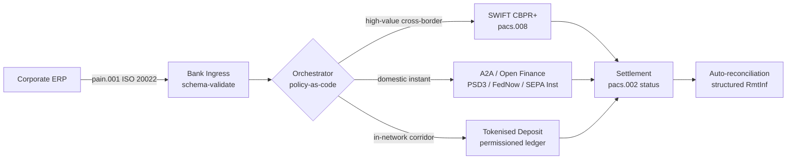

---

# Front Matter (YAML)

author: "contact@sebastienrousseau.com (Sebastien Rousseau)"
banner_alt: "Porte-conteneurs dans un port en eaux profondes à l'aube — symbolisant le mouvement multi-rails et transfrontalier de la valeur des entreprises à travers ISO 20022, l'open finance et les réseaux de règlement en dépôts tokenisés en 2026"
banner_height: "1597"
banner_width: "2584"
banner: "https://cloudcdn.pro/stocks/images/viktor-forgacs-KxVRDiFdTVo.webp"
cdn: "https://cloudcdn.pro"
charset: "UTF-8"
cname: "sebastienrousseau.com"
copyright: "© Copyright 2025 - 2026 - Sebastien Rousseau. All rights reserved."
date: "24 juin 2026"
description: "Comment ISO 20022, A2A, l'open finance sous PSD3/FiDA et les dépôts tokenisés remodèlent la trésorerie corporate transfrontalière aux côtés de SWIFT en 2026."
format-detection: "telephone=no"
hreflang: "fr"
icon: "https://cloudcdn.pro/clients/sebastienrousseau/v1/logos/sebastienrousseau.svg"
id: "https://sebastienrousseau.com/2026-06-24-cross-border-iso-20022-open-finance-tokenised-deposits-treasury-2026"
image_alt: "Portrait en noir et blanc de Sebastien Rousseau"
image_height: "162"
image_width: "162"
image: "https://cloudcdn.pro/stocks/images/sebastien-rousseau.png"
keywords: "paiements transfrontaliers, ISO 20022, open finance, PSD3, FiDA, dépôts tokenisés, stablecoins, A2A, trésorerie, CIB, Nexi, Mastercard, multi-rails, pacs.008, pain.001, SWIFT, FedNow, SEPA Instant, RTP, CBPR+"
language: "fr-FR"
last_reviewed: "2026-06-24"
layout: "report"
locale: "fr_FR"
logo_alt: "Logo de Sebastien Rousseau"
logo_height: "44"
logo_width: "44"
logo: "https://cloudcdn.pro/clients/sebastienrousseau/v1/logos/sebastienrousseau.svg"
menu: ""
measurementID: "G-169G4ET5HQ"
name: "Sebastien Rousseau"
permalink: "https://sebastienrousseau.com/2026-06-24-cross-border-iso-20022-open-finance-tokenised-deposits-treasury-2026"
rating: "general"
referrer: "no-referrer"
robots: "index, follow"
schema: "FAQPage, Article"
seo_title: "Transfrontalier 2026 : ISO 20022, open finance, rails tokenisés"
short_name: "sebastienrousseau"
subtitle: "La trésorerie corporate transfrontalière en 2026 fonctionne sur une mécanique multi-rails — ISO 20022 comme grammaire commune, A2A et open finance comme rail face client, dépôts tokenisés comme jambe de règlement de gros, SWIFT continuant d'ancrer la longue traîne."
tags: "paiements transfrontaliers, ISO 20022, open finance, PSD3, FiDA, dépôts tokenisés, A2A, trésorerie, CIB, multi-rails, pacs.008, pain.001, SWIFT, FedNow, SEPA Instant, RTP, CBPR+"
theme-color: "0, 83, 191"
title: "Transfrontalier 2026 : ISO 20022, open finance et dépôts tokenisés dans la trésorerie corporate"
url: "https://sebastienrousseau.com/2026-06-24-cross-border-iso-20022-open-finance-tokenised-deposits-treasury-2026"
viewport: "width=device-width, initial-scale=1, shrink-to-fit=no"

# RSS - The RSS feed front matter (YAML).
atom_link: "https://sebastienrousseau.com/2026-06-24-cross-border-iso-20022-open-finance-tokenised-deposits-treasury-2026/rss.xml"
category: "Technology"
docs: https://validator.w3.org/feed/docs/rss2.html
generator: "Static Site Generator (SSG) (version 0.0.26)"
item_description: "Comment ISO 20022, A2A, l'open finance sous PSD3/FiDA et les dépôts tokenisés remodèlent la trésorerie corporate transfrontalière aux côtés de SWIFT en 2026."
item_guid: "https://sebastienrousseau.com/2026-06-24-cross-border-iso-20022-open-finance-tokenised-deposits-treasury-2026/rss.xml"
item_link: "https://sebastienrousseau.com/2026-06-24-cross-border-iso-20022-open-finance-tokenised-deposits-treasury-2026/rss.xml"
item_pub_date: "Wed, 24 Jun 2026 07:07:07 +0000"
item_title: "Transfrontalier 2026 : ISO 20022, open finance et dépôts tokenisés dans la trésorerie corporate"
last_build_date: "Wed, 24 Jun 2026 06:06:06 +0000"
managing_editor: "contact@sebastienrousseau.com (Sebastien Rousseau)"
pub_date: "Wed, 24 Jun 2026 07:07:07 +0000"
ttl: "60"
type: "article"
webmaster: "contact@sebastienrousseau.com"

# Apple - The Apple front matter (YAML).
apple_mobile_web_app_orientations: "portrait"
apple_touch_icon_sizes: "192x192"
apple-mobile-web-app-capable: "yes"
apple-mobile-web-app-status-bar-inset: "black"
apple-mobile-web-app-status-bar-style: "black-translucent"
apple-mobile-web-app-title: "Transfrontalier 2026 : ISO 20022, rails tokenisés"
apple-touch-fullscreen: "yes"

# MS Application - The MS Application front matter (YAML).

msapplication-navbutton-color: "0, 83, 191"

# Twitter Card - The Twitter Card front matter (YAML).

twitter_card: "summary_large_image"
twitter_creator: "@wwdseb"
twitter_description: "Comment ISO 20022, A2A, l'open finance sous PSD3/FiDA et les dépôts tokenisés remodèlent la trésorerie corporate transfrontalière aux côtés de SWIFT en 2026."
twitter_image: "https://cloudcdn.pro/clients/sebastienrousseau/v1/logos/sebastienrousseau.svg"
twitter_image_alt: "Logo de Sebastien Rousseau"
twitter_site: "@wwdseb"
twitter_title: "Transfrontalier 2026 : ISO 20022, open finance, rails tokenisés"
twitter_url: "https://sebastienrousseau.com/2026-06-24-cross-border-iso-20022-open-finance-tokenised-deposits-treasury-2026"

excerpt: "La trésorerie corporate transfrontalière en 2026 est un problème d'ingénierie multi-rails. ISO 20022 est la grammaire commune, A2A et l'open finance sous PSD3/FiDA constituent le rail face client, les dépôts tokenisés portent la jambe de règlement de gros, et SWIFT continue d'ancrer la longue traîne. Le travail intéressant se situe dans la couche d'orchestration, pas dans le modèle."

# Humans.txt - The Humans.txt front matter (YAML).
author_website: "https://sebastienrousseau.com"
author_twitter: "@wwdseb"
author_location: "London, UK"
thanks: "Merci de votre lecture !"
site_last_updated: "2026-06-24"
site_standards: "HTML5, CSS3, RSS, Atom, JSON, XML, YAML, Markdown, TOML"
site_components: "Kaishi, Kaishi Builder, Kaishi CLI, Kaishi Templates, Kaishi Themes"
site_software: "Static Site Generator, Rust"

---

# Transfrontalier 2026 : ISO 20022, open finance et dépôts tokenisés dans la trésorerie corporate

<!-- lead-start -->
<aside class="post-lead" aria-label="Résumé de l'article">

<strong>TL;DR.</strong> La trésorerie corporate transfrontalière en 2026 fonctionne en parallèle sur quatre rails — SWIFT CBPR+, A2A instantané sous PSD3/FiDA, dépôts tokenisés et rails de stablecoins — assemblés par ISO 20022 comme grammaire commune. Pour les équipes CIB et de trésorerie corporate, le travail est l'orchestration, pas le choix du rail.

<strong>Points clés à retenir</strong>

<ul class="post-lead-takeaways">
  <li><strong>Le multi-rails est la norme.</strong> Aucun rail unique ne compense tous les corridors, tous les calibres de ticket, tous les cut-offs. La trésorerie choisit le rail par paiement, pas par banque.</li>
  <li><strong>ISO 20022 est la lingua franca.</strong> pacs.008, pacs.009 et pain.001 portent désormais les données de remise à travers les rails RTGS, instantanés, A2A et de dépôts tokenisés — rendant les décisions de routage pilotées par la donnée plutôt que verrouillées par le rail.</li>
  <li><strong>L'open finance élargit le périmètre.</strong> PSD3 et FiDA poussent le modèle open banking vers les retraites, l'assurance et les données de trésorerie ; Nexi et Mastercard bâtissent la couche d'orchestration que consomment les corporates.</li>
  <li><strong>Les dépôts tokenisés portent la jambe de gros.</strong> Les dépôts tokenisés émis par les banques et les rails de stablecoins intégrés s'inscrivent sous le rail instantané face client et règlent la jambe de gros en quasi-T+0.</li>
</ul>

<strong>Lectures complémentaires :</strong> <a href="https://sebastienrousseau.com/2026-06-07-autonomous-treasury-index-programmable-liquidity-tokenised-deposits-2026">L'indice de la trésorerie autonome 2026 : liquidité programmable et dépôts tokenisés</a>, <a href="https://sebastienrousseau.com/2026-06-15-pacs008-automation-iso-20022-interbank-payments-2026">Automatisation pacs.008 : les paiements interbancaires ISO 20022 en 2026</a>.

</aside>
<!-- lead-end -->

Un industriel européen paie un fournisseur brésilien 4,2 millions d'euros un mercredi matin. La station de travail de trésorerie ne choisit pas une banque. Elle choisit un rail — une séquence de rails. L'instruction face client atterrit sur un message pain.001 A2A acheminé via un prestataire d'open finance sous PSD3. La banque enjambe deux juridictions correspondantes sur des dépôts tokenisés au sein d'un réseau privé CIB. La longue traîne — un solde de facture de 80 000 USD vers un sous-fournisseur sans relation de dépôt tokenisé — circule toujours sur SWIFT CBPR+ sous forme de pacs.008. Le client voit un seul paiement. L'architecture voit quatre rails. ISO 20022 est la seule raison pour laquelle l'ensemble tient.

C'est le modèle opérationnel que décrit Mastercard quand l'entreprise évoque [l'évolution de l'open banking vers l'open finance](https://www.mastercard.com/us/en/news-and-trends/Insights/2026/open-banking-to-open-finance-the-evolution-of-financial-data.html "Mastercard : open banking to open finance, the evolution of financial data") — données et paiements fusionnés dans une couche d'orchestration unique, avec un rail choisi par le système et non par le client. La question intéressante pour les technologues bancaires seniors n'est pas de savoir quel rail l'emporte. C'est de savoir comment la couche d'orchestration est conçue, gouvernée et rapprochée.

## 01. Des cartes à l'A2A — le basculement open finance

Les rails carte ne disparaissent pas. Ils sont recadrés.

Sur 2025 et jusqu'en 2026, [PSD3 et le règlement Financial Data Access (FiDA)](https://www.consultancy.uk/news/42202/orchestrating-open-banking-for-platform-growth-2026-outlook "Consultancy.uk : orchestrer l'open banking pour la croissance des plateformes, perspectives 2026") ont étendu l'obligation open banking au-delà des comptes de paiement, vers les retraites, les crédits immobiliers, l'épargne, l'assurance et les données de trésorerie corporate. L'implication pour la trésorerie corporate est directe : un relationship manager CIB peut désormais consommer, sur instruction du corporate, l'image complète de sa liquidité chez plusieurs banques via un seul contrat d'API.

Deux opérateurs construisent visiblement la couche d'orchestration que les corporates consommeront. Nexi a étendu son empreinte d'acquisition vers l'initiation A2A à travers SEPA Instant et les corridors RTGS paneuropéens, en ISO 20022 natif de bout en bout. La plateforme d'open finance de Mastercard — ancrée sur ses acquisitions d'Aiia et de Finicity — fournit la couche d'agrégation de données et de consentement sous-jacente, l'initiation de paiement émergeant via le même parc d'API qui servait jusqu'ici les autorisations carte.

Ce basculement compte pour trois raisons :

1. **Économie unitaire.** L'A2A initié sous PSD3 retire l'interchange du paiement. Pour les flux B2B à fort ticket, l'économie est matérielle ; pour les flux consommateurs à petit ticket, la pile de coûts marchand s'effondre.
2. **Qualité des données.** L'A2A sous ISO 20022 porte des données de remise structurées que la carte n'a jamais su porter. Des taux d'auto-rapprochement supérieurs à 95 % sont désormais la norme.
3. **Modèle de risque.** L'A2A est un virement, pas une autorisation carte. La surface de fraude, le modèle de chargeback et le modèle de litige sont tous différents. Les équipes de trésorerie corporate doivent comprendre que la couche de protection du client est en cours de reconstruction, pas d'héritage.

Le CIB qui vend une proposition multi-rails en 2026 vend de l'orchestration — pas de l'accès. L'accès est désormais réglementé.

## 02. ISO 20022 comme lingua franca à travers les rails

La raison pour laquelle le multi-rails est seulement viable, c'est que le format de message est désormais cohérent à travers les rails.

Le Comité des paiements et des infrastructures de marché (CPMI) de la BRI a posé l'argument architectural dans ses [exigences d'harmonisation ISO 20022 pour l'amélioration des paiements transfrontaliers](https://www.bis.org/cpmi/publ/d230.pdf "BIS CPMI : exigences d'harmonisation ISO 20022 pour l'amélioration des paiements transfrontaliers"). La bascule de novembre 2025 vers CBPR+ a clos l'ère MT103 / MT202 pour la messagerie interbancaire transfrontalière. Depuis ce point, chaque rail majeur — SWIFT, FedNow, SEPA Instant, RTP et les principaux systèmes de paiement instantané en Asie et en Amérique latine — parle la même grammaire pacs.008 / pacs.009 / pain.001.

La conséquence pratique pour la trésorerie corporate :

- **Le routage est piloté par la donnée.** La station de travail de trésorerie peut lire un pain.001 une seule fois et choisir le rail par paiement selon le corridor, le calibre de ticket, le cut-off et la relation contrepartie — sans remapper le message.
- **Les données de remise survivent au saut.** Les champs de remise structurés (`<RmtInf><Strd>`) traversent les jambes correspondantes sans troncature. Les taux d'auto-rapprochement grimpent parce que la donnée n'est plus perdue à la frontière du rail.
- **Le filtrage sanctions devient auditable.** Les champs structurés `<Dbtr>` / `<Cdtr>` / `<DbtrAgt>` / `<CdtrAgt>` avec références LEI remplacent le filtrage de noms en texte libre. Les taux de touche baissent. Les files d'investigation se réduisent.

Le schéma ci-dessous suit un pain.001 unique depuis l'ingress de la banque, à travers l'orchestrateur policy-as-code, jusqu'au rail que le corridor et le calibre de ticket imposent — un message, plusieurs rails, sans remapping.

Le coût de cette cohérence est la discipline d'ingénierie. ISO 20022 est permissif. Deux banques peuvent être pleinement conformes CBPR+ et produire pourtant des messages pacs.008 différant sur l'usage des champs, le jeu de caractères et la structure des données de remise. Le CIB qui l'emporte sur le transfrontalier en 2026 impose un profil de message plus strict que ce que la norme exige — et rejette au parse, pas au règlement.

## 03. Dépôts tokenisés et rails stables

La jambe de règlement de gros est l'endroit où l'histoire des rails devient intéressante.

Le tableau 2026, bien capté par [l'analyse Trade Treasury Payments sur l'automatisation, les rails de contingence, ISO 20022 et les stablecoins](https://tradetreasurypayments.com/articles/automation-contingency-rails-iso-20022-and-stablecoins-the-2026-trends-reshaping-corporate-finance-and-b2b-payments "Trade Treasury Payments : automatisation, rails de contingence, ISO 20022 et stablecoins, les tendances 2026 qui remodèlent la finance corporate et les paiements B2B"), scinde la couche de règlement de gros en deux modèles structurellement différents.

**Dépôts tokenisés émis par les banques.** Une banque commerciale émet une dette tokenisée sur un registre permissionné — JPM Coin, le token de dépôt lié à Orion chez HSBC, les équivalents des principaux CIB européens. Le token est une créance directe sur la banque émettrice. Le règlement est quasi-T+0 au sein du réseau. La conformité relève de la banque émettrice. Le rail est pleinement réglementé, pleinement traçable, et restreint aux participants embarqués par l'émetteur.

**Rails de stablecoins intégrés.** Un stablecoin réglementé — pleinement réservé, audité et opérant sous MiCA ou le régime régional équivalent — règle un corridor que les dépôts tokenisés émis par les banques n'atteignent pas encore. Le token est une créance sur la réserve, pas sur un bilan bancaire. La conformité est partagée entre l'émetteur, l'on-ramp et l'off-ramp.

Les deux modèles ne sont pas concurrents. Ils sont empilés. Un produit transfrontalier CIB en 2026 utilise typiquement des dépôts tokenisés émis par les banques pour la jambe intra-réseau et un stablecoin réglementé pour le corridor où le rail intra-réseau s'arrête. Le corporate voit un seul paiement ISO 20022. L'histoire de règlement en dessous est multi-token.

La question au niveau du conseil est la même que celle que posent les comités de risque opérationnel depuis les premiers pilotes de liquidité programmable : qui porte l'exposition crédit sur le token, et pour combien de temps ? Les dépôts tokenisés donnent une réponse nette — la banque émettrice, jusqu'au burn. Les rails de stablecoins intégrés en donnent une plus nuancée — la réserve, sous réserve du cycle d'audit et de la garantie de rédemption. Une équipe de trésorerie qui ne documente pas la réponse par rail et par corridor porte un risque crédit non mesuré à son bilan.

## 04. La pile de trésorerie autonome

Au-dessus de la couche de rails se trouve la couche d'orchestration. Au-dessus de la couche d'orchestration se trouve la couche d'agents.

J'ai détaillé l'architecture dans [L'indice de la trésorerie autonome 2026 : liquidité programmable et dépôts tokenisés](https://sebastienrousseau.com/2026-06-07-autonomous-treasury-index-programmable-liquidity-tokenised-deposits-2026 "Sebastien Rousseau : L'indice de la trésorerie autonome 2026"). La version courte : la trésorerie agentique en 2026 est la couche d'orchestration, exprimée en politique en tant que code, avec des agents délimités qui s'y exécutent.

La pile est :

1. **Couche de rails.** SWIFT CBPR+, A2A instantané, dépôts tokenisés, stablecoins réglementés. Chaque rail possède un profil publié, une table de cut-off, une courbe de coûts et un modèle de finalité de règlement.
2. **Couche d'orchestration.** ISO 20022 en entrée, ISO 20022 en sortie. Décision de rail par paiement selon le corridor, le ticket, le cut-off, la relation contrepartie et la politique. La politique est versionnée, signée et auditable.
3. **Couche d'agents.** Des agents de trésorerie délimités exécutent la politique d'orchestration avec des bornes d'appel d'outil, des journaux d'audit et des coupures d'urgence. L'agent ne choisit pas le rail. La politique choisit le rail. L'agent fait tourner la politique.
4. **Couche de rapprochement.** Les messages ISO 20022 pacs.008 / pacs.002 / camt.054 se rapprochent de l'instruction pain.001 d'origine, avec des données de remise structurées qui bouclent la boucle sans intervention manuelle.

Le CIB qui vend cette pile en 2026 vend quatre choses à la fois — et les tarife séparément. Le corporate qui l'achète achète de l'optionalité à travers les rails, avec un seul standard de message, une seule couche de politique, un seul flux de rapprochement. C'est cela, le basculement architectural. Tout le reste est détail d'implémentation.

## Conclusion

La trésorerie corporate transfrontalière en 2026 est un problème d'ingénierie multi-rails. ISO 20022 est la grammaire qui rend le multi-rails traitable. PSD3 et FiDA élargissent le périmètre de données et imposent l'open finance dans le flux de travail de trésorerie corporate. Les dépôts tokenisés et les stablecoins réglementés portent la jambe de règlement de gros. SWIFT continue d'ancrer la longue traîne.

Le CIB qui l'emporte est celui qui bâtit la couche d'orchestration — pas celui qui choisit un rail unique et y joue la franchise. L'équipe de trésorerie corporate qui l'emporte est celle qui documente l'exposition crédit par rail et par corridor, impose un profil ISO 20022 plus strict que ce que le régulateur exige, et traite la décision de rail comme une politique, pas comme un arbitrage paiement par paiement.

Le travail intéressant se situe dans la couche d'orchestration. Bâtissez-la avec soin.

<!-- enrich-start -->
<aside class="author-card" aria-label="À propos de l'auteur"><strong class="author-card-name"><a href="/about/index.html">Sebastien Rousseau</a></strong>Technologue bancaire senior, écrit sur l'IA appliquée, la migration ISO 20022, la cryptographie post-quantique pour les services financiers et la transformation structurelle des paiements de gros.20+ années chez HSBC Commercial &amp; Investment Bank, PayPal, Barclays, Shazam, AKQA, Virgin Group. <a href="/about/index.html">Profil complet</a> &middot; <a href="https://www.linkedin.com/in/sebastienrousseau/" rel="external noopener">LinkedIn</a> &middot; <a href="https://github.com/sebastienrousseau" rel="external noopener">GitHub</a></aside>

Dernière relecture <time datetime="2026-06-24">2026-06-24</time>.

<!-- enrich-end -->
