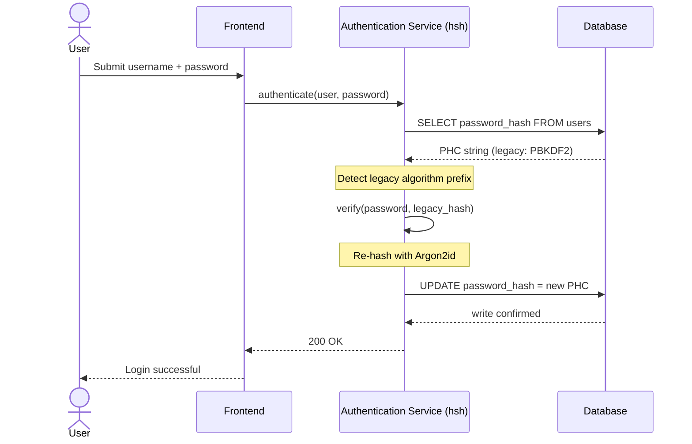
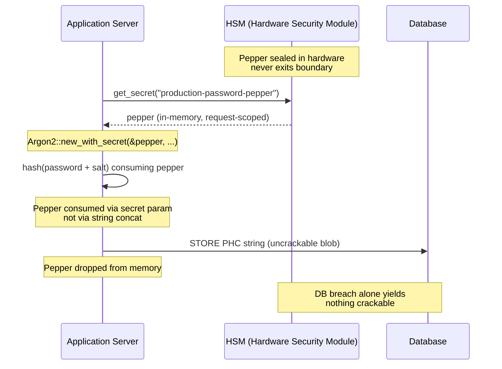

---
# Front Matter (YAML)
author: "contact@sebastienrousseau.com (Sebastien Rousseau)"
banner_alt: "Tsarin rumbun cryptography mai ƙayatarwa cikin haske mai shuɗi da zinariya — yana nuna iyaka mai aminci na ƙwaƙwalwa inda ake haɓaka tsoffin hashes na password zuwa Argon2id a lokacin ainihi"
banner_height: "1597"
banner_width: "2584"
banner: "https://cloudcdn.pro/stocks/images/crypto-vault-XyZ1bLQnP9.webp"
cdn: "https://cloudcdn.pro"
charset: "UTF-8"
cname: "sebastienrousseau.com"
copyright: "© Copyright 2025 - 2026 - Sebastien Rousseau. All rights reserved."
date: "22 ga Yuni, 2026"
description: "hsh tari ne na pure-Rust na cryptography da ke ba bankunan matakin koli damar ƙaurar tsoffin hashes na password zuwa Argon2id ba tare da lokacin sauke ba, tare da haɗa HSM peppering."
format-detection: "telephone=no"
hreflang: "ha"
icon: "https://cloudcdn.pro/clients/sebastienrousseau/v1/logos/sebastienrousseau.svg"
id: "https://sebastienrousseau.com/2026-06-22-hsh-zero-downtime-cryptographic-stewardship-rust-banking-2026"
image_alt: "Hoton Sebastien Rousseau a baki da fari"
image_height: "162"
image_width: "162"
image: "https://cloudcdn.pro/stocks/images/sebastien-rousseau.png"
keywords: "hsh, cryptography na Rust, password hashing, Argon2id, tsaron banki, HSM interlock, biyayya ga DORA, Basel III, ƙaura ba tare da lokacin sauke ba, tsaron ƙwaƙwalwa, PBKDF2, scrypt, dawowar cyber"
language: "ha-NG"
last_reviewed: "2026-06-22"
layout: "report"
locale: "ha_NG"
logo_alt: "Tambarin Sebastien Rousseau"
logo_height: "44"
logo_width: "44"
logo: "https://cloudcdn.pro/clients/sebastienrousseau/v1/logos/sebastienrousseau.svg"
measurementID: "G-169G4ET5HQ"
name: "Sebastien Rousseau"
permalink: "https://sebastienrousseau.com/2026-06-22-hsh-zero-downtime-cryptographic-stewardship-rust-banking-2026"
rating: "general"
referrer: "no-referrer"
robots: "index, follow"
schema: "FAQPage, Article"
seo_title: "hsh: Kula da Cryptography ba tare da Sauke ba a Rust don Banki"
short_name: "sebastienrousseau"
subtitle: "Yadda tari na pure-Rust na cryptography ke ba bankuna damar haɓaka tsoffin passwords zuwa Argon2id tare da HSM interlocks — da abin da yake nufi ga biyayya ga DORA da Basel III."
tags: "hsh, Rust, banki, cryptography, Argon2id, HSM, DORA, Basel-III, tsaro, open-source, juriya na aiki"
theme-color: "0, 83, 191"
title: "Tabbatar da Sarrafa Password a Banki na Kamfanoni: Hashing Mai Algorithms da yawa da Haɓakawa tare da hsh"
url: "https://sebastienrousseau.com/2026-06-22-hsh-zero-downtime-cryptographic-stewardship-rust-banking-2026"
viewport: "width=device-width, initial-scale=1, shrink-to-fit=no"

# RSS
atom_link: "https://sebastienrousseau.com/2026-06-22-hsh-zero-downtime-cryptographic-stewardship-rust-banking-2026/rss.xml"
category: "Technology"
generator: "Static Site Generator (SSG) (version 0.0.40)"
item_description: "hsh tari ne na pure-Rust na cryptography da ke ba bankunan matakin koli damar ƙaurar tsoffin hashes na password zuwa Argon2id ba tare da lokacin sauke ba, tare da haɗa HSM peppering."
item_pub_date: "Mon, 22 Jun 2026 07:07:07 +0000"
item_title: "Tabbatar da Sarrafa Password a Banki na Kamfanoni: Hashing Mai Algorithms da yawa da Haɓakawa tare da hsh"
pub_date: "Mon, 22 Jun 2026 07:07:07 +0000"
type: "article"

# Twitter Card
twitter_card: "summary_large_image"
twitter_creator: "@wwdseb"
twitter_description: "hsh yana ba bankunan matakin koli damar ƙaurar tsoffin hashes na password zuwa Argon2id ba tare da lokacin sauke ba, HSM interlocks, da Rust mai aminci na ƙwaƙwalwa."
twitter_image: "https://cloudcdn.pro/clients/sebastienrousseau/v1/logos/sebastienrousseau.svg"
twitter_title: "hsh: Kula da Cryptography ba tare da Sauke ba a Rust"
twitter_url: "https://sebastienrousseau.com/2026-06-22-hsh-zero-downtime-cryptographic-stewardship-rust-banking-2026"

excerpt: "A zamanin decryption mai amfani da GPU da umarnin DORA, ruɓewar cryptography haɗari ne na tsari. Kowace tsohuwar PBKDF2 ko scrypt hash da ke a cikin database na banki kirgawa ce ta zuwa fashin. hsh yana canza yanayin tare da haɓakawa ba tare da lokacin sauke ba, mai aminci na ƙwaƙwalwa..."

# Added by fix_hsh_frontmatter.py (template completeness)
apple_mobile_web_app_orientations: "portrait"
apple_touch_icon_sizes: "192x192"
apple-mobile-web-app-capable: "yes"
apple-mobile-web-app-status-bar-inset: "black"
apple-mobile-web-app-status-bar-style: "black-translucent"
apple-touch-fullscreen: "yes"
author_location: "London, United Kingdom"
author_twitter: "@wwdseb"
author_website: "https://sebastienrousseau.com"
docs: https://validator.w3.org/feed/docs/rss2.html
item_guid: "https://sebastienrousseau.com/2026-06-22-hsh-zero-downtime-cryptographic-stewardship-rust-banking-2026/rss.xml"
item_link: "https://sebastienrousseau.com/2026-06-22-hsh-zero-downtime-cryptographic-stewardship-rust-banking-2026/rss.xml"
last_build_date: "Mon, 22 Jun 2026 06:06:06 +0000"
managing_editor: "contact@sebastienrousseau.com (Sebastien Rousseau)"
menu: "active"
msapplication-navbutton-color: "0, 83, 191"
site_components: "Kaishi, Kaishi Builder, Kaishi CLI, Kaishi Templates, Kaishi Themes"
site_last_updated: "2023-07-05"
site_software: "Static Site Generator, Rust"
site_standards: "HTML5, CSS3, RSS, Atom, JSON, XML, YAML, Markdown, TOML"
ttl: "60"
twitter_site: "@wwdseb"
webmaster: "contact@sebastienrousseau.com"
apple-mobile-web-app-title: "hsh: Rust password hashing"
thanks: "Na gode da karatu!"
twitter_image_alt: "Hoton Sebastien Rousseau a baki da fari"
---

# Tabbatar da Sarrafa Password a Banki na Kamfanoni: Hashing Mai Algorithms da yawa da Haɓakawa tare da hsh

<aside class="post-lead" aria-label="Taƙaitawar labari">
<p class="post-lead-tldr"><strong>Taƙaice.</strong> <a href="https://github.com/sebastienrousseau/hsh">hsh</a> tari ne na open-source, pure-Rust na cryptography da ke ba bankunan matakin koli damar ƙaurar tsoffin hashes na password zuwa ma'auni na zamani kamar Argon2id ba tare da katsewar sabis ba. Ta hanyar haɗa peppering da HSM ke goyon baya da aiwatar da tsauraran aminci na ƙwaƙwalwa ba tare da C-based FFI wrappers ba, yana rufe raunin ruɓewar cryptography da kai tsaye ke barazana ga biyayya ga DORA da Basel III.</p>
<p class="post-lead-heading"><strong>Manyan abubuwan ɗauka</strong></p>
<ul class="post-lead-takeaways">
  <li><strong>Matsalar ruɓewar cryptography.</strong> Algorithms na gado kamar PBKDF2 suna raunana ƙwarai yayin da kayan aiki ke saurin sauri, yana faɗaɗa ƙofar harin don credential-stuffing da kuma yaƙin offline brute-force.</li>
  <li><strong>Ƙaura ba tare da lokacin sauke ba.</strong> Tsarin <code>verify_and_upgrade</code> yana sake hashing shaidu na mai amfani a fili yayin abubuwan shiga na yau da kullum, yana kawar da haɗarin aiki na ƙaurawar database mai yawa.</li>
  <li><strong>Hardware interlock da peppering.</strong> Ana naɗe hashes ta amfani da Hardware Security Modules (HSMs) ko gine-ginen cloud KMS, yana tabbatar da cewa cin amana na database kawai ba ya bayar da passwords masu yiwuwar fasawa.</li>
  <li><strong>Aminci na ƙwaƙwalwa a matsayin ma'aunin doka.</strong> An sake rubuta shi gabaki ɗaya cikin safe Rust kuma an tilasta shi ta tsauraran tsabtar dogaro, hsh yana kawar da haɗarin buffer overflow da na jerin samar da kayayyaki na asali ga tsoffin tarukan cryptography na C.</li>
</ul>
<p class="post-lead-related"><strong>Karatu masu alaƙa:</strong> <a href="https://sebastienrousseau.com/2026-06-20-http-handle-zero-dependency-edge-ingress-banking-rust-2026">http-handle: Edge Ingress Mai Babban Aiki, Ba tare da Dogaro ba don Banki a 2026</a>, <a href="https://sebastienrousseau.com/2026-06-07-autonomous-treasury-index-programmable-liquidity-tokenised-deposits-2026/index.html">Fihirisar Baitulmalin Autonomous a 2026</a>.</p>
</aside>
Mafi yawan tabbatar da gaskiya na banki na kamfanoni har yanzu ya dogara da laushin password da aka taurara zuwa samfurin barazana na 2018. Kayan aikin da ke karya shi sun ci gaba. Yayin da gonakin GPU ke faɗaɗa kuma kwamfutoci na quantum masu mahimmancin cryptography (CRQCs) ke kusantowa, hashing na gado — PBKDF2, scrypt na farko — yana ruɓewa a cikin kowace awa na ƙididdiga da maharan ke kashewa a layin fashin offline. Ruɓewar tana shiru: babu abin da ke cikin database na samarwa ya gaya maka cewa hash ɗin da ya kasance mai ƙarfi jiya ba haka ba ne yanzu.

A ƙarƙashin [Dokar Juriya ta Aiki ta Dijital (DORA)](https://eur-lex.europa.eu/eli/reg/2022/2554/oj), barin tsoffin kadarorin cryptography da ba a juya ba a samarwa ba bashi na fasaha ba ne yanzu. Alhakin doka ne da aka ambata.

[hsh](https://github.com/sebastienrousseau/hsh) yana rufe gibin. Tari na pure-Rust ne, yana sarrafa nau'ikan hash da yawa kafada da kafada kuma yana haɓaka shaidun masu rauni a tashi yayin zaman shiga mai aiki. Tsarin tabbatar da gaskiya yana daidaitawa zuwa umarnin juriya na 2026 ba tare da taga kiyayewa ba, ba tare da turbiya na tilas ba, ba tare da daƙiƙa ɗaya na lokacin sauke ba.

## 01. Matsalar Ruɓewar Cryptography a Banki

Don fahimtar buƙatar tari kamar hsh, dole ne mutum ya fahimci tsawon rayuwar password hash. Algorithms ba sa tsufa cikin alheri; suna ruɓewa dangane da kayan aikin da ake samu don karya su.

**Gibin saurin ASIC/GPU.** Algorithms kamar PBKDF2 an ƙera su don zama masu tsada ga CPUs. Yau, maharan suna amfani da GPUs masu daidaitawa sosai don aiwatar da harin ƙamus na offline. Tsohuwar hash da aka samar a 2018 ta fi rauni sosai a kan maƙiyi na 2026.

**Haɗarin ƙaurar big-bang.** Lokacin da CISO ya yanke shawarar haɓaka daga PBKDF2 zuwa algorithm mai ƙarfin ƙwaƙwalwa kamar Argon2id, ba zai iya juya hashes don sake encrypt ɗin su ba. Mafita na gargajiya — tilasta turbiya na password na masu amfani miliyoyi — yana haifar da matsi mai yawa na abokan ciniki da haɗarin aiki.

**Jerin samar da C-library.** A tarihi, middleware na banki ya dogara ga libraries kamar `argonautica` ko ɗanyen C bindings don hashing. Waɗannan libraries suna ɗauke da haɗarin jerin samar da kayayyaki na ɓoye: buffer overflow ɗaya na ƙwaƙwalwa a cikin sashin tabbatar da gaskiya na iya haifar da remote code execution (RCE) a layin mafi ƙwararru na tarin banki.

### Kwatancen algorithm — juriya na kayan aiki da farfajiyar daidaitawa

Algorithms guda uku da bankin zai gamu da su a aikace a cikin tarin ƙaura sun bambanta ƙasa da zaɓin primitive na cryptography kuma fiye da yadda suke tsufa a ƙarƙashin matsi na kayan aiki. Tebur ɗin da ke ƙasa ya taƙaita matsayin aikace-aikace.

| Algorithm | Memory-hard | GPU / ASIC resistance | Tuning surface | 2026 status |
| ---- | ---- | ---- | ---- | ---- |
| **PBKDF2** | A'a | Ƙanƙanci — yana vectorise akan GPU; ƙasa da millisecond kowane tsammani akan kayan aiki na yau da kullum. | Ƙidayar iteration kawai. | Na gado. Ana yarda kawai a matsayin fallback na verify-side yayin ƙaura. |
| **scrypt** | Eh (matsakaici) | Matsakaici — kuɗin ƙwaƙwalwa ya doke gonakin GPU masu sauƙi; ana iya amortise ASIC a girma. | `N` (CPU/memory), `r` (girman block), `p` (parallelism). | An gushe ga greenfield. Yana aiki a tarin ƙaura. |
| **Argon2id** | Eh (high) | High — memory- da time-hard; yana tsayayya da harin side-channel da TMTO. | Kuɗin ƙwaƙwalwa (`m`), kuɗin lokaci (`t`), parallelism (`p`), asiri (pepper). | Tsoho da aka ba da shawarar. OWASP, NIST SP 800-63B-4 draft, FedRAMP. |

Abin da za a ɗauka don tsarin ƙaura kunkuntar ne: PBKDF2 wani yanayi ne na *verify-side*, ba *write-side* makoma ba. Kowace shiga mai nasara akan rikodin PBKDF2 ya kamata ya samar da rikodin Argon2id a fitar.

## 02. Tabaron Gine-ginen hsh na 2026

An tsara tari a cikin laushi na asali biyar, kowanne an ƙera shi don rage takamaiman nau'in haɗari na aiki.

### Teburi 1: Laushi na gine-ginen hsh da rage haɗari

| Laushi | Yanke shawara na ƙira | Me yasa yake da mahimmanci | Haɗari idan an gudanar da shi ba daidai ba |
| ---- | ---- | ---- | ---- |
| **Cryptographic Primitives** | Tsarin String na PHC Mai Haɗawa wanda ke goyon bayan Argon2id, scrypt, da PBKDF2 | Yana ba da juriya mafi kyau ga harin GPU yayin da yake kiyaye dacewar baya. | Silos na bayanai; algorithms masu rauni suna ba da damar 100B+ tsammani/dakika offline. |
| **Policy Engine** | `verify_and_upgrade` dispatch | Yana sarrafa canjin daga manufofi na gado zuwa na zamani ta atomatik a kan shiga. | Ruɓewar tsaro; masu amfani masu aiki suna kasancewa a kan nau'ikan hash na gado masu sauƙin fashewa. |
| **Hardware Interlock** | HSM da Cloud KMS "peppering" capabilities | Yana tabbatar da cewa cin amana na database kawai ba ya bayyana passwords masu yiwuwa. | Harin offline brute-force masu nasara bayan cin amana na SQL injection. |
| **Security Hygiene** | Tilasta `deny.toml` da pure Rust | Yana toshe FFI mara aminci da C-dependencies na waje marasa amintacce gabaki ɗaya. | Harin jerin samar da kayayyaki mai bala'i da CVEs na lalacewar ƙwaƙwalwa. |

## 03. Hanyar Sake Hashing Ba tare da Lokacin Sauke ba

Tsarin `verify_and_upgrade` yana magance ƙaurar bayanai ta hanyar tsarin dispatching mai hankali, mai sane da yanayi wanda ke buƙatar sifili na lokacin sauke database.

Lokacin da mai amfani ya gabatar da shaidunsa, hsh yana karanta string na Password Hashing Competition (PHC) da aka adana. Idan ya ƙunshi hash na gado (misali, saitin PBKDF2 da ya tsufa), tsarin yana aiwatar da kwararar ƙasa:

1. **Ganewa:** Yana parse algorithm na gado da takamaiman ma'aunansa.
2. **Tabbatarwa:** Yana tabbatar da password ɗin da ake tuhuma a kan hash na gado.
3. **Haɓaka a Lokacin Ainihi:** Bayan dacewa mai nasara, yana ɗaukar plaintext password ɗin da ake tuhuma a cikin ƙwaƙwalwa kuma nan da nan yana ƙididdige sabon hash ta amfani da manufar Argon2id mai tsaro sosai.
4. **Tabbatarwa:** Yana mayar da sabon string na PHC zuwa aikace-aikacen banki, wanda ya rubuta a kan rikodin gado a cikin database.

Wannan tsari ya fi gaba ɗaya a fili ga mai amfani na ƙarshe. Yana ƙaurar manyan asusu masu aiki zuwa matakin tsaro mafi koli a rana ɗaya, yana rage ƙofar harin banki na halitta a kan lokaci.

Jerin da ke ƙasa yana nuna abin da ke faruwa yayin abu ɗaya na shiga lokacin da rikodin da aka adana yana kan algorithm na gado. Mai amfani ba ya ganin canji; gidan tabbatar da gaskiya na banki yana ƙarfafa da rikodi ɗaya.



### Tsarin aiwatarwa — `verify_and_upgrade` dispatch

Farfajiyar haɗawa a cikin sabis na tabbatar da gaskiya ƙarami ne. Hanyar code na gado ta kasance a matsayin fallback; sabuwar hanyar code ita ce dispatcher.

```rust
use hsh::{Hasher, UpgradeResult};

struct UserRecord {
    username: String,
    password_hash: String, // PHC string
}

async fn authenticate(user: UserRecord, password_attempt: &str) -> Result<bool, AuthError> {
    let hasher = Hasher::new();
    match hasher.verify_and_upgrade(password_attempt, &user.password_hash) {
        Ok(UpgradeResult::Verified(is_valid)) => Ok(is_valid),
        Ok(UpgradeResult::Upgraded(new_hash)) => {
            db::update_user_hash(&user.username, new_hash).await?;
            Ok(true)
        }
        Err(_) => Err(AuthError::InvalidCredentials),
    }
}
```

Kaddarori uku suna da mahimmanci:

- **Saninya na yanayi.** `verify_and_upgrade` yana duba prefix na PHC string. Idan alamar algorithm ɗin ta gado ce, tari ɗin yana fara sake-hashing ta atomatik a kan manufar Argon2id da aka saita. Babu reshe a cikin code mai kira.
- **Atomicity.** Sake-hashing yana faruwa ne kawai bayan tabbatar da gado ya yi nasara, a cikin abu ɗaya na tabbatar da gaskiya. Babu wani aikin batch daban, babu taga ƙaura da aka tsara, kuma babu ƙaurar bulk mai lalata don juyawa baya.
- **Tabbatarwa.** Bambancin `UpgradeResult::Upgraded` yana ɗauke da sabon PHC string. Aikace-aikacen yana tabbatar da shi ta hanyar bayanai iri ɗaya da ke akwai don rikodin gado — babu farfajiyar rubuta a layi ɗaya, babu yarjejeniyar rubutawa mataki biyu.

**Hanyoyin gazawa.** Idan rubutun database ya gaza ko KMS bai isa ba a takaice yayin rubutun haɓakawa, zaman har yanzu yana yin nasara a kan hash na gado kuma rikodin yana kasancewa akan tsohon algorithm. Shiga mai nasara na gaba yana sake gwada haɓakawa. Babu yanayin rabin-ƙaurar kuma babu gazawa mai gani ga mai amfani — ƙaurar tana monotonic a fadin abubuwan shiga, kuma kuɗin kowane rikodi na gazawar haɓakawa shine kawai sake gwadawa ɗaya akan shiga ta gaba.

## 04. Hashes Masu Peppered ta hanyar HSM / KMS Interlock

Hashing na password na yau da kullum yana karewa daga zubar bayanai na database kai tsaye, amma idan maharin ya sami duka database (hashes da salts), zai iya aiwatar da fashin offline.

hsh yana gabatar da laushin tsaro mai ƙarfi na "peppered". Ta hanyar haɗawa da Hardware Security Modules (HSMs) ko Key Management Services (KMS) na cloud-native, ana naɗe samar da Argon2id na ƙarshe a cryptography tare da maɓalli mai babban entropy wanda ba ya barin iyakar kayan aiki masu aminci. Idan an fitar da database na mai amfani, maharin yana da blobs masu encrypted kawai. Ba zai iya fara fashin passwords ba tare da kuma cin amana ga kayan aikin HSM na banki da aka ware a zahiri ba.

Zane na gine-gine da ke ƙasa yana bin hanyar sirri. Pepper ba ya taɓa shiga database; database ba ya riƙe wani abu mai iya warwarewa shi kaɗai. Ɗakunan ajiya biyu na iya gaza da kansu — tsarin yana rasa sirri kawai idan duka biyu sun gaza tare.



### Tsarin aiwatarwa — Argon2id mai peppered da HSM ke goyon baya

Ana samun pepper daga HSM a lokacin buƙata, ba daga fayil ɗin saiti ba. `Argon2::new_with_secret` yana cinye shi ta hanyar ma'aunin sirri na algorithm, ba ta haɗakar string ba.

```rust
use argon2::{
    Argon2, Algorithm, Version, Params,
    PasswordHasher, PasswordVerifier,
    password_hash::{PasswordHash, SaltString, rand_core::OsRng},
};

async fn authenticate_with_hsm(
    user: UserRecord,
    password_attempt: &str,
) -> Result<bool, AuthError> {
    let pepper = hsm::client::get_secret("production-password-pepper").await?;
    let hasher = Argon2::new_with_secret(
        &pepper,
        Algorithm::Argon2id,
        Version::V0x13,
        Params::default(),
    )
    .map_err(|_| AuthError::Internal)?;

    let parsed = PasswordHash::new(&user.password_hash)
        .map_err(|_| AuthError::InvalidCredentials)?;
    if hasher.verify_password(password_attempt.as_bytes(), &parsed).is_ok() {
        if is_legacy_hash(&user.password_hash) {
            let new_hash = hasher
                .hash_password(
                    password_attempt.as_bytes(),
                    &SaltString::generate(&mut OsRng),
                )
                .map_err(|_| AuthError::Internal)?
                .to_string();
            db::update_user_hash(&user.username, new_hash).await?;
        }
        return Ok(true);
    }
    Err(AuthError::InvalidCredentials)
}
```

Sakamako uku da suka dace da DORA suna fitowa daga wannan siffa:

- **Juyawar maɓalli a matsayin matsalar sarrafa-maɓalli.** Pepper yana zaune a baya iyakar HSM/KMS, ba a cikin database ba. Juyawa ya zama canjin sarrafa-maɓalli, ba yaƙin sake-hashing a fadin gidan masu amfani ba. Sabbin hashes suna ɗaure da sigar pepper ta yanzu; tsoffin hashes suna tabbatarwa a ƙarƙashin sigar da aka ɗaure har sai sun haɓaka a zahiri.
- **Rabuwar ayyuka.** Asalin sabis ɗin da ke karanta pepper dole ne a iya bita kuma a sami iyaka mafi ƙarancin gata. Cikakken fitarwar database ba tare da daidai grant na HSM ba ba ya samar da komai mai fasawa. Cin amana na HSM-grant ba tare da database ba ba ya samar da komai mai magancewa. Radius ɗin fashewar kowace gazawar ɗaya ya iyakance.
- **Guji bug ɗin tsawaita tsayi da haɗawa.** Yin amfani da ma'aunin sirri na Argon2 maimakon haɗakar string yana cire dukan rukunin gotchas na cryptography — tsawaita-tsayi, haɗakar UTF-8 mai-rashin daidaitawa, bug ɗin tsarin salt/pepper — daga farfajiyar aiwatarwa.

## 05. Daidaita Doka: DORA, Basel III, da SM&CR

- **DORA Articles 5 da 6:** Yana buƙatar cibiyoyin kuɗi su kiyaye tsarin sarrafa haɗarin ICT. Dabarar da ta dogara ga tsoffin hashes na password masu shekara goma da ba a juya ba ta saɓa waɗannan ƙa'idodi. hsh yana ba da hanyar da aka rubuta, ta atomatik don ci gaba da haɓaka kariyar cryptography.
- **Basel III:** Yana danganta babban birnin doka da yiwuwar da girman abubuwan asara. Ta hanyar aiwatar da Argon2id tare da HSM interlock, an rage girman cin amana na database sosai, yana goyon bayan muhawara masu auna don ƙananan rabon babban birnin haɗarin aiki.
- **Alhakin SM&CR:** Amincewa da gine-gine da ke aiki da magance ruɓewar cryptography yana ba manyan manajojin da aka ambata sarkar rage haɗari mai tabbatarwa, mai rubutawa.

## Kammalawa

Hashing na password mai turawa-da-mantawa ya kare. DORA ya matsar da rashin aiki na cryptography daga bashi na fasaha zuwa cikin alhakin doka da aka ambata, kuma lankwasan kayan aiki yana ƙara tsanani kowace shekara. Gudunmawar hsh ba algorithm mai ƙarfi ba ce — Argon2id ya kasance ana samunsa shekaru. Gudunmawar shine injin aiki don ƙaura zuwa gare shi ba tare da tsara lokacin sauke ba, ba tare da tilasta turbiya na masu amfani ba, kuma ba tare da amincewa da C-based FFI shims tare da hanyar tabbatar da gaskiya ta banki ba.

[Lambar tushe ta hsh](https://github.com/sebastienrousseau/hsh) ana samunta a ƙarƙashin lasisi biyu na MIT da Apache 2.0.

<aside class="author-card" aria-label="Game da marubucin"><span class="author-card-body"><strong class="author-card-name"><a href="/about/index.html">Sebastien Rousseau</a></strong><span class="author-card-bio">Babban masanin fasaha na banki yana rubutu kan AI mai amfani, ƙaurar ISO 20022, cryptography na post-quantum don sabis na kuɗi, da canjin tsarin biya na manyan.</span><span class="author-credentials">Shekaru 20+ a fadin HSBC Commercial & Investment Bank, PayPal, Barclays, Shazam. <a href="https://www.linkedin.com/in/sebastienrousseau/" rel="external noopener">LinkedIn</a> &middot; <a href="https://github.com/sebastienrousseau" rel="external noopener">GitHub</a></span></span></aside>
<p class="post-reviewed">An sake duba ta ƙarshe <time datetime="2026-06-22">2026-06-22</time>.</p>
