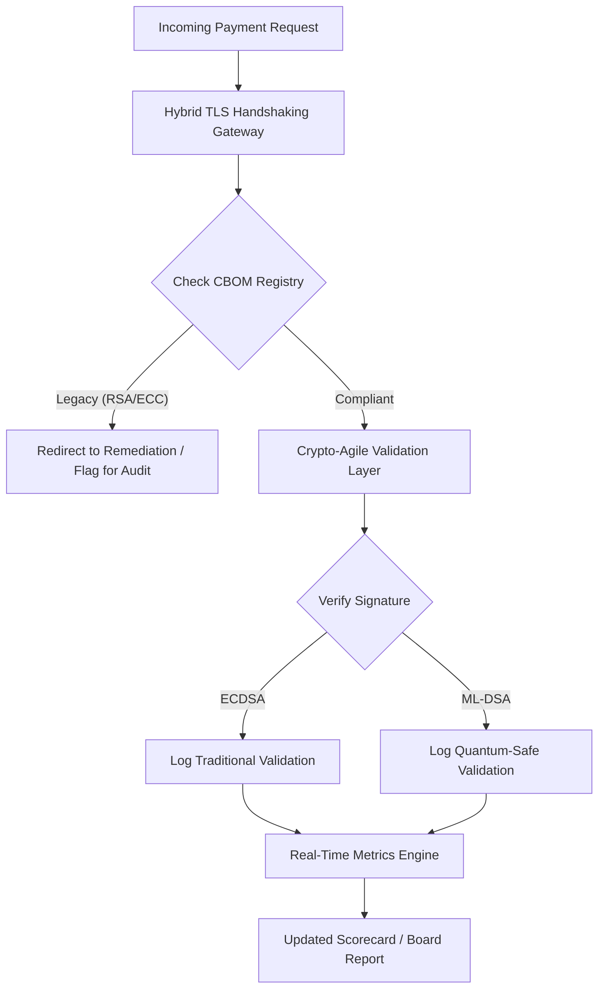

---
# Front Matter (YAML)
author: "contact@sebastienrousseau.com (Sebastien Rousseau)"
banner_alt: "Teburin hukumar dijital mara tabbas yana narkar zuwa cikin lattices na quantum — yana misalta gudanarwar dabarun da ake bukata don ƙaurar kayan aikin bankin core zuwa FIPS 203 da 204"
banner_height: "1597"
banner_width: "2584"
banner: "https://cloudcdn.pro/stocks/images/quantum-governance-AbC123XyZ.webp"
cdn: "https://cloudcdn.pro"
charset: "UTF-8"
cname: "sebastienrousseau.com"
copyright: "© Copyright 2025 - 2026 - Sebastien Rousseau. All rights reserved."
date: "29 ga Yuni, 2026"
description: "Katin Maki na Tsaron Post-Quantum na 2026 yana ba hukumomi da manyan manajoji tsarin ma'auni na fiduciary don bin diddigin Cryptographic Bill of Materials (CBOM), bayyanar HNDL, da saurin ƙaurar NIST FIPS 203/204 a fadin kayan aikin bankin Tier-1."
format-detection: "telephone=no"
hreflang: "ha"
icon: "https://cloudcdn.pro/clients/sebastienrousseau/v1/logos/sebastienrousseau.svg"
id: "https://sebastienrousseau.com/2026-06-29-post-quantum-security-scorecard-board-level-fiduciary-agility-2026"
image_alt: "Hoton Sebastien Rousseau a baki da fari"
image_height: "162"
image_width: "162"
image: "https://cloudcdn.pro/stocks/images/sebastien-rousseau.png"
keywords: "cryptography na post-quantum, katin maki na PQC, NIST FIPS 203, NIST FIPS 204, CBOM, HNDL, gudanar da banki, crypto-agility, KyberLib, bin DORA, SM&CR, juriya na quantum"
language: "ha-NG"
last_reviewed: "2026-06-29"
layout: "report"
locale: "ha_NG"
logo_alt: "Tambarin Sebastien Rousseau"
logo_height: "44"
logo_width: "44"
logo: "https://cloudcdn.pro/clients/sebastienrousseau/v1/logos/sebastienrousseau.svg"
measurementID: "G-169G4ET5HQ"
name: "Sebastien Rousseau"
permalink: "https://sebastienrousseau.com/2026-06-29-post-quantum-security-scorecard-board-level-fiduciary-agility-2026"
rating: "general"
referrer: "no-referrer"
robots: "index, follow"
schema: "FAQPage, Article"
seo_title: "Katin Maki na Tsaron Post-Quantum 2026: Tsari na Matakin Hukumar"
short_name: "sebastienrousseau"
subtitle: "Yadda hukumomi dole ne su auna kuma su gudanar da ƙaura zuwa NIST FIPS 203 da 204, suna bin diddigin cikar CBOM da rage bayyanar Harvest-Now-Decrypt-Later (HNDL) a cikin baitulmalin kamfanoni."
tags: "post-quantum, cryptography, banki, gudanarwa, DORA, FIPS-203, FIPS-204, CBOM, HNDL, KyberLib, SM&CR"
theme-color: "0, 83, 191"
title: "Katin Maki na Tsaron Post-Quantum na 2026: Tsari na Ma'auni na Matakin Hukumar"
url: "https://sebastienrousseau.com/2026-06-29-post-quantum-security-scorecard-board-level-fiduciary-agility-2026"
viewport: "width=device-width, initial-scale=1, shrink-to-fit=no"

# RSS
atom_link: "https://sebastienrousseau.com/2026-06-29-post-quantum-security-scorecard-board-level-fiduciary-agility-2026/rss.xml"
category: "Technology"
generator: "Static Site Generator (SSG) (version 0.0.40)"
item_description: "Katin Maki na Tsaron Post-Quantum na 2026 yana ba hukumomi tsarin ma'auni na fiduciary don bin diddigin CBOM, bayyanar HNDL, da saurin ƙaurar NIST."
item_pub_date: "Mon, 29 Jun 2026 07:07:07 +0000"
item_title: "Katin Maki na Tsaron Post-Quantum na 2026: Tsari na Ma'auni na Matakin Hukumar"
pub_date: "Mon, 29 Jun 2026 07:07:07 +0000"
type: "article"

# Twitter Card
twitter_card: "summary_large_image"
twitter_creator: "@wwdseb"
twitter_description: "Katin Maki na Tsaron Post-Quantum na 2026: Yadda hukumomin banki ke auna crypto-agility, cikar CBOM, da bayyanar HNDL."
twitter_image: "https://cloudcdn.pro/clients/sebastienrousseau/v1/logos/sebastienrousseau.svg"
twitter_title: "Katin Maki na Tsaron Post-Quantum na 2026 don Hukumomin Banki"
twitter_url: "https://sebastienrousseau.com/2026-06-29-post-quantum-security-scorecard-board-level-fiduciary-agility-2026"

excerpt: "Tun daga Yuni 2026, cryptography na post-quantum (PQC) ya wuce daga damuwar fasaha ta gwaji zuwa wajibcin fiduciary na farko. Hukumomi yanzu dole ne su sa ido kan ƙaurar tsari ta legacy encryption..."

# Template-completeness keys (parity with hsh/noyalib shape)
apple_mobile_web_app_orientations: "portrait"
apple_touch_icon_sizes: "192x192"
apple-mobile-web-app-capable: "yes"
apple-mobile-web-app-status-bar-inset: "black"
apple-mobile-web-app-status-bar-style: "black-translucent"
apple-touch-fullscreen: "yes"
apple-mobile-web-app-title: "Katin Maki na PQC 2026"
author_location: "London, United Kingdom"
author_twitter: "@wwdseb"
author_website: "https://sebastienrousseau.com"
docs: https://validator.w3.org/feed/docs/rss2.html
item_guid: "https://sebastienrousseau.com/2026-06-29-post-quantum-security-scorecard-board-level-fiduciary-agility-2026/rss.xml"
item_link: "https://sebastienrousseau.com/2026-06-29-post-quantum-security-scorecard-board-level-fiduciary-agility-2026/rss.xml"
last_build_date: "Mon, 29 Jun 2026 06:06:06 +0000"
managing_editor: "contact@sebastienrousseau.com (Sebastien Rousseau)"
menu: "active"
msapplication-navbutton-color: "0, 83, 191"
site_components: "Kaishi, Kaishi Builder, Kaishi CLI, Kaishi Templates, Kaishi Themes"
site_last_updated: "2023-07-05"
site_software: "Static Site Generator, Rust"
site_standards: "HTML5, CSS3, RSS, Atom, JSON, XML, YAML, Markdown, TOML"
thanks: "Na gode da karatu!"
ttl: "60"
twitter_image_alt: "Hoton Sebastien Rousseau a baki da fari"
twitter_site: "@wwdseb"
webmaster: "contact@sebastienrousseau.com"
---

# Katin Maki na Tsaron Post-Quantum na 2026: Tsari na Ma'auni na Matakin Hukumar don Crypto-Agility na Fiduciary

<aside class="post-lead" aria-label="Article summary">

<strong>TL;DR.</strong> Tun daga Yuni 2026, cryptography na post-quantum (PQC) ya wuce daga damuwar fasaha ta gwaji zuwa wajibcin fiduciary na farko. Hukumomi yanzu dole ne su sa ido kan ƙaurar tsari ta legacy encryption zuwa ma'aunin NIST FIPS 203 da 204 don rage haɗarurruka na kuɗi da na aiki a ƙarƙashin DORA.

<strong>Manyan abubuwan ɗauka</strong>

<ul class="post-lead-takeaways">
  <li><strong>Daidaiton G20 da iyakar lokaci mara taushi.</strong> Hukumomin tsari na duniya sun saita ƙarshen 2020s a matsayin iyakar lokaci mara taushi don ƙaura zuwa quantum-safe, suna bukatar cibiyoyi su nuna ci gaba mai aunawa.</li>
  <li><strong>Cryptographic Bill of Materials (CBOM).</strong> Kamar yadda software BOM yake, CBOM jerin atomatik ne, mai rai, na duka kadarorin cryptographic da ake bukata don tabbatar da bayyana a fadin jerin samar da kayayyaki.</li>
  <li><strong>Bayyanar Harvest-Now-Decrypt-Later (HNDL).</strong> Maƙiya yanzu suna kama da adana bayanan biya na ma'amala masu ƙima mai girma waɗanda aka rufa; rage wannan yana bukatar tura kayan aikin PQC hybrid nan take.</li>
  <li><strong>Gudanarwar fiduciary ta hanyar crypto-agility.</strong> Crypto-agility ma'aunin gudanarwa ne mai aunawa. Ikon canza primitives na cryptographic ba tare da sake gina tsarin core ba (ta amfani da ɗakunan karatu kamar KyberLib) yanzu shi ne alhakin matakin hukumar a ƙarƙashin SM&CR.</li>
</ul>

<strong>Karatu masu alaƙa:</strong> <a href="https://sebastienrousseau.com/2026-06-12-kyberlib-post-quantum-banking-migration-standards-code-2026">KyberLib da Ƙaurar Banki na Post-Quantum a 2026</a>, <a href="https://sebastienrousseau.com/2023-11-19-crystals-kyber-the-safeguarding-algorithm-in-a-quantum-age/index.html">CRYSTALS-Kyber: Algorithm na Tsaro a Zamanin Quantum</a>.

</aside>
Tsaron post-quantum ba shi ne aikin bincike ba kuma. "Agogon kulawa" yana ƙirgawa zuwa iyakar lokaci na karshen 2020s. Ƙarewar [NIST FIPS 203 (ML-KEM)](https://csrc.nist.gov/pubs/fips/203/final) da [NIST FIPS 204 (ML-DSA)](https://csrc.nist.gov/pubs/fips/204/final) sun tabbatar da ma'aunin na key encapsulation da sa hannun dijital.

Hukumomin tsari yanzu suna sa ran cewa bankunan Tier-1 za su wuce shirye-shiryen gwaji. A 2026, hankali ya canja zuwa masana'antar waɗannan ma'aunin. Rashin nuna hanyar ƙaura bayyananne yana ɗauke da hukunci mai tsanani na tsari a ƙarƙashin [Digital Operational Resilience Act (DORA)](https://eur-lex.europa.eu/eli/reg/2022/2554/oj) da yiwuwar alhakin mutum na daraktoci waɗanda suka yi watsi da barazana mai yiwuwar na decryption ta quantum.

## 01. Katin Maki na Quantum na Matakin Hukumar

Ma'aunin masu zuwa suna ba da tsari na ma'auni don hukumomi su yanke shawara akan shirye-shiryen quantum da lafiyar cryptographic a fadin gidan ayyukan Banki na Kasuwanci da na Saka Hannun Jari (CIB).

### Teburi 1: Ma'auni na Katin Maki na PQC da Hakuri

| Ma'auni | Tsarin Lissafi | Hakuri da Hukumar Ta Amince | Haɗari Idan Ya Wuce Hakuri |
| ---- | ---- | ---- | ---- |
| **Kashi na Cikar Inventory (ICP)** | (Kadarorin Crypto da Aka Gano / Jimillar Kadarorin da Aka Kiyasta) × 100 | > 98% | Encryption na inuwa da makaho a hanyoyin bayanan clearing masu ƙima mai girma. |
| **Ƙimar Bayyanar HNDL (HER)** | (Bayanai Masu Doguwar Rayuwa akan Legacy Crypto / Jimillar Bayanai Masu Doguwar Rayuwa) × 100 | < 5% | Lalata na dindindin na asirin kasuwanci, jerin bashi na sarauta, da rikodin biya na ma'amala. |
| **Ƙimar Ci Gaban Ƙaurar NIST (MPR)** | (Tsarin da ke gudanar da FIPS 203/204 / Jimillar Tsarin Mahimmanci) × 100 | > 60% (a ƙarshen 2026) | Rashin bin tsari da fitarwa daga abokan adawa masu daidaita G20. |
| **Index na Shirye-shiryen Crypto-Agility (CARI)** | (Apps da Lasifin Crypto da Aka Abstract / Jimillar Apps na Core) × 100 | > 85% | Bashin fasaha mai tsanani da rashin iya amsa fitar da algorithms na nan gaba. |

## 02. Cryptographic Bill of Materials (CBOM)

Ma'aunin ICP ana saita shi ta hanyar cikakken **Sashin Gano CBOM**. Wannan tsari ne na atomatik wanda ke gano kowane endpoint na cryptographic a cikin kamfanin.

- **Gano Endpoint:** Scan da hanyoyin sadarwar cikin gida da na cloud don zaman TLS masu aiki don gano amfani da legacy RSA ko ECC.
- **Inventory na Maɓalli:** Taswirar jerin maɓallai na jama'a/sirri zuwa masu su kuma taswirar ainihin ranakun ƙarewa.
- **Taswirar Dogaro:** Gano ɗakunan karatu na ɓangare na uku da APIs waɗanda suka dogara da algorithms da aka cire.

Wannan sashin gano yana ƙirƙirar tushen gaskiya ɗaya, yana ba CISO damar bayar da rahoton lafiyar cryptographic tare da daidaito iri ɗaya kamar aikin kuɗi.

## 03. Kawar da Bayyanar HNDL a cikin Biyan Ma'amala

Maƙiya yanzu suna kai hari kan biyan ma'amala da bayanan kamfanoni masu doguwar rayuwa. Wadannan hare-haren "Harvest-Now-Decrypt-Later" (HNDL) sun haɗa da kama da adana zirga-zirgar yau da aka rufa.

Ko da kuwa wani cryptographically relevant quantum computer (CRQC) ba ya wanzu yau, bayanan da aka kama yanzu za su zama masu rauni a nan gaba. Rage wannan yana bukatar ƙaurar fifiko mai girma na bayanai masu doguwar rayuwa (misali, rikodin asalin, kwangilolin bond na shekaru 30, da rumbun adana takardun shari'a), wanda kai tsaye yana rage ma'aunin HER. Inganta tashoshin biya zuwa hybrid PQC-encryption na al'ada (ta amfani da ML-KEM tare da X25519) yana ba da kariya nan take akan barazana na adana.

## 04. Aiwatar da Crypto-Agility ta Madaidaicin Tsari na Interface

Crypto-agility ana cimma shi ta hanyar abstractions na injiniyanci. Ɗakunan karatu na zamani kamar [KyberLib](https://sebastienrousseau.com/2026-06-12-kyberlib-post-quantum-banking-migration-standards-code-2026) suna nuna yadda masu haɓakawa za su iya aiwatar da modules masu aminci ga quantum ba tare da sake rubuta dukkan stack na aikace-aikacen ba.

- **Wrappers da Aka Abstract:** Aikace-aikace suna kira ga aikin gabaɗaya `encrypt()` ko `sign()` maimakon routines na takamaiman algorithm.
- **Canjin Runtime:** Module na ƙasa za a iya canza shi daga ECDSA zuwa ML-DSA ta hanyar canje-canjen tsari maimakon turawa na lambar mai rikitarwa.

Wannan gine-ginen yana tabbatar da cewa idan wani takamaiman algorithm na PQC ya lalace a nan gaba, ƙungiyar za ta iya juyawa cikin sa'o'i maimakon shekaru.

## 05. Hanyar Aiki na Tabbatar da Ingress na Quantum-Safe

Hoton da ke ƙasa yana nuna rayuwar bayanan da ke shiga cikin iyaka mai aminci a cikin yanayin banki mai quantum-agile.

## Kammalawa

Kayan aikin cryptographic na bankin Tier-1 ba damuwar CISO ba ne kuma. Kayan aikin fiduciary ne. NIST FIPS 203 da 204 sun saita algorithms; DORA Article 5 ya saita fuskar alhakin; SM&CR ya ɗaure shi ga babban manaja da aka ambata. Katin maki na sama — Cikar Inventory, Bayyanar HNDL, Ci Gaban Ƙaura, Crypto-Agility — yana ba hukumar lambobi huɗu da take buƙata don gudanar da wannan gidan ba tare da karanta lambar cryptographic ba.

Lambar da ta fi muhimmanci ita ce Bayyanar HNDL. Kowane rikodin da aka rufa da legacy a cikin rumbun adana biyan ma'amala a yau za a iya karanta shi a ranar da aka tura cryptographically relevant quantum computer na farko. Ƙirgawa yana shiru kuma ba daidaito ba ne: masu kare za su iya yin aiki kawai akan bayanan da suke da su, maƙiya za su iya yin aiki akan bayanan da suka rigaya suka fitar shekaru da suka gabata. Kwangilar bond na kamfani na shekaru 30 da aka rufa da RSA-2048 a 2024 kwangila ce wanda ke rasa garantin sirrinta a ranar da CRQC ya fara aiki.

[KyberLib](https://sebastienrousseau.com/2026-06-12-kyberlib-post-quantum-banking-migration-standards-code-2026) da takwarorinsa suna juya wannan daga sake rubuta dandali na shekaru da yawa zuwa canjin tsari. Aikin hukumar ba shine rubuta lambar ba. Aikin hukumar shi ne neman cewa Index na Shirye-shiryen Crypto-Agility — kashi na aikace-aikacen core a bayan interface na cryptographic da aka abstract — ya wuce 85 % a cikin watanni goma sha biyu, kuma a karanta katin maki na kwata-kwata.

<aside class="author-card" aria-label="About the author"><strong class="author-card-name"><a href="/about/index.html">Sebastien Rousseau</a></strong>Babban masanin fasahar banki yana rubutu akan AI da aka aiwatar, ƙaurar ISO 20022, cryptography na post-quantum don ayyukan kuɗi, da canjin tsari na biyan ma'amala.Shekaru 20+ a fadin HSBC Commercial & Investment Bank, PayPal, Barclays, Shazam. <a href="https://www.linkedin.com/in/sebastienrousseau/" rel="external noopener">LinkedIn</a> &middot; <a href="https://github.com/sebastienrousseau" rel="external noopener">GitHub</a></aside>

An sake duba shi a ƙarshe <time datetime="2026-06-29">2026-06-29</time>.

