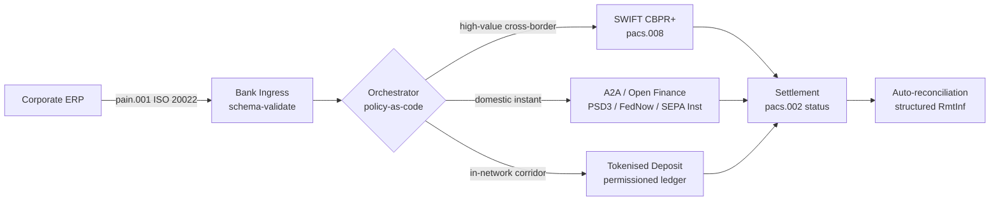

---

# Front Matter (YAML)

author: "contact@sebastienrousseau.com (Sebastien Rousseau)"
banner_alt: "ספינת מכולות בנמל מים עמוקים עם שחר — מסמלת את התנועה החוצת-גבולות, רב-מסילתית של ערך תאגידי באמצעות ISO 20022, פיננסים פתוחים ורשתות סליקה מבוססות פיקדונות מתויגים ב-2026"
banner_height: "1597"
banner_width: "2584"
banner: "https://cloudcdn.pro/stocks/images/viktor-forgacs-KxVRDiFdTVo.webp"
cdn: "https://cloudcdn.pro"
charset: "UTF-8"
cname: "sebastienrousseau.com"
copyright: "© Copyright 2025 - 2026 - Sebastien Rousseau. All rights reserved."
date: "24 ביוני 2026"
description: "כיצד ISO 20022, A2A, פיננסים פתוחים תחת PSD3/FiDA ופיקדונות מתויגים מעצבים מחדש את האוצר התאגידי החוצה-גבולות לצד SWIFT ב-2026."
format-detection: "telephone=no"
hreflang: "he"
icon: "https://cloudcdn.pro/clients/sebastienrousseau/v1/logos/sebastienrousseau.svg"
id: "https://sebastienrousseau.com/2026-06-24-cross-border-iso-20022-open-finance-tokenised-deposits-treasury-2026"
image_alt: "Black and White Portrait of Sebastien Rousseau"
image_height: "162"
image_width: "162"
image: "https://cloudcdn.pro/stocks/images/sebastien-rousseau.png"
keywords: "תשלומים חוצי-גבולות, ISO 20022, פיננסים פתוחים, PSD3, FiDA, פיקדונות מתויגים, סטייבלקוינים, A2A, אוצר, CIB, Nexi, Mastercard, רב-מסילתי, pacs.008, pain.001, SWIFT, FedNow, SEPA Instant, RTP, CBPR+"
language: "he-IL"
last_reviewed: "2026-06-24"
layout: "report"
locale: "he_IL"
logo_alt: "Logo for Sebastien Rousseau"
logo_height: "44"
logo_width: "44"
logo: "https://cloudcdn.pro/clients/sebastienrousseau/v1/logos/sebastienrousseau.svg"
menu: ""
measurementID: "G-169G4ET5HQ"
name: "Sebastien Rousseau"
permalink: "https://sebastienrousseau.com/2026-06-24-cross-border-iso-20022-open-finance-tokenised-deposits-treasury-2026"
rating: "general"
referrer: "no-referrer"
robots: "index, follow"
schema: "FAQPage, Article"
seo_title: "חוצה-גבולות 2026: ISO 20022, פיננסים פתוחים, מסילות מתויגות"
short_name: "sebastienrousseau"
subtitle: "אוצר תאגידי חוצה-גבולות ב-2026 פועל על מכניקה רב-מסילתית — ISO 20022 כדקדוק משותף, A2A ופיננסים פתוחים כמסילה הפונה ללקוח, פיקדונות מתויגים כרגל הסליקה הסיטונאית, ו-SWIFT עדיין מעגן את הזנב הארוך."
tags: "תשלומים חוצי-גבולות, ISO 20022, פיננסים פתוחים, PSD3, FiDA, פיקדונות מתויגים, A2A, אוצר, CIB, רב-מסילתי, pacs.008, pain.001, SWIFT, FedNow, SEPA Instant, RTP, CBPR+"
theme-color: "0, 83, 191"
title: "חוצה-גבולות 2026: ISO 20022, פיננסים פתוחים ופיקדונות מתויגים באוצר תאגידי"
url: "https://sebastienrousseau.com/2026-06-24-cross-border-iso-20022-open-finance-tokenised-deposits-treasury-2026"
viewport: "width=device-width, initial-scale=1, shrink-to-fit=no"

# RSS - The RSS feed front matter (YAML).
atom_link: "https://sebastienrousseau.com/2026-06-24-cross-border-iso-20022-open-finance-tokenised-deposits-treasury-2026/rss.xml"
category: "Technology"
docs: https://validator.w3.org/feed/docs/rss2.html
generator: "Static Site Generator (SSG) (version 0.0.26)"
item_description: "כיצד ISO 20022, A2A, פיננסים פתוחים תחת PSD3/FiDA ופיקדונות מתויגים מעצבים מחדש את האוצר התאגידי החוצה-גבולות לצד SWIFT ב-2026."
item_guid: "https://sebastienrousseau.com/2026-06-24-cross-border-iso-20022-open-finance-tokenised-deposits-treasury-2026/rss.xml"
item_link: "https://sebastienrousseau.com/2026-06-24-cross-border-iso-20022-open-finance-tokenised-deposits-treasury-2026/rss.xml"
item_pub_date: "Wed, 24 Jun 2026 07:07:07 +0000"
item_title: "חוצה-גבולות 2026: ISO 20022, פיננסים פתוחים ופיקדונות מתויגים באוצר תאגידי"
last_build_date: "Wed, 24 Jun 2026 06:06:06 +0000"
managing_editor: "contact@sebastienrousseau.com (Sebastien Rousseau)"
pub_date: "Wed, 24 Jun 2026 07:07:07 +0000"
ttl: "60"
type: "article"
webmaster: "contact@sebastienrousseau.com"

# Apple - The Apple front matter (YAML).
apple_mobile_web_app_orientations: "portrait"
apple_touch_icon_sizes: "192x192"
apple-mobile-web-app-capable: "yes"
apple-mobile-web-app-status-bar-inset: "black"
apple-mobile-web-app-status-bar-style: "black-translucent"
apple-mobile-web-app-title: "חוצה-גבולות 2026: ISO 20022, פיננסים פתוחים, מסילות מתויגות"
apple-touch-fullscreen: "yes"

# MS Application - The MS Application front matter (YAML).

msapplication-navbutton-color: "0, 83, 191"

# Twitter Card - The Twitter Card front matter (YAML).

twitter_card: "summary_large_image"
twitter_creator: "@wwdseb"
twitter_description: "כיצד ISO 20022, A2A, פיננסים פתוחים תחת PSD3/FiDA ופיקדונות מתויגים מעצבים מחדש את האוצר התאגידי החוצה-גבולות לצד SWIFT ב-2026."
twitter_image: "https://cloudcdn.pro/clients/sebastienrousseau/v1/logos/sebastienrousseau.svg"
twitter_image_alt: "Logo of Sebastien Rousseau"
twitter_site: "@wwdseb"
twitter_title: "חוצה-גבולות 2026: ISO 20022, פיננסים פתוחים, מסילות מתויגות"
twitter_url: "https://sebastienrousseau.com/2026-06-24-cross-border-iso-20022-open-finance-tokenised-deposits-treasury-2026"

excerpt: "אוצר תאגידי חוצה-גבולות ב-2026 הוא בעיית הנדסה רב-מסילתית. ISO 20022 הוא הדקדוק המשותף, A2A ופיננסים פתוחים תחת PSD3/FiDA הם המסילה הפונה ללקוח, פיקדונות מתויגים מטפלים ברגל הסליקה הסיטונאית, ו-SWIFT עדיין מעגן את הזנב הארוך. העבודה המעניינת היא בשכבת התזמור, לא במודל."

# Humans.txt - The Humans.txt front matter (YAML).
author_website: "https://sebastienrousseau.com"
author_twitter: "@wwdseb"
author_location: "London, UK"
thanks: "תודה שקראתם!"
site_last_updated: "2026-06-24"
site_standards: "HTML5, CSS3, RSS, Atom, JSON, XML, YAML, Markdown, TOML"
site_components: "Kaishi, Kaishi Builder, Kaishi CLI, Kaishi Templates, Kaishi Themes"
site_software: "Static Site Generator, Rust"

---

# חוצה-גבולות 2026: ISO 20022, פיננסים פתוחים ופיקדונות מתויגים באוצר תאגידי

<!-- lead-start -->
<aside class="post-lead" aria-label="תקציר המאמר">

<strong>תקציר.</strong> אוצר תאגידי חוצה-גבולות ב-2026 פועל על ארבע מסילות במקביל — SWIFT CBPR+, A2A מיידי תחת PSD3/FiDA, פיקדונות מתויגים, ומסילות סטייבלקוין — המחוברות יחד באמצעות ISO 20022 כדקדוק המשותף. העבודה של צוותי CIB ואוצר תאגידי היא תזמור, לא בחירת מסילה.

<strong>נקודות מפתח</strong>

<ul class="post-lead-takeaways">
  <li><strong>רב-מסילתי הוא ברירת המחדל.</strong> אף מסילה בודדת אינה סולקת כל מסדרון, כל גודל עסקה וכל שעת סגירה. האוצר בוחר את המסילה לפי תשלום, לא לפי בנק.</li>
  <li><strong>ISO 20022 הוא שפת המעבר.</strong> pacs.008, pacs.009 ו-pain.001 נושאים כעת נתוני העברה על פני מסילות RTGS, מיידיות, A2A ופיקדונות מתויגים — והופכים את החלטות הניתוב לנתון-מונחות במקום נעולות-מסילה.</li>
  <li><strong>פיננסים פתוחים מרחיבים את הפרימטר.</strong> PSD3 ו-FiDA דוחפים את מודל הבנקאות הפתוחה לפנסיה, ביטוח ונתוני אוצר; Nexi ו-Mastercard בונות את שכבת התזמור שתאגידים צורכים.</li>
  <li><strong>פיקדונות מתויגים הם הרגל הסיטונאית.</strong> פיקדונות מתויגים בהנפקת בנקים ומסילות סטייבלקוין משולבות יושבים מתחת למסילה המיידית הפונה ללקוח ומסלקים את הרגל הסיטונאית בקירוב ל-T+0.</li>
</ul>

<strong>קריאה קשורה:</strong> <a href="https://sebastienrousseau.com/2026-06-07-autonomous-treasury-index-programmable-liquidity-tokenised-deposits-2026">מדד האוצר האוטונומי 2026: נזילות תכנותית ופיקדונות מתויגים</a>, <a href="https://sebastienrousseau.com/2026-06-15-pacs008-automation-iso-20022-interbank-payments-2026">אוטומציה של pacs.008: תשלומים בין-בנקאיים ב-ISO 20022 ב-2026</a>.

</aside>
<!-- lead-end -->

תאגיד תעשייתי אירופי משלם לספק ברזילאי 4.2 מיליון אירו בבוקר רביעי. תחנת האוצר אינה בוחרת בנק. היא בוחרת מסילה — רצף מסילות. ההוראה הפונה ללקוח נוחתת על הודעת A2A pain.001 המנותבת דרך ספק פיננסים פתוחים תחת PSD3. הבנק מעביר אותה על פני שתי תחומי שיפוט כתבים על פיקדונות מתויגים בתוך רשת פרטית של CIB. הזנב הארוך — ניקוי חשבונית של 80,000 דולר לתת-ספק ללא קשר פיקדון מתויג — עדיין רוכב על SWIFT CBPR+ כ-pacs.008. הלקוח רואה תשלום אחד. הארכיטקטורה רואה ארבע מסילות. ISO 20022 הוא הסיבה היחידה שהדבר מחזיק יחד.

זהו מודל ההפעלה ש-Mastercard מתארת כאשר היא מדברת על [האבולוציה מבנקאות פתוחה לפיננסים פתוחים](https://www.mastercard.com/us/en/news-and-trends/Insights/2026/open-banking-to-open-finance-the-evolution-of-financial-data.html "Mastercard: מבנקאות פתוחה לפיננסים פתוחים, האבולוציה של נתונים פיננסיים") — נתונים ותשלומים ממוזגים לשכבת תזמור אחת, כאשר המסילה נבחרת על ידי המערכת ולא על ידי הלקוח. השאלה המעניינת לטכנולוגי בנקאות בכירים אינה איזו מסילה תנצח. השאלה היא כיצד שכבת התזמור מהונדסת, מנוהלת ומותאמת.

## 01. מכרטיסים ל-A2A — המעבר לפיננסים פתוחים

מסילות הכרטיסים אינן נעלמות. הן ממוסגרות מחדש.

לאורך 2025 ועד 2026, [PSD3 ותקנת גישה לנתונים פיננסיים (FiDA)](https://www.consultancy.uk/news/42202/orchestrating-open-banking-for-platform-growth-2026-outlook "Consultancy.uk: תזמור בנקאות פתוחה לצמיחת פלטפורמות, תחזית 2026") הרחיבו את חובת הבנקאות הפתוחה מעבר לחשבונות תשלום אל פנסיה, משכנתאות, חיסכון, ביטוח ונתוני אוצר תאגידי. ההשלכה הישירה לאוצר התאגידי: מנהל קשרי לקוחות CIB יכול כעת לצרוך את התמונה המלאה של נזילות תאגיד על פני בנקים מרובים דרך חוזה API אחד, על פי הוראת התאגיד.

שני שחקנים בונים באופן גלוי את שכבת התזמור שתאגידים יצרכו. Nexi הרחיבה את טביעת הסליקה שלה ליזימת A2A על פני SEPA Instant ומסדרונות RTGS פאן-אירופיים, בילידיות ISO 20022 מקצה לקצה. פלטפורמת הפיננסים הפתוחים של Mastercard — מעוגנת ברכישות Aiia ו-Finicity — מספקת את שכבת איסוף הנתונים והסכמה מתחת, כאשר יזימת תשלום עולה דרך אותה תשתית API ששירתה בעבר אישורי כרטיסים.

המעבר משמעותי משלוש סיבות:

1. **כלכלת היחידה.** A2A שיוזמת תחת PSD3 מוציאה עמלת חליפין מהתשלום. עבור זרמי B2B בהיקף גבוה, החיסכון מהותי; עבור זרמי צרכן בהיקף נמוך, מחסנית עלויות הסוחר קורסת.
2. **איכות הנתונים.** A2A תחת ISO 20022 נושא נתוני העברה מובנים שכרטיסים מעולם לא יכלו. שיעורי התאמה אוטומטית מעל 95% הם כעת ברירת מחדל.
3. **מודל הסיכון.** A2A היא העברת אשראי, לא אישור כרטיס. משטח ההונאה, מודל הזיכוי החוזר ומודל הסכסוך — כולם שונים. צוותי אוצר תאגידי צריכים להבין ששכבת הגנת הלקוח נבנית מחדש, לא נורשת.

ה-CIB המוכר הצעה רב-מסילתית ב-2026 מוכר תזמור — לא גישה. הגישה כעת מוסדרת.

## 02. ISO 20022 כשפת המעבר על פני מסילות

הסיבה שרב-מסילתיות אפשרית בכלל היא שפורמט ההודעה כעת עקבי על פני מסילות.

ועדת BIS לתשלומים ולתשתיות שוק (CPMI) ביססה את התיק הארכיטקטוני בבירור ב[דרישות ההרמוניזציה של ISO 20022 לשיפור תשלומים חוצי-גבולות](https://www.bis.org/cpmi/publ/d230.pdf "BIS CPMI: דרישות הרמוניזציה של ISO 20022 לשיפור תשלומים חוצי-גבולות"). המעבר של נובמבר 2025 ל-CBPR+ סגר את עידן MT103 / MT202 להעברת הודעות בין-בנקאיות חוצות-גבולות. מנקודה זו, כל מסילה מרכזית — SWIFT, FedNow, SEPA Instant, RTP, ומערכות התשלומים המיידיים העיקריות באסיה ובאמריקה הלטינית — מדברות אותו דקדוק pacs.008 / pacs.009 / pain.001.

ההשלכה המעשית לאוצר התאגידי:

- **הניתוב נתון-מונחה.** תחנת האוצר יכולה לקרוא pain.001 פעם אחת ולהחליט על המסילה לכל תשלום בהתבסס על מסדרון, גודל עסקה, שעת סגירה וקשר נגדי — מבלי למפות מחדש את ההודעה.
- **נתוני העברה שורדים את הקפיצה.** שדות העברה מובנים (`<RmtInf><Strd>`) עוברים את רגלי הכתב ללא קיצוץ. שיעורי התאמה אוטומטית עולים כי הנתונים כבר אינם הולכים לאיבוד בגבול המסילה.
- **סינון סנקציות הופך לבר-ביקורת.** שדות `<Dbtr>` / `<Cdtr>` / `<DbtrAgt>` / `<CdtrAgt>` מובנים עם הפניות LEI מחליפים סינון שם בטקסט חופשי. שיעורי הפגיעות יורדים. תורי החקירה מצטמצמים.

התרשים שלהלן עוקב אחר pain.001 בודד דרך כניסת הבנק, אל מתזמר המדיניות-כקוד, והחוצה למסילה שהמסדרון וגודל העסקה דורשים — הודעה אחת, מסילות רבות, ללא מיפוי מחדש.

המחיר של עקביות זו הוא משמעת הנדסית. ISO 20022 מתיר. שני בנקים יכולים להיות תואמים מלאים ל-CBPR+ ועדיין להפיק הודעות pacs.008 שונות בשימוש בשדה, בערכת תווים ובמבנה נתוני העברה. ה-CIB המנצח בחוצה-גבולות ב-2026 אוכף פרופיל הודעה מחמיר יותר מהנדרש בתקן — ודוחה בפיענוח, לא בסליקה.

## 03. פיקדונות מתויגים ומסילות יציבות

רגל הסליקה הסיטונאית היא המקום שבו סיפור המסילות הופך מעניין.

תמונת 2026, שנתפסה היטב בניתוח [Trade Treasury Payments על אוטומציה, מסילות חירום, ISO 20022 וסטייבלקוינים](https://tradetreasurypayments.com/articles/automation-contingency-rails-iso-20022-and-stablecoins-the-2026-trends-reshaping-corporate-finance-and-b2b-payments "Trade Treasury Payments: אוטומציה, מסילות חירום, ISO 20022 וסטייבלקוינים, מגמות 2026 המעצבות מחדש את הפיננסים התאגידיים ותשלומי B2B"), מפצלת את שכבת הסליקה הסיטונאית לשני מודלים שונים מבחינה מבנית.

**פיקדונות מתויגים בהנפקת בנק.** בנק מסחרי מנפיק התחייבות מתויגת על פנקס מורשה — JPM Coin, אסימון פיקדון מקושר Orion של HSBC, מקבילים מרכזיים של CIB אירופיים. האסימון הוא תביעה ישירה על הבנק המנפיק. הסליקה היא כמעט T+0 בתוך הרשת. הציות הוא באחריות הבנק המנפיק. המסילה מוסדרת במלואה, ניתנת למעקב במלואה, ומוגבלת למשתתפים שהמנפיק קלט.

**מסילות סטייבלקוין משולבות.** סטייבלקוין מוסדר — מגובה במלואו, מבוקר, ופועל תחת MiCA או המשטר האזורי המקביל — מסלק מסדרון שבו פיקדונות מתויגים בהנפקת בנק עדיין אינם מגיעים. האסימון הוא תביעה על הרזרבה, לא על מאזן בנקאי. הציות משותף בין המנפיק, רמפת הכניסה ורמפת היציאה.

שני המודלים אינם מתחרים. הם מוערמים. מוצר חוצה-גבולות של CIB ב-2026 משתמש בדרך כלל בפיקדונות מתויגים בהנפקת בנק לרגל הפנים-רשתית ובסטייבלקוין מוסדר למסדרון שבו המסילה הפנים-רשתית מסתיימת. התאגיד רואה תשלום ISO 20022 אחד. סיפור הסליקה מתחת הוא רב-אסימוני.

השאלה ברמת הדירקטוריון זהה לזו שוועדות סיכון תפעולי שואלות מאז טייסי הנזילות התכנותית הראשונים: מי נושא בחשיפת האשראי על האסימון, ולכמה זמן? פיקדונות מתויגים נותנים תשובה נקייה — הבנק המנפיק, עד שריפה. מסילות סטייבלקוין משולבות נותנות תשובה ניואנסית יותר — הרזרבה, בכפוף למחזור הביקורת ולערבות הפדיון. צוות אוצר שאינו מתעד את התשובה לכל מסילה ולכל מסדרון נושא סיכון אשראי לא נמדד במאזן שלו.

## 04. מחסנית האוצר האוטונומי

מעל שכבת המסילה יושבת שכבת התזמור. מעל שכבת התזמור יושבת שכבת הסוכן.

הצגתי את הארכיטקטורה בפירוט ב[מדד האוצר האוטונומי 2026: נזילות תכנותית ופיקדונות מתויגים](https://sebastienrousseau.com/2026-06-07-autonomous-treasury-index-programmable-liquidity-tokenised-deposits-2026 "Sebastien Rousseau: מדד האוצר האוטונומי 2026"). הגרסה הקצרה: אוצר סוכני ב-2026 הוא שכבת התזמור, מבוטאת כפוליסה-כקוד, עם סוכנים תחומים המבצעים בתוכה.

המחסנית היא:

1. **שכבת המסילה.** SWIFT CBPR+, A2A מיידי, פיקדונות מתויגים, סטייבלקוינים מוסדרים. לכל מסילה יש פרופיל מפורסם, לוח שעות סגירה, עקומת עלות ומודל סופיות סליקה.
2. **שכבת התזמור.** ISO 20022 פנימה, ISO 20022 החוצה. החלטת מסילה לכל תשלום בהתבסס על מסדרון, עסקה, שעת סגירה, קשר נגדי ופוליסה. הפוליסה מנוהלת בגרסאות, חתומה ובת-ביקורת.
3. **שכבת הסוכן.** סוכני אוצר תחומים מבצעים את פוליסת התזמור עם גבולות לקריאת כלים, יומני ביקורת ומפסקי חירום. הסוכן אינו בוחר את המסילה. הפוליסה בוחרת את המסילה. הסוכן מריץ את הפוליסה.
4. **שכבת ההתאמה.** הודעות ISO 20022 pacs.008 / pacs.002 / camt.054 מתואמות מול הוראת ה-pain.001 המקורית, כאשר נתוני העברה מובנים סוגרים את הלולאה ללא התערבות ידנית.

ה-CIB המוכר את המחסנית הזו ב-2026 מוכר ארבעה דברים בו-זמנית — ומתמחר אותם בנפרד. התאגיד הקונה אותה קונה אופציונליות על פני מסילות, עם תקן הודעה אחד, שכבת פוליסה אחת, הזנת התאמה אחת. זהו השינוי הארכיטקטוני. כל השאר הוא פרט יישום.

## מסקנה

אוצר תאגידי חוצה-גבולות ב-2026 הוא בעיית הנדסה רב-מסילתית. ISO 20022 הוא הדקדוק שהופך רב-מסילתיות לישימה. PSD3 ו-FiDA מרחיבים את פרימטר הנתונים ומאלצים פיננסים פתוחים לתוך זרימת העבודה של האוצר התאגידי. פיקדונות מתויגים וסטייבלקוינים מוסדרים מטפלים ברגל הסליקה הסיטונאית. SWIFT עדיין מעגן את הזנב הארוך.

ה-CIB המנצח הוא זה שבונה את שכבת התזמור — לא זה שבוחר מסילה אחת ומהמר עליה את הזיכיון. צוות האוצר התאגידי המנצח הוא זה שמתעד את חשיפת האשראי לכל מסילה ולכל מסדרון, אוכף פרופיל ISO 20022 מחמיר יותר מהנדרש על ידי הרגולטור, ומתייחס להחלטת המסילה כפוליסה, לא כשיפוט לכל תשלום.

העבודה המעניינת היא בשכבת התזמור. בנו אותה בקפידה.

<!-- enrich-start -->
<aside class="author-card" aria-label="על המחבר"><strong class="author-card-name"><a href="/about/index.html">Sebastien Rousseau</a></strong>טכנולוג בנקאות בכיר הכותב על AI יישומי, הגירה ל-ISO 20022, קריפטוגרפיה פוסט-קוונטית לשירותים פיננסיים והטרנספורמציה המבנית של תשלומים סיטונאיים.למעלה מ-20 שנה ב-HSBC Commercial &amp; Investment Bank, PayPal, Barclays, Shazam, AKQA, Virgin Group. <a href="/about/index.html">פרופיל מלא</a> &middot; <a href="https://www.linkedin.com/in/sebastienrousseau/" rel="external noopener">LinkedIn</a> &middot; <a href="https://github.com/sebastienrousseau" rel="external noopener">GitHub</a></aside>

נסקר לאחרונה <time datetime="2026-06-24">2026-06-24</time>.

<!-- enrich-end -->
