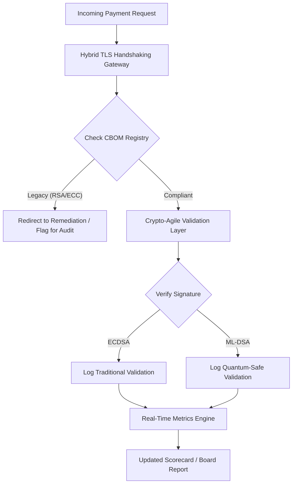

---
# Front Matter (YAML)
author: "contact@sebastienrousseau.com (Sebastien Rousseau)"
banner_alt: "שולחן דירקטוריון דיגיטלי מופשט נמס לסריגים קוונטיים — המחשת הממשל האסטרטגי הנדרש להעברת תשתית בנקאות הליבה לתקני FIPS 203 ו-204"
banner_height: "1597"
banner_width: "2584"
banner: "https://cloudcdn.pro/stocks/images/quantum-governance-AbC123XyZ.webp"
cdn: "https://cloudcdn.pro"
charset: "UTF-8"
cname: "sebastienrousseau.com"
copyright: "© Copyright 2025 - 2026 - Sebastien Rousseau. All rights reserved."
date: "29 ביוני 2026"
description: "כרטיס הציונים לאבטחה פוסט-קוונטית 2026 מספק לדירקטוריונים ולהנהלה הבכירה מסגרת מדדים נאמנותית למעקב אחר כתב כמויות קריפטוגרפי (CBOM), חשיפת HNDL ומהירות הגירה ל-NIST FIPS 203/204 בתשתית בנקאות Tier-1."
format-detection: "telephone=no"
hreflang: "he"
icon: "https://cloudcdn.pro/clients/sebastienrousseau/v1/logos/sebastienrousseau.svg"
id: "https://sebastienrousseau.com/2026-06-29-post-quantum-security-scorecard-board-level-fiduciary-agility-2026"
image_alt: "Black and White Portrait of Sebastien Rousseau"
image_height: "162"
image_width: "162"
image: "https://cloudcdn.pro/stocks/images/sebastienrousseau.webp"
keywords: "קריפטוגרפיה פוסט-קוונטית, כרטיס ציונים PQC, NIST FIPS 203, NIST FIPS 204, CBOM, HNDL, ממשל בנקאי, זריזות קריפטוגרפית, KyberLib, תאימות DORA, SM&CR, חוסן קוונטי"
language: "he-IL"
last_reviewed: "2026-06-29"
layout: "report"
locale: "he_IL"
logo_alt: "Logo for Sebastien Rousseau"
logo_height: "44"
logo_width: "44"
logo: "https://cloudcdn.pro/clients/sebastienrousseau/v1/logos/sebastienrousseau.svg"
measurementID: "G-169G4ET5HQ"
name: "Sebastien Rousseau"
permalink: "https://sebastienrousseau.com/2026-06-29-post-quantum-security-scorecard-board-level-fiduciary-agility-2026"
rating: "general"
referrer: "no-referrer"
robots: "index, follow"
schema: "FAQPage, Article"
seo_title: "כרטיס הציונים לאבטחה פוסט-קוונטית 2026: מסגרת ברמת הדירקטוריון"
short_name: "sebastienrousseau"
subtitle: "כיצד דירקטוריונים חייבים למדוד ולנהל את ההגירה ל-NIST FIPS 203 ו-204, לעקוב אחר שלמות ה-CBOM ולהפחית חשיפת Harvest-Now-Decrypt-Later (HNDL) באוצר התאגידי."
tags: "פוסט-קוונטית, קריפטוגרפיה, בנקאות, ממשל, DORA, FIPS-203, FIPS-204, CBOM, HNDL, KyberLib, SM&CR"
theme-color: "0, 83, 191"
title: "כרטיס הציונים לאבטחה פוסט-קוונטית 2026: מסגרת מדדים ברמת הדירקטוריון"
url: "https://sebastienrousseau.com/2026-06-29-post-quantum-security-scorecard-board-level-fiduciary-agility-2026"
viewport: "width=device-width, initial-scale=1, shrink-to-fit=no"

# RSS
atom_link: "https://sebastienrousseau.com/2026-06-29-post-quantum-security-scorecard-board-level-fiduciary-agility-2026/rss.xml"
category: "Technology"
generator: "Static Site Generator (SSG) (version 0.0.40)"
item_description: "כרטיס הציונים לאבטחה פוסט-קוונטית 2026 מספק לדירקטוריונים מסגרת מדדים נאמנותית למעקב אחר CBOM, חשיפת HNDL ומהירות הגירה ל-NIST."
item_pub_date: "Mon, 29 Jun 2026 07:07:07 +0000"
item_title: "כרטיס הציונים לאבטחה פוסט-קוונטית 2026: מסגרת מדדים ברמת הדירקטוריון"
pub_date: "Mon, 29 Jun 2026 07:07:07 +0000"
type: "article"

# Twitter Card
twitter_card: "summary_large_image"
twitter_creator: "@wwdseb"
twitter_description: "כרטיס הציונים לאבטחה פוסט-קוונטית 2026: כיצד דירקטוריוני בנקים מודדים זריזות קריפטוגרפית, שלמות CBOM וחשיפת HNDL."
twitter_image: "https://cloudcdn.pro/clients/sebastienrousseau/v1/logos/sebastienrousseau.svg"
twitter_title: "כרטיס הציונים לאבטחה פוסט-קוונטית 2026 לדירקטוריוני בנקים"
twitter_url: "https://sebastienrousseau.com/2026-06-29-post-quantum-security-scorecard-board-level-fiduciary-agility-2026"

excerpt: "נכון ליוני 2026, קריפטוגרפיה פוסט-קוונטית (PQC) עברה מדאגה טכנית ניסיונית לחובה נאמנותית ראשית. דירקטוריונים מחויבים כעת לפקח על ההגירה השיטתית של הצפנה מדור קודם..."

# Template-completeness keys (parity with hsh/noyalib shape)
apple_mobile_web_app_orientations: "portrait"
apple_touch_icon_sizes: "192x192"
apple-mobile-web-app-capable: "yes"
apple-mobile-web-app-status-bar-inset: "black"
apple-mobile-web-app-status-bar-style: "black-translucent"
apple-touch-fullscreen: "yes"
apple-mobile-web-app-title: "כרטיס ציונים PQC 2026"
author_location: "London, United Kingdom"
author_twitter: "@wwdseb"
author_website: "https://sebastienrousseau.com"
docs: https://validator.w3.org/feed/docs/rss2.html
item_guid: "https://sebastienrousseau.com/2026-06-29-post-quantum-security-scorecard-board-level-fiduciary-agility-2026/rss.xml"
item_link: "https://sebastienrousseau.com/2026-06-29-post-quantum-security-scorecard-board-level-fiduciary-agility-2026/rss.xml"
last_build_date: "Mon, 29 Jun 2026 06:06:06 +0000"
managing_editor: "contact@sebastienrousseau.com (Sebastien Rousseau)"
menu: "active"
msapplication-navbutton-color: "0, 83, 191"
site_components: "Kaishi, Kaishi Builder, Kaishi CLI, Kaishi Templates, Kaishi Themes"
site_last_updated: "2023-07-05"
site_software: "Static Site Generator, Rust"
site_standards: "HTML5, CSS3, RSS, Atom, JSON, XML, YAML, Markdown, TOML"
thanks: "תודה שקראתם!"
ttl: "60"
twitter_image_alt: "Black and White Portrait of Sebastien Rousseau"
twitter_site: "@wwdseb"
webmaster: "contact@sebastienrousseau.com"
---

# כרטיס הציונים לאבטחה פוסט-קוונטית 2026: מסגרת מדדים ברמת הדירקטוריון לזריזות קריפטוגרפית נאמנותית

<aside class="post-lead" aria-label="Article summary">

<strong>תקציר.</strong> נכון ליוני 2026, קריפטוגרפיה פוסט-קוונטית (PQC) עברה מדאגה טכנית ניסיונית לחובה נאמנותית ראשית. דירקטוריונים חייבים כעת לפקח על ההגירה השיטתית של הצפנה מדור קודם לתקני NIST FIPS 203 ו-204, כדי להפחית סיכונים פיננסיים ותפעוליים מערכתיים תחת DORA.

<strong>נקודות עיקריות</strong>

<ul class="post-lead-takeaways">
  <li><strong>יישור G20 ומועדים נוקשים.</strong> רגולטורים בינלאומיים קבעו את סוף שנות ה-2020 כמועד הנוקשה למעברים בטוחים קוונטית, ומחייבים מוסדות להוכיח התקדמות הגירה מדידה.</li>
  <li><strong>כתב הכמויות הקריפטוגרפי (CBOM).</strong> במקביל ל-BOM של תוכנה, CBOM הוא מצאי חי ואוטומטי של כל הנכסים הקריפטוגרפיים, הכרחי להבטחת שקיפות לאורך שרשרת האספקה.</li>
  <li><strong>חשיפת Harvest-Now-Decrypt-Later (HNDL).</strong> יריבים מיירטים ומאחסנים כעת נתוני תשלומים סיטוניים מוצפנים בעלי ערך גבוה; הפחתת סיכון זה דורשת פריסה מיידית של ארכיטקטורות PQC היברידיות.</li>
  <li><strong>ממשל נאמנותי באמצעות זריזות קריפטוגרפית.</strong> זריזות קריפטוגרפית היא מדד ממשל מדיד. היכולת להחליף פרימיטיביים קריפטוגרפיים ללא הנדסה מחדש של מערכות הליבה (באמצעות ספריות כגון KyberLib) היא כעת אחריות ברמת הדירקטוריון תחת SM&CR.</li>
</ul>

<strong>קריאה נוספת:</strong> <a href="https://sebastienrousseau.com/2026-06-12-kyberlib-post-quantum-banking-migration-standards-code-2026">KyberLib וההגירה הבנקאית הפוסט-קוונטית ב-2026</a>, <a href="https://sebastienrousseau.com/2023-11-19-crystals-kyber-the-safeguarding-algorithm-in-a-quantum-age/index.html">CRYSTALS-Kyber: האלגוריתם המגן בעידן הקוונטי</a>.

</aside>
אבטחה פוסט-קוונטית כבר אינה פרויקט מחקר. "שעון הפיקוח" מתקתק לעבר מועדי האכיפה של סוף שנות ה-2020. הסופיות של [NIST FIPS 203 (ML-KEM)](https://csrc.nist.gov/pubs/fips/203/final "תקן NIST FIPS 203 לכימוס מפתחות") ו-[NIST FIPS 204 (ML-DSA)](https://csrc.nist.gov/pubs/fips/204/final "תקן NIST FIPS 204 לחתימות דיגיטליות") קודדה את התקנים לכימוס מפתחות וחתימות דיגיטליות.

הגופים הרגולטוריים מצפים כעת מבנקי Tier-1 לעבור מעבר לתוכניות פיילוט. ב-2026, המוקד עבר לתיעוש התקנים הללו. כשל בהוכחת מסלול הגירה ברור גורר עונשים רגולטוריים משמעותיים תחת [חוק החוסן התפעולי הדיגיטלי (DORA)](https://eur-lex.europa.eu/eli/reg/2022/2554/oj "Digital Operational Resilience Act") ואחריות אישית פוטנציאלית לדירקטורים המתעלמים מאיום הפענוח הקוונטי הצפוי.

## 01. כרטיס הציונים הקוונטי ברמת הדירקטוריון

המדדים הבאים מספקים מסגרת סטנדרטית לדירקטוריונים להעריך מוכנות קוונטית ובריאות קריפטוגרפית בנכסי Commercial and Investment Banking (CIB).

### טבלה 1: מדדי כרטיס הציונים PQC ורמות הסבילות

| מדד | נוסחה מתמטית | רמות סבילות מאושרות על-ידי הדירקטוריון | סיכון בחריגה מטווח הסבילות |
| ---- | ---- | ---- | ---- |
| **אחוז שלמות המצאי (ICP)** | (נכסי קריפטו מזוהים / סך הנכסים המוערכים) × 100 | > 98% | הצפנת צללים ונקודות עיוורות במסלולי נתוני סליקה בעלי ערך גבוה. |
| **שיעור חשיפת HNDL (HER)** | (נתונים ארוכי-טווח על קריפטו מדור קודם / סך הנתונים ארוכי-הטווח) × 100 | < 5% | פגיעה קבועה בסודות מסחריים, פנקסי חוב ריבוני ורשומות תשלומים סיטוניים. |
| **שיעור התקדמות ההגירה ל-NIST (MPR)** | (מערכות המריצות FIPS 203/204 / סך המערכות הקריטיות) × 100 | > 60% (עד סוף 2026) | אי-תאימות רגולטורית ואי-הכללה מצדדים נגדיים תואמי G20. |
| **מדד מוכנות לזריזות קריפטוגרפית (CARI)** | (אפליקציות עם שכבות קריפטו מופשטות / סך אפליקציות הליבה) × 100 | > 85% | חוב טכני חמור וחוסר יכולת להגיב להוצאות אלגוריתמים עתידיות. |

## 02. כתב הכמויות הקריפטוגרפי (CBOM)

מדד ה-ICP מאוצב באמצעות **שלב גילוי CBOM** מקיף. זהו תהליך אוטומטי המזהה כל נקודת קצה קריפטוגרפית בארגון.

- **גילוי נקודות קצה:** סריקת רשתות פנימיות ורשתות ענן לזיהוי הפעלות TLS פעילות ושימוש מדור קודם ב-RSA או ECC.
- **מצאי מפתחות:** מיפוי זוגות מפתחות ציבוריים/פרטיים לבעליהם ומיפוי תאריכי תפוגה מדויקים.
- **מיפוי תלויות:** זיהוי ספריות צד שלישי ו-APIs המסתמכים על אלגוריתמים מוצאים משימוש.

שלב הגילוי יוצר מקור אמת יחיד, ומאפשר ל-CISO לדווח על בריאות קריפטוגרפית באותה רזולוציה כמו ביצועים פיננסיים.

## 03. ביטול חשיפת HNDL בתשלומים סיטוניים

יריבים תוקפים באופן פעיל תשלומים סיטוניים ומסדי נתונים תאגידיים ארוכי-טווח. התקפות "Harvest-Now-Decrypt-Later" (HNDL) אלו כוללות יירוט וארכוב של תעבורה מוצפנת של היום.

גם אם מחשב קוונטי רלוונטי קריפטוגרפית (CRQC) אינו קיים היום, הנתונים המיורטים כעת יהיו פגיעים בעתיד. הפחתת סיכון זה דורשת הגירה בעדיפות גבוהה של נתונים ארוכי-טווח (לדוגמה, רשומות זהות, חוזי איגרות חוב ל-30 שנה וארכיונים משפטיים), הפועלת ישירות להפחתת מדד ה-HER. שדרוג ערוצי תשלום להצפנת PQC-מסורתית היברידית (באמצעות ML-KEM לצד X25519) מספק הגנה מיידית מפני איומי ארכיון.

## 04. תפעול זריזות קריפטוגרפית באמצעות ממשקים מתוכננים היטב

זריזות קריפטוגרפית מתממשת באמצעות הפשטות הנדסיות. ספריות מודרניות כגון [KyberLib](https://sebastienrousseau.com/2026-06-12-kyberlib-post-quantum-banking-migration-standards-code-2026 "KyberLib וההגירה הבנקאית הפוסט-קוונטית") מדגימות כיצד מפתחים יכולים להטמיע מודולים בטוחים קוונטית מבלי לכתוב מחדש את כל מחסנית האפליקציה.

- **עטיפות מופשטות:** אפליקציות קוראות לפונקציה גנרית `encrypt()` או `sign()` במקום שגרות ספציפיות לאלגוריתם.
- **החלפה בזמן ריצה:** ניתן להחליף את המודול הבסיסי מ-ECDSA ל-ML-DSA באמצעות שינויי תצורה במקום פריסות קוד מורכבות.

ארכיטקטורה זו מבטיחה שאם אלגוריתם PQC ספציפי נפגע בעתיד, הארגון יכול לבצע פיבוט בשעות במקום שנים.

## 05. תהליך עבודה לאימות כניסה בטוח קוונטית

הדיאגרמה הבאה ממחישה את מחזור החיים של נתונים הנכנסים לפרימטר המאובטח בסביבת בנקאות זריזה קוונטית.

## סיכום

הנכס הקריפטוגרפי של בנק Tier-1 כבר אינו עניינו של ה-CISO. הוא תשתית נאמנותית. NIST FIPS 203 ו-204 קובעים את האלגוריתמים; DORA סעיף 5 קובע את משטח האחריות; SM&CR מצמיד אותו למנהל בכיר נקוב בשם. כרטיס הציונים שלעיל — שלמות מצאי, חשיפת HNDL, התקדמות הגירה, זריזות קריפטוגרפית — מספק לדירקטוריון את ארבעת המספרים הדרושים לו לנהל את הנכס הזה מבלי שיצטרך לקרוא את הקוד הקריפטוגרפי.

המספר החשוב ביותר הוא חשיפת HNDL. כל רשומה מוצפנת מדור קודם היושבת בארכיון תשלומים סיטוניים היום, תהיה ניתנת לקריאה ביום שבו ייצא לראשונה מחשב קוונטי רלוונטי קריפטוגרפית. הספירה לאחור שקטה ואסימטרית: מגנים יכולים לפעול רק על הנתונים שברשותם, יריבים יכולים לפעול על נתונים שכבר חילצו לפני שנים. חוזה איגרת חוב תאגידית ל-30 שנה שהוצפן ב-RSA-2048 ב-2024 הוא חוזה המאבד את הבטחת הסודיות שלו ביום שבו ה-CRQC עולה לאוויר.

[KyberLib](https://sebastienrousseau.com/2026-06-12-kyberlib-post-quantum-banking-migration-standards-code-2026 "KyberLib וההגירה הבנקאית הפוסט-קוונטית") ובני זמנו הופכים זאת מכתיבה מחדש של פלטפורמה רב-שנתית לשינוי תצורה. תפקיד הדירקטוריון אינו לכתוב את הקוד. תפקיד הדירקטוריון הוא לדרוש שמדד מוכנות הזריזות הקריפטוגרפית — שיעור אפליקציות הליבה מאחורי ממשק קריפטוגרפי מופשט — יחצה את ה-85% תוך שנים-עשר חודשים, ולקרוא את כרטיס הציונים הרבעוני.

<aside class="author-card" aria-label="About the author"><strong class="author-card-name"><a href="/about/index.html">Sebastien Rousseau</a></strong>טכנולוג בנקאות בכיר הכותב על AI יישומי, הגירה ל-ISO 20022, קריפטוגרפיה פוסט-קוונטית לשירותים פיננסיים והטרנספורמציה המבנית של תשלומים סיטוניים.למעלה מ-20 שנה ב-HSBC Commercial & Investment Bank, PayPal, Barclays, Shazam. <a href="https://www.linkedin.com/in/sebastienrousseau/" rel="external noopener">LinkedIn</a> &middot; <a href="https://github.com/sebastienrousseau" rel="external noopener">GitHub</a></aside>

נסקר לאחרונה <time datetime="2026-06-29">2026-06-29</time>.

