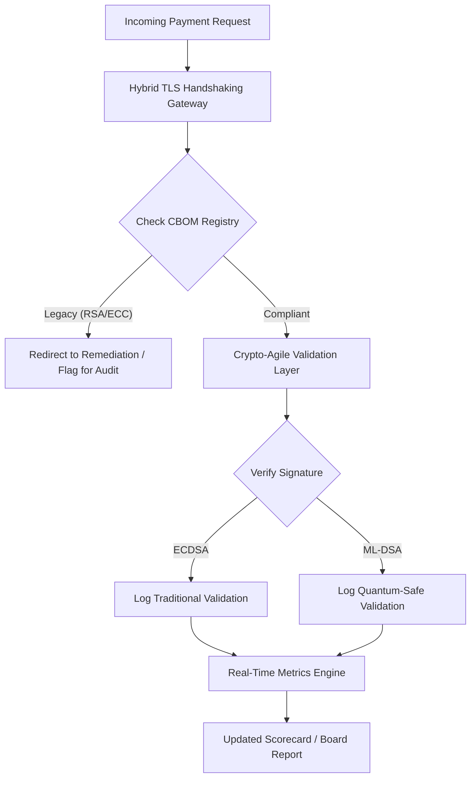

---
# Front Matter (YAML)
author: "contact@sebastienrousseau.com (Sebastien Rousseau)"
banner_alt: "क्वांटम जालकों में विघटित होती अमूर्त डिजिटल बोर्डरूम मेज़ — कोर बैंकिंग अवसंरचना को FIPS 203 और 204 पर माइग्रेट करने हेतु आवश्यक रणनीतिक अभिशासन का दृश्यांकन"
banner_height: "1597"
banner_width: "2584"
banner: "https://cloudcdn.pro/stocks/images/quantum-governance-AbC123XyZ.webp"
cdn: "https://cloudcdn.pro"
charset: "UTF-8"
cname: "sebastienrousseau.com"
copyright: "© Copyright 2025 - 2026 - Sebastien Rousseau. All rights reserved."
date: "29 जून 2026"
description: "2026 पोस्ट-क्वांटम सुरक्षा स्कोरकार्ड बोर्डों और वरिष्ठ प्रबंधन को Tier-1 बैंकिंग अवसंरचना में CBOM, HNDL एक्सपोज़र और NIST FIPS 203/204 माइग्रेशन गति को ट्रैक करने हेतु एक न्यासिक मेट्रिक ढाँचा प्रदान करता है।"
format-detection: "telephone=no"
hreflang: "hi"
icon: "https://cloudcdn.pro/clients/sebastienrousseau/v1/logos/sebastienrousseau.svg"
id: "https://sebastienrousseau.com/2026-06-29-post-quantum-security-scorecard-board-level-fiduciary-agility-2026"
image_alt: "Sebastien Rousseau का श्वेत-श्याम चित्र"
image_height: "162"
image_width: "162"
image: "https://cloudcdn.pro/stocks/images/sebastien-rousseau.png"
keywords: "पोस्ट-क्वांटम क्रिप्टोग्राफ़ी, PQC स्कोरकार्ड, NIST FIPS 203, NIST FIPS 204, CBOM, HNDL, बैंकिंग अभिशासन, क्रिप्टो-एजिलिटी, KyberLib, DORA अनुपालन, SM&CR, क्वांटम रेज़िलिएंस"
language: "hi-IN"
last_reviewed: "2026-06-29"
layout: "report"
locale: "hi_IN"
logo_alt: "Sebastien Rousseau का लोगो"
logo_height: "44"
logo_width: "44"
logo: "https://cloudcdn.pro/clients/sebastienrousseau/v1/logos/sebastienrousseau.svg"
measurementID: "G-169G4ET5HQ"
name: "Sebastien Rousseau"
permalink: "https://sebastienrousseau.com/2026-06-29-post-quantum-security-scorecard-board-level-fiduciary-agility-2026"
rating: "general"
referrer: "no-referrer"
robots: "index, follow"
schema: "FAQPage, Article"
seo_title: "2026 पोस्ट-क्वांटम सुरक्षा स्कोरकार्ड: बोर्ड-स्तरीय ढाँचा"
short_name: "sebastienrousseau"
subtitle: "बोर्डों को NIST FIPS 203 और 204 के माइग्रेशन को कैसे मापना और शासित करना होगा, CBOM पूर्णता को ट्रैक करना होगा और कॉर्पोरेट ट्रेज़री में Harvest-Now-Decrypt-Later (HNDL) एक्सपोज़र को कैसे न्यून करना होगा।"
tags: "पोस्ट-क्वांटम, क्रिप्टोग्राफ़ी, बैंकिंग, अभिशासन, DORA, FIPS-203, FIPS-204, CBOM, HNDL, KyberLib, SM&CR"
theme-color: "0, 83, 191"
title: "2026 पोस्ट-क्वांटम सुरक्षा स्कोरकार्ड: न्यासिक क्रिप्टोग्राफ़िक एजिलिटी हेतु बोर्ड-स्तरीय मेट्रिक ढाँचा"
url: "https://sebastienrousseau.com/2026-06-29-post-quantum-security-scorecard-board-level-fiduciary-agility-2026"
viewport: "width=device-width, initial-scale=1, shrink-to-fit=no"

# RSS
atom_link: "https://sebastienrousseau.com/2026-06-29-post-quantum-security-scorecard-board-level-fiduciary-agility-2026/rss.xml"
category: "Technology"
generator: "Static Site Generator (SSG) (version 0.0.40)"
item_description: "2026 पोस्ट-क्वांटम सुरक्षा स्कोरकार्ड बोर्डों को CBOM, HNDL एक्सपोज़र और NIST माइग्रेशन गति को ट्रैक करने हेतु एक न्यासिक मेट्रिक ढाँचा प्रदान करता है।"
item_pub_date: "Mon, 29 Jun 2026 07:07:07 +0000"
item_title: "2026 पोस्ट-क्वांटम सुरक्षा स्कोरकार्ड: बोर्ड-स्तरीय मेट्रिक ढाँचा"
pub_date: "Mon, 29 Jun 2026 07:07:07 +0000"
type: "article"

# Twitter Card
twitter_card: "summary_large_image"
twitter_creator: "@wwdseb"
twitter_description: "2026 पोस्ट-क्वांटम सुरक्षा स्कोरकार्ड: बैंकिंग बोर्ड क्रिप्टोग्राफ़िक एजिलिटी, CBOM पूर्णता और HNDL एक्सपोज़र को कैसे मापते हैं।"
twitter_image: "https://cloudcdn.pro/clients/sebastienrousseau/v1/logos/sebastienrousseau.svg"
twitter_title: "बैंकिंग बोर्डों हेतु 2026 पोस्ट-क्वांटम सुरक्षा स्कोरकार्ड"
twitter_url: "https://sebastienrousseau.com/2026-06-29-post-quantum-security-scorecard-board-level-fiduciary-agility-2026"

excerpt: "जून 2026 तक, पोस्ट-क्वांटम क्रिप्टोग्राफ़ी (PQC) एक प्रायोगिक तकनीकी चिंता से प्राथमिक न्यासिक दायित्व में परिवर्तित हो चुकी है। बोर्डों को अब लीगेसी एन्क्रिप्शन के व्यवस्थित माइग्रेशन की देखरेख करनी होगी..."

# Template-completeness keys (parity with hsh/noyalib shape)
apple_mobile_web_app_orientations: "portrait"
apple_touch_icon_sizes: "192x192"
apple-mobile-web-app-capable: "yes"
apple-mobile-web-app-status-bar-inset: "black"
apple-mobile-web-app-status-bar-style: "black-translucent"
apple-touch-fullscreen: "yes"
apple-mobile-web-app-title: "PQC स्कोरकार्ड 2026"
author_location: "London, United Kingdom"
author_twitter: "@wwdseb"
author_website: "https://sebastienrousseau.com"
docs: https://validator.w3.org/feed/docs/rss2.html
item_guid: "https://sebastienrousseau.com/2026-06-29-post-quantum-security-scorecard-board-level-fiduciary-agility-2026/rss.xml"
item_link: "https://sebastienrousseau.com/2026-06-29-post-quantum-security-scorecard-board-level-fiduciary-agility-2026/rss.xml"
last_build_date: "Mon, 29 Jun 2026 06:06:06 +0000"
managing_editor: "contact@sebastienrousseau.com (Sebastien Rousseau)"
menu: "active"
msapplication-navbutton-color: "0, 83, 191"
site_components: "Kaishi, Kaishi Builder, Kaishi CLI, Kaishi Templates, Kaishi Themes"
site_last_updated: "2023-07-05"
site_software: "Static Site Generator, Rust"
site_standards: "HTML5, CSS3, RSS, Atom, JSON, XML, YAML, Markdown, TOML"
thanks: "पढ़ने के लिए धन्यवाद!"
ttl: "60"
twitter_image_alt: "Sebastien Rousseau का श्वेत-श्याम चित्र"
twitter_site: "@wwdseb"
webmaster: "contact@sebastienrousseau.com"
---

# 2026 पोस्ट-क्वांटम सुरक्षा स्कोरकार्ड: न्यासिक क्रिप्टोग्राफ़िक एजिलिटी हेतु बोर्ड-स्तरीय मेट्रिक ढाँचा

<aside class="post-lead" aria-label="लेख सारांश">

<strong>संक्षेप में।</strong> जून 2026 तक, पोस्ट-क्वांटम क्रिप्टोग्राफ़ी (PQC) एक प्रायोगिक तकनीकी चिंता से प्राथमिक न्यासिक दायित्व में परिवर्तित हो चुकी है। DORA के तहत प्रणालीगत वित्तीय और परिचालन जोखिमों को न्यून करने के लिए बोर्डों को अब लीगेसी एन्क्रिप्शन के NIST FIPS 203 और 204 मानकों पर व्यवस्थित माइग्रेशन की देखरेख करनी होगी।

<strong>मुख्य निष्कर्ष</strong>

<ul class="post-lead-takeaways">
  <li><strong>G20 संरेखण और कठोर समय-सीमाएँ।</strong> अंतर्राष्ट्रीय नियामकों ने क्वांटम-सुरक्षित संक्रमण की कठोर समय-सीमा 2020 के दशक के अंत में निर्धारित की है, जिससे संस्थानों को परिमाणीय माइग्रेशन प्रगति प्रदर्शित करनी होगी।</li>
  <li><strong>Cryptographic Bill of Materials (CBOM)।</strong> सॉफ़्टवेयर BOM के समान, CBOM सभी क्रिप्टोग्राफ़िक परिसंपत्तियों की एक जीवंत, स्वचालित सूची है जो सप्लाई चेन में दृश्यता सुनिश्चित करने के लिए आवश्यक है।</li>
  <li><strong>Harvest-Now-Decrypt-Later (HNDL) एक्सपोज़र।</strong> प्रतिकूल पक्ष वर्तमान में उच्च-मूल्य के थोक भुगतान डेटा को रोक रहे हैं और संग्रहीत कर रहे हैं; इसे न्यून करने के लिए हाइब्रिड PQC आर्किटेक्चर का तत्काल परिनियोजन आवश्यक है।</li>
  <li><strong>क्रिप्टो-एजिलिटी के माध्यम से न्यासिक अभिशासन।</strong> क्रिप्टो-एजिलिटी एक मापनीय अभिशासन मेट्रिक है। कोर सिस्टम पुनः-अभियांत्रिकीकरण के बिना क्रिप्टोग्राफ़िक प्रिमिटिव्स को स्वैप करने की क्षमता (KyberLib जैसी लाइब्रेरियों का उपयोग करते हुए) अब SM&CR के तहत बोर्ड-स्तरीय जवाबदेही है।</li>
</ul>

<strong>संबंधित पठन:</strong> <a href="https://sebastienrousseau.com/2026-06-12-kyberlib-post-quantum-banking-migration-standards-code-2026">KyberLib और 2026 में पोस्ट-क्वांटम बैंकिंग माइग्रेशन</a>, <a href="https://sebastienrousseau.com/2023-11-19-crystals-kyber-the-safeguarding-algorithm-in-a-quantum-age/index.html">CRYSTALS-Kyber: क्वांटम युग में सुरक्षा एल्गोरिथ्म</a>।

</aside>
पोस्ट-क्वांटम सुरक्षा अब कोई शोध परियोजना नहीं है। "पर्यवेक्षी घड़ी" 2020 के दशक के अंत की प्रवर्तन समय-सीमाओं की ओर बढ़ रही है। [NIST FIPS 203 (ML-KEM)](https://csrc.nist.gov/pubs/fips/203/final) और [NIST FIPS 204 (ML-DSA)](https://csrc.nist.gov/pubs/fips/204/final) के अंतिम रूप ने कुंजी एनकैप्सुलेशन और डिजिटल हस्ताक्षरों के मानकों को संहिताबद्ध कर दिया है।

नियामक निकाय अब Tier-1 बैंकों से पायलट कार्यक्रमों से आगे बढ़ने की अपेक्षा करते हैं। 2026 में, ध्यान इन मानकों के औद्योगिकीकरण पर केंद्रित हो गया है। स्पष्ट माइग्रेशन पथ प्रदर्शित करने में विफलता [Digital Operational Resilience Act (DORA)](https://eur-lex.europa.eu/eli/reg/2022/2554/oj) के तहत महत्वपूर्ण नियामक दंड और क्वांटम-सक्षम डिक्रिप्शन के पूर्वानुमेय खतरे की अनदेखी करने वाले निदेशकों के लिए संभावित व्यक्तिगत देयता वहन करती है।

## 01. बोर्ड-स्तरीय क्वांटम स्कोरकार्ड

निम्नलिखित मेट्रिक्स बोर्डों को Commercial and Investment Banking (CIB) परिसरों में क्वांटम तत्परता और क्रिप्टोग्राफ़िक स्वास्थ्य का मूल्यांकन करने हेतु एक मानकीकृत ढाँचा प्रदान करते हैं।

### तालिका 1: PQC स्कोरकार्ड मेट्रिक्स और सहिष्णुताएँ

| मेट्रिक | गणितीय सूत्र | बोर्ड-अनुमोदित सहिष्णुताएँ | सहिष्णुता से बाहर होने पर जोखिम |
| ---- | ---- | ---- | ---- |
| **Inventory Completeness Percentage (ICP)** | (पहचानी गई क्रिप्टो परिसंपत्तियाँ / कुल अनुमानित परिसंपत्तियाँ) × 100 | > 98% | उच्च-मूल्य क्लियरिंग डेटा पथों में छाया एन्क्रिप्शन और अंधे धब्बे। |
| **HNDL Exposure Rate (HER)** | (लीगेसी क्रिप्टो पर दीर्घजीवी डेटा / कुल दीर्घजीवी डेटा) × 100 | < 5% | व्यापार रहस्यों, संप्रभु ऋण बहियों और थोक भुगतान रिकॉर्डों का स्थायी समझौता। |
| **NIST Migration Progress Rate (MPR)** | (FIPS 203/204 पर चल रहे सिस्टम / कुल महत्वपूर्ण सिस्टम) × 100 | > 60% (YE 2026 तक) | नियामक गैर-अनुपालन और G20-संरेखित प्रतिपक्षों से बहिष्करण। |
| **Crypto-Agility Readiness Index (CARI)** | (अमूर्त क्रिप्टो परतों वाले ऐप्स / कुल कोर ऐप्स) × 100 | > 85% | गंभीर तकनीकी ऋण और भविष्य के एल्गोरिथ्म पदावनतियों का जवाब देने में असमर्थता। |

## 02. Cryptographic Bill of Materials (CBOM)

ICP मेट्रिक एक व्यापक **CBOM डिस्कवरी फ़ेज़** के माध्यम से बेसलाइन की जाती है। यह एक स्वचालित प्रक्रिया है जो उद्यम के भीतर प्रत्येक क्रिप्टोग्राफ़िक एंडपॉइंट की पहचान करती है।

- **Endpoint Discovery:** लीगेसी RSA या ECC उपयोग की पहचान करने हेतु सक्रिय TLS सत्रों के लिए आंतरिक और क्लाउड नेटवर्क को स्कैन करना।
- **Key Inventory:** सार्वजनिक/निजी कुंजी जोड़ों को उनके संबंधित स्वामियों से मानचित्रित करना और सटीक समाप्ति तिथियों का मानचित्रण करना।
- **Dependency Mapping:** ऐसी तृतीय-पक्ष लाइब्रेरियों और APIs की पहचान करना जो पदावनत एल्गोरिथ्मों पर निर्भर हैं।

यह डिस्कवरी फ़ेज़ सत्य का एकल स्रोत बनाता है, जिससे CISO वित्तीय प्रदर्शन के समान विस्तार से क्रिप्टोग्राफ़िक स्वास्थ्य पर रिपोर्ट कर सकते हैं।

## 03. थोक भुगतानों में HNDL एक्सपोज़र का उन्मूलन

प्रतिकूल पक्ष सक्रिय रूप से थोक भुगतानों और दीर्घजीवी कॉर्पोरेट डेटाबेसों को लक्षित कर रहे हैं। ये "Harvest-Now-Decrypt-Later" (HNDL) हमले आज के एन्क्रिप्टेड ट्रैफ़िक की रोकथाम और संग्रहण में संलग्न हैं।

भले ही एक क्रिप्टोग्राफ़िक रूप से प्रासंगिक क्वांटम कंप्यूटर (CRQC) आज मौजूद न हो, अभी रोका गया डेटा भविष्य में भेद्य होगा। इसे न्यून करने के लिए दीर्घजीवी डेटा (जैसे पहचान रिकॉर्ड, 30-वर्षीय बॉन्ड अनुबंध और कानूनी अभिलेखागार) के उच्च-प्राथमिकता वाले माइग्रेशन की आवश्यकता है, जो सीधे HER मेट्रिक को कम करता है। भुगतान चैनलों को हाइब्रिड PQC-पारंपरिक एन्क्रिप्शन (ML-KEM के साथ X25519 का उपयोग करते हुए) में अपग्रेड करना अभिलेखीय खतरों के विरुद्ध तत्काल रक्षा प्रदान करता है।

## 04. सुडिज़ाइन इंटरफ़ेस के माध्यम से क्रिप्टो-एजिलिटी का परिचालनीकरण

क्रिप्टो-एजिलिटी अभियांत्रिकी अमूर्तनों के माध्यम से साकार होती है। [KyberLib](https://sebastienrousseau.com/2026-06-12-kyberlib-post-quantum-banking-migration-standards-code-2026) जैसी आधुनिक लाइब्रेरियाँ दर्शाती हैं कि डेवलपर पूरे एप्लिकेशन स्टैक को फिर से लिखे बिना कैसे क्वांटम-सुरक्षित मॉड्यूल लागू कर सकते हैं।

- **Abstracted Wrappers:** एप्लिकेशन एल्गोरिथ्म-विशिष्ट रूटीनों के बजाय एक सामान्य `encrypt()` या `sign()` फ़ंक्शन को कॉल करते हैं।
- **Runtime Swapping:** अंतर्निहित मॉड्यूल को जटिल कोड परिनियोजनों के बजाय कॉन्फ़िगरेशन परिवर्तनों के माध्यम से ECDSA से ML-DSA में स्वैप किया जा सकता है।

यह आर्किटेक्चर सुनिश्चित करता है कि यदि भविष्य में कोई विशिष्ट PQC एल्गोरिथ्म समझौता हो जाए, तो संगठन वर्षों के बजाय घंटों में पिवट कर सके।

## 05. क्वांटम-सुरक्षित इंग्रेस सत्यापन कार्यप्रवाह

निम्नलिखित आरेख एक क्वांटम-एजाइल बैंकिंग परिवेश में सुरक्षित परिधि में प्रवेश करने वाले डेटा के जीवनचक्र को दर्शाता है।

## निष्कर्ष

Tier-1 बैंक का क्रिप्टोग्राफ़िक परिसर अब CISO की चिंता नहीं है। यह न्यासिक अवसंरचना है। NIST FIPS 203 और 204 एल्गोरिथ्म निर्धारित करते हैं; DORA Article 5 जवाबदेही सतह निर्धारित करता है; SM&CR इसे एक नामित वरिष्ठ प्रबंधक से जोड़ता है। ऊपर का स्कोरकार्ड — Inventory Completeness, HNDL Exposure, Migration Progress, Crypto-Agility — बोर्ड को क्रिप्टोग्राफ़िक कोड पढ़े बिना उस परिसर को शासित करने के लिए आवश्यक चार संख्याएँ देता है।

सबसे महत्वपूर्ण संख्या HNDL Exposure है। आज थोक-भुगतान अभिलेखागार में बैठा प्रत्येक लीगेसी-एन्क्रिप्टेड रिकॉर्ड उस दिन पठनीय होगा जिस दिन पहला क्रिप्टोग्राफ़िक रूप से प्रासंगिक क्वांटम कंप्यूटर भेजा जाएगा। उल्टी गिनती मौन और असममित है: रक्षक केवल उस डेटा पर कार्य कर सकते हैं जो उनके पास है, प्रतिकूल पक्ष उस डेटा पर कार्य कर सकते हैं जिसे उन्होंने वर्षों पहले निष्कासित कर लिया था। 2024 में RSA-2048 के साथ एन्क्रिप्ट किया गया 30-वर्षीय कॉर्पोरेट बॉन्ड अनुबंध एक ऐसा अनुबंध है जो CRQC के लाइव होने के दिन अपनी गोपनीयता गारंटी खो देता है।

[KyberLib](https://sebastienrousseau.com/2026-06-12-kyberlib-post-quantum-banking-migration-standards-code-2026) और इसके समकक्ष इसे एक बहुवर्षीय प्लेटफ़ॉर्म पुनर्लेखन से एक कॉन्फ़िगरेशन परिवर्तन में बदल देते हैं। बोर्ड का काम कोड लिखना नहीं है। बोर्ड का काम यह माँग करना है कि Crypto-Agility Readiness Index — अमूर्त क्रिप्टोग्राफ़िक इंटरफ़ेस के पीछे कोर एप्लिकेशनों का हिस्सा — बारह महीनों के भीतर 85% से आगे बढ़े, और तिमाही स्कोरकार्ड को पढ़े।

<aside class="author-card" aria-label="लेखक के बारे में"><strong class="author-card-name"><a href="/about/index.html">Sebastien Rousseau</a></strong>वरिष्ठ बैंकिंग तकनीशियन जो अनुप्रयुक्त AI, ISO 20022 माइग्रेशन, वित्तीय सेवाओं हेतु पोस्ट-क्वांटम क्रिप्टोग्राफ़ी और थोक भुगतानों के संरचनात्मक परिवर्तन पर लिखते हैं।HSBC Commercial & Investment Bank, PayPal, Barclays, Shazam में 20+ वर्ष। <a href="https://www.linkedin.com/in/sebastienrousseau/" rel="external noopener">LinkedIn</a> &middot; <a href="https://github.com/sebastienrousseau" rel="external noopener">GitHub</a></aside>

अंतिम समीक्षा <time datetime="2026-06-29">2026-06-29</time>।

