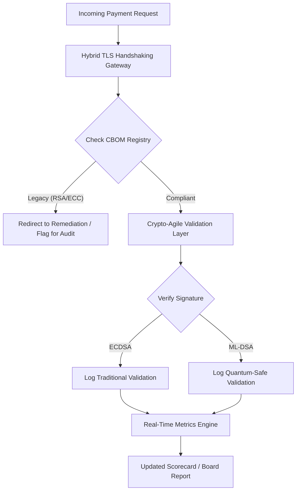

---
# Front Matter (YAML)
author: "contact@sebastienrousseau.com (Sebastien Rousseau)"
banner_alt: "Meja ruang dewan digital abstrak yang larut menjadi kisi-kisi kuantum — memvisualisasikan tata kelola strategis yang dibutuhkan untuk memigrasikan infrastruktur perbankan inti ke FIPS 203 dan 204"
banner_height: "1597"
banner_width: "2584"
banner: "https://cloudcdn.pro/stocks/images/quantum-governance-AbC123XyZ.webp"
cdn: "https://cloudcdn.pro"
charset: "UTF-8"
cname: "sebastienrousseau.com"
copyright: "© Hak Cipta 2025 - 2026 - Sebastien Rousseau. Seluruh hak cipta dilindungi."
date: "29 Juni 2026"
description: "Scorecard Keamanan Pasca-Kuantum 2026 memberi dewan dan manajemen senior kerangka metrik fidusia untuk melacak Cryptographic Bill of Materials (CBOM), eksposur HNDL, dan kecepatan migrasi NIST FIPS 203/204 di seluruh infrastruktur perbankan Tier-1."
format-detection: "telephone=no"
hreflang: "id"
icon: "https://cloudcdn.pro/clients/sebastienrousseau/v1/logos/sebastienrousseau.svg"
id: "https://sebastienrousseau.com/2026-06-29-post-quantum-security-scorecard-board-level-fiduciary-agility-2026"
image_alt: "Potret Hitam Putih Sebastien Rousseau"
image_height: "162"
image_width: "162"
image: "https://cloudcdn.pro/stocks/images/sebastien-rousseau.png"
keywords: "kriptografi pasca-kuantum, scorecard PQC, NIST FIPS 203, NIST FIPS 204, CBOM, HNDL, tata kelola perbankan, crypto-agility, KyberLib, kepatuhan DORA, SM&CR, ketahanan kuantum"
language: "id-ID"
last_reviewed: "2026-06-29"
layout: "report"
locale: "id_ID"
logo_alt: "Logo Sebastien Rousseau"
logo_height: "44"
logo_width: "44"
logo: "https://cloudcdn.pro/clients/sebastienrousseau/v1/logos/sebastienrousseau.svg"
measurementID: "G-169G4ET5HQ"
name: "Sebastien Rousseau"
permalink: "https://sebastienrousseau.com/2026-06-29-post-quantum-security-scorecard-board-level-fiduciary-agility-2026"
rating: "general"
referrer: "no-referrer"
robots: "index, follow"
schema: "FAQPage, Article"
seo_title: "Scorecard Keamanan Pasca-Kuantum 2026: Kerangka Tingkat Dewan"
short_name: "sebastienrousseau"
subtitle: "Cara dewan harus mengukur dan menata kelola migrasi ke NIST FIPS 203 dan 204, melacak kelengkapan CBOM, dan memitigasi eksposur Harvest-Now-Decrypt-Later (HNDL) pada treasury korporat."
tags: "pasca-kuantum, kriptografi, perbankan, tata kelola, DORA, FIPS-203, FIPS-204, CBOM, HNDL, KyberLib, SM&CR"
theme-color: "0, 83, 191"
title: "Scorecard Keamanan Pasca-Kuantum 2026: Kerangka Metrik Tingkat Dewan"
url: "https://sebastienrousseau.com/2026-06-29-post-quantum-security-scorecard-board-level-fiduciary-agility-2026"
viewport: "width=device-width, initial-scale=1, shrink-to-fit=no"

# RSS
atom_link: "https://sebastienrousseau.com/2026-06-29-post-quantum-security-scorecard-board-level-fiduciary-agility-2026/rss.xml"
category: "Teknologi"
generator: "Static Site Generator (SSG) (version 0.0.40)"
item_description: "Scorecard Keamanan Pasca-Kuantum 2026 memberi dewan kerangka metrik fidusia untuk melacak CBOM, eksposur HNDL, dan kecepatan migrasi NIST."
item_pub_date: "Mon, 29 Jun 2026 07:07:07 +0000"
item_title: "Scorecard Keamanan Pasca-Kuantum 2026: Kerangka Metrik Tingkat Dewan"
pub_date: "Mon, 29 Jun 2026 07:07:07 +0000"
type: "article"

# Twitter Card
twitter_card: "summary_large_image"
twitter_creator: "@wwdseb"
twitter_description: "Scorecard Keamanan Pasca-Kuantum 2026: Bagaimana dewan perbankan mengukur crypto-agility, kelengkapan CBOM, dan eksposur HNDL."
twitter_image: "https://cloudcdn.pro/clients/sebastienrousseau/v1/logos/sebastienrousseau.svg"
twitter_title: "Scorecard Keamanan Pasca-Kuantum 2026 untuk Dewan Perbankan"
twitter_url: "https://sebastienrousseau.com/2026-06-29-post-quantum-security-scorecard-board-level-fiduciary-agility-2026"

excerpt: "Per Juni 2026, kriptografi pasca-kuantum (PQC) telah beralih dari masalah teknis eksperimental menjadi kewajiban fidusia utama. Dewan kini harus mengawasi migrasi sistematis enkripsi warisan..."

# Template-completeness keys (parity with hsh/noyalib shape)
apple_mobile_web_app_orientations: "portrait"
apple_touch_icon_sizes: "192x192"
apple-mobile-web-app-capable: "yes"
apple-mobile-web-app-status-bar-inset: "black"
apple-mobile-web-app-status-bar-style: "black-translucent"
apple-touch-fullscreen: "yes"
apple-mobile-web-app-title: "Scorecard PQC 2026"
author_location: "London, United Kingdom"
author_twitter: "@wwdseb"
author_website: "https://sebastienrousseau.com"
docs: https://validator.w3.org/feed/docs/rss2.html
item_guid: "https://sebastienrousseau.com/2026-06-29-post-quantum-security-scorecard-board-level-fiduciary-agility-2026/rss.xml"
item_link: "https://sebastienrousseau.com/2026-06-29-post-quantum-security-scorecard-board-level-fiduciary-agility-2026/rss.xml"
last_build_date: "Mon, 29 Jun 2026 06:06:06 +0000"
managing_editor: "contact@sebastienrousseau.com (Sebastien Rousseau)"
menu: "active"
msapplication-navbutton-color: "0, 83, 191"
site_components: "Kaishi, Kaishi Builder, Kaishi CLI, Kaishi Templates, Kaishi Themes"
site_last_updated: "2023-07-05"
site_software: "Static Site Generator, Rust"
site_standards: "HTML5, CSS3, RSS, Atom, JSON, XML, YAML, Markdown, TOML"
thanks: "Terima kasih telah membaca!"
ttl: "60"
twitter_image_alt: "Potret Hitam Putih Sebastien Rousseau"
twitter_site: "@wwdseb"
webmaster: "contact@sebastienrousseau.com"
---

# Scorecard Keamanan Pasca-Kuantum 2026: Kerangka Metrik Tingkat Dewan untuk Crypto-Agility Fidusia

<aside class="post-lead" aria-label="Ringkasan artikel">

<strong>TL;DR.</strong> Per Juni 2026, kriptografi pasca-kuantum (PQC) telah beralih dari masalah teknis eksperimental menjadi kewajiban fidusia utama. Dewan kini harus mengawasi migrasi sistematis enkripsi warisan ke standar NIST FIPS 203 dan 204 untuk memitigasi risiko keuangan dan operasional sistemik di bawah DORA.

<strong>Poin utama</strong>

<ul class="post-lead-takeaways">
  <li><strong>Penyelarasan G20 dan tenggat keras.</strong> Regulator internasional telah menetapkan akhir dekade 2020-an sebagai tenggat keras untuk transisi tahan-kuantum, mewajibkan institusi menunjukkan kemajuan migrasi yang dapat dikuantifikasi.</li>
  <li><strong>Cryptographic Bill of Materials (CBOM).</strong> Analog dengan software BOM, CBOM adalah inventaris langsung dan otomatis dari seluruh aset kriptografis yang diperlukan untuk memastikan visibilitas di sepanjang rantai pasok.</li>
  <li><strong>Eksposur Harvest-Now-Decrypt-Later (HNDL).</strong> Adversari saat ini mencegat dan menyimpan data pembayaran grosir bernilai tinggi yang terenkripsi; memitigasi hal ini menuntut penerapan segera arsitektur PQC hibrida.</li>
  <li><strong>Tata kelola fidusia melalui crypto-agility.</strong> Crypto-agility adalah metrik tata kelola yang dapat diukur. Kemampuan untuk menukar primitif kriptografis tanpa rekayasa ulang sistem inti (menggunakan pustaka seperti KyberLib) kini menjadi akuntabilitas tingkat dewan di bawah SM&CR.</li>
</ul>

<strong>Bacaan terkait:</strong> <a href="https://sebastienrousseau.com/2026-06-12-kyberlib-post-quantum-banking-migration-standards-code-2026">KyberLib dan Migrasi Perbankan Pasca-Kuantum pada 2026</a>, <a href="https://sebastienrousseau.com/2023-11-19-crystals-kyber-the-safeguarding-algorithm-in-a-quantum-age/index.html">CRYSTALS-Kyber: Algoritma Pengaman di Era Kuantum</a>.

</aside>
Keamanan pasca-kuantum bukan lagi proyek riset. "Jam supervisi" sedang berdetak menuju tenggat penegakan akhir dekade 2020-an. Finalisasi [NIST FIPS 203 (ML-KEM)](https://csrc.nist.gov/pubs/fips/203/final) dan [NIST FIPS 204 (ML-DSA)](https://csrc.nist.gov/pubs/fips/204/final) telah mengodifikasi standar untuk enkapsulasi kunci dan tanda tangan digital.

Badan regulasi kini menuntut bank Tier-1 bergerak melampaui program pilot. Pada 2026, fokus telah bergeser ke industrialisasi standar ini. Kegagalan menunjukkan jalur migrasi yang jelas membawa sanksi regulasi yang signifikan di bawah [Digital Operational Resilience Act (DORA)](https://eur-lex.europa.eu/eli/reg/2022/2554/oj) dan potensi liabilitas pribadi bagi direktur yang mengabaikan ancaman dekripsi berkemampuan kuantum yang dapat diprediksi.

## 01. Scorecard Kuantum Tingkat Dewan

Metrik berikut menyediakan kerangka standar bagi dewan untuk mengevaluasi kesiapan kuantum dan kesehatan kriptografis di seluruh estat Commercial and Investment Banking (CIB).

### Tabel 1: Metrik dan toleransi Scorecard PQC

| Metrik | Rumus Matematis | Toleransi yang Disetujui Dewan | Risiko jika Di Luar Toleransi |
| ---- | ---- | ---- | ---- |
| **Inventory Completeness Percentage (ICP)** | (Aset Kripto Teridentifikasi / Total Estimasi Aset) × 100 | > 98% | Enkripsi bayangan dan titik buta pada jalur data kliring bernilai tinggi. |
| **HNDL Exposure Rate (HER)** | (Data Berumur Panjang pada Kripto Warisan / Total Data Berumur Panjang) × 100 | < 5% | Kompromi permanen rahasia dagang, ledger utang negara, dan catatan pembayaran grosir. |
| **NIST Migration Progress Rate (MPR)** | (Sistem yang Menjalankan FIPS 203/204 / Total Sistem Kritis) × 100 | > 60% (per akhir 2026) | Ketidakpatuhan regulasi dan eksklusi dari counterparty yang selaras G20. |
| **Crypto-Agility Readiness Index (CARI)** | (Aplikasi dengan Lapisan Kripto Terabstraksi / Total Aplikasi Inti) × 100 | > 85% | Utang teknis berat dan ketidakmampuan merespons deprekasi algoritma di masa depan. |

## 02. Cryptographic Bill of Materials (CBOM)

Metrik ICP diberi baseline melalui **Fase Discovery CBOM** yang komprehensif. Ini adalah proses otomatis yang mengidentifikasi setiap endpoint kriptografis di dalam enterprise.

- **Endpoint Discovery:** Memindai jaringan internal dan cloud untuk sesi TLS aktif guna mengidentifikasi penggunaan RSA atau ECC warisan.
- **Inventaris Kunci:** Memetakan pasangan kunci publik/privat ke pemiliknya masing-masing dan memetakan tanggal kedaluwarsa yang tepat.
- **Pemetaan Dependensi:** Mengidentifikasi pustaka pihak ketiga dan API yang bergantung pada algoritma yang sudah usang.

Fase discovery ini menciptakan satu sumber kebenaran, memungkinkan CISO melaporkan kesehatan kriptografis dengan granularitas yang sama dengan kinerja keuangan.

## 03. Menghilangkan Eksposur HNDL pada Pembayaran Grosir

Adversari secara aktif menargetkan pembayaran grosir dan basis data korporat berumur panjang. Serangan "Harvest-Now-Decrypt-Later" (HNDL) ini melibatkan pencegatan dan pengarsipan lalu lintas terenkripsi hari ini.

Bahkan jika cryptographically relevant quantum computer (CRQC) belum ada hari ini, data yang dicegat sekarang akan rentan di masa depan. Memitigasi hal ini menuntut migrasi prioritas tinggi atas data berumur panjang (mis. catatan identitas, kontrak obligasi 30 tahun, dan arsip hukum), yang secara langsung mengurangi metrik HER. Memutakhirkan kanal pembayaran ke enkripsi PQC-tradisional hibrida (menggunakan ML-KEM bersama X25519) memberikan pertahanan segera terhadap ancaman arsip.

## 04. Mengoperasionalkan Crypto-Agility melalui Antarmuka yang Dirancang Baik

Crypto-agility diwujudkan melalui abstraksi rekayasa. Pustaka modern seperti [KyberLib](https://sebastienrousseau.com/2026-06-12-kyberlib-post-quantum-banking-migration-standards-code-2026) menunjukkan bagaimana pengembang dapat mengimplementasikan modul tahan-kuantum tanpa menulis ulang seluruh tumpukan aplikasi.

- **Wrapper Terabstraksi:** Aplikasi memanggil fungsi generik `encrypt()` atau `sign()` alih-alih rutinitas spesifik-algoritma.
- **Pertukaran Runtime:** Modul yang mendasarinya dapat ditukar dari ECDSA ke ML-DSA melalui perubahan konfigurasi alih-alih deployment kode yang kompleks.

Arsitektur ini memastikan bahwa jika algoritma PQC tertentu dikompromikan di masa depan, organisasi dapat berpivot dalam hitungan jam, bukan tahun.

## 05. Alur Validasi Ingress Tahan-Kuantum

Diagram berikut menggambarkan siklus hidup data yang memasuki perimeter aman dalam lingkungan perbankan yang quantum-agile.

## Kesimpulan

Estat kriptografis bank Tier-1 bukan lagi urusan CISO. Ia adalah infrastruktur fidusia. NIST FIPS 203 dan 204 menetapkan algoritma; DORA Pasal 5 menetapkan permukaan akuntabilitas; SM&CR menyematkannya pada seorang manajer senior bernama. Scorecard di atas — Inventory Completeness, HNDL Exposure, Migration Progress, Crypto-Agility — memberi dewan empat angka yang dibutuhkan untuk menata kelola estat tersebut tanpa harus membaca kode kriptografis.

Angka yang paling penting adalah HNDL Exposure. Setiap catatan terenkripsi-warisan yang tersimpan dalam arsip pembayaran grosir hari ini akan dapat dibaca pada hari pertama cryptographically relevant quantum computer dikirim. Hitung mundurnya senyap dan asimetris: pembela hanya dapat bertindak atas data yang mereka pegang, adversari dapat bertindak atas data yang telah mereka eksfiltrasi bertahun-tahun lalu. Kontrak obligasi korporat 30 tahun yang dienkripsi dengan RSA-2048 pada 2024 adalah kontrak yang kehilangan jaminan kerahasiaannya pada hari CRQC mulai beroperasi.

[KyberLib](https://sebastienrousseau.com/2026-06-12-kyberlib-post-quantum-banking-migration-standards-code-2026) dan sejawatnya mengubah ini dari penulisan ulang platform multi-tahun menjadi perubahan konfigurasi. Tugas dewan bukanlah menulis kode. Tugas dewan adalah menuntut agar Crypto-Agility Readiness Index — porsi aplikasi inti di balik antarmuka kriptografis terabstraksi — bergerak melewati 85% dalam dua belas bulan, dan membaca scorecard kuartalan.

<aside class="author-card" aria-label="Tentang penulis"><strong class="author-card-name"><a href="/about/index.html">Sebastien Rousseau</a></strong>Teknolog perbankan senior yang menulis tentang AI terapan, migrasi ISO 20022, kriptografi pasca-kuantum untuk layanan keuangan, dan transformasi struktural pembayaran grosir.20+ tahun di HSBC Commercial & Investment Bank, PayPal, Barclays, Shazam. <a href="https://www.linkedin.com/in/sebastienrousseau/" rel="external noopener">LinkedIn</a> &middot; <a href="https://github.com/sebastienrousseau" rel="external noopener">GitHub</a></aside>

Terakhir ditinjau <time datetime="2026-06-29">2026-06-29</time>.

