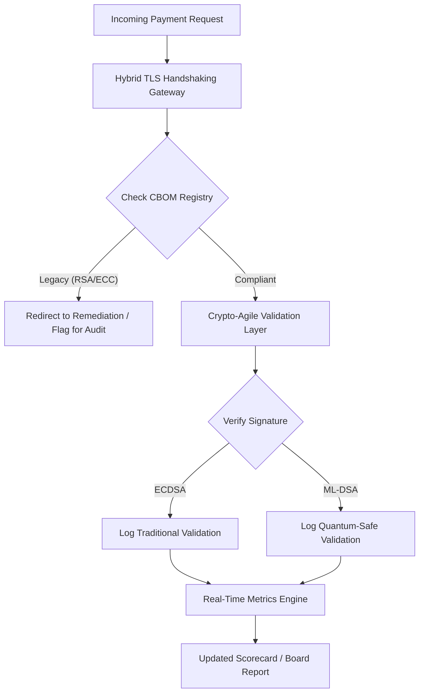

---
# Front Matter (YAML)
author: "contact@sebastienrousseau.com (Sebastien Rousseau)"
banner_alt: "Tavolo astratto di un consiglio di amministrazione digitale che si dissolve in reticoli quantistici — rappresenta la governance strategica necessaria per migrare l'infrastruttura bancaria core verso FIPS 203 e 204"
banner_height: "1597"
banner_width: "2584"
banner: "https://cloudcdn.pro/stocks/images/quantum-governance-AbC123XyZ.webp"
cdn: "https://cloudcdn.pro"
charset: "UTF-8"
cname: "sebastienrousseau.com"
copyright: "© Copyright 2025 - 2026 - Sebastien Rousseau. Tutti i diritti riservati."
date: "29 giugno 2026"
description: "La Scorecard di Sicurezza Post-Quantistica 2026 fornisce ai consigli di amministrazione un quadro fiduciario di metriche per monitorare il Cryptographic Bill of Materials (CBOM), l'esposizione HNDL e la velocità di migrazione verso NIST FIPS 203/204 nelle infrastrutture bancarie di Livello 1."
format-detection: "telephone=no"
hreflang: "it"
icon: "https://cloudcdn.pro/clients/sebastienrousseau/v1/logos/sebastienrousseau.svg"
id: "https://sebastienrousseau.com/2026-06-29-post-quantum-security-scorecard-board-level-fiduciary-agility-2026"
image_alt: "Ritratto in bianco e nero di Sebastien Rousseau"
image_height: "162"
image_width: "162"
image: "https://cloudcdn.pro/stocks/images/sebastienrousseau.webp"
keywords: "crittografia post-quantistica, scorecard PQC, NIST FIPS 203, NIST FIPS 204, CBOM, HNDL, governance bancaria, cripto-agilità, KyberLib, conformità DORA, SM&CR, resilienza quantistica"
language: "it-IT"
last_reviewed: "2026-06-29"
layout: "report"
locale: "it_IT"
logo_alt: "Logo di Sebastien Rousseau"
logo_height: "44"
logo_width: "44"
logo: "https://cloudcdn.pro/clients/sebastienrousseau/v1/logos/sebastienrousseau.svg"
measurementID: "G-169G4ET5HQ"
name: "Sebastien Rousseau"
permalink: "https://sebastienrousseau.com/2026-06-29-post-quantum-security-scorecard-board-level-fiduciary-agility-2026"
rating: "general"
referrer: "no-referrer"
robots: "index, follow"
schema: "FAQPage, Article"
seo_title: "Scorecard Sicurezza Post-Quantistica 2026: quadro per CdA"
short_name: "sebastienrousseau"
subtitle: "Come i consigli di amministrazione devono misurare e governare la migrazione verso NIST FIPS 203 e 204, monitorando la completezza del CBOM e mitigando l'esposizione Harvest-Now-Decrypt-Later (HNDL) nella tesoreria aziendale."
tags: "post-quantum, crittografia, banche, governance, DORA, FIPS-203, FIPS-204, CBOM, HNDL, KyberLib, SM&CR"
theme-color: "0, 83, 191"
title: "La Scorecard di Sicurezza Post-Quantistica 2026: un quadro di metriche per i consigli di amministrazione"
url: "https://sebastienrousseau.com/2026-06-29-post-quantum-security-scorecard-board-level-fiduciary-agility-2026"
viewport: "width=device-width, initial-scale=1, shrink-to-fit=no"

# RSS
atom_link: "https://sebastienrousseau.com/2026-06-29-post-quantum-security-scorecard-board-level-fiduciary-agility-2026/rss.xml"
category: "Technology"
generator: "Static Site Generator (SSG) (version 0.0.40)"
item_description: "La Scorecard di Sicurezza Post-Quantistica 2026 fornisce ai consigli di amministrazione un quadro fiduciario di metriche per monitorare CBOM, esposizione HNDL e velocità di migrazione NIST."
item_pub_date: "Mon, 29 Jun 2026 07:07:07 +0000"
item_title: "La Scorecard di Sicurezza Post-Quantistica 2026: un quadro di metriche per i CdA"
pub_date: "Mon, 29 Jun 2026 07:07:07 +0000"
type: "article"

# Twitter Card
twitter_card: "summary_large_image"
twitter_creator: "@wwdseb"
twitter_description: "La Scorecard di Sicurezza Post-Quantistica 2026: come i CdA bancari misurano cripto-agilità, completezza del CBOM ed esposizione HNDL."
twitter_image: "https://cloudcdn.pro/clients/sebastienrousseau/v1/logos/sebastienrousseau.svg"
twitter_title: "Scorecard di Sicurezza Post-Quantistica 2026 per CdA bancari"
twitter_url: "https://sebastienrousseau.com/2026-06-29-post-quantum-security-scorecard-board-level-fiduciary-agility-2026"

excerpt: "A giugno 2026, la crittografia post-quantistica (PQC) è passata da preoccupazione tecnica sperimentale a obbligo fiduciario primario. I consigli di amministrazione devono ora supervisionare la migrazione sistematica della cifratura legacy..."

# Template-completeness keys (parity with hsh/noyalib shape)
apple_mobile_web_app_orientations: "portrait"
apple_touch_icon_sizes: "192x192"
apple-mobile-web-app-capable: "yes"
apple-mobile-web-app-status-bar-inset: "black"
apple-mobile-web-app-status-bar-style: "black-translucent"
apple-touch-fullscreen: "yes"
apple-mobile-web-app-title: "Scorecard PQC 2026"
author_location: "London, United Kingdom"
author_twitter: "@wwdseb"
author_website: "https://sebastienrousseau.com"
docs: https://validator.w3.org/feed/docs/rss2.html
item_guid: "https://sebastienrousseau.com/2026-06-29-post-quantum-security-scorecard-board-level-fiduciary-agility-2026/rss.xml"
item_link: "https://sebastienrousseau.com/2026-06-29-post-quantum-security-scorecard-board-level-fiduciary-agility-2026/rss.xml"
last_build_date: "Mon, 29 Jun 2026 06:06:06 +0000"
managing_editor: "contact@sebastienrousseau.com (Sebastien Rousseau)"
menu: "active"
msapplication-navbutton-color: "0, 83, 191"
site_components: "Kaishi, Kaishi Builder, Kaishi CLI, Kaishi Templates, Kaishi Themes"
site_last_updated: "2023-07-05"
site_software: "Static Site Generator, Rust"
site_standards: "HTML5, CSS3, RSS, Atom, JSON, XML, YAML, Markdown, TOML"
thanks: "Grazie per la lettura!"
ttl: "60"
twitter_image_alt: "Ritratto in bianco e nero di Sebastien Rousseau"
twitter_site: "@wwdseb"
webmaster: "contact@sebastienrousseau.com"
---

# La Scorecard di Sicurezza Post-Quantistica 2026: un quadro di metriche per la governance fiduciaria dell'agilità crittografica

<aside class="post-lead" aria-label="Sintesi dell'articolo">

<strong>In sintesi.</strong> A giugno 2026, la crittografia post-quantistica (PQC) è passata da preoccupazione tecnica sperimentale a obbligo fiduciario primario. I consigli di amministrazione devono ora supervisionare la migrazione sistematica della cifratura legacy verso gli standard NIST FIPS 203 e 204 per mitigare i rischi finanziari e operativi sistemici previsti da DORA.

<strong>Punti chiave</strong>

<ul class="post-lead-takeaways">
  <li><strong>Allineamento G20 e scadenze inderogabili.</strong> Le autorità di regolamentazione internazionali hanno fissato la fine degli anni 2020 come scadenza inderogabile per le transizioni quantum-safe, imponendo agli istituti di dimostrare progressi di migrazione quantificabili.</li>
  <li><strong>Il Cryptographic Bill of Materials (CBOM).</strong> Analogamente a un BOM software, un CBOM è un inventario automatizzato e in tempo reale di tutti gli asset crittografici, necessario per assicurare la visibilità lungo la supply chain.</li>
  <li><strong>Esposizione Harvest-Now-Decrypt-Later (HNDL).</strong> Gli avversari stanno attualmente intercettando e archiviando dati di pagamento wholesale ad alto valore cifrati; mitigare questo rischio richiede l'implementazione immediata di architetture PQC ibride.</li>
  <li><strong>Governance fiduciaria attraverso la cripto-agilità.</strong> La cripto-agilità è una metrica di governance misurabile. La capacità di sostituire le primitive crittografiche senza re-ingegnerizzare i sistemi core (usando librerie come KyberLib) è oggi una responsabilità a livello di CdA ai sensi di SM&CR.</li>
</ul>

<strong>Letture correlate:</strong> <a href="https://sebastienrousseau.com/2026-06-12-kyberlib-post-quantum-banking-migration-standards-code-2026">KyberLib e la migrazione bancaria post-quantistica nel 2026</a>, <a href="https://sebastienrousseau.com/2023-11-19-crystals-kyber-the-safeguarding-algorithm-in-a-quantum-age/index.html">CRYSTALS-Kyber: l'algoritmo di protezione nell'era quantistica</a>.

</aside>
La sicurezza post-quantistica non è più un progetto di ricerca. L'"orologio della vigilanza" corre verso le scadenze applicative di fine anni 2020. La finalizzazione di [NIST FIPS 203 (ML-KEM)](https://csrc.nist.gov/pubs/fips/203/final) e [NIST FIPS 204 (ML-DSA)](https://csrc.nist.gov/pubs/fips/204/final) ha codificato gli standard per l'incapsulamento delle chiavi e le firme digitali.

Le autorità di regolamentazione si aspettano ora che le banche di Livello 1 vadano oltre i programmi pilota. Nel 2026, l'attenzione si è spostata sull'industrializzazione di questi standard. La mancata dimostrazione di un percorso di migrazione chiaro comporta sanzioni regolatorie significative ai sensi del [Digital Operational Resilience Act (DORA)](https://eur-lex.europa.eu/eli/reg/2022/2554/oj) e una potenziale responsabilità personale per gli amministratori che ignorano la minaccia prevedibile della decifrazione abilitata dal quantistico.

## 01. La scorecard quantistica a livello di CdA

Le metriche seguenti forniscono un quadro standardizzato che consente ai consigli di amministrazione di valutare la prontezza quantistica e la salute crittografica degli asset di Commercial and Investment Banking (CIB).

### Tabella 1: metriche della Scorecard PQC e tolleranze

| Metrica | Formula matematica | Tolleranze approvate dal CdA | Rischio in caso di superamento |
| ---- | ---- | ---- | ---- |
| **Percentuale di completezza dell'inventario (ICP)** | (Asset crittografici identificati / Asset totali stimati) × 100 | > 98% | Cifratura shadow e punti ciechi nei percorsi dati di clearing ad alto valore. |
| **Tasso di esposizione HNDL (HER)** | (Dati di lunga durata su crittografia legacy / Dati totali di lunga durata) × 100 | < 5% | Compromissione permanente di segreti commerciali, registri del debito sovrano e record di pagamenti wholesale. |
| **Tasso di avanzamento della migrazione NIST (MPR)** | (Sistemi che eseguono FIPS 203/204 / Sistemi critici totali) × 100 | > 60% (entro fine 2026) | Non conformità regolatoria ed esclusione dalle controparti allineate al G20. |
| **Indice di prontezza alla cripto-agilità (CARI)** | (App con livelli crittografici astratti / App core totali) × 100 | > 85% | Debito tecnico grave e incapacità di rispondere a future dismissioni di algoritmi. |

## 02. Il Cryptographic Bill of Materials (CBOM)

La metrica ICP viene rilevata attraverso una **Fase di Scoperta del CBOM** completa. Si tratta di un processo automatizzato che identifica ogni endpoint crittografico all'interno dell'organizzazione.

- **Scoperta degli endpoint:** scansione delle reti interne e cloud per individuare sessioni TLS attive che usano RSA o ECC legacy.
- **Inventario delle chiavi:** mappatura delle coppie di chiavi pubbliche/private ai rispettivi titolari e tracciamento delle date di scadenza esatte.
- **Mappatura delle dipendenze:** identificazione di librerie di terze parti e API che si basano su algoritmi deprecati.

Questa fase di scoperta crea un'unica fonte di verità, permettendo al CISO di rendicontare la salute crittografica con la stessa granularità delle performance finanziarie.

## 03. Eliminare l'esposizione HNDL nei pagamenti wholesale

Gli avversari prendono attivamente di mira i pagamenti wholesale e i database aziendali di lunga durata. Questi attacchi "Harvest-Now-Decrypt-Later" (HNDL) comportano l'intercettazione e l'archiviazione del traffico cifrato di oggi.

Anche se un computer quantistico crittograficamente rilevante (CRQC) non esiste oggi, i dati intercettati ora saranno vulnerabili in futuro. Mitigare questo rischio richiede la migrazione ad alta priorità dei dati di lunga durata (ad esempio, record d'identità, contratti obbligazionari trentennali e archivi legali), che riduce direttamente la metrica HER. L'aggiornamento dei canali di pagamento verso una cifratura ibrida PQC-tradizionale (usando ML-KEM insieme a X25519) fornisce una difesa immediata contro le minacce di archiviazione.

## 04. Operativizzare la cripto-agilità con interfacce ben progettate

La cripto-agilità si realizza attraverso astrazioni ingegneristiche. Le librerie moderne come [KyberLib](https://sebastienrousseau.com/2026-06-12-kyberlib-post-quantum-banking-migration-standards-code-2026) dimostrano come gli sviluppatori possano implementare moduli quantum-safe senza riscrivere l'intero stack applicativo.

- **Wrapper astratti:** le applicazioni chiamano una funzione generica `encrypt()` o `sign()` invece di routine specifiche per algoritmo.
- **Sostituzione a runtime:** il modulo sottostante può essere sostituito da ECDSA a ML-DSA tramite modifiche di configurazione, anziché complessi rilasci di codice.

Questa architettura garantisce che, se un algoritmo PQC specifico viene compromesso in futuro, l'organizzazione possa cambiare rotta in ore anziché in anni.

## 05. Il workflow di validazione dell'ingresso quantum-safe

Il diagramma seguente illustra il ciclo di vita dei dati che entrano nel perimetro sicuro in un ambiente bancario quantum-agile.

## Conclusione

L'estate crittografica di una banca di Livello 1 non è più un problema del CISO. È infrastruttura fiduciaria. NIST FIPS 203 e 204 fissano gli algoritmi; l'Articolo 5 di DORA fissa la superficie di responsabilità; SM&CR la ancora a un senior manager con nome e cognome. La scorecard sopra — Completezza dell'inventario, Esposizione HNDL, Avanzamento della migrazione, Cripto-agilità — fornisce a un CdA i quattro numeri necessari per governare quell'estate senza dover leggere il codice crittografico.

Il numero che conta di più è l'Esposizione HNDL. Ogni record cifrato con tecnologia legacy oggi conservato in un archivio di pagamenti wholesale sarà leggibile il giorno in cui verrà consegnato il primo computer quantistico crittograficamente rilevante. Il conto alla rovescia è silenzioso e asimmetrico: i difensori possono agire solo sui dati che detengono, gli avversari possono agire su dati che hanno già esfiltrato anni fa. Un contratto obbligazionario trentennale cifrato con RSA-2048 nel 2024 è un contratto che perde la sua garanzia di riservatezza il giorno in cui un CRQC entra in funzione.

[KyberLib](https://sebastienrousseau.com/2026-06-12-kyberlib-post-quantum-banking-migration-standards-code-2026) e i suoi pari trasformano questo problema da una riscrittura pluriennale della piattaforma a una modifica di configurazione. Il compito del CdA non è scrivere il codice. Il compito del CdA è esigere che l'Indice di prontezza alla cripto-agilità — la quota di applicazioni core dietro un'interfaccia crittografica astratta — superi l'85% entro dodici mesi, e leggere la scorecard trimestrale.

<aside class="author-card" aria-label="Informazioni sull'autore"><strong class="author-card-name"><a href="/about/index.html">Sebastien Rousseau</a></strong>Senior banking technologist, scrive di AI applicata, migrazione ISO 20022, crittografia post-quantistica per i servizi finanziari e trasformazione strutturale dei pagamenti wholesale.20+ anni in HSBC Commercial & Investment Bank, PayPal, Barclays, Shazam. <a href="https://www.linkedin.com/in/sebastienrousseau/" rel="external noopener">LinkedIn</a> &middot; <a href="https://github.com/sebastienrousseau" rel="external noopener">GitHub</a></aside>

Ultima revisione <time datetime="2026-06-29">2026-06-29</time>.

