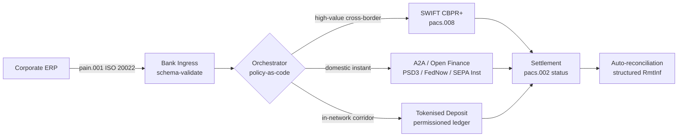

---

# Front Matter (YAML)

author: "contact@sebastienrousseau.com (Sebastien Rousseau)"
banner_alt: "Navio porta-contêineres em porto de águas profundas ao amanhecer — simbolizando a movimentação multi-trilho e transfronteiriça do valor corporativo via ISO 20022, open finance e redes de liquidação por depósitos tokenizados em 2026"
banner_height: "1597"
banner_width: "2584"
banner: "https://cloudcdn.pro/stocks/images/viktor-forgacs-KxVRDiFdTVo.webp"
cdn: "https://cloudcdn.pro"
charset: "UTF-8"
cname: "sebastienrousseau.com"
copyright: "© Copyright 2025 - 2026 - Sebastien Rousseau. All rights reserved."
date: "24 de junho de 2026"
description: "Como ISO 20022, A2A, open finance sob PSD3/FiDA e depósitos tokenizados estão remodelando a tesouraria corporativa transfronteiriça ao lado do SWIFT em 2026."
format-detection: "telephone=no"
hreflang: "pt-br"
icon: "https://cloudcdn.pro/clients/sebastienrousseau/v1/logos/sebastienrousseau.svg"
id: "https://sebastienrousseau.com/2026-06-24-cross-border-iso-20022-open-finance-tokenised-deposits-treasury-2026"
image_alt: "Retrato em preto e branco de Sebastien Rousseau"
image_height: "162"
image_width: "162"
image: "https://cloudcdn.pro/stocks/images/sebastien-rousseau.png"
keywords: "pagamentos transfronteiriços, ISO 20022, open finance, PSD3, FiDA, depósitos tokenizados, stablecoins, A2A, tesouraria, CIB, Nexi, Mastercard, multi-trilho, pacs.008, pain.001, SWIFT, FedNow, SEPA Instant, RTP, CBPR+"
language: "pt-BR"
last_reviewed: "2026-06-24"
layout: "report"
locale: "pt_BR"
logo_alt: "Logo de Sebastien Rousseau"
logo_height: "44"
logo_width: "44"
logo: "https://cloudcdn.pro/clients/sebastienrousseau/v1/logos/sebastienrousseau.svg"
menu: ""
measurementID: "G-169G4ET5HQ"
name: "Sebastien Rousseau"
permalink: "https://sebastienrousseau.com/2026-06-24-cross-border-iso-20022-open-finance-tokenised-deposits-treasury-2026"
rating: "general"
referrer: "no-referrer"
robots: "index, follow"
schema: "FAQPage, Article"
seo_title: "Transfronteiriço 2026: ISO 20022, Open Finance, Trilhos Tokenizados"
short_name: "sebastienrousseau"
subtitle: "A tesouraria corporativa transfronteiriça em 2026 funciona com mecânica multi-trilho — ISO 20022 como gramática comum, A2A e open finance como trilho voltado ao cliente, depósitos tokenizados como perna de liquidação atacadista, com o SWIFT ainda ancorando a cauda longa."
tags: "pagamentos transfronteiriços, ISO 20022, open finance, PSD3, FiDA, depósitos tokenizados, A2A, tesouraria, CIB, multi-trilho, pacs.008, pain.001, SWIFT, FedNow, SEPA Instant, RTP, CBPR+"
theme-color: "0, 83, 191"
title: "Transfronteiriço 2026: ISO 20022, Open Finance e Depósitos Tokenizados na Tesouraria Corporativa"
url: "https://sebastienrousseau.com/2026-06-24-cross-border-iso-20022-open-finance-tokenised-deposits-treasury-2026"
viewport: "width=device-width, initial-scale=1, shrink-to-fit=no"

# RSS - The RSS feed front matter (YAML).
atom_link: "https://sebastienrousseau.com/2026-06-24-cross-border-iso-20022-open-finance-tokenised-deposits-treasury-2026/rss.xml"
category: "Technology"
docs: https://validator.w3.org/feed/docs/rss2.html
generator: "Static Site Generator (SSG) (version 0.0.26)"
item_description: "Como ISO 20022, A2A, open finance sob PSD3/FiDA e depósitos tokenizados estão remodelando a tesouraria corporativa transfronteiriça ao lado do SWIFT em 2026."
item_guid: "https://sebastienrousseau.com/2026-06-24-cross-border-iso-20022-open-finance-tokenised-deposits-treasury-2026/rss.xml"
item_link: "https://sebastienrousseau.com/2026-06-24-cross-border-iso-20022-open-finance-tokenised-deposits-treasury-2026/rss.xml"
item_pub_date: "Wed, 24 Jun 2026 07:07:07 +0000"
item_title: "Transfronteiriço 2026: ISO 20022, Open Finance e Depósitos Tokenizados na Tesouraria Corporativa"
last_build_date: "Wed, 24 Jun 2026 06:06:06 +0000"
managing_editor: "contact@sebastienrousseau.com (Sebastien Rousseau)"
pub_date: "Wed, 24 Jun 2026 07:07:07 +0000"
ttl: "60"
type: "article"
webmaster: "contact@sebastienrousseau.com"

# Apple - The Apple front matter (YAML).
apple_mobile_web_app_orientations: "portrait"
apple_touch_icon_sizes: "192x192"
apple-mobile-web-app-capable: "yes"
apple-mobile-web-app-status-bar-inset: "black"
apple-mobile-web-app-status-bar-style: "black-translucent"
apple-mobile-web-app-title: "Transfronteiriço 2026: ISO 20022, Open Finance, Trilhos Tokenizados"
apple-touch-fullscreen: "yes"

# MS Application - The MS Application front matter (YAML).

msapplication-navbutton-color: "0, 83, 191"

# Twitter Card - The Twitter Card front matter (YAML).

twitter_card: "summary_large_image"
twitter_creator: "@wwdseb"
twitter_description: "Como ISO 20022, A2A, open finance sob PSD3/FiDA e depósitos tokenizados estão remodelando a tesouraria corporativa transfronteiriça ao lado do SWIFT em 2026."
twitter_image: "https://cloudcdn.pro/clients/sebastienrousseau/v1/logos/sebastienrousseau.svg"
twitter_image_alt: "Logo de Sebastien Rousseau"
twitter_site: "@wwdseb"
twitter_title: "Transfronteiriço 2026: ISO 20022, Open Finance, Trilhos Tokenizados"
twitter_url: "https://sebastienrousseau.com/2026-06-24-cross-border-iso-20022-open-finance-tokenised-deposits-treasury-2026"

excerpt: "A tesouraria corporativa transfronteiriça em 2026 é um problema de engenharia multi-trilho. ISO 20022 é a gramática comum, A2A e open finance sob PSD3/FiDA são o trilho voltado ao cliente, depósitos tokenizados conduzem a perna de liquidação atacadista, e o SWIFT ainda ancora a cauda longa. O trabalho interessante está na camada de orquestração, não no modelo."

# Humans.txt - The Humans.txt front matter (YAML).
author_website: "https://sebastienrousseau.com"
author_twitter: "@wwdseb"
author_location: "London, UK"
thanks: "Obrigado pela leitura!"
site_last_updated: "2026-06-24"
site_standards: "HTML5, CSS3, RSS, Atom, JSON, XML, YAML, Markdown, TOML"
site_components: "Kaishi, Kaishi Builder, Kaishi CLI, Kaishi Templates, Kaishi Themes"
site_software: "Static Site Generator, Rust"

---

# Transfronteiriço 2026: ISO 20022, Open Finance e Depósitos Tokenizados na Tesouraria Corporativa

<!-- lead-start -->
<aside class="post-lead" aria-label="Resumo do artigo">

<strong>TL;DR.</strong> A tesouraria corporativa transfronteiriça em 2026 opera quatro trilhos em paralelo — SWIFT CBPR+, A2A instantâneo sob PSD3/FiDA, depósitos tokenizados e trilhos de stablecoins — costurados pelo ISO 20022 como gramática comum. O trabalho das equipes de CIB e tesouraria corporativa é orquestração, não seleção de trilho.

<strong>Pontos-chave</strong>

<ul class="post-lead-takeaways">
  <li><strong>Multi-trilho é o padrão.</strong> Nenhum trilho isolado cobre todos os corredores, todos os tamanhos de ticket, todos os horários de corte. A tesouraria escolhe o trilho por pagamento, não por banco.</li>
  <li><strong>ISO 20022 é a língua franca.</strong> pacs.008, pacs.009 e pain.001 agora transportam dados de remessa por trilhos RTGS, instantâneos, A2A e de depósitos tokenizados — tornando as decisões de roteamento orientadas por dados em vez de presas ao trilho.</li>
  <li><strong>Open finance amplia o perímetro.</strong> PSD3 e FiDA estendem o modelo de open banking para previdência, seguros e dados de tesouraria; Nexi e Mastercard estão construindo a camada de orquestração que as corporações consomem.</li>
  <li><strong>Depósitos tokenizados são a perna atacadista.</strong> Depósitos tokenizados emitidos por bancos e trilhos integrados de stablecoins ficam sob o trilho instantâneo voltado ao cliente e liquidam a perna atacadista em quase T+0.</li>
</ul>

<strong>Leitura relacionada:</strong> <a href="https://sebastienrousseau.com/2026-06-07-autonomous-treasury-index-programmable-liquidity-tokenised-deposits-2026">O Índice de Tesouraria Autônoma 2026: Liquidez Programável e Depósitos Tokenizados</a>, <a href="https://sebastienrousseau.com/2026-06-15-pacs008-automation-iso-20022-interbank-payments-2026">Automação pacs.008: Pagamentos Interbancários ISO 20022 em 2026</a>.

</aside>
<!-- lead-end -->

Uma corporação industrial europeia paga a um fornecedor brasileiro EUR 4,2 milhões numa quarta-feira de manhã. A estação de trabalho de tesouraria não escolhe um banco. Ela escolhe um trilho — uma sequência de trilhos. A instrução voltada ao cliente chega como uma mensagem pain.001 A2A roteada por um provedor de open finance sob PSD3. O banco a transporta por duas jurisdições correspondentes via depósitos tokenizados dentro de uma rede privada de CIB. A cauda longa — uma fatura de USD 80.000 para acerto com um subfornecedor sem relacionamento de depósito tokenizado — ainda viaja pelo SWIFT CBPR+ como uma pacs.008. O cliente vê um pagamento. A arquitetura vê quatro trilhos. ISO 20022 é a única razão de tudo isso se sustentar.

Este é o modelo operacional que a Mastercard descreve quando fala sobre [a evolução do open banking para o open finance](https://www.mastercard.com/us/en/news-and-trends/Insights/2026/open-banking-to-open-finance-the-evolution-of-financial-data.html "Mastercard: do open banking ao open finance, a evolução dos dados financeiros") — dados e pagamentos fundidos numa única camada de orquestração, com o trilho escolhido pelo sistema, não pelo cliente. A questão interessante para os tecnólogos bancários sêniores não é qual trilho vence. É como a camada de orquestração é engenheirada, governada e reconciliada.

## 01. De cartões para A2A — a virada do open finance

Os trilhos de cartões não estão desaparecendo. Estão sendo reposicionados.

Ao longo de 2025 e entrando em 2026, [PSD3 e a regulamentação Financial Data Access (FiDA)](https://www.consultancy.uk/news/42202/orchestrating-open-banking-for-platform-growth-2026-outlook "Consultancy.uk: orquestrando open banking para crescimento de plataformas, perspectivas 2026") estenderam a obrigação de open banking para além das contas de pagamento, alcançando previdência, hipotecas, poupança, seguros e dados de tesouraria corporativa. A implicação para a tesouraria corporativa é direta: um relationship manager de CIB agora pode consumir o quadro completo de liquidez de uma corporação em vários bancos por meio de um único contrato de API, sob instrução da corporação.

Dois operadores estão construindo de forma visível a camada de orquestração que as corporações consumirão. A Nexi estendeu sua presença de adquirência para iniciação A2A em corredores SEPA Instant e RTGS pan-europeu, nativos em ISO 20022 de ponta a ponta. A plataforma de open finance da Mastercard — ancorada na aquisição da Aiia e da Finicity — fornece a camada de agregação de dados e consentimento por baixo, com a iniciação de pagamentos emergindo no mesmo conjunto de APIs que antes atendia autorizações de cartão.

A virada importa por três razões:

1. **Economia unitária.** O A2A iniciado sob PSD3 retira a interchange do pagamento. Para fluxos B2B de alto ticket, a economia é material; para fluxos de consumo de baixo ticket, a pilha de custos do comerciante desaba.
2. **Qualidade de dados.** O A2A sob ISO 20022 transporta dados de remessa estruturados que cartões nunca conseguiram. Taxas de reconciliação automática acima de 95% são agora o mínimo exigido.
3. **Modelo de risco.** O A2A é uma transferência de crédito, não uma autorização de cartão. A superfície de fraude, o modelo de chargeback e o modelo de disputa são todos diferentes. As equipes de tesouraria corporativa precisam entender que a camada de proteção ao cliente está sendo reconstruída, não herdada.

O CIB que vende uma proposta multi-trilho em 2026 vende orquestração — não acesso. Acesso agora é regulado.

## 02. ISO 20022 como língua franca entre trilhos

A razão pela qual o multi-trilho é viável é que o formato de mensagem agora é consistente entre os trilhos.

O Comitê de Pagamentos e Infraestruturas de Mercado do BIS (CPMI) deixou clara a argumentação arquitetônica em seus [requisitos de harmonização ISO 20022 para aprimorar pagamentos transfronteiriços](https://www.bis.org/cpmi/publ/d230.pdf "BIS CPMI: requisitos de harmonização ISO 20022 para aprimorar pagamentos transfronteiriços"). O corte de novembro de 2025 para o CBPR+ encerrou a era MT103 / MT202 para mensageria interbancária transfronteiriça. A partir daí, todo trilho importante — SWIFT, FedNow, SEPA Instant, RTP e os principais sistemas de pagamento instantâneo na Ásia e na América Latina — fala a mesma gramática pacs.008 / pacs.009 / pain.001.

A consequência prática para a tesouraria corporativa:

- **O roteamento é orientado por dados.** A estação de tesouraria pode ler uma pain.001 uma vez e decidir o trilho por pagamento com base em corredor, tamanho do ticket, horário de corte e relacionamento de contraparte — sem remapear a mensagem.
- **Os dados de remessa sobrevivem ao trecho.** Campos de remessa estruturados (`<RmtInf><Strd>`) atravessam pernas correspondentes sem truncamento. As taxas de reconciliação automática sobem porque o dado deixa de se perder na fronteira do trilho.
- **A triagem de sanções torna-se auditável.** Campos estruturados `<Dbtr>` / `<Cdtr>` / `<DbtrAgt>` / `<CdtrAgt>` com referências LEI substituem a triagem por nome em texto livre. As taxas de acerto caem. As filas de investigação encolhem.

O diagrama abaixo acompanha uma única pain.001 pelo ingresso do banco, até o orquestrador policy-as-code, e até o trilho que o corredor e o tamanho do ticket exigirem — uma mensagem, vários trilhos, sem remapeamento.

O custo dessa consistência é disciplina de engenharia. ISO 20022 é permissivo. Dois bancos podem estar plenamente em conformidade com o CBPR+ e ainda assim produzir mensagens pacs.008 que diferem no uso de campos, no conjunto de caracteres e na estrutura de dados de remessa. O CIB que vence em transfronteiriço em 2026 impõe um perfil de mensagem mais estrito do que o padrão exige — e rejeita no parse, não na liquidação.

## 03. Depósitos tokenizados e trilhos estáveis

A perna de liquidação atacadista é onde a história dos trilhos fica interessante.

O cenário de 2026, bem capturado na [análise da Trade Treasury Payments sobre automação, trilhos de contingência, ISO 20022 e stablecoins](https://tradetreasurypayments.com/articles/automation-contingency-rails-iso-20022-and-stablecoins-the-2026-trends-reshaping-corporate-finance-and-b2b-payments "Trade Treasury Payments: automação, trilhos de contingência, ISO 20022 e stablecoins, as tendências de 2026 que remodelam as finanças corporativas e os pagamentos B2B"), divide a camada de liquidação atacadista em dois modelos estruturalmente distintos.

**Depósitos tokenizados emitidos por bancos.** Um banco comercial emite um passivo tokenizado em um ledger autorizado — JPM Coin, o token de depósito do HSBC vinculado ao Orion, os equivalentes dos principais CIBs europeus. O token é um direito direto sobre o banco emissor. A liquidação é quase T+0 dentro da rede. A conformidade é responsabilidade do banco emissor. O trilho é totalmente regulado, totalmente rastreável e restrito aos participantes que o emissor onboardou.

**Trilhos integrados de stablecoins.** Uma stablecoin regulada — totalmente lastreada, auditada e operando sob a MiCA ou o regime regional equivalente — liquida um corredor onde os depósitos tokenizados emitidos por bancos ainda não chegam. O token é um direito sobre a reserva, não sobre um balanço bancário. A conformidade é compartilhada entre emissor, on-ramp e off-ramp.

Os dois modelos não competem. Eles se empilham. Um produto transfronteiriço de CIB em 2026 normalmente usa depósitos tokenizados emitidos por bancos para a perna dentro da rede e uma stablecoin regulada para o corredor onde o trilho dentro da rede termina. A corporação vê um pagamento ISO 20022. A história de liquidação por baixo é multi-token.

A pergunta de nível de conselho é a mesma que os comitês de risco operacional vêm fazendo desde os primeiros pilotos de liquidez programável: quem carrega a exposição de crédito sobre o token e por quanto tempo? Os depósitos tokenizados dão uma resposta limpa — o banco emissor, até o burn. Os trilhos integrados de stablecoins dão uma resposta mais matizada — a reserva, sujeita ao ciclo de auditoria e à garantia de resgate. Uma equipe de tesouraria que não documenta a resposta por trilho e por corredor carrega risco de crédito não mensurado em seu balanço.

## 04. A pilha de tesouraria autônoma

Acima da camada de trilhos fica a camada de orquestração. Acima da camada de orquestração fica a camada de agentes.

Detalhei a arquitetura em [O Índice de Tesouraria Autônoma 2026: Liquidez Programável e Depósitos Tokenizados](https://sebastienrousseau.com/2026-06-07-autonomous-treasury-index-programmable-liquidity-tokenised-deposits-2026 "Sebastien Rousseau: O Índice de Tesouraria Autônoma 2026"). Em resumo: a tesouraria agêntica em 2026 é a camada de orquestração, expressa como política em código, com agentes delimitados executando dentro dela.

A pilha é:

1. **Camada de trilhos.** SWIFT CBPR+, A2A instantâneo, depósitos tokenizados, stablecoins reguladas. Cada trilho tem perfil publicado, tabela de horários de corte, curva de custo e modelo de finalidade de liquidação.
2. **Camada de orquestração.** ISO 20022 na entrada, ISO 20022 na saída. Decisão de trilho por pagamento baseada em corredor, ticket, horário de corte, relacionamento de contraparte e política. A política é versionada, assinada e auditável.
3. **Camada de agentes.** Agentes de tesouraria delimitados executam a política de orquestração com fronteiras de chamada de ferramenta, logs de auditoria e interruptores de emergência. O agente não escolhe o trilho. A política escolhe o trilho. O agente executa a política.
4. **Camada de reconciliação.** Mensagens ISO 20022 pacs.008 / pacs.002 / camt.054 reconciliam contra a instrução pain.001 original, com dados de remessa estruturados fechando o ciclo sem intervenção manual.

O CIB que vende essa pilha em 2026 vende quatro coisas ao mesmo tempo — e as precifica separadamente. A corporação que compra está comprando opcionalidade entre trilhos, com um padrão de mensagem, uma camada de política, um feed de reconciliação. Essa é a virada arquitetônica. O resto é detalhe de implementação.

## Conclusão

A tesouraria corporativa transfronteiriça em 2026 é um problema de engenharia multi-trilho. ISO 20022 é a gramática que torna o multi-trilho tratável. PSD3 e FiDA ampliam o perímetro de dados e forçam o open finance para dentro do fluxo de tesouraria corporativa. Depósitos tokenizados e stablecoins reguladas conduzem a perna de liquidação atacadista. O SWIFT ainda ancora a cauda longa.

O CIB que vence é o que constrói a camada de orquestração — não o que escolhe um único trilho e aposta a franquia nele. A equipe de tesouraria corporativa que vence é a que documenta a exposição de crédito por trilho e por corredor, impõe um perfil ISO 20022 mais estrito do que o regulador exige e trata a decisão de trilho como política, não como julgamento caso a caso.

O trabalho interessante está na camada de orquestração. Construa com cuidado.

<!-- enrich-start -->
<aside class="author-card" aria-label="Sobre o autor"><strong class="author-card-name"><a href="/about/index.html">Sebastien Rousseau</a></strong>Tecnólogo bancário sênior, escreve sobre AI aplicada, migração para ISO 20022, criptografia pós-quântica para serviços financeiros e a transformação estrutural dos pagamentos atacadistas.Mais de 20 anos no HSBC Commercial &amp; Investment Bank, PayPal, Barclays, Shazam, AKQA, Virgin Group. <a href="/about/index.html">Perfil completo</a> &middot; <a href="https://www.linkedin.com/in/sebastienrousseau/" rel="external noopener">LinkedIn</a> &middot; <a href="https://github.com/sebastienrousseau" rel="external noopener">GitHub</a></aside>

Última revisão em <time datetime="2026-06-24">2026-06-24</time>.

<!-- enrich-end -->
