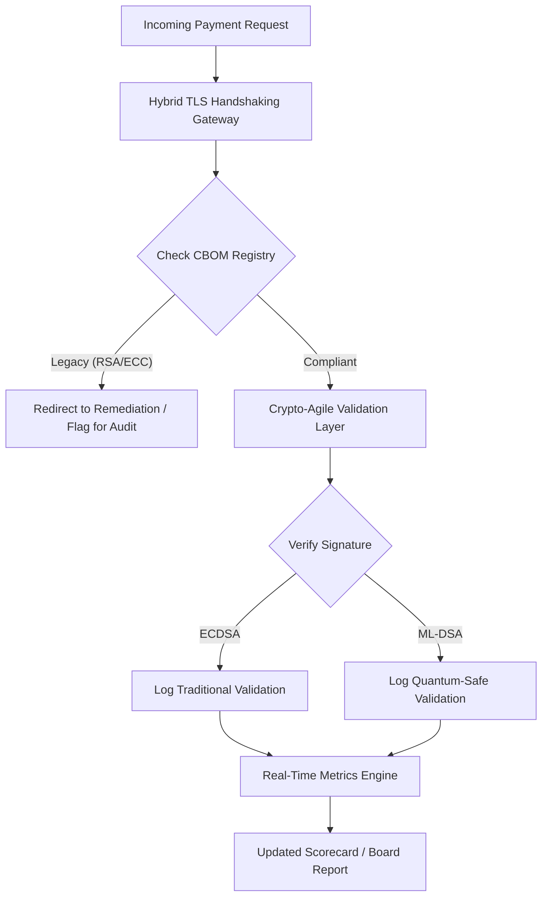

---
# Front Matter (YAML)
author: "contact@sebastienrousseau.com (Sebastien Rousseau)"
banner_alt: "Абстрактный цифровой стол правления, растворяющийся в квантовых решётках — визуализация стратегического управления, необходимого для миграции основной банковской инфраструктуры на FIPS 203 и 204"
banner_height: "1597"
banner_width: "2584"
banner: "https://cloudcdn.pro/stocks/images/quantum-governance-AbC123XyZ.webp"
cdn: "https://cloudcdn.pro"
charset: "UTF-8"
cname: "sebastienrousseau.com"
copyright: "© Copyright 2025 - 2026 - Sebastien Rousseau. All rights reserved."
date: "29 июня 2026"
description: "Постквантовый scorecard 2026 года предоставляет советам директоров и высшему руководству фидуциарную метрическую систему для отслеживания Cryptographic Bill of Materials (CBOM), HNDL-экспозиции и скорости миграции на NIST FIPS 203/204 в инфраструктуре банков Tier-1."
format-detection: "telephone=no"
hreflang: "ru"
icon: "https://cloudcdn.pro/clients/sebastienrousseau/v1/logos/sebastienrousseau.svg"
id: "https://sebastienrousseau.com/2026-06-29-post-quantum-security-scorecard-board-level-fiduciary-agility-2026"
image_alt: "Чёрно-белый портрет Себастьяна Руссо"
image_height: "162"
image_width: "162"
image: "https://cloudcdn.pro/stocks/images/sebastienrousseau.webp"
keywords: "постквантовая криптография, PQC scorecard, NIST FIPS 203, NIST FIPS 204, CBOM, HNDL, банковское управление, крипто-гибкость, KyberLib, соответствие DORA, SM&CR, квантовая устойчивость"
language: "ru-RU"
last_reviewed: "2026-06-29"
layout: "report"
locale: "ru_RU"
logo_alt: "Логотип Себастьяна Руссо"
logo_height: "44"
logo_width: "44"
logo: "https://cloudcdn.pro/clients/sebastienrousseau/v1/logos/sebastienrousseau.svg"
measurementID: "G-169G4ET5HQ"
name: "Sebastien Rousseau"
permalink: "https://sebastienrousseau.com/2026-06-29-post-quantum-security-scorecard-board-level-fiduciary-agility-2026"
rating: "general"
referrer: "no-referrer"
robots: "index, follow"
schema: "FAQPage, Article"
seo_title: "Постквантовый scorecard 2026: рамка для совета директоров"
short_name: "sebastienrousseau"
subtitle: "Как советы директоров должны измерять и управлять миграцией на NIST FIPS 203 и 204, отслеживая полноту CBOM и снижая Harvest-Now-Decrypt-Later (HNDL)-экспозицию в корпоративном казначействе."
tags: "постквантовая, криптография, банкинг, управление, DORA, FIPS-203, FIPS-204, CBOM, HNDL, KyberLib, SM&CR"
theme-color: "0, 83, 191"
title: "Постквантовый scorecard 2026: метрическая рамка для советов директоров"
url: "https://sebastienrousseau.com/2026-06-29-post-quantum-security-scorecard-board-level-fiduciary-agility-2026"
viewport: "width=device-width, initial-scale=1, shrink-to-fit=no"

# RSS
atom_link: "https://sebastienrousseau.com/2026-06-29-post-quantum-security-scorecard-board-level-fiduciary-agility-2026/rss.xml"
category: "Technology"
generator: "Static Site Generator (SSG) (version 0.0.40)"
item_description: "Постквантовый scorecard 2026 года предоставляет советам директоров фидуциарную метрическую систему для отслеживания CBOM, HNDL-экспозиции и скорости миграции на NIST."
item_pub_date: "Mon, 29 Jun 2026 07:07:07 +0000"
item_title: "Постквантовый scorecard 2026: метрическая рамка для советов директоров"
pub_date: "Mon, 29 Jun 2026 07:07:07 +0000"
type: "article"

# Twitter Card
twitter_card: "summary_large_image"
twitter_creator: "@wwdseb"
twitter_description: "Постквантовый scorecard 2026: как советы директоров банков измеряют криптографическую гибкость, полноту CBOM и HNDL-экспозицию."
twitter_image: "https://cloudcdn.pro/clients/sebastienrousseau/v1/logos/sebastienrousseau.svg"
twitter_title: "Постквантовый scorecard 2026 для советов директоров банков"
twitter_url: "https://sebastienrousseau.com/2026-06-29-post-quantum-security-scorecard-board-level-fiduciary-agility-2026"

excerpt: "По состоянию на июнь 2026 года постквантовая криптография (PQC) перешла из категории экспериментальной технической задачи в категорию первичного фидуциарного обязательства. Советы директоров обязаны контролировать систематическую миграцию устаревшего шифрования..."

# Template-completeness keys (parity with hsh/noyalib shape)
apple_mobile_web_app_orientations: "portrait"
apple_touch_icon_sizes: "192x192"
apple-mobile-web-app-capable: "yes"
apple-mobile-web-app-status-bar-inset: "black"
apple-mobile-web-app-status-bar-style: "black-translucent"
apple-touch-fullscreen: "yes"
apple-mobile-web-app-title: "PQC Scorecard 2026"
author_location: "London, United Kingdom"
author_twitter: "@wwdseb"
author_website: "https://sebastienrousseau.com"
docs: https://validator.w3.org/feed/docs/rss2.html
item_guid: "https://sebastienrousseau.com/2026-06-29-post-quantum-security-scorecard-board-level-fiduciary-agility-2026/rss.xml"
item_link: "https://sebastienrousseau.com/2026-06-29-post-quantum-security-scorecard-board-level-fiduciary-agility-2026/rss.xml"
last_build_date: "Mon, 29 Jun 2026 06:06:06 +0000"
managing_editor: "contact@sebastienrousseau.com (Sebastien Rousseau)"
menu: "active"
msapplication-navbutton-color: "0, 83, 191"
site_components: "Kaishi, Kaishi Builder, Kaishi CLI, Kaishi Templates, Kaishi Themes"
site_last_updated: "2023-07-05"
site_software: "Static Site Generator, Rust"
site_standards: "HTML5, CSS3, RSS, Atom, JSON, XML, YAML, Markdown, TOML"
thanks: "Спасибо за прочтение!"
ttl: "60"
twitter_image_alt: "Чёрно-белый портрет Себастьяна Руссо"
twitter_site: "@wwdseb"
webmaster: "contact@sebastienrousseau.com"
---

# Постквантовый scorecard 2026: метрическая рамка для советов директоров по фидуциарной криптографической гибкости

<aside class="post-lead" aria-label="Краткое содержание статьи">

<strong>TL;DR.</strong> По состоянию на июнь 2026 года постквантовая криптография (PQC) перешла из категории экспериментальной технической задачи в категорию первичного фидуциарного обязательства. Советы директоров обязаны контролировать систематическую миграцию устаревшего шифрования на стандарты NIST FIPS 203 и 204, чтобы снизить системные финансовые и операционные риски по DORA.

<strong>Ключевые выводы</strong>

<ul class="post-lead-takeaways">
  <li><strong>Координация G20 и жёсткие сроки.</strong> Международные регуляторы установили конец 2020-х как жёсткий дедлайн для перехода на квантово-безопасные стандарты, требуя от учреждений демонстрировать измеримый прогресс миграции.</li>
  <li><strong>Cryptographic Bill of Materials (CBOM).</strong> По аналогии с программным BOM, CBOM — это автоматизированный, постоянно обновляемый инвентарь всех криптографических активов, необходимый для обеспечения видимости по всей цепочке поставок.</li>
  <li><strong>Harvest-Now-Decrypt-Later (HNDL)-экспозиция.</strong> Противники уже сейчас перехватывают и архивируют зашифрованные данные оптовых платежей с высокой стоимостью; снижение этого риска требует немедленного развёртывания гибридных архитектур PQC.</li>
  <li><strong>Фидуциарное управление через крипто-гибкость.</strong> Крипто-гибкость — это измеримая управленческая метрика. Способность заменить криптографические примитивы без перепроектирования основных систем (с помощью библиотек вроде KyberLib) сегодня является ответственностью совета директоров по SM&CR.</li>
</ul>

<strong>Связанное чтение:</strong> <a href="https://sebastienrousseau.com/2026-06-12-kyberlib-post-quantum-banking-migration-standards-code-2026">KyberLib и постквантовая миграция банков в 2026 году</a>, <a href="https://sebastienrousseau.com/2023-11-19-crystals-kyber-the-safeguarding-algorithm-in-a-quantum-age/index.html">CRYSTALS-Kyber: защитный алгоритм в квантовую эпоху</a>.

</aside>
Постквантовая безопасность больше не исследовательский проект. «Надзорный таймер» отсчитывает время до дедлайнов конца 2020-х. Финализация [NIST FIPS 203 (ML-KEM)](https://csrc.nist.gov/pubs/fips/203/final "NIST FIPS 203 — финальный стандарт ML-KEM") и [NIST FIPS 204 (ML-DSA)](https://csrc.nist.gov/pubs/fips/204/final "NIST FIPS 204 — финальный стандарт ML-DSA") закрепила стандарты инкапсуляции ключей и цифровых подписей.

Регуляторы теперь ожидают от банков Tier-1 выхода за рамки пилотных программ. В 2026 году фокус сместился на индустриализацию этих стандартов. Отсутствие чёткого плана миграции влечёт серьёзные регуляторные санкции по [Digital Operational Resilience Act (DORA)](https://eur-lex.europa.eu/eli/reg/2022/2554/oj "Регламент ЕС 2022/2554 о цифровой операционной устойчивости") и потенциальную персональную ответственность для директоров, игнорирующих предсказуемую угрозу квантового дешифрования.

## 01. Квантовый scorecard для совета директоров

Следующие метрики дают стандартизированную рамку для оценки квантовой готовности и криптографического здоровья по всему периметру Commercial and Investment Banking (CIB).

### Таблица 1: метрики PQC-scorecard и допуски

| Метрика | Математическая формула | Допуски, утверждённые советом | Риск при выходе за допуски |
| ---- | ---- | ---- | ---- |
| **Inventory Completeness Percentage (ICP)** | (Идентифицированные криптоактивы / Общее оценочное количество активов) × 100 | > 98% | Теневое шифрование и слепые зоны в путях клиринговых данных высокой стоимости. |
| **HNDL Exposure Rate (HER)** | (Долгоживущие данные на устаревшей криптографии / Общий объём долгоживущих данных) × 100 | < 5% | Необратимая компрометация коммерческих тайн, реестров суверенного долга и записей оптовых платежей. |
| **NIST Migration Progress Rate (MPR)** | (Системы на FIPS 203/204 / Общее число критических систем) × 100 | > 60% (к концу 2026) | Регуляторное несоответствие и исключение из круга контрагентов G20. |
| **Crypto-Agility Readiness Index (CARI)** | (Приложения с абстрагированным криптослоем / Общее число основных приложений) × 100 | > 85% | Серьёзный технический долг и невозможность реагировать на будущие отмены алгоритмов. |

## 02. Cryptographic Bill of Materials (CBOM)

Базовое значение метрики ICP формируется на **этапе обнаружения CBOM**. Это автоматизированный процесс, идентифицирующий каждую криптографическую конечную точку в периметре предприятия.

- **Обнаружение конечных точек.** Сканирование внутренних и облачных сетей на активные TLS-сессии для выявления использования устаревших RSA или ECC.
- **Инвентарь ключей.** Сопоставление пар публичный/приватный ключ с их владельцами и точными датами истечения.
- **Картирование зависимостей.** Выявление сторонних библиотек и API, опирающихся на устаревшие алгоритмы.

Этот этап создаёт единый источник истины, позволяя CISO отчитываться о криптографическом здоровье с той же гранулярностью, что и о финансовых показателях.

## 03. Устранение HNDL-экспозиции в оптовых платежах

Противники активно атакуют оптовые платежи и долгоживущие корпоративные базы данных. «Harvest-Now-Decrypt-Later» (HNDL)-атаки — это перехват и архивация сегодняшнего зашифрованного трафика.

Даже если криптографически релевантного квантового компьютера (CRQC) сегодня не существует, перехваченные сейчас данные станут уязвимыми в будущем. Снижение этого риска требует приоритетной миграции долгоживущих данных (например, идентификационных записей, 30-летних облигационных контрактов и юридических архивов), что напрямую снижает метрику HER. Обновление платёжных каналов до гибридного шифрования PQC + традиционные алгоритмы (ML-KEM совместно с X25519) даёт немедленную защиту от архивных угроз.

## 04. Операционализация крипто-гибкости через продуманные интерфейсы

Крипто-гибкость реализуется через инженерные абстракции. Современные библиотеки вроде [KyberLib](https://sebastienrousseau.com/2026-06-12-kyberlib-post-quantum-banking-migration-standards-code-2026 "KyberLib — постквантовая миграция банков в 2026 году") показывают, как разработчики могут внедрять квантово-безопасные модули без переписывания всего стека приложения.

- **Абстрагированные обёртки.** Приложения вызывают универсальные функции `encrypt()` или `sign()`, а не алгоритм-специфичные процедуры.
- **Замена в рантайме.** Базовый модуль можно переключить с ECDSA на ML-DSA через изменение конфигурации, а не через сложные выкатки кода.

Эта архитектура обеспечивает: если конкретный PQC-алгоритм будет скомпрометирован в будущем, организация переключится за часы, а не за годы.

## 05. Рабочий процесс валидации квантово-безопасного входящего трафика

Следующая диаграмма иллюстрирует жизненный цикл данных, входящих в защищённый периметр в квантово-гибкой банковской среде.

## Заключение

Криптографический периметр банка Tier-1 — больше не зона ответственности CISO. Это фидуциарная инфраструктура. NIST FIPS 203 и 204 задают алгоритмы; статья 5 DORA задаёт периметр ответственности; SM&CR закрепляет её за поимённо названным senior manager. Scorecard выше — Inventory Completeness, HNDL Exposure, Migration Progress, Crypto-Agility — даёт совету директоров четыре цифры, необходимые для управления этим периметром без необходимости читать криптографический код.

Главная цифра — HNDL Exposure. Каждая запись, зашифрованная устаревшими алгоритмами и лежащая сегодня в архиве оптовых платежей, станет читаемой в день поставки первого криптографически релевантного квантового компьютера. Обратный отсчёт идёт молча и асимметрично: защитники могут действовать только на тех данных, что у них есть, а противники — на данных, которые они уже эксфильтровали годы назад. 30-летний корпоративный облигационный контракт, зашифрованный RSA-2048 в 2024 году, теряет гарантию конфиденциальности в день запуска CRQC.

[KyberLib](https://sebastienrousseau.com/2026-06-12-kyberlib-post-quantum-banking-migration-standards-code-2026 "KyberLib — постквантовая миграция банков в 2026 году") и аналогичные библиотеки превращают это из многолетнего переписывания платформы в изменение конфигурации. Задача совета директоров — не писать код. Задача совета — потребовать, чтобы Crypto-Agility Readiness Index — доля основных приложений за абстрагированным криптографическим интерфейсом — прошёл отметку 85 % за двенадцать месяцев, и читать ежеквартальный scorecard.

<aside class="author-card" aria-label="Об авторе"><strong class="author-card-name"><a href="/about/index.html">Sebastien Rousseau</a></strong>Старший банковский технолог, пишущий о прикладном ИИ, миграции на ISO 20022, постквантовой криптографии для финансовых сервисов и структурной трансформации оптовых платежей.20+ лет в HSBC Commercial & Investment Bank, PayPal, Barclays, Shazam. <a href="https://www.linkedin.com/in/sebastienrousseau/" rel="external noopener">LinkedIn</a> &middot; <a href="https://github.com/sebastienrousseau" rel="external noopener">GitHub</a></aside>

Последняя проверка <time datetime="2026-06-29">2026-06-29</time>.

