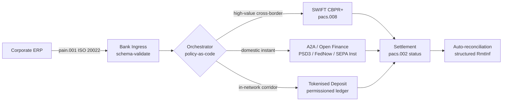

---

# Front Matter (YAML)

author: "contact@sebastienrousseau.com (Sebastien Rousseau)"
banner_alt: "Şafak vaktinde derin sulu bir limanda konteyner gemisi — 2026'da ISO 20022, açık finans ve tokenleştirilmiş mevduat takas ağları arasında kurumsal değerin çok raylı, sınır ötesi hareketini simgeliyor"
banner_height: "1597"
banner_width: "2584"
banner: "https://cloudcdn.pro/stocks/images/viktor-forgacs-KxVRDiFdTVo.webp"
cdn: "https://cloudcdn.pro"
charset: "UTF-8"
cname: "sebastienrousseau.com"
copyright: "© Copyright 2025 - 2026 - Sebastien Rousseau. All rights reserved."
date: "24 Haziran 2026"
description: "ISO 20022, A2A, PSD3/FiDA kapsamında açık finans ve tokenleştirilmiş mevduatların 2026'da SWIFT'in yanında sınır ötesi kurumsal hazineyi nasıl yeniden şekillendirdiği."
format-detection: "telephone=no"
hreflang: "tr"
icon: "https://cloudcdn.pro/clients/sebastienrousseau/v1/logos/sebastienrousseau.svg"
id: "https://sebastienrousseau.com/2026-06-24-cross-border-iso-20022-open-finance-tokenised-deposits-treasury-2026"
image_alt: "Sebastien Rousseau'nun siyah beyaz portresi"
image_height: "162"
image_width: "162"
image: "https://cloudcdn.pro/stocks/images/sebastien-rousseau.png"
keywords: "sınır ötesi ödemeler, ISO 20022, açık finans, PSD3, FiDA, tokenleştirilmiş mevduatlar, stabilcoinler, A2A, hazine, CIB, Nexi, Mastercard, çok raylı, pacs.008, pain.001, SWIFT, FedNow, SEPA Instant, RTP, CBPR+"
language: "tr-TR"
last_reviewed: "2026-06-24"
layout: "report"
locale: "tr_TR"
logo_alt: "Sebastien Rousseau için logo"
logo_height: "44"
logo_width: "44"
logo: "https://cloudcdn.pro/clients/sebastienrousseau/v1/logos/sebastienrousseau.svg"
menu: ""
measurementID: "G-169G4ET5HQ"
name: "Sebastien Rousseau"
permalink: "https://sebastienrousseau.com/2026-06-24-cross-border-iso-20022-open-finance-tokenised-deposits-treasury-2026"
rating: "general"
referrer: "no-referrer"
robots: "index, follow"
schema: "FAQPage, Article"
seo_title: "Sınır Ötesi 2026: ISO 20022, Açık Finans, Tokenleştirilmiş Raylar"
short_name: "sebastienrousseau"
subtitle: "2026'da sınır ötesi kurumsal hazine çok raylı bir mekanik üzerinde çalışıyor — ortak gramer olarak ISO 20022, müşteriye dönük ray olarak A2A ve açık finans, toptan takas ayağı olarak tokenleştirilmiş mevduatlar; SWIFT ise uzun kuyruğu hâlâ sabitliyor."
tags: "sınır ötesi ödemeler, ISO 20022, açık finans, PSD3, FiDA, tokenleştirilmiş mevduatlar, A2A, hazine, CIB, çok raylı, pacs.008, pain.001, SWIFT, FedNow, SEPA Instant, RTP, CBPR+"
theme-color: "0, 83, 191"
title: "Sınır Ötesi 2026: Kurumsal Hazinede ISO 20022, Açık Finans ve Tokenleştirilmiş Mevduatlar"
url: "https://sebastienrousseau.com/2026-06-24-cross-border-iso-20022-open-finance-tokenised-deposits-treasury-2026"
viewport: "width=device-width, initial-scale=1, shrink-to-fit=no"

# RSS - The RSS feed front matter (YAML).
atom_link: "https://sebastienrousseau.com/2026-06-24-cross-border-iso-20022-open-finance-tokenised-deposits-treasury-2026/rss.xml"
category: "Technology"
docs: https://validator.w3.org/feed/docs/rss2.html
generator: "Static Site Generator (SSG) (version 0.0.26)"
item_description: "ISO 20022, A2A, PSD3/FiDA kapsamında açık finans ve tokenleştirilmiş mevduatların 2026'da SWIFT'in yanında sınır ötesi kurumsal hazineyi nasıl yeniden şekillendirdiği."
item_guid: "https://sebastienrousseau.com/2026-06-24-cross-border-iso-20022-open-finance-tokenised-deposits-treasury-2026/rss.xml"
item_link: "https://sebastienrousseau.com/2026-06-24-cross-border-iso-20022-open-finance-tokenised-deposits-treasury-2026/rss.xml"
item_pub_date: "Wed, 24 Jun 2026 07:07:07 +0000"
item_title: "Sınır Ötesi 2026: Kurumsal Hazinede ISO 20022, Açık Finans ve Tokenleştirilmiş Mevduatlar"
last_build_date: "Wed, 24 Jun 2026 06:06:06 +0000"
managing_editor: "contact@sebastienrousseau.com (Sebastien Rousseau)"
pub_date: "Wed, 24 Jun 2026 07:07:07 +0000"
ttl: "60"
type: "article"
webmaster: "contact@sebastienrousseau.com"

# Apple - The Apple front matter (YAML).
apple_mobile_web_app_orientations: "portrait"
apple_touch_icon_sizes: "192x192"
apple-mobile-web-app-capable: "yes"
apple-mobile-web-app-status-bar-inset: "black"
apple-mobile-web-app-status-bar-style: "black-translucent"
apple-mobile-web-app-title: "Sınır Ötesi 2026: ISO 20022, Açık Finans, Tokenleştirilmiş Raylar"
apple-touch-fullscreen: "yes"

# MS Application - The MS Application front matter (YAML).

msapplication-navbutton-color: "0, 83, 191"

# Twitter Card - The Twitter Card front matter (YAML).

twitter_card: "summary_large_image"
twitter_creator: "@wwdseb"
twitter_description: "ISO 20022, A2A, PSD3/FiDA kapsamında açık finans ve tokenleştirilmiş mevduatların 2026'da SWIFT'in yanında sınır ötesi kurumsal hazineyi nasıl yeniden şekillendirdiği."
twitter_image: "https://cloudcdn.pro/clients/sebastienrousseau/v1/logos/sebastienrousseau.svg"
twitter_image_alt: "Sebastien Rousseau logosu"
twitter_site: "@wwdseb"
twitter_title: "Sınır Ötesi 2026: ISO 20022, Açık Finans, Tokenleştirilmiş Raylar"
twitter_url: "https://sebastienrousseau.com/2026-06-24-cross-border-iso-20022-open-finance-tokenised-deposits-treasury-2026"

excerpt: "2026'da sınır ötesi kurumsal hazine çok raylı bir mühendislik problemidir. ISO 20022 ortak gramerdir; PSD3/FiDA kapsamında A2A ve açık finans müşteriye dönük raydır; tokenleştirilmiş mevduatlar toptan takas ayağını yürütür ve SWIFT uzun kuyruğu sabitler. Asıl iş orkestrasyon katmanında, modelin kendisinde değil."

# Humans.txt - The Humans.txt front matter (YAML).
author_website: "https://sebastienrousseau.com"
author_twitter: "@wwdseb"
author_location: "London, UK"
thanks: "Okuduğunuz için teşekkürler!"
site_last_updated: "2026-06-24"
site_standards: "HTML5, CSS3, RSS, Atom, JSON, XML, YAML, Markdown, TOML"
site_components: "Kaishi, Kaishi Builder, Kaishi CLI, Kaishi Templates, Kaishi Themes"
site_software: "Static Site Generator, Rust"

---

# Sınır Ötesi 2026: Kurumsal Hazinede ISO 20022, Açık Finans ve Tokenleştirilmiş Mevduatlar

<!-- lead-start -->
<aside class="post-lead" aria-label="Makale özeti">

<strong>Kısa özet.</strong> 2026'da sınır ötesi kurumsal hazine dört ray üzerinde paralel çalışıyor — SWIFT CBPR+, PSD3/FiDA kapsamında anlık A2A, tokenleştirilmiş mevduatlar ve stabilcoin rayları — bunlar ortak gramer olarak ISO 20022 ile birbirine dikilmiş durumda. CIB ve kurumsal hazine ekipleri için iş, ray seçimi değil orkestrasyondur.

<strong>Temel çıkarımlar</strong>

<ul class="post-lead-takeaways">
  <li><strong>Çok raylı yapı varsayılan hâline geldi.</strong> Hiçbir ray her koridoru, her tutar büyüklüğünü ve her son işlem saatini tek başına karşılamıyor. Hazine rayı bankaya göre değil, ödemeye göre seçiyor.</li>
  <li><strong>ISO 20022 ortak lingua franca.</strong> pacs.008, pacs.009 ve pain.001 artık havale verisini RTGS, anlık, A2A ve tokenleştirilmiş mevduat rayları arasında taşıyor — yönlendirme kararlarını ray bağımlı olmaktan çıkarıp veri odaklı kılıyor.</li>
  <li><strong>Açık finans çevreyi genişletiyor.</strong> PSD3 ve FiDA, açık bankacılık modelini emeklilik, sigorta ve hazine verisine doğru itiyor; Nexi ve Mastercard, kurumsal müşterilerin tükettiği orkestrasyon katmanını inşa ediyor.</li>
  <li><strong>Tokenleştirilmiş mevduatlar toptan ayaktır.</strong> Banka tarafından ihraç edilen tokenleştirilmiş mevduatlar ve entegre stabilcoin rayları, müşteriye dönük anlık rayın altında oturuyor ve toptan ayağı T+0'a yakın bir hızda takas ediyor.</li>
</ul>

<strong>İlgili okumalar:</strong> <a href="https://sebastienrousseau.com/2026-06-07-autonomous-treasury-index-programmable-liquidity-tokenised-deposits-2026">Otonom Hazine Endeksi 2026: Programlanabilir Likidite ve Tokenleştirilmiş Mevduatlar</a>, <a href="https://sebastienrousseau.com/2026-06-15-pacs008-automation-iso-20022-interbank-payments-2026">pacs.008 Otomasyonu: 2026'da ISO 20022 Bankalararası Ödemeler</a>.

</aside>
<!-- lead-end -->

Bir Avrupalı sanayi şirketi, çarşamba sabahı Brezilyalı bir tedarikçiye 4,2 milyon EUR ödüyor. Hazine iş istasyonu bir banka seçmiyor. Bir ray seçiyor — daha doğrusu bir ray dizisi. Müşteriye dönük talimat, PSD3 kapsamındaki bir açık finans sağlayıcısı üzerinden yönlendirilen bir A2A pain.001 mesajı olarak iniyor. Banka, ödemeyi iki muhabir yargı bölgesi arasında bir CIB özel ağı içindeki tokenleştirilmiş mevduatlar üzerinden yürütüyor. Uzun kuyruk — tokenleştirilmiş mevduat ilişkisi olmayan bir alt tedarikçiye yapılacak 80.000 USD'lik fatura tasfiyesi — hâlâ SWIFT CBPR+ üzerinden pacs.008 olarak gidiyor. Müşteri tek bir ödeme görüyor. Mimari dört ray görüyor. Bu yapının ayakta durmasının tek nedeni ISO 20022.

İşlevsel model, Mastercard'ın [açık bankacılıktan açık finansa evrim](https://www.mastercard.com/us/en/news-and-trends/Insights/2026/open-banking-to-open-finance-the-evolution-of-financial-data.html "Mastercard: open banking to open finance, the evolution of financial data") hakkında konuşurken tarif ettiği yapıdır — veri ve ödemelerin tek bir orkestrasyon katmanında birleştiği, rayın müşteri tarafından değil sistem tarafından seçildiği bir mimari. Üst düzey bankacılık teknolojistleri için ilginç olan soru, hangi rayın kazanacağı değildir. Soru, orkestrasyon katmanının nasıl mühendislik, yönetişim ve mutabakat altında inşa edileceğidir.

## 01. Karttan A2A'ya — açık finans kayması

Kart rayları ortadan kalkmıyor. Yeniden çerçeveleniyor.

2025 boyunca ve 2026'ya geçişte, [PSD3 ve Finansal Veri Erişimi (FiDA) düzenlemesi](https://www.consultancy.uk/news/42202/orchestrating-open-banking-for-platform-growth-2026-outlook "Consultancy.uk: orchestrating open banking for platform growth, 2026 outlook") açık bankacılık yükümlülüğünü ödeme hesaplarının ötesine — emeklilik, mortgage, tasarruf, sigorta ve kurumsal hazine verisine — taşıdı. Kurumsal hazine açısından sonuç doğrudandır: bir CIB müşteri yöneticisi, kurumsal müşterinin talimatıyla birden çok banka genelindeki tam likidite tablosunu artık tek bir API sözleşmesiyle tüketebiliyor.

İki operatör, kurumsal müşterilerin tüketeceği orkestrasyon katmanını gözle görülür biçimde inşa ediyor. Nexi, satın alma ayak izini SEPA Instant ve pan-Avrupa RTGS koridorları üzerinde A2A başlatmaya kadar genişletti; uçtan uca ISO 20022 yerel. Mastercard'ın açık finans platformu — Aiia ve Finicity satın almalarına dayanan — altta veri toplama ve onay katmanını sağlıyor; ödeme başlatma ise eskiden kart yetkilendirmelerine hizmet eden aynı API kümesi üzerinden yüzeyleniyor.

Bu kayma üç nedenle önemlidir:

1. **Birim ekonomisi.** PSD3 kapsamında başlatılan A2A, ödemeden takas ücretini söküp atıyor. Yüksek tutarlı B2B akışları için tasarruf önemlidir; düşük tutarlı tüketici akışları için ise tüccarın maliyet yığını çöker.
2. **Veri kalitesi.** ISO 20022 altındaki A2A, kartların asla taşıyamayacağı yapılandırılmış havale verisi taşır. Yüzde 95'in üzerinde otomatik mutabakat oranı artık taban çizgisidir.
3. **Risk modeli.** A2A bir kredi transferidir, kart yetkilendirmesi değil. Dolandırıcılık yüzeyi, ters ibraz modeli ve uyuşmazlık modeli tamamen farklıdır. Kurumsal hazine ekipleri, müşteri koruma katmanının miras alınmadığını, yeniden inşa edildiğini anlamak zorunda.

2026'da çok raylı bir teklif satan CIB, erişim değil orkestrasyon satıyor. Erişim artık düzenlenmiş durumda.

## 02. Raylar arası lingua franca olarak ISO 20022

Çok raylı yapının mümkün olmasının nedeni, mesaj formatının artık raylar arasında tutarlı olmasıdır.

BIS Ödemeler ve Piyasa Altyapıları Komitesi (CPMI) mimari gerekçeyi [sınır ötesi ödemeleri iyileştirmeye yönelik ISO 20022 uyumlaştırma gereklilikleri](https://www.bis.org/cpmi/publ/d230.pdf "BIS CPMI: ISO 20022 harmonisation requirements for enhancing cross-border payments") belgesinde açıkça ortaya koymuştur. Kasım 2025'teki CBPR+ geçişi, sınır ötesi bankalararası mesajlaşmada MT103 / MT202 dönemini kapattı. O noktadan itibaren her büyük ray — SWIFT, FedNow, SEPA Instant, RTP ve Asya ile Latin Amerika'daki başlıca anlık ödeme sistemleri — aynı pacs.008 / pacs.009 / pain.001 gramerini konuşuyor.

Kurumsal hazine için pratik sonuç:

- **Yönlendirme veri odaklı hâle gelir.** Hazine iş istasyonu bir pain.001'i bir kez okuyup mesajı yeniden eşleştirmeye gerek kalmadan koridor, tutar büyüklüğü, son işlem saati ve karşı taraf ilişkisine göre rayı ödeme bazında seçebilir.
- **Havale verisi sıçramayı hayatta atlatır.** Yapılandırılmış havale alanları (`<RmtInf><Strd>`) muhabir ayaklarda kesilmeden taşınır. Veri ray sınırında kaybolmadığı için otomatik mutabakat oranları yükselir.
- **Yaptırım taraması denetlenebilir hâle gelir.** LEI referanslarıyla yapılandırılmış `<Dbtr>` / `<Cdtr>` / `<DbtrAgt>` / `<CdtrAgt>` alanları, serbest metin ad taramasının yerini alır. Eşleşme oranı düşer. Soruşturma kuyrukları daralır.

Aşağıdaki diyagram, tek bir pain.001'i bankanın giriş noktasından, kod olarak politika orkestratörüne ve oradan koridor ile tutar büyüklüğünün gerektirdiği raya kadar izler — tek mesaj, çok ray, yeniden eşleştirme yok.

Bu tutarlılığın bedeli mühendislik disiplinidir. ISO 20022 müsamahakârdır. İki banka tamamen CBPR+ uyumlu olabilir ve yine de alan kullanımı, karakter seti ve havale veri yapısı bakımından farklı pacs.008 mesajları üretebilir. 2026'da sınır ötesinde kazanan CIB, standardın gerektirdiğinden daha katı bir mesaj profilini uygular — ve takasta değil ayrıştırmada reddeder.

## 03. Tokenleştirilmiş mevduatlar ve sabit raylar

Toptan takas ayağı, ray hikâyesinin ilginçleştiği yerdir.

[Trade Treasury Payments'ın otomasyon, yedek raylar, ISO 20022 ve stabilcoinler analizinde](https://tradetreasurypayments.com/articles/automation-contingency-rails-iso-20022-and-stablecoins-the-2026-trends-reshaping-corporate-finance-and-b2b-payments "Trade Treasury Payments: automation, contingency rails, ISO 20022 and stablecoins, the 2026 trends reshaping corporate finance and B2B payments") iyi yakalanan 2026 tablosu, toptan takas katmanını yapısal olarak farklı iki modele böler.

**Banka tarafından ihraç edilen tokenleştirilmiş mevduatlar.** Ticari bir banka, izinli bir defter üzerinde tokenleştirilmiş bir yükümlülük ihraç eder — JPM Coin, HSBC'nin Orion bağlantılı mevduat tokenı, başlıca Avrupa CIB muadilleri. Token, ihraç eden banka üzerinde doğrudan bir alacaktır. Takas ağ içinde T+0'a yakındır. Uyum ihraççı bankanın sorumluluğundadır. Ray tamamen düzenlenmiştir, tamamen izlenebilirdir ve ihraççının onboard ettiği katılımcılarla sınırlıdır.

**Entegre stabilcoin rayları.** Düzenlenmiş bir stabilcoin — tamamen rezerve edilmiş, denetlenmiş ve MiCA ya da eşdeğer bölgesel rejim altında çalışan — banka ihraçlı tokenleştirilmiş mevduatların henüz ulaşamadığı bir koridoru takas eder. Token, banka bilançosu üzerinde değil, rezerv üzerinde bir alacaktır. Uyum, ihraççı, on-ramp ve off-ramp arasında paylaşılır.

İki model rekabet etmiyor. Üst üste yığılıyor. 2026'da bir CIB sınır ötesi ürünü, ağ içi ayak için tipik olarak banka ihraçlı tokenleştirilmiş mevduat ve ağ içi rayın bittiği koridor için düzenlenmiş bir stabilcoin kullanır. Kurumsal müşteri tek bir ISO 20022 ödemesi görür. Altta yatan takas hikâyesi çok tokenlidir.

Yönetim kurulu düzeyindeki soru, ilk programlanabilir likidite pilotlarından bu yana operasyonel risk komitelerinin sorduğu soruyla aynıdır: token üzerindeki kredi riskini kim taşıyor ve ne kadar süreyle? Tokenleştirilmiş mevduatlar net bir yanıt verir — ihraççı banka, yakıma kadar. Entegre stabilcoin rayları daha nüanslı bir yanıt sunar — rezerv, denetim döngüsüne ve geri ödeme garantisine tabi. Yanıtı ray bazında ve koridor bazında belgelemeyen bir hazine ekibi, bilançosunda ölçülmemiş kredi riski taşımaktadır.

## 04. Otonom hazine yığını

Ray katmanının üstünde orkestrasyon katmanı oturur. Orkestrasyon katmanının üstünde ajan katmanı oturur.

Mimariyi ayrıntılı olarak [Otonom Hazine Endeksi 2026: Programlanabilir Likidite ve Tokenleştirilmiş Mevduatlar](https://sebastienrousseau.com/2026-06-07-autonomous-treasury-index-programmable-liquidity-tokenised-deposits-2026 "Sebastien Rousseau: The Autonomous Treasury Index 2026") makalesinde ortaya koydum. Kısa versiyon: 2026'da ajansal hazine, kod-olarak-politika biçiminde ifade edilen orkestrasyon katmanıdır ve bunun içinde sınırlandırılmış ajanlar yürütülür.

Yığın şudur:

1. **Ray katmanı.** SWIFT CBPR+, anlık A2A, tokenleştirilmiş mevduatlar, düzenlenmiş stabilcoinler. Her rayın yayımlanmış bir profili, son işlem saati tablosu, maliyet eğrisi ve takas-kesinleşme modeli vardır.
2. **Orkestrasyon katmanı.** ISO 20022 giriş, ISO 20022 çıkış. Koridor, tutar, son işlem saati, karşı taraf ilişkisi ve politikaya göre ödeme bazında ray kararı. Politika sürümlüdür, imzalıdır ve denetlenebilirdir.
3. **Ajan katmanı.** Sınırlandırılmış hazine ajanları, araç çağrısı sınırları, denetim günlükleri ve acil durdurma anahtarlarıyla orkestrasyon politikasını yürütür. Ajan rayı seçmez. Politika rayı seçer. Ajan politikayı çalıştırır.
4. **Mutabakat katmanı.** ISO 20022 pacs.008 / pacs.002 / camt.054 mesajları, yapılandırılmış havale verisiyle orijinal pain.001 talimatına karşı mutabakat sağlar ve döngüyü manuel müdahale olmadan kapatır.

2026'da bu yığını satan CIB aynı anda dört şey satıyor — ve bunları ayrı ayrı fiyatlandırıyor. Bunu satın alan kurumsal müşteri, tek bir mesaj standardı, tek bir politika katmanı ve tek bir mutabakat akışıyla raylar arası opsiyonellik satın alıyor. Mimari kayma budur. Geri kalan her şey uygulama detayıdır.

## Sonuç

2026'da sınır ötesi kurumsal hazine çok raylı bir mühendislik problemidir. ISO 20022, çok raylı yapıyı yönetilebilir kılan gramerdir. PSD3 ve FiDA veri çevresini genişletip açık finansı kurumsal hazine iş akışına dahil etmeye zorlar. Tokenleştirilmiş mevduatlar ve düzenlenmiş stabilcoinler toptan takas ayağını yürütür. SWIFT uzun kuyruğu hâlâ sabitler.

Kazanan CIB, orkestrasyon katmanını inşa edendir — tek bir raya bahis koyup franchise'ını ona bağlayan değil. Kazanan kurumsal hazine ekibi, ray bazında ve koridor bazında kredi riskini belgeleyen, düzenleyicinin gerektirdiğinden daha katı bir ISO 20022 profilini uygulayan ve ray kararını ödeme bazında bir muhakeme değil politika olarak ele alan ekiptir.

Asıl iş orkestrasyon katmanındadır. Onu özenle inşa edin.

<!-- enrich-start -->
<aside class="author-card" aria-label="Yazar hakkında"><strong class="author-card-name"><a href="/about/index.html">Sebastien Rousseau</a></strong>Uygulamalı yapay zekâ, ISO 20022 göçü, finansal hizmetlerde post-kuantum kriptografi ve toptan ödemelerin yapısal dönüşümü üzerine yazan üst düzey bankacılık teknolojisti.HSBC Ticari ve Yatırım Bankası, PayPal, Barclays, Shazam, AKQA, Virgin Group genelinde 20+ yıl. <a href="/about/index.html">Tam profil</a> &middot; <a href="https://www.linkedin.com/in/sebastienrousseau/" rel="external noopener">LinkedIn</a> &middot; <a href="https://github.com/sebastienrousseau" rel="external noopener">GitHub</a></aside>

Son inceleme <time datetime="2026-06-24">2026-06-24</time>.

<!-- enrich-end -->
