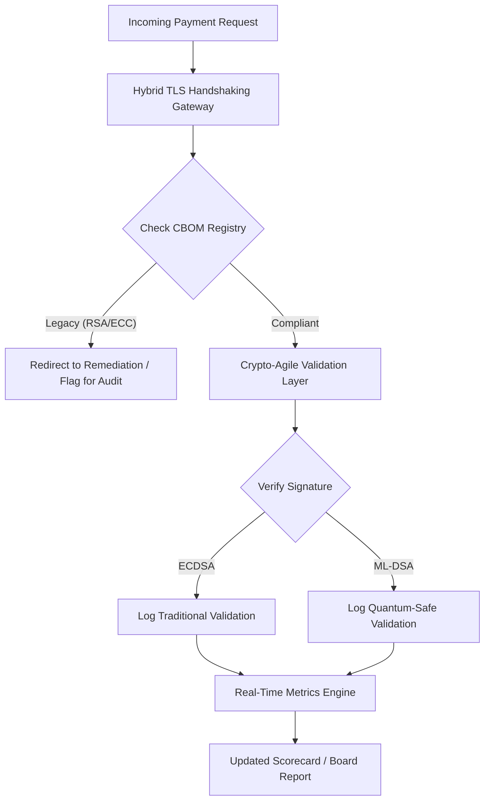

---
# Front Matter (YAML)
author: "contact@sebastienrousseau.com (Sebastien Rousseau)"
banner_alt: "Kuantum kafeslerine dönüşen soyut dijital yönetim kurulu masası — temel bankacılık altyapısını FIPS 203 ve 204'e taşımak için gereken stratejik yönetişimi görselleştiriyor"
banner_height: "1597"
banner_width: "2584"
banner: "https://cloudcdn.pro/stocks/images/quantum-governance-AbC123XyZ.webp"
cdn: "https://cloudcdn.pro"
charset: "UTF-8"
cname: "sebastienrousseau.com"
copyright: "© Copyright 2025 - 2026 - Sebastien Rousseau. All rights reserved."
date: "29 Haziran 2026"
description: "2026 Post-Kuantum Güvenlik Karnesi, yönetim kurullarına ve üst yönetime, birinci kademe bankacılık altyapısında CBOM, HNDL maruziyeti ve NIST FIPS 203/204 göç hızını izlemek için mali sorumluluk düzeyinde bir metrik çerçeve sunar."
format-detection: "telephone=no"
hreflang: "tr"
icon: "https://cloudcdn.pro/clients/sebastienrousseau/v1/logos/sebastienrousseau.svg"
id: "https://sebastienrousseau.com/2026-06-29-post-quantum-security-scorecard-board-level-fiduciary-agility-2026"
image_alt: "Sebastien Rousseau'nun siyah beyaz portresi"
image_height: "162"
image_width: "162"
image: "https://cloudcdn.pro/stocks/images/sebastienrousseau.webp"
keywords: "post-kuantum kriptografi, PQC karnesi, NIST FIPS 203, NIST FIPS 204, CBOM, HNDL, bankacılık yönetişimi, kripto-çeviklik, KyberLib, DORA uyumu, SM&CR, kuantum dayanıklılığı"
language: "tr-TR"
last_reviewed: "2026-06-29"
layout: "report"
locale: "tr_TR"
logo_alt: "Sebastien Rousseau için logo"
logo_height: "44"
logo_width: "44"
logo: "https://cloudcdn.pro/clients/sebastienrousseau/v1/logos/sebastienrousseau.svg"
measurementID: "G-169G4ET5HQ"
name: "Sebastien Rousseau"
permalink: "https://sebastienrousseau.com/2026-06-29-post-quantum-security-scorecard-board-level-fiduciary-agility-2026"
rating: "general"
referrer: "no-referrer"
robots: "index, follow"
schema: "FAQPage, Article"
seo_title: "2026 Post-Kuantum Güvenlik Karnesi: Yönetim Kurulu Çerçevesi"
short_name: "sebastienrousseau"
subtitle: "Yönetim kurullarının NIST FIPS 203 ve 204'e geçişi nasıl ölçmesi ve yönetmesi gerektiği; CBOM bütünlüğünün izlenmesi ve kurumsal hazinedeki Harvest-Now-Decrypt-Later (HNDL) maruziyetinin azaltılması."
tags: "post-kuantum, kriptografi, bankacılık, yönetişim, DORA, FIPS-203, FIPS-204, CBOM, HNDL, KyberLib, SM&CR"
theme-color: "0, 83, 191"
title: "2026 Post-Kuantum Güvenlik Karnesi: Yönetim Kurulu Düzeyinde Bir Metrik Çerçeve"
url: "https://sebastienrousseau.com/2026-06-29-post-quantum-security-scorecard-board-level-fiduciary-agility-2026"
viewport: "width=device-width, initial-scale=1, shrink-to-fit=no"

# RSS
atom_link: "https://sebastienrousseau.com/2026-06-29-post-quantum-security-scorecard-board-level-fiduciary-agility-2026/rss.xml"
category: "Technology"
generator: "Static Site Generator (SSG) (version 0.0.40)"
item_description: "2026 Post-Kuantum Güvenlik Karnesi, yönetim kurullarına CBOM, HNDL maruziyeti ve NIST göç hızını izlemek için mali sorumluluk düzeyinde bir metrik çerçeve sunar."
item_pub_date: "Mon, 29 Jun 2026 07:07:07 +0000"
item_title: "2026 Post-Kuantum Güvenlik Karnesi: Yönetim Kurulu Düzeyinde Bir Metrik Çerçeve"
pub_date: "Mon, 29 Jun 2026 07:07:07 +0000"
type: "article"

# Twitter Card
twitter_card: "summary_large_image"
twitter_creator: "@wwdseb"
twitter_description: "2026 Post-Kuantum Güvenlik Karnesi: Bankacılık yönetim kurullarının kriptografik çevikliği, CBOM bütünlüğünü ve HNDL maruziyetini nasıl ölçtüğü."
twitter_image: "https://cloudcdn.pro/clients/sebastienrousseau/v1/logos/sebastienrousseau.svg"
twitter_title: "Bankacılık Yönetim Kurulları için 2026 Post-Kuantum Güvenlik Karnesi"
twitter_url: "https://sebastienrousseau.com/2026-06-29-post-quantum-security-scorecard-board-level-fiduciary-agility-2026"

excerpt: "Haziran 2026 itibarıyla post-kuantum kriptografi (PQC), deneysel bir teknik kaygıdan birincil mali sorumluluk yükümlülüğüne dönüşmüştür. Yönetim kurulları artık eski şifrelemenin sistematik göçünü denetlemek zorunda..."

# Template-completeness keys (parity with hsh/noyalib shape)
apple_mobile_web_app_orientations: "portrait"
apple_touch_icon_sizes: "192x192"
apple-mobile-web-app-capable: "yes"
apple-mobile-web-app-status-bar-inset: "black"
apple-mobile-web-app-status-bar-style: "black-translucent"
apple-touch-fullscreen: "yes"
apple-mobile-web-app-title: "PQC Karnesi 2026"
author_location: "London, United Kingdom"
author_twitter: "@wwdseb"
author_website: "https://sebastienrousseau.com"
docs: https://validator.w3.org/feed/docs/rss2.html
item_guid: "https://sebastienrousseau.com/2026-06-29-post-quantum-security-scorecard-board-level-fiduciary-agility-2026/rss.xml"
item_link: "https://sebastienrousseau.com/2026-06-29-post-quantum-security-scorecard-board-level-fiduciary-agility-2026/rss.xml"
last_build_date: "Mon, 29 Jun 2026 06:06:06 +0000"
managing_editor: "contact@sebastienrousseau.com (Sebastien Rousseau)"
menu: "active"
msapplication-navbutton-color: "0, 83, 191"
site_components: "Kaishi, Kaishi Builder, Kaishi CLI, Kaishi Templates, Kaishi Themes"
site_last_updated: "2023-07-05"
site_software: "Static Site Generator, Rust"
site_standards: "HTML5, CSS3, RSS, Atom, JSON, XML, YAML, Markdown, TOML"
thanks: "Okuduğunuz için teşekkürler!"
ttl: "60"
twitter_image_alt: "Sebastien Rousseau'nun siyah beyaz portresi"
twitter_site: "@wwdseb"
webmaster: "contact@sebastienrousseau.com"
---

# 2026 Post-Kuantum Güvenlik Karnesi: Mali Sorumluluk Düzeyinde Kriptografik Çeviklik için Yönetim Kurulu Metrik Çerçevesi

<aside class="post-lead" aria-label="Makale özeti">

<strong>Kısaca.</strong> Haziran 2026 itibarıyla post-kuantum kriptografi (PQC), deneysel bir teknik kaygıdan birincil mali sorumluluk yükümlülüğüne dönüşmüştür. Yönetim kurulları artık eski şifrelemenin NIST FIPS 203 ve 204 standartlarına sistematik göçünü denetlemek ve DORA kapsamındaki sistemik finansal ve operasyonel riskleri azaltmak zorundadır.

<strong>Temel çıkarımlar</strong>

<ul class="post-lead-takeaways">
  <li><strong>G20 uyumu ve kesin son tarihler.</strong> Uluslararası düzenleyiciler, kuantum-güvenli geçişler için 2020'lerin sonunu kesin son tarih olarak belirlemiş; kurumların sayısal göç ilerlemesini kanıtlamasını şart koşmuştur.</li>
  <li><strong>Kriptografik Malzeme Listesi (CBOM).</strong> Yazılım BOM'una benzer şekilde CBOM, tüm kriptografik varlıkların canlı, otomatik bir envanteridir; tedarik zinciri genelinde görünürlüğü güvence altına almak için zorunludur.</li>
  <li><strong>Harvest-Now-Decrypt-Later (HNDL) maruziyeti.</strong> Düşmanlar şu anda şifrelenmiş yüksek değerli toptan ödeme verilerini engelleyip arşivliyor; bu riskin azaltılması hibrit PQC mimarilerinin hemen konuşlandırılmasını gerektirir.</li>
  <li><strong>Kripto-çeviklikle mali sorumluluk yönetişimi.</strong> Kripto-çeviklik ölçülebilir bir yönetişim metriğidir. Çekirdek sistemleri yeniden mühendislik etmeden (KyberLib gibi kütüphaneler kullanarak) kriptografik ilkelleri değiştirebilme becerisi artık SM&CR kapsamında yönetim kurulu düzeyinde hesap verebilirliktir.</li>
</ul>

<strong>İlgili okumalar:</strong> <a href="https://sebastienrousseau.com/2026-06-12-kyberlib-post-quantum-banking-migration-standards-code-2026">KyberLib ve 2026'da Post-Kuantum Bankacılık Göçü</a>, <a href="https://sebastienrousseau.com/2023-11-19-crystals-kyber-the-safeguarding-algorithm-in-a-quantum-age/index.html">CRYSTALS-Kyber: Kuantum Çağında Koruma Algoritması</a>.

</aside>
Post-kuantum güvenlik artık bir araştırma projesi değildir. "Denetim saati", 2020'lerin sonundaki uygulama son tarihlerine doğru tıklıyor. [NIST FIPS 203 (ML-KEM)](https://csrc.nist.gov/pubs/fips/203/final) ve [NIST FIPS 204 (ML-DSA)](https://csrc.nist.gov/pubs/fips/204/final) standartlarının nihai hale getirilmesi, anahtar kapsülleme ve dijital imzalar için standartları kodlamıştır.

Düzenleyici kurumlar artık birinci kademe bankaların pilot programların ötesine geçmesini bekliyor. 2026'da odak bu standartların endüstrileşmesine kaymıştır. Net bir göç yolunu kanıtlayamamak, [Dijital Operasyonel Dayanıklılık Yasası (DORA)](https://eur-lex.europa.eu/eli/reg/2022/2554/oj) kapsamında ciddi düzenleyici cezalar ve kuantum-destekli şifre çözümünün öngörülebilir tehdidini görmezden gelen yöneticiler için olası kişisel sorumluluk getirir.

## 01. Yönetim Kurulu Düzeyinde Kuantum Karnesi

Aşağıdaki metrikler, yönetim kurullarının Ticari ve Yatırım Bankacılığı (CIB) ortamlarında kuantum hazırlığını ve kriptografik sağlığı değerlendirmesi için standart bir çerçeve sunar.

### Tablo 1: PQC Karne Metrikleri ve Toleransları

| Metrik | Matematiksel Formül | Yönetim Kurulu Onaylı Toleranslar | Tolerans Dışı Risk |
| ---- | ---- | ---- | ---- |
| **Envanter Bütünlüğü Yüzdesi (ICP)** | (Tanımlanan Kripto Varlıkları / Toplam Tahmini Varlıklar) × 100 | > %98 | Yüksek değerli takas veri yollarında gölge şifreleme ve kör noktalar. |
| **HNDL Maruziyet Oranı (HER)** | (Eski Kripto Üzerindeki Uzun Ömürlü Veri / Toplam Uzun Ömürlü Veri) × 100 | < %5 | Ticari sırların, devlet borcu kayıtlarının ve toptan ödeme kayıtlarının kalıcı olarak ifşa olması. |
| **NIST Göç İlerleme Oranı (MPR)** | (FIPS 203/204 çalıştıran Sistemler / Toplam Kritik Sistem) × 100 | > %60 (2026 yıl sonuna kadar) | Düzenleyici uyumsuzluk ve G20 uyumlu karşı taraflardan dışlanma. |
| **Kripto-Çeviklik Hazırlık Endeksi (CARI)** | (Soyutlanmış Kripto Katmanlı Uygulamalar / Toplam Çekirdek Uygulama) × 100 | > %85 | Ciddi teknik borç ve gelecekteki algoritma kullanım dışı bırakmalarına yanıt verememe. |

## 02. Kriptografik Malzeme Listesi (CBOM)

ICP metriği, kapsamlı bir **CBOM Keşif Aşaması** üzerinden temellendirilir. Bu, kurum içindeki her kriptografik uç noktayı tanımlayan otomatik bir süreçtir.

- **Uç nokta keşfi:** Aktif TLS oturumları için iç ve bulut ağlarının taranması; eski RSA veya ECC kullanımının tespit edilmesi.
- **Anahtar envanteri:** Açık/özel anahtar çiftlerinin ilgili sahiplerine ve kesin sona erme tarihlerine eşlenmesi.
- **Bağımlılık eşleme:** Kullanım dışı algoritmalara dayanan üçüncü taraf kütüphanelerin ve API'lerin belirlenmesi.

Bu keşif aşaması tek bir gerçek kaynağı oluşturur; CISO'nun kriptografik sağlığı finansal performansla aynı ayrıntı düzeyinde raporlamasına olanak tanır.

## 03. Toptan Ödemelerde HNDL Maruziyetinin Ortadan Kaldırılması

Düşmanlar aktif olarak toptan ödemeleri ve uzun ömürlü kurumsal veritabanlarını hedef alıyor. Bu "Harvest-Now-Decrypt-Later" (HNDL) saldırıları, bugünün şifreli trafiğinin engellenmesini ve arşivlenmesini içerir.

Kriptografik açıdan ilgili bir kuantum bilgisayar (CRQC) bugün mevcut olmasa bile, şimdi engellenen veriler gelecekte savunmasız olacaktır. Bunun azaltılması, uzun ömürlü verilerin (örneğin kimlik kayıtları, 30 yıllık tahvil sözleşmeleri ve hukuki arşivler) yüksek öncelikli göçünü gerektirir; bu, doğrudan HER metriğini düşürür. Ödeme kanallarının hibrit PQC-geleneksel şifrelemeye (X25519 ile birlikte ML-KEM kullanarak) yükseltilmesi, arşiv tehditlerine karşı anında savunma sağlar.

## 04. İyi Tasarlanmış Arayüzler Üzerinden Kripto-Çevikliğin Operasyonelleştirilmesi

Kripto-çeviklik mühendislik soyutlamaları aracılığıyla gerçekleşir. [KyberLib](https://sebastienrousseau.com/2026-06-12-kyberlib-post-quantum-banking-migration-standards-code-2026) gibi modern kütüphaneler, geliştiricilerin tüm uygulama yığınını yeniden yazmadan kuantum-güvenli modülleri nasıl uygulayabileceğini gösterir.

- **Soyutlanmış sarmalayıcılar:** Uygulamalar, algoritmaya özgü rutinler yerine genel bir `encrypt()` veya `sign()` fonksiyonu çağırır.
- **Çalışma zamanı değiştirme:** Altta yatan modül, karmaşık kod konuşlandırmaları yerine yapılandırma değişiklikleri ile ECDSA'dan ML-DSA'ya değiştirilebilir.

Bu mimari, gelecekte belirli bir PQC algoritmasının ihlal edilmesi durumunda kurumun yıllar yerine saatler içinde yön değiştirebilmesini güvence altına alır.

## 05. Kuantum-Güvenli Giriş Doğrulama İş Akışı

Aşağıdaki diyagram, kuantum-çevik bir bankacılık ortamında güvenli çevre içine giren verinin yaşam döngüsünü göstermektedir.

## Sonuç

Birinci kademe bir bankanın kriptografik ortamı artık yalnızca bir CISO meselesi değildir. Mali sorumluluk altyapısıdır. NIST FIPS 203 ve 204 algoritmaları belirler; DORA Madde 5 hesap verebilirlik yüzeyini belirler; SM&CR ise bunu adı belli bir üst yöneticiye bağlar. Yukarıdaki karne — Envanter Bütünlüğü, HNDL Maruziyeti, Göç İlerlemesi, Kripto-Çeviklik — bir yönetim kuruluna bu ortamı kriptografik kodu okumak zorunda kalmadan yönetmek için gereken dört rakamı verir.

En önemli rakam HNDL Maruziyeti'dir. Bugün bir toptan ödeme arşivinde duran her eski şifreli kayıt, ilk kriptografik açıdan ilgili kuantum bilgisayarın teslim edildiği gün okunabilir hale gelecektir. Geri sayım sessiz ve asimetriktir: savunucular yalnızca ellerindeki veri üzerinden hareket edebilirken düşmanlar yıllar önce sızdırdıkları veri üzerinden hareket edebilir. 2024'te RSA-2048 ile şifrelenmiş 30 yıllık bir kurumsal tahvil sözleşmesi, bir CRQC devreye girdiği gün gizlilik garantisini kaybeden bir sözleşmedir.

[KyberLib](https://sebastienrousseau.com/2026-06-12-kyberlib-post-quantum-banking-migration-standards-code-2026) ve benzerleri, bunu çok yıllı bir platform yeniden yazımından bir yapılandırma değişikliğine indirger. Yönetim kurulunun işi kodu yazmak değildir. Yönetim kurulunun işi, Kripto-Çeviklik Hazırlık Endeksi'nin — soyutlanmış bir kriptografik arayüzün arkasındaki çekirdek uygulamaların payı — on iki ay içinde %85'i geçmesini talep etmek ve üç ayda bir karneyi okumaktır.

<aside class="author-card" aria-label="Yazar hakkında"><strong class="author-card-name"><a href="/about/index.html">Sebastien Rousseau</a></strong>Uygulamalı yapay zeka, ISO 20022 göçü, finansal hizmetler için post-kuantum kriptografi ve toptan ödemelerin yapısal dönüşümü üzerine yazan kıdemli bankacılık teknoloğu.HSBC Ticari & Yatırım Bankacılığı, PayPal, Barclays, Shazam genelinde 20+ yıl. <a href="https://www.linkedin.com/in/sebastienrousseau/" rel="external noopener">LinkedIn</a> &middot; <a href="https://github.com/sebastienrousseau" rel="external noopener">GitHub</a></aside>

Son inceleme <time datetime="2026-06-29">2026-06-29</time>.

