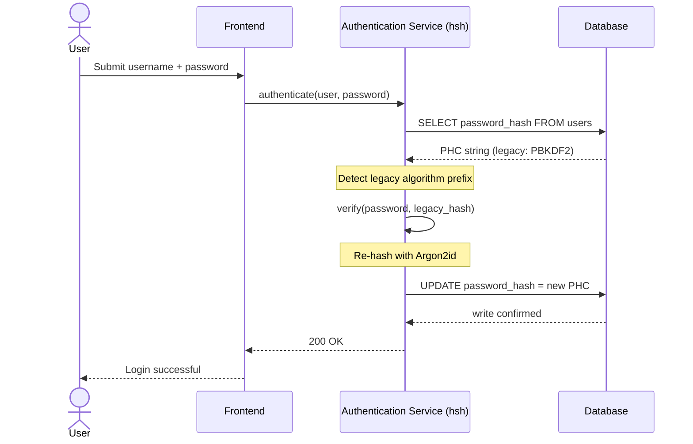
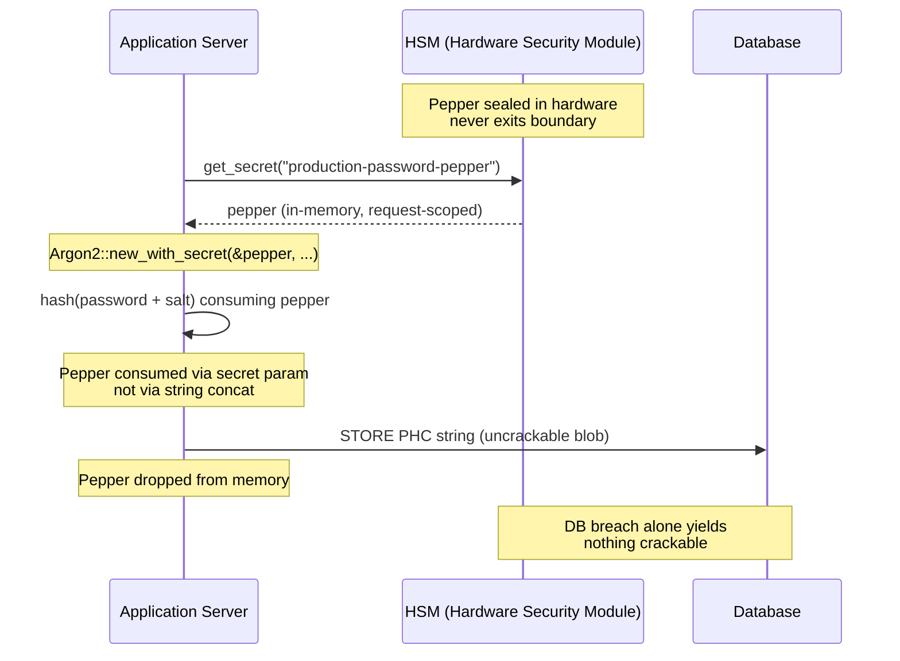

---
# Front Matter (YAML)
author: "contact@sebastienrousseau.com (Sebastien Rousseau)"
banner_alt: "Cấu trúc két mật mã trừu tượng được chiếu sáng bằng ánh sáng xanh và vàng — mô tả ranh giới an toàn về bộ nhớ nơi các băm mật khẩu kế thừa được nâng cấp lên Argon2id theo thời gian thực"
banner_height: "1597"
banner_width: "2584"
banner: "https://cloudcdn.pro/stocks/images/crypto-vault-XyZ1bLQnP9.webp"
cdn: "https://cloudcdn.pro"
charset: "UTF-8"
cname: "sebastienrousseau.com"
copyright: "© Copyright 2025 - 2026 - Sebastien Rousseau. All rights reserved."
date: "22 tháng 6, 2026"
description: "hsh — khuôn khổ mật mã thuần Rust cho ngân hàng tier-1 di trú băm kế thừa sang Argon2id với zero downtime, peppering HSM và tuân thủ DORA."
format-detection: "telephone=no"
hreflang: "vi"
icon: "https://cloudcdn.pro/clients/sebastienrousseau/v1/logos/sebastienrousseau.svg"
id: "https://sebastienrousseau.com/2026-06-22-hsh-zero-downtime-cryptographic-stewardship-rust-banking-2026"
image_alt: "Chân dung đen trắng của Sebastien Rousseau"
image_height: "162"
image_width: "162"
image: "https://cloudcdn.pro/stocks/images/sebastien-rousseau.png"
keywords: "hsh, mật mã Rust, băm mật khẩu, Argon2id, bảo mật ngân hàng, khoá liên động HSM, tuân thủ DORA, Basel III, di trú zero-downtime, an toàn bộ nhớ, PBKDF2, scrypt, phục hồi sau tấn công mạng"
language: "vi-VN"
last_reviewed: "2026-06-22"
layout: "report"
locale: "vi_VN"
logo_alt: "Logo của Sebastien Rousseau"
logo_height: "44"
logo_width: "44"
logo: "https://cloudcdn.pro/clients/sebastienrousseau/v1/logos/sebastienrousseau.svg"
measurementID: "G-169G4ET5HQ"
name: "Sebastien Rousseau"
permalink: "https://sebastienrousseau.com/2026-06-22-hsh-zero-downtime-cryptographic-stewardship-rust-banking-2026"
rating: "general"
referrer: "no-referrer"
robots: "index, follow"
schema: "FAQPage, Article"
seo_title: "hsh: Quản trị mật mã zero-downtime trong Rust cho ngân hàng"
short_name: "sebastienrousseau"
subtitle: "Một khuôn khổ mật mã thuần Rust cho phép ngân hàng nâng cấp mật khẩu kế thừa sang Argon2id với khoá liên động HSM — và ý nghĩa của nó với tuân thủ DORA và Basel III."
tags: "hsh, Rust, ngân hàng, mật mã, Argon2id, HSM, DORA, Basel-III, bảo mật, mã nguồn mở, khả năng chống chịu vận hành"
theme-color: "0, 83, 191"
title: "Bảo mật quản lý mật khẩu trong ngân hàng doanh nghiệp: băm đa thuật toán và nâng cấp với hsh"
url: "https://sebastienrousseau.com/2026-06-22-hsh-zero-downtime-cryptographic-stewardship-rust-banking-2026"
viewport: "width=device-width, initial-scale=1, shrink-to-fit=no"

# RSS
atom_link: "https://sebastienrousseau.com/2026-06-22-hsh-zero-downtime-cryptographic-stewardship-rust-banking-2026/rss.xml"
category: "Technology"
generator: "Static Site Generator (SSG) (version 0.0.40)"
item_description: "hsh — khuôn khổ mật mã thuần Rust cho ngân hàng tier-1 di trú băm kế thừa sang Argon2id với zero downtime, peppering HSM và tuân thủ DORA."
item_pub_date: "Mon, 22 Jun 2026 07:07:07 +0000"
item_title: "Bảo mật quản lý mật khẩu trong ngân hàng doanh nghiệp: băm đa thuật toán và nâng cấp với hsh"
pub_date: "Mon, 22 Jun 2026 07:07:07 +0000"
type: "article"

# Twitter Card
twitter_card: "summary_large_image"
twitter_creator: "@wwdseb"
twitter_description: "hsh cho phép ngân hàng tier-1 di trú băm mật khẩu kế thừa sang Argon2id với zero downtime, khoá liên động HSM và Rust an toàn bộ nhớ."
twitter_image: "https://cloudcdn.pro/clients/sebastienrousseau/v1/logos/sebastienrousseau.svg"
twitter_title: "hsh: Quản trị mật mã zero-downtime trong Rust"
twitter_url: "https://sebastienrousseau.com/2026-06-22-hsh-zero-downtime-cryptographic-stewardship-rust-banking-2026"

excerpt: "Trong thời đại giải mã tăng tốc bằng GPU và các yêu cầu DORA, mục nát mật mã là rủi ro hệ thống. Mọi băm PBKDF2 hoặc scrypt kế thừa nằm trong một cơ sở dữ liệu ngân hàng là một đồng hồ đếm ngược tới sự xâm phạm. hsh thay đổi mô hình bằng các nâng cấp zero-downtime, an toàn bộ nhớ..."

# Added by fix_hsh_frontmatter.py (template completeness)
apple_mobile_web_app_orientations: "portrait"
apple_touch_icon_sizes: "192x192"
apple-mobile-web-app-capable: "yes"
apple-mobile-web-app-status-bar-inset: "black"
apple-mobile-web-app-status-bar-style: "black-translucent"
apple-touch-fullscreen: "yes"
author_location: "London, United Kingdom"
author_twitter: "@wwdseb"
author_website: "https://sebastienrousseau.com"
docs: https://validator.w3.org/feed/docs/rss2.html
item_guid: "https://sebastienrousseau.com/2026-06-22-hsh-zero-downtime-cryptographic-stewardship-rust-banking-2026/rss.xml"
item_link: "https://sebastienrousseau.com/2026-06-22-hsh-zero-downtime-cryptographic-stewardship-rust-banking-2026/rss.xml"
last_build_date: "Mon, 22 Jun 2026 06:06:06 +0000"
managing_editor: "contact@sebastienrousseau.com (Sebastien Rousseau)"
menu: "active"
msapplication-navbutton-color: "0, 83, 191"
site_components: "Kaishi, Kaishi Builder, Kaishi CLI, Kaishi Templates, Kaishi Themes"
site_last_updated: "2023-07-05"
site_software: "Static Site Generator, Rust"
site_standards: "HTML5, CSS3, RSS, Atom, JSON, XML, YAML, Markdown, TOML"
ttl: "60"
twitter_site: "@wwdseb"
webmaster: "contact@sebastienrousseau.com"
apple-mobile-web-app-title: "hsh: Rust password hashing"
thanks: "Cảm ơn bạn đã đọc!"
twitter_image_alt: "Chân dung đen trắng của Sebastien Rousseau"
---

# Bảo mật quản lý mật khẩu trong ngân hàng doanh nghiệp: băm đa thuật toán và nâng cấp với hsh

<aside class="post-lead" aria-label="Tóm tắt bài viết">
<p class="post-lead-tldr"><strong>TL;DR.</strong> <a href="https://github.com/sebastienrousseau/hsh">hsh</a> là một khuôn khổ mật mã mã nguồn mở, thuần Rust, cho phép ngân hàng tier-1 di trú băm mật khẩu kế thừa sang các chuẩn hiện đại như Argon2id mà không gián đoạn dịch vụ. Bằng cách tích hợp peppering hậu thuẫn bởi HSM và áp dụng nghiêm ngặt tính an toàn bộ nhớ mà không dùng các lớp wrapper FFI dựa trên C, nó đóng các lỗ hổng mục nát mật mã đe doạ trực tiếp tới tuân thủ DORA và Basel III.</p>
<p class="post-lead-heading"><strong>Điểm chính</strong></p>
<ul class="post-lead-takeaways">
  <li><strong>Vấn đề mục nát mật mã.</strong> Các thuật toán kế thừa như PBKDF2 yếu đi theo cấp số nhân khi phần cứng tăng tốc, mở rộng bề mặt tấn công cho các chiến dịch nhồi nhét thông tin xác thực và brute-force ngoại tuyến.</li>
  <li><strong>Di trú zero-downtime.</strong> Mẫu <code>verify_and_upgrade</code> băm lại thông tin xác thực người dùng một cách trong suốt trong các sự kiện đăng nhập tiêu chuẩn, loại bỏ rủi ro vận hành của di trú hàng loạt cơ sở dữ liệu.</li>
  <li><strong>Khoá liên động phần cứng và peppering.</strong> Các băm được bao bọc bằng Hardware Security Module (HSM) hoặc các kiến trúc KMS đám mây, bảo đảm rằng chỉ riêng một sự cố rò rỉ cơ sở dữ liệu không tạo ra các mật khẩu ứng viên có thể bẻ khoá.</li>
  <li><strong>An toàn bộ nhớ như đường cơ sở pháp lý.</strong> Được viết lại hoàn toàn bằng Rust an toàn và được thực thi qua vệ sinh phụ thuộc nghiêm ngặt, hsh loại bỏ các rủi ro tràn bộ đệm và chuỗi cung ứng vốn có trong các thư viện mật mã kế thừa dựa trên C.</li>
</ul>
<p class="post-lead-related"><strong>Đọc liên quan:</strong> <a href="https://sebastienrousseau.com/2026-06-20-http-handle-zero-dependency-edge-ingress-banking-rust-2026">http-handle: Ingress biên hiệu năng cao, zero-dependency cho ngân hàng trong năm 2026</a>, <a href="https://sebastienrousseau.com/2026-06-07-autonomous-treasury-index-programmable-liquidity-tokenised-deposits-2026/index.html">Chỉ số Treasury tự trị trong năm 2026</a>.</p>
</aside>
Phần lớn xác thực ngân hàng doanh nghiệp vẫn dựa trên lớp mật khẩu được tôi luyện theo mô hình mối đe doạ năm 2018. Phần cứng phá vỡ nó đã đi tiếp. Khi các trang trại GPU mở rộng quy mô và các máy tính lượng tử liên quan về mặt mật mã (CRQC) đang đến gần, băm kế thừa — PBKDF2, scrypt thời kỳ đầu — phân huỷ theo từng giờ tính toán mà kẻ tấn công bỏ ra trên hàng đợi bẻ khoá ngoại tuyến. Sự phân huỷ là âm thầm: không có gì trong cơ sở dữ liệu sản xuất nói cho bạn biết rằng băm vốn mạnh ngày hôm qua đã không còn mạnh nữa.

Theo [Đạo luật Khả năng chống chịu vận hành kỹ thuật số (DORA)](https://eur-lex.europa.eu/eli/reg/2022/2554/oj), việc để lại các tài sản mật mã kế thừa, chưa được xoay vòng trong sản xuất không còn là nợ kỹ thuật. Đó là trách nhiệm pháp lý có tên.

[hsh](https://github.com/sebastienrousseau/hsh) đóng khoảng cách đó. Là một khuôn khổ thuần Rust, nó quản lý nhiều định dạng băm song song và nâng cấp các thông tin xác thực yếu ngay trong khi các phiên đăng nhập đang hoạt động. Hạ tầng xác thực thẳng hàng với các yêu cầu khả năng chống chịu 2026 mà không cần một cửa sổ bảo trì, không cần một lần đặt lại bắt buộc, không một giây thời gian chết.

## 01. Vấn đề mục nát mật mã trong ngân hàng

Để hiểu sự cần thiết của một khuôn khổ như hsh, cần hiểu vòng đời của một băm mật khẩu. Các thuật toán không già đi một cách duyên dáng; chúng phân huỷ tương ứng với phần cứng có sẵn để phá vỡ chúng.

**Khoảng cách tăng tốc ASIC/GPU.** Các thuật toán như PBKDF2 được thiết kế để tốn kém tính toán đối với CPU. Ngày nay, kẻ tấn công sử dụng GPU song song hoá cao để thực thi các đợt tấn công từ điển ngoại tuyến. Một băm kế thừa được tạo năm 2018 yếu hơn rất nhiều trước một đối thủ năm 2026.

**Rủi ro di trú big-bang.** Khi một CISO quyết định nâng cấp từ PBKDF2 lên một thuật toán memory-hard như Argon2id, họ không thể đảo ngược các băm để mã hoá lại. Các giải pháp truyền thống — buộc đặt lại mật khẩu cho hàng triệu người dùng — gây ma sát khách hàng khổng lồ và rủi ro vận hành.

**Chuỗi cung ứng thư viện C.** Trong lịch sử, phần mềm trung gian ngân hàng đã dựa vào các thư viện như `argonautica` hoặc các binding C thô cho băm. Các thư viện này mang một rủi ro chuỗi cung ứng ẩn: một lần tràn bộ đệm bộ nhớ duy nhất trong module xác thực có thể dẫn tới thực thi mã từ xa (RCE) ở lớp đặc quyền nhất của stack ngân hàng.

### So sánh thuật toán — kháng phần cứng và bề mặt tinh chỉnh

Ba thuật toán mà một ngân hàng thực tế gặp phải trong một kho di trú khác nhau ít về lựa chọn nguyên hàm mật mã và nhiều hơn về cách chúng già đi dưới áp lực phần cứng. Bảng dưới đây tóm tắt tư thế thực tiễn.

| Algorithm | Memory-hard | GPU / ASIC resistance | Tuning surface | 2026 status |
| ---- | ---- | ---- | ---- | ---- |
| **PBKDF2** | No | Low — vectorises on GPU; sub-millisecond per guess on commodity hardware. | Iteration count only. | Legacy. Acceptable only as a verify-side fallback during migration. |
| **scrypt** | Yes (modest) | Medium — memory cost defeats simple GPU farms; ASIC-amortisable at scale. | `N` (CPU/memory), `r` (block size), `p` (parallelism). | Deprecated for greenfield. Active in migration corpora. |
| **Argon2id** | Yes (high) | High — memory- and time-hard; resists side-channel and TMTO attacks. | Memory cost (`m`), time cost (`t`), parallelism (`p`), secret (pepper). | Recommended default. OWASP, NIST SP 800-63B-4 draft, FedRAMP. |

Kết luận cho kế hoạch di trú rất hẹp: PBKDF2 là một trạng thái *bên xác minh*, không phải một đích đến *bên ghi*. Mỗi lần đăng nhập thành công trên một bản ghi PBKDF2 nên tạo ra một bản ghi Argon2id trên đường ra.

## 02. Lăng kính kiến trúc hsh 2026

Khuôn khổ được cấu trúc trên năm lớp lõi, mỗi lớp được thiết kế để giảm thiểu một loại rủi ro vận hành cụ thể.

### Bảng 1: Các lớp kiến trúc hsh và giảm thiểu rủi ro

| Lớp | Quyết định thiết kế | Vì sao quan trọng | Rủi ro nếu xử lý sai |
| ---- | ---- | ---- | ---- |
| **Nguyên hàm mật mã** | Định dạng chuỗi PHC thống nhất hỗ trợ Argon2id, scrypt và PBKDF2 | Cung cấp khả năng chống lại tấn công GPU tốt nhất trong lớp đồng thời duy trì tương thích ngược. | Silo dữ liệu; các thuật toán yếu cho phép hơn 100 tỷ lần đoán/giây ngoại tuyến. |
| **Engine chính sách** | Điều phối `verify_and_upgrade` | Tự động hoá quá trình chuyển đổi từ chính sách kế thừa sang hiện đại một cách động khi đăng nhập. | Mục nát bảo mật; người dùng đang hoạt động vẫn dùng các loại băm kế thừa dễ bị bẻ khoá. |
| **Khoá liên động phần cứng** | Khả năng "peppering" với HSM và Cloud KMS | Bảo đảm rằng chỉ riêng một sự cố rò rỉ cơ sở dữ liệu không phơi bày các mật khẩu ứng viên. | Tấn công brute-force ngoại tuyến thành công sau một sự cố SQL injection. |
| **Vệ sinh bảo mật** | Thực thi `deny.toml` và Rust thuần | Chặn hoàn toàn FFI không an toàn và các phụ thuộc C bên ngoài không tin cậy. | Tấn công chuỗi cung ứng thảm khốc và các CVE hỏng bộ nhớ. |

## 03. Đường băm lại zero-downtime

Mẫu `verify_and_upgrade` giải quyết việc di trú dữ liệu thông qua một hệ thống điều phối thông minh, nhận biết trạng thái, đòi hỏi zero downtime cơ sở dữ liệu.

Khi một người dùng gửi thông tin xác thực, hsh đọc chuỗi Password Hashing Competition (PHC) đã lưu. Nếu nó chứa một băm kế thừa (ví dụ, một cấu hình PBKDF2 lỗi thời), hệ thống thực thi dòng sau:

1. **Định danh:** Phân tích thuật toán kế thừa và các tham số cụ thể của nó.
2. **Xác minh:** Xác thực mật khẩu ứng viên dựa trên băm kế thừa.
3. **Nâng cấp thời gian thực:** Khi khớp thành công, hệ thống lấy mật khẩu ứng viên dạng văn bản gốc trong bộ nhớ và lập tức tính toán một băm mới bằng chính sách Argon2id bảo mật cao.
4. **Bền vững hoá:** Hệ thống trả chuỗi PHC mới về cho ứng dụng ngân hàng, ứng dụng này ghi đè bản ghi kế thừa trong cơ sở dữ liệu.

Quy trình này hoàn toàn trong suốt với người dùng cuối. Nó di trú hiệu quả các tài khoản hoạt động nhất sang tầng bảo mật cao nhất ngay ngày đầu tiên, giảm đáng kể bề mặt tấn công của ngân hàng theo cách hữu cơ theo thời gian.

Sơ đồ tuần tự dưới đây cho thấy điều gì xảy ra trong một sự kiện đăng nhập đơn lẻ khi bản ghi đã lưu thuộc về một thuật toán kế thừa. Người dùng không thấy gì thay đổi; điền sản xác thực của ngân hàng được củng cố thêm một bản ghi.



### Mẫu triển khai — điều phối `verify_and_upgrade`

Bề mặt tích hợp bên trong một dịch vụ xác thực rất nhỏ. Đường mã kế thừa vẫn ở lại như một dự phòng; đường mã mới là bộ điều phối.

```rust
use hsh::{Hasher, UpgradeResult};

struct UserRecord {
    username: String,
    password_hash: String, // PHC string
}

async fn authenticate(user: UserRecord, password_attempt: &str) -> Result<bool, AuthError> {
    let hasher = Hasher::new();
    match hasher.verify_and_upgrade(password_attempt, &user.password_hash) {
        Ok(UpgradeResult::Verified(is_valid)) => Ok(is_valid),
        Ok(UpgradeResult::Upgraded(new_hash)) => {
            db::update_user_hash(&user.username, new_hash).await?;
            Ok(true)
        }
        Err(_) => Err(AuthError::InvalidCredentials),
    }
}
```

Ba thuộc tính quan trọng:

- **Nhận biết trạng thái.** `verify_and_upgrade` kiểm tra tiền tố chuỗi PHC. Nếu dấu thuật toán là kế thừa, khuôn khổ kích hoạt việc băm lại tự động theo chính sách Argon2id đã cấu hình. Không có phân nhánh trong mã gọi.
- **Tính nguyên tử.** Việc băm lại chỉ xảy ra sau khi xác minh kế thừa thành công, bên trong cùng một sự kiện xác thực. Không có công việc lô riêng biệt, không có cửa sổ di trú đã lên lịch, và không có di trú khối phá huỷ để hoàn nguyên.
- **Bền vững hoá.** Biến thể `UpgradeResult::Upgraded` mang chuỗi PHC mới. Ứng dụng bền vững hoá nó qua cùng đường dữ liệu đã tồn tại cho bản ghi kế thừa — không có bề mặt ghi song song, không có giao thức ghi hai pha.

**Chế độ thất bại.** Nếu việc ghi cơ sở dữ liệu thất bại hoặc KMS tạm thời không thể truy cập trong quá trình ghi nâng cấp, phiên vẫn thành công đối với băm kế thừa và bản ghi vẫn ở thuật toán cũ. Lần đăng nhập thành công kế tiếp thử lại việc nâng cấp. Không có trạng thái di trú nửa chừng và không có thất bại nhìn thấy được đối với người dùng — di trú đơn điệu xuyên suốt các sự kiện đăng nhập, và chi phí cho mỗi bản ghi của một nâng cấp thất bại đúng bằng một lần thử lại bổ sung ở lần đăng nhập kế tiếp.

## 04. Băm peppered qua khoá liên động HSM / KMS

Băm mật khẩu tiêu chuẩn bảo vệ chống lại rò rỉ cơ sở dữ liệu trực tiếp, nhưng nếu kẻ tấn công có được cả cơ sở dữ liệu (băm và salt), họ có thể thực thi bẻ khoá ngoại tuyến.

hsh giới thiệu một lớp bảo mật "peppered" mạnh mẽ. Bằng cách tích hợp với Hardware Security Module (HSM) hoặc các dịch vụ quản lý khoá (KMS) cloud-native, kết quả Argon2id cuối cùng được bao bọc về mặt mật mã bằng một khoá entropy cao không bao giờ rời khỏi ranh giới phần cứng an toàn. Nếu cơ sở dữ liệu người dùng bị trích xuất, kẻ tấn công chỉ sở hữu các blob đã mã hoá. Họ không thể bắt đầu bẻ khoá mật khẩu mà không đồng thời xâm nhập hạ tầng HSM cách ly vật lý của ngân hàng.

Sơ đồ kiến trúc dưới đây vẽ lại đường đi của bí mật. Pepper không bao giờ rơi vào cơ sở dữ liệu; cơ sở dữ liệu không bao giờ giữ bất cứ thứ gì có thể giải quyết được một mình. Hai kho có thể thất bại độc lập — hệ thống chỉ mất tính bảo mật nếu cả hai cùng thất bại.



### Mẫu triển khai — Argon2id peppered được HSM hậu thuẫn

Pepper được lấy từ HSM tại thời điểm yêu cầu, không phải từ một tệp cấu hình. `Argon2::new_with_secret` tiêu thụ nó qua tham số secret của thuật toán, không phải qua nối chuỗi.

```rust
use argon2::{
    Argon2, Algorithm, Version, Params,
    PasswordHasher, PasswordVerifier,
    password_hash::{PasswordHash, SaltString, rand_core::OsRng},
};

async fn authenticate_with_hsm(
    user: UserRecord,
    password_attempt: &str,
) -> Result<bool, AuthError> {
    let pepper = hsm::client::get_secret("production-password-pepper").await?;
    let hasher = Argon2::new_with_secret(
        &pepper,
        Algorithm::Argon2id,
        Version::V0x13,
        Params::default(),
    )
    .map_err(|_| AuthError::Internal)?;

    let parsed = PasswordHash::new(&user.password_hash)
        .map_err(|_| AuthError::InvalidCredentials)?;
    if hasher.verify_password(password_attempt.as_bytes(), &parsed).is_ok() {
        if is_legacy_hash(&user.password_hash) {
            let new_hash = hasher
                .hash_password(
                    password_attempt.as_bytes(),
                    &SaltString::generate(&mut OsRng),
                )
                .map_err(|_| AuthError::Internal)?
                .to_string();
            db::update_user_hash(&user.username, new_hash).await?;
        }
        return Ok(true);
    }
    Err(AuthError::InvalidCredentials)
}
```

Ba hệ quả thẳng hàng với DORA xuất phát từ hình thái này:

- **Xoay vòng khoá như một vấn đề quản lý khoá.** Pepper sống đằng sau ranh giới HSM/KMS, không phải trong cơ sở dữ liệu. Xoay vòng trở thành một thay đổi quản lý khoá, không phải một chiến dịch băm lại trên toàn bộ điền sản người dùng. Các băm mới ràng buộc với phiên bản pepper hiện hành; các băm cũ xác minh dưới phiên bản đã ràng buộc của chúng cho đến khi chúng nâng cấp một cách tự nhiên.
- **Phân tách nhiệm vụ.** Định danh dịch vụ đọc pepper phải có thể kiểm toán và có đặc quyền tối thiểu. Một sự cố trích xuất toàn bộ cơ sở dữ liệu mà không có quyền HSM tương ứng không đem lại gì có thể bẻ khoá. Một sự cố tổn hại quyền HSM mà không có cơ sở dữ liệu không đem lại gì có thể giải quyết. Bán kính tác động của bất kỳ thất bại đơn lẻ nào đều bị giới hạn.
- **Tránh lỗi length-extension và nối chuỗi.** Sử dụng tham số secret của Argon2 thay vì nối chuỗi loại bỏ cả một lớp cạm bẫy mật mã — length-extension, nối UTF-8 sai kiểu, lỗi thứ tự salt/pepper — khỏi bề mặt triển khai.

## 05. Thẳng hàng pháp lý: DORA, Basel III và SM&CR

- **DORA Điều 5 và 6:** Yêu cầu các định chế tài chính duy trì các khuôn khổ quản lý rủi ro ICT. Một chiến lược dựa vào các băm mật khẩu cũ hàng thập kỷ, chưa được xoay vòng vi phạm các nguyên tắc này. hsh cung cấp một cơ chế tự động, có tài liệu hoá để liên tục nâng cao các biện pháp bảo vệ mật mã.
- **Basel III:** Liên kết vốn pháp lý với xác suất và mức độ nghiêm trọng của các sự kiện tổn thất. Bằng cách triển khai Argon2id với khoá liên động HSM, mức độ nghiêm trọng của một sự cố rò rỉ cơ sở dữ liệu giảm mạnh, hỗ trợ các luận điểm định lượng được cho phân bổ vốn rủi ro vận hành thấp hơn.
- **Trách nhiệm SM&CR:** Phê duyệt một kiến trúc chủ động khắc phục mục nát mật mã cung cấp cho các nhà quản lý cấp cao có tên một chuỗi giảm thiểu rủi ro có thể xác minh, có tài liệu hoá.

## Kết luận

Băm mật khẩu kiểu deploy-and-forget đã kết thúc. DORA đã chuyển sự thụ động mật mã từ nợ kỹ thuật thành trách nhiệm pháp lý có tên, và đường cong phần cứng dốc hơn mỗi năm. Đóng góp của hsh không phải là một thuật toán mạnh hơn — Argon2id đã có sẵn nhiều năm. Đóng góp là cỗ máy vận hành để di trú sang nó mà không lên lịch thời gian chết, không buộc đặt lại người dùng, và không tin tưởng các lớp FFI dựa trên C với đường xác thực của ngân hàng.

[Mã nguồn hsh](https://github.com/sebastienrousseau/hsh) có sẵn theo giấy phép kép MIT và Apache 2.0.

<aside class="author-card" aria-label="Về tác giả"><span class="author-card-body"><strong class="author-card-name"><a href="/about/index.html">Sebastien Rousseau</a></strong><span class="author-card-bio">Chuyên gia công nghệ ngân hàng cấp cao viết về AI ứng dụng, di trú ISO 20022, mật mã hậu lượng tử cho dịch vụ tài chính và sự chuyển đổi cấu trúc của thanh toán bán buôn.</span><span class="author-credentials">Hơn 20 năm tại HSBC Commercial & Investment Bank, PayPal, Barclays, Shazam. <a href="https://www.linkedin.com/in/sebastienrousseau/" rel="external noopener">LinkedIn</a> &middot; <a href="https://github.com/sebastienrousseau" rel="external noopener">GitHub</a></span></span></aside>
<p class="post-reviewed">Đã rà soát lần cuối <time datetime="2026-06-22">2026-06-22</time>.</p>
