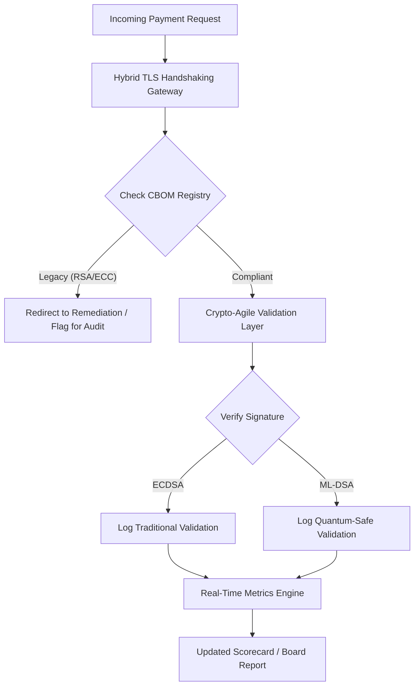

---
# Front Matter (YAML)
author: "contact@sebastienrousseau.com (Sebastien Rousseau)"
banner_alt: "Bàn họp hội đồng quản trị trừu tượng tan dần vào các mạng lưới lượng tử — minh hoạ quản trị chiến lược cần thiết để di trú hạ tầng ngân hàng lõi sang FIPS 203 và 204"
banner_height: "1597"
banner_width: "2584"
banner: "https://cloudcdn.pro/stocks/images/quantum-governance-AbC123XyZ.webp"
cdn: "https://cloudcdn.pro"
charset: "UTF-8"
cname: "sebastienrousseau.com"
copyright: "© Copyright 2025 - 2026 - Sebastien Rousseau. All rights reserved."
date: "29 tháng 6, 2026"
description: "Thẻ điểm An ninh hậu lượng tử 2026 cung cấp cho hội đồng quản trị và ban điều hành cấp cao một khuôn khổ chỉ số fiduciary để theo dõi Cryptographic Bill of Materials (CBOM), mức phơi nhiễm HNDL và tốc độ di trú NIST FIPS 203/204 trên hạ tầng ngân hàng cấp 1."
format-detection: "telephone=no"
hreflang: "vi"
icon: "https://cloudcdn.pro/clients/sebastienrousseau/v1/logos/sebastienrousseau.svg"
id: "https://sebastienrousseau.com/2026-06-29-post-quantum-security-scorecard-board-level-fiduciary-agility-2026"
image_alt: "Chân dung đen trắng của Sebastien Rousseau"
image_height: "162"
image_width: "162"
image: "https://cloudcdn.pro/stocks/images/sebastienrousseau.webp"
keywords: "mật mã hậu lượng tử, thẻ điểm PQC, NIST FIPS 203, NIST FIPS 204, CBOM, HNDL, quản trị ngân hàng, crypto-agility, KyberLib, tuân thủ DORA, SM&CR, khả năng chống chịu lượng tử"
language: "vi-VN"
last_reviewed: "2026-06-29"
layout: "report"
locale: "vi_VN"
logo_alt: "Logo của Sebastien Rousseau"
logo_height: "44"
logo_width: "44"
logo: "https://cloudcdn.pro/clients/sebastienrousseau/v1/logos/sebastienrousseau.svg"
measurementID: "G-169G4ET5HQ"
name: "Sebastien Rousseau"
permalink: "https://sebastienrousseau.com/2026-06-29-post-quantum-security-scorecard-board-level-fiduciary-agility-2026"
rating: "general"
referrer: "no-referrer"
robots: "index, follow"
schema: "FAQPage, Article"
seo_title: "Thẻ điểm An ninh hậu lượng tử 2026: khuôn khổ hội đồng"
short_name: "sebastienrousseau"
subtitle: "Hội đồng quản trị phải đo lường và điều hành việc di trú sang NIST FIPS 203 và 204 ra sao, theo dõi tính đầy đủ của CBOM và giảm thiểu phơi nhiễm Harvest-Now-Decrypt-Later (HNDL) trong ngân quỹ doanh nghiệp."
tags: "post-quantum, cryptography, banking, governance, DORA, FIPS-203, FIPS-204, CBOM, HNDL, KyberLib, SM&CR"
theme-color: "0, 83, 191"
title: "Thẻ điểm An ninh hậu lượng tử 2026: khuôn khổ chỉ số cấp hội đồng"
url: "https://sebastienrousseau.com/2026-06-29-post-quantum-security-scorecard-board-level-fiduciary-agility-2026"
viewport: "width=device-width, initial-scale=1, shrink-to-fit=no"

# RSS
atom_link: "https://sebastienrousseau.com/2026-06-29-post-quantum-security-scorecard-board-level-fiduciary-agility-2026/rss.xml"
category: "Technology"
generator: "Static Site Generator (SSG) (version 0.0.40)"
item_description: "Thẻ điểm An ninh hậu lượng tử 2026 cung cấp cho hội đồng quản trị một khuôn khổ chỉ số fiduciary để theo dõi CBOM, mức phơi nhiễm HNDL và tốc độ di trú NIST."
item_pub_date: "Mon, 29 Jun 2026 07:07:07 +0000"
item_title: "Thẻ điểm An ninh hậu lượng tử 2026: khuôn khổ chỉ số cấp hội đồng"
pub_date: "Mon, 29 Jun 2026 07:07:07 +0000"
type: "article"

# Twitter Card
twitter_card: "summary_large_image"
twitter_creator: "@wwdseb"
twitter_description: "Thẻ điểm An ninh hậu lượng tử 2026: hội đồng quản trị ngân hàng đo lường crypto-agility, tính đầy đủ của CBOM và phơi nhiễm HNDL ra sao."
twitter_image: "https://cloudcdn.pro/clients/sebastienrousseau/v1/logos/sebastienrousseau.svg"
twitter_title: "Thẻ điểm An ninh hậu lượng tử 2026 cho hội đồng ngân hàng"
twitter_url: "https://sebastienrousseau.com/2026-06-29-post-quantum-security-scorecard-board-level-fiduciary-agility-2026"

excerpt: "Tính đến tháng 6 năm 2026, mật mã hậu lượng tử (PQC) đã chuyển từ một mối bận tâm kỹ thuật thử nghiệm thành một nghĩa vụ fiduciary chính. Hội đồng quản trị nay phải giám sát việc di trú có hệ thống mã hoá kế thừa..."

# Template-completeness keys (parity with hsh/noyalib shape)
apple_mobile_web_app_orientations: "portrait"
apple_touch_icon_sizes: "192x192"
apple-mobile-web-app-capable: "yes"
apple-mobile-web-app-status-bar-inset: "black"
apple-mobile-web-app-status-bar-style: "black-translucent"
apple-touch-fullscreen: "yes"
apple-mobile-web-app-title: "Thẻ điểm PQC 2026"
author_location: "London, United Kingdom"
author_twitter: "@wwdseb"
author_website: "https://sebastienrousseau.com"
docs: https://validator.w3.org/feed/docs/rss2.html
item_guid: "https://sebastienrousseau.com/2026-06-29-post-quantum-security-scorecard-board-level-fiduciary-agility-2026/rss.xml"
item_link: "https://sebastienrousseau.com/2026-06-29-post-quantum-security-scorecard-board-level-fiduciary-agility-2026/rss.xml"
last_build_date: "Mon, 29 Jun 2026 06:06:06 +0000"
managing_editor: "contact@sebastienrousseau.com (Sebastien Rousseau)"
menu: "active"
msapplication-navbutton-color: "0, 83, 191"
site_components: "Kaishi, Kaishi Builder, Kaishi CLI, Kaishi Templates, Kaishi Themes"
site_last_updated: "2023-07-05"
site_software: "Static Site Generator, Rust"
site_standards: "HTML5, CSS3, RSS, Atom, JSON, XML, YAML, Markdown, TOML"
thanks: "Cảm ơn quý vị đã đọc!"
ttl: "60"
twitter_image_alt: "Chân dung đen trắng của Sebastien Rousseau"
twitter_site: "@wwdseb"
webmaster: "contact@sebastienrousseau.com"
---

# Thẻ điểm An ninh hậu lượng tử 2026: khuôn khổ chỉ số cấp hội đồng cho crypto-agility fiduciary

<aside class="post-lead" aria-label="Tóm tắt bài viết">

<strong>TL;DR.</strong> Tính đến tháng 6 năm 2026, mật mã hậu lượng tử (PQC) đã chuyển từ một mối bận tâm kỹ thuật thử nghiệm thành một nghĩa vụ fiduciary chính. Hội đồng quản trị nay phải giám sát việc di trú có hệ thống mã hoá kế thừa sang các chuẩn NIST FIPS 203 và 204 để giảm thiểu rủi ro tài chính và vận hành mang tính hệ thống theo DORA.

<strong>Điểm chính</strong>

<ul class="post-lead-takeaways">
  <li><strong>Đồng thuận G20 và hạn chót cứng.</strong> Các cơ quan quản lý quốc tế đã đặt cuối thập kỷ 2020 làm hạn chót cứng cho quá trình chuyển đổi an toàn lượng tử, buộc định chế phải chứng minh tiến độ di trú định lượng được.</li>
  <li><strong>Cryptographic Bill of Materials (CBOM).</strong> Tương tự một software BOM, CBOM là một bản kiểm kê trực tiếp, tự động hoá của mọi tài sản mật mã, cần thiết để bảo đảm khả năng quan sát xuyên suốt chuỗi cung ứng.</li>
  <li><strong>Phơi nhiễm Harvest-Now-Decrypt-Later (HNDL).</strong> Đối thủ hiện đang chặn bắt và lưu trữ dữ liệu thanh toán bán buôn mã hoá có giá trị cao; giảm thiểu điều này đòi hỏi triển khai ngay các kiến trúc PQC lai.</li>
  <li><strong>Quản trị fiduciary qua crypto-agility.</strong> Crypto-agility là một chỉ số quản trị đo lường được. Khả năng hoán đổi nguyên thuỷ mật mã mà không phải tái thiết kế hệ thống lõi (sử dụng các thư viện như KyberLib) nay là một trách nhiệm cấp hội đồng theo SM&CR.</li>
</ul>

<strong>Đọc liên quan:</strong> <a href="https://sebastienrousseau.com/2026-06-12-kyberlib-post-quantum-banking-migration-standards-code-2026">KyberLib và di trú ngân hàng hậu lượng tử trong năm 2026</a>, <a href="https://sebastienrousseau.com/2023-11-19-crystals-kyber-the-safeguarding-algorithm-in-a-quantum-age/index.html">CRYSTALS-Kyber: thuật toán bảo vệ trong thời lượng tử</a>.

</aside>
An ninh hậu lượng tử không còn là một dự án nghiên cứu. "Đồng hồ giám sát" đang đếm ngược tới các hạn chót thực thi cuối thập kỷ 2020. Việc hoàn tất [NIST FIPS 203 (ML-KEM)](https://csrc.nist.gov/pubs/fips/203/final) và [NIST FIPS 204 (ML-DSA)](https://csrc.nist.gov/pubs/fips/204/final) đã chuẩn hoá các tiêu chuẩn cho đóng gói khoá và chữ ký số. 

Các cơ quan quản lý nay kỳ vọng ngân hàng Tier-1 vượt qua giai đoạn chương trình thí điểm. Trong năm 2026, trọng tâm đã chuyển sang công nghiệp hoá các chuẩn này. Việc không chứng minh được một lộ trình di trú rõ ràng kéo theo các chế tài pháp lý đáng kể theo [Đạo luật Khả năng chống chịu vận hành số (DORA)](https://eur-lex.europa.eu/eli/reg/2022/2554/oj) và trách nhiệm cá nhân tiềm tàng đối với các thành viên hội đồng làm ngơ trước mối đe doạ giải mã có hỗ trợ lượng tử có thể đoán trước.

## 01. Thẻ điểm Lượng tử cấp hội đồng

Các chỉ số sau cung cấp một khuôn khổ chuẩn hoá để hội đồng quản trị đánh giá mức độ sẵn sàng lượng tử và sức khoẻ mật mã trên các điền sản Ngân hàng Thương mại và Đầu tư (CIB).

### Bảng 1: Các chỉ số và ngưỡng dung sai Thẻ điểm PQC

| Chỉ số | Công thức toán học | Ngưỡng dung sai do hội đồng phê chuẩn | Rủi ro nếu vượt ngưỡng |
| ---- | ---- | ---- | ---- |
| **Tỷ lệ đầy đủ kiểm kê (ICP)** | (Tài sản mật mã đã xác định / Tổng tài sản ước lượng) × 100 | > 98% | Mã hoá ngầm và điểm mù trong các đường dữ liệu thanh toán bù trừ giá trị cao. |
| **Tỷ lệ phơi nhiễm HNDL (HER)** | (Dữ liệu dài hạn trên mật mã kế thừa / Tổng dữ liệu dài hạn) × 100 | < 5% | Tổn hại vĩnh viễn bí mật thương mại, sổ cái nợ chính phủ và hồ sơ thanh toán bán buôn. |
| **Tỷ lệ tiến độ di trú NIST (MPR)** | (Hệ thống chạy FIPS 203/204 / Tổng hệ thống trọng yếu) × 100 | > 60% (đến cuối năm 2026) | Không tuân thủ pháp lý và bị loại khỏi danh sách đối tác phù hợp G20. |
| **Chỉ số sẵn sàng Crypto-Agility (CARI)** | (Ứng dụng có lớp mật mã trừu tượng hoá / Tổng ứng dụng lõi) × 100 | > 85% | Nợ kỹ thuật nghiêm trọng và mất khả năng phản ứng với các đợt khai tử thuật toán trong tương lai. |

## 02. Cryptographic Bill of Materials (CBOM)

Chỉ số ICP được thiết lập đường nền qua một **Giai đoạn khám phá CBOM** toàn diện. Đây là một quy trình tự động xác định mọi điểm cuối mật mã trong toàn doanh nghiệp.

- **Khám phá điểm cuối:** Quét mạng nội bộ và đám mây để tìm các phiên TLS hoạt động nhằm xác định việc sử dụng RSA hoặc ECC kế thừa.
- **Kiểm kê khoá:** Ánh xạ các cặp khoá công khai/riêng tư tới chủ sở hữu tương ứng và ánh xạ ngày hết hạn chính xác.
- **Ánh xạ phụ thuộc:** Xác định các thư viện và API bên thứ ba phụ thuộc vào các thuật toán đã bị khai tử.

Giai đoạn khám phá này tạo ra một nguồn sự thật duy nhất, cho phép CISO báo cáo sức khoẻ mật mã với độ chi tiết tương đương hiệu suất tài chính.

## 03. Loại bỏ phơi nhiễm HNDL trong thanh toán bán buôn

Đối thủ đang chủ động nhắm vào thanh toán bán buôn và các cơ sở dữ liệu doanh nghiệp dài hạn. Các đợt tấn công "Harvest-Now-Decrypt-Later" (HNDL) này liên quan tới việc chặn bắt và lưu trữ lưu lượng mã hoá hôm nay.

Ngay cả khi một máy tính lượng tử có liên quan mật mã (CRQC) chưa tồn tại hôm nay, dữ liệu bị chặn bắt ngay bây giờ sẽ dễ tổn thương trong tương lai. Giảm thiểu điều này đòi hỏi di trú ưu tiên cao đối với dữ liệu dài hạn (ví dụ, hồ sơ nhận dạng, hợp đồng trái phiếu 30 năm và lưu trữ pháp lý), trực tiếp giảm chỉ số HER. Nâng cấp kênh thanh toán sang mã hoá PQC lai-truyền thống (dùng ML-KEM song song với X25519) cung cấp khả năng phòng vệ tức thì trước các mối đe doạ lưu trữ.

## 04. Vận hành hoá Crypto-Agility qua giao diện thiết kế tốt

Crypto-agility được hiện thực hoá thông qua các trừu tượng hoá kỹ thuật. Các thư viện hiện đại như [KyberLib](https://sebastienrousseau.com/2026-06-12-kyberlib-post-quantum-banking-migration-standards-code-2026) cho thấy các nhà phát triển có thể triển khai các module an toàn lượng tử mà không phải viết lại toàn bộ stack ứng dụng.

- **Lớp bọc trừu tượng hoá:** Ứng dụng gọi một hàm `encrypt()` hoặc `sign()` chung thay vì các thủ tục đặc thù thuật toán.
- **Hoán đổi tại thời điểm chạy:** Module bên dưới có thể được hoán đổi từ ECDSA sang ML-DSA qua thay đổi cấu hình thay vì triển khai mã phức tạp.

Kiến trúc này bảo đảm rằng nếu một thuật toán PQC cụ thể bị tổn hại trong tương lai, tổ chức có thể chuyển hướng trong vài giờ thay vì vài năm.

## 05. Quy trình xác thực dòng vào an toàn lượng tử

Sơ đồ sau minh hoạ vòng đời của dữ liệu vào vành đai an toàn trong một môi trường ngân hàng nhanh nhẹn lượng tử.

## Kết luận

Điền sản mật mã của một ngân hàng Tier-1 không còn là mối bận tâm của CISO. Đó là hạ tầng fiduciary. NIST FIPS 203 và 204 ấn định thuật toán; Điều 5 DORA ấn định bề mặt trách nhiệm; SM&CR gắn nó vào một thành viên ban điều hành cấp cao có tên. Thẻ điểm ở trên — Tính đầy đủ kiểm kê, Phơi nhiễm HNDL, Tiến độ di trú, Crypto-Agility — cho hội đồng quản trị bốn con số cần để điều hành điền sản đó mà không phải đọc mã mật mã.

Con số quan trọng nhất là Phơi nhiễm HNDL. Mọi bản ghi mã hoá kế thừa nằm trong kho lưu trữ thanh toán bán buôn hôm nay sẽ đọc được vào ngày máy tính lượng tử có liên quan mật mã đầu tiên được xuất xưởng. Cuộc đếm ngược lặng lẽ và bất đối xứng: bên phòng thủ chỉ có thể hành động trên dữ liệu họ đang giữ, đối thủ có thể hành động trên dữ liệu đã ngoại trừ từ nhiều năm trước. Một hợp đồng trái phiếu doanh nghiệp 30 năm mã hoá bằng RSA-2048 năm 2024 là một hợp đồng đánh mất bảo đảm bảo mật vào ngày một CRQC đi vào hoạt động.

[KyberLib](https://sebastienrousseau.com/2026-06-12-kyberlib-post-quantum-banking-migration-standards-code-2026) và các thư viện cùng cấp biến điều này từ một đợt viết lại nền tảng nhiều năm thành một thay đổi cấu hình. Việc của hội đồng không phải là viết mã. Việc của hội đồng là yêu cầu Chỉ số sẵn sàng Crypto-Agility — tỷ lệ ứng dụng lõi đứng sau một giao diện mật mã trừu tượng hoá — vượt mốc 85 % trong vòng mười hai tháng, và đọc thẻ điểm hàng quý.

<aside class="author-card" aria-label="Về tác giả"><strong class="author-card-name"><a href="/about/index.html">Sebastien Rousseau</a></strong>Chuyên gia công nghệ ngân hàng cấp cao viết về AI ứng dụng, di trú ISO 20022, mật mã hậu lượng tử cho dịch vụ tài chính và chuyển dịch cấu trúc của thanh toán bán buôn.20+ năm tại HSBC Commercial & Investment Bank, PayPal, Barclays, Shazam. <a href="https://www.linkedin.com/in/sebastienrousseau/" rel="external noopener">LinkedIn</a> &middot; <a href="https://github.com/sebastienrousseau" rel="external noopener">GitHub</a></aside>

Rà soát lần cuối <time datetime="2026-06-29">2026-06-29</time>.

