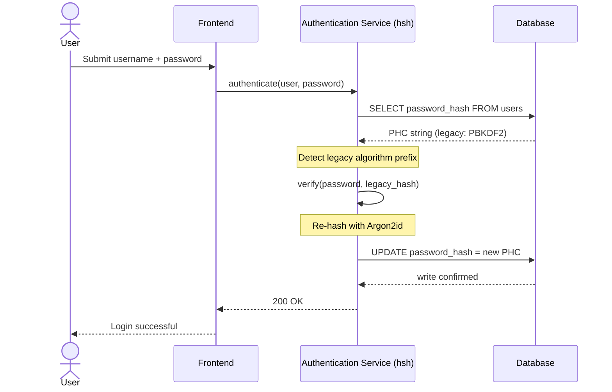
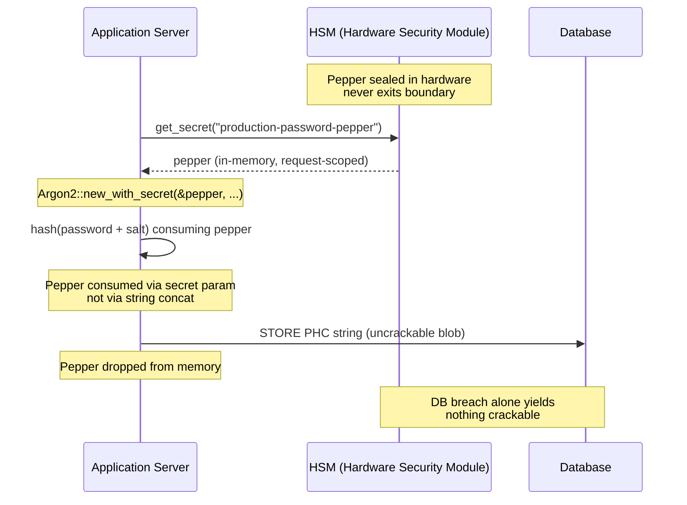

---
# Front Matter (YAML)
author: "contact@sebastienrousseau.com (Sebastien Rousseau)"
banner_alt: "蓝金光影下的抽象密码学保险库结构——可视化呈现遗留口令哈希实时升级为 Argon2id 的安全、内存安全边界"
banner_height: "1597"
banner_width: "2584"
banner: "https://cloudcdn.pro/stocks/images/crypto-vault-XyZ1bLQnP9.webp"
cdn: "https://cloudcdn.pro"
charset: "UTF-8"
cname: "sebastienrousseau.com"
copyright: "© Copyright 2025 - 2026 - Sebastien Rousseau. All rights reserved."
date: "2026年6月22日"
description: "hsh 是一套纯 Rust 密码学框架，让一级银行以零停机方式把遗留口令哈希迁移至 Argon2id，集成 HSM 加椒并消除基于 C 的 FFI 内存漏洞，满足 DORA 韧性要求。"
format-detection: "telephone=no"
hreflang: "zh-hans"
icon: "https://cloudcdn.pro/clients/sebastienrousseau/v1/logos/sebastienrousseau.svg"
id: "https://sebastienrousseau.com/2026-06-22-hsh-zero-downtime-cryptographic-stewardship-rust-banking-2026"
image_alt: "Sebastien Rousseau 黑白肖像"
image_height: "162"
image_width: "162"
image: "https://cloudcdn.pro/stocks/images/sebastien-rousseau.png"
keywords: "hsh, Rust 密码学, 口令哈希, Argon2id, 银行安全, HSM 互锁, DORA 合规, Basel III, 零停机迁移, 内存安全, PBKDF2, scrypt, 网络恢复"
language: "zh-Hans"
last_reviewed: "2026-06-22"
layout: "report"
locale: "zh_CN"
logo_alt: "Sebastien Rousseau 标志"
logo_height: "44"
logo_width: "44"
logo: "https://cloudcdn.pro/clients/sebastienrousseau/v1/logos/sebastienrousseau.svg"
measurementID: "G-169G4ET5HQ"
name: "Sebastien Rousseau"
permalink: "https://sebastienrousseau.com/2026-06-22-hsh-zero-downtime-cryptographic-stewardship-rust-banking-2026"
rating: "general"
referrer: "no-referrer"
robots: "index, follow"
schema: "FAQPage, Article"
seo_title: "hsh：面向银行业的纯 Rust 零停机密码学治理"
short_name: "sebastienrousseau"
subtitle: "一套纯 Rust 密码学框架如何让银行以 HSM 互锁无缝升级遗留口令至 Argon2id——以及这对 DORA 与 Basel III 合规的意义。"
tags: "hsh, Rust, 银行业, 密码学, Argon2id, HSM, DORA, Basel-III, 安全, 开源, 运营韧性"
theme-color: "0, 83, 191"
title: "企业银行口令管理的安全保障：基于 hsh 的多算法哈希与升级"
url: "https://sebastienrousseau.com/2026-06-22-hsh-zero-downtime-cryptographic-stewardship-rust-banking-2026"
viewport: "width=device-width, initial-scale=1, shrink-to-fit=no"

# RSS
atom_link: "https://sebastienrousseau.com/2026-06-22-hsh-zero-downtime-cryptographic-stewardship-rust-banking-2026/rss.xml"
category: "Technology"
generator: "Static Site Generator (SSG) (version 0.0.40)"
item_description: "hsh 是一套纯 Rust 密码学框架，让一级银行以零停机方式把遗留口令哈希迁移至 Argon2id，集成 HSM 加椒并消除基于 C 的 FFI 内存漏洞，满足 DORA 韧性要求。"
item_pub_date: "Mon, 22 Jun 2026 07:07:07 +0000"
item_title: "企业银行口令管理的安全保障：基于 hsh 的多算法哈希与升级"
pub_date: "Mon, 22 Jun 2026 07:07:07 +0000"
type: "article"

# Twitter Card
twitter_card: "summary_large_image"
twitter_creator: "@wwdseb"
twitter_description: "hsh 让一级银行以零停机、HSM 互锁与内存安全 Rust 把遗留口令哈希迁移到 Argon2id。"
twitter_image: "https://cloudcdn.pro/clients/sebastienrousseau/v1/logos/sebastienrousseau.svg"
twitter_title: "hsh：面向银行业的纯 Rust 零停机密码学治理"
twitter_url: "https://sebastienrousseau.com/2026-06-22-hsh-zero-downtime-cryptographic-stewardship-rust-banking-2026"

excerpt: "在 GPU 加速破解与 DORA 监管要求的时代，密码学陈腐已成系统性风险。银行数据库中每一条遗留 PBKDF2 或 scrypt 哈希都是通向被攻破的倒计时。hsh 以零停机、内存安全的升级改变这一格局……"

# Added by fix_hsh_frontmatter.py (template completeness)
apple_mobile_web_app_orientations: "portrait"
apple_touch_icon_sizes: "192x192"
apple-mobile-web-app-capable: "yes"
apple-mobile-web-app-status-bar-inset: "black"
apple-mobile-web-app-status-bar-style: "black-translucent"
apple-touch-fullscreen: "yes"
author_location: "London, United Kingdom"
author_twitter: "@wwdseb"
author_website: "https://sebastienrousseau.com"
docs: https://validator.w3.org/feed/docs/rss2.html
item_guid: "https://sebastienrousseau.com/2026-06-22-hsh-zero-downtime-cryptographic-stewardship-rust-banking-2026/rss.xml"
item_link: "https://sebastienrousseau.com/2026-06-22-hsh-zero-downtime-cryptographic-stewardship-rust-banking-2026/rss.xml"
last_build_date: "Mon, 22 Jun 2026 06:06:06 +0000"
managing_editor: "contact@sebastienrousseau.com (Sebastien Rousseau)"
menu: "active"
msapplication-navbutton-color: "0, 83, 191"
site_components: "Kaishi, Kaishi Builder, Kaishi CLI, Kaishi Templates, Kaishi Themes"
site_last_updated: "2023-07-05"
site_software: "Static Site Generator, Rust"
site_standards: "HTML5, CSS3, RSS, Atom, JSON, XML, YAML, Markdown, TOML"
ttl: "60"
twitter_site: "@wwdseb"
webmaster: "contact@sebastienrousseau.com"
apple-mobile-web-app-title: "hsh: Rust password hashing"
thanks: "感谢阅读！"
twitter_image_alt: "Sebastien Rousseau 黑白肖像"
---

# 企业银行口令管理的安全保障：基于 hsh 的多算法哈希与升级

<aside class="post-lead" aria-label="文章摘要">
<p class="post-lead-tldr"><strong>TL;DR.</strong> <a href="https://github.com/sebastienrousseau/hsh">hsh</a> 是一套开源、纯 Rust 的密码学框架，让一级银行以零服务中断把遗留口令哈希迁移至 Argon2id 等现代标准。通过集成 HSM 支持的加椒并强制不依赖基于 C 的 FFI 封装的严格内存安全，它封堵了直接威胁 DORA 与 Basel III 合规的密码学陈腐漏洞。</p>
<p class="post-lead-heading"><strong>关键要点</strong></p>
<ul class="post-lead-takeaways">
  <li><strong>密码学陈腐问题。</strong>PBKDF2 等遗留算法随着硬件加速而呈指数级弱化，扩大了凭据填充与离线暴力破解的攻击面。</li>
  <li><strong>零停机迁移。</strong><code>verify_and_upgrade</code> 模式在标准登录事件期间对用户凭据做透明再哈希，消除批量数据库迁移的运营风险。</li>
  <li><strong>硬件互锁与加椒。</strong>哈希通过硬件安全模块（HSM）或云 KMS 架构进行封装，确保仅凭数据库泄露无法获得可破解的候选口令。</li>
  <li><strong>把内存安全作为监管底线。</strong>完全以安全 Rust 重写并由严格的依赖治理强制执行，hsh 消除了遗留 C 密码学库固有的缓冲区溢出与供应链风险。</li>
</ul>
<p class="post-lead-related"><strong>延伸阅读：</strong> <a href="https://sebastienrousseau.com/2026-06-20-http-handle-zero-dependency-edge-ingress-banking-rust-2026">http-handle：2026 年面向银行业的高性能零依赖边缘入口</a>、<a href="https://sebastienrousseau.com/2026-06-07-autonomous-treasury-index-programmable-liquidity-tokenised-deposits-2026/index.html">2026 年自主财资指数</a>。</p>
</aside>
绝大多数企业银行身份验证仍然建立在按 2018 年威胁模型加固的口令层之上。攻破它的硬件早已进化。随着 GPU 集群规模化以及具备密码学威胁的量子计算机（CRQC）逼近，遗留哈希——PBKDF2、早期 scrypt——在攻击者投入到离线破解队列的每一小时算力下持续衰减。这种衰减是无声的：生产数据库中没有任何线索告诉你昨天还很强的哈希今天已不再可靠。

在《[数字运营韧性法案（DORA）](https://eur-lex.europa.eu/eli/reg/2022/2554/oj)》下，把未轮换的遗留密码学资产留在生产中，已不再是技术债务。它是被点名的监管责任。

[hsh](https://github.com/sebastienrousseau/hsh) 填补了这一缺口。作为一套纯 Rust 框架，它并行管理多种哈希格式，并在用户活跃登录会话中实时升级弱凭据。身份验证基础设施得以对齐 2026 年韧性要求——无需维护窗口、无需强制重置、零秒停机。

## 01. 银行业的密码学陈腐问题

要理解 hsh 这类框架的必要性，必须先理解口令哈希的生命周期。算法不会优雅地老化；它们相对于可用于破解它们的硬件而衰减。

**ASIC/GPU 加速差距。**PBKDF2 等算法的设计目标是对 CPU 而言计算昂贵。如今，攻击者使用高度并行的 GPU 执行离线字典攻击。一个 2018 年生成的遗留哈希，面对 2026 年的对手已弱得多。

**大爆炸式迁移风险。**当 CISO 决定从 PBKDF2 升级至 Argon2id 这样的内存困难算法时，无法逆转既有哈希以重新加密。传统方案——强迫数百万用户重置口令——会带来巨大的客户摩擦与运营风险。

**C 库供应链。**历史上，银行中间件依赖 `argonautica` 或原生 C 绑定来做哈希。这些库带有隐藏的供应链风险：身份验证模块中一次内存缓冲区溢出，就可能在银行栈最高权限层引发远程代码执行（RCE）。

### 算法对照——硬件抗性与可调表面

银行在迁移语料中实际遇到的三种算法，差异并不在密码学原语的选择，而在它们如何在硬件压力下老化。下表汇总了实际姿态。

| Algorithm | Memory-hard | GPU / ASIC resistance | Tuning surface | 2026 status |
| ---- | ---- | ---- | ---- | ---- |
| **PBKDF2** | 否 | 低——可在 GPU 上向量化；商用硬件每次猜测亚毫秒。 | 仅迭代次数。 | 遗留。仅可作为迁移期间的校验侧回退。 |
| **scrypt** | 是（适中） | 中——内存成本可击退简单 GPU 集群；大规模下可被 ASIC 摊薄。 | `N`（CPU/内存）、`r`（块大小）、`p`（并行度）。 | 新建项目已弃用。仍活跃于迁移语料。 |
| **Argon2id** | 是（高） | 高——内存与时间双重困难；抗侧信道与 TMTO 攻击。 | 内存成本（`m`）、时间成本（`t`）、并行度（`p`）、秘密值（pepper）。 | 推荐默认。OWASP、NIST SP 800-63B-4 草案、FedRAMP。 |

迁移计划的结论收窄而明确：PBKDF2 是*校验侧*状态，而非*写入侧*目标。每一次成功登录到 PBKDF2 记录，都应在出口产出一条 Argon2id 记录。

## 02. 2026 年 hsh 架构视角

该框架按五个核心层组织，每一层都为缓释一类特定运营风险而设计。

### 表 1：hsh 架构层与风险缓释

| 层次 | 设计决策 | 关键意义 | 处置不当的风险 |
| ---- | ---- | ---- | ---- |
| **密码学原语** | 统一 PHC 字符串格式，支持 Argon2id、scrypt 与 PBKDF2 | 在保留向后兼容的同时，提供同类最佳的抗 GPU 攻击能力。 | 数据孤岛；弱算法允许每秒 1000 亿次以上离线猜测。 |
| **策略引擎** | `verify_and_upgrade` 派发 | 在登录时动态自动完成从遗留策略到现代策略的过渡。 | 安全陈腐；活跃用户仍停留在易破解的遗留哈希类型上。 |
| **硬件互锁** | HSM 与云 KMS "加椒" 能力 | 确保仅凭数据库泄露不会暴露候选口令。 | SQL 注入泄露后离线暴力破解得逞。 |
| **安全治理** | `deny.toml` 强制与纯 Rust | 完全阻止不安全 FFI 与不受信任的外部 C 依赖。 | 灾难性供应链攻击与内存损坏 CVE。 |

## 03. 零停机再哈希路径

`verify_and_upgrade` 模式通过一套智能的、状态感知的派发系统解决数据迁移问题，零数据库停机。

当用户提交凭据时，hsh 读取存储中的口令哈希竞赛（PHC）字符串。如果其中包含遗留哈希（例如过时的 PBKDF2 配置），系统执行如下流程：

1. **识别：**解析遗留算法及其具体参数。
2. **验证：**对照遗留哈希校验候选口令。
3. **实时升级：**匹配成功后，hsh 在内存中接过明文候选口令，立刻使用高安全等级的 Argon2id 策略计算新哈希。
4. **持久化：**它把新的 PHC 字符串返回银行应用，由应用覆盖数据库中的遗留记录。

整个过程对终端用户完全透明。它在第一天就把最活跃账户迁移到最高安全等级，并随时间推移有机地大幅压缩银行的攻击面。

下方时序图展示了当存储记录仍在遗留算法上时，单次登录事件内部发生的全过程。用户感知不到任何变化；银行的身份验证资产却悄然增强了一条记录。



### 实现模式——`verify_and_upgrade` 派发

身份验证服务内的集成表面很小。遗留代码路径保留作为回退；新代码路径就是派发器。

```rust
use hsh::{Hasher, UpgradeResult};

struct UserRecord {
    username: String,
    password_hash: String, // PHC string
}

async fn authenticate(user: UserRecord, password_attempt: &str) -> Result<bool, AuthError> {
    let hasher = Hasher::new();
    match hasher.verify_and_upgrade(password_attempt, &user.password_hash) {
        Ok(UpgradeResult::Verified(is_valid)) => Ok(is_valid),
        Ok(UpgradeResult::Upgraded(new_hash)) => {
            db::update_user_hash(&user.username, new_hash).await?;
            Ok(true)
        }
        Err(_) => Err(AuthError::InvalidCredentials),
    }
}
```

三项性质值得关注：

- **状态感知。**`verify_and_upgrade` 检查 PHC 字符串前缀。若算法标记为遗留，框架便自动按配置的 Argon2id 策略触发再哈希。调用方代码无需分支。
- **原子性。**再哈希仅在遗留校验成功后、同一身份验证事件内发生。没有单独的批处理作业，没有调度迁移窗口，也没有需要回滚的破坏性批量迁移。
- **持久化。**`UpgradeResult::Upgraded` 变体携带新的 PHC 字符串。应用通过原本就服务于遗留记录的同一数据路径持久化——无平行写入面，无两阶段写入协议。

**失败模式。**若数据库写入失败或 KMS 在升级写入期间短暂不可达，会话仍然凭遗留哈希成功，记录保持在旧算法上。下一次成功登录会重试升级。不存在半迁移状态，也没有用户可见的失败——迁移在登录事件之间单调推进，单条记录失败升级的代价恰好是下次登录多一次重试。

## 04. 通过 HSM / KMS 互锁实现加椒哈希

标准口令哈希可防御对数据库的直接泄露，但若攻击者同时拿到数据库（哈希与盐），即可执行离线破解。

hsh 引入了稳健的 "加椒" 安全层。通过与硬件安全模块（HSM）或云原生密钥管理服务（KMS）集成，最终的 Argon2id 输出会被一把永不离开安全硬件边界的高熵密钥以密码学方式封装。即便用户数据库被外泄，攻击者拿到的也只是加密斑点。在不同时攻破银行物理隔离的 HSM 基础设施前，他们无法开始破解口令。

下方架构图描绘了秘密的流转路径。pepper 永远不会落到数据库里；数据库本身也不持有任何可单独取用的内容。两个存储可独立失效——只有当二者同时被攻破时，系统才会损失机密性。



### 实现模式——HSM 支持的加椒 Argon2id

pepper 在请求时从 HSM 取得，而非来自配置文件。`Argon2::new_with_secret` 通过算法的秘密参数消费它，而非通过字符串拼接。

```rust
use argon2::{
    Argon2, Algorithm, Version, Params,
    PasswordHasher, PasswordVerifier,
    password_hash::{PasswordHash, SaltString, rand_core::OsRng},
};

async fn authenticate_with_hsm(
    user: UserRecord,
    password_attempt: &str,
) -> Result<bool, AuthError> {
    let pepper = hsm::client::get_secret("production-password-pepper").await?;
    let hasher = Argon2::new_with_secret(
        &pepper,
        Algorithm::Argon2id,
        Version::V0x13,
        Params::default(),
    )
    .map_err(|_| AuthError::Internal)?;

    let parsed = PasswordHash::new(&user.password_hash)
        .map_err(|_| AuthError::InvalidCredentials)?;
    if hasher.verify_password(password_attempt.as_bytes(), &parsed).is_ok() {
        if is_legacy_hash(&user.password_hash) {
            let new_hash = hasher
                .hash_password(
                    password_attempt.as_bytes(),
                    &SaltString::generate(&mut OsRng),
                )
                .map_err(|_| AuthError::Internal)?
                .to_string();
            db::update_user_hash(&user.username, new_hash).await?;
        }
        return Ok(true);
    }
    Err(AuthError::InvalidCredentials)
}
```

由此衍生出三项契合 DORA 的后果：

- **把密钥轮换变为密钥管理问题。**pepper 留在 HSM/KMS 边界之内，而非数据库中。轮换成为一次密钥管理变更，而不是对整个用户体量发起的再哈希运动。新哈希绑定到当前 pepper 版本；旧哈希在自然升级前以其绑定版本进行校验。
- **职责分离。**读取 pepper 的服务身份必须可审计且最小权限。无对应 HSM 授权的完整数据库外泄一无所得，无可破解的内容。无数据库的 HSM 授权失陷一无所获，无可发起的对象。任一单点失败的爆炸半径都被限定。
- **避免长度扩展与拼接缺陷。**使用 Argon2 的秘密参数而非字符串拼接，将一整类密码学陷阱——长度扩展、误类型 UTF-8 拼接、盐/椒次序缺陷——从实现表面移除。

## 05. 监管对齐：DORA、Basel III 与 SM&CR

- **DORA 第 5 条与第 6 条：**要求金融实体维护 ICT 风险管理框架。依赖未轮换、十年前口令哈希的策略违反这些原则。hsh 提供了一套有文档、自动化的机制，持续提升密码学防护水平。
- **Basel III：**把监管资本与损失事件的概率与严重程度挂钩。通过部署带 HSM 互锁的 Argon2id，数据库泄露的严重程度大幅下降，支持可量化地降低操作风险资本占用的论证。
- **SM&CR 问责：**批准一套主动修复密码学陈腐的架构，为被点名的高级管理者提供可核验、可备案的风险削减链条。

## 结论

部署后不管的口令哈希已成过去。DORA 已经把密码学惰性从技术债务推上了被点名的监管责任，硬件曲线每年都更陡。hsh 的贡献不是更强的算法——Argon2id 多年前就已可用。它的贡献是一套运营机制：在不安排停机、不强制用户重置、不让基于 C 的 FFI 垫片承担银行身份验证路径的前提下，完成迁移。

[hsh 源代码](https://github.com/sebastienrousseau/hsh) 以 MIT 与 Apache 2.0 双许可证发布。

<aside class="author-card" aria-label="关于作者"><span class="author-card-body"><strong class="author-card-name"><a href="/about/index.html">Sebastien Rousseau</a></strong><span class="author-card-bio">资深银行技术专家，撰写应用 AI、ISO 20022 迁移、面向金融服务的后量子密码学，以及批发支付的结构性转型。</span><span class="author-credentials">20 年以上 HSBC 商业与投资银行、PayPal、Barclays、Shazam 经验。<a href="https://www.linkedin.com/in/sebastienrousseau/" rel="external noopener">LinkedIn</a> &middot; <a href="https://github.com/sebastienrousseau" rel="external noopener">GitHub</a></span></span></aside>
<p class="post-reviewed">最近审阅 <time datetime="2026-06-22">2026-06-22</time>。</p>
