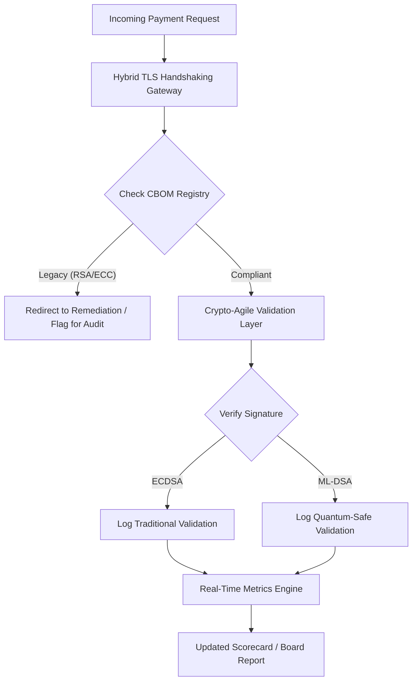

---
# Front Matter (YAML)
author: "contact@sebastienrousseau.com (Sebastien Rousseau)"
banner_alt: "抽象数字化董事会议桌溶解为量子格阵——直观呈现核心银行基础设施迁移至 FIPS 203 与 204 所需的战略治理"
banner_height: "1597"
banner_width: "2584"
banner: "https://cloudcdn.pro/stocks/images/quantum-governance-AbC123XyZ.webp"
cdn: "https://cloudcdn.pro"
charset: "UTF-8"
cname: "sebastienrousseau.com"
copyright: "© Copyright 2025 - 2026 - Sebastien Rousseau. All rights reserved."
date: "2026年6月29日"
description: "《2026 年后量子安全记分卡》为董事会与高级管理层提供一套受信责约束的度量框架，用于跟踪一级银行基础设施的密码物料清单（CBOM）、HNDL 暴露及 NIST FIPS 203/204 迁移进度。"
format-detection: "telephone=no"
hreflang: "zh-hans"
icon: "https://cloudcdn.pro/clients/sebastienrousseau/v1/logos/sebastienrousseau.svg"
id: "https://sebastienrousseau.com/2026-06-29-post-quantum-security-scorecard-board-level-fiduciary-agility-2026"
image_alt: "Sebastien Rousseau 黑白肖像"
image_height: "162"
image_width: "162"
image: "https://cloudcdn.pro/stocks/images/sebastien-rousseau.png"
keywords: "后量子密码学, PQC 记分卡, NIST FIPS 203, NIST FIPS 204, CBOM, HNDL, 银行治理, 密码敏捷性, KyberLib, DORA 合规, SM&CR, 量子韧性"
language: "zh-Hans"
last_reviewed: "2026-06-29"
layout: "report"
locale: "zh_CN"
logo_alt: "Sebastien Rousseau 标志"
logo_height: "44"
logo_width: "44"
logo: "https://cloudcdn.pro/clients/sebastienrousseau/v1/logos/sebastienrousseau.svg"
measurementID: "G-169G4ET5HQ"
name: "Sebastien Rousseau"
permalink: "https://sebastienrousseau.com/2026-06-29-post-quantum-security-scorecard-board-level-fiduciary-agility-2026"
rating: "general"
referrer: "no-referrer"
robots: "index, follow"
schema: "FAQPage, Article"
seo_title: "2026 后量子安全记分卡：董事会级框架"
short_name: "sebastienrousseau"
subtitle: "董事会如何度量并治理向 NIST FIPS 203 与 204 的迁移，跟踪 CBOM 完备性，并缓释企业资金管理中的 Harvest-Now-Decrypt-Later（HNDL）暴露。"
tags: "后量子, 密码学, 银行业, 治理, DORA, FIPS-203, FIPS-204, CBOM, HNDL, KyberLib, SM&CR"
theme-color: "0, 83, 191"
title: "2026 后量子安全记分卡：面向董事会的度量框架"
url: "https://sebastienrousseau.com/2026-06-29-post-quantum-security-scorecard-board-level-fiduciary-agility-2026"
viewport: "width=device-width, initial-scale=1, shrink-to-fit=no"

# RSS
atom_link: "https://sebastienrousseau.com/2026-06-29-post-quantum-security-scorecard-board-level-fiduciary-agility-2026/rss.xml"
category: "Technology"
generator: "Static Site Generator (SSG) (version 0.0.40)"
item_description: "《2026 年后量子安全记分卡》为董事会提供受信责约束的度量框架，用于跟踪 CBOM、HNDL 暴露与 NIST 迁移进度。"
item_pub_date: "Mon, 29 Jun 2026 07:07:07 +0000"
item_title: "2026 后量子安全记分卡：面向董事会的度量框架"
pub_date: "Mon, 29 Jun 2026 07:07:07 +0000"
type: "article"

# Twitter Card
twitter_card: "summary_large_image"
twitter_creator: "@wwdseb"
twitter_description: "2026 后量子安全记分卡：银行董事会如何度量密码敏捷性、CBOM 完备性与 HNDL 暴露。"
twitter_image: "https://cloudcdn.pro/clients/sebastienrousseau/v1/logos/sebastienrousseau.svg"
twitter_title: "面向银行董事会的 2026 后量子安全记分卡"
twitter_url: "https://sebastienrousseau.com/2026-06-29-post-quantum-security-scorecard-board-level-fiduciary-agility-2026"

excerpt: "截至 2026 年 6 月，后量子密码学（PQC）已从实验性的技术议题转变为首要的信责义务。董事会须监督将遗留加密系统系统化迁移……"

# Template-completeness keys (parity with hsh/noyalib shape)
apple_mobile_web_app_orientations: "portrait"
apple_touch_icon_sizes: "192x192"
apple-mobile-web-app-capable: "yes"
apple-mobile-web-app-status-bar-inset: "black"
apple-mobile-web-app-status-bar-style: "black-translucent"
apple-touch-fullscreen: "yes"
apple-mobile-web-app-title: "PQC 记分卡 2026"
author_location: "London, United Kingdom"
author_twitter: "@wwdseb"
author_website: "https://sebastienrousseau.com"
docs: https://validator.w3.org/feed/docs/rss2.html
item_guid: "https://sebastienrousseau.com/2026-06-29-post-quantum-security-scorecard-board-level-fiduciary-agility-2026/rss.xml"
item_link: "https://sebastienrousseau.com/2026-06-29-post-quantum-security-scorecard-board-level-fiduciary-agility-2026/rss.xml"
last_build_date: "Mon, 29 Jun 2026 06:06:06 +0000"
managing_editor: "contact@sebastienrousseau.com (Sebastien Rousseau)"
menu: "active"
msapplication-navbutton-color: "0, 83, 191"
site_components: "Kaishi, Kaishi Builder, Kaishi CLI, Kaishi Templates, Kaishi Themes"
site_last_updated: "2023-07-05"
site_software: "Static Site Generator, Rust"
site_standards: "HTML5, CSS3, RSS, Atom, JSON, XML, YAML, Markdown, TOML"
thanks: "感谢阅读！"
ttl: "60"
twitter_image_alt: "Sebastien Rousseau 黑白肖像"
twitter_site: "@wwdseb"
webmaster: "contact@sebastienrousseau.com"
---

# 2026 后量子安全记分卡：面向董事会、服务信责密码敏捷性的度量框架

<aside class="post-lead" aria-label="文章摘要">

<strong>要点速览。</strong>截至 2026 年 6 月，后量子密码学（PQC）已从实验性的技术议题转变为首要的信责义务。董事会须监督将遗留加密系统系统化迁移至 NIST FIPS 203 与 204 标准，以缓释 DORA 框架下的系统性金融与运营风险。

<strong>核心要点</strong>

<ul class="post-lead-takeaways">
  <li><strong>G20 步调一致，硬性截止日已定。</strong>国际监管机构已将 2020 年代后期定为抗量子迁移的硬性截止时点，要求机构出示可量化的迁移进度。</li>
  <li><strong>密码物料清单（CBOM）。</strong>类比软件 BOM，CBOM 是一份对全部密码资产进行实时、自动维护的清单，用以确保整条供应链的可视性。</li>
  <li><strong>Harvest-Now-Decrypt-Later（HNDL）暴露。</strong>对手当下正在截获并存档已加密的高价值大额支付数据；缓释这一威胁要求立即部署混合 PQC 架构。</li>
  <li><strong>以密码敏捷性承载信责治理。</strong>密码敏捷性是一项可度量的治理指标。在不重构核心系统的前提下更换密码原语（借助 KyberLib 等库）的能力，已经成为 SM&CR 框架下董事会层面的责任。</li>
</ul>

<strong>延伸阅读：</strong><a href="https://sebastienrousseau.com/2026-06-12-kyberlib-post-quantum-banking-migration-standards-code-2026">KyberLib 与 2026 年的后量子银行业迁移</a>、<a href="https://sebastienrousseau.com/2023-11-19-crystals-kyber-the-safeguarding-algorithm-in-a-quantum-age/index.html">CRYSTALS-Kyber：量子时代的守护算法</a>。

</aside>
后量子安全不再是研究课题。"监管时钟"正在向 2020 年代后期的强制执行截止时点逼近。[NIST FIPS 203（ML-KEM）](https://csrc.nist.gov/pubs/fips/203/final)与 [NIST FIPS 204（ML-DSA）](https://csrc.nist.gov/pubs/fips/204/final)的定稿已经将密钥封装与数字签名的标准固化下来。

监管机构现已要求一级银行走出试点阶段。2026 年的重点已经转向上述标准的产业化落地。无法出示清晰迁移路径，将在 [《数字运营韧性法案》（DORA）](https://eur-lex.europa.eu/eli/reg/2022/2554/oj) 下招致重大监管处罚，并可能让无视量子解密这一可预见威胁的董事承担个人法律责任。

## 01. 董事会级量子记分卡

下列指标构成一套标准化框架，便于董事会评估商业与投资银行（CIB）业务版图内的量子就绪度与密码健康度。

### 表 1：PQC 记分卡指标与容忍度

| 指标 | 数学公式 | 董事会核定容忍度 | 超容忍区间的风险 |
| ---- | ---- | ---- | ---- |
| **清单完备率（ICP）** | （已识别密码资产 / 估算资产总数）× 100 | > 98% | 高价值清算数据路径存在影子加密与盲点。 |
| **HNDL 暴露率（HER）** | （遗留密码体制下的长寿命数据 / 长寿命数据总量）× 100 | < 5% | 商业机密、主权债务账本与大额支付记录被永久性失泄密。 |
| **NIST 迁移进度率（MPR）** | （运行 FIPS 203/204 的系统 / 关键系统总数）× 100 | > 60%（2026 年末） | 监管不合规，并被 G20 一致对齐的对手方排除在外。 |
| **密码敏捷就绪指数（CARI）** | （已抽象密码层的应用 / 核心应用总数）× 100 | > 85% | 严重的技术债，且无力应对未来的算法弃用。 |

## 02. 密码物料清单（CBOM）

ICP 指标的基线通过一次完整的 **CBOM 发现阶段**确立。这是一项自动化流程，用以识别企业内的每一个密码端点。

- **端点发现：** 扫描内网与云上网络中活跃的 TLS 会话，识别遗留的 RSA 或 ECC 用法。
- **密钥清单：** 将公私钥对映射到各自的所有者，并记录精确的到期日。
- **依赖图谱：** 识别依赖弃用算法的第三方库与 API。

发现阶段构建起单一事实源，使 CISO 能够以与财务业绩同等的颗粒度报告密码健康度。

## 03. 在大额支付中消除 HNDL 暴露

对手正在积极针对大额支付与长寿命的企业数据库下手。这类 "Harvest-Now-Decrypt-Later"（HNDL）攻击的核心动作是截获并存档今天的已加密流量。

即便密码学相关量子计算机（CRQC）今天尚不存在，今天被截获的数据未来仍将被解开。缓释路径要求将长寿命数据（例如身份记录、30 年期债券合同与法律档案）的迁移列为高优先级，并以此直接拉低 HER 指标。把支付通道升级为混合 PQC—传统加密体制（在 ML-KEM 旁并行 X25519），即可对存档型威胁形成即时防护。

## 04. 以良构接口承载密码敏捷性的工程化落地

密码敏捷性须通过工程抽象兑现。[KyberLib](https://sebastienrousseau.com/2026-06-12-kyberlib-post-quantum-banking-migration-standards-code-2026) 等现代库给出了示范路径：开发者可在不重写整套应用栈的前提下接入抗量子模块。

- **抽象封装：** 应用调用通用的 `encrypt()` 或 `sign()` 接口，而不是特定算法的具体例程。
- **运行时切换：** 底层模块可由 ECDSA 切换为 ML-DSA，仅通过配置变更即可完成，无需复杂的代码发布。

这种架构确保：若未来某种 PQC 算法被攻破，机构能够在数小时而非数年内完成切换。

## 05. 抗量子入口校验工作流

下图刻画了在量子敏捷银行环境中，数据进入安全边界后的全生命周期。

## 结语

一级银行的密码资产版图，已不再只是 CISO 的事务，而是信责性基础设施。NIST FIPS 203 与 204 划定了算法；DORA 第 5 条划定了问责边界；SM&CR 则将其落到一名具名的高级管理人员身上。前文的记分卡——清单完备率、HNDL 暴露、迁移进度、密码敏捷——为董事会给出了治理这一版图所需的四个数字，无需亲自读密码代码。

四者之中最关键的是 HNDL 暴露。每一条今天躺在大额支付存档里、用遗留密码体制加密的记录，在第一台密码学相关量子计算机出厂的那一天起，都会变成可被读取的明文。倒计时静默且非对称：防御者只能动用手上的数据，对手则能动用多年前就已外带走的数据。一份在 2024 年以 RSA-2048 加密、期限 30 年的企业债合同，将在 CRQC 上线的那一天失去保密保证。

[KyberLib](https://sebastienrousseau.com/2026-06-12-kyberlib-post-quantum-banking-migration-standards-code-2026) 及同类库把这件事从多年的平台重写降格为一次配置变更。董事会的职责不是写代码。董事会的职责是要求密码敏捷就绪指数——即位于抽象密码接口之后的核心应用占比——在十二个月内穿越 85% 线，并按季度阅读记分卡。

<aside class="author-card" aria-label="关于作者"><strong class="author-card-name"><a href="/about/index.html">Sebastien Rousseau</a></strong>资深银行业技术专家，长期撰文论述应用 AI、ISO 20022 迁移、面向金融服务的后量子密码学，以及大额支付的结构性转型。在汇丰商业与投资银行、PayPal、巴克莱、Shazam 等机构积累 20 年以上经验。<a href="https://www.linkedin.com/in/sebastienrousseau/" rel="external noopener">LinkedIn</a> &middot; <a href="https://github.com/sebastienrousseau" rel="external noopener">GitHub</a></aside>

最后审阅 <time datetime="2026-06-29">2026-06-29</time>。

