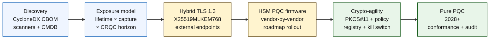

---

# Front Matter (YAML)

author: "contact@sebastienrousseau.com (Sebastien Rousseau)"
banner_alt: "The Quantum-Safe Banking Index 2026 index diagram for banks and financial institutions in 2026"
banner_height: "571"
banner_width: "1425"
banner: "https://cloudcdn.pro/stocks/images/getty-images-LaU3HadwEeE-unsplash-1200.webp"
cdn: "https://cloudcdn.pro"
charset: "UTF-8"
cname: "sebastienrousseau.com"
copyright: "© Copyright 2025 - 2026 - Sebastien Rousseau. All rights reserved."
date: "June 4, 2026"
description: "A banking index for quantum-safe readiness in 2026, covering NIST post-quantum standards, cryptographic inventory, crypto-agility, QKD, and long-lived data exposure."
format-detection: "telephone=no"
hreflang: "en"
icon: "https://cloudcdn.pro/clients/sebastienrousseau/v1/logos/sebastienrousseau.svg"
id: "https://sebastienrousseau.com/2026-06-04-quantum-safe-banking-index-pqc-qkd-crypto-agility-2026"
image_alt: "Black and White Portrait of Sebastien Rousseau"
image_height: "162"
image_width: "162"
image: "https://cloudcdn.pro/stocks/images/sebastien-rousseau.png"
keywords: "quantum safe banking 2026, post quantum cryptography banks, NIST FIPS 203, ML-KEM, ML-DSA, SLH-DSA, crypto agility, QKD banking"
language: "en-GB"
last_reviewed: "2026-06-04"
layout: "report"
locale: "en_GB"
logo_alt: "Logo for Sebastien Rousseau"
logo_height: "44"
logo_width: "44"
logo: "https://cloudcdn.pro/clients/sebastienrousseau/v1/logos/sebastienrousseau.svg"
menu: ""
measurementID: "G-169G4ET5HQ"
name: "Sebastien Rousseau"
permalink: "https://sebastienrousseau.com/2026-06-04-quantum-safe-banking-index-pqc-qkd-crypto-agility-2026"
rating: "general"
referrer: "no-referrer"
robots: "index, follow"
schema: "FAQPage, Article"
seo_title: "The Quantum-Safe Banking Index 2026"
short_name: "sebastienrousseau"
subtitle: "Quantum risk has moved from theoretical threat to migration programme: banks need to measure cryptographic exposure, migration readiness, and crypto-agility."
excerpt: "An index framework for measuring quantum-safe banking readiness in 2026: cryptographic bill of materials, hybrid TLS deployment, NIST FIPS 203 / 204 / 205 migration progress, crypto-agility primitives, and harvest-now-decrypt-later exposure across long-lived confidential data. The Board-Level Quantum Scorecard defines four exact percentages — inventory completeness, HNDL exposure, NIST migration progress, crypto-agility readiness — that turn project statuses into supervisory-ready evidence."
tags: "quantum cryptography, post-quantum cryptography, QKD, crypto-agility, cybersecurity, ISO 20022, DORA, AI, open source, cross-border payments"
theme-color: "0, 83, 191"
title: "The Quantum-Safe Banking Index in 2026: Post-Quantum Cryptography, QKD, Crypto-Agility, and Harvest-Now-Decrypt-Later Risk"
url: "https://sebastienrousseau.com/2026-06-04-quantum-safe-banking-index-pqc-qkd-crypto-agility-2026"
viewport: "width=device-width, initial-scale=1, shrink-to-fit=no"

# RSS - The RSS feed front matter (YAML).
atom_link: "https://sebastienrousseau.com/2026-06-04-quantum-safe-banking-index-pqc-qkd-crypto-agility-2026/rss.xml"
category: "Security"
docs: https://validator.w3.org/feed/docs/rss2.html
generator: "Static Site Generator (SSG) (version 0.0.26)"
item_description: "A banking index for quantum-safe readiness in 2026, covering NIST post-quantum standards, cryptographic inventory, crypto-agility, QKD, and long-lived data exposure."
item_guid: "https://sebastienrousseau.com/2026-06-04-quantum-safe-banking-index-pqc-qkd-crypto-agility-2026/rss.xml"
item_link: "https://sebastienrousseau.com/2026-06-04-quantum-safe-banking-index-pqc-qkd-crypto-agility-2026/rss.xml"
item_pub_date: "Thu, 04 Jun 2026 06:06:06 +0000"
item_title: "The Quantum-Safe Banking Index in 2026: Post-Quantum Cryptography, QKD, Crypto-Agility, and Harvest-Now-Decrypt-Later Risk"
last_build_date: "Thu, 04 Jun 2026 06:06:06 +0000"
managing_editor: "contact@sebastienrousseau.com (Sebastien Rousseau)"
pub_date: "Thu, 04 Jun 2026 06:06:06 +0000"
ttl: "60"
type: "article"
webmaster: "contact@sebastienrousseau.com"

# Apple - The Apple front matter (YAML).
apple_mobile_web_app_orientations: "portrait"
apple_touch_icon_sizes: "192x192"
apple-mobile-web-app-capable: "yes"
apple-mobile-web-app-status-bar-inset: "black"
apple-mobile-web-app-status-bar-style: "black-translucent"
apple-mobile-web-app-title: "The Quantum-Safe Banking Index 2026"
apple-touch-fullscreen: "yes"

# MS Application - The MS Application front matter (YAML).

msapplication-navbutton-color: "0, 83, 191"

# Twitter Card - The Twitter Card front matter (YAML).

twitter_card: "summary_large_image"
twitter_creator: "@wwdseb"
twitter_description: "A banking index for quantum-safe readiness in 2026, covering NIST post-quantum standards, cryptographic inventory, crypto-agility, QKD, and long-lived data exposure."
twitter_image: "https://cloudcdn.pro/clients/sebastienrousseau/v1/logos/sebastienrousseau.svg"
twitter_image_alt: "Logo of Sebastien Rousseau"
twitter_site: "@wwdseb"
twitter_title: "The Quantum-Safe Banking Index 2026"
twitter_url: "https://sebastienrousseau.com/2026-06-04-quantum-safe-banking-index-pqc-qkd-crypto-agility-2026"

# Humans.txt - The Humans.txt front matter (YAML).
author_website: "https://sebastienrousseau.com"
author_twitter: "@wwdseb"
author_location: "London, UK"
thanks: "Thanks for reading!"
site_last_updated: "2026-06-04"
site_standards: "HTML5, CSS3, RSS, Atom, JSON, XML, YAML, Markdown, TOML"
site_components: "Kaishi, Kaishi Builder, Kaishi CLI, Kaishi Templates, Kaishi Themes"
site_software: "Static Site Generator, Rust"

---

# The Quantum-Safe Banking Index in 2026: Post-Quantum Cryptography, QKD, Crypto-Agility, and Harvest-Now-Decrypt-Later Risk

<!-- lead-start: manual -->
<aside class="post-lead" aria-label="Article summary">

<strong>TL;DR.</strong> Quantum-safe banking in 2026 is a delivery programme with a deadline set by the intersection of two curves — confidentiality lifetime of the data the institution holds today, and the arrival horizon of a Cryptographically Relevant Quantum Computer (CRQC). NIST FIPS 203 / 204 / 205 are final since August 2024; CNSA 2.0 sets the US federal end-state at 2033; harvest-now-decrypt-later is already happening on long-lived data. The Board-Level Quantum Scorecard tracks four exact percentages: inventory completeness, HNDL exposure, NIST migration progress, crypto-agility readiness.

<strong>Key takeaways</strong>

<ul class="post-lead-takeaways">
  <li><strong>The algorithm debate closed on 13 August 2024.</strong> ML-KEM (FIPS 203), ML-DSA (FIPS 204), SLH-DSA (FIPS 205) are the answers. Banks still running internal evaluations to "pick the winner" are 18 months out of date.</li>
  <li><strong>Harvest-now-decrypt-later already applies.</strong> Anything with a confidentiality lifetime past credible CRQC arrival — 30-year mortgages, life-insurance underwriting, MiFID II / GDPR transaction recordings, M&amp;A retention archives — must move to hybrid quantum-safe key encapsulation now, not when a CRQC is announced.</li>
  <li><strong>Inventory is the gating maturity.</strong> A Cryptographic Bill of Materials (CBOM) — protocol, library, certificate, HSM partition, vendor dependency, application owner, data-classification lifetime — is the precondition for everything else. Track freshness, not coverage.</li>
  <li><strong>Hybrid TLS 1.3 is the 2026 deployment.</strong> X25519MLKEM768 hybrid key share is what Chrome / Firefox / Cloudflare / Akamai actually negotiate today. Pure ML-KEM TLS waits for HSM firmware and CA readiness.</li>
  <li><strong>Crypto-agility is the durable deliverable.</strong> PKCS#11 abstraction, labelled keys, policy registry mapping business service to permitted algorithm set. Without it the next algorithm transition is another multi-year programme.</li>
</ul>
</aside>
<!-- lead-end -->

Quantum-safe banking in 2026 is about operational migration, not speculation. NIST has finalised the first three post-quantum cryptography standards, and banks must now understand which systems depend on RSA, ECC, TLS, signatures, HSMs, certificates, payment channels, archives, and long-lived confidential data. The index question is simple: can the institution replace cryptography before the threat becomes operational?

---

> **Executive Summary / Key Takeaways**
>
> - **NIST standards are now concrete.** FIPS 203 defines ML-KEM for key encapsulation, FIPS 204 defines ML-DSA for signatures, and FIPS 205 defines SLH-DSA as a stateless hash-based signature standard.
> - **Inventory is the first maturity gate.** A bank cannot migrate what it cannot find: certificates, keys, protocols, applications, vendors, HSMs, APIs, archives, and embedded systems must be mapped.
> - **Crypto-agility is the durable objective.** The goal is not a one-time algorithm swap; it is the ability to change cryptographic primitives without redesigning entire applications.
> - **Long-lived data changes urgency.** Harvest-now-decrypt-later risk means data captured today may become readable later if it remains valuable long enough.
> - **[QKD](/2023-12-11-quantum-key-distribution-revolutionising-security-in-banking/index.html) is a specialised complement.** Quantum key distribution may be relevant for the highest-value channels, but it does not replace institution-wide PQC migration.
>
---

## Why 2026 Is the Year This Index Matters

Three shifts in 2024-2025 made quantum-safe a measurable bank programme rather than a research watchpoint. First, NIST finalised the primary post-quantum standards on 13 August 2024: [FIPS 203 (ML-KEM) ⧉](https://nvlpubs.nist.gov/nistpubs/FIPS/NIST.FIPS.203.pdf "FIPS 203 — Module-Lattice-Based Key-Encapsulation Mechanism"), [FIPS 204 (ML-DSA) ⧉](https://nvlpubs.nist.gov/nistpubs/FIPS/NIST.FIPS.204.pdf "FIPS 204 — Module-Lattice-Based Digital Signature Standard"), [FIPS 205 (SLH-DSA) ⧉](https://nvlpubs.nist.gov/nistpubs/FIPS/NIST.FIPS.205.pdf "FIPS 205 — Stateless Hash-Based Digital Signature Standard"). The algorithm-selection debate closed on that date; banks still running internal "which scheme wins" workstreams in 2026 are 18 months out of date.

Second, the [NSA's CNSA 2.0 ⧉](https://media.defense.gov/2022/Sep/07/2003071834/-1/-1/0/CSA_CNSA_2.0_ALGORITHMS_.PDF "Commercial National Security Algorithm Suite 2.0") set the US federal end-state at 2033 with intermediate cutoffs starting in 2027 for software and firmware signing, 2030 for browsers and operating systems. Any bank with US federal counterparty exposure — FedNow, Treasury operations, federal customer accounts — sits inside that perimeter for the systems that touch federal data. The clock is no longer abstract.

Third, [Harvest-Now-Decrypt-Later (HNDL) ⧉](https://csrc.nist.gov/Projects/post-quantum-cryptography "NIST Post-Quantum Cryptography programme") is the load-bearing risk argument for urgency. Sophisticated adversaries are already capturing TLS-protected payment messages, SWIFT envelopes, KYC documentation, and long-lived archive ciphertext at major financial centres. The data captured in 2026 only needs to remain confidentiality-sensitive at the moment of decryption — for 30-year mortgages, life-insurance underwriting, MiFID II / GDPR transaction recordings, and M&A retention archives, that window extends well past every credible estimate for a Cryptographically Relevant Quantum Computer (CRQC). The adversary does not need a quantum computer today. They need one before the data stops mattering.

The Quantum-Safe Banking Index measures whether your institution can ship the migration before that intersection arrives. The work is no longer about whether to migrate; it is whether the migration completes on a defensible timeline.

## The 2026 Index Architecture

| Index Layer | 2026 Direction | Readiness Metric | Risk if Mishandled |
|---|---|---|---|
| **Inventory** | Map cryptographic assets, protocols, certificates, vendors, and data classes | Percentage of estate inventoried | Unknown quantum-vulnerable dependencies |
| **Exposure** | Classify systems by confidentiality lifetime and transaction criticality | High-risk assets by value and lifetime | Misprioritised migration |
| **Migration** | Adopt hybrid and PQC-ready patterns aligned to NIST standards | ML-KEM and ML-DSA readiness | Emergency re-platforming under deadline |
| **Crypto-agility** | Separate application logic from cryptographic primitives | Policy-controlled crypto coverage | Hard-coded algorithms across the estate |
| **Assurance** | Test interoperability, performance, HSM support, certificates, and vendor readiness | Test pass rate and exception backlog | Broken channels or weak fallback controls |

### The Board-Level Quantum Scorecard

A credible quantum readiness scorecard requires tracking exact percentages, not just project statuses:

1. **Inventory Completeness:** The percentage of tier-1 applications with a fully mapped Cryptographic Bill of Materials (CBOM).
2. **HNDL Exposure:** The volume of long-lived confidential data (e.g., PII, trade secrets) transmitted over networks without hybrid quantum-safe key encapsulation.
3. **NIST Migration Progress:** The percentage of asymmetric encryption keys and digital signatures migrated to FIPS 203 (ML-KEM) and FIPS 204 (ML-DSA) standards.
4. **Crypto-Agility Readiness:** The percentage of critical systems where cryptographic algorithms can be rotated via centralized policy without requiring code recompilation.

## Current Signals to Track

| Signal | What It Means for Banks | Source |
|---|---|---|
| **FIPS 203 ML-KEM** | Primary NIST standard for general encryption key establishment | [NIST ⧉](https://www.nist.gov/news-events/news/2024/08/nist-releases-first-3-finalized-post-quantum-encryption-standards "First three finalized post-quantum encryption standards") |
| **FIPS 204 ML-DSA** | Primary NIST standard for digital signatures | [NIST ⧉](https://www.nist.gov/news-events/news/2024/08/nist-releases-first-3-finalized-post-quantum-encryption-standards "First three finalized post-quantum encryption standards") |
| **FIPS 205 SLH-DSA** | Hash-based signature alternative and backup design | [NIST ⧉](https://www.nist.gov/news-events/news/2024/08/nist-releases-first-3-finalized-post-quantum-encryption-standards "First three finalized post-quantum encryption standards") |
| **Immediate integration encouraged** | NIST explicitly tells administrators to start integrating standards because full integration takes time | [NIST ⧉](https://www.nist.gov/news-events/news/2024/08/nist-releases-first-3-finalized-post-quantum-encryption-standards "First three finalized post-quantum encryption standards") |
| **Bank quantum programmes are expanding** | Major banks are exploring quantum technologies while preparing PQC transitions | [Quantum Insider ⧉](https://thequantuminsider.com/2026/03/27/15-plus-global-banks-probing-the-wonderful-world-of-quantum-technologies/ "Overview of global banks exploring quantum technologies") |

## The Migration Starts With the Ledger of Cryptography

The migration sequence is well-understood at this point. Each gate produces evidence that drives the next; skipping or compressing a gate is what generates the emergency re-platforming risk that shows up in the Index Architecture failure column.

The first deliverable is not a new algorithm; it is a cryptographic bill of materials (CBOM). Banks need a living inventory that connects business services to algorithms, libraries, certificates, key lengths, HSMs, data lifetimes, vendors, and operational owners. Without that ledger, quantum-safe migration becomes guesswork.

The CBOM record set should capture, for each cryptographic primitive: the protocol or interface (TLS 1.3, IPsec, SSH, custom payment-message format), the algorithm and parameter set (RSA-2048, ECDH P-256, ML-KEM-768, ML-DSA-65), the library and version (OpenSSL 3.4, BoringSSL commit hash, vendor SDK build), the hardware boundary (HSM partition, TPM, secure enclave, or none), the certificate identity if applicable, the application owner, and the data-classification lifetime. Tools landing in production in 2025-2026 — IBM Quantum Safe Inventory, the open-source [CycloneDX CBOM specification ⧉](https://cyclonedx.org/capabilities/cbom/ "CycloneDX Cryptography Bill of Materials"), enterprise scanners from CryptoNext / Sandbox / PQShield — integrate into existing CMDB pipelines. None of them is complete on its own; expect a 12-18 month CBOM build cycle even with vendor tooling and dedicated headcount.

The metric to track is freshness, not coverage. A CBOM that is two months out of date is worse than no CBOM at all because it gives the security team false confidence about what has been migrated.

## Hybrid First, Agile Always

Most banks will not switch everything at once. The realistic pattern is hybrid deployment, where classical and post-quantum mechanisms run together while vendors, protocols, certificates, and operational tooling mature. The long-term target is crypto-agility: policy-controlled cryptographic choices that can be changed without rebuilding the business application.

[Insert Interactive Component: Harvest-Now-Decrypt-Later (HNDL) Risk Calculator — A slider-based tool where executives input data shelf-life vs. estimated quantum timeline to see their exposure window.]

> **Key insight:** If your data needs to remain confidential for 10 years, and a Cryptographically Relevant Quantum Computer (CRQC) is 7 years away, your migration deadline isn't in 7 years — it was 3 years ago.

In practice this means TLS 1.3 with the hybrid `X25519MLKEM768` key share for externally-facing endpoints (Chrome / Firefox / Cloudflare / Akamai all support this today), classical signature chains until HSM and CA infrastructure catches up, and a PKCS#11 abstraction layer that lets the policy registry rotate algorithms without recompiling business applications. Crypto-agility is what determines whether the next algorithm transition (when, not if) is a six-week rotation or another seven-year programme.

## Where QKD Fits

Quantum key distribution belongs in the index as a high-sensitivity channel option, especially for financial-market infrastructure, central-bank connectivity, and extremely sensitive institutional flows. It should be treated as a complement to PQC, not as an excuse to delay enterprise migration.

## What This Means by Bank Type

### Global Systemically Important Banks

The hard problem is scale: tens of thousands of TLS endpoints, hundreds of HSM partitions, dozens of internal certificate authorities, hundreds of business applications with embedded cryptographic primitives, and vendor SDKs the bank cannot modify. The investment is not another pilot; it is the CBOM tooling, the PKCS#11 abstraction layer wired into every new build, the HSM consolidation plan that picks one vendor to lead on PQC firmware and accepts a multi-year tail on the others, and the policy registry that becomes the durable crypto-agility surface long after the FIPS 203 / 204 / 205 migration completes.

### Transaction and Corporate Banks

The migration scope is narrower than at G-SIB tier but the HNDL exposure is acute: SWIFT cross-border messaging, structured payment data carrying corporate-counterparty PII, document-exchange platforms holding trade-finance documentation, and long-retention reporting archives. Prioritise hybrid TLS on every customer-facing endpoint and PQC at rest for retention archives. Push HSM-vendor accountability — the corporate-banking platform team has direct procurement leverage that the wholesale technology team often lacks.

### Regional Banks

Buy the vendor stack that already has the crypto-agility primitives. Pick a core banking platform whose vendor publishes a CBOM and commits to ML-KEM / ML-DSA support timelines. Validate the vendor's HSM roadmap aligns with the bank's migration deadline. The engineering capacity required to build crypto-agility from scratch is multi-year; the vendor pays that cost across many customers and the bank inherits the benefit. The validation work — checking the vendor's claims survive the institution's MRM process — is the legitimate internal scope.

### Fintechs, PSPs, and Infrastructure Providers

The competitive question for vendors selling into banks in 2026 is not "do you support PQC." It is "can you produce a CycloneDX CBOM for your platform, an HSM-vendor support matrix, and a written algorithm-rotation SLA." Vendors who answer with yes will pass tier-1 procurement gates in 2026-2027. Vendors who cannot will lose the renewal cycle to a competitor that can.

## Conclusion

Quantum-safe banking in 2026 is not a research watchpoint; it is a delivery programme with a deadline set by the intersection of two curves — confidentiality lifetime of the data the institution holds today, and the arrival horizon of a Cryptographically Relevant Quantum Computer. The institutions that look credible to regulators and counterparties in 2030 are the ones that started CBOM construction in 2024, deployed hybrid TLS on every external endpoint by end-2026, and engineered crypto-agility into every new build from day one. The institutions that did not will discover whether their migration window has already closed for the data their adversary is harvesting today.

Measure the migration the way you measure any operational programme: scope known, sequencing prioritised, deadlines committed, exception registers honest. The harder you look at your own estate, the smaller the migration window feels.

## Frequently Asked Questions

**What should a bank inventory first?**

Start with externally exposed TLS, payment channels, customer authentication, interbank connectivity, HSM-backed services, long-term archives, and systems handling confidential data with a long useful life.

**Is PQC only a cybersecurity issue?**

No. It affects payments, identity, legal evidence, transaction signing, customer trust, data retention, vendor management, and operational resilience.

**What does crypto-agility mean?**

Crypto-agility means the ability to change cryptographic primitives through policy and platform controls instead of hard-coded application changes.

**Should banks wait for more standards?**

No. NIST has encouraged administrators to begin integrating the first final standards because full integration takes time.

## References

- NIST, (2026). [First three finalized post-quantum encryption standards ⧉](https://www.nist.gov/news-events/news/2024/08/nist-releases-first-3-finalized-post-quantum-encryption-standards "First three finalized post-quantum encryption standards").

<!-- enrich-start -->
<aside class="author-card" aria-label="About the author"><strong class="author-card-name"><a href="/about/index.html">Sebastien Rousseau</a></strong>Senior banking technologist writing on applied AI, ISO 20022 migration, post-quantum cryptography for financial services, and the structural transformation of wholesale payments.20+ years across HSBC Commercial &amp; Investment Bank, PayPal, Barclays, Shazam, AKQA, Virgin Group. <a href="/about/index.html">Full profile</a> &middot; <a href="https://www.linkedin.com/in/sebastienrousseau/" rel="external noopener">LinkedIn</a> &middot; <a href="https://github.com/sebastienrousseau" rel="external noopener">GitHub</a></aside>

Last reviewed <time datetime="2026-06-23">2026-06-23</time>.

<aside class="related-posts" aria-labelledby="related-heading">
<h2 id="related-heading" class="related-heading">Related reading</h2>

<article class="related-card"><footer class="related-body"><h3><a href="https://sebastienrousseau.com/2026-05-16-best-cloud-infrastructure-architecture-2026">The Best Cloud Infrastructure Architecture in 2026: An AI-Native, Multi-Cloud, Quantum-Aware Blueprint for Financial Services</a></h3>
<time datetime="2026-05-16">2026-05-16</time>
</footer></article>
<article class="related-card"><footer class="related-body"><h3><a href="https://sebastienrousseau.com/2026-05-18-quantum-cryptography-standards-developments-2026">The Quantum Cryptography Reset in 2026: PQC Standards, QKD Assurance, and the Migration Work Banks Cannot Defer</a></h3>
<time datetime="2026-05-18">2026-05-18</time>
</footer></article>
<article class="related-card"><footer class="related-body"><h3><a href="https://sebastienrousseau.com/2026-05-14-securing-the-ledger-post-quantum-migration-corporate-finance">Securing the Ledger: A Board-Level Guide to Post-Quantum Migration for Corporate Finance</a></h3>
<time datetime="2026-05-14">2026-05-14</time>
</footer></article>

</aside>
<!-- enrich-end -->
