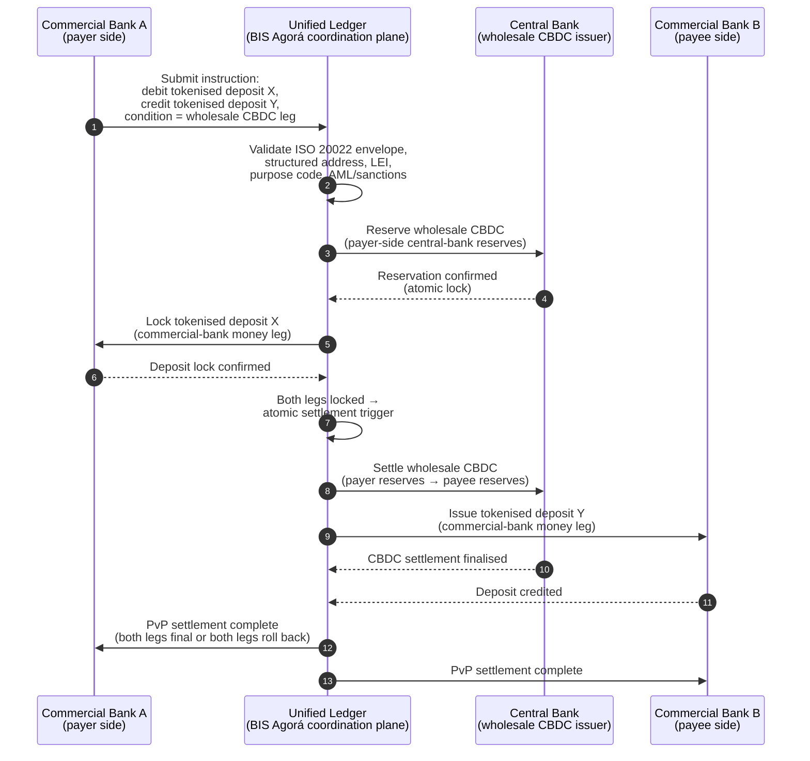

---

# Front Matter (YAML)

author: "contact@sebastienrousseau.com (Sebastien Rousseau)"
banner_alt: "Visual register for the wholesale-payments shift in 2026 — messaging migration giving way to programmable settlement across ISO 20022, tokenised deposits, real-time rails, and cross-border atomicity."
banner_height: "571"
banner_width: "1425"
banner: "https://cloudcdn.pro/stocks/images/miquel-parera-NsXLehhHx1Q.webp"
cdn: "https://cloudcdn.pro"
charset: "UTF-8"
cname: "sebastienrousseau.com"
copyright: "© Copyright 2025 - 2026 - Sebastien Rousseau. All rights reserved."
date: "June 6, 2026"
description: "A 2026 index for wholesale payments readiness, measuring ISO 20022 data quality, tokenised deposits, real-time rails, cross-border settlement, and liquidity efficiency."
excerpt: "An index framework for measuring wholesale-payments readiness in 2026: ISO 20022 structured-address compliance ahead of SWIFT's November 2026 milestone, tokenised-deposit settlement, BIS Project Agorá cross-border atomicity, real-time rail orchestration, and liquidity efficiency. Four percentages — structured-data completeness, rail-routing optimality, settlement-finality lag, and Agorá-corridor coverage — turn payment-operations posture into supervisory-ready evidence."
format-detection: "telephone=no"
hreflang: "en"
icon: "https://cloudcdn.pro/clients/sebastienrousseau/v1/logos/sebastienrousseau.svg"
id: "https://sebastienrousseau.com/2026-06-06-wholesale-payments-index-iso20022-tokenised-deposits-cross-border-2026"
image_alt: "Black and White Portrait of Sebastien Rousseau"
image_height: "162"
image_width: "162"
image: "https://cloudcdn.pro/stocks/images/sebastien-rousseau.png"
keywords: "wholesale payments 2026, ISO 20022, tokenised deposits, Project Agora, cross border payments, real time payments, structured address data, payment data quality"
language: "en-GB"
last_reviewed: "2026-06-06"
layout: "report"
locale: "en_GB"
logo_alt: "Logo for Sebastien Rousseau"
logo_height: "44"
logo_width: "44"
logo: "https://cloudcdn.pro/clients/sebastienrousseau/v1/logos/sebastienrousseau.svg"
menu: ""
measurementID: "G-169G4ET5HQ"
name: "Sebastien Rousseau"
permalink: "https://sebastienrousseau.com/2026-06-06-wholesale-payments-index-iso20022-tokenised-deposits-cross-border-2026"
rating: "general"
referrer: "no-referrer"
robots: "index, follow"
schema: "FAQPage, Article"
seo_title: "The Wholesale Payments Index 2026"
short_name: "sebastienrousseau"
subtitle: "Wholesale payments are moving from messaging migration to programmable settlement; banks need to measure data quality, rail orchestration, liquidity, and finality."
tags: "wholesale payments, ISO 20022, tokenised deposits, cross-border payments, Project Agora, payment data, DORA, post-quantum cryptography, AI, stablecoins, cloud native banking"
theme-color: "0, 83, 191"
title: "The Wholesale Payments Index in 2026: ISO 20022, Tokenised Deposits, Real-Time Rails, and Cross-Border Settlement"
url: "https://sebastienrousseau.com/2026-06-06-wholesale-payments-index-iso20022-tokenised-deposits-cross-border-2026"
viewport: "width=device-width, initial-scale=1, shrink-to-fit=no"

# RSS - The RSS feed front matter (YAML).
atom_link: "https://sebastienrousseau.com/2026-06-06-wholesale-payments-index-iso20022-tokenised-deposits-cross-border-2026/rss.xml"
category: "Finance"
docs: https://validator.w3.org/feed/docs/rss2.html
generator: "Static Site Generator (SSG) (version 0.0.26)"
item_description: "A 2026 index for wholesale payments readiness, measuring ISO 20022 data quality, tokenised deposits, real-time rails, cross-border settlement, and liquidity efficiency."
item_guid: "https://sebastienrousseau.com/2026-06-06-wholesale-payments-index-iso20022-tokenised-deposits-cross-border-2026/rss.xml"
item_link: "https://sebastienrousseau.com/2026-06-06-wholesale-payments-index-iso20022-tokenised-deposits-cross-border-2026/rss.xml"
item_pub_date: "Sat, 06 Jun 2026 06:06:06 +0000"
item_title: "The Wholesale Payments Index in 2026: ISO 20022, Tokenised Deposits, Real-Time Rails, and Cross-Border Settlement"
last_build_date: "Sat, 06 Jun 2026 06:06:06 +0000"
managing_editor: "contact@sebastienrousseau.com (Sebastien Rousseau)"
pub_date: "Sat, 06 Jun 2026 06:06:06 +0000"
ttl: "60"
type: "article"
webmaster: "contact@sebastienrousseau.com"

# Apple - The Apple front matter (YAML).
apple_mobile_web_app_orientations: "portrait"
apple_touch_icon_sizes: "192x192"
apple-mobile-web-app-capable: "yes"
apple-mobile-web-app-status-bar-inset: "black"
apple-mobile-web-app-status-bar-style: "black-translucent"
apple-mobile-web-app-title: "The Wholesale Payments Index 2026"
apple-touch-fullscreen: "yes"

# MS Application - The MS Application front matter (YAML).

msapplication-navbutton-color: "0, 83, 191"

# Twitter Card - The Twitter Card front matter (YAML).

twitter_card: "summary_large_image"
twitter_creator: "@wwdseb"
twitter_description: "A 2026 index for wholesale payments readiness, measuring ISO 20022 data quality, tokenised deposits, real-time rails, cross-border settlement, and liquidity efficiency."
twitter_image: "https://cloudcdn.pro/clients/sebastienrousseau/v1/logos/sebastienrousseau.svg"
twitter_image_alt: "Logo of Sebastien Rousseau"
twitter_site: "@wwdseb"
twitter_title: "The Wholesale Payments Index 2026"
twitter_url: "https://sebastienrousseau.com/2026-06-06-wholesale-payments-index-iso20022-tokenised-deposits-cross-border-2026"

# Humans.txt - The Humans.txt front matter (YAML).
author_website: "https://sebastienrousseau.com"
author_twitter: "@wwdseb"
author_location: "London, UK"
thanks: "Thanks for reading!"
site_last_updated: "2026-06-06"
site_standards: "HTML5, CSS3, RSS, Atom, JSON, XML, YAML, Markdown, TOML"
site_components: "Kaishi, Kaishi Builder, Kaishi CLI, Kaishi Templates, Kaishi Themes"
site_software: "Static Site Generator, Rust"

---

<!-- lead-start: manual -->
<aside class="post-lead" aria-label="Article summary">

<strong>TL;DR.</strong> Wholesale payments in 2026 sit at the intersection of two structural shifts: [ISO 20022](/2023-09-29-automating-iso-20022-compliant-payment-file-creation-with-pain001/index.html) forcing structured payment data into the operating model, and tokenised deposits + BIS Project Agorá moving cross-border settlement toward atomic, programmable, always-on rails. The 2026 question for a bank is no longer "did we migrate the messages" but "are our payment operations measurable, routed, and supervisable" — and the index breaks that into four exact percentages: structured-data completeness, rail-routing optimality, settlement-finality lag, and Agorá-corridor coverage.

<strong>Key takeaways</strong>

<ul class="post-lead-takeaways">
  <li><strong>November 2026 is a hard deadline, not guidance.</strong> SWIFT removes unstructured-address support in SR 2026; payments without a town and country in designated fields stop clearing. Repair cost, reject rate, and operations capacity all move from "metric" to "regulator-visible posture".</li>
  <li><strong>Tokenised deposits beat stablecoins for regulated wholesale.</strong> They preserve the bank-depositor relationship and the central-bank settlement asset while exposing programmability. Stablecoins keep a role at the edge; tokenised deposits anchor the core.</li>
  <li><strong>BIS Project Agorá is the corridor reference.</strong> If a bank's cross-border product can't run inside an Agorá corridor by 2027, it's competing on a rail the rest of the market is already exiting.</li>
  <li><strong>Real-time rail orchestration is the operating model.</strong> The 2026 multi-rail decision (FedNow / RTP / TIPS / SEPA Inst / on-chain) is not "which rail" — it's the policy registry, liquidity profile, and routing engine that picks the rail per payment.</li>
  <li><strong>Measure or be measured.</strong> Four percentages — structured-data completeness, rail-routing optimality, settlement-finality lag, Agorá-corridor coverage — turn payments posture into supervisory-ready evidence ahead of the 2026/27 audit window.</li>
</ul>
</aside>
<!-- lead-end -->

# The Wholesale Payments Index in 2026: ISO 20022, Tokenised Deposits, Real-Time Rails, and Cross-Border Settlement

Wholesale payments in 2026 are being reshaped by two simultaneous shifts: structured payment data and programmable settlement. SWIFT's November 2026 structured-address milestone forces data quality into the operating model, while BIS Project Agorá and tokenised deposits are testing whether cross-border settlement can become more atomic, transparent, and always-on.

---

> **Executive Summary / Key Takeaways**
>
> - **November 2026 is a hard data milestone.** SWIFT says payments containing unstructured addresses will no longer be supported after the SR 2026 change.
> - **Structured data becomes product infrastructure.** Town and country must be in designated fields at minimum, turning payment-data quality into a client, operations, and compliance issue.
> - **Tokenised deposits are a wholesale design option.** Project Agorá explores tokenised commercial bank deposits and tokenised central bank reserves in a unified ledger model.
> - **The index should measure settlement quality, not only speed.** Finality, transparency, repair rates, liquidity usage, compliance data, and client visibility matter as much as instant execution.
> - **Cross-border payments remain a public-private agenda.** The FSB continues to drive the G20 roadmap through implementation, with public and private-sector coordination.
>
---

## Why 2026 Is the Year This Index Matters

The Stanford AI Index is useful because it treats a fast-moving technology field as something that can be measured: research output, technical performance, responsible deployment, economics, sector adoption, policy, and public sentiment are brought into a single frame ([Stanford HAI ⧉](https://hai.stanford.edu/ai-index/2026-ai-index-report "The 2026 AI Index Report")). Banks and financial institutions now need the same discipline for infrastructure. Agentic AI, quantum-safe security, cloud native resilience, and wholesale payments are no longer separate innovation tracks; they are converging into one operating model.

The practical question for a bank is not whether each domain is important. It is whether the institution can measure readiness across all of them at the same time. A bank can deploy agentic AI and still be fragile if its cryptography is not migration-ready. It can modernise cloud platforms and still fail if payment data remains unstructured. It can run tokenisation pilots and still create systemic risk if the settlement, liquidity, identity, and audit layers are not designed together.

## The 2026 Index Architecture

| Index Layer | 2026 Direction | Readiness Metric | Risk if Mishandled |
|---|---|---|---|
| **ISO 20022 data** | Move from unstructured text to governed structured fields | Structured-address readiness and reject rate | Payment rejects and manual repair |
| **Rail orchestration** | Route across RTGS, instant, correspondent, stablecoin, and tokenised rails | Cost, speed, finality, and jurisdiction-aware routing | Fragmented rails with duplicated controls |
| **Tokenised settlement** | Use tokenised deposits and central bank money where they reduce friction | DvP, PvP, atomic settlement coverage | Pilot assets without business workflow value |
| **Liquidity** | Optimise intraday liquidity, trapped cash, and settlement windows | Liquidity saved and settlement-failure reduction | Faster drains on liquidity |
| **Compliance** | Embed AML, sanctions, FATF, and audit requirements into payment data | Straight-through compliance and explainability | Richer data without stronger controls |

## Key Wholesale-Payments Signals Mapped to Global Priorities

The 2026 signal set is not a research agenda. It is a delivery checklist that a bank's Chief Payments Officer is already being measured on. The remediation work shows up in three places: the message envelope, the rail orchestration layer, and the settlement ledger.

| Signal | G20 / SWIFT / BIS Reference | Technical Platform Implementation |
|---|---|---|
| **65 % of payment messages still contain unstructured addresses** | [SWIFT SR 2026 — structured-address milestone, Nov 2026 ⧉](https://www.swift.com/news-events/news/iso-20022-milestone-november-2026-unstructured-addresses-be-removed "ISO 20022 November 2026 structured address milestone") | Schema validation in payment middleware before the message hits the SWIFTNet adapter; automated address parsing at corporate-channel + correspondent-bank ingress. |
| **FSB G20 target: 75 % of cross-border payments completed within 1 hour by 2027** | [FSB cross-border payments roadmap, 2026 implementation phase ⧉](https://www.fsb.org/2026/03/fsb-kicks-off-new-implementation-phase-to-enhance-cross-border-payments-through-public-private-partnership/ "FSB cross-border payments implementation phase") | Real-time FX-conversion gateways with pre-agreed liquidity windows; T+0 confirmation hooks into the client portal; rail-routing engine that excludes any corridor that cannot meet the 1 h envelope. |
| **FSB G20 target: average cross-border transaction cost under 1 %, retail under 3 %** | [FSB G20 quantitative targets ⧉](https://www.fsb.org/2026/03/fsb-kicks-off-new-implementation-phase-to-enhance-cross-border-payments-through-public-private-partnership/ "FSB cross-border payments implementation phase") | Cost-attribution telemetry on every corridor (FX spread, correspondent fee, lifting cost); margin policy registry that surfaces non-compliant pricing before quote. |
| **BIS Project Agorá enters prototype phase across seven central banks + 41 commercial banks** | [BIS Project Agorá ⧉](https://www.bis.org/about/bisih/topics/fmis/agora.htm "Project Agorá") | Unified-ledger integration spec: tokenised-deposit ledger node + wholesale-CBDC settlement plane + KYC/AML hooks; on-chain liquidity pools sized to the bank's corridor share. |
| **Deutsche Bank "digital money" framework crystallises in client architecture** | [Deutsche Bank — Digital Money: stablecoins, tokenised deposits and CBDCs ⧉](https://flow.db.com/publications/flow-white-papers-and-guides/digital-money-a-perspective-on-stablecoins-tokenised-deposits-and-cbdcs "Digital Money: stablecoins, tokenised deposits and CBDCs") | Wallet-agnostic settlement API that abstracts stablecoin / tokenised-deposit / CBDC selection per payment; programmable conditions evaluated against the bank's policy registry, not the client's. |

## The Payment Data Inflection Point

ISO 20022 has moved from a messaging-format project to a data-quality operating model. If beneficiary, debtor, creditor, agent, town, country, purpose, and party data are weak, the bank will experience rejects, repairs, sanctions friction, client frustration, and weak analytics.

**SR 2026 makes this a hard contract, not an advisory.** SWIFT Standards Release 2026 (November 2026) enforces the structured-address rule at the network layer — messages whose `<PstlAdr>` element does not carry `<TwnNm>` and `<Ctry>` will be rejected on receipt by the SWIFTNet validation stack, not flagged for repair. The repair queue stops being a back-office cost line and becomes a settlement-failure event with client-visible delay. Operations teams that have been treating SR 2026 as "tighter guidance" are working from the wrong runbook.

### Structured Payment Data Compliance under ISO 20022

The remediation surface is narrow and well-defined. The XML elements below are where the November 2026 SWIFTNet validation stack actually fails messages; everything else is downstream consequence.

| Data Element | ISO 20022 XML Tag | November 2026 SWIFT Requirement | Technical Remediation Strategy |
|---|---|---|---|
| **Structured Address** | `<PstlAdr>` containing `<TwnNm>` + `<Ctry>` | Mandatory. Unstructured `<AdrLine>` text triggers network rejection at the receiving SWIFTNet adapter. | Automated address parsing at payment initiation; corporate-channel form rewrites; back-book cleansing on every counterparty before next debit. |
| **Legal Entity Identifier (LEI)** | `<Id>` under `<OrgId>` | Highly recommended for non-individual financial counterparty verification; mandatory in several CBPR+ corridors. | LEI lookup + GLEIF cross-check at corporate onboarding; automatic enrichment for back-book counterparties via reference-data services. |
| **Payment Purpose Codes** | `<Purp>` containing `<Cd>` | Mandatory in multiple regional real-time corridors (CBPR+, SEPA Inst, TIPS) for automated AML / sanctions screening. | Map legacy bank-internal transaction codes to the standard ISO 20022 ExternalPurposeCode list; expose purpose selection in the corporate-channel UI; default-deny on unknown codes. |
| **Ultimate Parties** | `<UltmtDbtr>` / `<UltmtCdtr>` | Expose ultimate beneficiary context to satisfy G20 FATF travel-rule + sanctions parameters; mandatory for several payment-type codes. | Extract end-to-end party names from ledger sub-accounts; reconcile against KYC graph; surface ultimate party on every confirmation. |
| **Remittance Information (Structured)** | `<RmtInf><Strd>` with `<RfrdDocInf>` | Required for reconcilable invoice-linked corporate payments under CBPR+ Phase 2. | Capture structured remittance at quote-time in the corporate portal; reject free-text fallback for high-value flows. |

## Tokenised Deposits and Wholesale CBDC

Tokenised deposits preserve the commercial-bank money model while adding programmability. Wholesale central bank money preserves settlement finality. The interesting design pattern is the combination: commercial bank money for client relationships and credit intermediation, central bank money for final settlement and systemic confidence.

Project Agorá makes the combination concrete. The architecture below is the BIS reference pattern for an atomic, payment-versus-payment (PvP) cross-border settlement using both a commercial-bank deposit ledger and a wholesale-CBDC settlement plane, coordinated through a unified ledger.

The settlement is atomic by construction: both legs commit or both roll back. Settlement finality on the wholesale-CBDC leg makes the commercial-bank tokenised-deposit transfer effective without correspondent risk. The unified ledger is the coordination plane, not a payment system in its own right — the central bank still issues the settlement asset and the commercial bank still books the deposit liability.

## The New Wholesale Payment Product

The product is no longer simply a payment. It is a bundle of execution, data, liquidity, compliance, traceability, and exception management. Banks that can expose those capabilities through APIs and client dashboards will turn infrastructure compliance into client value.

## What This Means by Bank Type

### Global Systemically Important Banks

Global banks should treat this index as an enterprise architecture scorecard. The priority is not another proof of concept; it is evidence that autonomous workflows, cryptographic migration, cloud dependency, and payment modernisation can be governed as a single risk and value system.

### Transaction Banks and Corporate Banks

Transaction banks should focus on wholesale payments, structured data, liquidity, tokenised deposits, and agentic treasury services. The most valuable client proposition is not faster money movement alone; it is explainable, auditable, programmable money movement with fewer investigations and better working-capital visibility.

### Regional Banks

Regional banks should use the index to avoid programme sprawl. They do not need to lead every frontier, but they do need credible positions on AI governance, post-quantum inventory, cloud exit evidence, and payment data readiness.

### Fintechs, PSPs, and Infrastructure Providers

Fintechs and infrastructure providers should align their product roadmaps to measurable bank readiness. The best propositions will reduce integration risk, strengthen evidence, and make complex infrastructure easier for banks to govern.

## Conclusion

The value of an index-style report is that it converts a fragmented technology agenda into a measurable operating model. In 2026, the winners in financial infrastructure will not be the institutions with the most pilots. They will be the institutions that can prove readiness across autonomy, security, resilience, settlement, economics, and governance at the same time.

## Frequently Asked Questions

**Why is ISO 20022 still a 2026 issue?**

Because the migration is not complete until payment data is structured, governed, captured at source, and usable across channels, clients, and market infrastructures.

**What is a tokenised deposit?**

A tokenised deposit is a digital representation of commercial bank money, designed to preserve the bank-depositor relationship while enabling programmable settlement.

**Do tokenised deposits replace stablecoins?**

Not everywhere. Stablecoins may remain useful in some digital-asset and cross-border contexts, while tokenised deposits are structurally attractive for regulated wholesale banking.

**What should banks measure?**

Measure structured-data readiness, payment rejects, repair cost, settlement time, liquidity usage, rail routing outcomes, and client visibility.

## References

- SWIFT, (2026). [ISO 20022 November 2026 structured address milestone ⧉](https://www.swift.com/news-events/news/iso-20022-milestone-november-2026-unstructured-addresses-be-removed "ISO 20022 November 2026 structured address milestone").
- BIS Innovation Hub, (2026). [Project Agorá ⧉](https://www.bis.org/about/bisih/topics/fmis/agora.htm "Project Agorá").
- FSB, (2026). [Cross-border payments implementation phase ⧉](https://www.fsb.org/2026/03/fsb-kicks-off-new-implementation-phase-to-enhance-cross-border-payments-through-public-private-partnership/ "Cross-border payments implementation phase").
- Deutsche Bank, (2026). [Digital Money: stablecoins, tokenised deposits and CBDCs ⧉](https://flow.db.com/publications/flow-white-papers-and-guides/digital-money-a-perspective-on-stablecoins-tokenised-deposits-and-cbdcs "Digital Money: stablecoins, tokenised deposits and CBDCs").

<!-- enrich-start -->
<aside class="author-card" aria-label="About the author"><strong class="author-card-name"><a href="/about/index.html">Sebastien Rousseau</a></strong>Senior banking technologist writing on applied AI, ISO 20022 migration, post-quantum cryptography for financial services, and the structural transformation of wholesale payments.20+ years across HSBC Commercial &amp; Investment Bank, PayPal, Barclays, Shazam, AKQA, Virgin Group. <a href="/about/index.html">Full profile</a> &middot; <a href="https://www.linkedin.com/in/sebastienrousseau/" rel="external noopener">LinkedIn</a> &middot; <a href="https://github.com/sebastienrousseau" rel="external noopener">GitHub</a></aside>

Last reviewed <time datetime="2026-06-07">2026-06-07</time>.

<aside class="related-posts" aria-labelledby="related-heading">
<h2 id="related-heading" class="related-heading">Related reading</h2>

<article class="related-card"><footer class="related-body"><h3><a href="https://sebastienrousseau.com/2026-06-02-banking-infrastructure-index-agentic-ai-quantum-cloud-wholesale-payments-2026">The 2026 Banking Infrastructure Index: Measuring Readiness for Agentic AI, Quantum-Safe Security, Cloud Native Resilience, and Wholesale Payments</a></h3>
<time datetime="2026-06-02">2026-06-02</time>
</footer></article>
<article class="related-card"><footer class="related-body"><h3><a href="https://sebastienrousseau.com/2026-05-19-global-wholesale-payments-economics-2026">Global Wholesale Payments in 2026: ISO 20022, RTGS Renewal, and the Economics of Interoperability</a></h3>
<time datetime="2026-05-19">2026-05-19</time>
</footer></article>
<article class="related-card"><footer class="related-body"><h3><a href="https://sebastienrousseau.com/2026-05-28-digital-assets-tokenisation-stablecoins-bank-strategy-infrastructure-transition-2026">Digital Assets in 2026: The Infrastructure Transition Banks Cannot Delay</a></h3>
<time datetime="2026-05-28">2026-05-28</time>
</footer></article>

</aside>
<!-- enrich-end -->
