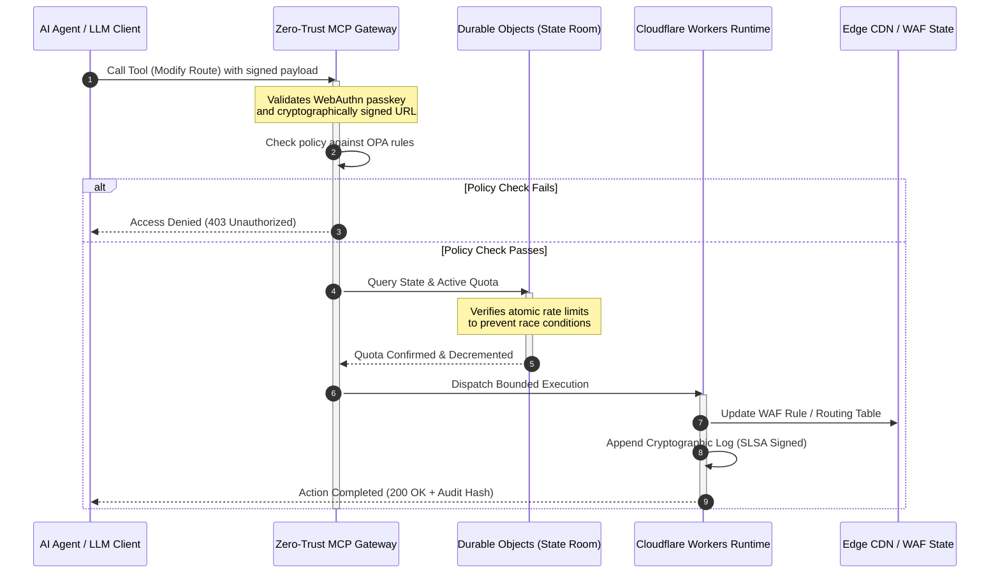

---

# Front Matter (YAML)

author: "contact@sebastienrousseau.com (Sebastien Rousseau)"
banner_alt: "Glowing data-centre rack stack at night — symbolising the inspectable, agent-controllable, open-source edge that CloudCDN is built on"
banner_height: "1597"
banner_width: "2584"
banner: "https://cloudcdn.pro/stocks/images/alis-po-IdVNRv-5wJo.webp"
cdn: "https://cloudcdn.pro"
charset: "UTF-8"
cname: "sebastienrousseau.com"
copyright: "© Copyright 2025 - 2026 - Sebastien Rousseau. All rights reserved."
date: "June 11, 2026"
description: "CloudCDN turns the CDN into a cryptographically secure, agent-controllable edge control plane — zero-trust MCP gateway, Durable Objects, SLSA Level 3, DORA-ready evidence."
format-detection: "telephone=no"
hreflang: "en"
icon: "https://cloudcdn.pro/clients/sebastienrousseau/v1/logos/sebastienrousseau.svg"
id: "https://sebastienrousseau.com/2026-06-11-cloudcdn-open-source-blueprint-ai-native-edge-2026"
image_alt: "Black and White Portrait of Sebastien Rousseau"
image_height: "162"
image_width: "162"
image: "https://cloudcdn.pro/stocks/images/sebastien-rousseau.png"
keywords: "CloudCDN, AI-native edge, open-source CDN, MCP server, Cloudflare Workers, Durable Objects, zero trust, WebAuthn, signed URLs, SLSA Level 3, DORA, edge control plane"
language: "en-GB"
last_reviewed: "2026-06-11"
layout: "report"
locale: "en_GB"
logo_alt: "Logo for Sebastien Rousseau"
logo_height: "44"
logo_width: "44"
logo: "https://cloudcdn.pro/clients/sebastienrousseau/v1/logos/sebastienrousseau.svg"
menu: ""
measurementID: "G-169G4ET5HQ"
name: "Sebastien Rousseau"
permalink: "https://sebastienrousseau.com/2026-06-11-cloudcdn-open-source-blueprint-ai-native-edge-2026"
rating: "general"
referrer: "no-referrer"
robots: "index, follow"
schema: "FAQPage, Article"
seo_title: "CloudCDN: Open-Source AI-Native Edge Blueprint"
short_name: "sebastienrousseau"
subtitle: "Moving the global CDN from static content caching to a cryptographically secure, agent-controllable edge control plane."
tags: "CloudCDN, open source, CDN, edge, AI agents, MCP, Cloudflare Workers, Durable Objects, rate limiting, zero trust, WebAuthn, SLSA, DORA, BCBS 239, Basel III, cloud native banking"
theme-color: "0, 83, 191"
title: "CloudCDN: An Open-Source Blueprint for the AI-Native Edge in 2026"
url: "https://sebastienrousseau.com/2026-06-11-cloudcdn-open-source-blueprint-ai-native-edge-2026"
viewport: "width=device-width, initial-scale=1, shrink-to-fit=no"

# RSS - The RSS feed front matter (YAML).
atom_link: "https://sebastienrousseau.com/2026-06-11-cloudcdn-open-source-blueprint-ai-native-edge-2026/rss.xml"
category: "Technology"
docs: https://validator.w3.org/feed/docs/rss2.html
generator: "Static Site Generator (SSG) (version 0.0.26)"
item_description: "CloudCDN turns the CDN into a cryptographically secure, agent-controllable edge control plane — zero-trust MCP gateway, Durable Objects, SLSA Level 3, DORA-ready evidence."
item_guid: "https://sebastienrousseau.com/2026-06-11-cloudcdn-open-source-blueprint-ai-native-edge-2026/rss.xml"
item_link: "https://sebastienrousseau.com/2026-06-11-cloudcdn-open-source-blueprint-ai-native-edge-2026/rss.xml"
item_pub_date: "Thu, 11 Jun 2026 06:06:06 +0000"
item_title: "CloudCDN: An Open-Source Blueprint for the AI-Native Edge in 2026"
last_build_date: "Thu, 11 Jun 2026 06:06:06 +0000"
managing_editor: "contact@sebastienrousseau.com (Sebastien Rousseau)"
pub_date: "Thu, 11 Jun 2026 06:06:06 +0000"
ttl: "60"
type: "article"
webmaster: "contact@sebastienrousseau.com"

# Apple - The Apple front matter (YAML).
apple_mobile_web_app_orientations: "portrait"
apple_touch_icon_sizes: "192x192"
apple-mobile-web-app-capable: "yes"
apple-mobile-web-app-status-bar-inset: "black"
apple-mobile-web-app-status-bar-style: "black-translucent"
apple-mobile-web-app-title: "CloudCDN: Open-Source AI-Native Edge Blueprint"
apple-touch-fullscreen: "yes"

# MS Application - The MS Application front matter (YAML).

msapplication-navbutton-color: "0, 83, 191"

# Twitter Card - The Twitter Card front matter (YAML).

twitter_card: "summary_large_image"
twitter_creator: "@wwdseb"
twitter_description: "CloudCDN turns the CDN into a cryptographically secure, agent-controllable edge control plane — zero-trust MCP gateway, Durable Objects, SLSA Level 3, DORA-ready evidence."
twitter_image: "https://cloudcdn.pro/clients/sebastienrousseau/v1/logos/sebastienrousseau.svg"
twitter_image_alt: "Logo of Sebastien Rousseau"
twitter_site: "@wwdseb"
twitter_title: "CloudCDN: Open-Source AI-Native Edge Blueprint"
twitter_url: "https://sebastienrousseau.com/2026-06-11-cloudcdn-open-source-blueprint-ai-native-edge-2026"

excerpt: "CloudCDN is an open-source blueprint for the AI-native edge — a zero-trust MCP gateway with 42 tools, atomic Durable Objects rate limiting, WebAuthn passkeys, signed URLs, SLSA Level 3 provenance, and 3,185 tests at 100% coverage, mapped to DORA, BCBS 239, and Basel III."

# Humans.txt - The Humans.txt front matter (YAML).
author_website: "https://sebastienrousseau.com"
author_twitter: "@wwdseb"
author_location: "London, UK"
thanks: "Thanks for reading!"
site_last_updated: "2026-06-11"
site_standards: "HTML5, CSS3, RSS, Atom, JSON, XML, YAML, Markdown, TOML"
site_components: "Kaishi, Kaishi Builder, Kaishi CLI, Kaishi Templates, Kaishi Themes"
site_software: "Static Site Generator, Rust"

---

# CloudCDN: An Open-Source Blueprint for the AI-Native Edge in 2026

<!-- lead-start: manual -->
<aside class="post-lead" aria-label="Article summary">

<strong>TL;DR.</strong> Enterprise technology in 2026 is defined by the convergence of globally distributed serverless execution and agentic AI. Standard CDNs — built for static file caching and basic traffic routing — are structurally obsolete in an era of active, real-time data orchestration. CloudCDN is an open-source blueprint that repurposes the edge into an active control plane: serverless runtimes, stateful coordination through Cloudflare Durable Objects, and a zero-trust Model Context Protocol (MCP) gateway that lets autonomous AI agents operate web infrastructure inside bounded, cryptographically secured operational envelopes.

<strong>Key takeaways</strong>

<ul class="post-lead-takeaways">
  <li><strong>From static cache to bounded control plane.</strong> CloudCDN moves the operational boundary to the edge, converting CDN nodes into active policy gates that execute sub-millisecond security, routing, and access-control decisions.</li>
  <li><strong>Stateful edge coordination.</strong> Cloudflare Durable Objects enforce atomic, real-time rate limiting and state coordination globally — no distributed race conditions, no systemic quota abuse across edge regions.</li>
  <li><strong>Safe agentic infrastructure management via MCP.</strong> A zero-trust gateway exposes 42 specialised MCP tools, letting AI agents inspect, configure, and operate infrastructure under cryptographically signed bounds.</li>
  <li><strong>Supply-chain security as a pipeline deliverable.</strong> SLSA Level 3 build provenance via Sigstore/Cosign and 3,185 unit tests at 100% coverage on every release.</li>
  <li><strong>Board-level evidence, not dashboards.</strong> Edge telemetry maps directly to DORA Article 5 board accountability, BCBS 239 risk reporting, and Basel III operational-risk capital rules.</li>
</ul>

<strong>Related reading:</strong> <a href="https://sebastienrousseau.com/2026-05-16-best-cloud-infrastructure-architecture-2026">The Best Cloud Infrastructure Architecture in 2026: An AI-Native, Multi-Cloud, Quantum-Aware Blueprint for Financial Services</a>, <a href="https://sebastienrousseau.com/2026-06-05-cloud-native-banking-index-dora-resilience-platform-engineering-2026">The Cloud Native Banking Index in 2026: DORA, Platform Engineering, Sovereign Cloud, and Operational Resilience</a>, <a href="https://sebastienrousseau.com/2026-06-03-agentic-ai-index-banks-autonomy-governance-auditability-2026">The Agentic AI Index for Banks in 2026: Measuring Autonomy, Governance, Auditability, and Business Impact</a>.

</aside>
<!-- lead-end -->

The CDN debate is over. The edge is no longer a cache; it is the control plane for AI-native software. As agents call tools, move data, purge caches, request signed URLs, and coordinate workflows, the old model of opaque dashboards and proprietary control planes stops being an inconvenience and becomes a regulatory liability. CloudCDN argues for a different model: an open, inspectable, agent-controllable edge platform that treats security, accessibility, performance, and auditability as enforceable defaults rather than vendor promises.

The open-source reference point for this article is [cloudcdn.pro ⧉](https://github.com/sebastienrousseau/cloudcdn.pro "cloudcdn.pro"). The repository is a multi-tenant, AI-native CDN that can be read end-to-end and deployed independently: sub-100ms TTFB across Cloudflare PoPs, MCP control, Durable Objects rate limiting, WCAG-AA accessibility, signed URLs, passkeys, SLSA Level 3, and 3,185 tests at 100% coverage.

---

> **Executive Summary / Key Takeaways**
>
> - **The edge becomes the operational boundary.** CloudCDN converts standard CDN nodes into active policy gates executing sub-millisecond security, routing, and access control.
> - **Durable Objects make rate limiting atomic.** Real-time, globally consistent quota enforcement closes the race-condition window that eventually consistent limiters leave open to attackers and malfunctioning agents.
> - **Agents operate infrastructure through 42 bounded MCP tools.** Every invocation is validated against WebAuthn passkeys, signed payloads, and OPA policy before anything executes.
> - **The supply chain is part of the product.** SLSA Level 3 provenance via Sigstore/Cosign cryptographically links every release to its audited source.
> - **Telemetry is compliance evidence.** Edge operations map to DORA Article 5, BCBS 239, and Basel III operational-risk capital — directly, not through after-the-fact reporting.
>
---

## Why This Open-Source Project Matters in 2026

Enterprise IT in 2026 has moved from static infrastructure provisioning to real-time, event-driven data orchestration. Two market forces drive the shift.

The first is the proliferation of agentic AI. Autonomous models and software agents now carry out complex operational tasks — automated threat mitigation, routing decisions, real-time ledger balancing. They do not use dashboards. They call tools.

The second is the active enforcement of the [Digital Operational Resilience Act (DORA) ⧉](https://eur-lex.europa.eu/legal-content/EN/TXT/?uri=CELEX%3A32022R2554 "Regulation (EU) 2022/2554 on digital operational resilience for the financial sector"). Banking institutions can no longer rely on opaque, proprietary third-party CDNs. Regulators demand complete visibility into the software supply chain, verifiable exit capability, and unalterable cryptographic audit trails.

Centralised server architectures impose latency penalties that real-time orchestration cannot absorb. Proprietary CDNs function as black boxes that expose institutions to supply-chain compromise they cannot see, let alone evidence. CloudCDN closes that gap with a transparent, zero-trust, open-source blueprint that turns the edge into an active control plane. For technology executives, it shifts the conversation from the cost of compliance to the return on resilience: capital preserved by automated, audit-ready operational pipelines.

## The Architecture Lens

The CloudCDN architecture is structured across five layers, replacing centralised middleware with localised, stateful edge primitives:

| Layer | Design Decision | Why It Matters | Risk if Mishandled |
|---|---|---|---|
| **Edge runtime** | Cloudflare Workers and Pages | Eliminates centralised VM latency; executes sub-millisecond policies globally | Performance gains without policy discipline produce chaotic edge drift |
| **State coordination** | Durable Objects | Guarantees atomic, real-time consistency for rate limits and shared state across regions | Distributed race conditions, API resource abuse, bypassed perimeter quotas |
| **Agent interface** | Zero-trust MCP gateway | Exposes 42 specialised MCP tools so AI agents operate infrastructure under governed bounds | Unbounded tool invocation and unauthorised configuration changes |
| **Access control** | WebAuthn passkeys and signed URLs | Replaces static passwords with cryptographic signatures for auditable operations | Weakly attributed changes; credential theft leading to perimeter breach |
| **Quality gates** | SLSA Level 3 and 100% test coverage | Mathematically verifies build source; blocks malicious dependency injection | Malicious code inserted through the software supply chain |

## Operational Signals to Track

Edge readiness is measurable. These are the quantitative indicators that demonstrate execution capability rather than intent:

| Signal | Metric / Benchmark | Regulatory Reference | Platform Implementation |
|---|---|---|---|
| **42 MCP tools** | Bounded tool-registry count for automated management | COBIT 2019 (BAI06) | MCP gateway validating agent signatures against OPA policies |
| **Durable Objects** | Zero-leak, sub-millisecond atomic quota enforcement | DORA Article 6 | Durable Objects tracking global API quota state |
| **Passkeys and signed URLs** | 100% of admin sessions verified via FIDO2 WebAuthn | DORA Article 30 | Cryptographic signature checks embedded in the edge router |
| **SLSA Level 3** | Cryptographically signed build manifests (Sigstore) | DORA Article 30 | GitHub Actions pipelines generating signed build metadata |
| **3,185 unit tests** | 100% coverage; regression gates on every release | NIST CSF 2.0 (PR.DS-01) | CI pipelines halting deployment on any test failure |

## The CDN Becomes an Active Control Plane

Traditional CDNs were designed around passive, static content acceleration. CloudCDN redefines the model. With Cloudflare Workers and Durable Objects integrated, the edge functions as an active, stateful policy gate.

When an AI agent or automated process requests an infrastructure configuration change or a routing adjustment, it does not talk to a vulnerable, centralised database. The request is intercepted at the nearest edge node and walked through identity, policy, and quota checks before anything executes:

Every step in that sequence produces an attributable, signed record. That is the difference between a CDN that accelerates content and a control plane that can be governed.

## Why Open Source Changes the Trust Model

For Chief Information Security Officers, opaque proprietary CDNs present a compounding risk. Closed-source edge networks are black boxes: if the vendor suffers an internal compromise, the bank has zero visibility until the breach is publicly disclosed.

CloudCDN replaces that asymmetry with a fully auditable, open-source trust model built on three mechanisms:

1. **Mathematical build provenance.** Under SLSA Level 3, every release is cryptographically linked to its open-source GitHub repository. A CISO can verify — mathematically, not contractually — that the binary running on Cloudflare's global edge nodes contains exactly the audited source code.
2. **Continuous, public security audits.** The codebase is subjected to automated scans, public vulnerability disclosure, and peer-reviewed code audits. Obscurity is not a control; review is.
3. **No vendor lock-in (DORA Article 28).** DORA requires banks to prove a clear, tested exit strategy from critical third-party providers. Because CloudCDN is open source and built on standard serverless primitives, institutions can migrate edge configurations from Cloudflare to other serverless runtimes or private Kubernetes clusters — and evidence that capability to the regulator.

## The Bank-Grade Edge Pattern

CloudCDN is engineered to meet the compliance standards of the global financial sector, mapping technical edge operations directly to the frameworks supervisors actually examine:

- **Model risk management ([US Fed SR 11-7 ⧉](https://www.federalreserve.gov/supervisionreg/srletters/sr1107.htm "Supervisory Guidance on Model Risk Management") / UK PRA SS1/23).** Autonomous models executing operational tasks fall under model-risk governance. CloudCDN's MCP gateway treats agentic tools as quantitative models: strict policy bounds, real-time logging, and mandatory human-in-the-loop overrides for high-impact actions.
- **BCBS 239 (risk data aggregation).** By capturing, tagging, and structuring transaction data at the edge, operational metrics are generated in real time — matching BCBS 239 requirements for data integrity, timeliness, and regulatory traceability.
- **DORA Article 5 (board accountability).** The board bears ultimate personal liability for operational resilience. CloudCDN translates edge telemetry into quantified, verifiable evidence that non-technical directors can take into a personal-liability audit.
- **Basel III operational-risk capital.** Banks hold regulatory capital against operational risk. Automated DR failover and SLSA Level 3 provenance reduce the institution's operational risk profile — preserving capital on the balance sheet, not just satisfying an audit.

## What This Means by Bank Type

### Global Systemically Important Banks (G-SIBs)

G-SIBs run massive transaction volumes across multiple jurisdictions. The priority is replacing fragmented legacy perimeter controls with a single, unified edge plane. Deploying the CloudCDN pattern lets a G-SIB standardise security policies, API gateways, and agentic governance globally — and generate DORA-compliant evidence pipelines as a by-product of operation rather than a quarterly scramble.

### Transaction and Corporate Banks

For transaction banks, the client-facing product is a bundle of execution speed, security, and data transparency. The CloudCDN pattern lets these banks expose secure API dashboards and real-time cash-tracking services to corporate treasurers — a resilient edge posture that defends enterprise deposits.

### Regional and Smaller Banks

Regional banks face the same threat actors as G-SIBs without the engineering budgets. An open-source, bank-grade edge blueprint provides the controls out of the box: immediate regulatory alignment without proprietary licence costs, and the source code to prove it.

## The Boardroom Playbook

Operational resilience is no longer an invisible back-office IT metric; it is a boardroom priority with personal liability attached. The institutions that keep the trust of regulators, clients, and shareholders in 2026 treat technology as a verifiable, observable asset.

The roadmap for senior technology leaders is short:

1. **Mandate evidence as a product.** Budget for automated, self-documenting pipelines at the edge — evidence generated by operation, not assembled for the auditor.
2. **Move to stateful edge control.** Take rate limiting, WAF, and identity verification off centralised servers and onto atomic edge primitives.
3. **Establish cryptographic agentic bounds.** Enforce zero-trust MCP gateways with passkey and OPA validation for every automated tool invocation.
4. **Require open-source build audits.** Make SLSA Level 3 build provenance a condition of deployment, not an aspiration.

## Frequently Asked Questions

**Is CloudCDN ready for DORA audits?**

Yes. CloudCDN is engineered to produce automated compliance evidence that maps directly to the ITS templates on the Register of Information (RT.01 to RT.15) and DORA Article 30 contractual clauses.

**What is the advantage of using Durable Objects for rate limiting?**

Traditional distributed rate limiters rely on eventual consistency, which leaves a latency window that attackers or malfunctioning agents can exploit. Durable Objects guarantee immediate, atomic consistency globally, closing the race-condition window entirely.

**What makes CloudCDN AI-native?**

Its MCP-controlled operations and agent-aware control model. Infrastructure is operated through 42 governed tools with cryptographic identity and policy bounds — designed for autonomous workflows, not only human dashboards.

**Does open-source code increase the risk of zero-day exploits?**

No. Proprietary, closed-source CDNs rely on security through obscurity. CloudCDN's codebase is continuously subjected to automated testing, public peer review, and SLSA Level 3 validation — a verifiably higher trust threshold.

## References

- European Parliament and Council of the European Union, (2022). [Regulation (EU) 2022/2554 on digital operational resilience for the financial sector (DORA) ⧉](https://eur-lex.europa.eu/legal-content/EN/TXT/?uri=CELEX%3A32022R2554 "Regulation (EU) 2022/2554 on digital operational resilience for the financial sector (DORA)"). Brussels: Official Journal of the European Union.
- Basel Committee on Banking Supervision (BCBS), (2013). [Principles for effective risk data aggregation and risk reporting (BCBS 239) ⧉](https://www.bis.org/publ/bcbs239.htm "Principles for effective risk data aggregation and risk reporting (BCBS 239)"). Basel: Bank for International Settlements.
- Board of Governors of the Federal Reserve System, (2011). [Supervisory Guidance on Model Risk Management (SR Letter 11-7) ⧉](https://www.federalreserve.gov/supervisionreg/srletters/sr1107.htm "Supervisory Guidance on Model Risk Management (SR Letter 11-7)"). Washington D.C.: Federal Reserve.
- Cloudflare, (2026). [Durable Objects documentation: stateful edge coordination ⧉](https://developers.cloudflare.com/durable-objects/ "Durable Objects documentation"). San Francisco: Cloudflare.
- Cloudflare, (2026). [Building AI agents with MCP, authentication and Durable Objects ⧉](https://blog.cloudflare.com/building-ai-agents-with-mcp-authn-authz-and-durable-objects/ "Building AI agents with MCP, authentication and Durable Objects").
- GitHub, (2026). [cloudcdn.pro repository ⧉](https://github.com/sebastienrousseau/cloudcdn.pro "cloudcdn.pro repository").

<!-- enrich-start -->
<aside class="author-card" aria-label="About the author"><strong class="author-card-name"><a href="/about/index.html">Sebastien Rousseau</a></strong>Senior banking technologist writing on applied AI, ISO 20022 migration, post-quantum cryptography for financial services, and the structural transformation of wholesale payments.20+ years across HSBC Commercial &amp; Investment Bank, PayPal, Barclays, Shazam, AKQA, Virgin Group. <a href="/about/index.html">Full profile</a> &middot; <a href="https://www.linkedin.com/in/sebastienrousseau/" rel="external noopener">LinkedIn</a> &middot; <a href="https://github.com/sebastienrousseau" rel="external noopener">GitHub</a></aside>

Last reviewed <time datetime="2026-06-23">2026-06-23</time>.

<aside class="related-posts" aria-labelledby="related-heading">
<h2 id="related-heading" class="related-heading">Related reading</h2>

<article class="related-card"><footer class="related-body"><h3><a href="https://sebastienrousseau.com/2026-06-18-noyalib-safe-yaml-rust-ai-mcp-financial-infrastructure-2026">Why YAML Needs a Safer Rust Stack for AI, MCP, and Financial Infrastructure in 2026</a></h3>
<time datetime="2026-06-18">2026-06-18</time>
</footer></article>
<article class="related-card"><footer class="related-body"><h3><a href="https://sebastienrousseau.com/2026-05-16-best-cloud-infrastructure-architecture-2026">The Best Cloud Infrastructure Architecture in 2026: An AI-Native, Multi-Cloud, Quantum-Aware Blueprint for Financial Services</a></h3>
<time datetime="2026-05-16">2026-05-16</time>
</footer></article>
<article class="related-card"><footer class="related-body"><h3><a href="https://sebastienrousseau.com/2026-06-12-kyberlib-post-quantum-banking-migration-standards-code-2026">KyberLib and the Post-Quantum Banking Migration in 2026: From Standards to Code</a></h3>
<time datetime="2026-06-12">2026-06-12</time>
</footer></article>

</aside>
<!-- enrich-end -->
