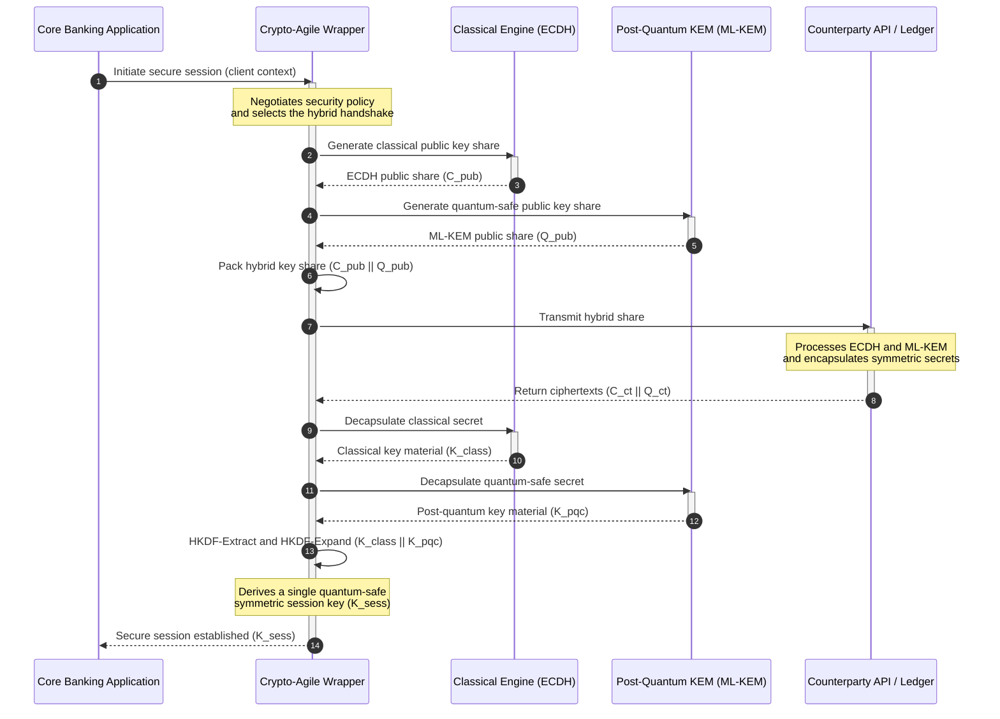

---

# Front Matter (YAML)

author: "contact@sebastienrousseau.com (Sebastien Rousseau)"
banner_alt: "Aerial view of the City of London at dusk — symbolising the post-quantum migration banks must run from NIST standards into inspectable cryptographic code"
banner_height: "1597"
banner_width: "2584"
banner: "https://cloudcdn.pro/stocks/images/ben-o-bro-wpU4veNGnHg.webp"
cdn: "https://cloudcdn.pro"
charset: "UTF-8"
cname: "sebastienrousseau.com"
copyright: "© Copyright 2025 - 2026 - Sebastien Rousseau. All rights reserved."
date: "June 12, 2026"
description: "KyberLib turns post-quantum banking migration into inspectable, memory-safe Rust — FIPS 203 ML-KEM, hybrid handshakes, and crypto-agile boundaries."
format-detection: "telephone=no"
hreflang: "en"
icon: "https://cloudcdn.pro/clients/sebastienrousseau/v1/logos/sebastienrousseau.svg"
id: "https://sebastienrousseau.com/2026-06-12-kyberlib-post-quantum-banking-migration-standards-code-2026"
image_alt: "Black and White Portrait of Sebastien Rousseau"
image_height: "162"
image_width: "162"
image: "https://cloudcdn.pro/stocks/images/sebastienrousseau.webp"
keywords: "KyberLib, post-quantum cryptography, ML-KEM, FIPS 203, CRYSTALS-Kyber, crypto-agility, hybrid key exchange, Rust cryptography, store now decrypt later, DORA, NIST SP 1800-38, quantum safe banking"
language: "en-GB"
last_reviewed: "2026-06-12"
layout: "report"
locale: "en_GB"
logo_alt: "Logo for Sebastien Rousseau"
logo_height: "44"
logo_width: "44"
logo: "https://cloudcdn.pro/clients/sebastienrousseau/v1/logos/sebastienrousseau.svg"
menu: ""
measurementID: "G-169G4ET5HQ"
name: "Sebastien Rousseau"
permalink: "https://sebastienrousseau.com/2026-06-12-kyberlib-post-quantum-banking-migration-standards-code-2026"
rating: "general"
referrer: "no-referrer"
robots: "index, follow"
schema: "FAQPage, Article"
seo_title: "KyberLib and Post-Quantum Banking Migration"
short_name: "sebastienrousseau"
subtitle: "Moving banking cryptography from legacy RSA and ECC to NIST-standardised post-quantum primitives through inspectable, memory-safe, crypto-agile Rust."
tags: "KyberLib, post-quantum cryptography, quantum-safe banking, Rust, ML-KEM, FIPS 203, CRYSTALS-Kyber, crypto-agility, hybrid key exchange, SNDL, DORA, SR 11-7, Basel III, open source"
theme-color: "0, 83, 191"
title: "KyberLib and the Post-Quantum Banking Migration in 2026: From Standards to Code"
url: "https://sebastienrousseau.com/2026-06-12-kyberlib-post-quantum-banking-migration-standards-code-2026"
viewport: "width=device-width, initial-scale=1, shrink-to-fit=no"

# RSS - The RSS feed front matter (YAML).
atom_link: "https://sebastienrousseau.com/2026-06-12-kyberlib-post-quantum-banking-migration-standards-code-2026/rss.xml"
category: "Security"
docs: https://validator.w3.org/feed/docs/rss2.html
generator: "Static Site Generator (SSG) (version 0.0.26)"
item_description: "KyberLib turns post-quantum banking migration into inspectable, memory-safe Rust — FIPS 203 ML-KEM, hybrid handshakes, and crypto-agile boundaries."
item_guid: "https://sebastienrousseau.com/2026-06-12-kyberlib-post-quantum-banking-migration-standards-code-2026/rss.xml"
item_link: "https://sebastienrousseau.com/2026-06-12-kyberlib-post-quantum-banking-migration-standards-code-2026/rss.xml"
item_pub_date: "Fri, 12 Jun 2026 06:06:06 +0000"
item_title: "KyberLib and the Post-Quantum Banking Migration in 2026: From Standards to Code"
last_build_date: "Fri, 12 Jun 2026 06:06:06 +0000"
managing_editor: "contact@sebastienrousseau.com (Sebastien Rousseau)"
pub_date: "Fri, 12 Jun 2026 06:06:06 +0000"
ttl: "60"
type: "article"
webmaster: "contact@sebastienrousseau.com"

# Apple - The Apple front matter (YAML).
apple_mobile_web_app_orientations: "portrait"
apple_touch_icon_sizes: "192x192"
apple-mobile-web-app-capable: "yes"
apple-mobile-web-app-status-bar-inset: "black"
apple-mobile-web-app-status-bar-style: "black-translucent"
apple-mobile-web-app-title: "KyberLib and Post-Quantum Banking Migration"
apple-touch-fullscreen: "yes"

# MS Application - The MS Application front matter (YAML).

msapplication-navbutton-color: "0, 83, 191"

# Twitter Card - The Twitter Card front matter (YAML).

twitter_card: "summary_large_image"
twitter_creator: "@wwdseb"
twitter_description: "KyberLib turns post-quantum banking migration into inspectable, memory-safe Rust — FIPS 203 ML-KEM, hybrid handshakes, and crypto-agile boundaries."
twitter_image: "https://cloudcdn.pro/clients/sebastienrousseau/v1/logos/sebastienrousseau.svg"
twitter_image_alt: "Logo of Sebastien Rousseau"
twitter_site: "@wwdseb"
twitter_title: "KyberLib and Post-Quantum Banking Migration"
twitter_url: "https://sebastienrousseau.com/2026-06-12-kyberlib-post-quantum-banking-migration-standards-code-2026"

excerpt: "KyberLib turns the post-quantum banking migration from policy paper into inspectable Rust — FIPS 203 ML-KEM key encapsulation, hybrid classical-plus-quantum handshakes, no_std compilation for HSMs, crypto-agile abstraction boundaries, and the DORA Article 5 governance evidence boards now need."

# Humans.txt - The Humans.txt front matter (YAML).
author_website: "https://sebastienrousseau.com"
author_twitter: "@wwdseb"
author_location: "London, UK"
thanks: "Thanks for reading!"
site_last_updated: "2026-06-12"
site_standards: "HTML5, CSS3, RSS, Atom, JSON, XML, YAML, Markdown, TOML"
site_components: "Kaishi, Kaishi Builder, Kaishi CLI, Kaishi Templates, Kaishi Themes"
site_software: "Static Site Generator, Rust"

---

# KyberLib and the Post-Quantum Banking Migration in 2026: From Standards to Code

<!-- lead-start: manual -->
<aside class="post-lead" aria-label="Article summary">

<strong>TL;DR.</strong> Banking infrastructure in 2026 faces a systemic threat with a known endpoint: quantum-scale computation will break the RSA and ECC key exchange that protects today's transit traffic. Federal standards and supervisory policy papers have raised awareness; the technical execution remains siloed. <a href="https://github.com/sebastienrousseau/kyberlib">KyberLib</a> is an open-source engineering blueprint that moves the post-quantum narrative into concrete, memory-safe Rust code — implementing NIST-standardised ML-KEM (FIPS 203) behind crypto-agile abstraction boundaries, so institutions can upgrade transport security and key encapsulation before "Store Now, Decrypt Later" attacks reach their archives.

<strong>Key takeaways</strong>

<ul class="post-lead-takeaways">
  <li><strong>From policy to inspectable code.</strong> KyberLib moves post-quantum cryptography from abstract strategic roadmaps into concrete, high-performance, auditable Rust implementations.</li>
  <li><strong>Standardised FIPS 203 ML-KEM execution.</strong> The library implements ML-KEM — the key-establishment algorithm finalised under NIST FIPS 203 — keeping conformance aligned with global regulatory expectations.</li>
  <li><strong>Crypto-agility by design.</strong> Stable abstraction boundaries let banking applications swap cryptographic primitives without expensive, error-prone application rewrites.</li>
  <li><strong>Rust-powered memory safety.</strong> Compile-time ownership rules eradicate the buffer overflows and memory leaks that plague legacy C-based cryptographic libraries, at zero-cost-abstraction speed.</li>
  <li><strong>Fiduciary liability mitigation.</strong> Observable, testable migration evidence gives directors the "reasonable steps" record DORA Article 5 personal-accountability audits demand.</li>
</ul>

<strong>Related reading:</strong> <a href="https://sebastienrousseau.com/2023-11-28-kyberlib-a-rust-powered-shield-against-quantum-threats/index.html">KyberLib: Rust CRYSTALS-Kyber for Post-Quantum</a>, <a href="https://sebastienrousseau.com/2026-05-18-quantum-cryptography-standards-developments-2026">The Quantum Cryptography Reset in 2026: PQC Standards, QKD Assurance, and the Migration Work Banks Cannot Defer</a>, <a href="https://sebastienrousseau.com/2026-05-14-securing-the-ledger-post-quantum-migration-corporate-finance">Securing the Ledger: A Board-Level Guide to Post-Quantum Migration for Corporate Finance</a>.

</aside>
<!-- lead-end -->

The post-quantum migration stopped being a planning exercise. In 2026 it is an active operational requirement, and the gap between regulatory intent and engineering execution is where the risk now sits. [KyberLib ⧉](https://github.com/sebastienrousseau/kyberlib "kyberlib") closes part of that gap: a production-oriented, memory-safe Rust library that implements ML-KEM to the finalised FIPS 203 parameters and wraps it in the crypto-agile boundaries a bank's transactional estate actually needs.

---

> **Executive Summary / Key Takeaways**
>
> - **The threat is already operational.** Adversaries run "Store Now, Decrypt Later" harvesting today; data confidentiality fails retroactively the day a cryptographically relevant quantum computer arrives.
> - **The standards are finalised.** NIST FIPS 203 (ML-KEM) and FIPS 204 (ML-DSA) give audit committees a clear, testable benchmark — there is no longer a "waiting for standards" defence.
> - **KyberLib is the engineering blueprint.** Memory-safe Rust, `no_std` compilation for HSMs and smart cards, and hybrid handshake patterns that preserve classical interoperability.
> - **Crypto-agility is the durable objective.** Stable abstraction boundaries let primitives change without application rewrites — the lesson that outlives any single algorithm.
> - **Boards carry the liability.** DORA Article 5 places personal responsibility on directors; inspectable, observable migration code is the evidence that satisfies it.
>
---

## Why This Open-Source Project Matters in 2026

As asymmetric cryptography approaches obsolescence, the threat does not wait for a cryptographically relevant quantum computer to be built. Adversaries are executing **"Store Now, Decrypt Later" (SNDL)** attacks now — harvesting encrypted transit streams of corporate bank transactions, trade secrets, and institutional communications with the intent to decrypt them once quantum capabilities mature. For a bank, every classical handshake on the wire today is a confidentiality breach with a delayed detonation date.

Regulators have responded with concrete obligations:

1. **DORA Article 6 (ICT risk management)** requires institutions to map, identify, and mitigate vulnerabilities across their cryptographic estate — including the asymmetric key exchange buried in middleware nobody has inventoried.
2. **NIST FIPS 203 and 204** establish the official post-quantum standards for key encapsulation (ML-KEM) and digital signatures (ML-DSA), giving audit committees a standardised benchmark against which migration progress is measured.

Executing this migration without disrupting live operations requires moving beyond policy papers to **inspectable, open-source cryptographic infrastructure**. [KyberLib ⧉](https://github.com/sebastienrousseau/kyberlib "kyberlib") delivers exactly that: a memory-safe Rust library conforming to FIPS 203 that turns the post-quantum transition into a measurable, verifiable engineering pipeline — and shifts the technology investment conversation towards a tangible Return on Resilience.

## The Architecture Lens

KyberLib sits behind stable API boundaries, insulating a bank's core transactional applications from changes in low-level cryptographic primitives.

| Layer | Design Decision | Why It Matters | Risk if Mishandled |
|---|---|---|---|
| **Primitive** | FIPS 203 ML-KEM key encapsulation | Replaces classical Diffie-Hellman and RSA key exchange with lattice-based structures | Non-conformance with finalised FIPS 203 parameters, leading to failed compliance audits |
| **Language** | Memory-safe Rust implementation | Eliminates the memory-corruption vulnerabilities (buffer overflows, use-after-free) endemic to C/C++ | Dependency sprawl compromising build-chain integrity |
| **Abstraction** | Stable crypto-agile boundaries | Applications switch algorithms behind a unified interface as standards evolve | Hard-coded primitives forcing manual rewrites in every future migration |
| **Deployment** | Hybrid encryption handshakes | Combines post-quantum KEMs with classical algorithms in a dual-wrapped envelope | Loss of legacy interoperability or silent configuration drift |
| **Assurance** | SLSA Level 3 provenance and inspectable tests | Guarantees code source and provenance; examples can be audited line by line | Security theatre — black-box libraries whose implementation errors surface in production |

## Operational Signals to Track

Demonstrating post-quantum compliance to supervisory boards and regulators means tracking specific, quantifiable metrics:

| Signal | Metric | Regulatory Reference | Platform Implementation |
|---|---|---|---|
| **FIPS 203 ML-KEM conformance** | 100% compliance with finalised parameters (ML-KEM-512/768/1024) | NIST FIPS 203 | Parameter-verified lattice cryptography compiled inside KyberLib modules |
| **Cryptographic inventory** | Complete inventory of asymmetric key-exchange usage across all systems | NIST SP 1800-38 | Automated scanning agents logging active cipher suites to a central registry |
| **Hybrid key exchange** | Percentage of transport-layer handshakes executing in a hybrid envelope | DORA Article 6 | Network proxies wrapping classical TLS 1.3 handshakes in PQC encapsulation |
| **`no_std` compilation** | Ability to compile without Rust's standard library for constrained targets | DORA Article 30 | Conditional `no_std` compilation in KyberLib for Hardware Security Modules |
| **Crypto-agility index** | Time in minutes to swap a cryptographic primitive across the API gateway | UK PRA SS1/23 | Abstracted routing registries managing algorithm allocation via runtime variables |

## Why Rust Matters for Post-Quantum Cryptography

Implementing post-quantum algorithms such as ML-KEM requires complex, low-level mathematical operations on polynomial rings. Historically, running those operations at production speed meant hand-written C/C++ or assembly — a large attack surface for memory corruption, in precisely the code a bank can least afford to get wrong.

Rust changes the security posture of cryptographic engineering in three concrete ways:

1. **Compile-time memory safety.** Rust's ownership model guarantees that buffer overflows, double frees, and use-after-free errors are prevented at compile time. That matters acutely for post-quantum libraries, where key sizes and ciphertexts are significantly larger than their classical counterparts.
2. **Deterministic, zero-cost abstractions.** Rust compiles to native machine code without a garbage collector, so execution speed and memory footprint match or exceed C-based libraries while preserving safety.
3. **`no_std` compatibility.** KyberLib compiles without Rust's standard library, so it runs in constrained, bare-metal environments — Hardware Security Modules and smart cards included — keeping bank-grade cryptography inside physical security boundaries.

## Designing a Crypto-Agile Architecture

The classic failure mode in cryptographic migrations is hard-coding: algorithm-specific assumptions embedded directly in application logic, rediscovered painfully at every transition. The durable objective for 2026 is **crypto-agility** — an abstraction layer that treats algorithms as swappable modules behind a stable interface, so the next migration is a configuration change rather than an estate-wide rewrite.

The sequence below shows how KyberLib's crypto-agile wrapper coordinates a hybrid (classical plus post-quantum) key-exchange handshake:

The hybrid envelope is the operationally important detail. Until post-quantum primitives accumulate years of production scrutiny, the session key derives from both the classical and the post-quantum secret: an attacker must break ECDH **and** ML-KEM to recover the channel. Counterparties that have not migrated keep working; counterparties that have gain lattice-based protection immediately.

## The Boardroom Playbook

Post-quantum security is not a back-office encryption concern; it is a boardroom governance issue with personal stakes. Senior managers should frame the migration through fiduciary responsibility:

- **DORA Article 5 (governance and organisation)** places personal responsibility for ICT security on the board of directors. Open-source, observable tests are the direct evidence a personal-liability audit asks for — "we selected an inspectable FIPS 203 implementation and here are its conformance runs" is a defensible answer; "our vendor assured us" is not.
- **Model risk management (US Fed SR 11-7 / UK PRA SS1/23)** applies to cryptographic wrapper architectures as much as to pricing models. Abstraction layers should pass through MRM validation, including performance under extreme disruption scenarios.
- **Basel III operational-risk capital** rewards demonstrated control maturity. Tested hybrid handshakes lower the institution's long-term operational risk profile, trimming the capital premium and releasing balance-sheet capacity for active treasury deployment.

## What This Means by Bank Type

### Global Systemically Important Banks (G-SIBs)

G-SIBs run legacy-heavy transactional estates, so their binding constraint is discovery: knowing where asymmetric key exchange actually happens. Continuous cryptographic inventories under NIST SP 1800-38 guidance come first; KyberLib then provides the standardised, memory-safe library for executing post-quantum key encapsulation across every modern node the inventory surfaces.

### Transaction and Corporate Banks

Confidentiality across payment rails is the franchise. Because KyberLib compiles to bare-metal `no_std` targets, transaction banks can deploy post-quantum handshakes directly inside edge payment-routing and liquidity-management hardware — not just in the application tier.

### Regional and Smaller Banks

Regional institutions face the same state-sponsored harvesting without G-SIB research budgets. An inspectable, open-source Rust implementation gives them a turn-key path to NIST FIPS 203 conformance immediately, without negotiating black-box vendor roadmaps.

## From Roadmaps to Compiling Code

The post-quantum transition is an active engineering task, and the institutions that keep the trust of supervisors, counterparties, and corporate treasurers through 2026 are the ones that move from abstract roadmaps to observable, compiling code. The executive mandate follows directly: audit the legacy key-exchange points, deploy hybrid handshakes on the highest-value channels, and build the stable abstraction boundaries that make every future primitive swap routine. KyberLib makes each of those steps a measurable operational capability rather than a slideware commitment.

## Frequently Asked Questions

**Is KyberLib compliant with the finalised NIST standards?**

Yes. KyberLib is designed around the parameters of ML-KEM as finalised in FIPS 203, keeping the compiled library aligned with federal and global regulatory expectations.

**Does a post-quantum library require specialised hardware?**

No. KyberLib's Rust implementation compiles to standard system architectures. Its `no_std` capability additionally lets it run on specialised Hardware Security Modules and smart cards where physical key custody is required.

**How does "Store Now, Decrypt Later" affect current compliance?**

If the transport layer relies on classical RSA or ECC, adversaries can harvest traffic today and decrypt it once quantum capability matures. Hybrid key exchange deployed now keeps captured data behind lattice-based protection.

**Why hybrid handshakes instead of moving straight to post-quantum primitives?**

Hybrid envelopes derive the session key from both a classical and a post-quantum secret, so security holds unless both are broken. That preserves interoperability with unmigrated counterparties while the new primitives accumulate production scrutiny.

## References

- National Institute of Standards and Technology, (2024). [FIPS 203: Module-Lattice-Based Key-Encapsulation Mechanism Standard ⧉](https://www.nist.gov/news-events/news/2024/08/nist-releases-first-3-finalized-post-quantum-encryption-standards "NIST FIPS 203 announcement").
- Board of Governors of the Federal Reserve System, (2011). [Supervisory Guidance on Model Risk Management (SR Letter 11-7) ⧉](https://web.archive.org/web/20260414150921/https://www.federalreserve.gov/supervisionreg/srletters/sr1107.htm "Federal Reserve SR 11-7").
- European Parliament and Council of the European Union, (2022). [Regulation (EU) 2022/2554 on digital operational resilience for the financial sector (DORA) ⧉](https://eur-lex.europa.eu/legal-content/EN/TXT/?uri=CELEX%3A32022R2554 "DORA Regulation").
- NIST National Cybersecurity Center of Excellence, (2025). [Migration to Post-Quantum Cryptography (NIST SP 1800-38) ⧉](https://www.nccoe.nist.gov/projects/migration-post-quantum-cryptography "NIST SP 1800-38").
- GitHub, (2026). [kyberlib open-source repository ⧉](https://github.com/sebastienrousseau/kyberlib "kyberlib repository").

<!-- enrich-start -->
<aside class="author-card" aria-label="About the author"><strong class="author-card-name"><a href="/about/index.html">Sebastien Rousseau</a></strong>Senior banking technologist writing on applied AI, ISO 20022 migration, post-quantum cryptography for financial services, and the structural transformation of wholesale payments.20+ years across HSBC Commercial &amp; Investment Bank, PayPal, Barclays, Shazam, AKQA, Virgin Group. <a href="/about/index.html">Full profile</a> &middot; <a href="https://www.linkedin.com/in/sebastienrousseau/" rel="external noopener">LinkedIn</a> &middot; <a href="https://github.com/sebastienrousseau" rel="external noopener">GitHub</a></aside>

Last reviewed <time datetime="2026-06-23">2026-06-23</time>.

<aside class="related-posts" aria-labelledby="related-heading">
<h2 id="related-heading" class="related-heading">Related reading</h2>

<article class="related-card"><footer class="related-body"><h3><a href="https://sebastienrousseau.com/2026-05-14-securing-the-ledger-post-quantum-migration-corporate-finance">Securing the Ledger: A Board-Level Guide to Post-Quantum Migration for Corporate Finance</a></h3>
<time datetime="2026-05-14">2026-05-14</time>
</footer></article>
<article class="related-card"><footer class="related-body"><h3><a href="https://sebastienrousseau.com/2026-06-04-quantum-safe-banking-index-pqc-qkd-crypto-agility-2026">The Quantum-Safe Banking Index in 2026: Post-Quantum Cryptography, QKD, Crypto-Agility, and Harvest-Now-Decrypt-Later Risk</a></h3>
<time datetime="2026-06-04">2026-06-04</time>
</footer></article>
<article class="related-card"><footer class="related-body"><h3><a href="https://sebastienrousseau.com/2026-05-31-post-quantum-payments-infrastructure-replace-rather-than-retrofit-2026">Post-Quantum Payments Infrastructure: Why Banks May Replace Rather Than Retrofit Legacy Rails</a></h3>
<time datetime="2026-05-31">2026-05-31</time>
</footer></article>

</aside>
<!-- enrich-end -->
