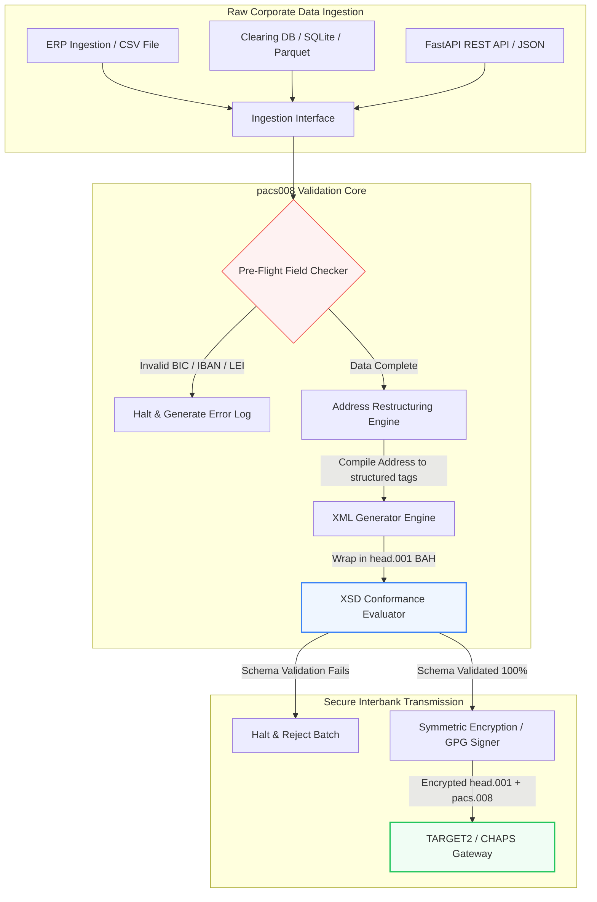

---

# Front Matter (YAML)

author: "contact@sebastienrousseau.com (Sebastien Rousseau)"
banner_alt: "Office worker with voice assistant and laptop — symbolising the structured, machine-readable interbank payment messages that pacs.008 automation makes programmable"
banner_height: "1597"
banner_width: "2584"
banner: "https://cloudcdn.pro/stocks/images/tyler-prahm-lmV3gJSAgbo.webp"
cdn: "https://cloudcdn.pro"
charset: "UTF-8"
cname: "sebastienrousseau.com"
copyright: "© Copyright 2025 - 2026 - Sebastien Rousseau. All rights reserved."
date: "June 15, 2026"
description: "Pacs008 is an open-source Python library that automates ISO 20022 pacs.008 FI-to-FI customer credit transfer generation and validation — structured addresses, BAH head.001 wrapping, BIC/LEI/IBAN checksums, OpenTelemetry UETR tracing — built for the November 2026 SWIFT cutover."
format-detection: "telephone=no"
hreflang: "en"
icon: "https://cloudcdn.pro/clients/sebastienrousseau/v1/logos/sebastienrousseau.svg"
id: "https://sebastienrousseau.com/2026-06-15-pacs008-automation-iso-20022-interbank-payments-2026"
image_alt: "Black and White Portrait of Sebastien Rousseau"
image_height: "162"
image_width: "162"
image: "https://cloudcdn.pro/stocks/images/sebastienrousseau.webp"
keywords: "pacs008, ISO 20022 pacs.008, FI to FI customer credit transfer, structured address, SWIFT CBPR+, BAH head.001, TARGET2, CHAPS, Fedwire, DORA, BCBS 239, Basel III, UETR, LEI validation, SEPA VoP"
language: "en-GB"
last_reviewed: "2026-06-15"
layout: "report"
locale: "en_GB"
logo_alt: "Logo for Sebastien Rousseau"
logo_height: "44"
logo_width: "44"
logo: "https://cloudcdn.pro/clients/sebastienrousseau/v1/logos/sebastienrousseau.svg"
menu: ""
measurementID: "G-169G4ET5HQ"
name: "Sebastien Rousseau"
permalink: "https://sebastienrousseau.com/2026-06-15-pacs008-automation-iso-20022-interbank-payments-2026"
rating: "general"
referrer: "no-referrer"
robots: "index, follow"
schema: "FAQPage, Article"
seo_title: "pacs.008 Automation for the ISO 20022 Era"
short_name: "sebastienrousseau"
subtitle: "The pacs.008 message is where interbank payment data, structured addresses, compliance, routing, and settlement operations meet."
tags: "pacs008, ISO 20022, interbank payments, wholesale payments, Python"
theme-color: "0, 83, 191"
title: "Building pacs.008 Automation for the ISO 20022 Interbank Era in 2026"
url: "https://sebastienrousseau.com/2026-06-15-pacs008-automation-iso-20022-interbank-payments-2026"
viewport: "width=device-width, initial-scale=1, shrink-to-fit=no"

# RSS - The RSS feed front matter (YAML).
atom_link: "https://sebastienrousseau.com/2026-06-15-pacs008-automation-iso-20022-interbank-payments-2026/rss.xml"
category: "Finance"
docs: https://validator.w3.org/feed/docs/rss2.html
generator: "Static Site Generator (SSG) (version 0.0.26)"
item_description: "Pacs008 provides an open-source Python foundation for automating ISO 20022 FI-to-FI customer credit transfer messages in the interbank payments era."
item_guid: "https://sebastienrousseau.com/2026-06-15-pacs008-automation-iso-20022-interbank-payments-2026/rss.xml"
item_link: "https://sebastienrousseau.com/2026-06-15-pacs008-automation-iso-20022-interbank-payments-2026/rss.xml"
item_pub_date: "Mon, 15 Jun 2026 06:06:06 +0000"
item_title: "Building pacs.008 Automation for the ISO 20022 Interbank Era in 2026"
last_build_date: "Mon, 15 Jun 2026 06:06:06 +0000"
managing_editor: "contact@sebastienrousseau.com (Sebastien Rousseau)"
pub_date: "Mon, 15 Jun 2026 06:06:06 +0000"
ttl: "60"
type: "article"
webmaster: "contact@sebastienrousseau.com"

# Apple - The Apple front matter (YAML).
apple_mobile_web_app_orientations: "portrait"
apple_touch_icon_sizes: "192x192"
apple-mobile-web-app-capable: "yes"
apple-mobile-web-app-status-bar-inset: "black"
apple-mobile-web-app-status-bar-style: "black-translucent"
apple-mobile-web-app-title: "pacs.008 Automation for the ISO 20022 Era"
apple-touch-fullscreen: "yes"

# MS Application - The MS Application front matter (YAML).

msapplication-navbutton-color: "0, 83, 191"

# Twitter Card - The Twitter Card front matter (YAML).

twitter_card: "summary_large_image"
twitter_creator: "@wwdseb"
twitter_description: "Pacs008 provides an open-source Python foundation for automating ISO 20022 FI-to-FI customer credit transfer messages in the interbank payments era."
twitter_image: "https://cloudcdn.pro/clients/sebastienrousseau/v1/logos/sebastienrousseau.svg"
twitter_image_alt: "Logo of Sebastien Rousseau"
twitter_site: "@wwdseb"
twitter_title: "pacs.008 Automation for the ISO 20022 Era"
twitter_url: "https://sebastienrousseau.com/2026-06-15-pacs008-automation-iso-20022-interbank-payments-2026"

excerpt: "pacs008 is an open-source Python toolkit that makes ISO 20022 FI-to-FI customer credit transfer messages programmable — structured addresses, validation, routing, compliance hooks, and the SWIFT November 2026 deadline baked in as defaults."

# Humans.txt - The Humans.txt front matter (YAML).
author_website: "https://sebastienrousseau.com"
author_twitter: "@wwdseb"
author_location: "London, UK"
thanks: "Thanks for reading!"
site_last_updated: "2026-06-15"
site_standards: "HTML5, CSS3, RSS, Atom, JSON, XML, YAML, Markdown, TOML"
site_components: "Kaishi, Kaishi Builder, Kaishi CLI, Kaishi Templates, Kaishi Themes"
site_software: "Static Site Generator, Rust"

---

# Automating ISO 20022 pacs.008 Interbank Payments with Open-Source Python in 2026

<!-- lead-start -->
<aside class="post-lead" aria-label="Article summary">

<strong>TL;DR.</strong> Pacs008 is an open-source Python library that automates ISO 20022 pacs.008 FI-to-FI customer credit transfer generation and validation — structured addresses, BAH head.001 wrapping, BIC/LEI/IBAN checksums, OpenTelemetry UETR tracing — built for the November 2026 SWIFT cutover.

<strong>Key takeaways</strong>

<ul class="post-lead-takeaways">
  <li><strong>Why This Open-Source Project Matters in 2026.</strong> The global interbank payment clearing infrastructure is undergoing its most profound modernisation in nearly half a century.</li>
  <li><strong>The pacs008 2026 Architecture Lens.</strong> The pacs008 library is structured as an insulated validation and generation engine, ensuring raw inputs are systematically parsed, enriched, and wrapped in standard envelopes:.</li>
  <li><strong>Key Interbank Signals and Regulatory Milestones.</strong> To demonstrate transactional operational resilience, senior technology and risk managers must track specific, quantifiable compliance indicators:.</li>
  <li><strong>Why Python Is the Ideal On-Ramp for Interbank Automation.</strong> Modern payment hubs and treasury operations teams in 2026 rely heavily on Python for data transformation, financial modelling, and ERP database integration.</li>
</ul>

<strong>Related reading:</strong> <a href="https://sebastienrousseau.com/2026-06-07-autonomous-treasury-index-programmable-liquidity-tokenised-deposits-2026">The Autonomous Treasury Index in 2026: Agentic Treasury, Programmable Liquidity, Tokenised Deposits, and Real-Time Cash Control</a>, <a href="https://sebastienrousseau.com/2026-06-06-wholesale-payments-index-iso20022-tokenised-deposits-cross-border-2026">The Wholesale Payments Index in 2026: ISO 20022, Tokenised Deposits, Real-Time Rails, and Cross-Border Settlement</a>, <a href="https://sebastienrousseau.com/2026-06-02-banking-infrastructure-index-agentic-ai-quantum-cloud-wholesale-payments-2026">The 2026 Banking Infrastructure Index: Measuring Readiness for Agentic AI, Quantum-Safe Security, Cloud Native Resilience, and Wholesale Payments</a>.

</aside>
<!-- lead-end -->

Bridging the gap between legacy financial data and structured interbank messaging through an auditable, schema-validated Python pipeline.

The open-source reference point for this article is [pacs008 ⧉](https://github.com/sebastienrousseau/pacs008 "pacs008 — open-source Python library"). The repository is positioned as a Python library for automating [ISO 20022](/2023-09-29-automating-iso-20022-compliant-payment-file-creation-with-pain001/index.html) pacs.008 FI-to-FI customer credit transfer XML messages.

## Why This Open-Source Project Matters in 2026

The global interbank payment clearing infrastructure is undergoing its most profound modernisation in nearly half a century.

In June 2026, the financial services sector is fast approaching the **November 14, 2026 SWIFT Structured Address Cliff**. From this date forward, SWIFT CBPR+ guidelines, along with TARGET2, CHAPS, Fedwire, and Canadian Lynx, will officially decommission unstructured postal address lines (using only `<AdrLine>` within `<PstlAdr>` blocks). All participating financial institutions must transmit addresses in either hybrid format (structured `<TwnNm>` and `<Ctry>`, with a maximum of two `<AdrLine>` elements for remaining details) or fully structured format (individual elements for street name, building number, and postal code). Any message failing this criterion will be rejected at the network border.

For financial institutions, this transition creates major operational constraints:

1. **The border-rejection penalty.** Payments failing to meet the structured-address criteria will face immediate network rejections, triggering transactional delays, liquidity blockages, and operational backlogs.
2. **SEPA Verification of Payee (VoP).** Mandates that all Payment Service Providers (PSPs) inside the SEPA zone verify the match between the beneficiary's name and IBAN before executing credit transfers, adding another validation gate to message initiation.

[Pacs008](https://github.com/sebastienrousseau/pacs008) solves this problem. It is an open-source, lightweight Python library that automates the conversion of raw financial data into fully validated, schema-compliant ISO 20022 pacs.008 interbank customer credit transfer messages. By bridging the legacy-to-structured data gap, pacs008 delivers a high Return on Resilience (RoR), preserving working capital and securing real-time execution across global rails.

## The pacs008 2026 Architecture Lens

The pacs008 library is structured as an insulated validation and generation engine, ensuring raw inputs are systematically parsed, enriched, and wrapped in standard envelopes:

| Layer | Design Decision | Why It Matters | Risk if Mishandled |
|---|---|---|---|
| **Input Layer** | Ingestion of CSV, JSON, SQLite, and Parquet | Meets banking integration teams where their data already lives, preventing platform migrations. | Ingestion of raw, unvalidated, or corrupted data payloads. |
| **Validation Layer** | Pre-flight validation against official XSD schemas and custom business rules | Halts execution and flags errors before the payment file is transmitted to the clearing network. | Invalid XML files triggering immediate network rejects and clearing delays. |
| **BAH Envelope Layer** | Automatic Business Application Header (head.001) wrapping | Standardises message dispatching and routing based on the `<MsgDefIdr>` tag. | Transmitting raw pacs.008 payloads without the required outer envelope, causing system rejection. |
| **Serialization Layer** | Standard XML and ISO-compliant JSON (TS 23029) support | Enables direct translation between XML and JSON payloads, supporting modern REST API and Kafka streaming. | Fragmented data representations violating official ISO guidelines. |
| **Observability Layer** | OpenTelemetry tracing keyed on the UETR | Captures detailed execution paths and logs, providing real-time auditability. | Tracing gaps blocking operational visibility and auditing. |

## Key Interbank Signals and Regulatory Milestones

To demonstrate transactional operational resilience, senior technology and risk managers must track specific, quantifiable compliance indicators:

| Signal | Metric / Operational Benchmark | G20 / SWIFT / DORA Reference | Technical Platform Implementation |
|---|---|---|---|
| **Structured Address Compliance** | % of pacs.008 messages utilising fully structured `<PstlAdr>` fields with designated `<TwnNm>` and `<Ctry>`. | SWIFT SR 2026 Deadline | Pre-flight schema checks in pacs008 rejecting unstructured address lines. |
| **SEPA Verification of Payee** | Match validation between the beneficiary's name and IBAN prior to message execution. | SEPA VoP Regulation | Built-in VoP helper classes executing pre-validation queries on IBAN/BIC. |
| **BAH head.001 Integration** | Percentage of outgoing payment payloads successfully wrapped in Business Application Headers. | TARGET2 / CBPR+ Guidelines | BAH wrapping subsystem compiling the outer XML envelope automatically. |
| **LEI Modulo Checksum** | ISO 7064 Modulo 97-10 check-digit validation on debtor and creditor `<LEI>` blocks. | Bank of England Mandate | Algorithmic checker verifying the integrity of the 20-character identifier. |
| **UETR Tracking Accuracy** | 100% of generated payments injected with a valid Unique End-to-End Transaction Reference. | SWIFT UETR Specifications | Automated generation and tracing of the 36-character UUIDv4 reference code. |

## Why Python Is the Ideal On-Ramp for Interbank Automation

Modern payment hubs and treasury operations teams in 2026 rely heavily on Python for data transformation, financial modelling, and ERP database integration.

By leveraging an open-source Python library, institutions achieve significant advantages:

1. **Low cognitive load and high interoperability.** Python acts as a cohesive bridge. It allows developers to write simple scripts that pull raw payment instructions from legacy databases, validate them against complex international banking rules, and output compliant XML within a single, unified workflow.
2. **Elimination of "black-box" opaque translators.** Proprietary banking portals often charge high licensing fees for custom payment file translators. These translators are proprietary black boxes, making it impossible for security teams to audit how data is processed or where keys are stored. An open-source, inspectable library like pacs008 ensures complete code transparency.
3. **Seamless CI/CD integration.** Pacs008 integrates directly into continuous integration and deployment pipelines, allowing developers to automate payment file testing as part of their standard software delivery lifecycle.

## Designing a Bounded Interbank Pipeline

A major vulnerability in interbank clearing is "uncontrolled batch generation" — generating files without a clear, bounded verification loop. Pacs008 is designed to operate as the core validation engine inside a strictly controlled, multi-stage transaction pipeline.

The operational flow below shows how raw transactional data passes through the pacs008 pipeline to generate a cryptographically secure, schema-compliant pacs.008 file wrapped in a BAH envelope:

## The Boardroom Playbook and Fiduciary Liability

Interbank payment automation is a board-level risk-management and corporate-governance issue. Senior managers must address transaction data quality through the lens of fiduciary responsibility and operational risk reduction:

- **DORA Article 5 (Board Accountability).** Places direct, personal liability on board members for the resilience and security of the institution's ICT operations. Because interbank clearing is a critical corporate function, boards must demonstrate they have implemented robust, validated, and automated transactional controls to prevent operational disruptions or delayed payments.
- **BCBS 239 (Risk Data Aggregation and Reporting).** Demands that financial transaction reporting be accurate, complete, and generated in real time. Pacs008 helps institutions achieve BCBS 239 compliance by ensuring that payment data is cleanly structured and validated at the source, eliminating the data gaps and manual reconciliation errors that plague legacy spreadsheets.
- **Mitigation of Operational Risk Capital Charges (Basel III).** Under Basel III guidelines, high payment error rates and manual intervention overhead increase the bank's operational risk capital requirements, tying up capital that could otherwise be deployed for lending or investment. Automating the payment pipeline directly minimises these capital premiums, preserving balance-sheet value.

## What This Means by Bank Type

### Global Systemically Important Banks (G-SIBs)

G-SIBs manage massive, cross-border corporate transaction volumes. Their primary challenge is the remediation of unstructured legacy data before it hits the clearing network. By integrating pacs008 into their corporate banking gateways, G-SIBs can provide automated validation utilities to their corporate clients, reducing the overhead of manual payment repairs and securing real-time execution across the SWIFT network.

### Transaction and Corporate Banks

For transaction banks, payment data quality is a competitive differentiator. By offering an open-source, inspectable validation tool like pacs008 to corporate treasury clients, these banks can accelerate onboarding, minimise payment file rejections, and build customer trust through superior straight-through processing rates.

### Regional and Smaller Banks

Regional banks must maintain compliance with international payment standards without the massive technology budgets of G-SIBs. Pacs008 provides a lightweight, cost-effective, and fully compliant Python-based solution, enabling smaller institutions to offer modern, structured payment initiation capabilities without expensive proprietary middleware licences.

## Conclusion: The Interbank Clearing Roadmap

The upcoming SWIFT November 2026 structured-address deadline represents a hard boundary for corporate treasury operations. Relying on legacy spreadsheets, manual data entry, and unstructured payment files is an active business risk.

To secure transaction continuity and minimise operational overhead, senior technology and finance managers should execute a clear clearing roadmap today:

1. **Enforce validation at the source.** Mandate that all payment instructions are validated and formatted according to official ISO 20022 XSD schemas before leaving corporate ERP boundaries.
2. **Audit the data pipeline.** Transition away from manual spreadsheet processing and implement automated, inspectable Python-based workflows using pacs008.
3. **Implement hybrid security.** Ensure that generated payment files are cryptographically signed and encrypted before transmission, satisfying zero-trust network expectations.
4. **Align with fiduciary priorities.** Formally report payment automation and data quality metrics to the board, framing the investment as a critical operational risk reduction programme under DORA.

## Frequently Asked Questions

**Is pacs008 compliant with the upcoming SWIFT SR 2026 address rules?**

Yes. Pacs008 is designed to support the strict SWIFT November 2026 structured address milestone, enforcing the mandatory separation of postal address elements (town, country, postcode) into designated ISO 20022 XML fields.

**Can pacs008 wrap payment payloads in Business Application Headers?**

Yes. Because pacs008 natively supports Business Application Header (BAH head.001) wrapping, it automatically compiles the outer envelope required by TARGET2, CHAPS, and CBPR+ networks.

**Why is an open-source library preferred over proprietary file translators?**

Proprietary translators are opaque black boxes, making security audits impossible. An open-source, peer-reviewed library like pacs008 offers complete code transparency, allowing security teams to verify that no sensitive payment data is exposed during processing.

**What identifiers does pacs008 validate?**

Pacs008 ships with built-in validators for Bank Identifier Codes (BICs) and Legal Entity Identifiers (LEIs) using ISO 7064 Modulo 97-10 checksum calculations, plus IBAN check-digit validation and UETR uniqueness checks.

## References

- SWIFT, (2024). *ISO 20022 November 2026 Structured Address Milestone*. La Hulpe: SWIFT. Available at: [SWIFT ISO 20022 Milestone ⧉](https://www.swift.com/standards/iso-20022/iso-20022-bytes/call-action-november-2026 "SWIFT ISO 20022 milestone").
- Basel Committee on Banking Supervision (BCBS), (2013). *Principles for effective risk data aggregation and risk reporting (BCBS 239)*. Basel: Bank for International Settlements. Available at: [BCBS 239 Principles ⧉](https://www.bis.org/publ/bcbs239.htm "BCBS 239 principles").
- European Parliament and Council of the European Union, (2022). *Regulation (EU) 2022/2554 on digital operational resilience for the financial sector (DORA)*. Brussels: Official Journal of the European Union. Available at: [DORA Regulation ⧉](https://eur-lex.europa.eu/legal-content/EN/TXT/?uri=CELEX%3A32022R2554 "DORA regulation").
- GitHub, (2026). *pacs008 open-source repository*. Available at: [pacs008 Repository ⧉](https://github.com/sebastienrousseau/pacs008 "pacs008 repository").

<!-- enrich-start -->
<aside class="author-card" aria-label="About the author"><strong class="author-card-name"><a href="/about/index.html">Sebastien Rousseau</a></strong>Senior banking technologist writing on applied AI, ISO 20022 migration, post-quantum cryptography for financial services, and the structural transformation of wholesale payments.20+ years across HSBC Commercial &amp; Investment Bank, PayPal, Barclays, Shazam, AKQA, Virgin Group. <a href="/about/index.html">Full profile</a> &middot; <a href="https://www.linkedin.com/in/sebastienrousseau/" rel="external noopener">LinkedIn</a> &middot; <a href="https://github.com/sebastienrousseau" rel="external noopener">GitHub</a></aside>

Last reviewed <time datetime="2026-06-23">2026-06-23</time>.

<aside class="related-posts" aria-labelledby="related-heading">
<h2 id="related-heading" class="related-heading">Related reading</h2>

<article class="related-card"><footer class="related-body"><h3><a href="https://sebastienrousseau.com/2026-06-07-autonomous-treasury-index-programmable-liquidity-tokenised-deposits-2026">The Autonomous Treasury Index in 2026: Agentic Treasury, Programmable Liquidity, Tokenised Deposits, and Real-Time Cash Control</a></h3>
<time datetime="2026-06-07">2026-06-07</time>
</footer></article>
<article class="related-card"><footer class="related-body"><h3><a href="https://sebastienrousseau.com/2026-06-06-wholesale-payments-index-iso20022-tokenised-deposits-cross-border-2026">The Wholesale Payments Index in 2026: ISO 20022, Tokenised Deposits, Real-Time Rails, and Cross-Border Settlement</a></h3>
<time datetime="2026-06-06">2026-06-06</time>
</footer></article>
<article class="related-card"><footer class="related-body"><h3><a href="https://sebastienrousseau.com/2026-06-02-banking-infrastructure-index-agentic-ai-quantum-cloud-wholesale-payments-2026">The 2026 Banking Infrastructure Index: Measuring Readiness for Agentic AI, Quantum-Safe Security, Cloud Native Resilience, and Wholesale Payments</a></h3>
<time datetime="2026-06-02">2026-06-02</time>
</footer></article>

</aside>
<!-- enrich-end -->
