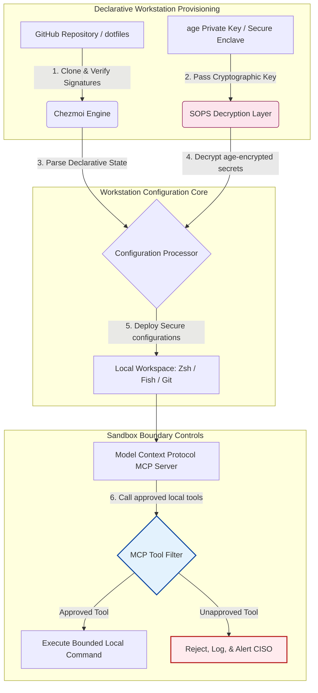

---

# Front Matter (YAML)

author: "contact@sebastienrousseau.com (Sebastien Rousseau)"
banner_alt: "Developer workstation in low light — symbolising AI-aware, reproducible, secure dotfiles for MCP servers, SLSA signing, age/SOPS secrets, and multi-shell parity"
banner_height: "1597"
banner_width: "2584"
banner: "https://cloudcdn.pro/stocks/images/almas-salakhov-Vq2ap8aFFEs.webp"
cdn: "https://cloudcdn.pro"
charset: "UTF-8"
cname: "sebastienrousseau.com"
copyright: "© Copyright 2025 - 2026 - Sebastien Rousseau. All rights reserved."
date: "June 16, 2026"
description: "AI-aware dotfiles are a secure, reproducible workstation pattern for the MCP era — declarative configuration via Chezmoi, SOPS/age secrets, SLSA Level 3 provenance, multi-shell parity, and bounded sandbox boundaries for local AI agents."
format-detection: "telephone=no"
hreflang: "en"
icon: "https://cloudcdn.pro/clients/sebastienrousseau/v1/logos/sebastienrousseau.svg"
id: "https://sebastienrousseau.com/2026-06-16-ai-aware-dotfiles-secure-reproducible-workstation-2026"
image_alt: "Black and White Portrait of Sebastien Rousseau"
image_height: "162"
image_width: "162"
image: "https://cloudcdn.pro/stocks/images/sebastienrousseau.webp"
keywords: "dotfiles, Chezmoi, MCP, Model Context Protocol, SLSA, SOPS, age encryption, declarative configuration, developer workstation, DORA Article 5, NIST CSF 2.0, supply chain security, agentic AI, multi-shell parity, Zsh, Fish, Nushell"
language: "en-GB"
last_reviewed: "2026-06-16"
layout: "report"
locale: "en_GB"
logo_alt: "Logo for Sebastien Rousseau"
logo_height: "44"
logo_width: "44"
logo: "https://cloudcdn.pro/clients/sebastienrousseau/v1/logos/sebastienrousseau.svg"
menu: ""
measurementID: "G-169G4ET5HQ"
name: "Sebastien Rousseau"
permalink: "https://sebastienrousseau.com/2026-06-16-ai-aware-dotfiles-secure-reproducible-workstation-2026"
rating: "general"
referrer: "no-referrer"
robots: "index, follow"
schema: "FAQPage, Article"
seo_title: "AI-Aware Dotfiles for a Secure Developer Workstation"
short_name: "sebastienrousseau"
subtitle: "The developer workstation is now part of the AI supply chain; dotfiles need security, reproducibility, secrets hygiene, and MCP-aware workflows."
tags: "dotfiles, developer tools, MCP, SLSA, secure workstation, chezmoi, macOS, Linux, WSL"
theme-color: "0, 83, 191"
title: "AI-Aware Dotfiles in 2026: Building a Secure, Reproducible Developer Workstation for MCP, SLSA, and Multi-Shell Parity"
url: "https://sebastienrousseau.com/2026-06-16-ai-aware-dotfiles-secure-reproducible-workstation-2026"
viewport: "width=device-width, initial-scale=1, shrink-to-fit=no"

# RSS - The RSS feed front matter (YAML).
atom_link: "https://sebastienrousseau.com/2026-06-16-ai-aware-dotfiles-secure-reproducible-workstation-2026/rss.xml"
category: "Technology"
docs: https://validator.w3.org/feed/docs/rss2.html
generator: "Static Site Generator (SSG) (version 0.0.26)"
item_description: "A look at declarative dotfiles for secure, reproducible developer workstations across macOS, Linux, and WSL, with MCP awareness, SLSA, age, SOPS, and multi-shell parity."
item_guid: "https://sebastienrousseau.com/2026-06-16-ai-aware-dotfiles-secure-reproducible-workstation-2026/rss.xml"
item_link: "https://sebastienrousseau.com/2026-06-16-ai-aware-dotfiles-secure-reproducible-workstation-2026/rss.xml"
item_pub_date: "Tue, 16 Jun 2026 06:06:06 +0000"
item_title: "AI-Aware Dotfiles in 2026: Building a Secure, Reproducible Developer Workstation for MCP, SLSA, and Multi-Shell Parity"
last_build_date: "Tue, 16 Jun 2026 06:06:06 +0000"
managing_editor: "contact@sebastienrousseau.com (Sebastien Rousseau)"
pub_date: "Tue, 16 Jun 2026 06:06:06 +0000"
ttl: "60"
type: "article"
webmaster: "contact@sebastienrousseau.com"

# Apple - The Apple front matter (YAML).
apple_mobile_web_app_orientations: "portrait"
apple_touch_icon_sizes: "192x192"
apple-mobile-web-app-capable: "yes"
apple-mobile-web-app-status-bar-inset: "black"
apple-mobile-web-app-status-bar-style: "black-translucent"
apple-mobile-web-app-title: "AI-Aware Dotfiles for a Secure Developer Workstation"
apple-touch-fullscreen: "yes"

# MS Application - The MS Application front matter (YAML).

msapplication-navbutton-color: "0, 83, 191"

# Twitter Card - The Twitter Card front matter (YAML).

twitter_card: "summary_large_image"
twitter_creator: "@wwdseb"
twitter_description: "A look at declarative dotfiles for secure, reproducible developer workstations across macOS, Linux, and WSL, with MCP awareness, SLSA, age, SOPS, and multi-shell parity."
twitter_image: "https://cloudcdn.pro/clients/sebastienrousseau/v1/logos/sebastienrousseau.svg"
twitter_image_alt: "Logo of Sebastien Rousseau"
twitter_site: "@wwdseb"
twitter_title: "AI-Aware Dotfiles for a Secure Developer Workstation"
twitter_url: "https://sebastienrousseau.com/2026-06-16-ai-aware-dotfiles-secure-reproducible-workstation-2026"

excerpt: "AI-aware dotfiles in 2026 treat the developer workstation as supply-chain infrastructure — declarative chezmoi-managed configuration with MCP awareness, SLSA-signed releases, age/SOPS secrets, sub-second startup, and macOS/Linux/WSL parity."

# Humans.txt - The Humans.txt front matter (YAML).
author_website: "https://sebastienrousseau.com"
author_twitter: "@wwdseb"
author_location: "London, UK"
thanks: "Thanks for reading!"
site_last_updated: "2026-06-16"
site_standards: "HTML5, CSS3, RSS, Atom, JSON, XML, YAML, Markdown, TOML"
site_components: "Kaishi, Kaishi Builder, Kaishi CLI, Kaishi Templates, Kaishi Themes"
site_software: "Static Site Generator, Rust"

---

# AI-Aware Dotfiles in 2026: Building a Secure, Reproducible Developer Workstation for MCP, SLSA, and Multi-Shell Parity

<!-- lead-start -->
<aside class="post-lead" aria-label="Article summary">

<strong>TL;DR.</strong> AI-aware dotfiles are a secure, reproducible workstation pattern for the MCP era — declarative configuration via Chezmoi, SOPS/age secrets, SLSA Level 3 provenance, multi-shell parity, and bounded sandbox boundaries for local AI agents.

<strong>Key takeaways</strong>

<ul class="post-lead-takeaways">
  <li><strong>Why This Open-Source Project Matters in 2026.</strong> In June 2026, the developer workstation is the weakest link in the software supply chain and a high-value target for sophisticated state-sponsored and criminal cyber syndicates.</li>
  <li><strong>The AI-Aware Workstation 2026 Architecture Lens.</strong> The dotfiles framework operates as a secure, declarative environment manager — all local shells, tools, and secrets systematically managed, audited, and isolated:.</li>
  <li><strong>Key Workstation Security and Automation Signals.</strong> To maintain absolute security across the development estate, Chief Information Security Officers (CISOs) and technology managers must track specific, quantifiable operational indicators:.</li>
  <li><strong>Why Declarative Configuration is the Core of Workstation Security.</strong> Traditional approaches to developer workstation setup are highly manual, resulting in "snowflake laptops" — environments where configurations drift over time as developers install custom tools, adjust variables, and…</li>
</ul>

<strong>Related reading:</strong> <a href="https://sebastienrousseau.com/2026-06-11-cloudcdn-open-source-blueprint-ai-native-edge-2026">CloudCDN: An Open-Source Blueprint for the AI-Native Edge in 2026</a>, <a href="https://sebastienrousseau.com/2026-06-18-noyalib-safe-yaml-rust-ai-mcp-financial-infrastructure-2026">Why YAML Needs a Safer Rust Stack for AI, MCP, and Financial Infrastructure in 2026</a>, <a href="https://sebastienrousseau.com/2026-05-23-agentic-payments-banking-consent-liability-new-payment-ux-2026">Agentic Payments in Banking: Consent, Liability, and the New Payment UX in 2026</a>.

</aside>
<!-- lead-end -->

Bridging the gap between declarative workstation configuration and secure software supply chains in an age of local AI models and agentic developer tools.

The open-source reference point for this article is [dotfiles ⧉](https://github.com/sebastienrousseau/dotfiles "dotfiles — declarative workstation configuration"). The repository is positioned as: declarative dotfiles for macOS, Linux, and WSL, offering multi-shell parity, sub-second startup, SLSA-signed releases, and AI/MCP-aware configuration.

## Why This Open-Source Project Matters in 2026

In June 2026, the developer workstation is the weakest link in the software supply chain and a high-value target for sophisticated state-sponsored and criminal cyber syndicates.

The security landscape of the development environment has shifted radically with the rise of terminal-based AI coding assistants (such as Claude Code) and the adoption of the Model Context Protocol (MCP). Local developer terminals now host active, autonomous AI agents capable of:

- Reading and editing local source files.
- Calling local CLI tools (`git`, `npm`, `aws`, `kubectl`).
- Inspecting shell environment variables, local databases, and configuration settings.

If the developer's local environment lacks strict boundaries, these autonomous AI tools can inadvertently read sensitive personal data, leak cloud credentials to public LLM APIs, or execute malicious packages during automated builds.

Under the Digital Operational Resilience Act (DORA) and the NIST Cybersecurity Framework (CSF) 2.0, financial institutions are legally required to verify the provenance and security integrity of every device accessing the software supply chain. "Snowflake laptops" — manually configured, un-audited, drifting configurations — are no longer compliant with global banking standards.

[Sebastien Rousseau's Dotfiles](https://github.com/sebastienrousseau/dotfiles) solves this problem. It is an open-source, declarative workstation management framework that establishes secure, reproducible developer workstations. By enforcing a standardised, auditable configuration baseline, the project delivers a high Return on Resilience (RoR), reducing developer onboarding time from weeks to hours and protecting sensitive financial supply chains from endpoint vulnerabilities.

## The AI-Aware Workstation 2026 Architecture Lens

The dotfiles framework operates as a secure, declarative environment manager — all local shells, tools, and secrets systematically managed, audited, and isolated:

| Layer | Design Decision | Why It Matters | Risk if Mishandled |
|---|---|---|---|
| **Provisioning Layer** | Declarative configuration management via Chezmoi | Builds completely reproducible workstations across macOS, Linux, and WSL, eliminating drift. | Snowflake configurations with un-audited, vulnerable local states. |
| **Shell Layer** | Multi-shell parity (Zsh, Fish, Nushell) | Ensures identical, sub-second startup and consistent alias behaviours across different environments. | Shell command inconsistencies causing unexpected script outcomes. |
| **Secrets Layer** | File encryption using SOPS and age | Prevents hardcoded credentials and raw keys from being committed to Git or exposed to local LLMs. | Credentials leaked into public repository histories or compromised by local agents. |
| **AI/MCP Layer** | Model Context Protocol boundary controls | Restricts local AI agents to a specific list of approved tools, logging all local executions. | Unbounded AI agents executing runaway or destructive commands locally. |
| **Supply Chain Layer** | SLSA-signed releases and Sigstore verification | Cryptographically proves the authenticity of bootstrap scripts and configuration files. | Compromised setup scripts injecting malicious backdoors into developer environments. |

## Key Workstation Security and Automation Signals

To maintain absolute security across the development estate, Chief Information Security Officers (CISOs) and technology managers must track specific, quantifiable operational indicators:

| Signal | Metric / Operational Benchmark | NIST CSF / DORA Reference | Technical Platform Implementation |
|---|---|---|---|
| **Workstation Reproducibility** | % of developer laptops fully managed via declarative dotfile repositories without configuration drift. | NIST CSF 2.0 (PR.DS-01) | Chezmoi drift detection audits executed automatically on terminal startup. |
| **Credential Hygiene** | Zero unencrypted secrets or keys stored in plain text across local configuration files. | DORA Article 6 (ICT Security) | Git pre-commit hooks and local scans rejecting unencrypted files. |
| **Build Provenance** | 100% of workstation bootstrap utilities verified using cryptographically signed manifests. | DORA Article 30 (Supply Chain) | Sigstore and SLSA Level 3 verification embedded in setup pipelines. |
| **Developer Onboarding Time** | Elapsed time from raw hardware provision to a fully configured, compliant development workspace. | Return on Resilience (RoR) | Automated, declarative setup scripts compiling the environment in under 15 minutes. |
| **AI Agent Bounded Access** | Verification that local AI tools operate within defined directory limits with read-only defaults. | Model Risk Management | MCP configuration profiles restricting agent tool catalogues to approved operations. |

## Why Declarative Configuration is the Core of Workstation Security

Traditional approaches to developer workstation setup are highly manual, resulting in "snowflake laptops" — environments where configurations drift over time as developers install custom tools, adjust variables, and modify local scripts. This drift creates several critical vulnerabilities:

1. **Untracked shadow configurations.** Drifting laptops often run outdated, vulnerable software packages or local scripts that bypass corporate security tools.
2. **Secrets leakage.** Developers frequently hardcode API keys, GitHub tokens, or AWS credentials directly into plain-text scripts or shell profiles, making them highly vulnerable to theft.
3. **Inefficient onboarding.** Setting up a new developer workstation manually can take up to two weeks of engineering time, impacting team velocity.

By transitioning to a declarative, model-driven configuration using Chezmoi, the entire developer workspace becomes a version-controlled, reproducible system of record. Every change, alias, package dependency, and security default is documented in Git, validated against organisational compliance policies, and cryptographically verified before it is applied to the physical laptop.

## Designing a Bounded AI Developer Environment

To prevent local AI agents and MCP tools from gaining unbounded access to local assets, the workstation must operate as a bounded execution plane.

The operational flow below shows how the dotfiles framework coordinates Chezmoi, SOPS, and age to decrypt and deploy secure dotfiles while maintaining an isolated, sandboxed execution boundary for local AI agents calling MCP tools:

## The Boardroom Playbook and Fiduciary Liability

Developer workstation security and supply-chain integrity are critical boardroom priorities. Senior managers must address developer environment risk through the lens of fiduciary responsibility, regulatory compliance, and business-value preservation:

- **DORA Article 5 (Board Accountability).** Mandates that the management body (the board) bears ultimate responsibility for the institution's ICT risk management. Because developer workstations are the gateway to the software supply chain, board directors must verify that endpoints are secure, fully auditable, and managed under strict, reproducible configuration frameworks to satisfy regulatory audits.
- **NIST CSF 2.0 Compliance (Endpoint Security).** Demands that only authorised and validated devices, running standardised, secure configurations, can access corporate networks and repositories. Declarative dotfiles allow security teams to mathematically prove that all developer environments are compliant with the organisation's security baseline, eliminating the risk of un-audited "snowflake" setups.
- **Preservation of Balance-Sheet Value.** A single compromised developer credential or supply-chain breach can cost an institution millions of dollars in remediation, regulatory fines, and reputational damage. Transitioning to a secure, declarative developer environment directly minimises this risk, preserving balance-sheet value and protecting customer trust.

## What This Means by Bank Type

### Global Systemically Important Banks (G-SIBs)

G-SIBs manage thousands of developer workstations across multiple continents and regulatory jurisdictions. Their primary challenge is maintaining configuration consistency and preventing credential leakage across massive engineering teams. By adopting a declarative, open-source dotfiles model using Chezmoi, G-SIBs can standardise endpoint security, automate compliance auditing, and slash developer onboarding times from weeks to minutes across the global organisation.

### Transaction and Corporate Banks

Transaction banks operate sensitive payment gateways and wholesale clearing infrastructures. Proving the absolute integrity of the code deployed to these production environments is a non-negotiable regulatory demand. Standardising developer workstations under a secure, SLSA-compliant dotfiles framework guarantees that the software supply chain is fully audited and protected from local developer endpoint vulnerabilities.

### Regional and Smaller Banks

Regional banks must maintain high cybersecurity standards without the massive security budgets of G-SIBs. This open-source dotfiles framework provides a lightweight, cost-effective, and highly secure Python and Rust-friendly solution, enabling smaller institutions to implement enterprise-grade endpoint security and supply-chain protection without expensive proprietary software licences.

## Conclusion: The Developer Workstation Roadmap

The developer workstation is no longer a peripheral device; it is a critical control plane in the software supply chain. Allowing manually configured, un-audited "snowflake laptops" to access corporate assets is a severe operational and regulatory risk.

To secure the software supply chain and protect endpoints from local AI-agent vulnerabilities, senior technology and security managers should execute a clear development roadmap today:

1. **Mandate declarative provisioning.** Phase out manual, document-led setup processes and mandate that all developer environments are provisioned declaratively using Chezmoi.
2. **Enforce secrets hygiene.** Enforce strict pre-commit hooks and scanning utilities to ensure zero raw credentials, keys, or API tokens are stored in plain text across local workstation configurations.
3. **Establish AI sandbox boundaries.** Implement secure, bounded MCP configuration profiles to restrict local AI coding assistants and agents to approved, read-only tools and directories.
4. **Secure the supply chain.** Ensure all bootstrap scripts and environment configurations are cryptographically verified using SLSA Level 3 provenance before deployment.

## Frequently Asked Questions

**What is Chezmoi and why is it used for dotfiles?**

Chezmoi is an open-source, secure, declarative dotfile manager. It allows developers to manage their local configurations as a version-controlled repository, ensuring absolute consistency and reproducibility across different operating systems (macOS, Linux, WSL).

**How does the framework protect secrets?**

The framework uses SOPS (Secrets Operations) and age file encryption to encrypt sensitive credentials (such as GitHub tokens or cloud access keys) directly within the dotfile repository. This prevents keys from being committed in plain text or read by unauthorised local AI agents.

**What is Model Context Protocol (MCP) and how does it affect security?**

MCP is an open standard that allows AI models to safely execute local tools and access files. The dotfiles framework implements strict MCP configuration files to restrict local AI tools and agents to approved directories and commands.

**Which shells does the framework support?**

Bash, Zsh, Fish, Nushell, and PowerShell — with parity across macOS, Linux, and WSL so command behaviour stays identical no matter which terminal a developer opens.

## References

- Open Source Security Foundation (OpenSSF), (2024). *Supply-chain Levels for Software Artifacts (SLSA)*. Available at: [SLSA Framework ⧉](https://slsa.dev/ "SLSA framework").
- NIST, (2024). *NIST Cybersecurity Framework 2.0*. Gaithersburg: National Institute of Standards and Technology. Available at: [NIST CSF 2.0 ⧉](https://www.nist.gov/cyberframework "NIST Cybersecurity Framework 2.0").
- European Parliament and Council of the European Union, (2022). *Regulation (EU) 2022/2554 on digital operational resilience for the financial sector (DORA)*. Brussels: Official Journal of the European Union. Available at: [DORA Regulation ⧉](https://eur-lex.europa.eu/legal-content/EN/TXT/?uri=CELEX%3A32022R2554 "DORA regulation").
- GitHub, (2026). *dotfiles open-source repository*. Available at: [dotfiles Repository ⧉](https://github.com/sebastienrousseau/dotfiles "dotfiles repository").

<!-- enrich-start -->
<aside class="author-card" aria-label="About the author"><strong class="author-card-name"><a href="/about/index.html">Sebastien Rousseau</a></strong>Senior banking technologist writing on applied AI, ISO 20022 migration, post-quantum cryptography for financial services, and the structural transformation of wholesale payments.20+ years across HSBC Commercial &amp; Investment Bank, PayPal, Barclays, Shazam, AKQA, Virgin Group. <a href="/about/index.html">Full profile</a> &middot; <a href="https://www.linkedin.com/in/sebastienrousseau/" rel="external noopener">LinkedIn</a> &middot; <a href="https://github.com/sebastienrousseau" rel="external noopener">GitHub</a></aside>

Last reviewed <time datetime="2026-06-23">2026-06-23</time>.

<aside class="related-posts" aria-labelledby="related-heading">
<h2 id="related-heading" class="related-heading">Related reading</h2>

<article class="related-card"><footer class="related-body"><h3><a href="https://sebastienrousseau.com/2026-06-11-cloudcdn-open-source-blueprint-ai-native-edge-2026">CloudCDN: An Open-Source Blueprint for the AI-Native Edge in 2026</a></h3>
<time datetime="2026-06-11">2026-06-11</time>
</footer></article>
<article class="related-card"><footer class="related-body"><h3><a href="https://sebastienrousseau.com/2026-06-18-noyalib-safe-yaml-rust-ai-mcp-financial-infrastructure-2026">Why YAML Needs a Safer Rust Stack for AI, MCP, and Financial Infrastructure in 2026</a></h3>
<time datetime="2026-06-18">2026-06-18</time>
</footer></article>
<article class="related-card"><footer class="related-body"><h3><a href="https://sebastienrousseau.com/2026-05-23-agentic-payments-banking-consent-liability-new-payment-ux-2026">Agentic Payments in Banking: Consent, Liability, and the New Payment UX in 2026</a></h3>
<time datetime="2026-05-23">2026-05-23</time>
</footer></article>

</aside>
<!-- enrich-end -->
