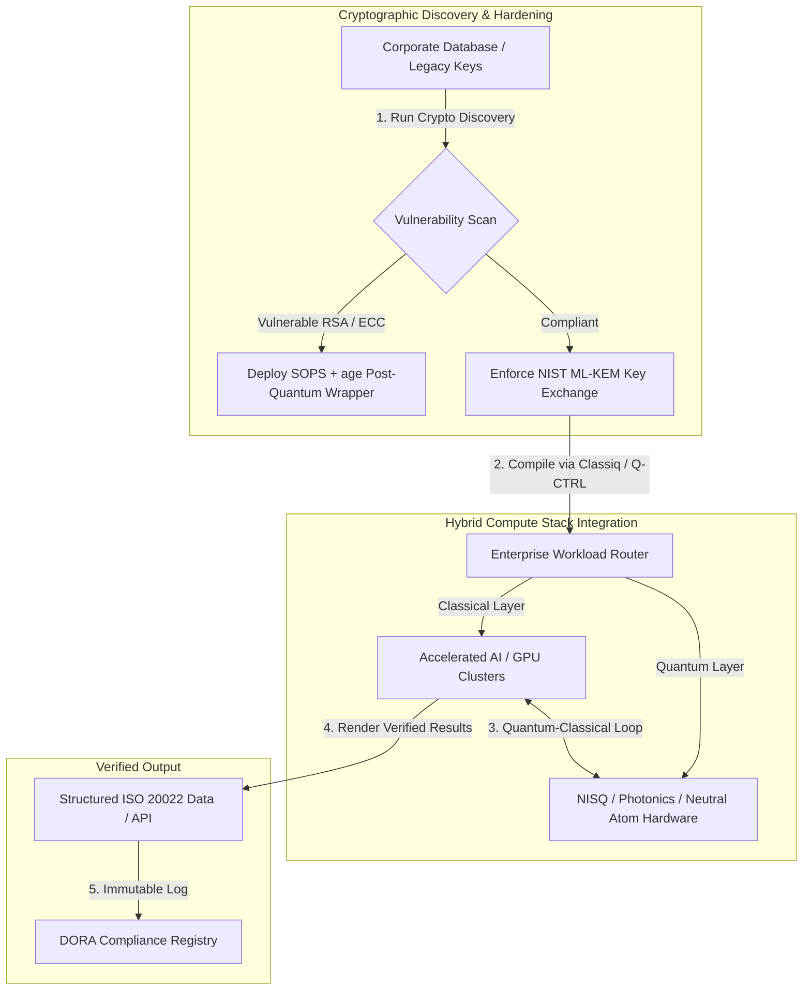

---

# Front Matter (YAML)

author: "contact@sebastienrousseau.com (Sebastien Rousseau)"
banner_alt: "Stage view from the Economist Impact 5th Annual Commercialising Quantum Global 2026 summit in London — symbolising quantum technology's transition from physics research to enterprise-ready workflows"
banner_height: "1597"
banner_width: "2584"
banner: "https://cloudcdn.pro/stocks/images/sebastien-rousseau-20260617-5th-commercialising-quantum-2.webp"
cdn: "https://cloudcdn.pro"
charset: "UTF-8"
cname: "sebastienrousseau.com"
copyright: "© Copyright 2025 - 2026 - Sebastien Rousseau. All rights reserved."
date: "June 17, 2026"
description: "Boardroom takeaways from the Economist Impact 5th Annual Commercialising Quantum Global 2026 summit — $1.3B funding surge, no-regrets hybrid stacks, post-quantum cryptography migration urgency, quantum sensing commercialisation, and HSBC's directive that waiting is an unforced error."
format-detection: "telephone=no"
hreflang: "en"
icon: "https://cloudcdn.pro/clients/sebastienrousseau/v1/logos/sebastienrousseau.svg"
id: "https://sebastienrousseau.com/2026-06-17-economist-commercialising-quantum-summit-2026"
image_alt: "Black and White Portrait of Sebastien Rousseau"
image_height: "162"
image_width: "162"
image: "https://cloudcdn.pro/stocks/images/sebastien-rousseau.png"
keywords: "Commercialising Quantum Global 2026, Economist Impact summit, post-quantum cryptography, NIST ML-KEM, harvest-now decrypt-later, SNDL, HSBC quantum, Philip Intallura, quantum sensing, GPS-independent navigation, NQCC, EU Quantum Act, Quantcore, qBIG prize, Lord Vallance, hybrid quantum-classical, DORA Article 6"
language: "en-GB"
last_reviewed: "2026-06-17"
layout: "report"
locale: "en_GB"
logo_alt: "Logo for Sebastien Rousseau"
logo_height: "44"
logo_width: "44"
logo: "https://cloudcdn.pro/clients/sebastienrousseau/v1/logos/sebastienrousseau.svg"
menu: ""
measurementID: "G-169G4ET5HQ"
name: "Sebastien Rousseau"
permalink: "https://sebastienrousseau.com/2026-06-17-economist-commercialising-quantum-summit-2026"
rating: "general"
referrer: "no-referrer"
robots: "index, follow"
schema: "FAQPage, Article"
seo_title: "Commercialising Quantum 2026: Boardroom Takeaways"
short_name: "sebastienrousseau"
subtitle: "Quantum has crossed from speculative laboratory science into hybrid enterprise workflows; the boardroom must respond to $1.3B in 2026 funding, immediate post-quantum migration, and HSBC's directive to stop waiting."
tags: "quantum, post-quantum cryptography, NIST ML-KEM, harvest-now decrypt-later, quantum sensing, HSBC, Economist Impact, hybrid compute, DORA, EU Quantum Act, NQCC, summit takeaways"
theme-color: "0, 83, 191"
title: "From Qubits to Profits: Strategic Takeaways from the Economist's 5th Annual Commercialising Quantum Global 2026 Summit"
url: "https://sebastienrousseau.com/2026-06-17-economist-commercialising-quantum-summit-2026"
viewport: "width=device-width, initial-scale=1, shrink-to-fit=no"

# RSS - The RSS feed front matter (YAML).
atom_link: "https://sebastienrousseau.com/2026-06-17-economist-commercialising-quantum-summit-2026/rss.xml"
category: "Technology"
docs: https://validator.w3.org/feed/docs/rss2.html
generator: "Static Site Generator (SSG) (version 0.0.26)"
item_description: "Boardroom takeaways from the Economist Impact 5th Annual Commercialising Quantum Global 2026 summit — $1.3B funding surge, no-regrets hybrid stacks, post-quantum cryptography migration urgency, quantum sensing commercialisation, and HSBC's directive that waiting is an unforced error."
item_guid: "https://sebastienrousseau.com/2026-06-17-economist-commercialising-quantum-summit-2026/rss.xml"
item_link: "https://sebastienrousseau.com/2026-06-17-economist-commercialising-quantum-summit-2026/rss.xml"
item_pub_date: "Wed, 17 Jun 2026 06:06:06 +0000"
item_title: "From Qubits to Profits: Strategic Takeaways from the Economist's 5th Annual Commercialising Quantum Global 2026 Summit"
last_build_date: "Wed, 17 Jun 2026 06:06:06 +0000"
managing_editor: "contact@sebastienrousseau.com (Sebastien Rousseau)"
pub_date: "Wed, 17 Jun 2026 06:06:06 +0000"
ttl: "60"
type: "article"
webmaster: "contact@sebastienrousseau.com"

# Apple - The Apple front matter (YAML).
apple_mobile_web_app_orientations: "portrait"
apple_touch_icon_sizes: "192x192"
apple-mobile-web-app-capable: "yes"
apple-mobile-web-app-status-bar-inset: "black"
apple-mobile-web-app-status-bar-style: "black-translucent"
apple-mobile-web-app-title: "Commercialising Quantum 2026: Boardroom Takeaways"
apple-touch-fullscreen: "yes"

# MS Application - The MS Application front matter (YAML).

msapplication-navbutton-color: "0, 83, 191"

# Twitter Card - The Twitter Card front matter (YAML).

twitter_card: "summary_large_image"
twitter_creator: "@wwdseb"
twitter_description: "Boardroom takeaways from the Economist Impact 5th Annual Commercialising Quantum Global 2026 summit — $1.3B funding surge, no-regrets hybrid stacks, post-quantum cryptography migration urgency, quantum sensing commercialisation, and HSBC's directive that waiting is an unforced error."
twitter_image: "https://cloudcdn.pro/clients/sebastienrousseau/v1/logos/sebastienrousseau.svg"
twitter_image_alt: "Logo of Sebastien Rousseau"
twitter_site: "@wwdseb"
twitter_title: "Commercialising Quantum 2026: Boardroom Takeaways"
twitter_url: "https://sebastienrousseau.com/2026-06-17-economist-commercialising-quantum-summit-2026"

excerpt: "The Economist Impact 5th Annual Commercialising Quantum Global 2026 summit confirmed quantum's pivot to enterprise workflows: $1.3B raised in five months, post-quantum cryptography is a board-level fiduciary issue under SNDL harvesting, quantum sensing is shipping today for GPS-independent navigation, and HSBC's Philip Intallura delivered the directive that waiting for fault-tolerant hardware is an unforced error."

# Humans.txt - The Humans.txt front matter (YAML).
author_website: "https://sebastienrousseau.com"
author_twitter: "@wwdseb"
author_location: "London, UK"
thanks: "Thanks for reading!"
site_last_updated: "2026-06-17"
site_standards: "HTML5, CSS3, RSS, Atom, JSON, XML, YAML, Markdown, TOML"
site_components: "Kaishi, Kaishi Builder, Kaishi CLI, Kaishi Templates, Kaishi Themes"
site_software: "Static Site Generator, Rust"

---

# From Qubits to Profits: Strategic Takeaways from the Economist's 5th Annual Commercialising Quantum Global 2026 Summit

<!-- lead-start -->
<aside class="post-lead" aria-label="Article summary">

<strong>TL;DR.</strong> Boardroom takeaways from the Economist Impact 5th Annual Commercialising Quantum Global 2026 summit — $1.3B funding surge, no-regrets hybrid stacks, post-quantum cryptography migration urgency, quantum sensing commercialisation, and HSBC's directive that waiting is an unforced error.

<strong>Key takeaways</strong>

<ul class="post-lead-takeaways">
  <li><strong>01. Why the 2026 Summit Matters to the Boardroom.</strong> The 2026 edition of the Economist's Commercialising Quantum Global summit marked a permanent shift in how the corporate world evaluates deep tech.</li>
  <li><strong>02. The Commercialising Quantum 2026 Strategic Lens.</strong> Enterprise technology leaders must map quantum maturity across five distinct operational layers, evaluating timeline horizons and balance-sheet risks.</li>
  <li><strong>03. Key Quantum Signals and Boardroom Triggers.</strong> Technology leaders must monitor specific, quantifiable market and regulatory metrics to guide their quantum investments.</li>
  <li><strong>04. Deep-Dive into the Core Summit Themes.</strong> Venture capital funding has experienced significant acceleration, raising $1.3 billion in the first five months of 2026 alone.</li>
</ul>

<strong>Related reading:</strong> <a href="https://sebastienrousseau.com/2023-12-11-quantum-key-distribution-revolutionising-security-in-banking/index.html">Quantum Key Distribution Revolutionising Security in Banking</a>, <a href="https://sebastienrousseau.com/2023-11-19-crystals-kyber-the-safeguarding-algorithm-in-a-quantum-age/index.html">CRYSTALS-Kyber: The Safeguarding Algorithm in a Quantum Age</a>, <a href="https://sebastienrousseau.com/2026-06-12-kyberlib-post-quantum-banking-migration-standards-code-2026">KyberLib and the Post-Quantum Banking Migration in 2026: From Standards to Code</a>.

</aside>
<!-- lead-end -->

Enterprise readiness, post-quantum cryptography migrations, hybrid compute stacks, and the emerging commercial landscape of quantum sensing and networking.

**TL;DR.** The 5th Annual Commercialising Quantum Global 2026 conference, hosted by Economist Impact on June 16–17, 2026, at the Business Design Centre in London, gathered over 1,100 global leaders across enterprise, finance, policy, and research. The central theme marked a clear structural pivot: quantum technology has transitioned from speculative laboratory science to practical, hybrid enterprise workflows. Backed by $1.3 billion in venture capital raised in the first five months of 2026 alone, the boardroom discussion is no longer focused on counting physical qubits, but on establishing "no-regrets" hybrid compute stacks, securing digital assets against the "harvest-now, decrypt-later" (SNDL) cryptographic threat, and deploying near-term quantum sensing systems for GPS-independent navigation.

## Key takeaways

- **Enterprise shift to practical workflows.** Industry leaders ([Steve Suarez](https://www.linkedin.com/in/stevesuarez) of HorizonX, [Phil Intallura](https://www.linkedin.com/in/intallura) of HSBC) emphasised that quantum integration is no longer a physics problem but an operational one. Banks and enterprises are deploying hybrid quantum-classical pilots to prepare talent and optimise active workloads.
- **Post-quantum cryptography (PQC) is a board priority.** Security and legal experts (CMS UK, [Joanne Miller](https://www.linkedin.com/in/joanne-miller-nso) of Microsoft, [Craig Farrell](https://www.linkedin.com/in/craig-farrell) of EY) warned that organisations cannot wait for fault-tolerant hardware to deploy PQC. "Harvest-now, decrypt-later" harvesting is happening today, making the migration to NIST ML-KEM standards an immediate fiduciary concern.
- **Quantum sensing leads near-term profitability.** While fault-tolerant computing remains years away, quantum sensing ([Matthew Kinsella](https://www.linkedin.com/in/matthewkinsella) of Infleqtion) is scaling rapidly. Quantum clocks and inertial sensors are being deployed in GPS-independent navigation, national security, and ultra-stable energy grids.
- **Sovereignty, clusters and policy urgency.** UK Science Minister [Lord Vallance](https://www.linkedin.com/in/patrick-vallance) and [Lord William Hague](https://www.linkedin.com/in/williamhague) outlined national missions to convert research into industrial-scale "superclusters" coordinating with the National Quantum Computing Centre (NQCC). The upcoming EU Quantum Act further underscores the geopolitical rush for sovereign computing capacity.
- **Quantcore wins the qBIG prize.** University of Glasgow spin-out Quantcore secured the IOP qBIG prize for its breakthrough niobium-based superconducting components, which operate at higher temperatures than traditional materials, significantly reducing cryogenic infrastructure overhead.

**Related reading:** [KyberLib and the Post-Quantum Banking Migration in 2026: From Standards to Code](https://sebastienrousseau.com/2026-06-12-kyberlib-post-quantum-banking-migration-standards-code-2026/), [The Banking Resilience Index in 2026: AI, Cloud, Quantum, Payments, and Third-Party Concentration Risk](https://sebastienrousseau.com/2026-06-08-banking-resilience-index-ai-cloud-quantum-payments-third-party-risk-2026/), [The Cloud Native Banking Index in 2026: DORA, Platform Engineering, Sovereign Cloud, and Operational Resilience](https://sebastienrousseau.com/2026-06-05-cloud-native-banking-index-dora-resilience-platform-engineering-2026/).

## 01. Why the 2026 Summit Matters to the Boardroom

The 2026 edition of the Economist's Commercialising Quantum Global summit marked a permanent shift in how the corporate world evaluates deep tech.

Historically, quantum computing was relegated to R&D departments as a multi-decade scientific endeavour. In June 2026, this perspective is obsolete. Organisations must transition from "physics-centric" curiosity to "business-centric" implementation. The reason is two-fold:

1. **The quantum-AI convergence.** High-performance computing (HPC) stacks are merging classical, accelerated AI, and NISQ (Noisy Intermediate-Scale Quantum) nodes into a single, unified compute layer. Organisations that delay building quantum-ready applications will discover that the window to capture strategic advantage is closing faster than expected.
2. **Geopolitical and fiduciary urgency.** With the UK's mission-led quantum programme and the upcoming EU Quantum Act, quantum capacity has become a matter of national sovereignty and corporate continuity.

Furthermore, post-quantum cybersecurity is no longer a future compliance requirement. The threat of adversarial "store now, decrypt later" (SNDL) attacks means corporate data intercepted today will be decrypted when commercial quantum systems scale, creating immediate liability under global operational resilience mandates like the Digital Operational Resilience Act (DORA).

## 02. The Commercialising Quantum 2026 Strategic Lens

Enterprise technology leaders must map quantum maturity across five distinct operational layers, evaluating timeline horizons and balance-sheet risks.

### Table 1: The Commercialising Quantum 2026 strategic lens

| Layer | Corporate focus | Timeline / horizon | Key corporate risk |
| ---- | ---- | ---- | ---- |
| **Hardware & compiler** | Selecting between competing approaches (superconducting, trapped ions, neutral atoms, photonics) | 3 – 5 years (fault-tolerance) | Locking into a dead-end architecture or backing a single platform too early. |
| **Cryptographic hardening** | Discovery and inventory of cryptographic dependencies; migration to NIST ML-KEM | Immediate (active migration) | Systemic data breaches and compliance failures under DORA and NIST CSF 2.0. |
| **Quantum sensing** | Deployment of GPS-independent navigation, ultra-stable clocks, and gravimeters | 1 – 2 years (immediate commercial) | Operational disruption of logistics, shipping, and energy grids due to GPS jamming. |
| **System integration** | Connecting quantum hardware into existing classical HPC and supercomputing data centres | 1 – 3 years (hybrid phase) | High latency, data-transfer bottlenecks, and fragmented compute silos. |
| **Enterprise software** | Exposing quantum algorithms through high-level abstraction layers and APIs (Classiq, Q-CTRL) | Immediate (skills building) | Talent and workflow isolation from actual engineering execution. |

## 03. Key Quantum Signals and Boardroom Triggers

Technology leaders must monitor specific, quantifiable market and regulatory metrics to guide their quantum investments.

### Table 2: Key quantum signals and boardroom triggers

| Signal | Quantitative metric | Regulatory / policy reference | Actionable platform priority |
| ---- | ---- | ---- | ---- |
| **Quantum funding surge** | $1.3 billion raised globally in the first five months of 2026 | Return on Resilience (RoR) | Shift budgets from speculative pilots to "no-regrets" hybrid quantum-classical workloads. |
| **Data decryption exposure** | 100% of encrypted data transmitted over public channels exposed to SNDL harvesting | DORA Article 6 (ICT security) | Implement cryptographic discovery tools to identify vulnerable RSA/ECC keys across the estate. |
| **Sovereign infrastructure** | £2.5 billion UK National Quantum Strategy allocation | UK Quantum Missions / Lord Vallance | Establish local partnerships with national superclusters like the NQCC. |
| **Compliance deadlines** | November 14, 2026 SWIFT structured-address cutover | SWIFT SR 2026 directive | Cleanse and format interbank databases to meet structured XML specifications. |

## 04. Deep-Dive into the Core Summit Themes

### Quantum reaches an investment tipping point

Venture capital funding has experienced significant acceleration, raising **$1.3 billion** in the first five months of 2026 alone. Unlike the speculative hype cycles of previous years, the current capital wave is backed by real-world, near-term workloads. Speakers from Classiq and IBM Quantum Platform demonstrated how software abstraction layers and automated compilers allow non-specialist developer teams to execute hybrid quantum-classical algorithms on today's classical infrastructure. This "no-regrets" strategy enables organisations to build quantum-ready talent and workflows immediately.

### Legal and regulatory warnings on "harvest now, decrypt later"

Legal partners and cybersecurity executives sparked major engagement around the immediacy of data risk. Representatives from sponsoring law firm CMS UK and Microsoft CSO [Joanne Miller](https://www.linkedin.com/in/joanne-miller-nso) delivered a stark warning to senior management: *waiting for fault-tolerant hardware to arrive before deploying post-quantum cryptography is a critical fiduciary failure.*

Under the "store now, decrypt later" (SNDL) paradigm, hostile actors are actively harvesting encrypted corporate data today with the intent to decrypt it as soon as cryptographically relevant quantum computers emerge. Organisations must deploy post-quantum protections (such as NIST ML-KEM) immediately to protect long-lived sensitive datasets, intellectual property, and historical customer records.

### The "quantum sensing" hype realignment

While fault-tolerant quantum computing remains years away, the summit highlighted quantum sensing as the first truly profitable wave of real-world deployment. Chief Executive [Matthew Kinsella](https://www.linkedin.com/in/matthewkinsella) of Infleqtion detailed how quantum clocks, inertial sensors, and radio-frequency systems are scaling rapidly across multiple industries.

Because these technologies measure physical constants with sub-atomic precision, they enable **GPS-independent navigation**, ultra-stable energy grids, and deep-space telecommunications. These applications are highly relevant for aviation, maritime transport, and national-defence systems facing growing GPS-jamming threats.

### Ecosystem and cluster collaboration

The UK quantum ecosystem used the London summit to showcase domestic innovation superclusters. Live updates from the National Quantum Computing Centre (NQCC) and Digital Catapult detailed how early-stage deep-tech spin-outs can bridge the "technology divide" by integrating quantum hardware directly into classical supercomputing data centres.

[Wridhdhisom Karar](https://www.linkedin.com/in/wridhdhisomkarar), co-founder of Scottish quantum startup Quantcore, accepted the prestigious Institute of Physics (IOP) Quantum Business Innovation and Growth (qBIG) prize for the company's niobium-based superconducting components. These components operate at higher temperatures than traditional materials, significantly reducing the cryogenic infrastructure overhead required to scale quantum processors.

### The HSBC case study: why waiting for quantum is an "unforced error"

Insights from [**Philip Intallura, Ph.D.**](https://www.linkedin.com/in/intallura) (Global Head of Quantum Technologies at HSBC, UK Government Advisor, and Board Advisor) at the Economist's 5th Annual Commercialising Quantum Event (2026) delivered a powerful boardroom directive: *"Waiting for fault-tolerant quantum before you start is an unforced error."*

Dr Intallura argued that the common "wait-and-see" approach among financial institutions is an own goal built on three incorrect assumptions:

- **Near-term ROI is real.** In empirical testing, HSBC has outperformed models currently running in production, connected quantum work to other parts of the business, used quantum to deepen relationships with some of their largest clients, and attracted significant new business into **HSBC Innovation Banking**.
- **Quantum is a steep adoption curve.** Building capability, setting strategy, securing funding, and running experiment cycles inside a heavily regulated organisation is no short undertaking. Processes must be systematically tested and adapted for the technology.
- **Quantum is an ecosystem.** No single player gets there alone. Every research paper, POC, and pilot HSBC has executed has been in close collaboration with a quantum provider — and in some cases, collaboration extends to academia, regulators, and government.

**Closing boardroom directive:** *"The capability you'll need on day one of fault tolerance is the capability you build now."*

## 05. Corporate Quantum Integration and Cryptography Pipeline

To secure digital assets while building quantum readiness, the enterprise must establish a clear integration pipeline.

## 06. The Boardroom Playbook: Actionable Imperatives

To translate the insights of the Commercialising Quantum Global 2026 summit into immediate business value, senior management should execute the following four-step boardroom playbook:

1. **Mandate cryptographic discovery.** Direct the Chief Information Security Officer (CISO) to catalogue all cryptographic assets, mapping every legacy RSA and ECC key across the enterprise to prepare for post-quantum migration.
2. **Deploy a "no-regrets" hybrid strategy.** Avoid waiting for perfect hardware. Invest in quantum-inspired software and hybrid classical-quantum pilots to develop in-house talent and optimise complex logistics or risk portfolios today.
3. **Evaluate quantum sensing for logistics.** If your organisation depends on global supply chains, shipping, or critical infrastructure, actively evaluate quantum sensing systems (such as GPS-independent navigation) to mitigate geopolitical disruption risks.
4. **Register for the June 30 Insight Hour.** Ensure your technology leaders register for the virtual **Commercialising Quantum Global Insight Hour** on June 30, 2026, at 3:00 PM BST (supported by IonQ) to continue tracking enterprise risk management and talent allocation strategies.

## 07. Frequently Asked Questions

**What is "harvest now, decrypt later" (SNDL) and why does it matter today?**
SNDL is the practice of intercepting and storing encrypted data today, with the intention of decrypting it later once cryptographically relevant quantum computers become available. Long-lived sensitive datasets — intellectual property, customer records, government communications — are already being targeted. Migrating to NIST ML-KEM is a fiduciary decision the board cannot defer.

**Why is quantum sensing the first commercial wave instead of computing?**
Quantum sensors measure physical constants with sub-atomic precision and do not require the fault-tolerant hardware that quantum computing does. Quantum clocks, gravimeters, and inertial sensors are already in pilot deployment for GPS-independent navigation, ultra-stable energy grids, and deep-space communications.

**Is HSBC's quantum work just R&D or has it delivered measurable returns?**
According to Philip Intallura at the summit, HSBC has outperformed models currently running in production, used quantum to deepen relationships with its largest clients, and attracted significant new business into HSBC Innovation Banking. The work has moved from research to operational integration.

## 08. References

- **Economist Impact, (2026).** *5th Annual Commercialising Quantum Global 2026.* Live conference proceedings, June 16–17, 2026. London: Business Design Centre. Available at: [Economist Impact](https://events.economist.com/commercialising-quantum/).
- **National Institute of Standards and Technology (NIST), (2024).** *First Three Finalized Post-Quantum Encryption Standards (FIPS 203, 204, and 205).* Gaithersburg: U.S. Department of Commerce. Available at: [NIST Standards](https://www.nist.gov/news-events/news/2024/08/nist-releases-first-3-finalized-post-quantum-encryption-standards).
- **European Parliament and Council of the European Union, (2022).** *Regulation (EU) 2022/2554 on digital operational resilience for the financial sector (DORA).* Brussels: Official Journal of the European Union. Available at: [DORA Regulation](https://eur-lex.europa.eu/legal-content/EN/TXT/?uri=CELEX%3A32022R2554).
- **SWIFT, (2024).** *[ISO 20022](/2023-09-29-automating-iso-20022-compliant-payment-file-creation-with-pain001/index.html) November 2026 Structured Address Milestone.* La Hulpe: SWIFT. Available at: [SWIFT ISO 20022 milestone](https://www.swift.com/standards/iso-20022/iso-20022-bytes/call-action-november-2026).

<!-- enrich-start -->
<aside class="author-card" aria-label="About the author"><strong class="author-card-name"><a href="/about/index.html">Sebastien Rousseau</a></strong>Senior banking technologist writing on applied AI, ISO 20022 migration, post-quantum cryptography for financial services, and the structural transformation of wholesale payments.20+ years across HSBC Commercial &amp; Investment Bank, PayPal, Barclays, Shazam, AKQA, Virgin Group. <a href="/about/index.html">Full profile</a> &middot; <a href="https://www.linkedin.com/in/sebastienrousseau/" rel="external noopener">LinkedIn</a> &middot; <a href="https://github.com/sebastienrousseau" rel="external noopener">GitHub</a></aside>

Last reviewed <time datetime="2026-06-23">2026-06-23</time>.

<aside class="related-posts" aria-labelledby="related-heading">
<h2 id="related-heading" class="related-heading">Related reading</h2>

<article class="related-card"><footer class="related-body"><h3><a href="https://sebastienrousseau.com/2023-12-11-quantum-key-distribution-revolutionising-security-in-banking/index.html">Quantum Key Distribution Revolutionising Security in Banking</a></h3>
<time datetime="2023-12-11">2023-12-11</time>
</footer></article>
<article class="related-card"><footer class="related-body"><h3><a href="https://sebastienrousseau.com/2023-11-19-crystals-kyber-the-safeguarding-algorithm-in-a-quantum-age/index.html">CRYSTALS-Kyber: The Safeguarding Algorithm in a Quantum Age</a></h3>
<time datetime="2023-11-19">2023-11-19</time>
</footer></article>
<article class="related-card"><footer class="related-body"><h3><a href="https://sebastienrousseau.com/2026-06-12-kyberlib-post-quantum-banking-migration-standards-code-2026">KyberLib and the Post-Quantum Banking Migration in 2026: From Standards to Code</a></h3>
<time datetime="2026-06-12">2026-06-12</time>
</footer></article>

</aside>
<!-- enrich-end -->
