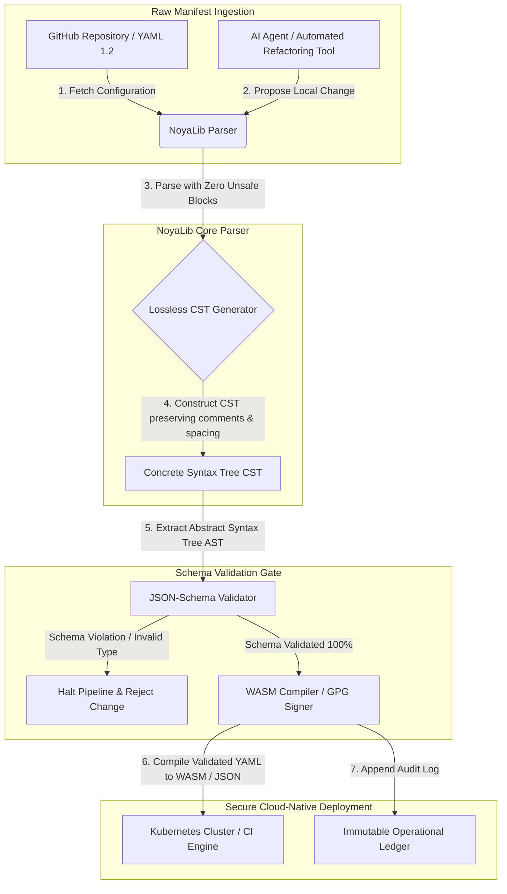

---

# Front Matter (YAML)

author: "contact@sebastienrousseau.com (Sebastien Rousseau)"
banner_alt: "Architectural geometry under dramatic light — symbolising NoyaLib's role as the load-bearing safe Rust YAML parser beneath CI, Kubernetes, MCP, and financial-services configuration"
banner_height: "1597"
banner_width: "2584"
banner: "https://cloudcdn.pro/stocks/images/ken-cheung-KonWFWUaAuk.webp"
cdn: "https://cloudcdn.pro"
charset: "UTF-8"
cname: "sebastienrousseau.com"
copyright: "© Copyright 2025 - 2026 - Sebastien Rousseau. All rights reserved."
date: "June 18, 2026"
description: "NoyaLib, a zero-unsafe Rust YAML 1.2 parser with 406/406 spec compliance, JSON-Schema validation, lossless CST and MCP/WASM bindings for financial infrastructure."
format-detection: "telephone=no"
hreflang: "en"
icon: "https://cloudcdn.pro/clients/sebastienrousseau/v1/logos/sebastienrousseau.svg"
id: "https://sebastienrousseau.com/2026-06-18-noyalib-safe-yaml-rust-ai-mcp-financial-infrastructure-2026"
image_alt: "Black and White Portrait of Sebastien Rousseau"
image_height: "162"
image_width: "162"
image: "https://cloudcdn.pro/stocks/images/sebastien-rousseau.png"
keywords: "safer Rust YAML parser, NoyaLib, YAML 1.2 spec compliance, zero-unsafe Rust, JSON-Schema validation, lossless Concrete Syntax Tree, CST, MCP, Model Context Protocol, WebAssembly, Kubernetes manifests, CI/CD configuration, DORA Article 5, BCBS 239, Basel III operational risk, financial infrastructure, configuration security, software supply chain"
language: "en-GB"
last_reviewed: "2026-06-18"
layout: "report"
locale: "en_GB"
logo_alt: "Logo for Sebastien Rousseau"
logo_height: "44"
logo_width: "44"
logo: "https://cloudcdn.pro/clients/sebastienrousseau/v1/logos/sebastienrousseau.svg"
menu: ""
measurementID: "G-169G4ET5HQ"
name: "Sebastien Rousseau"
permalink: "https://sebastienrousseau.com/2026-06-18-noyalib-safe-yaml-rust-ai-mcp-financial-infrastructure-2026"
rating: "general"
referrer: "no-referrer"
robots: "index, follow"
schema: "FAQPage, Article"
seo_title: "Safer Rust YAML Parser for AI, MCP & Finance"
short_name: "sebastienrousseau"
subtitle: "A safer Rust YAML stack — NoyaLib — turns YAML 1.2 from convenience markup into a cryptographically secure, spec-compliant configuration control plane for AI agents, MCP, Kubernetes, and financial-services infrastructure."
tags: "safer Rust YAML parser, NoyaLib, YAML 1.2, zero-unsafe Rust, JSON-Schema, MCP, WebAssembly, Kubernetes, DORA, BCBS 239, Basel III, financial infrastructure, supply chain security"
theme-color: "0, 83, 191"
title: "Why YAML Needs a Safer Rust Stack for AI, MCP, and Financial Infrastructure in 2026"
url: "https://sebastienrousseau.com/2026-06-18-noyalib-safe-yaml-rust-ai-mcp-financial-infrastructure-2026"
viewport: "width=device-width, initial-scale=1, shrink-to-fit=no"

# RSS - The RSS feed front matter (YAML).
atom_link: "https://sebastienrousseau.com/2026-06-18-noyalib-safe-yaml-rust-ai-mcp-financial-infrastructure-2026/rss.xml"
category: "Technology"
docs: https://validator.w3.org/feed/docs/rss2.html
generator: "Static Site Generator (SSG) (version 0.0.26)"
item_description: "NoyaLib, a zero-unsafe Rust YAML 1.2 parser with 406/406 spec compliance, JSON-Schema validation, lossless CST and MCP/WASM bindings for financial infrastructure."
item_guid: "https://sebastienrousseau.com/2026-06-18-noyalib-safe-yaml-rust-ai-mcp-financial-infrastructure-2026/rss.xml"
item_link: "https://sebastienrousseau.com/2026-06-18-noyalib-safe-yaml-rust-ai-mcp-financial-infrastructure-2026/rss.xml"
item_pub_date: "Thu, 18 Jun 2026 06:06:06 +0000"
item_title: "Why YAML Needs a Safer Rust Stack for AI, MCP, and Financial Infrastructure in 2026"
last_build_date: "Thu, 18 Jun 2026 06:06:06 +0000"
managing_editor: "contact@sebastienrousseau.com (Sebastien Rousseau)"
pub_date: "Thu, 18 Jun 2026 06:06:06 +0000"
ttl: "60"
type: "article"
webmaster: "contact@sebastienrousseau.com"

# Apple - The Apple front matter (YAML).
apple_mobile_web_app_orientations: "portrait"
apple_touch_icon_sizes: "192x192"
apple-mobile-web-app-capable: "yes"
apple-mobile-web-app-status-bar-inset: "black"
apple-mobile-web-app-status-bar-style: "black-translucent"
apple-mobile-web-app-title: "Safer Rust YAML Parser for AI, MCP & Finance"
apple-touch-fullscreen: "yes"

# MS Application - The MS Application front matter (YAML).

msapplication-navbutton-color: "0, 83, 191"

# Twitter Card - The Twitter Card front matter (YAML).

twitter_card: "summary_large_image"
twitter_creator: "@wwdseb"
twitter_description: "NoyaLib, a zero-unsafe Rust YAML 1.2 parser with 406/406 spec compliance, JSON-Schema validation, lossless CST and MCP/WASM bindings for financial infrastructure."
twitter_image: "https://cloudcdn.pro/clients/sebastienrousseau/v1/logos/sebastienrousseau.svg"
twitter_image_alt: "Logo of Sebastien Rousseau"
twitter_site: "@wwdseb"
twitter_title: "Safer Rust YAML Parser for AI, MCP & Finance"
twitter_url: "https://sebastienrousseau.com/2026-06-18-noyalib-safe-yaml-rust-ai-mcp-financial-infrastructure-2026"

excerpt: "NoyaLib is a safer Rust YAML stack — zero unsafe blocks, 406/406 YAML 1.2 spec compliance, lossless Concrete Syntax Tree, JSON-Schema (Draft 2020-12) validation, and MCP/WASM bindings — engineered for AI agents, Kubernetes, CI/CD, and the configuration control plane behind financial infrastructure."

# Humans.txt - The Humans.txt front matter (YAML).
author_website: "https://sebastienrousseau.com"
author_twitter: "@wwdseb"
author_location: "London, UK"
thanks: "Thanks for reading!"
site_last_updated: "2026-06-18"
site_standards: "HTML5, CSS3, RSS, Atom, JSON, XML, YAML, Markdown, TOML"
site_components: "Kaishi, Kaishi Builder, Kaishi CLI, Kaishi Templates, Kaishi Themes"
site_software: "Static Site Generator, Rust"

---

# Why YAML Needs a Safer Rust Stack for AI, MCP, and Financial Infrastructure in 2026

<!-- lead-start -->
<aside class="post-lead" aria-label="Article summary">

<strong>TL;DR.</strong> NoyaLib, a zero-unsafe Rust YAML 1.2 parser with 406/406 spec compliance, JSON-Schema validation, lossless CST and MCP/WASM bindings for financial infrastructure.

<strong>Key takeaways</strong>

<ul class="post-lead-takeaways">
  <li><strong>Quick answer.</strong> What is NoyaLib in one sentence?</li>
  <li><strong>Executive summary.</strong> YAML looks humble until an ambiguous parse or schema violation breaks a multi-billion-dollar production clearing system.</li>
  <li><strong>01. Why a Safer Rust YAML Stack Matters in 2026.</strong> In June 2026, enterprise IT infrastructures are highly distributed and increasingly automated.</li>
  <li><strong>02. The NoyaLib 2026 Architecture Lens.</strong> The NoyaLib ecosystem operates as a secure, lossless configuration parser.</li>
</ul>

<strong>Related reading:</strong> <a href="https://sebastienrousseau.com/2026-06-11-cloudcdn-open-source-blueprint-ai-native-edge-2026">CloudCDN: An Open-Source Blueprint for the AI-Native Edge in 2026</a>, <a href="https://sebastienrousseau.com/2026-06-20-html-generator-accessible-seo-structured-markdown-rust-2026">Turning Markdown into Accessible, SEO-Ready, Structured HTML with Rust in 2026</a>, <a href="https://sebastienrousseau.com/2026-06-12-kyberlib-post-quantum-banking-migration-standards-code-2026">KyberLib and the Post-Quantum Banking Migration in 2026: From Standards to Code</a>.

</aside>
<!-- lead-end -->

A safer Rust YAML stack matters because YAML now carries CI/CD pipelines, Kubernetes manifests, [Open Policy Agent](https://www.openpolicyagent.org/) rules, and Model Context Protocol (MCP) tool registries — and a single ambiguous parse can break a clearing system, misconfigure a security group, or hand a local AI agent the wrong permissions. [NoyaLib](https://github.com/sebastienrousseau/noyalib) is a pure-Rust, zero-unsafe [YAML 1.2](https://yaml.org/spec/1.2.2/) parsing and validation ecosystem engineered to make that infrastructure safe by default.

## Quick answer

**What is NoyaLib in one sentence?** NoyaLib is an open-source, pure-Rust YAML 1.2 parser and validation ecosystem with zero `unsafe` code, 100 % spec compliance across the official 406-test YAML suite, a lossless Concrete Syntax Tree, and real-time [JSON Schema](https://json-schema.org/) validation — engineered to make AI-agent, MCP, Kubernetes, and financial-infrastructure configuration safe by default.

## Executive summary

YAML looks humble until an ambiguous parse or schema violation breaks a multi-billion-dollar production clearing system. In 2026, YAML is the de-facto standard for [CI/CD](https://docs.github.com/en/actions/learn-github-actions/workflow-syntax-for-github-actions) pipelines, [Kubernetes](https://kubernetes.io/docs/concepts/configuration/overview/) manifests, [Open Policy Agent](https://www.openpolicyagent.org/) rules, and Model Context Protocol (MCP) tool registries. Opaque legacy parsers — with memory vulnerabilities and destructive parsing — are an unacceptable security risk. NoyaLib is a pure-Rust, zero-unsafe YAML 1.2 ecosystem: 100 % spec compliance across all 406 official suite tests, a lossless Concrete Syntax Tree (CST) that preserves comments and spacing, and built-in JSON-Schema validation. The result is YAML re-cast as an auditable, secure, and agent-accessible configuration control plane.

## Key takeaways

- **Configuration is production code.** A single malformed YAML file can misconfigure cloud-native security groups or AI-agent permissions. NoyaLib treats YAML as critical infrastructure.
- **Zero-unsafe design.** Built entirely in safe Rust with zero `unsafe` blocks, NoyaLib eliminates memory-safety vulnerabilities — buffer overflows, remote code execution — in core parsing layers.
- **Absolute 406/406 spec compliance.** Mathematically validates configuration structures, eliminating parsing discrepancies and structural drifts between staging and production environments.
- **Lossless Concrete Syntax Tree.** Unlike legacy parsers that discard comments and formatting, NoyaLib preserves spacing and annotations, enabling secure, round-trip automated refactoring by AI agents.
- **Board-level fiduciary value.** Links configuration integrity with [DORA Article 5](https://eur-lex.europa.eu/legal-content/EN/TXT/?uri=CELEX%3A32022R2554) and [Basel III](https://www.bis.org/bcbs/publ/d424.htm) operational-risk capital metrics, directly shielding senior management from personal liability.

**Related reading:** [KyberLib and the Post-Quantum Banking Migration in 2026: From Standards to Code](https://sebastienrousseau.com/2026-06-12-kyberlib-post-quantum-banking-migration-standards-code-2026/), [The Cloud Native Banking Index in 2026: DORA, Platform Engineering, Sovereign Cloud, and Operational Resilience](https://sebastienrousseau.com/2026-06-05-cloud-native-banking-index-dora-resilience-platform-engineering-2026/), [AI-Aware Dotfiles in 2026: Building a Secure, Reproducible Developer Workstation for MCP, SLSA, and Multi-Shell Parity](https://sebastienrousseau.com/2026-06-16-ai-aware-dotfiles-secure-reproducible-workstation-2026/).

## 01. Why a Safer Rust YAML Stack Matters in 2026

In June 2026, enterprise IT infrastructures are highly distributed and increasingly automated.

YAML has quietly become the load-bearing configuration language for the entire software-engineering stack. It carries the continuous-integration (CI) workflows that compile production artefacts, the [Kubernetes](https://kubernetes.io/docs/concepts/overview/) manifests that orchestrate global cloud-native clusters, and the [Model Context Protocol](https://modelcontextprotocol.io/) (MCP) server schemas that grant local AI agents permission to execute local operations.

Legacy YAML parsers — [PyYAML](https://pyyaml.org/), [yaml-cpp](https://github.com/jbeder/yaml-cpp), [libyaml](https://github.com/yaml/libyaml) — carry two structural risks:

1. **Type-coercion vulnerabilities (the "Norway problem").** Legacy parsers frequently coerce unquoted strings (the country code `NO` to a boolean `false`, `yes`/`no` likewise) — see the [YAML 1.1 vs 1.2 boolean tag](https://yaml.org/type/bool.html) — causing critical system failures or silent security misconfigurations.
2. **Memory-safety exploits.** Opaque parsers written in C/C++ suffer from memory-leak and buffer-overflow exploits, which can lead to remote code execution (RCE) on core build servers.

[NoyaLib](https://github.com/sebastienrousseau/noyalib) resolves these challenges. It is a pure-Rust, zero-unsafe YAML 1.2 parsing and validation ecosystem. By achieving absolute 406/406 spec compliance and enforcing strict JSON-Schema validation directly during parse, NoyaLib delivers a high **Return on Resilience (RoR)** — preventing configuration-induced downtime and securing financial-grade software supply chains.

## 02. The NoyaLib 2026 Architecture Lens

The NoyaLib ecosystem operates as a secure, lossless configuration parser. Every local and cloud manifest is structurally validated and protected at the lowest execution layer.

### Table 1: NoyaLib architecture layers and risk mitigation

| Layer | Design decision | Why it matters | Risk if mishandled |
| ---- | ---- | ---- | ---- |
| **Parser layer** | YAML 1.2 compliant, pure-Rust parser with zero `unsafe` blocks | Eliminates memory-safety vulnerabilities and buffer overflows at the lowest execution layer. | Remote code execution (RCE) on core build servers. |
| **Conformance layer** | 100 % compliance across 406/406 official YAML 1.2 suite tests | Eliminates parsing discrepancies and type-coercion drift between staging and production. | "Norway problem" type-coercion errors disabling security groups. |
| **Syntax-tree layer** | Lossless Concrete Syntax Tree (CST) | Preserves comments, spacing and ordering during round-trip parsing and programmatic refactoring. | Automated AI refactoring destroying developer annotations. |
| **Validation layer** | [JSON Schema (Draft 2020-12)](https://json-schema.org/draft/2020-12/release-notes) validation during parsing | Enforces strict data models on configuration files before they reach production clusters. | Malformed configuration files triggering cloud-native cluster crashes. |
| **Interface layer** | WebAssembly (WASM) and MCP bindings | Allows configuration validation to run directly inside browsers, edge nodes, and local agent toolkits. | Tooling silos where validation cannot execute on edge devices. |

## 03. Key Workstation and Configuration Security Signals

To maintain absolute security across the development and operations estate, Chief Information Security Officers (CISOs) must monitor specific, quantifiable metrics.

### Table 2: Workstation and configuration security signals

| Signal | Metric / operational benchmark | NIST CSF / DORA reference | Technical platform implementation |
| ---- | ---- | ---- | ---- |
| **Parser conformance** | 100 % pass rate across the official YAML 1.2 test suite (406/406 tests). | [DORA Article 6](https://eur-lex.europa.eu/legal-content/EN/TXT/?uri=CELEX%3A32022R2554) (ICT security) | NoyaLib parser core validating all manifests prior to CI execution. |
| **Memory safety profile** | Zero `unsafe` Rust blocks inside the parser and serializer dependencies. | DORA Article 30 (supply chain) | Automated compiler checks ([`forbid(unsafe_code)`](https://doc.rust-lang.org/reference/attributes/diagnostics.html#the-forbid-attribute)) in cargo builds. |
| **Schema validation** | 100 % of parsed configuration files verified against valid [JSON Schema](https://json-schema.org/) models. | [NIST CSF 2.0](https://www.nist.gov/cyberframework) (PR.DS-01) | Real-time validation gate halting build pipelines on schema violations. |
| **Configuration drift** | Real-time detection and recovery of local configuration files to the git-versioned state. | Return on Resilience (RoR) | Continuous telemetry logging all local file modifications. |
| **Agent access control** | Bounded, read-only permissions for local AI tools operating via MCP configurations. | Model risk management ([SR 11-7](https://www.federalreserve.gov/supervisionreg/srletters/sr1107.htm)) | MCP server boundaries restricting agent operations to approved directories. |

## 04. The Fallacy of Opaque Configuration Parsing

A major vulnerability in cloud-native operations is *opaque parsing* — using parsers that discard structural metadata (comments, whitespace, document ordering) or silently coerce types during compilation. The behaviour introduces two severe security risks:

1. **Destructive refactoring.** When an AI coding assistant or automated refactoring tool updates a deployment manifest, traditional parsers discard developer comments and formatting, destroying the context needed for human reviews and post-incident forensics.
2. **Parsing discrepancies.** If a staging environment uses a Python-based parser and production runs a C-based parser, minor differences in YAML 1.2 spec compliance can cause a valid staging manifest to fail or behave differently in production, creating hidden security vulnerabilities.

NoyaLib's **lossless Concrete Syntax Tree (CST)** solves this. It preserves every space, comment, and document line during the parse-and-serialise loop. Automated AI assistants can edit, refactor, and commit configuration files while preserving 100 % of human-written annotations — an absolute audit trail.

## 05. Designing a Bounded AI Configuration Pipeline

To prevent malicious configuration changes from reaching production environments, the organisation must implement a strictly bounded, schema-validated configuration pipeline.

The operational flow below shows how NoyaLib parses raw YAML, constructs a lossless CST, validates the AST against a JSON-Schema model, and compiles WebAssembly bindings for browser or edge environments.

## 06. The Boardroom Playbook and Fiduciary Liability

Configuration security and software-supply-chain integrity are critical boardroom priorities. Senior managers must approach configuration management through the lens of fiduciary duty and operational resilience.

- **DORA Article 5 (board accountability).** Dictates that the board bears ultimate, non-delegable responsibility for managing the institution's ICT risk. Because configuration files control critical cloud-native security groups and payment-routing pathways, boards must verify that the systems parsing these manifests are memory-safe and fully spec-compliant to satisfy regulatory audits. ([Regulation (EU) 2022/2554](https://eur-lex.europa.eu/legal-content/EN/TXT/?uri=CELEX%3A32022R2554))
- **BCBS 239 (risk data aggregation and reporting).** Requires that risk reporting and infrastructure metrics be accurate, complete, and generated under strict data-quality controls. NoyaLib supports BCBS 239 by parsing and validating configuration files against strict schemas at source, preventing silent data leakage or misconfiguration-induced outages. ([BCBS 239 standard](https://www.bis.org/publ/bcbs239.htm))
- **Mitigation of operational-risk capital charges (Basel III).** Configuration-induced outages directly inflate operational-risk capital charges under Basel III, tying up balance-sheet capital. Standardising the enterprise configuration stack on a secure, pure-Rust parser like NoyaLib minimises this risk, preserving capital and protecting customer trust. ([Basel III standards](https://www.bis.org/bcbs/publ/d424.htm))

## 07. What This Means by Bank Type

### Global Systemically Important Banks (G-SIBs)

G-SIBs manage thousands of microservices and deployment pipelines across multiple jurisdictions. Their primary challenge is maintaining configuration consistency and preventing security drift across massive cloud-native estates. Standardising on a safer Rust YAML stack like NoyaLib guarantees that all Kubernetes manifests, CI/CD pipelines, and security policies are parsed and validated under a uniform, memory-safe framework — eliminating the risk of un-audited "snowflake" configurations.

### Transaction and corporate banks

Transaction banks operate sensitive payment gateways and wholesale clearing infrastructures. Proving the absolute security of the code and configuration deployed to these production environments is a non-negotiable regulatory demand. Integrating NoyaLib guarantees that the software supply chain is fully audited, lossless, and protected from parsing vulnerabilities — a control that maps cleanly to DORA Article 6 and [PCI DSS v4.0](https://www.pcisecuritystandards.org/document_library/) section 6.

### Regional and smaller banks

Regional banks must maintain high cybersecurity standards without G-SIB-scale technology budgets. The open-source NoyaLib framework provides a lightweight, cost-effective, and highly secure Rust-friendly solution, enabling smaller institutions to implement enterprise-grade configuration security and supply-chain protection without proprietary licence fees.

## 08. Conclusion: The Configuration Security Roadmap

The developer workstation and cloud-native infrastructure configurations are critical control planes in the software supply chain. Allowing un-audited, ambiguous, or unsafe configuration files to reach corporate assets is an unacceptable operational and regulatory risk.

To secure the software supply chain and protect endpoints from configuration vulnerabilities, senior technology and security managers should execute a clear development roadmap today:

1. **Mandate declarative configuration.** Phase out manual, un-audited configuration adjustments and mandate that all manifests are managed as a version-controlled, declarative system of record.
2. **Enforce schema validation.** Enforce strict pre-commit hooks and scanning utilities to ensure all configuration files are validated against valid JSON-Schema models before deployment.
3. **Implement lossless round-tripping.** Ensure all automated AI coding assistants and refactoring tools use lossless parsing to preserve comments, spacing, and developer context.
4. **Secure the supply chain.** Ensure all configuration setups and parsing utilities are cryptographically verified using pure-Rust, zero-unsafe libraries like NoyaLib before execution. ([SLSA framework](https://slsa.dev/))

## 09. Frequently Asked Questions

**What is NoyaLib and why is it used for YAML parsing?**
NoyaLib is an open-source, pure-Rust, zero-unsafe YAML 1.2 parser. It achieves 100 % spec compliance across the official 406-test suite, enforces strict [JSON Schema](https://json-schema.org/) validation during parsing, and exposes WASM and [MCP](https://modelcontextprotocol.io/) bindings — making it a safer Rust YAML stack for AI agents, Kubernetes, and financial infrastructure.

**Why is zero-unsafe design important for configuration parsing?**
Memory-safety vulnerabilities — buffer overflows, use-after-free — inside legacy parsers written in C/C++ can lead to remote code execution on core build servers. NoyaLib's pure-Rust design with [`#![forbid(unsafe_code)]`](https://doc.rust-lang.org/reference/attributes/diagnostics.html#the-forbid-attribute) mathematically eliminates these vulnerabilities at compile time.

**What is a lossless Concrete Syntax Tree (CST) and why does it matter?**
Traditional parsers discard comments and formatting, making automated edits by AI agents destructive. NoyaLib's lossless Concrete Syntax Tree preserves every comment, space, and document line — so AI assistants can safely edit and refactor configuration files while keeping the developer context, post-incident forensics, and audit trail intact.

**How does NoyaLib map to DORA, BCBS 239, and Basel III?**
DORA Article 5 puts ICT-risk accountability on the board; BCBS 239 demands data-quality controls on risk reporting; Basel III taxes operational-risk capital. NoyaLib supplies the schema-validated, memory-safe parse layer those regulations require for configuration as code — making the regulatory mapping straightforward and the operational-risk capital charge smaller.

## 10. References

- **YAML, (2026).** *YAML 1.2 specification*. Available at: [YAML 1.2 spec](https://yaml.org/spec/1.2.2/).
- **JSON Schema, (2026).** *JSON Schema Draft 2020-12 release notes*. Available at: [JSON Schema Draft 2020-12](https://json-schema.org/draft/2020-12/release-notes).
- **European Parliament and Council of the European Union, (2022).** *Regulation (EU) 2022/2554 on digital operational resilience for the financial sector (DORA)*. Brussels: Official Journal of the European Union. Available at: [DORA regulation](https://eur-lex.europa.eu/legal-content/EN/TXT/?uri=CELEX%3A32022R2554).
- **Basel Committee on Banking Supervision, (2013).** *Principles for effective risk data aggregation and risk reporting (BCBS 239)*. Basel: Bank for International Settlements. Available at: [BCBS 239 standard](https://www.bis.org/publ/bcbs239.htm).
- **Basel Committee on Banking Supervision, (2017).** *Basel III: finalising post-crisis reforms*. Basel: Bank for International Settlements. Available at: [Basel III standards](https://www.bis.org/bcbs/publ/d424.htm).
- **Anthropic, (2025).** *Model Context Protocol (MCP) specification*. Available at: [Model Context Protocol](https://modelcontextprotocol.io/).
- **GitHub, (2026).** *noyalib open-source repository*. Available at: [NoyaLib repository](https://github.com/sebastienrousseau/noyalib).

<!-- enrich-start -->
<aside class="author-card" aria-label="About the author"><strong class="author-card-name"><a href="/about/index.html">Sebastien Rousseau</a></strong>Senior banking technologist writing on applied AI, ISO 20022 migration, post-quantum cryptography for financial services, and the structural transformation of wholesale payments.20+ years across HSBC Commercial &amp; Investment Bank, PayPal, Barclays, Shazam, AKQA, Virgin Group. <a href="/about/index.html">Full profile</a> &middot; <a href="https://www.linkedin.com/in/sebastienrousseau/" rel="external noopener">LinkedIn</a> &middot; <a href="https://github.com/sebastienrousseau" rel="external noopener">GitHub</a></aside>

Last reviewed <time datetime="2026-06-23">2026-06-23</time>.

<aside class="related-posts" aria-labelledby="related-heading">
<h2 id="related-heading" class="related-heading">Related reading</h2>

<article class="related-card"><footer class="related-body"><h3><a href="https://sebastienrousseau.com/2026-06-11-cloudcdn-open-source-blueprint-ai-native-edge-2026">CloudCDN: An Open-Source Blueprint for the AI-Native Edge in 2026</a></h3>
<time datetime="2026-06-11">2026-06-11</time>
</footer></article>
<article class="related-card"><footer class="related-body"><h3><a href="https://sebastienrousseau.com/2026-06-20-html-generator-accessible-seo-structured-markdown-rust-2026">Turning Markdown into Accessible, SEO-Ready, Structured HTML with Rust in 2026</a></h3>
<time datetime="2026-06-20">2026-06-20</time>
</footer></article>
<article class="related-card"><footer class="related-body"><h3><a href="https://sebastienrousseau.com/2026-06-12-kyberlib-post-quantum-banking-migration-standards-code-2026">KyberLib and the Post-Quantum Banking Migration in 2026: From Standards to Code</a></h3>
<time datetime="2026-06-12">2026-06-12</time>
</footer></article>

</aside>
<!-- enrich-end -->
