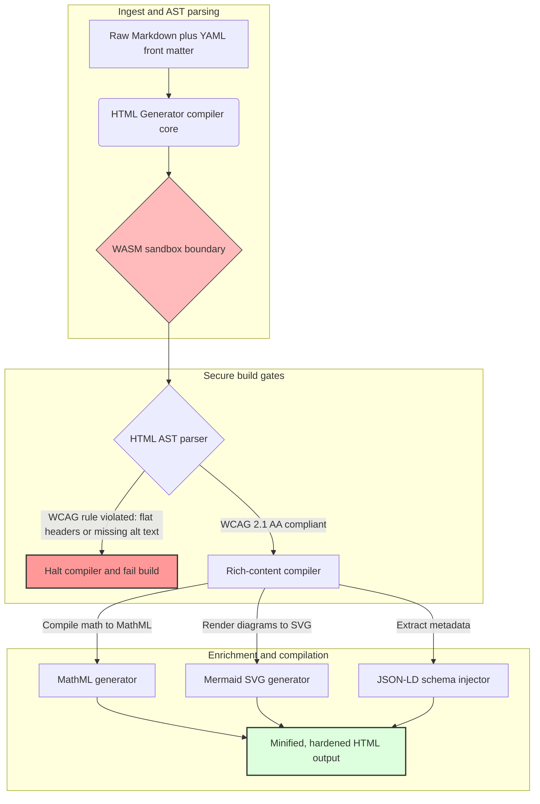

---

# Front Matter (YAML)

author: "contact@sebastienrousseau.com (Sebastien Rousseau)"
banner_alt: "Architectural geometry under structured light — symbolising HTML Generator's role as a compile-gated Markdown-to-HTML pipeline for accessible, SEO-ready, sandboxed publishing infrastructure"
banner_height: "1597"
banner_width: "2584"
banner: "https://cloudcdn.pro/api/transform?url=/stocks/images/markus-winkler-IrRbSND5EUc-unsplash.webp&w=1200&format=webp&q=80"
cdn: "https://cloudcdn.pro"
charset: "UTF-8"
cname: "sebastienrousseau.com"
copyright: "© Copyright 2025 - 2026 - Sebastien Rousseau. All rights reserved."
date: "June 20, 2026"
description: "HTML Generator is a Rust library that turns Markdown into WCAG-compliant, SEO-ready, JSON-LD-enriched HTML — accessibility-as-code, MathML and Mermaid support, and WebAssembly-sandboxed execution for safe enterprise publishing."
format-detection: "telephone=no"
hreflang: "en"
icon: "https://cloudcdn.pro/clients/sebastienrousseau/v1/logos/sebastienrousseau.svg"
id: "https://sebastienrousseau.com/2026-06-20-html-generator-accessible-seo-structured-markdown-rust-2026"
image_alt: "Black and White Portrait of Sebastien Rousseau"
image_height: "162"
image_width: "162"
image: "https://cloudcdn.pro/stocks/images/sebastien-rousseau.png"
keywords: "html-generator, Rust Markdown to HTML, accessibility as code, WCAG 2.1 AA, SEO-ready HTML, JSON-LD, MathML, Mermaid, WebAssembly, EAA, DORA, ADA Title III, accessible publishing, sandboxed parsing, open source"
language: "en-GB"
last_reviewed: "2026-06-20"
layout: "report"
locale: "en_GB"
logo_alt: "Logo for Sebastien Rousseau"
logo_height: "44"
logo_width: "44"
logo: "https://cloudcdn.pro/clients/sebastienrousseau/v1/logos/sebastienrousseau.svg"
menu: ""
measurementID: "G-169G4ET5HQ"
name: "Sebastien Rousseau"
permalink: "https://sebastienrousseau.com/2026-06-20-html-generator-accessible-seo-structured-markdown-rust-2026"
rating: "general"
referrer: "no-referrer"
robots: "index, follow"
schema: "FAQPage, Article"
seo_title: "Accessibility-as-Code: Markdown to AAA HTML with Rust in 2026"
short_name: "sebastienrousseau"
subtitle: "Transforming corporate web publishing, product documentation, and client portals from inaccessible text files into highly structured, compliant, and sandboxed digital assets."
tags: "html-generator, Rust, Markdown, accessibility, WCAG, SEO, JSON-LD, MathML, Mermaid, WebAssembly, EAA, DORA, ADA, AI-discovery, RAG, open source, banking infrastructure"
theme-color: "0, 83, 191"
title: "Turning Markdown into Accessible, SEO-Ready, Structured HTML with Rust in 2026"
url: "https://sebastienrousseau.com/2026-06-20-html-generator-accessible-seo-structured-markdown-rust-2026"
viewport: "width=device-width, initial-scale=1, shrink-to-fit=no"

# RSS - The RSS feed front matter (YAML).
atom_link: "https://sebastienrousseau.com/2026-06-20-html-generator-accessible-seo-structured-markdown-rust-2026/rss.xml"
category: "Technology"
docs: https://validator.w3.org/feed/docs/rss2.html
generator: "Static Site Generator (SSG) (version 0.0.40)"
item_description: "HTML Generator is a Rust library that turns Markdown into WCAG-compliant, SEO-ready, JSON-LD-enriched HTML — accessibility-as-code, MathML and Mermaid support, and WebAssembly-sandboxed execution for safe enterprise publishing."
item_guid: "https://sebastienrousseau.com/2026-06-20-html-generator-accessible-seo-structured-markdown-rust-2026/rss.xml"
item_link: "https://sebastienrousseau.com/2026-06-20-html-generator-accessible-seo-structured-markdown-rust-2026/rss.xml"
item_pub_date: "Sat, 20 Jun 2026 06:06:06 +0000"
item_title: "Turning Markdown into Accessible, SEO-Ready, Structured HTML with Rust in 2026"
last_build_date: "Sat, 20 Jun 2026 06:06:06 +0000"
managing_editor: "contact@sebastienrousseau.com (Sebastien Rousseau)"
pub_date: "Sat, 20 Jun 2026 06:06:06 +0000"
ttl: "60"
type: "article"
webmaster: "contact@sebastienrousseau.com"

# Apple - The Apple front matter (YAML).
apple_mobile_web_app_orientations: "portrait"
apple_touch_icon_sizes: "192x192"
apple-mobile-web-app-capable: "yes"
apple-mobile-web-app-status-bar-inset: "black"
apple-mobile-web-app-status-bar-style: "black-translucent"
apple-mobile-web-app-title: "Markdown to AAA HTML with Rust"
apple-touch-fullscreen: "yes"

# MS Application - The MS Application front matter (YAML).

msapplication-navbutton-color: "0, 83, 191"

# Twitter Card - The Twitter Card front matter (YAML).

twitter_card: "summary_large_image"
twitter_creator: "@wwdseb"
twitter_description: "HTML Generator is a Rust library that turns Markdown into WCAG-compliant, SEO-ready, JSON-LD-enriched HTML — accessibility-as-code, MathML and Mermaid support, and WebAssembly-sandboxed execution for safe enterprise publishing."
twitter_image: "https://cloudcdn.pro/clients/sebastienrousseau/v1/logos/sebastienrousseau.svg"
twitter_image_alt: "Logo of Sebastien Rousseau"
twitter_site: "@wwdseb"
twitter_title: "Accessibility-as-Code: Markdown to AAA HTML with Rust"
twitter_url: "https://sebastienrousseau.com/2026-06-20-html-generator-accessible-seo-structured-markdown-rust-2026"

# Humans.txt - The Humans.txt front matter (YAML).
author_website: "https://sebastienrousseau.com"
author_twitter: "@wwdseb"
author_location: "London, UK"
thanks: "Thanks for reading!"
site_last_updated: "2026-06-20"
site_standards: "HTML5, CSS3, RSS, Atom, JSON, XML, YAML, Markdown, TOML"
site_components: "Kaishi, Kaishi Builder, Kaishi CLI, Kaishi Templates, Kaishi Themes"
site_software: "Static Site Generator, Rust"

---

# Turning Markdown into Accessible, SEO-Ready, Structured HTML with Rust in 2026

<!-- lead-start -->
<aside class="post-lead" aria-label="Article summary">

<strong>TL;DR.</strong> HTML Generator is a pure-Rust Markdown-to-HTML compiler that enforces WCAG 2.1 AA at build time, injects schema-compliant JSON-LD, renders MathML and Mermaid SVG natively, and isolates parsing inside a WebAssembly sandbox — turning publishing into a compile-gated control plane for accessibility, SEO, and ICT security.

<strong>Key takeaways</strong>

<ul class="post-lead-takeaways">
  <li><strong>Quick answer.</strong> What is HTML Generator in one sentence?</li>
  <li><strong>Executive summary.</strong> Markdown rendering looks trivial; getting publishing-grade HTML right is a compliance problem.</li>
  <li><strong>01. Why an accessibility-first HTML compiler matters in 2026.</strong> The EAA and ADA Title III have moved accessibility from engineering hygiene to fiduciary liability.</li>
  <li><strong>02. The HTML Generator 2026 architecture lens.</strong> A multi-stage, compiler-gated pipeline from raw Markdown to hardened HTML output.</li>
</ul>

<strong>Related reading:</strong> <a href="https://sebastienrousseau.com/2026-06-18-noyalib-safe-yaml-rust-ai-mcp-financial-infrastructure-2026">Why YAML Needs a Safer Rust Stack for AI, MCP, and Financial Infrastructure in 2026</a>, <a href="https://sebastienrousseau.com/2026-06-17-static-site-generator-secure-default-ai-era-publishing-2026">A Secure-by-Default Static Site Generator for AI-Era Publishing in 2026</a>, <a href="https://sebastienrousseau.com/2026-06-11-cloudcdn-open-source-blueprint-ai-native-edge-2026">CloudCDN: An Open-Source Blueprint for the AI-Native Edge in 2026</a>.

</aside>
<!-- lead-end -->

In 2026, web content is consumed as much by AI search crawlers, LLM-backed search engines, and Retrieval-Augmented Generation (RAG) pipelines as by human readers. Flat or malformed HTML compromises machine discoverability, while failure to comply with strict global regulations like the [European Accessibility Act (EAA)](https://www.accessibility-act.eu/) and [US ADA Title III](https://www.ada.gov/topics/title-iii/) is now an unambiguous civil liability. [HTML Generator](https://github.com/sebastienrousseau/html-generator) is a high-performance Rust library engineered to close those gaps — at the compiler, not in post-deployment patches.

## Quick answer

**What is HTML Generator in one sentence?** HTML Generator is an open-source, pure-Rust Markdown-to-HTML compiler that enforces [WCAG 2.1 AA](https://www.w3.org/TR/WCAG21/) at build time, generates semantic landmarks and ARIA attributes automatically, injects schema-compliant [JSON-LD](https://json-ld.org/) metadata from YAML front matter, renders Mermaid diagrams and math to accessible SVG and MathML, and runs inside a [WebAssembly](https://webassembly.org/) sandbox — turning corporate publishing into a compile-gated, fiduciary-grade control plane.

## Executive summary

Markdown rendering looks trivial. Publishing-grade HTML is a compliance problem. In June 2026, every corporate touchpoint — investor relations portals, regulatory filings, customer documentation, API references, marketing estates — is parsed by both humans and machines. Two pressures collide on every page: [EAA](https://www.accessibility-act.eu/) and [ADA Title III](https://www.ada.gov/topics/title-iii/) make accessibility a board-level legal exposure, while AI ingestion and RAG pipelines reward structured, machine-readable output. Standard Markdown libraries produce flat HTML that fails both gates. HTML Generator treats document generation as a compile-gated pipeline: WCAG validation is a build error, JSON-LD comes from YAML front matter without manual stamping, MathML and Mermaid render accessibly, and the whole engine ships as a WebAssembly target so parsing of untrusted documents stays sandboxed from the host.

## Key takeaways

- **Accessibility-as-code is the new baseline.** The EAA mandates accessibility for consumer digital services. HTML Generator evaluates the document tree at compile time, generating semantic landmarks and ARIA attributes automatically — fewer post-deployment fixes, fewer remediation budgets, no missing alt-text shipping to production.
- **Structured data for AI discovery.** Modern search and RAG depend on machine-readable metadata. The compiler parses YAML front matter and injects [Schema.org-compliant JSON-LD](https://schema.org/) directly into the document head, making content fully interpretable by [Google Rich Results](https://developers.google.com/search/docs/appearance/structured-data/intro-structured-data), [Bing Webmaster](https://www.bing.com/webmasters), and LLM-backed crawlers.
- **Technical content excellence.** Technical publishing is not flat text. HTML Generator compiles raw Markdown math extensions into accessible [MathML](https://www.w3.org/Math/), and renders [Mermaid.js](https://mermaid.js.org/) diagrams to responsive SVG — both preserving WCAG-compliant structure rather than dropping to opaque images.
- **WebAssembly sandboxing.** Parsing untrusted Markdown is a security risk. By targeting [WASM](https://webassembly.org/), HTML Generator executes inside an isolated sandbox that prevents arbitrary code execution and protects the host system — directly satisfying [DORA Article 6](https://eur-lex.europa.eu/legal-content/EN/TXT/?uri=CELEX%3A32022R2554) ICT-security obligations.
- **Fiduciary protection for boards.** Technical non-compliance has moved into the boardroom. Standardising on a compiler-gated HTML engine shields directors and senior management from personal civil and regulatory exposure under DORA, the EAA, and ADA Title III.

**Related reading:** [Why YAML Needs a Safer Rust Stack for AI, MCP, and Financial Infrastructure in 2026](https://sebastienrousseau.com/2026-06-18-noyalib-safe-yaml-rust-ai-mcp-financial-infrastructure-2026/), [A Secure-by-Default Static Site Generator for AI-Era Publishing in 2026](https://sebastienrousseau.com/2026-06-17-static-site-generator-secure-default-ai-era-publishing-2026/), [CloudCDN: An Open-Source Blueprint for the AI-Native Edge in 2026](https://sebastienrousseau.com/2026-06-11-cloudcdn-open-source-blueprint-ai-native-edge-2026/).

## 01. Why an Accessibility-First HTML Compiler Matters in 2026

Corporate web estates, documentation libraries, and product help centres are critical digital touchpoints. They are now subject to two intense, intersecting pressures.

The first is **AI ingestion and discoverability**. Content is increasingly processed by large language models and Retrieval-Augmented Generation pipelines. Flat or malformed HTML confuses crawler parsing, leaving corporate research and documentation invisible to modern search paradigms — including the [Google Search Generative Experience](https://blog.google/products/search/generative-ai-search/), [ChatGPT](https://chat.openai.com/) browsing, and enterprise RAG agents.

The second is **stringent global accessibility law**. Under the [European Accessibility Act](https://www.accessibility-act.eu/) (fully applicable from June 2025) and [US ADA Title III](https://www.ada.gov/topics/title-iii/), corporate publishing platforms must guarantee complete digital accessibility. Failure to meet [WCAG 2.1 AA](https://www.w3.org/TR/WCAG21/) is no longer an engineering oversight; it is a civil and regulatory liability that has produced multimillion-dollar settlements.

[HTML Generator](https://github.com/sebastienrousseau/html-generator) addresses both pressures directly. It is a thread-safe Rust library designed to transform Markdown into accessible, SEO-ready, structured HTML. By treating document generation as a compiler-gated pipeline, the engine delivers a high **Return on Resilience (RoR)** — protecting balance sheets from accessibility litigation while maximising machine-readability for AI discovery.

## 02. The HTML Generator 2026 Architecture Lens

The framework is designed as a secure, multi-stage compilation pipeline that converts raw Markdown text into cryptographically verified, highly accessible static assets.

### Table 1: HTML Generator architecture layers and risk mitigation

| Layer | Design decision | Why it matters | Risk if mishandled |
| ---- | ---- | ---- | ---- |
| **Input layer** | Markdown plus YAML front matter parser | Meets writers where they are; separates prose from structural metadata. | Inconsistent metadata, broken sitemaps, indexing gaps. |
| **Structure layer** | Automated Table of Contents and semantic landmarks with ARIA tags | Produces navigable, accessible document trees by construction. | Flat HTML that breaks screen readers and violates WCAG. |
| **Rich-content layer** | Native MathML and Mermaid.js SVG rendering | Compiles formulas and diagrams to accessible SVG and MathML. | Client-side JS rendering lag and broken assistive-technology output. |
| **SEO and data layer** | Integrated JSON-LD and structured-metadata generation | Injects [Schema.org](https://schema.org/) compliant JSON-LD directly into the head. | Search engines and AI crawlers misreading author, context, licensing. |
| **Runtime layer** | Native Rust compiler with a WebAssembly target | Enables secure, sandboxed execution on servers, edge nodes, and browsers. | Arbitrary code execution during parsing of untrusted Markdown. |

## 03. Key Web Security and Accessibility Signals

To verify that public-facing publishing assets satisfy modern regulatory and security audits, senior technology officers must monitor specific, quantifiable metrics.

### Table 2: Web security and accessibility signals

| Signal | Metric / operational benchmark | EAA / DORA / W3C reference | Technical implementation |
| ---- | ---- | ---- | ---- |
| **Accessibility conformance** | 100 % of compiled pages validated against WCAG 2.1 AA rules. | [EAA](https://www.accessibility-act.eu/) and [ADA Title III](https://www.ada.gov/topics/title-iii/) | Build-time HTML parser evaluating image alt tags and semantic landmarks. |
| **WASM execution sandbox** | 100 % of untrusted Markdown inputs compiled in an isolated WebAssembly runtime. | [DORA Article 6](https://eur-lex.europa.eu/legal-content/EN/TXT/?uri=CELEX%3A32022R2554) (ICT security) | Isolation of the parsing environment from the host server. |
| **Structured-metadata coverage** | 100 % of published articles injected with valid, schema-compliant JSON-LD headers. | [Schema.org](https://schema.org/) specifications | Automatic front-matter parsing and conversion to JSON-LD objects. |
| **Compilation throughput** | Pages-per-second target above 10,000 on commodity hardware. | Return on Resilience (RoR) | Highly parallelised Rust AST compiler. |
| **Rich-snippet verification** | Zero parsing errors on [Google Rich Results](https://search.google.com/test/rich-results) and [Schema validator](https://validator.schema.org/) runs. | Google Search guidelines | Structural validation of generated JSON-LD during the build pipeline. |

## 04. The Myth of Simple Markdown Rendering

A common misconception among technology managers is that converting Markdown to HTML is a simple text-replacement exercise. Many standard libraries translate Markdown formatting into flat, unstructured HTML. The output renders to a sighted reader in a browser, but it represents a compliance trap.

Flat HTML typically lacks three things.

1. **Correct heading hierarchies.** Standard Markdown does not enforce heading order. Jumping from an `<h1>` to an `<h4>` violates WCAG 2.1 AA and breaks document navigation for screen readers.
2. **Explicit table semantics.** Standard Markdown tables are rarely rendered with the correct `<th>` scope and `<tbody>` attributes required for accessible parsing.
3. **Machine-readable metadata.** Standard HTML lacks the JSON-LD hooks that modern AI search platforms and RAG ingest systems depend on.

HTML Generator resolves this by parsing Markdown into an **Abstract Syntax Tree (AST)**. The engine evaluates the document structure before emitting HTML, validating heading nesting, injecting appropriate ARIA attributes, and asserting that every media asset carries alternative text — turning accessibility from a manual audit into a guaranteed compile-time invariant.

## 05. Designing an Accessibility-as-Code Build Pipeline

To prevent inaccessible or un-indexed assets from ever reaching public deployment, accessibility must be a strict compiler gate. The following pipeline shows how HTML Generator evaluates Markdown, runs WebAssembly-isolated validation, and emits hardened, structured HTML.

## 06. The Boardroom Playbook and Fiduciary Liability

Modern accessibility and web-security compliance are non-negotiable boardroom issues. Senior management must approach publishing infrastructure through the lens of legal risk, financial preservation, and regulatory exposure.

- **The European Accessibility Act (EAA).** Imposes direct, legally binding compliance mandates on public and private digital portals. Non-compliance can produce severe financial penalties, civil litigation, and immediate withdrawal of the asset from the EU market. By integrating accessibility-as-code, boards can certify that non-compliant code cannot ship — converting reactive remediation into a structural legal shield.
- **DORA Article 6 (Secure ICT Environments).** Establishes strict rules for ICT-environment security. By isolating Markdown compilation within a WebAssembly sandbox, organisations ensure that parsing customer-uploaded documentation or partner feeds cannot expose host servers to arbitrary code execution, protecting critical banking portals.
- **Cost reduction in compliance audits.** Traditional accessibility compliance relies on expensive, retrospective post-deployment audits — tens of thousands of dollars annually per site. Implementing WCAG validation as a compile-time block eliminates those retrospective costs, shifting compliance budget from defence to innovation.

## 07. What This Means by Bank / Enterprise Type

### Global Systemically Important Banks (G-SIBs)

G-SIBs operate massive, multilingual public estates that publish thousands of research papers, regulatory disclosures, and investor-relations documents across multiple jurisdictions. Their challenge is scale and multi-language parity. HTML Generator's WebAssembly target and high-throughput Rust engine let large-scale, localised research libraries be updated, compiled, and deployed globally within seconds — without rendering lag or accessibility regression.

### Transaction and Corporate Banks

For transaction banks, customer portals, documentation hubs, and developer API guides are critical digital touchpoints. Compiling those assets through HTML Generator means client-facing channels carry no XSS exposure, no dependency-hijack vectors, and no accessibility deficits — preserving institutional trust and reducing the litigation surface.

### Regional Banks and Fintechs

Regional banks and agile fintechs compete on digital experience without G-SIB engineering budgets. HTML Generator gives those teams an enterprise-grade publishing pipeline out of the box, letting smaller estates ship accessible, SEO-ready, sandboxed assets that withstand scrutiny from both regulators and prospective corporate clients.

## 08. The Publishing Infrastructure Roadmap

Corporate public-facing web estates are a core component of operational resilience. Relying on slow, dynamically vulnerable, database-backed web engines — or unsigned static assets — is an unacceptable business risk.

To secure public digital touchpoints and protect balance sheets from accessibility litigation, senior technology and security managers should execute a clear roadmap.

1. **Transition to static architectures.** Phase out legacy dynamic CMS platforms for research, marketing, and documentation estates. Move content into compiler-gated pipelines like HTML Generator.
2. **Enforce accessibility at build time.** Implement accessibility-as-code. Fail compilation pipelines automatically on any WCAG 2.1 AA violation.
3. **Isolate parsing in WebAssembly.** Sandbox all document and content parsing inside a WASM runtime so untrusted input never touches host systems.
4. **Inject rich JSON-LD metadata.** Ensure every published asset carries schema-compliant JSON-LD headers to maximise AI discoverability.

## 09. Frequently Asked Questions

**How does HTML Generator enforce accessibility?**

It parses the generated HTML Abstract Syntax Tree at build time, evaluating the document against [WCAG 2.1 AA](https://www.w3.org/TR/WCAG21/) rules. If a rule is violated — a missing alt attribute, a heading skip, an unlabelled form control — the compiler halts the build, treating accessibility as a compile-time invariant rather than a post-deployment audit task.

**Why is WebAssembly isolation important?**

[WebAssembly](https://webassembly.org/) allows the Markdown parsing engine to execute inside an isolated sandbox, segregated from the host server. Even when a hostile actor uploads a crafted Markdown document engineered to exploit parser vulnerabilities, execution is trapped — protecting host systems and satisfying DORA Article 6 ICT-security obligations.

**How does JSON-LD benefit search discoverability in 2026?**

[JSON-LD](https://json-ld.org/) provides structured, machine-readable metadata in the document head. [Google Rich Results](https://developers.google.com/search/docs/appearance/structured-data/intro-structured-data), Bing crawlers, and LLM-backed search agents identify author, licence, publication date, and semantic context immediately — bypassing the ambiguity of standard HTML and increasing surface area in AI-driven discovery.

**Who is the audience for HTML Generator?**

Static-site builders, documentation teams, technical writers, Rust developers, and platform engineers shipping accessibility-critical or regulator-facing estates. It is also a viable content-processing layer inside larger secure-publishing pipelines such as [Static Site Generator (SSG)](https://github.com/sebastienrousseau/static-site-generator).

## 10. References

- World Wide Web Consortium (W3C), 2024. [Web Content Accessibility Guidelines (WCAG) 2.1 ⧉](https://www.w3.org/TR/WCAG21/ "Web Content Accessibility Guidelines 2.1").
- Schema.org, 2026. [Schema.org structured-data specifications ⧉](https://schema.org/ "Schema.org structured-data specifications").
- European Parliament and Council of the European Union, 2022. [Regulation (EU) 2022/2554 on digital operational resilience for the financial sector (DORA) ⧉](https://eur-lex.europa.eu/legal-content/EN/TXT/?uri=CELEX%3A32022R2554 "DORA Regulation").
- European Commission, 2025. [European Accessibility Act ⧉](https://www.accessibility-act.eu/ "European Accessibility Act").
- US Department of Justice, 2024. [ADA Title III ⧉](https://www.ada.gov/topics/title-iii/ "ADA Title III").
- WebAssembly Community Group, 2026. [WebAssembly specification ⧉](https://webassembly.org/ "WebAssembly").
- GitHub, 2026. [HTML Generator repository ⧉](https://github.com/sebastienrousseau/html-generator "HTML Generator open-source repository").

<!-- enrich-start -->
<aside class="author-card" aria-label="About the author"><strong class="author-card-name"><a href="/about/index.html">Sebastien Rousseau</a></strong>Senior banking technologist writing on applied AI, payments infrastructure, tokenised money, ISO 20022, post-quantum security, cloud-native financial services, open-source infrastructure, and regulated digital markets.20+ years across HSBC Commercial &amp; Investment Bank, PayPal, Barclays, Shazam, AKQA, Virgin Group. <a href="/about/index.html">Full profile</a> &middot; <a href="https://www.linkedin.com/in/sebastienrousseau/" rel="external noopener">LinkedIn</a> &middot; <a href="https://github.com/sebastienrousseau" rel="external noopener">GitHub</a></aside>

Last reviewed <time datetime="2026-06-20">2026-06-20</time>.

<!-- enrich-end -->
