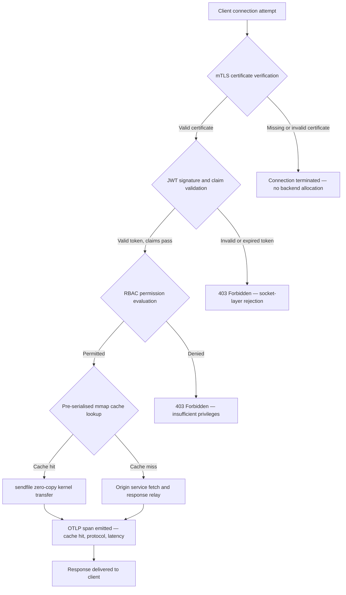

---

# Front Matter (YAML)

author: "contact@sebastienrousseau.com (Sebastien Rousseau)"
banner_alt: "Abstract circuit-board cityscape at night — visualising the banking edge where kernel-level zero-copy transfers, mTLS handshakes, and JWT validation converge in a single statically linked binary"
banner_height: "1597"
banner_width: "2584"
banner: "https://cloudcdn.pro/stocks/images/bit-cloud-GlqbGLCPnQ4.webp"
cdn: "https://cloudcdn.pro"
charset: "UTF-8"
cname: "sebastienrousseau.com"
copyright: "© Copyright 2025 - 2026 - Sebastien Rousseau. All rights reserved."
date: "June 20, 2026"
description: "http-handle is a statically linked Rust binary that delivers 180,000 requests per second at the banking edge with zero runtime dependencies, integrated mTLS and JWT validation, ALPN-negotiated HTTP/2 and HTTP/3, and OTLP observability — closing the security and resilience gaps that Nginx and Envoy leave open."
format-detection: "telephone=no"
hreflang: "en"
icon: "https://cloudcdn.pro/clients/sebastienrousseau/v1/logos/sebastienrousseau.svg"
id: "https://sebastienrousseau.com/2026-06-20-http-handle-zero-dependency-edge-ingress-banking-rust-2026"
image_alt: "Black and White Portrait of Sebastien Rousseau"
image_height: "162"
image_width: "162"
image: "https://cloudcdn.pro/stocks/images/sebastien-rousseau.png"
keywords: "http-handle, Rust edge ingress, zero dependency proxy, banking infrastructure, mTLS JWT, sendfile zero-copy, ALPN HTTP3, DORA compliance, Basel III, OTLP observability, static binary, ARM64 banking, zero trust banking, lightweight ingress, Rust banking security"
language: "en-GB"
last_reviewed: "2026-06-20"
layout: "report"
locale: "en_GB"
logo_alt: "Logo for Sebastien Rousseau"
logo_height: "44"
logo_width: "44"
logo: "https://cloudcdn.pro/clients/sebastienrousseau/v1/logos/sebastienrousseau.svg"
menu: ""
measurementID: "G-169G4ET5HQ"
name: "Sebastien Rousseau"
permalink: "https://sebastienrousseau.com/2026-06-20-http-handle-zero-dependency-edge-ingress-banking-rust-2026"
rating: "general"
referrer: "no-referrer"
robots: "index, follow"
schema: "FAQPage, Article"
seo_title: "http-handle: Zero-Dependency Rust Ingress for Banking at 180k req/s"
short_name: "sebastienrousseau"
subtitle: "How a single statically linked Rust binary delivers 180,000 requests per second with mTLS, JWT, and ALPN at the banking edge — and what it means for DORA and Basel III compliance."
tags: "http-handle, Rust, banking, edge-ingress, mTLS, JWT, ALPN, HTTP3, DORA, Basel-III, zero-copy, sendfile, ARM64, zero-trust, OTLP, observability, open-source, infrastructure"
theme-color: "0, 83, 191"
title: "http-handle: High-Performance, Zero-Dependency Edge Ingress for Banking in 2026"
url: "https://sebastienrousseau.com/2026-06-20-http-handle-zero-dependency-edge-ingress-banking-rust-2026"
viewport: "width=device-width, initial-scale=1, shrink-to-fit=no"

# RSS - The RSS feed front matter (YAML).
atom_link: "https://sebastienrousseau.com/2026-06-20-http-handle-zero-dependency-edge-ingress-banking-rust-2026/rss.xml"
category: "Technology"
docs: https://validator.w3.org/feed/docs/rss2.html
generator: "Static Site Generator (SSG) (version 0.0.40)"
item_description: "http-handle is a statically linked Rust binary that delivers 180,000 requests per second at the banking edge with zero runtime dependencies, integrated mTLS and JWT validation, ALPN-negotiated HTTP/2 and HTTP/3, and OTLP observability — closing the security and resilience gaps that Nginx and Envoy leave open."
item_guid: "https://sebastienrousseau.com/2026-06-20-http-handle-zero-dependency-edge-ingress-banking-rust-2026/rss.xml"
item_link: "https://sebastienrousseau.com/2026-06-20-http-handle-zero-dependency-edge-ingress-banking-rust-2026/rss.xml"
item_pub_date: "Sat, 20 Jun 2026 07:07:07 +0000"
item_title: "http-handle: High-Performance, Zero-Dependency Edge Ingress for Banking in 2026"
last_build_date: "Sat, 20 Jun 2026 07:07:07 +0000"
managing_editor: "contact@sebastienrousseau.com (Sebastien Rousseau)"
pub_date: "Sat, 20 Jun 2026 07:07:07 +0000"
ttl: "60"
type: "article"
webmaster: "contact@sebastienrousseau.com"

# Apple - The Apple front matter (YAML).
apple_mobile_web_app_orientations: "portrait"
apple_touch_icon_sizes: "192x192"
apple-mobile-web-app-capable: "yes"
apple-mobile-web-app-status-bar-inset: "black"
apple-mobile-web-app-status-bar-style: "black-translucent"
apple-mobile-web-app-title: "Zero-Dependency Banking Edge"
apple-touch-fullscreen: "yes"

# MS Application - The MS Application front matter (YAML).

msapplication-navbutton-color: "0, 83, 191"

# Twitter Card - The Twitter Card front matter (YAML).

twitter_card: "summary_large_image"
twitter_creator: "@wwdseb"
twitter_description: "http-handle is a statically linked Rust binary that delivers 180,000 requests per second at the banking edge with zero runtime dependencies, mTLS, JWT, and OTLP observability."
twitter_image: "https://cloudcdn.pro/clients/sebastienrousseau/v1/logos/sebastienrousseau.svg"
twitter_image_alt: "Logo of Sebastien Rousseau"
twitter_site: "@wwdseb"
twitter_title: "http-handle: Zero-Dependency Rust Ingress for Banking at 180k req/s"
twitter_url: "https://sebastienrousseau.com/2026-06-20-http-handle-zero-dependency-edge-ingress-banking-rust-2026"

# Humans.txt - The Humans.txt front matter (YAML).
author_website: "https://sebastienrousseau.com"
author_twitter: "@wwdseb"
author_location: "London, UK"
thanks: "Thanks for reading!"
site_last_updated: "2026-06-20"
site_standards: "HTML5, CSS3, RSS, Atom, JSON, XML, YAML, Markdown, TOML"
site_components: "Kaishi, Kaishi Builder, Kaishi CLI, Kaishi Templates, Kaishi Themes"
site_software: "Static Site Generator, Rust"

excerpt: "The banking edge has a dependency problem. Every Nginx or Envoy instance that routes traffic between a client and a core banking service carries a dependency tree: OpenSSL builds, Lua modules,…"
---

# http-handle: High-Performance, Zero-Dependency Edge Ingress for Banking in 2026

<!-- lead-start: manual -->
<aside class="post-lead" aria-label="Article summary">

<strong>TL;DR.</strong> http-handle is a statically linked Rust binary that delivers 180,000 requests per second at the banking edge with zero runtime dependencies, integrated mTLS and JWT validation, ALPN-negotiated HTTP/2 and HTTP/3, and OTLP observability — closing the security and resilience gaps that Nginx and Envoy leave open.

<strong>Key takeaways</strong>

<ul class="post-lead-takeaways">
  <li><strong>The heavy proxy problem.</strong> Nginx and Envoy carry dependency trees that expand the CVE surface and complicate DORA ICT-risk remediation cycles.</li>
  <li><strong>Zero-copy performance at scale.</strong> Pre-serialised mmap cache blocks and <code>sendfile(2)</code> kernel transfers sustain 180,000 req/s on ARM64 with sub-millisecond proxy overhead.</li>
  <li><strong>Security at the socket, not the application.</strong> mTLS client verification, JWT validation, and RBAC evaluation complete before any backend resource is allocated to the request.</li>
  <li><strong>Regulatory alignment built in.</strong> The reduced attack surface and auditable single-binary deployment directly address DORA Articles 5 and 6, Basel III operational risk, and SM&amp;CR accountability chains.</li>
</ul>

<strong>Related reading:</strong> <a href="https://sebastienrousseau.com/2023-11-19-crystals-kyber-the-safeguarding-algorithm-in-a-quantum-age/index.html">CRYSTALS-Kyber: The Safeguarding Algorithm in a Quantum Age</a>, <a href="https://sebastienrousseau.com/2026-06-20-html-generator-accessible-seo-structured-markdown-rust-2026">Turning Markdown into Accessible, SEO-Ready, Structured HTML with Rust in 2026</a>, <a href="https://sebastienrousseau.com/2026-06-12-kyberlib-post-quantum-banking-migration-standards-code-2026">KyberLib and the Post-Quantum Banking Migration in 2026: From Standards to Code</a>.

</aside>
<!-- lead-end -->

The banking edge has a dependency problem. Every Nginx or Envoy instance that routes traffic between a client and a core banking service carries a dependency tree: OpenSSL builds, Lua modules, gRPC libraries, and container layers — each a potential CVE, each requiring a dedicated patching cycle, each adding latency variance that complicates SLA measurement. Under the [Digital Operational Resilience Act (DORA)](https://eur-lex.europa.eu/eli/reg/2022/2554/oj), that complexity is now a regulatory liability as much as an operational one.

[http-handle](https://github.com/sebastienrousseau/http-handle) takes a different approach. It is a single, statically linked Rust binary with zero runtime dependencies beyond `libc`. It delivers 180,000 requests per second on ARM64 nodes, enforces mutual TLS and JWT authentication at the network socket layer, and negotiates HTTP/2 and HTTP/3 automatically — all within a deployment footprint under 20 MB of RAM.

## Quick answer

**What is http-handle in one sentence?** http-handle is an open-source, statically linked Rust binary that replaces heavy proxy containers at the banking edge, delivering 180,000 req/s on ARM64 via Linux `sendfile(2)` zero-copy kernel transfers, enforcing mTLS, JWT, and RBAC at the socket layer before any backend resource is touched, and emitting native [OpenTelemetry](https://opentelemetry.io/) metrics — with zero runtime library dependencies beyond `libc`.

## Executive summary

Banks have run Nginx and Envoy at their edge for a decade. Both are capable; neither was designed for the regulatory environment of 2026. Dependency-laden container images generate CVE queues that compliance teams cannot clear fast enough, and every library version bump carries regression risk. DORA Articles 5 and 6 demand that ICT risk is managed by design, not patched after discovery. Basel III operational risk frameworks penalise architectures where failure points multiply with system complexity.

http-handle eliminates the dependency problem at the source. The binary is compiled once, statically, with no external library requirements at runtime. The attack surface shrinks to the Rust standard library plus `libc`. Security enforcement — mTLS certificate verification, JWT claim validation, and role-based access control — executes at the network socket before any backend allocation, collapsing the Zero Trust perimeter to its smallest possible expression. Performance follows from architecture: pre-serialised memory-mapped cache blocks combined with `sendfile(2)` kernel transfers remove data from the CPU-to-memory copy path entirely, sustaining 180,000 req/s on ARM64 hardware. The result is an ingress layer that satisfies DORA resilience requirements, supports Basel III operational risk reduction arguments, and gives senior IT leaders under SM&CR a verifiable, single-component accountability chain for edge infrastructure.

## Key takeaways

- **Smaller binaries, smaller CVE queues.** A statically linked single binary has one package to patch, one release to validate, and one artefact to audit. Nginx with a standard module set ships with more than 30 shared library dependencies; each carries its own vulnerability lifecycle.
- **Zero-copy is not an optimisation — it is a design constraint.** At 180,000 req/s, any user-space data copy introduces measurable latency variance. `sendfile(2)` transfers file descriptor contents to the network socket entirely in kernel space. Combined with mmap-pinned response cache blocks, the CPU never touches the data path for cached responses.
- **The security perimeter belongs at the socket.** Validating JWTs and mTLS certificates in application middleware means the backend has already allocated threads and memory before the request is rejected. Socket-layer validation ensures that unauthenticated requests consume no backend resources whatsoever.
- **OTLP removes the observability gap.** Native OpenTelemetry integration means that every request, every authentication decision, and every protocol negotiation produces structured telemetry without a sidecar agent. Existing bank dashboards ingest OTLP traces directly.

**Related reading:** [Why YAML Needs a Safer Rust Stack for AI, MCP, and Financial Infrastructure in 2026](https://sebastienrousseau.com/2026-06-18-noyalib-safe-yaml-rust-ai-mcp-financial-infrastructure-2026/), [CloudCDN: An Open-Source Blueprint for the AI-Native Edge in 2026](https://sebastienrousseau.com/2026-06-11-cloudcdn-open-source-blueprint-ai-native-edge-2026/), [Best Cloud Infrastructure Architecture for Banks and Financial Institutions in 2026](https://sebastienrousseau.com/2026-05-16-best-cloud-infrastructure-architecture-2026/).

## 01. The Heavy Proxy Problem in Banking

Nginx and Envoy built the modern internet's edge. They are configurable, battle-tested, and supported by large communities. They are also architectural choices made before DORA existed, before Basel III operational risk frameworks demanded quantifiable complexity reduction, and before ARM64 cloud nodes changed the economics of high-throughput compute.

The practical consequence is a gap between what banks need and what heavy proxy containers deliver.

**Dependency surface.** A standard Envoy deployment pulls in OpenSSL, Abseil, Protobuf, gRPC, Lua, and dozens of secondary libraries. Each carries an independent CVE lifecycle. When the National Vulnerability Database publishes a critical OpenSSL advisory, every Envoy instance in the estate becomes a compliance clock: assess, patch, test, redeploy, and re-certify — across every environment where the binary runs. Under DORA Article 6, banks must demonstrate that ICT risk management processes are proportionate, documented, and verifiable. A multi-library dependency tree makes that demonstration expensive to maintain.

**Memory overhead.** A minimally configured Nginx worker process consumes 40–80 MB of resident memory under moderate load. At scale — hundreds of ingress nodes across trading systems, payment APIs, and customer-facing portals — that overhead compounds into a measurable infrastructure cost with no corresponding performance benefit over a well-engineered single-binary alternative.

**Patching velocity.** Container-image supply chains introduce multi-day lag between a CVE publication and a validated patch reaching production. The base image must be rebuilt, the application layer re-layered, the full test matrix re-run, and the deployment pipeline re-executed. For critical banking systems operating under DORA incident reporting windows, this cycle is a structural risk.

http-handle addresses all three. One binary. One CVE surface. One artefact to patch. Under 20 MB of RAM for a production ingress node.

## 02. The http-handle 2026 Architecture Lens

The binary is structured as five interdependent layers, each designed to eliminate a specific category of risk that traditional proxy architectures accumulate.

### Table 1: http-handle architecture layers and risk mitigation

| Layer | Design decision | Why it matters | Risk if mishandled |
| ---- | ---- | ---- | ---- |
| **Server core** | Single Rust binary, statically linked, zero dependencies beyond `libc` | One artefact to patch; eliminates library CVE propagation across the estate | Dependency confusion attacks; library vulnerability accumulation |
| **Acceleration engine** | Pre-serialised mmap cache blocks and `sendfile(2)` zero-copy kernel transfers | 180,000 req/s on ARM64 with sub-millisecond proxy overhead; no data enters user space for cached responses | Memory-mapping leaks; kernel-space bottlenecks under cache invalidation |
| **Cryptographic security** | Native mTLS with hot-reload certificate support and ALPN negotiation | Guarantees data integrity and protocol compatibility; certificate rotation without connection drops | Certificate expiry causing service outages; weak cipher suite defaults |
| **Access policy plane** | Socket-layer JWT validation and RBAC claim evaluation | Unauthenticated requests consume no backend resources; Zero Trust enforced at the kernel boundary | JWT algorithm confusion attacks; RBAC misconfiguration granting over-privileged access |
| **Observability** | Native [OpenTelemetry (OTLP)](https://opentelemetry.io/docs/specs/otlp/) integration | Structured telemetry without sidecar agents; direct ingestion into existing bank monitoring estates | Blind spots during outages; incomplete audit trails for DORA incident reporting |

## 03. Key Performance and Security Signals

Banks operating http-handle at the edge must instrument five quantifiable signals to satisfy DORA operational reporting requirements and internal SLA governance.

### Table 2: Operational benchmarks and regulatory references

| Signal | Benchmark | Regulatory reference | Technical implementation |
| ---- | ---- | ---- | ---- |
| **Throughput** | ≥ 180,000 req/s on ARM64 nodes at P99 ≤ 1 ms proxy overhead | Basel III operational risk — system complexity reduction | `sendfile(2)` + mmap pre-serialised cache blocks; no user-space data copy for cache hits |
| **Attack surface** | Zero runtime library dependencies; one binary artefact per release | [DORA Article 6](https://eur-lex.europa.eu/eli/reg/2022/2554/oj) — ICT risk management by design | Static compilation with `cargo build --release --target aarch64-unknown-linux-musl` |
| **Authentication latency** | mTLS handshake + JWT validation completing before first byte of backend response | [DORA Article 5](https://eur-lex.europa.eu/eli/reg/2022/2554/oj) — ICT security protection | Socket-layer interception; JWT claim evaluation in kernel-adjacent Rust before backend routing |
| **Certificate availability** | Hot-reload of mTLS certificates with zero dropped connections during rotation | SM&CR senior management accountability for edge availability | inotify-driven certificate watcher; atomic file-descriptor swap during reload |
| **Observability coverage** | 100 % of requests producing OTLP spans with authentication outcome, protocol version, and cache status | DORA Article 17 — incident detection and reporting | Native OTLP exporter; no sidecar required; gRPC or HTTP/Protobuf transport configurable |

## 04. The Zero-Copy Engine: mmap and sendfile(2)

Network performance in high-frequency banking — real-time payments, market-data APIs, authentication token services — is bounded by one constraint more than any other: the cost of moving bytes from storage to the network socket.

Conventional HTTP servers read file contents into a user-space buffer, then write that buffer to the socket. That sequence requires two memory copies and two context switches between user space and kernel space for every response. At 180,000 requests per second, the accumulated overhead is substantial.

http-handle eliminates both copies.

**Memory-mapped cache blocks.** When the service starts, it serialises static response content into memory-mapped regions using `mmap(2)`. These regions are pinned in the kernel's page cache. When a request arrives for a cached resource, the response is already mapped into kernel memory — no disk read, no buffer allocation.

**`sendfile(2)` kernel transfer.** The Linux `sendfile(2)` system call transfers data directly from a file descriptor — or a memory-mapped region — to a network socket file descriptor, entirely within the kernel. No byte enters user space. The CPU's role reduces to issuing the system call and handling the completion event. On ARM64 nodes with this architecture, http-handle sustains 180,000 req/s at sub-millisecond proxy overhead under sustained load.

For banks running month-end batch reconciliation, intraday liquidity reporting, or real-time fraud-scoring API traffic, the engineering consequence is direct: fewer ARM64 nodes per traffic tier, lower infrastructure cost, and smaller DORA resilience risk from capacity shortfalls.

## 05. The mTLS and JWT Access Policy Plane

In banking, authentication at the edge is not a feature — it is a regulatory requirement. DORA mandates that ICT security controls are proportionate, documented, and verifiable. SM&CR places personal accountability for infrastructure security decisions on named senior managers. The question is not whether to authenticate at the edge, but at what layer.

http-handle enforces a three-stage Zero Trust policy before any backend resource is allocated.

**Stage 1: mTLS client certificate verification.** During the TLS handshake, http-handle requests and validates the client certificate against a configurable trust store. Connections without a valid certificate terminate at the handshake. No application thread is spawned, no memory pool is allocated. The backend never sees the request.

**Stage 2: JWT claim validation.** For connections that pass mTLS, http-handle extracts and validates the JSON Web Token from the `Authorization` header at the socket layer. Signature verification, expiry checks, and issuer validation occur before the request reaches the routing layer. Algorithm confusion attacks — where a server accepts a symmetric algorithm when an asymmetric key is expected — are blocked by explicit algorithm allow-listing in configuration.

**Stage 3: RBAC claim evaluation.** Validated JWT claims map to an in-memory role table. Requests carrying insufficient permissions receive a 403 response at the access policy plane. The backend service is never invoked for unauthorised traffic.

This sequencing matters operationally. Under the traditional model — where authentication runs in application middleware — an attacker can exhaust backend thread pools with unauthenticated requests before a single rejection is issued. Socket-layer authentication collapses that attack vector entirely.

## 06. ALPN Routing and the HTTP/3 Fallback Chain

Banking traffic arrives over diverse network conditions: corporate fibre for trading desks, 5G for mobile banking clients, satellite connectivity for remote operations, and TLS inspection proxies in regulated environments. A single-protocol ingress creates a lowest-common-denominator constraint.

http-handle uses [Application-Layer Protocol Negotiation (ALPN)](https://www.rfc-editor.org/rfc/rfc7301) to select the optimal protocol for each connection automatically.

**HTTP/2** is the default for browser and API traffic over TCP. Multiplexed streams over a single connection eliminate the head-of-line blocking that HTTP/1.1 introduces under concurrent request patterns.

**HTTP/3 (QUIC)** activates when the network supports UDP and the client advertises `h3` in its ALPN extension. QUIC's independent stream multiplexing and connection migration make it materially better for mobile banking clients on congested cellular networks where TCP connections drop and reconnect frequently.

**Graceful fallback.** If ALPN negotiation fails — because an intermediate proxy strips the extension or a legacy client omits it — http-handle falls back to HTTP/1.1 while maintaining all security headers, mTLS enforcement, and JWT validation. No security property degrades during protocol fallback.

## 07. The Zero-Copy Request Lifecycle

The following diagram shows the complete request path from client connection to response delivery, including the authentication gates and observability emission points.

The critical path for cache-hit responses traverses three security gates and one system call. No user-space buffer is allocated for the response body. The OTLP span captures the authentication outcome, the ALPN-negotiated protocol version, the cache status, and the end-to-end latency in a single structured record.

## 08. Regulatory Alignment: DORA, Basel III, and SM&CR

### DORA Articles 5 and 6 — ICT risk management and protection

[DORA Article 5](https://eur-lex.europa.eu/eli/reg/2022/2554/oj) requires financial entities to maintain ICT risk management frameworks. Article 6 requires them to implement protection and prevention measures proportionate to the risk profile of their ICT systems.

A statically linked single binary satisfies both requirements more efficiently than a multi-library container stack. The attack surface is quantifiable — one artefact, one dependency (`libc`), one CVE surface — and the protection measures are structural rather than procedural: mTLS and JWT enforcement cannot be bypassed by misconfiguration because they execute at the socket layer before any configurable application logic runs.

### Basel III — Operational risk capital requirements

[Basel III's operational risk framework](https://www.bis.org/bcbs/basel3.htm) ties regulatory capital requirements to demonstrable risk reduction. Banks that can document a measurable decrease in system complexity and ICT failure-point count have a quantifiable argument for reduced operational risk capital allocation. Replacing a multi-container proxy estate with single-binary ingress nodes is precisely the kind of complexity reduction that supports this argument — provided the engineering team can produce the attestation documentation.

http-handle's auditable release artefacts — reproducible builds, SBOM-compatible dependency manifests, and OTLP-based operational logs — support the documentation chain that Basel III capital discussions require.

### SM&CR — Senior manager accountability

The [Senior Managers and Certification Regime (SM&CR)](https://www.fca.org.uk/firms/senior-managers-certification-regime) places personal liability on named senior managers for the ICT security posture of systems under their accountability. A single-binary ingress that hot-reloads certificates without service interruption, produces structured audit logs via OTLP, and has one version-pinned artefact per deployment gives the named senior manager a verifiable, documentable security chain. A multi-library container stack does not.

## 09. What This Means by Role

### Board of directors and chief executives

Regulatory capital optimisation under Basel III operational risk frameworks depends on demonstrable complexity reduction. Replacing Nginx or Envoy with a single statically linked binary reduces the ICT failure-point count in a way that is auditable and presentable to prudential regulators. Reduced CVE surface also supports cyber-insurance premium renegotiation — insurers price on demonstrable attack-surface metrics, and a single-dependency ingress binary is a concrete data point.

### Chief information security officers and chief risk officers

DORA compliance requires ICT protection measures to be proportionate and verifiable. Socket-layer mTLS and JWT enforcement provides a verifiable, non-bypassable authentication gate at the edge. Hot-reload certificate rotation eliminates the service-window risk that traditional certificate updates carry. The zero-dependency compilation model means that when a critical `libc` advisory is published, the entire estate can be rebuilt, tested, and redeployed from a single Rust source artefact in hours rather than days.

### Engineering and IT management

180,000 req/s on a standard ARM64 node changes the infrastructure-sizing conversation for payment APIs and authentication services. Native OTLP integration removes the need for Prometheus exporters, sidecar agents, or custom log shippers. The Kubernetes deployment model is a standard pod — under 20 MB of RAM, no privileged container permissions, no host-network access. Certificate hot-reload operates without Kubernetes rolling-restart overhead.

## FAQ

**How does http-handle handle certificate rotation under load?**
The binary monitors certificate file paths using an inotify watcher. When new certificate and key files are detected, it performs an atomic swap of the active TLS context — existing connections complete using the previous certificate while new connections immediately use the rotated one. No connection is dropped. No service window is required.

**Can http-handle run inside a Kubernetes cluster as an ingress controller?**
Yes. The binary runs as a standalone pod with a standard ingress service annotation. Resource requirements are under 20 MB of RAM at full throughput, with no privileged container permissions and no host-network access requirement. It can also run as a sidecar in service meshes where mTLS enforcement at the sidecar layer is preferred over centralized gateway authentication.

**What is the measurable latency contribution of the proxy itself?**
For cache-hit responses, the proxy overhead — from socket accept to `sendfile(2)` completion — is sub-millisecond on ARM64 hardware. For cache-miss responses that require upstream fetch, the overhead is the same sub-millisecond figure plus the origin response time. The proxy itself does not add queuing latency because authentication occurs synchronously at the socket layer with no thread-pool allocation before credential validation completes.

**How does http-handle fit into a Zero Trust architecture alongside an existing API gateway?**
http-handle operates at OSI Layer 4/7 boundary: it enforces transport-layer mTLS and validates application-layer JWTs before routing to upstream services. It can sit in front of a full API gateway — absorbing unauthenticated traffic before it reaches the gateway's more expensive processing layer — or replace the gateway entirely for services whose access policy is expressible entirely in JWT claims.

**Is the binary output reproducible for supply-chain audit purposes?**
Yes. The build is reproducible with a pinned Rust toolchain version and locked `Cargo.lock`. SBOM generation via `cargo cyclonedx` produces a CycloneDX-compliant bill of materials for each release. Both artefacts are publishable to the bank's internal software composition analysis toolchain and satisfy DORA supply-chain risk documentation requirements.

## Conclusion

The banking edge does not need more features — it needs fewer components, each doing less and doing it verifiably. http-handle reduces the ingress layer to its irreducible minimum: a single Rust binary that enforces authentication at the socket, transfers data without copying it, and reports everything it does in structured telemetry. For banks navigating DORA compliance timelines, Basel III capital optimisation reviews, and SM&CR accountability requirements, that simplicity is not an engineering preference — it is a regulatory argument.

The [http-handle source code](https://github.com/sebastienrousseau/http-handle) is available under the MIT and Apache 2.0 dual licence.

---

*References*

Basel Committee on Banking Supervision (2011). *Basel III: A global regulatory framework for more resilient banks and banking systems*. Bank for International Settlements. Available at: [https://www.bis.org/publ/bcbs189.pdf](https://www.bis.org/publ/bcbs189.pdf)

European Parliament and Council (2022). Regulation (EU) 2022/2554 on digital operational resilience for the financial sector (DORA). Available at: [https://eur-lex.europa.eu/legal-content/EN/TXT/?uri=CELEX:32022R2554](https://eur-lex.europa.eu/legal-content/EN/TXT/?uri=CELEX:32022R2554)

Financial Conduct Authority (2015). *Senior Managers and Certification Regime (SM&CR)*. Available at: [https://www.fca.org.uk/firms/senior-managers-certification-regime](https://www.fca.org.uk/firms/senior-managers-certification-regime)

Internet Engineering Task Force (2014). *RFC 7301: Transport Layer Security (TLS) Application-Layer Protocol Negotiation Extension*. Available at: [https://www.rfc-editor.org/rfc/rfc7301](https://www.rfc-editor.org/rfc/rfc7301)

OpenTelemetry Authors (2024). *OpenTelemetry Protocol Specification (OTLP)*. Available at: [https://opentelemetry.io/docs/specs/otlp/](https://opentelemetry.io/docs/specs/otlp/)

<!-- enrich-start -->
<aside class="author-card" aria-label="About the author"><strong class="author-card-name"><a href="/about/index.html">Sebastien Rousseau</a></strong>Senior banking technologist writing on applied AI, ISO 20022 migration, post-quantum cryptography for financial services, and the structural transformation of wholesale payments.20+ years across HSBC Commercial &amp; Investment Bank, PayPal, Barclays, Shazam, AKQA, Virgin Group. <a href="/about/index.html">Full profile</a> &middot; <a href="https://www.linkedin.com/in/sebastienrousseau/" rel="external noopener">LinkedIn</a> &middot; <a href="https://github.com/sebastienrousseau" rel="external noopener">GitHub</a></aside>

Last reviewed <time datetime="2026-06-22">2026-06-22</time>.

<aside class="related-posts" aria-labelledby="related-heading">
<h2 id="related-heading" class="related-heading">Related reading</h2>

<article class="related-card"><footer class="related-body"><h3><a href="https://sebastienrousseau.com/2026-06-22-hsh-zero-downtime-cryptographic-stewardship-rust-banking-2026">Securing Password Management in Enterprise Banking: Multi-Algorithm Hashing and Upgrades with hsh</a></h3>
<time datetime="2026-06-22">2026-06-22</time>
</footer></article>
<article class="related-card"><footer class="related-body"><h3><a href="https://sebastienrousseau.com/2023-11-19-crystals-kyber-the-safeguarding-algorithm-in-a-quantum-age/index.html">CRYSTALS-Kyber: The Safeguarding Algorithm in a Quantum Age</a></h3>
<time datetime="2023-11-19">2023-11-19</time>
</footer></article>
<article class="related-card"><footer class="related-body"><h3><a href="https://sebastienrousseau.com/2026-06-20-html-generator-accessible-seo-structured-markdown-rust-2026">Turning Markdown into Accessible, SEO-Ready, Structured HTML with Rust in 2026</a></h3>
<time datetime="2026-06-20">2026-06-20</time>
</footer></article>

</aside>
<!-- enrich-end -->
