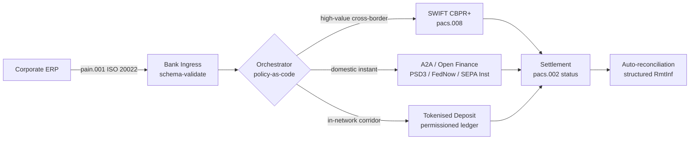

---

# Front Matter (YAML)

author: "contact@sebastienrousseau.com (Sebastien Rousseau)"
banner_alt: "Container ship at a deepwater port at dawn — symbolising the multi-rail, cross-border movement of corporate value across ISO 20022, open finance, and tokenised-deposit settlement networks in 2026"
banner_height: "1597"
banner_width: "2584"
banner: "https://cloudcdn.pro/stocks/images/viktor-forgacs-KxVRDiFdTVo.webp"
cdn: "https://cloudcdn.pro"
charset: "UTF-8"
cname: "sebastienrousseau.com"
copyright: "© Copyright 2025 - 2026 - Sebastien Rousseau. All rights reserved."
date: "June 24, 2026"
description: "How ISO 20022, A2A, open finance under PSD3/FiDA, and tokenised deposits are reshaping cross-border corporate treasury alongside SWIFT in 2026."
format-detection: "telephone=no"
hreflang: "en"
icon: "https://cloudcdn.pro/clients/sebastienrousseau/v1/logos/sebastienrousseau.svg"
id: "https://sebastienrousseau.com/2026-06-24-cross-border-iso-20022-open-finance-tokenised-deposits-treasury-2026"
image_alt: "Black and White Portrait of Sebastien Rousseau"
image_height: "162"
image_width: "162"
image: "https://cloudcdn.pro/stocks/images/sebastienrousseau.webp"
keywords: "cross-border payments, ISO 20022, open finance, PSD3, FiDA, tokenised deposits, stablecoins, A2A, treasury, CIB, Nexi, Mastercard, multi-rail, pacs.008, pain.001, SWIFT, FedNow, SEPA Instant, RTP, CBPR+"
language: "en-GB"
last_reviewed: "2026-06-24"
layout: "report"
locale: "en_GB"
logo_alt: "Logo for Sebastien Rousseau"
logo_height: "44"
logo_width: "44"
logo: "https://cloudcdn.pro/clients/sebastienrousseau/v1/logos/sebastienrousseau.svg"
menu: ""
measurementID: "G-169G4ET5HQ"
name: "Sebastien Rousseau"
permalink: "https://sebastienrousseau.com/2026-06-24-cross-border-iso-20022-open-finance-tokenised-deposits-treasury-2026"
rating: "general"
referrer: "no-referrer"
robots: "index, follow"
schema: "FAQPage, Article"
seo_title: "Cross-Border 2026: ISO 20022, Open Finance, Tokenised Rails"
short_name: "sebastienrousseau"
subtitle: "Cross-border corporate treasury in 2026 runs on multi-rail mechanics — ISO 20022 as the common grammar, A2A and open finance as the customer-facing rail, tokenised deposits as the wholesale settlement leg, with SWIFT still anchoring the long tail."
tags: "cross-border payments, ISO 20022, open finance, PSD3, FiDA, tokenised deposits, A2A, treasury, CIB, multi-rail, pacs.008, pain.001, SWIFT, FedNow, SEPA Instant, RTP, CBPR+"
theme-color: "0, 83, 191"
title: "Cross-Border 2026: ISO 20022, Open Finance and Tokenised Deposits in Corporate Treasury"
url: "https://sebastienrousseau.com/2026-06-24-cross-border-iso-20022-open-finance-tokenised-deposits-treasury-2026"
viewport: "width=device-width, initial-scale=1, shrink-to-fit=no"

# RSS - The RSS feed front matter (YAML).
atom_link: "https://sebastienrousseau.com/2026-06-24-cross-border-iso-20022-open-finance-tokenised-deposits-treasury-2026/rss.xml"
category: "Technology"
docs: https://validator.w3.org/feed/docs/rss2.html
generator: "Static Site Generator (SSG) (version 0.0.26)"
item_description: "How ISO 20022, A2A, open finance under PSD3/FiDA, and tokenised deposits are reshaping cross-border corporate treasury alongside SWIFT in 2026."
item_guid: "https://sebastienrousseau.com/2026-06-24-cross-border-iso-20022-open-finance-tokenised-deposits-treasury-2026/rss.xml"
item_link: "https://sebastienrousseau.com/2026-06-24-cross-border-iso-20022-open-finance-tokenised-deposits-treasury-2026/rss.xml"
item_pub_date: "Wed, 24 Jun 2026 07:07:07 +0000"
item_title: "Cross-Border 2026: ISO 20022, Open Finance and Tokenised Deposits in Corporate Treasury"
last_build_date: "Wed, 24 Jun 2026 06:06:06 +0000"
managing_editor: "contact@sebastienrousseau.com (Sebastien Rousseau)"
pub_date: "Wed, 24 Jun 2026 07:07:07 +0000"
ttl: "60"
type: "article"
webmaster: "contact@sebastienrousseau.com"

# Apple - The Apple front matter (YAML).
apple_mobile_web_app_orientations: "portrait"
apple_touch_icon_sizes: "192x192"
apple-mobile-web-app-capable: "yes"
apple-mobile-web-app-status-bar-inset: "black"
apple-mobile-web-app-status-bar-style: "black-translucent"
apple-mobile-web-app-title: "Cross-Border 2026: ISO 20022, Open Finance, Tokenised Rails"
apple-touch-fullscreen: "yes"

# MS Application - The MS Application front matter (YAML).

msapplication-navbutton-color: "0, 83, 191"

# Twitter Card - The Twitter Card front matter (YAML).

twitter_card: "summary_large_image"
twitter_creator: "@wwdseb"
twitter_description: "How ISO 20022, A2A, open finance under PSD3/FiDA, and tokenised deposits are reshaping cross-border corporate treasury alongside SWIFT in 2026."
twitter_image: "https://cloudcdn.pro/clients/sebastienrousseau/v1/logos/sebastienrousseau.svg"
twitter_image_alt: "Logo of Sebastien Rousseau"
twitter_site: "@wwdseb"
twitter_title: "Cross-Border 2026: ISO 20022, Open Finance, Tokenised Rails"
twitter_url: "https://sebastienrousseau.com/2026-06-24-cross-border-iso-20022-open-finance-tokenised-deposits-treasury-2026"

excerpt: "Cross-border corporate treasury in 2026 is a multi-rail engineering problem. ISO 20022 is the common grammar, A2A and open finance under PSD3/FiDA are the customer-facing rail, tokenised deposits handle the wholesale settlement leg, and SWIFT still anchors the long tail. The interesting work is in the orchestration layer, not the model."

# Humans.txt - The Humans.txt front matter (YAML).
author_website: "https://sebastienrousseau.com"
author_twitter: "@wwdseb"
author_location: "London, UK"
thanks: "Thanks for reading!"
site_last_updated: "2026-06-24"
site_standards: "HTML5, CSS3, RSS, Atom, JSON, XML, YAML, Markdown, TOML"
site_components: "Kaishi, Kaishi Builder, Kaishi CLI, Kaishi Templates, Kaishi Themes"
site_software: "Static Site Generator, Rust"

---

# Cross-Border 2026: ISO 20022, Open Finance and Tokenised Deposits in Corporate Treasury

<!-- lead-start -->
<aside class="post-lead" aria-label="Article summary">

<strong>TL;DR.</strong> How ISO 20022, A2A, open finance under PSD3/FiDA, and tokenised deposits are reshaping cross-border corporate treasury alongside SWIFT in 2026.

<strong>Key takeaways</strong>

<ul class="post-lead-takeaways">
  <li><strong>01. From cards to A2A — the open finance shift.</strong> The card rails are not going away.</li>
  <li><strong>02. ISO 20022 as the lingua franca across rails.</strong> The reason multi-rail is workable at all is that the message format is now consistent across rails.</li>
  <li><strong>03. Tokenised deposits and stable rails.</strong> The wholesale settlement leg is where the rail story gets interesting.</li>
  <li><strong>04. The autonomous treasury stack.</strong> Above the rail layer sits the orchestration layer.</li>
</ul>

<strong>Related reading:</strong> <a href="https://sebastienrousseau.com/2026-06-23-iso-20022-pain001-programmable-liquidity-autonomic-treasury-2026">From Pain.001 to Programmable Liquidity: ISO 20022 as the Autonomic Nervous System of Treasury in 2026</a>, <a href="https://sebastienrousseau.com/2026-05-12-iso-20022-pacs008-structured-address-deadline">The November 2026 pacs.008 Structured-Address Deadline: A Six-Month View</a>, <a href="https://sebastienrousseau.com/2026-06-01-multi-rail-bank-cards-a2a-stablecoins-rtp-fednow-open-banking-2026">The Multi-Rail Bank in 2026: Cards, A2A, Stablecoins, RTP, FedNow, and Open Banking in One Strategy</a>.

</aside>
<!-- lead-end -->

> **Executive Summary.** Cross-border corporate treasury in 2026 is a multi-rail engineering problem before it is a relationship-management problem. PSD3 and the Financial Data Access (FiDA) regulation widen the open-banking perimeter into corporate treasury data; the November 2026 SWIFT MT/MX cut-over makes CBPR+-compliant pacs.008 the only viable cross-border interbank format; tokenised deposits and regulated stablecoin rails handle the wholesale settlement leg in near T+0 inside permissioned networks. The CIB that wins in this cycle is not the one that picks a single rail; it is the one that engineers the orchestration layer that binds them. This article walks the four-rail architecture (A2A under PSD3, SWIFT CBPR+, bank-issued tokenised deposits, regulated stablecoins) — what each rail does well, where the credit-exposure boundaries fall, and what the policy-as-code orchestration layer above them must enforce so the corporate sees one payment and the supervisor sees one auditable trail.

A European industrial corporate pays a Brazilian supplier EUR 4.2 million on a Wednesday morning. The treasury workstation does not pick a bank. It picks a rail — a sequence of rails. The customer-facing instruction lands on an A2A pain.001 message routed through an open finance provider under PSD3. The bank legs it across two correspondent jurisdictions on tokenised deposits inside a CIB private network. The long tail — a USD 80,000 invoice clean-up to a sub-supplier without a tokenised-deposit relationship — still rides SWIFT CBPR+ as a pacs.008. The customer sees one payment. The architecture sees four rails. [ISO 20022](/2023-09-29-automating-iso-20022-compliant-payment-file-creation-with-pain001/index.html) is the only reason it holds together.

This is the operating model Mastercard describes when it talks about [the evolution from open banking to open finance](https://www.mastercard.com/us/en/news-and-trends/Insights/2026/open-banking-to-open-finance-the-evolution-of-financial-data.html "Mastercard: open banking to open finance, the evolution of financial data") — data and payments fused into one orchestration layer, with the rail chosen by the system, not the customer. The interesting question for senior banking technologists is not which rail wins. It is how the orchestration layer is engineered, governed, and reconciled.

## 01. From cards to A2A — the open finance shift

The card rails are not going away. They are being reframed.

Through 2025 and into 2026, [PSD3 and the Financial Data Access (FiDA) regulation](https://www.consultancy.uk/news/42202/orchestrating-open-banking-for-platform-growth-2026-outlook "Consultancy.uk: orchestrating open banking for platform growth, 2026 outlook") extended the open-banking obligation beyond payment accounts into pensions, mortgages, savings, insurance and corporate treasury data. The corporate treasury implication is direct: a CIB relationship manager can now consume a corporate's full liquidity picture across multiple banks through one API contract, on the corporate's instruction.

Two operators are visibly building the orchestration layer corporates will consume. Nexi has extended its acquiring footprint into A2A initiation across SEPA Instant and pan-European RTGS corridors, ISO 20022 native end-to-end. Mastercard's open finance platform — anchored on its acquisition of Aiia and Finicity — provides the data-aggregation and consent layer underneath, with payment initiation surfacing through the same API estate that previously served card authorisations.

The shift matters for three reasons:

1. **Unit economics.** A2A initiated under PSD3 strips interchange out of the payment. For high-ticket B2B flows, the saving is material; for low-ticket consumer flows, the merchant cost stack collapses.
2. **Data quality.** A2A under ISO 20022 carries structured remittance data that cards never could. Auto-reconciliation rates above 95% are now table-stakes.
3. **Risk model.** A2A is a credit transfer, not a card authorisation. The fraud surface, chargeback model, and dispute model are all different. Corporate treasury teams need to understand the customer protection layer is being rebuilt, not inherited.

The CIB selling a multi-rail proposition in 2026 is selling orchestration — not access. Access is now regulated.

## 02. ISO 20022 as the lingua franca across rails

The reason multi-rail is workable at all is that the message format is now consistent across rails.

The BIS Committee on Payments and Market Infrastructures (CPMI) made the architectural case clear in its [ISO 20022 harmonisation requirements for enhancing cross-border payments](https://www.bis.org/cpmi/publ/d230.pdf "BIS CPMI: ISO 20022 harmonisation requirements for enhancing cross-border payments"). The November 2025 cut-over to CBPR+ closed the MT103 / MT202 era for cross-border interbank messaging. From that point, every major rail — SWIFT, FedNow, SEPA Instant, RTP, and the major instant payment systems in Asia and Latin America — speaks the same pacs.008 / pacs.009 / pain.001 grammar.

The practical consequence for corporate treasury:

- **Routing is data-driven.** The treasury workstation can read a pain.001 once and decide the rail per payment based on corridor, ticket size, cut-off, and counterparty relationship — without re-mapping the message.
- **Remittance data survives the hop.** Structured remittance fields (`<RmtInf><Strd>`) carry through correspondent legs without truncation. Auto-reconciliation rates climb because the data is no longer lost at the rail boundary.
- **Sanctions screening becomes auditable.** Structured `<Dbtr>` / `<Cdtr>` / `<DbtrAgt>` / `<CdtrAgt>` fields with LEI references replace free-text name screening. Hit rates fall. Investigation queues shrink.

The diagram below traces a single pain.001 through the bank's ingress, into the policy-as-code orchestrator, and out to whichever rail the corridor and ticket size demand — one message, many rails, no re-mapping.

The cost of this consistency is engineering discipline. ISO 20022 is permissive. Two banks can be fully CBPR+ compliant and still produce pacs.008 messages that differ in field usage, character set, and remittance-data structure. The CIB that wins on cross-border in 2026 enforces a stricter message profile than the standard requires — and rejects on parse, not on settlement.

## 03. Tokenised deposits and stable rails

The wholesale settlement leg is where the rail story gets interesting.

The 2026 picture, captured well in the [Trade Treasury Payments analysis of automation, contingency rails, ISO 20022 and stablecoins](https://tradetreasurypayments.com/articles/automation-contingency-rails-iso-20022-and-stablecoins-the-2026-trends-reshaping-corporate-finance-and-b2b-payments "Trade Treasury Payments: automation, contingency rails, ISO 20022 and stablecoins, the 2026 trends reshaping corporate finance and B2B payments"), splits the wholesale settlement layer into two structurally different models.

**Bank-issued tokenised deposits.** A commercial bank issues a tokenised liability on a permissioned ledger — JPM Coin, HSBC's Orion-linked deposit token, the major European CIB equivalents. The token is a direct claim on the issuing bank. Settlement is near T+0 inside the network. Compliance is the issuing bank's responsibility. The rail is fully regulated, fully traceable, and constrained to participants the issuer has on-boarded.

**Integrated stablecoin rails.** A regulated stablecoin — fully reserved, audited, and operating under MiCA or the equivalent regional regime — settles a corridor where bank-issued tokenised deposits do not yet reach. The token is a claim on the reserve, not on a bank balance sheet. Compliance is shared between the issuer, the on-ramp, and the off-ramp.

The two models are not competing. They are stacked. A CIB cross-border product in 2026 typically uses bank-issued tokenised deposits for the in-network leg and a regulated stablecoin for the corridor where the in-network rail terminates. The corporate sees one ISO 20022 payment. The settlement story underneath is multi-token.

The board-level question is the same one operational-risk committees have been asking since the first programmable-liquidity pilots: who carries the credit exposure on the token, and for how long? Tokenised deposits give a clean answer — the issuing bank, until burn. Integrated stablecoin rails give a more nuanced one — the reserve, subject to the audit cycle and redemption guarantee. A treasury team that does not document the answer per rail per corridor is carrying unmeasured credit risk on its balance sheet.

## 04. The autonomous treasury stack

Above the rail layer sits the orchestration layer. Above the orchestration layer sits the agent layer.

I have set out the architecture in detail in [The Autonomous Treasury Index 2026: Programmable Liquidity and Tokenised Deposits](https://sebastienrousseau.com/2026-06-07-autonomous-treasury-index-programmable-liquidity-tokenised-deposits-2026 "Sebastien Rousseau: The Autonomous Treasury Index 2026"). The short version: agentic treasury in 2026 is the orchestration layer, expressed as policy-as-code, with bounded agents executing within it.

The stack is:

1. **Rail layer.** SWIFT CBPR+, instant A2A, tokenised deposits, regulated stablecoins. Each rail has a published profile, cut-off table, cost curve, and settlement-finality model.
2. **Orchestration layer.** ISO 20022 in, ISO 20022 out. Rail decision per payment based on corridor, ticket, cut-off, counterparty relationship, and policy. Policy is versioned, signed, and auditable.
3. **Agent layer.** Bounded treasury agents execute the orchestration policy with tool-call boundaries, audit logs, and kill switches. The agent does not pick the rail. The policy picks the rail. The agent runs the policy.
4. **Reconciliation layer.** ISO 20022 pacs.008 / pacs.002 / camt.054 messages reconcile against the original pain.001 instruction, with structured remittance data closing the loop without manual intervention.

The CIB selling this stack in 2026 is selling four things at once — and pricing them separately. The corporate buying it is buying optionality across rails, with one message standard, one policy layer, one reconciliation feed. That is the architectural shift. Everything else is implementation detail.

## FAQ

**Is "open finance" just rebranded open banking?**
No. Open banking under PSD2 covered payment accounts. PSD3 and the Financial Data Access (FiDA) regulation extend the data-sharing obligation into pensions, mortgages, savings, insurance, and corporate treasury data. The corporate-treasury implication is direct: a CIB relationship manager can now consume a corporate's full liquidity picture across multiple banks through one API contract, on the corporate's instruction, not just its payment-account history.

**Why is the orchestration layer the architectural focus, not the rail?**
Because rails are now commoditising. SWIFT CBPR+ pacs.008, A2A under PSD3, tokenised deposits, and regulated stablecoins all carry the same ISO 20022 grammar at the message level. What differentiates a 2026 CIB is the policy-as-code engine that selects the rail per payment based on corridor, ticket size, settlement-finality requirement, and counterparty relationship — and that records the choice in audit telemetry the supervisor will ask for. Without that engine, multi-rail is just optionality with no governance.

**Where does the credit-exposure boundary fall on a tokenised-deposit leg?**
Bank-issued tokenised deposits on a permissioned ledger are a direct claim on the issuing bank — credit exposure ends at burn. Regulated stablecoin rails (MiCA-supervised in the EU, the Bank of England's discussion-paper regime in the UK, analogues elsewhere) are a claim on the reserve, with the exposure window subject to the audit cycle and the redemption-guarantee terms. A treasury team that does not document the answer per rail per corridor is carrying unmeasured credit risk on its balance sheet.

**What happens to SWIFT in this architecture?**
SWIFT does not disappear — it anchors the long tail. Corridors where bank-issued tokenised deposits do not yet reach (most emerging-market sub-supplier relationships, most low-frequency / low-ticket cross-border flow), and corridors where the corporate or the bank requires the CBPR+ correspondent-banking audit trail, continue on SWIFT pacs.008. The 2026 architecture is "SWIFT + new rails", not "new rails instead of SWIFT".

**What does the corporate buy when it buys this stack?**
Optionality across rails, with one message standard (ISO 20022), one policy layer (the orchestration engine), and one reconciliation feed (pacs.002 status + camt.054 confirmation + structured camt.053 statements). The corporate is not paying for four separate rail connections. It is paying for the orchestration layer that makes four rails behave as one operationally — and the audit trail that lets it answer "which rail did that EUR 4.2 m payment ride, and why?" the morning after the next supervisory request.

## Conclusion

Cross-border corporate treasury in 2026 is a multi-rail engineering problem. ISO 20022 is the grammar that makes multi-rail tractable. PSD3 and FiDA widen the data perimeter and force open finance into the corporate treasury workflow. Tokenised deposits and regulated stablecoins handle the wholesale settlement leg. SWIFT still anchors the long tail.

The CIB that wins is the one that builds the orchestration layer — not the one that picks a single rail and bets the franchise on it. The corporate treasury team that wins is the one that documents the credit exposure per rail per corridor, enforces a stricter ISO 20022 profile than the regulator requires, and treats the rail decision as policy, not as a per-payment judgment call.

The interesting work is in the orchestration layer. Build it carefully.

## References

Bank for International Settlements, Committee on Payments and Market Infrastructures (2023). *Harmonised ISO 20022 data requirements for enhancing cross-border payments* (CPMI Papers No. 230). Available at: [https://www.bis.org/cpmi/publ/d230.htm](https://www.bis.org/cpmi/publ/d230.htm "BIS CPMI 230 — Harmonised ISO 20022 data requirements")

Bank for International Settlements (2024). *Project Agorá: cross-border payments with tokenised commercial bank deposits and central bank money*. BIS Innovation Hub. Available at: [https://www.bis.org/about/bisih/topics/fmis/agora.htm](https://www.bis.org/about/bisih/topics/fmis/agora.htm "BIS Project Agorá")

Bank of England (2023). *Regulatory regime for systemic payment systems using stablecoins and related service providers — Discussion Paper*. Available at: [https://www.bankofengland.co.uk/paper/2023/dp/regulatory-regime-for-systemic-payment-systems-using-stablecoins-and-related-service-providers](https://www.bankofengland.co.uk/paper/2023/dp/regulatory-regime-for-systemic-payment-systems-using-stablecoins-and-related-service-providers "Bank of England — Regulatory regime for stablecoins discussion paper")

European Commission (2023). *Proposal for a Directive on payment services and electronic money services (PSD3)*. Available at: [https://finance.ec.europa.eu/regulation-and-supervision/financial-services-legislation/implementing-and-delegated-acts/payment-services-directive_en](https://finance.ec.europa.eu/regulation-and-supervision/financial-services-legislation/implementing-and-delegated-acts/payment-services-directive_en "European Commission — Payment Services Directive proposal")

European Parliament and Council (2023). *Regulation (EU) 2023/1114 on markets in crypto-assets (MiCA)*. Available at: [https://eur-lex.europa.eu/eli/reg/2023/1114/oj](https://eur-lex.europa.eu/eli/reg/2023/1114/oj "Regulation (EU) 2023/1114 — Markets in Crypto-Assets (MiCA)")

Financial Action Task Force (2023). *International standards on combating money laundering and the financing of terrorism — Recommendation 16 on wire transfers*. Available at: [https://www.fatf-gafi.org/en/publications/Fatfrecommendations/Fatf-recommendations.html](https://www.fatf-gafi.org/en/publications/Fatfrecommendations/Fatf-recommendations.html "FATF Recommendations")

International Organization for Standardization (2020). *ISO 17442 Financial services — Legal entity identifier (LEI)*. Available at: [https://www.gleif.org/en/about-lei/iso-17442-the-lei-code-structure](https://www.gleif.org/en/about-lei/iso-17442-the-lei-code-structure "ISO 17442 — Legal Entity Identifier")

SWIFT (2024). *Cross-Border Payments and Reporting Plus (CBPR+) usage guidelines*. Available at: [https://www.swift.com/standards/iso-20022/iso-20022-programme](https://www.swift.com/standards/iso-20022/iso-20022-programme "SWIFT CBPR+ usage guidelines")

<!-- enrich-start -->
<aside class="author-card" aria-label="About the author"><strong class="author-card-name"><a href="/about/index.html">Sebastien Rousseau</a></strong>Senior banking technologist writing on applied AI, ISO 20022 migration, post-quantum cryptography for financial services, and the structural transformation of wholesale payments.20+ years across HSBC Commercial &amp; Investment Bank, PayPal, Barclays, Shazam, AKQA, Virgin Group. <a href="/about/index.html">Full profile</a> &middot; <a href="https://www.linkedin.com/in/sebastienrousseau/" rel="external noopener">LinkedIn</a> &middot; <a href="https://github.com/sebastienrousseau" rel="external noopener">GitHub</a></aside>

Last reviewed <time datetime="2026-06-24">2026-06-24</time>.

<aside class="related-posts" aria-labelledby="related-heading">
<h2 id="related-heading" class="related-heading">Related reading</h2>

<article class="related-card"><footer class="related-body"><h3><a href="https://sebastienrousseau.com/2026-06-23-iso-20022-pain001-programmable-liquidity-autonomic-treasury-2026">From Pain.001 to Programmable Liquidity: ISO 20022 as the Autonomic Nervous System of Treasury in 2026</a></h3>
<time datetime="2026-06-23">2026-06-23</time>
</footer></article>
<article class="related-card"><footer class="related-body"><h3><a href="https://sebastienrousseau.com/2026-05-12-iso-20022-pacs008-structured-address-deadline">The November 2026 pacs.008 Structured-Address Deadline: A Six-Month View</a></h3>
<time datetime="2026-05-12">2026-05-12</time>
</footer></article>
<article class="related-card"><footer class="related-body"><h3><a href="https://sebastienrousseau.com/2026-06-01-multi-rail-bank-cards-a2a-stablecoins-rtp-fednow-open-banking-2026">The Multi-Rail Bank in 2026: Cards, A2A, Stablecoins, RTP, FedNow, and Open Banking in One Strategy</a></h3>
<time datetime="2026-06-01">2026-06-01</time>
</footer></article>

</aside>
<!-- enrich-end -->
