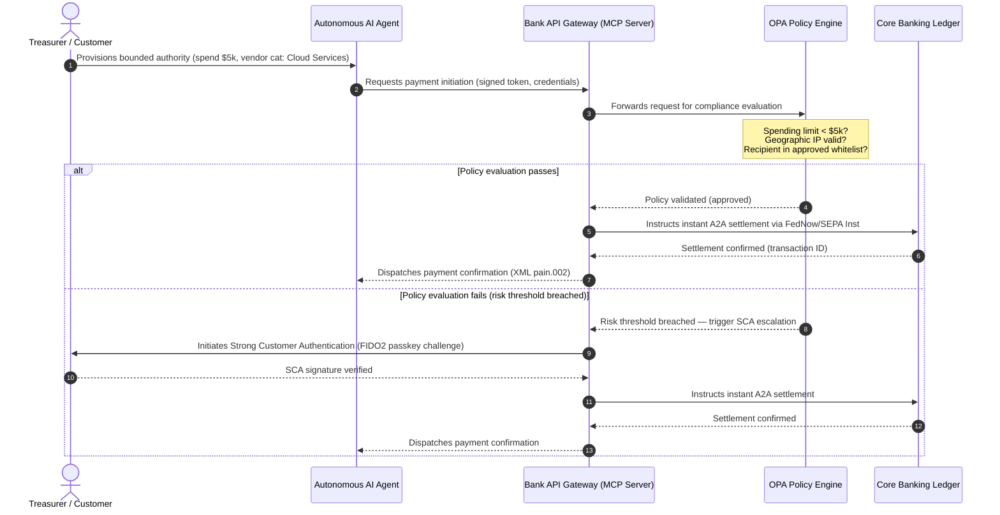

---

# Front Matter (YAML)

author: "contact@sebastienrousseau.com (Sebastien Rousseau)"
banner_alt: "Aerial dawn view of a major financial centre at the edge of land and sea — symbolising the convergence of agentic commerce, invisible payments, and real-time treasury infrastructure in the 2026 global payments cycle"
banner_height: "1080"
banner_width: "1920"
banner: "https://cloudcdn.pro/stocks/images/miquel-parera-NsXLehhHx1Q-1920.webp"
cdn: "https://cloudcdn.pro"
charset: "UTF-8"
cname: "sebastienrousseau.com"
copyright: "© Copyright 2025 - 2026 - Sebastien Rousseau. All rights reserved."
date: "June 25, 2026"
description: "The 2026 global payments cycle is agentic, invisible, and real-time. A G-SIB and regional bank operating model for risk, revenue, tokenisation, and the November 2026 SWIFT structured-address cut-over."
format-detection: "telephone=no"
hreflang: "en"
icon: "https://cloudcdn.pro/clients/sebastienrousseau/v1/logos/sebastienrousseau.svg"
id: "https://sebastienrousseau.com/2026-06-25-global-payments-outlook-agentic-invisible-real-time-2026"
image_alt: "Black and White Portrait of Sebastien Rousseau"
image_height: "162"
image_width: "162"
image: "https://cloudcdn.pro/stocks/images/sebastienrousseau.webp"
keywords: "global payments outlook 2026, agentic commerce, MCP, Model Context Protocol, PSD3, PSR, SCA, real-time treasury, Treasury-as-a-Service, DORA, Project Agorá, tokenised deposits, wCBDC, SWIFT SR 2026, structured address, CBPR+, SEPA, ISO 20022, pacs.008, pain.001, camt.052, FIDO2, deepfake fraud, SR 11-7, PRA SS1/23"
language: "en-GB"
last_reviewed: "2026-06-25"
layout: "report"
locale: "en_GB"
logo_alt: "Logo for Sebastien Rousseau"
logo_height: "44"
logo_width: "44"
logo: "https://cloudcdn.pro/clients/sebastienrousseau/v1/logos/sebastienrousseau.svg"
menu: ""
measurementID: "G-169G4ET5HQ"
name: "Sebastien Rousseau"
permalink: "https://sebastienrousseau.com/2026-06-25-global-payments-outlook-agentic-invisible-real-time-2026"
rating: "general"
referrer: "no-referrer"
robots: "index, follow"
schema: "FAQPage, Article"
seo_title: "2026 Global Payments Outlook: Agentic, Invisible, Real-Time"
short_name: "sebastienrousseau"
subtitle: "A G-SIB and regional bank operating model for the 2026 global payments cycle — agentic commerce, invisible payments, real-time treasury, tokenised unified ledgers under Project Agorá, and the November 2026 SWIFT structured-address cut-over."
tags: "global payments outlook, agentic commerce, MCP, PSD3, PSR, SCA, real-time treasury, Treasury-as-a-Service, DORA, Project Agorá, tokenised deposits, wCBDC, SWIFT SR 2026, structured address, CBPR+, SEPA, ISO 20022, FIDO2, deepfake fraud, SR 11-7, PRA SS1/23, CIB"
theme-color: "0, 83, 191"
title: "The 2026 Global Payments Outlook: Operating Model, Risk, and Revenue in an Agentic, Invisible, Real-Time World"
url: "https://sebastienrousseau.com/2026-06-25-global-payments-outlook-agentic-invisible-real-time-2026"
viewport: "width=device-width, initial-scale=1, shrink-to-fit=no"

# RSS - The RSS feed front matter (YAML).
atom_link: "https://sebastienrousseau.com/2026-06-25-global-payments-outlook-agentic-invisible-real-time-2026/rss.xml"
category: "Technology"
docs: https://validator.w3.org/feed/docs/rss2.html
generator: "Static Site Generator (SSG) (version 0.0.26)"
item_description: "The 2026 global payments cycle is agentic, invisible, and real-time. A G-SIB and regional bank operating model for risk, revenue, tokenisation, and the November 2026 SWIFT structured-address cut-over."
item_guid: "https://sebastienrousseau.com/2026-06-25-global-payments-outlook-agentic-invisible-real-time-2026/rss.xml"
item_link: "https://sebastienrousseau.com/2026-06-25-global-payments-outlook-agentic-invisible-real-time-2026/rss.xml"
item_pub_date: "Thu, 25 Jun 2026 08:08:08 +0000"
item_title: "The 2026 Global Payments Outlook: Operating Model, Risk, and Revenue in an Agentic, Invisible, Real-Time World"
last_build_date: "Thu, 25 Jun 2026 06:06:06 +0000"
managing_editor: "contact@sebastienrousseau.com (Sebastien Rousseau)"
pub_date: "Thu, 25 Jun 2026 08:08:08 +0000"
ttl: "60"
type: "article"
webmaster: "contact@sebastienrousseau.com"

# Apple - The Apple front matter (YAML).
apple_mobile_web_app_orientations: "portrait"
apple_touch_icon_sizes: "192x192"
apple-mobile-web-app-capable: "yes"
apple-mobile-web-app-status-bar-inset: "black"
apple-mobile-web-app-status-bar-style: "black-translucent"
apple-mobile-web-app-title: "2026 Global Payments Outlook"
apple-touch-fullscreen: "yes"

# MS Application - The MS Application front matter (YAML).

msapplication-navbutton-color: "0, 83, 191"

# Twitter Card - The Twitter Card front matter (YAML).

twitter_card: "summary_large_image"
twitter_creator: "@wwdseb"
twitter_description: "The 2026 global payments cycle is agentic, invisible, and real-time. A G-SIB operating model for risk, revenue, tokenisation, and the November 2026 SWIFT cut-over."
twitter_image: "https://cloudcdn.pro/stocks/images/miquel-parera-NsXLehhHx1Q-1920.webp"
twitter_image_alt: "2026 Global Payments Outlook banner"
twitter_site: "@wwdseb"
twitter_title: "2026 Global Payments Outlook: Agentic, Invisible, Real-Time"
twitter_url: "https://sebastienrousseau.com/2026-06-25-global-payments-outlook-agentic-invisible-real-time-2026"

excerpt: "The 2026 global payments cycle is defined by three converging forces — agentic commerce, invisible embedded payments, and real-time execution — sitting on top of a tokenised unified ledger under Project Agorá and a hard November 2026 SWIFT structured-address cut-over. This piece synthesises the J.P. Morgan, Global Payments, HSBC and Payments Association 2026 outlooks into a four-pillar G-SIB operating model."

# Humans.txt - The Humans.txt front matter (YAML).
author_website: "https://sebastienrousseau.com"
author_twitter: "@wwdseb"
author_location: "London, UK"
thanks: "Thanks for reading!"
site_last_updated: "2026-06-25"
site_standards: "HTML5, CSS3, RSS, Atom, JSON, XML, YAML, Markdown, TOML"
site_components: "Kaishi, Kaishi Builder, Kaishi CLI, Kaishi Templates, Kaishi Themes"
site_software: "Static Site Generator, Rust"

---

# The 2026 Global Payments Outlook: Operating Model, Risk, and Revenue in an Agentic, Invisible, Real-Time World

The 2026 global payments cycle is defined by three converging forces — agentic commerce, invisible embedded payments, and real-time execution — sitting on top of a tokenised unified ledger under Project Agorá and a hard November 2026 SWIFT structured-address cut-over.

<!-- lead-start -->
<aside class="post-lead" aria-label="Article summary">

<strong>TL;DR.</strong> The 2026 payments landscape has moved from messaging migration to a multi-dimensional operating model where risk and revenue are dictated by real-time execution. This piece synthesises the J.P. Morgan, Global Payments, HSBC, and Payments Association 2026 outlooks into a four-pillar G-SIB operating plan, covering model-initiated agentic commerce, always-on treasury APIs, tokenised unified ledgers under BIS Project Agorá, and the 14/15 November 2026 SWIFT and SEPA structured-address deadlines (Swift CBPR+: 14 November 2026; EPC SEPA scheme rulebooks: 15 November 2026).

<strong>Key takeaways</strong>

<ul class="post-lead-takeaways">
  <li><strong>Agentic commerce opens a delegated-liability frontier.</strong> Autonomous AI agents are projected to mediate $3-$5 trillion in annual commerce by 2030. Banks must define MCP gatekeeping, SCA delegation under PSD3/PSR, and the ownership of KYC/AML inside multi-agent payment chains.</li>
  <li><strong>Always-on liquidity is now an operational and regulatory baseline.</strong> 24/7 treasury APIs and virtual accounts minimise trapped cash and raise the resilience bar. For systemically important real-time treasury APIs, five-nines availability is increasingly the internal engineering target banks set to demonstrate DORA-grade resilience to supervisors — DORA itself prescribes ICT risk management, incident reporting, resilience testing, third-party risk, and oversight rather than a universal five-nines number.</li>
  <li><strong>Tokenisation has graduated to regulated unified ledgers.</strong> Project Agorá is the largest public-private framework for tokenised commercial bank deposits and central bank reserves. Banks need a five-step tokenisation journey, with explicit prudential treatment.</li>
  <li><strong>The 14/15 November 2026 structured-address cut-over is hard-dated.</strong> Swift CBPR+ removes the unstructured `<AdrLine>` block from 14 November 2026; the EPC SEPA scheme rulebooks permit unstructured address only until 15 November 2026. Both trigger rejections after the cut-over. Clean data governance across product, technology, and compliance teams is required.</li>
</ul>

<strong>Related reading:</strong> <a href="https://sebastienrousseau.com/2026-06-23-iso-20022-pain001-programmable-liquidity-autonomic-treasury-2026">From Pain.001 to Programmable Liquidity: ISO 20022 as the Autonomic Nervous System of Treasury in 2026</a>, <a href="https://sebastienrousseau.com/2026-06-24-cross-border-iso-20022-open-finance-tokenised-deposits-treasury-2026">Cross-Border 2026: ISO 20022, Open Finance and Tokenised Deposits in Corporate Treasury</a>, <a href="https://sebastienrousseau.com/2026-06-25-quantum-dawn-cib-kyberlib-quantum-resilient-payments-stack-2026">Quantum Dawn for CIB: From KyberLib to a Quantum-Resilient Payments Stack</a>.

</aside>
<!-- lead-end -->

For global transaction banks, the 2026-2028 cycle is a structural window. Modern payment infrastructure is no longer an administrative utility — it is the core of bank-grade technology strategy. Inside G-SIBs and major regional institutions, technology, regulation, and customer expectation have converged into one operating plane.

Three forces define this cycle, and each maps directly to an executive-suite concern.

- **Agentic commerce** — channel distribution, product design, liability assignment, and Model Risk Management under supervisory scrutiny.
- **Invisible payments** — customer experience, with disintermediation risk where banks fail to embed their ledger into corporate and merchant front-ends.
- **Real-time execution** — capital velocity, with consequent change to liquidity management, credit risk, operational resilience, and fraud defense.

The financial stakes are material. Fraud scales in speed and sophistication; regulatory deadlines are hard; and the banks that pro-actively modernise their core systems unlock substantial fee-revenue opportunities. The cost of inaction is the opposite: immediate transaction rejections, operational bottlenecks, regulatory penalties, and rapid market-share erosion.

## Certainty ladder — what is dated, what is regulated, what is forecast

Not every item in this report carries the same certainty. The board-level question is which deltas are deadlines, which are supervisory expectations, and which are still market projections — because the answer changes the budget conversation.

| Category | Examples |
| --- | --- |
| **Hard deadlines** | Swift CBPR+ structured-address cut-over (14 November 2026); EPC SEPA scheme rulebooks (15 November 2026) |
| **Regulatory obligations** | DORA ICT risk + resilience testing + third-party oversight (EU); SCA delegation under PSD3/PSR; MRM under SR 11-7 + PRA SS1/23 |
| **High-probability market shifts** | Real-time treasury APIs, AI-led fraud defense, API-based liquidity, deepfake-driven biometric fraud |
| **Strategic options** | Tokenised deposits, unified ledgers under Project Agorá, agentic-commerce corridors, continuous FX (Wire 365) |
| **Forecasts** | $3-$5 trillion of agentic-commerce annual flows by 2030 (McKinsey baseline) |

Treat the top two rows as compliance facts that drive a budget line whether or not the bank captures any of the upside. Treat the bottom two rows as strategic options — high-conviction in direction, but where execution timing is a board choice rather than a regulator's calendar entry.

## The convergence of global payment authorities

This report synthesises the 2026 payments and commerce outlooks from four authoritative industry voices — [J.P. Morgan Payments](https://www.jpmorgan.com/payments/newsroom/payments-outlook-2026-trends-report-released "J.P. Morgan Payments — Outlook 2026"), [Global Payments](https://investors.globalpayments.com/news-events/press-releases/detail/497/global-payments-releases-its-2026-commerce-and-payment "Global Payments — 2026 Commerce and Payment Trends Report"), HSBC, and The Payments Association — and triangulates them against the [G20 Roadmap for Enhancing Cross-Border Payments](https://www.fsb.org/2026/03/fsb-kicks-off-new-implementation-phase-to-enhance-cross-border-payments-through-public-private-partnership/ "FSB — cross-border payments implementation phase, March 2026").

Each organisation approaches the ecosystem from a different market angle, but their findings converge on three invariants.

1. **Instant, API-driven rails are the baseline.** Legacy batch-processing models are marginalised for cross-border and high-value flows; transaction velocity in those segments is dictated by always-on, real-time messaging.
2. **AI is both threat and defense.** Generative tools and deepfakes scale transaction fraud, necessitating real-time, multi-layered machine-learning counter-defenses.
3. **Tokenisation is production-ready infrastructure.** Ledgers are unifying to host tokenised commercial liabilities and wholesale central bank digital currencies.

| Report | Primary audience | Focus | Key pillar | Bank implication |
| --- | --- | --- | --- | --- |
| **J.P. Morgan Payments** | Corporate treasurers, G-SIBs | Real-time liquidity, fraud | APIs, AI biometrics | Rebuild liquidity, FX, and risk systems for continuous 365-day settlement. |
| **Global Payments** | Merchants, e-commerce | POS evolution, omnichannel | Agentic commerce, frictionless checkout | Build secure, API-gated merchant payment corridors for autonomous AI agents. |
| **HSBC Insights** | Multinational corporates | ERP integrations (SAP/Oracle), real-time cash | Treasury-as-a-Service, cash visibility | Monetise transactional API suites and embed real-time cash ledger reporting at source. |
| **The Payments Association** | Fintechs, payment institutions | Stablecoins, tokenisation, global regulation | Regulated digital assets, policy compliance | Prepare balance sheets for tokenised deposits and navigate PSD3/PSR liability structures. |

The four outlooks effectively define the private-sector operating stack that runs on top of the public-sector G20 policy infrastructure, translating policy intent into concrete decisions on liquidity, tokenisation, data, and fraud control inside banks.

## Pillar 1 — Agentic commerce and invisible payments

Agentic commerce is the transition from human-driven, click-to-buy checkout to autonomous, model-driven transaction initiation. Industry forecasts converge on $3-$5 trillion of annual commerce mediated by autonomous agents by 2030 — a low-single-digit share of global payment volume executed without a human clicking 'buy'.

The retail and commercial ecosystem has a corresponding gap. A clear majority of consumers now expect near-frictionless payments, yet fewer than half of merchants have prioritised one-click checkout or API-accessible product catalogues. AI agents cannot navigate legacy multi-page checkout screens designed for human eyes; they need structured, machine-to-machine API handshakes.

### Bank priorities and operational impact

- **KYC and AML ownership.** Banks must define who holds the compliance obligation inside an agentic transaction chain. If a consumer's personal AI agent initiates a transaction through a merchant's agentic checkout, the bank must verify that the originating delegated authority is cryptographically bound to the primary account holder.
- **Liability and chargeback redesign.** Card schemes and A2A rails were designed around human authorisation. When an AI agent makes an erroneous purchase — procuring incorrect industrial inventory because of a data-parsing error, for example — banks must allocate liability clearly between consumer, agent provider, and merchant.
- **Risk-rating agentic flows.** Payment routing engines must risk-rate agentic payments dynamically, applying higher reserve requirements or interchange rates to non-human-initiated transactions until a stable settlement track record exists.

### Bounded action and bounded authority

To mitigate "unbounded action" — an enterprise procurement agent running an infinite recursive purchase loop because of a software glitch — banks must deploy **bounded-authority API gates**. The gates enforce policy-level limits across three dimensions.

1. **Tiered financial limits** — agent spending restricted by transaction size, daily cumulative value, and merchant category.
2. **Context-aware safeguards** — secondary signals (time-of-day, IP geolocation, transaction frequency) evaluated before the ledger releases funds.
3. **Human-in-the-loop escalation** — mandatory human authorisation triggered via Strong Customer Authentication (SCA) under PSD3 / PSR whenever a transaction exceeds risk thresholds.

The Mermaid sequence below shows the target architecture many banks will recognise as the bounded-authority agentic payment flow.

### The Model Context Protocol (MCP)

To connect localised AI models to bank-governed execution layers, the industry is standardising around the [Model Context Protocol (MCP)](https://modelcontextprotocol.io "Model Context Protocol — open standard for LLM tool integration") — an open protocol that lets LLMs call clearly scoped, auditable tools and APIs without raw access to core systems.

Wrapping banking APIs (payment initiation, balance enquiry, party verification) inside an MCP server keeps LLMs away from database tables and system-root controls. The model interacts with the ledger only through structured, audited, rate-limited endpoints — security enforced at the boundary of agentic tool execution rather than buried inside the model.

## Pillar 2 — Treasury transformation and liquidity reimagined

The velocity of transaction banking in 2026 is set by the shift from end-of-day batch processing to always-on, real-time treasury operations. Multinational corporates no longer tolerate trapped cash — liquidity sitting idle in local accounts over weekends or holidays because settlement systems are closed.

### The economic case for real-time liquidity

J.P. Morgan and HSBC both report that corporates with advanced real-time cash and data capabilities are materially more likely to outperform peers on revenue growth and capital efficiency, mainly by reducing trapped liquidity and optimising working-capital cycles.

To capture that value, banks ship **Treasury-as-a-Service (TaaS) API products** that let corporate ERPs (SAP, Oracle) plug directly into the bank's ledger.

- **Real-time balance APIs** using the `camt.052` schema — replacing file-transfer protocols with instant, event-driven cash-position reporting.
- **Bulk payment initiation APIs** using `pain.001` — direct, straight-through execution of vendor payment batches from the ERP ledger.
- **Continuous FX APIs** — treasury engines lock real-time, algorithmic foreign-exchange rates for cross-border settlement, eliminating overnight market-gap risk.
- **Virtual account APIs** — corporates dynamically spin up and retire thousands of sub-accounts for automated receivables matching and ledger separation.

### Operational resilience and DORA

Offering always-on liquidity transforms the bank's risk profile. For systemically important real-time treasury APIs, **five-nines (99.999 %) availability** is becoming the internal engineering target banks set themselves to demonstrate DORA-grade resilience to supervisors. DORA itself does not prescribe a universal five-nines number; it covers ICT risk management, incident reporting, resilience testing, third-party risk, and oversight of critical ICT providers — but a treasury-API platform that intermittently drops under continuous load will not credibly defend its severe-but-plausible scenario inventory.

Under the [Digital Operational Resilience Act (DORA)](https://eur-lex.europa.eu/legal-content/EN/TXT/?uri=CELEX%3A32022R2554 "Regulation (EU) 2022/2554 — Digital Operational Resilience Act"), that is not an IT KPI — it is a strict regulatory requirement. Regulators expect banks to prove that the real-time treasury API surface and ledger database can absorb severe-but-plausible cyberattacks, network outages, and hyperscaler disruptions without interrupting critical payments or compromising systemic liquidity. That requires geo-redundant, active-active multi-cloud database architectures, real-time threat-detection layers, and automated failover — visible in the change cost line, not just the audit dossier.

### Continuous FX and cross-border innovation

The real-time treasury cannot live inside a single-currency boundary. G-SIBs are deploying continuous FX infrastructure — J.P. Morgan's [Wire 365](https://www.jpmorgan.com/insights/payments/fx-cross-border/wire-365-global-clearing "J.P. Morgan — Wire 365 global clearing reinvented") platform processes cross-border payments and FX conversions any day of the year, beyond traditional central-bank RTGS hours. That layer interlocks directly with the tokenised-deposit and unified-ledger systems discussed in Pillar 3.

## Pillar 3 — Tokenised deposits and the unified ledger

Tokenisation has graduated from isolated proof-of-concept pilots to scaled, bank-grade monetary infrastructure. Focus has shifted from private stablecoins and speculative cryptoassets to **tokenised commercial bank deposits** and **wholesale central bank digital currencies (wCBDCs)** running on programmable unified ledgers.

The reference framework is [Project Agorá](https://www.bis.org/about/bisih/topics/fmis/agora.htm "BIS Project Agorá — tokenisation of wholesale cross-border payments") — a major public-private collaboration convened by the BIS and IIF, involving **eight central banks** and over 40 private financial institutions (per the BIS Agorá page, updated 27 May 2026). The project explores how tokenised commercial bank deposits integrate with tokenised wholesale CBDCs on a shared programmable ledger to eliminate cross-border settlement friction, coordinate compliance checks, and enable 24/7 atomic finality.

### The five-step tokenisation journey

For G-SIBs and major regional banks, tokenisation is a stepwise journey from internal optimisation to open-market interoperability.

1. **Internal treasury liquidity** — tokenising internal corporate cash balances (e.g. JPM Coin or equivalent private bank ledgers) to enable instant, 24/7 cross-border transfer and netting across the bank's own branches.
2. **Bounded multi-bank corridors** — closed, regulated consortia (the Project Agorá sandbox) to test interbank settlement and shared ledger state across distinct institutions.
3. **Continuous programmable FX** — smart contracts on the unified ledger execute instant Payment-versus-Payment (PvP) FX, eliminating settlement risk across time zones.
4. **Tokenised real-world assets (RWAs)** — the tokenised cash leg integrates with tokenised securities, debt, or trade ledgers for instant Delivery-versus-Payment (DvP) finality, reducing capital lock-up from days to milliseconds.
5. **Regulated public/hybrid interoperability** — secure gateway wrappers let institutional liquidity interact safely with open public networks.

### Prudential and balance-sheet implications

Tokenised cash must be navigated through prudential frameworks carefully. Supervisors emphasise that a tokenised deposit must be economically equivalent to a traditional commercial bank deposit — meaning an unsecured liability on the bank's balance sheet with the same deposit-insurance coverage.

Operationally, tokenised deposits introduce risks that classical liquidity stress models were not built to simulate. Smart contracts execute programmable withdrawals at speeds and volumes that legacy assumptions don't capture. Under Basel III, banks must ensure the risk engine can model programmable cash run-offs and that the tokenised ledger interoperates cleanly with legacy RTGS systems through the daily liquidity cycle.

### Stablecoins vs tokenised deposits — a nuanced position

Private fully-reserved stablecoins (USDC, etc.) continue to capture market share in retail cross-border remittance and decentralised commerce, but lack the credit-creation capacity and settlement finality of the commercial banking system.

Rather than compete on retail rails, transaction banks are establishing custody, issuing their own regulated tokenised liability instruments, and building secure on-/off-ramp gateways. Corporate clients get programming flexibility while keeping capital inside the regulated perimeter.

### Questions a board should ask about tokenised money

- **Unified ledger participation.** What is our active strategic roadmap for participating in wholesale public-private unified-ledger initiatives like Project Agorá?
- **Balance sheet and risk modelling.** Have our risk engines and capital-adequacy frameworks updated stress-testing to account for the speed of smart-contract-triggered token run-offs?
- **First-mover client segments.** Which of our corporate-treasury and commercial-banking client segments would benefit immediately from programmable, tokenised DvP/PvP settlement?

## Pillar 4 — Structured data and fraud defense

Infrastructure compliance in 2026 is dominated by the **14/15 November 2026 structured-address cut-over** — two adjacent deadlines that together close the unstructured-address path across cross-border and intra-EU rails. Under [SWIFT Standards Release (SR) 2026](https://www.swift.com/standards/iso-20022/removal-unstructured-address "SWIFT — Removal of unstructured address, November 2026"), CBPR+ stops accepting fully unstructured `<AdrLine>` blocks from **14 November 2026**. Under the 2025 EPC SEPA scheme rulebooks, unstructured address format is permitted only until **15 November 2026**. After the cut-overs, any cross-border or domestic message carrying an unstructured address where structured elements are expected will be delayed or rejected by the network.

Most institutions know the date. Many treat it as a superficial mapping exercise at the interface layer. The reality is a deeper data-quality and data-governance challenge. To avoid catastrophic reject rates, payment operations need a clear cross-functional governance frame.

- **Product and operations.** Data capture at source. Customer-facing digital portals, onboarding interfaces, and corporate ERP input fields must enforce structured address fields (`<StrtNm>`, `<PstCd>`, `<TwnNm>`, `<Ctry>`) at the point of payment initiation.
- **Technology.** Parsing, mapping, schema validation. Validation engines block legacy files before they hit the SWIFT interface. Locally-deployed machine-learning models parse legacy unstructured address blocks into XML-compliant tags under `<PstlAdr>`.
- **Compliance and risk.** Sanctions screening, transaction monitoring, and AML logic updated to ingest the structured XML fields — driving down false-positive rates and manual investigations.

### The business case for structured data

Treated as a compliance cost, the structured-data programme is expensive. Treated as a revenue enabler, it pays for itself.

1. **Advanced credit decisioning.** Structured invoice, remittance, and ultimate-debtor data lets banks build automated, precise working-capital financing and supply-chain invoice-factoring programmes for corporate clients.
2. **Automated receivables matching.** Exposing structured party and invoice identifiers supports premium cash-reconciliation and virtual-account pooling products, generating new transaction-fee revenue.
3. **Monetisable transaction analytics.** Banks package and sell granular real-time liquidity and purchasing-pattern analytics dashboards to corporate CFOs and treasurers.

### A layered AI fraud defense

As transaction speeds accelerate to real-time, fraud techniques have scaled. [Entrust's 2026 Identity Fraud Report](https://www.entrust.com/resources/reports/identity-fraud-report "Entrust 2026 Identity Fraud Report") puts deepfakes at **one in five biometric fraud attempts**; earlier Entrust analysis put deepfakes at **40 % of video biometric fraud attempts** specifically. Either framing, synthetic media is now a material channel for defeating voice and facial-recognition controls in onboarding and payment flows.

The defense is a **three-layer AI fraud model**.

1. **Identity layer.** Biometrically verified [FIDO2](https://fidoalliance.org/fido2/ "FIDO Alliance — FIDO2 specification") passkeys, cryptographically signed hardware device-binding, and decentralised digital ID wallets to secure payment access.
2. **Behavioural layer.** Continuous behavioural biometrics — session navigation pacing, typing cadence, device orientation — to detect automated bot execution or session-hijack attempts.
3. **Transaction layer.** [ISO 20022](/2023-09-29-automating-iso-20022-compliant-payment-file-creation-with-pain001/index.html)'s structured fields feed real-time machine-learning risk engines, cross-referencing transaction metadata with shared network-level consortium intelligence to identify suspicious transactions within milliseconds of initiation.

To satisfy supervisors, the transaction-layer AI models incorporate strict **explainability parameters** and operate under a dedicated Model Risk Management (MRM) programme. Regulators expect banks to explain the specific data points and algorithmic logic that triggered an automated block or fraud alert, in line with [US Federal Reserve SR 11-7](https://www.federalreserve.gov/frrs/guidance/supervisory-guidance-on-model-risk-management.htm "US Federal Reserve — Supervisory Guidance on Model Risk Management, SR 11-7") and the Bank of England's [PRA SS1/23](https://www.bankofengland.co.uk/prudential-regulation/publication/2023/may/model-risk-management-principles-for-banks-ss "Bank of England PRA SS1/23 — Model Risk Management principles for banks").

## 2026-2028 boardroom agenda

To execute across the four pillars, G-SIB and regional bank management bodies should organise operational and technology investments along a clear three-horizon roadmap.

### Horizon 1 — Immediate compliance and core hardening (0-12 months)

- **Focus.** Standardise ISO 20022 data quality and secure basic real-time transaction paths.
- **Success indicator (KPI).** Zero unstructured-address rejections on SWIFT and SEPA after the 14/15 November 2026 cut-overs.
- **Executive owner.** Chief Operating Officer / Head of Payment Operations.
- **Deliverable type.** No-regrets move. Core database schema updates and the SWIFT SR 2026 validation engine.

### Horizon 2 — Automation and agentic safeguards (12-24 months)

- **Focus.** Bounded agentic API gates and continuous fraud-defense architecture.
- **Success indicator (KPI).** 100 % of machine-to-machine and AI-initiated API transactions validated through FIDO2 hardware binding and bounded-authority policy engines.
- **Executive owner.** Chief Information Officer / Chief Risk Officer.
- **Deliverable type.** No-regrets move (fraud defense) plus strategic option (agentic commerce). MCP rollout and the three-layer fraud AI.

### Horizon 3 — Platform tokenisation and unified ledgers (24-36 months)

- **Focus.** Transition treasury assets to tokenised deposits and participate in shared cross-border ledgers.
- **Success indicator (KPI).** At least 15 % of high-value corporate treasury settlement volume processed natively via tokenised deposit instruments or unified-ledger arrangements (e.g. Project Agorá corridors).
- **Executive owner.** Group Treasurer / Head of Transaction Banking.
- **Deliverable type.** Strategic option. Programmable ledger infrastructure, smart-contract liquidity rules, DvP/PvP settlement adapters.

## What to do Monday morning — a six-item bank checklist

The three-horizon roadmap is the cycle plan. The checklist below is what a CIO, COO, or Head of Transaction Banking can have on the table by end of the next working week, regardless of how mature the rest of the programme is.

1. **Inventory unstructured address exposure** by channel and message type. Every legacy file route, every legacy API endpoint, every corporate ERP that still emits free-text `<AdrLine>`. Output: a count, an owner, and a remediation date per source.
2. **Establish an agentic-payment risk taxonomy.** Categorise non-human-initiated flows by initiation method (consumer agent, merchant agent, corporate procurement agent), counterparty type, and rail. Output: a one-page taxonomy and a routing-engine ticket.
3. **Define delegated-authority policy limits for AI-initiated payments.** Tiered limits by ticket size, merchant category, geography. Output: a draft policy-as-code spec the OPA engine can enforce.
4. **Map DORA-critical treasury APIs and third-party dependencies.** Which APIs sit in the severe-but-plausible scenario inventory; which third parties they depend on; which contracts already meet DORA Article 28. Output: a critical-ICT-third-party register row per API.
5. **Identify two tokenised-deposit use cases with measurable treasury value.** Internal cross-branch netting and a single Project-Agorá-adjacent corridor are the realistic first two. Output: a sized business case for each, with owner and 90-day decision date.
6. **Create a model-risk control framework for fraud and agentic decisioning.** Map every ML model in the fraud and agentic-payment paths to SR 11-7 / PRA SS1/23 expectations: documented purpose, data lineage, explainability, monitoring, override pathway. Output: a one-page MRM control matrix per model.

The point of the list is not that any of it is novel. The point is that it is small enough to start this week, observable enough to track at the next executive committee, and structurally aligned with the four pillars so the early work feeds the programme rather than competing with it.

## FAQ

**Will agentic commerce really reach $3-$5 trillion by 2030?**
The McKinsey baseline points to $5 trillion in agentic commerce sales by 2030, with a range of independent forecasts clustering between $3 trillion and $5 trillion. The variance reflects how aggressively merchants ship machine-readable checkout APIs and how quickly banks let agents transact under SCA delegation — the bottleneck is on the bank and merchant side, not on the agent capability side.

**Do the 14/15 November 2026 cut-overs apply to domestic SEPA flows too?**
Yes. The structured-address requirement applies to CBPR+ cross-border and to SEPA payment messages. Banks running both rails need a single canonical address schema upstream of the SWIFT interface, not two parallel mappings.

**Is a tokenised deposit the same as a stablecoin?**
No. A tokenised deposit is an unsecured liability on a regulated bank's balance sheet, with the same deposit-insurance coverage as a traditional deposit. A stablecoin is typically a fully-reserved instrument issued by a non-bank, without credit-creation capacity. Project Agorá's design assumes tokenised deposits sit alongside wholesale CBDCs on a shared programmable ledger; stablecoins do not feature in the wholesale settlement leg.

**How does Project Agorá relate to existing wCBDC pilots?**
Agorá is the integrating frame. National wCBDC experiments cover the central-bank-money leg; Agorá brings tokenised commercial deposits onto the same programmable ledger so cross-border settlement is atomic across both money types. The seven participating central banks and 40+ private institutions make it the largest public-private design ground for the wholesale tokenised money architecture.

**What's the minimum DORA compliance posture for a TaaS API?**
Geo-redundant active-active deployment, documented severe-but-plausible cyber scenarios with named owners under SM&CR (UK), and a tested failover that does not interrupt critical payments. Without that, the TaaS product is a regulatory liability before it is a revenue line.

## References

- Bank for International Settlements (BIS) Innovation Hub. (2026). *Project Agorá: exploring tokenisation of wholesale cross-border payments*. [BIS Project Agorá](https://www.bis.org/about/bisih/topics/fmis/agora.htm).
- Deutsche Bank. (2026). *Digital Money: a perspective on stablecoins, tokenised deposits and CBDCs*. [Deutsche Bank Flow](https://flow.db.com/publications/flow-white-papers-and-guides/digital-money-a-perspective-on-stablecoins-tokenised-deposits-and-cbdcs).
- European Parliament and Council. (2022). *Regulation (EU) 2022/2554 on Digital Operational Resilience (DORA)*. [DORA Regulation](https://eur-lex.europa.eu/legal-content/EN/TXT/?uri=CELEX%3A32022R2554).
- Financial Stability Board. (2026). *FSB kicks off new implementation phase to enhance cross-border payments*. [FSB statement](https://www.fsb.org/2026/03/fsb-kicks-off-new-implementation-phase-to-enhance-cross-border-payments-through-public-private-partnership/).
- Global Payments. (2025). *2026 Commerce and Payment Trends Report — press release*. [Global Payments press release](https://investors.globalpayments.com/news-events/press-releases/detail/497/global-payments-releases-its-2026-commerce-and-payment).
- J.P. Morgan Payments. (2026). *Payments Outlook 2026 Trends Report Released*. [J.P. Morgan Newsroom](https://www.jpmorgan.com/payments/newsroom/payments-outlook-2026-trends-report-released).
- J.P. Morgan Insights. (2026). *5 Payment Trends to Watch for in 2026*. [J.P. Morgan Trends](https://www.jpmorgan.com/insights/payments/trends-innovation/five-payment-trends-in-2026).
- J.P. Morgan FX & Cross-Border. (2026). *Wire 365: Global Clearing Reinvented*. [J.P. Morgan FX Wire 365](https://www.jpmorgan.com/insights/payments/fx-cross-border/wire-365-global-clearing).
- SWIFT. (2026). *ISO 20022 milestone for November 2026: unstructured addresses to be removed*. [SWIFT ISO 20022 Milestone](https://www.swift.com/news-events/news/iso-20022-milestone-november-2026-unstructured-addresses-be-removed).
- SWIFT Standards. (2026). *Removal of unstructured address*. [SWIFT Standards](https://www.swift.com/standards/iso-20022/removal-unstructured-address).
- Bank of England. (2023). *Supervisory Statement (SS1/23) — Model Risk Management principles for banks*. [Bank of England PRA SS1/23](https://www.bankofengland.co.uk/prudential-regulation/publication/2023/may/model-risk-management-principles-for-banks-ss).
- US Federal Reserve. (2011). *Supervisory Guidance on Model Risk Management (SR 11-7)*. [SR 11-7](https://www.federalreserve.gov/frrs/guidance/supervisory-guidance-on-model-risk-management.htm).
- McKinsey & Company. (2025). *McKinsey forecast: $5 trillion in agentic commerce sales by 2030* (via Digital Commerce 360). [McKinsey agentic forecast](https://www.digitalcommerce360.com/2025/10/20/mckinsey-forecast-5-trillion-agentic-commerce-sales-2030/).
- HSBC Business. (2026). *HSBC Business Insights*. [HSBC Insights](https://www.business.hsbc.com/en-gb/insights).
- Bright Defense. (2026). *Deepfake Statistics: A Growing Security Concern*. [Deepfake fraud statistics](https://www.brightdefense.com/resources/deepfake-statistics/).
- European Banking Authority. (2019). *Guidelines on outsourcing arrangements (EBA/GL/2019/02)*. [EBA Outsourcing Guidelines](https://www.eba.europa.eu/regulation-and-policy/internal-governance/guidelines-on-outsourcing-arrangements).

<!-- enrich-start -->
<aside class="author-card" aria-label="About the author"><strong class="author-card-name"><a href="/about/index.html">Sebastien Rousseau</a></strong>Senior banking technologist writing on applied AI, ISO 20022 migration, post-quantum cryptography for financial services, and the structural transformation of wholesale payments.20+ years across HSBC Commercial &amp; Investment Bank, PayPal, Barclays, Shazam, AKQA, Virgin Group. <a href="/about/index.html">Full profile</a> &middot; <a href="https://www.linkedin.com/in/sebastienrousseau/" rel="external noopener">LinkedIn</a> &middot; <a href="https://github.com/sebastienrousseau" rel="external noopener">GitHub</a></aside>

Last reviewed <time datetime="2026-06-25">2026-06-25</time>.

<!-- enrich-end -->
