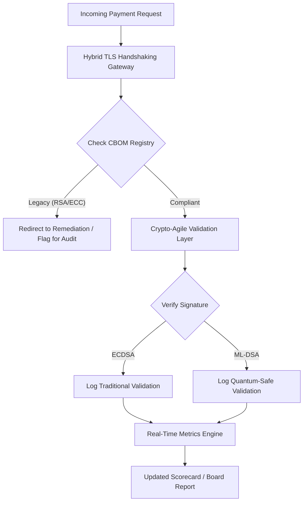

---
# Front Matter (YAML)
author: "contact@sebastienrousseau.com (Sebastien Rousseau)"
banner_alt: "Abstract digital boardroom table dissolving into quantum lattices — visualising the strategic governance required to migrate core banking infrastructure to FIPS 203 and 204"
banner_height: "1597"
banner_width: "2584"
banner: "https://cloudcdn.pro/stocks/images/vipul-jha-a4X1cdC1QAc.webp"
cdn: "https://cloudcdn.pro"
charset: "UTF-8"
cname: "sebastienrousseau.com"
copyright: "© Copyright 2025 - 2026 - Sebastien Rousseau. All rights reserved."
date: "June 29, 2026"
dataset_table: "1"
description: "The 2026 Post-Quantum Security Scorecard provides boards and senior management with a fiduciary metric framework to track Cryptographic Bill of Materials (CBOM), HNDL exposure, and NIST FIPS 203/204 migration velocity across tier-1 banking infrastructure."
format-detection: "telephone=no"
hreflang: "en"
icon: "https://cloudcdn.pro/clients/sebastienrousseau/v1/logos/sebastienrousseau.svg"
id: "https://sebastienrousseau.com/2026-06-29-post-quantum-security-scorecard-board-level-fiduciary-agility-2026"
image_alt: "Black and White Portrait of Sebastien Rousseau"
image_height: "162"
image_width: "162"
image: "https://cloudcdn.pro/stocks/images/sebastienrousseau.webp"
keywords: "post-quantum cryptography, PQC scorecard, NIST FIPS 203, NIST FIPS 204, CBOM, HNDL, banking governance, crypto-agility, KyberLib, DORA compliance, SM&CR, quantum resilience"
language: "en-GB"
last_reviewed: "2026-06-29"
layout: "report"
locale: "en_GB"
logo_alt: "Logo for Sebastien Rousseau"
logo_height: "44"
logo_width: "44"
logo: "https://cloudcdn.pro/clients/sebastienrousseau/v1/logos/sebastienrousseau.svg"
measurementID: "G-169G4ET5HQ"
name: "Sebastien Rousseau"
permalink: "https://sebastienrousseau.com/2026-06-29-post-quantum-security-scorecard-board-level-fiduciary-agility-2026"
rating: "general"
referrer: "no-referrer"
robots: "index, follow"
schema: "FAQPage, Article"
seo_title: "The 2026 Post-Quantum Security Scorecard: A Board-Level Framework"
short_name: "sebastienrousseau"
subtitle: "How boards must measure and govern the migration to NIST FIPS 203 and 204, tracking CBOM completeness and mitigating Harvest-Now-Decrypt-Later (HNDL) exposure in corporate treasury."
tags: "post-quantum, cryptography, banking, governance, DORA, FIPS-203, FIPS-204, CBOM, HNDL, KyberLib, SM&CR"
theme-color: "0, 83, 191"
title: "The 2026 Post-Quantum Security Scorecard: A Board-Level Metric Framework"
url: "https://sebastienrousseau.com/2026-06-29-post-quantum-security-scorecard-board-level-fiduciary-agility-2026"
viewport: "width=device-width, initial-scale=1, shrink-to-fit=no"

# RSS
atom_link: "https://sebastienrousseau.com/2026-06-29-post-quantum-security-scorecard-board-level-fiduciary-agility-2026/rss.xml"
category: "Technology"
generator: "Static Site Generator (SSG) (version 0.0.40)"
item_description: "The 2026 Post-Quantum Security Scorecard provides boards with a fiduciary metric framework to track CBOM, HNDL exposure, and NIST migration velocity."
item_pub_date: "Mon, 29 Jun 2026 07:07:07 +0000"
item_title: "The 2026 Post-Quantum Security Scorecard: A Board-Level Metric Framework"
pub_date: "Mon, 29 Jun 2026 07:07:07 +0000"
type: "article"

# Twitter Card
twitter_card: "summary_large_image"
twitter_creator: "@wwdseb"
twitter_description: "The 2026 Post-Quantum Security Scorecard: How banking boards measure cryptographic agility, CBOM completeness, and HNDL exposure."
twitter_image: "https://cloudcdn.pro/clients/sebastienrousseau/v1/logos/sebastienrousseau.svg"
twitter_title: "The 2026 Post-Quantum Security Scorecard for Banking Boards"
twitter_url: "https://sebastienrousseau.com/2026-06-29-post-quantum-security-scorecard-board-level-fiduciary-agility-2026"

excerpt: "As of June 2026, post-quantum cryptography (PQC) has transitioned from an experimental technical concern to a primary fiduciary obligation. Boards must now oversee the systematic migration of legacy encryption..."

# Template-completeness keys (parity with hsh/noyalib shape)
apple_mobile_web_app_orientations: "portrait"
apple_touch_icon_sizes: "192x192"
apple-mobile-web-app-capable: "yes"
apple-mobile-web-app-status-bar-inset: "black"
apple-mobile-web-app-status-bar-style: "black-translucent"
apple-touch-fullscreen: "yes"
apple-mobile-web-app-title: "PQC Scorecard 2026"
author_location: "London, United Kingdom"
author_twitter: "@wwdseb"
author_website: "https://sebastienrousseau.com"
docs: https://validator.w3.org/feed/docs/rss2.html
item_guid: "https://sebastienrousseau.com/2026-06-29-post-quantum-security-scorecard-board-level-fiduciary-agility-2026/rss.xml"
item_link: "https://sebastienrousseau.com/2026-06-29-post-quantum-security-scorecard-board-level-fiduciary-agility-2026/rss.xml"
last_build_date: "Mon, 29 Jun 2026 06:06:06 +0000"
managing_editor: "contact@sebastienrousseau.com (Sebastien Rousseau)"
menu: "active"
msapplication-navbutton-color: "0, 83, 191"
site_components: "Kaishi, Kaishi Builder, Kaishi CLI, Kaishi Templates, Kaishi Themes"
site_last_updated: "2023-07-05"
site_software: "Static Site Generator, Rust"
site_standards: "HTML5, CSS3, RSS, Atom, JSON, XML, YAML, Markdown, TOML"
thanks: "Thanks for reading!"
ttl: "60"
twitter_image_alt: "Black and White Portrait of Sebastien Rousseau"
twitter_site: "@wwdseb"
webmaster: "contact@sebastienrousseau.com"
---

# The 2026 Post-Quantum Security Scorecard: A Board-Level Metric Framework for Fiduciary Cryptographic Agility

<aside class="post-lead" aria-label="Article summary">

<strong>TL;DR.</strong> As of June 2026, post-quantum cryptography (PQC) has transitioned from an experimental technical concern to a primary fiduciary obligation. Boards must now oversee the systematic migration of legacy encryption to NIST FIPS 203 and 204 standards to mitigate systemic financial and operational risks under DORA.

<strong>Key takeaways</strong>

<ul class="post-lead-takeaways">
  <li><strong>G20 alignment and hard deadlines.</strong> International regulators have set the late-2020s as the hard deadline for quantum-safe transitions, requiring institutions to demonstrate quantifiable migration progress.</li>
  <li><strong>The Cryptographic Bill of Materials (CBOM).</strong> Analogous to a software BOM, a CBOM is a live, automated inventory of all cryptographic assets necessary to ensure visibility across the supply chain.</li>
  <li><strong>Harvest-Now-Decrypt-Later (HNDL) exposure.</strong> Adversaries are currently intercepting and storing encrypted high-value wholesale payment data; mitigating this requires immediate deployment of hybrid PQC architectures.</li>
  <li><strong>Fiduciary governance via crypto-agility.</strong> Crypto-agility is a measurable governance metric. The ability to swap cryptographic primitives without core system re-engineering (using libraries like [KyberLib](/2023-11-28-kyberlib-a-rust-powered-shield-against-quantum-threats/index.html)) is now a board-level accountability under SM&CR.</li>
</ul>

<strong>Related reading:</strong> <a href="https://sebastienrousseau.com/2026-06-12-kyberlib-post-quantum-banking-migration-standards-code-2026">KyberLib and the Post-Quantum Banking Migration in 2026</a>, <a href="https://sebastienrousseau.com/2023-11-19-crystals-kyber-the-safeguarding-algorithm-in-a-quantum-age/index.html">CRYSTALS-Kyber: The Safeguarding Algorithm in a Quantum Age</a>.

</aside>
Post-quantum security is no longer a research project. The "supervisory clock" is ticking toward late-2020s enforcement deadlines. The finalisation of [NIST FIPS 203 (ML-KEM)](https://csrc.nist.gov/pubs/fips/203/final) and [NIST FIPS 204 (ML-DSA)](https://csrc.nist.gov/pubs/fips/204/final) has codified the standards for key encapsulation and digital signatures. 

Regulatory bodies now expect Tier-1 banks to move beyond pilot programmes. In 2026, the focus has shifted to the industrialisation of these standards. Failure to demonstrate a clear migration path carries significant regulatory penalties under the [Digital Operational Resilience Act (DORA)](https://eur-lex.europa.eu/eli/reg/2022/2554/oj) and potential personal liability for directors who ignore the foreseeable threat of quantum-enabled decryption.

## 01. The Board-Level Quantum Scorecard

The following metrics provide a standardised framework for boards to evaluate quantum readiness and cryptographic health across Commercial and Investment Banking (CIB) estates.

### Table 1: PQC Scorecard Metrics and Tolerances

| Metric | Mathematical Formula | Board-Approved Tolerances | Risk if Out of Tolerance |
| ---- | ---- | ---- | ---- |
| **Inventory Completeness Percentage (ICP)** | (Identified Crypto Assets / Total Estimated Assets) × 100 | > 98% | Shadow encryption and blind spots in high-value clearing data paths. |
| **HNDL Exposure Rate (HER)** | (Long-Lived Data on Legacy Crypto / Total Long-Lived Data) × 100 | < 5% | Permanent compromise of trade secrets, sovereign debt ledgers, and wholesale payment records. |
| **NIST Migration Progress Rate (MPR)** | (Systems running FIPS 203/204 / Total Critical Systems) × 100 | > 60% (by YE 2026) | Regulatory non-compliance and exclusion from G20-aligned counterparties. |
| **Crypto-Agility Readiness Index (CARI)** | (Apps with Abstracted Crypto Layers / Total Core Apps) × 100 | > 85% | Severe technical debt and inability to respond to future algorithm deprecations. |

## 02. The Cryptographic Bill of Materials (CBOM)

The ICP metric is baselined through a comprehensive **CBOM Discovery Phase**. This is an automated process that identifies every cryptographic endpoint within the enterprise.

- **Endpoint Discovery:** Scanning internal and cloud networks for active TLS sessions to identify legacy RSA or ECC usage.
- **Key Inventory:** Mapping public/private key pairs to their respective owners and mapping exact expiration dates.
- **Dependency Mapping:** Identifying third-party libraries and APIs that rely on deprecated algorithms.

This discovery phase creates a single source of truth, enabling the CISO to report on cryptographic health with the same granularity as financial performance.

## 03. Eliminating HNDL Exposure in Wholesale Payments

Adversaries are actively targeting wholesale payments and long-lived corporate databases. These "Harvest-Now-Decrypt-Later" (HNDL) attacks involve the interception and archival of today's encrypted traffic.

Even if a cryptographically relevant quantum computer (CRQC) does not exist today, the data intercepted now will be vulnerable in the future. Mitigating this requires high-priority migration of long-lived data (e.g., identity records, 30-year bond contracts, and legal archives), which directly reduces the HER metric. Upgrading payment channels to hybrid PQC-traditional encryption (using ML-KEM alongside X25519) provides immediate defence against archival threats.

## 04. Operationalising Crypto-Agility via Well-Designed Interfaces

Crypto-agility is realised through engineering abstractions. Modern libraries like [KyberLib](https://sebastienrousseau.com/2026-06-12-kyberlib-post-quantum-banking-migration-standards-code-2026) demonstrate how developers can implement quantum-safe modules without rewriting the entire application stack.

- **Abstracted Wrappers:** Applications call a generic `encrypt()` or `sign()` function rather than algorithm-specific routines.
- **Runtime Swapping:** The underlying module can be swapped from ECDSA to ML-DSA via configuration changes rather than complex code deployments.

This architecture ensures that if a specific PQC algorithm is compromised in the future, the organisation can pivot in hours rather than years.

## 05. The Quantum-Safe Ingress Validation Workflow

The following diagram illustrates the lifecycle of data entering the secure perimeter in a quantum-agile banking environment.

## Conclusion

The cryptographic estate of a Tier-1 bank is no longer a CISO concern. It is fiduciary infrastructure. NIST FIPS 203 and 204 set the algorithms; DORA Article 5 sets the accountability surface; SM&CR pins it to a named senior manager. The scorecard above — Inventory Completeness, HNDL Exposure, Migration Progress, Crypto-Agility — gives a board the four numbers it needs to govern that estate without having to read the cryptographic code.

The number that matters most is HNDL Exposure. Every legacy-encrypted record sitting in a wholesale-payments archive today will be readable on the day the first cryptographically relevant quantum computer is shipped. The countdown is silent and asymmetric: defenders can only act on the data they hold, adversaries can act on data they already exfiltrated years ago. A 30-year corporate bond contract encrypted with RSA-2048 in 2024 is a contract that loses its confidentiality guarantee the day a CRQC goes live.

[KyberLib](https://sebastienrousseau.com/2026-06-12-kyberlib-post-quantum-banking-migration-standards-code-2026) and its peers turn this from a multi-year platform rewrite into a configuration change. The board's job is not to write the code. The board's job is to demand that the Crypto-Agility Readiness Index — the share of core applications behind an abstracted cryptographic interface — moves through 85 % within twelve months, and to read the quarterly scorecard.

<aside class="author-card" aria-label="About the author"><strong class="author-card-name"><a href="/about/index.html">Sebastien Rousseau</a></strong>Senior banking technologist writing on applied AI, ISO 20022 migration, post-quantum cryptography for financial services, and the structural transformation of wholesale payments.20+ years across HSBC Commercial & Investment Bank, PayPal, Barclays, Shazam. <a href="https://www.linkedin.com/in/sebastienrousseau/" rel="external noopener">LinkedIn</a> &middot; <a href="https://github.com/sebastienrousseau" rel="external noopener">GitHub</a></aside>

Last reviewed <time datetime="2026-06-29">2026-06-29</time>.

