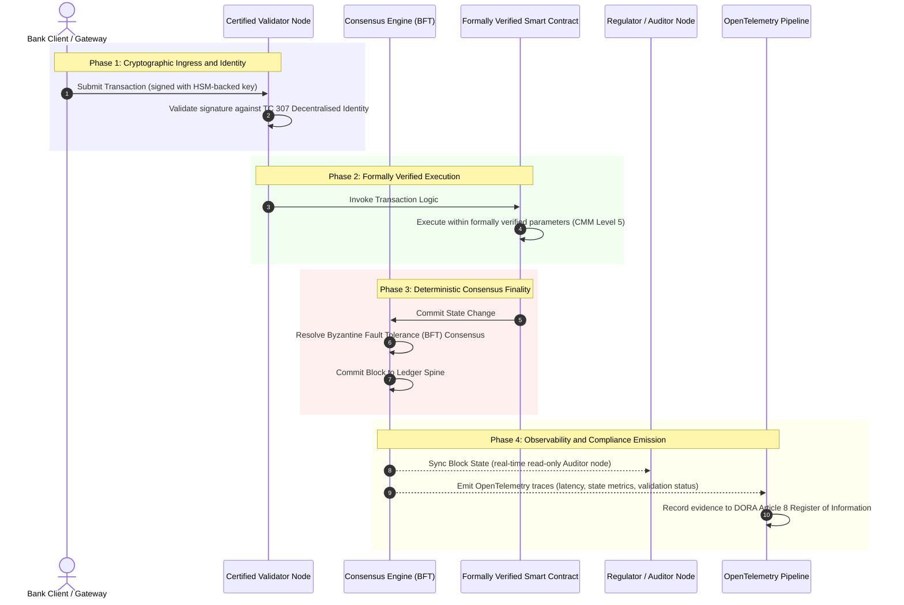

---

# Front Matter (YAML)

author: "contact@sebastienrousseau.com (Sebastien Rousseau)"
banner_alt: "A constellation of interconnected points of light, representing certified blockchains as the substrate of verifiable banking trust."
banner_height: "1280"
banner_width: "1920"
banner: "https://cloudcdn.pro/stocks/images/digital-constellation.webp"
cdn: "https://cloudcdn.pro"
charset: "UTF-8"
cname: "sebastienrousseau.com"
copyright: "© Copyright 2025 - 2026 - Sebastien Rousseau. All rights reserved."
date: "July 26, 2026"
description: "Banks certify the cloud, the entity and their AI, but not the ledger that decides what is true. A 5-level Certified Blockchain Index closes the fiduciary gap."
format-detection: "telephone=no"
hreflang: "en"
icon: "https://cloudcdn.pro/clients/sebastienrousseau/v1/logos/sebastienrousseau.svg"
id: "https://sebastienrousseau.com/2026-07-26-from-evidence-to-truth-certified-blockchains-banking-trust"
image_alt: "Black and White Portrait of Sebastien Rousseau"
image_height: "162"
image_width: "162"
image: "https://cloudcdn.pro/stocks/images/sebastienrousseau.webp"
keywords: "ISO/IEC TC 307, certified blockchain, distributed ledger technology, DORA Article 5, Capability Maturity Model, BFT consensus, smart contract assurance, post-quantum cryptography, FIPS 203, BCBS 239, CPMI-IOSCO PFMI, ISO 42001, AI audit spine, wholesale banking, validator node supply chain, SM&CR"
language: "en-GB"
last_reviewed: "2026-07-26"
layout: "report"
locale: "en_GB"
logo_alt: "Logo for Sebastien Rousseau"
logo_height: "44"
logo_width: "44"
logo: "https://cloudcdn.pro/clients/sebastienrousseau/v1/logos/sebastienrousseau.svg"
menu: ""
measurementID: "G-169G4ET5HQ"
name: "Sebastien Rousseau"
permalink: "https://sebastienrousseau.com/2026-07-26-from-evidence-to-truth-certified-blockchains-banking-trust"
rating: "general"
referrer: "no-referrer"
robots: "index, follow"
schema: "FAQPage, Article"
seo_title: "Certified Blockchains: The Next Era of Banking Trust"
short_name: "sebastienrousseau"
subtitle: "A boardroom argument for wholesale banking leaders: why ISO/IEC TC 307 guidance is not assurance, and how scoring ledger governance, consensus, cryptography and observability against a 5-level maturity model turns engineering metrics into board-auditable, DORA-defensible truth."
tags: "blockchain, banking, DORA, ISO TC 307, distributed ledger, AI governance, DLT assurance, post-quantum, smart contracts, regulatory compliance, wholesale banking, fiduciary risk"
theme-color: "0, 83, 191"
title: "From Evidence to Truth: Why Certified Blockchains Will Define the Next Era of Banking Trust"
url: "https://sebastienrousseau.com/2026-07-26-from-evidence-to-truth-certified-blockchains-banking-trust"
viewport: "width=device-width, initial-scale=1, shrink-to-fit=no"

# RSS - The RSS feed front matter (YAML).
atom_link: "https://sebastienrousseau.com/2026-07-26-from-evidence-to-truth-certified-blockchains-banking-trust/rss.xml"
category: "Finance"
docs: https://validator.w3.org/feed/docs/rss2.html
generator: "Static Site Generator (SSG) (version 0.0.26)"
item_description: "Banks certify the cloud, the entity and their AI, but not the ledger that decides what is true. A 5-level Certified Blockchain Index closes the fiduciary gap."
item_guid: "https://sebastienrousseau.com/2026-07-26-from-evidence-to-truth-certified-blockchains-banking-trust/rss.xml"
item_link: "https://sebastienrousseau.com/2026-07-26-from-evidence-to-truth-certified-blockchains-banking-trust/rss.xml"
item_pub_date: "Sun, 26 Jul 2026 07:07:07 +0000"
item_title: "From Evidence to Truth: Why Certified Blockchains Will Define the Next Era of Banking Trust"
last_build_date: "Sun, 26 Jul 2026 06:06:06 +0000"
managing_editor: "contact@sebastienrousseau.com (Sebastien Rousseau)"
pub_date: "Sun, 26 Jul 2026 07:07:07 +0000"
ttl: "60"
type: "article"
webmaster: "contact@sebastienrousseau.com"

# Apple - The Apple front matter (YAML).
apple_mobile_web_app_orientations: "portrait"
apple_touch_icon_sizes: "192x192"
apple-mobile-web-app-capable: "yes"
apple-mobile-web-app-status-bar-inset: "black"
apple-mobile-web-app-status-bar-style: "black-translucent"
apple-mobile-web-app-title: "Certified Blockchains"
apple-touch-fullscreen: "yes"

# MS Application - The MS Application front matter (YAML).

msapplication-navbutton-color: "0, 83, 191"

# Twitter Card - The Twitter Card front matter (YAML).

twitter_card: "summary_large_image"
twitter_creator: "@wwdseb"
twitter_description: "Banks certify the cloud, the entity and their AI, but not the ledger that decides what is true. A 5-level Certified Blockchain Index closes the fiduciary gap and gives AI a deterministic audit spine."
twitter_image: "https://cloudcdn.pro/clients/sebastienrousseau/v1/logos/sebastienrousseau.svg"
twitter_image_alt: "Logo of Sebastien Rousseau"
twitter_site: "@wwdseb"
twitter_title: "Certified Blockchains: The Next Era of Banking Trust"
twitter_url: "https://sebastienrousseau.com/2026-07-26-from-evidence-to-truth-certified-blockchains-banking-trust"

excerpt: "Immutable is not the same as trusted. As instant settlement and probabilistic AI reshape banking, the uncertified ledger becomes the weak link, and a certifiable blockchain becomes the audit spine."

# Humans.txt - The Humans.txt front matter (YAML).
author_website: "https://sebastienrousseau.com"
author_twitter: "@wwdseb"
author_location: "London, UK"
thanks: "Thanks for reading!"
site_last_updated: "2026-07-26"
site_standards: "HTML5, CSS3, RSS, Atom, JSON, XML, YAML, Markdown, TOML"
site_components: "Kaishi, Kaishi Builder, Kaishi CLI, Kaishi Templates, Kaishi Themes"

---

# From Evidence to Truth: Why Certified Blockchains Will Define the Next Era of Banking Trust

**Immutable is not the same as trusted.** As wholesale banking moves to real-time settlement and probabilistic AI, the ledger that decides what is true has become the one layer banks still cannot certify. They certify the entity under Basel III, the cloud under ISO 27001 and their AI under ISO 42001, but the distributed ledger, its governance, consensus, cryptography and smart contracts, is left to vendor-specific assumption. This report argues that closing that fiduciary gap requires moving from ISO/IEC TC 307 guidance to prescriptive assurance: scoring the ledger against a 5-level Certified Blockchain Index that turns engineering metrics into board-auditable, DORA-defensible truth.

<!-- lead-start -->
<aside class="post-lead" aria-label="Article summary">

<strong>TL;DR.</strong> Banks certify the entity, the cloud and their AI, but not the ledger that increasingly determines what is true. ISO/IEC TC 307 gives guidance, not assurance. A 5-level Certified Blockchain Index scores ledger governance, consensus integrity, identity and cryptography, smart-contract assurance and observability against a Capability Maturity Model, closing the fiduciary gap and giving probabilistic AI a deterministic audit spine.

<strong>Key takeaways</strong>

<ul class="post-lead-takeaways">
  <li><strong>The fiduciary frictional gap.</strong> The bank (Basel III), the cloud (ISO 27001) and the AI governance system (ISO 42001) can be certified; the distributed ledger that decides what is true cannot yet be. That asymmetry is a live operational vulnerability.</li>
  <li><strong>DORA makes it personal.</strong> Under DORA Article 5, bank boards carry direct, non-delegable liability for the resilience of third-party and ledger deployments, with SM&amp;CR personal penalties for failure.</li>
  <li><strong>The AI audit spine.</strong> Machine learning is non-reproducible; a certified blockchain captures model versions, inputs and validation decisions deterministically on-chain, satisfying ISO 42001 and model-risk-management standards.</li>
  <li><strong>The Certified Blockchain Index.</strong> Governance, consensus, cryptography, smart contracts and observability become a 0-to-5 CMM scorecard that translates engineering metrics into board-approved Risk Appetite Statements.</li>
</ul>

<strong>Related reading:</strong> <a href="https://sebastienrousseau.com/2026-07-02-certified-blockchains-banking-trust-tc307-assurance-2026">Certified Blockchains and Banking Trust: TC 307 Assurance</a>, <a href="https://sebastienrousseau.com/2026-07-24-global-payments-outlook-operating-model-risk-revenue">The 2026 Global Payments Outlook</a>.

</aside>
<!-- lead-end -->

> **Executive Summary**
>
> - **Wholesale banking is at an inflection point.** Real-time clearing and probabilistic AI break the analogue, retrospective assurance model: static, entity-based audits no longer meet modern risk-management or fiduciary demands.
> - **TC 307 is a baseline, not a certificate.** ISO/IEC TC 307 has standardised the vocabulary, reference architecture and security guidance for distributed ledgers, but it is descriptive. It defines what good looks like; it does not provide the prescriptive verification that risk officers and supervisors need to authorise production deployment.
> - **Assurance means scoring the ledger.** Governance, consensus integrity, smart-contract safety and cryptographic agility, scored against a strict 5-level Capability Maturity Model, move banks from patchwork, vendor-specific assumption to certifiable, board-auditable financial truth.
> - **The ledger is the audit spine for AI.** Anchoring model versions, inputs and validation decisions to deterministic consensus gives non-reproducible machine learning a defensible, reconstructable evidentiary record under ISO 42001, SR 11-7 and PRA SS1/23.

## The Fiduciary Frictional Gap in Digital Banking

In classical banking, trust is relational, institutional, and retrospective. It depends on independent, third-party auditors reviewing financial state at static points in time, reconciling discrepancies across bilateral ledger silos. In the real-time, API-driven markets of 2026, this model introduces prohibitive latencies and structural risks.

When transactions settle instantly, intraday liquidity pools are managed dynamically by API gateways, and asset ownership is tokenised across shared ledgers, retrospective audits become forensic exercises rather than preventative controls. Fiduciaries can no longer rely solely on certifying the corporate entity. They must certify the digital substrate itself.

Currently, banks operate under a glaring architectural asymmetry:

1. **Certified Cloud Infrastructure**: Hardware nodes, virtualised containers, and physical datacenters are validated against ISO/IEC 27001 and SOC 2 Type II controls.  
2. **Certified Management Processes**: Operational risk policies, business continuity plans, and algorithmic deployments are governed under strict risk frameworks.  
3. **Uncertified Ledger Engines**: The core distributed consensus mechanisms, validator node supply chains, smart contract boundaries, and network governance models are left to uncertified, custom, or consortium-specific assumptions.

This asymmetry is a major failure point. A bank can run a validated application inside a secure, ISO 27001-certified cloud container, but if that container writes to a distributed ledger with centralised validator control, vulnerable consensus parameters, or un-audited smart contracts, the transaction integrity is compromised. To bridge this gap, the ledger engine itself must become a certifiable assurance object.

## The ISO/IEC TC 307 Standardisation Baseline

The foundational work required to standardise distributed ledgers is being established by ISO/IEC Technical Committee 307 (TC 307\) (Blockchain and distributed ledger technologies). Rather than treating blockchain as an isolated technical protocol, TC 307 addresses it as an institutional trust infrastructure, organising its work across five core pillars:

1. **Taxonomy and Vocabulary (ISO 22739\)**: Establishes a common nomenclature, ensuring consistent legal and operational definitions across different jurisdictions, financial schemes, and institutions.  
2. **Reference Architecture (ISO/TR 23245\)**: Defines the boundaries, layers, data flows, and functional components of a compliant distributed ledger system.  
3. **Security, Privacy, and Smart Contracts (ISO/TR 23244 / ISO 23613\)**: Establishes baseline security guidelines for digital asset systems and details best practices for smart contract vulnerability mitigation and lifecycle governance.  
4. **Interoperability Frameworks**: Addresses the data and asset-exchange mechanisms between heterogeneous ledger networks, preventing the formation of isolated tokenised silos.  
5. **Decentralised Identity and Trust Anchors**: Integrates ledger-based cryptographic identifiers with formal public-key infrastructures (PKI) and state-authorised registries.

Collectively, TC 307 signals the transition of DLT from a custom engineering choice into a standardised architectural discipline. However, TC 307 remains primarily descriptive. It defines what good looks like (guidance), but it does not provide the prescriptive verification protocol (assurance) that risk officers and supervisors require to authorise production deployments of critical or important functions (CIFs).

## Guidance vs. Assurance: The Fiduciary Distinction

Financial market participants do not deploy technology because it is innovative or elegant; they deploy it when it can be governed, audited, defended, and reconciled with capital reserve requirements. This is why standardisation in banking naturally resolves into two layers:

* **Guidance (The Framework)**: Outlines best practices, reference targets, and architectural guidelines (e.g., ISO/IEC TC 307, NIST frameworks).  
* **Assurance (The Proof)**: Provides independent, continuous, and third-party-verifiable evidence that the framework is implemented and operating as designed (e.g., ISO 27001 certification, SOC 2 audits, regulatory examinations).

Relying on uncertified ledger consensus while certifying cloud infrastructure is a critical regulatory gap. A blockchain that is "immutable" is not necessarily "institutionally trusted." Immutability only guarantees that the data entered is unchanged; it does not verify that the validator nodes are secure, the consensus protocol is resilient against collusion, the smart contract logic is mathematically sound, or the cryptographic key management complies with post-quantum mandates.

To close this gap, the 2026 Certified Blockchain Index formalises these requirements into a quantifiable Capability Maturity Model (CMM) mapped to global banking regulations.

## The 2026 Certified Blockchain Index

To enable senior management to evaluate and certify their ledger platforms, this index structures the distributed ledger infrastructure into five auditable operational layers, scored on a 0-to-5 CMM scale.

### Table 1: The Certified Blockchain Index Architecture

| Index Layer | Capability Maturity Level (CMM) | Technical and Operational Metric | Regulatory / Fiduciary Control Reference |
| ---- | ---- | ---- | ---- |
| **Ledger Governance** | **Level 0**: Ad-hoc consortium**Level 3**: Automated validator vetting & rotation**Level 5**: Decentralised, multi-party cryptographic identity anchoring | % of validator nodes operated by vetted financial entities; mean time to resolve validator disputes; geographic distribution of nodes | **DORA Article 5** (Governance and Organisation); **CPMI-IOSCO PFMI Principle 2** (Governance) & **Principle 3** (Framework for the comprehensive management of risks) |
| **Consensus Integrity** | **Level 0**: Single-node or opaque POW**Level 3**: Audited BFT with deterministic finality**Level 5**: Multi-jurisdictional, formally verified consensus with continuous latency monitoring | Max tolerable consensus latency; collusion-resistance threshold; uptime SLA under simulated node partition | **DORA Article 6** (ICT Risk Management Framework); **CPMI-IOSCO PFMI Principle 8** (Settlement Finality) |
| **Identity & Cryptography** | **Level 0**: Weak RSA / ECDSA keys**Level 3**: Multi-sig with HSM-backed key management**Level 5**: Quantum-safe hybrid keys (FIPS 203 ML-KEM) and zero-knowledge privacy gates | % of ledger transactions signed with HSM-backed keys; PQC migration readiness score; ZK-proof latency | **NIST FIPS 203 / 204**; **ISO/IEC 27001** (Information Security Management) |
| **Smart Contract Assurance** | **Level 0**: Un-audited solidity scripts**Level 3**: Automated compiler validation & external audit**Level 5**: Formally verified, immutable smart contracts with circuit-breaker upgrades | % of smart contracts with mathematical formal verification; count of compiler warnings; vulnerability scan coverage | **EBA Guidelines on Outsourcing Arrangements** (Paragraphs 81, 113-117); **DORA Article 30** (Minimum Contractual Clauses) |
| **Audit & Observability** | **Level 0**: Manual log scraping**Level 3**: Structured OTel traces & read-only auditor nodes**Level 5**: Automated, continuous reconciliation to the Article 8 register | % of transactions covered by OpenTelemetry traces; latency from ledger block-commit to auditor-node sync | **BCBS 239** (Risk Data Aggregation); **DORA Article 8** (Register of Information / ITS Schemas) |

### Table 2: Key Trust Signals Mapped to Global Banking Standards

| Signal / Benchmark | Metric | Impact on Banking Platforms | Regulatory Source |
| ---- | ---- | ---- | ---- |
| **ISO/IEC TC 307 Progress** | Transition from ISO/TR technical reports to formal certification schemes | Establishes the first standardised framework for certifying distributed ledger engines | **ISO/IEC JTC 1 / SC 44** (Distributed Ledger Technologies) |
| **Project Agorá Prototype Phase** | 40+ participating commercial banks; unified ledger testing of tokenised deposits | Shifting cross-border clearing from messaging (SWIFT) to atomic tokenised settlement | **Bank for International Settlements (BIS) Innovation Hub** |
| **DORA Article 30 Third-Party Audit** | 100% of node providers and infrastructure hosts audited against security criteria | Eliminates "shadow validator nodes"; mandates total supply-chain transparency | **European Supervisory Authorities (ESA)** |
| **ISO/IEC 42001 (AI Governance)** | Cryptographically immutabilised AI model and training logs on-chain | Employs blockchain as the immutable evidentiary ledger ("audit spine") for machine learning | **ISO/IEC 42001:2023** (Information technology, Artificial intelligence) |
| **Basel III Capital Adequacy** | Reduction in operational risk capital buffers based on documented complexity reduction | Standardised operational risk frameworks directly credit verified ledger resilience | **Basel Committee on Banking Supervision (BCBS)** |

## The AI "Audit Spine": Probabilistic Intelligence on Deterministic Infrastructure

One of the most powerful strategic roles for a certified blockchain in 2026 is acting as an **"Audit Spine"** for artificial intelligence deployments. Modern financial systems are increasingly probabilistic. Credit scoring, real-time fraud detection, algorithmic trading, and autonomous customer interactions are driven by machine learning models that evolve, drift, and adapt over time. These models are non-deterministic: given the same input at two different times, they may yield different outputs due to dynamic weights and continuous training.

This non-determinism introduces a profound governance challenge under **ISO/IEC 42001 (AI Governance)** and **Model Risk Management (MRM)** standards (such as **US Federal Reserve SR 11-7** and **UK PRA SS1/23**): *How do you audit, explain, and defend decisions that are not strictly reproducible?*

A certified distributed ledger provides the deterministic counterweight. While AI models operate probabilistically, the certified blockchain records their parameters deterministically, establishing an unalterable evidentiary spine:

* **Model Versioning and Weight Anchoring**: Every deployed model version, its associated weights, and its training data checksums are hashed and written to the ledger at build-time, satisfying **SLSA Level 3** supply-chain requirements.  
* **Contextual Input Logging**: When an AI model executes a critical decision (e.g., approving a loan or flagging a transaction), the exact contextual inputs and model hashes are written to the ledger, creating a tamper-evident history.  
* **Auditability without Code Access**: If a regulator asks, "Why did your model reject this credit application on June 3?" the bank does not need to expose proprietary code or attempt to recreate the exact model state. It presents the cryptographically signed, on-chain ledger record of the inputs, weights, and validation state.

By anchoring the probabilistic decisions of machine learning models to the deterministic consensus of a certified blockchain, the institution creates a defensible, reconstructable, and independently verifiable timeline of automated actions.

## Visualising the Certified Consensus-to-Audit Pipeline

The following sequence diagram illustrates the lifecycle of a transaction passing through a certified blockchain platform, demonstrating how validation gates, consensus integrity, smart contract execution, and telemetry emission interlock to produce board-ready regulatory evidence:

The critical path for this transactional sequence requires that every validation, execution, and consensus step is cryptographically signed, ensuring end-to-end provenance. The regulator's auditor node synchronises block state in real-time, eliminating the need for retrospective, manual financial reconciliation.

## The Boardroom Playbook for Senior Managers

To successfully manage the shift from organisational trust to infrastructural trust, bank executives and senior managers should immediately execute four key directives:

1. **Mandate Ledger Audits in Enterprise Risk Management (ERM)**: Enforce a policy that no distributed ledger platform, whether private, public, or consortium-based, may be deployed for critical or important functions (CIFs) unless it has been audited against the 5-layer **Certified Blockchain Index Architecture** (CMM Level 3 minimum).  
2. **Integrate Blockchains as the ISO 42001 AI Evidentiary Spine**: Direct the Chief Risk Officer and Lead AI Architect to integrate all high-impact machine learning models with a certified blockchain, creating a tamper-evident audit ledger of model versions, weights, inputs, and decisions.  
3. **Audit the Validator Node Supply Chain (DORA Article 30\)**: Require the procurement division to audit all third-party entities hosting validator nodes or managing cloud hosting for DLT networks, mandating compliance with the same cybersecurity and operational resilience standards applied to the bank’s internal cloud nodes.  
4. **Align Ledger Architectures with CPMI-IOSCO and BCBS 239**: Instruct the platform engineering team to align ledger output telemetry directly with **BCBS 239** data reporting requirements, and ensure the consensus and settlement finality parameters strictly comply with **CPMI-IOSCO Principles 8 and 9**.

## Frequently Asked Questions

**Is ISO/IEC TC 307 a certification standard?**  
No. ISO/IEC TC 307 is a technical committee that establishes vocabulary, reference architectures, and security guidelines. While it defines "what good looks like" (guidance), the industry must operationalise these documents into formal, auditable certification schemes (assurance) to satisfy banking supervisors.

**How does a certified blockchain support DORA compliance?**  
Under DORA Article 5, bank boards bear direct, personal liability for technology resilience. A certified blockchain provides verifiable, cryptographic evidence of consensus integrity, validator supply-chain control, and smart contract safety, giving board members the documentable "reasonable steps" needed to defend against SM\&CR personal liability claims.

**What is the difference between a traditional ledger audit and a certified blockchain audit?**  
A traditional audit is retrospective, verifying manual entries and static files after transactions have cleared. A certified blockchain audit is continuous and real-time; the validator nodes, BFT consensus engine, and formally verified smart contracts are certified to execute transactions deterministically, emitting structured telemetry (OpenTelemetry) that continuously validates the system’s health.

**Can public blockchains be certified for banking use?**  
In most jurisdictions, pure permissionless public blockchains fail to satisfy banking regulations due to the lack of validator identity verification, unpredictable gas/transaction costs, and non-deterministic finality (e.g., probabilistic proof-of-work/stake forks). Certified blockchains in banking typically utilise enterprise permissioned or highly regulated public-hybrid architectures where validator node operators are identified and audited financial entities.

## References

* Basel Committee on Banking Supervision (BCBS), 2013\. *Principles for effective risk data aggregation and reporting (BCBS 239\)*. Basel: Bank for International Settlements. Available at: [Basel Committee on Banking Supervision (BCBS), 2013\.](https://www.bis.org/publ/bcbs239.pdf "Basel Committee on Banking Supervision (BCBS), 2013\.").  
* Committee on Payments and Market Infrastructures and Technical Committee of the International Organisation of Securities Commissions (CPMI-IOSCO), 2012\. *Principles for financial market infrastructures*. Basel: Bank for International Settlements. Available at: [Committee on Payments and Market Infrastructures and Technical Committee of the International Organisation of Securities Commissions (CPMI-IOSCO), 2012\.](https://www.bis.org/cpmi/publ/d101a.pdf "Committee on Payments and Market Infrastructures and Technical Committee of the International Organisation of Securities Commissions (CPMI-IOSCO), 2012\.").  
* European Banking Authority (EBA), 2019\. *EBA/GL/2019/02, Guidelines on outsourcing arrangements*. Paris: EBA. Available at: [European Banking Authority (EBA), 2019\.](https://www.eba.europa.eu/regulation-and-policy/internal-governance/guidelines-on-outsourcing-arrangements "European Banking Authority (EBA), 2019\.").  
* European Parliament and Council of the European Union, 2022\. *Regulation (EU) 2022/2554 on digital operational resilience for the financial sector (DORA)*. Brussels: Official Journal of the European Union. Available at: [European Parliament and Council of the European Union, 2022\.](https://eur-lex.europa.eu/legal-content/EN/TXT/?uri=CELEX%3A32022R2554 "European Parliament and Council of the European Union, 2022\.").  
* ISO/IEC JTC 1/SC 42, 2023\. *ISO/IEC 42001:2023, Information technology, Artificial intelligence, Management system*. Geneva: International Organisation for Standardisation. Available at: [ISO/IEC JTC 1/SC 42, 2023\.](https://www.iso.org/standard/81230.html "ISO/IEC JTC 1/SC 42, 2023\.").  
* ISO/IEC Technical Committee 307, 2020\. *ISO/IEC 22739:2020, Blockchain and distributed ledger technologies, Vocabulary*. Geneva: International Organisation for Standardisation. Available at: [ISO/IEC Technical Committee 307, 2020\.](https://www.iso.org/standard/73771.html "ISO/IEC Technical Committee 307, 2020\.").  
* National Institute of Standards and Technology (NIST), 2026\. *First Three Finalised Post-Quantum Encryption Standards (FIPS 203, 204, and 205\)*. Gaithersburg: U.S. Department of Commerce. Available at: [National Institute of Standards and Technology (NIST), 2026\.](https://www.nist.gov/news-events/news/2024/08/nist-releases-first-3-finalised-post-quantum-encryption-standards "National Institute of Standards and Technology (NIST), 2026\.").

