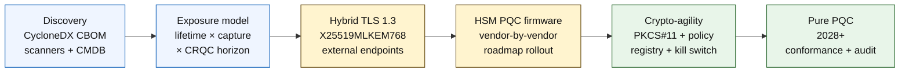

# مؤشر المصرفية الآمنة كموميًا في 2026: تشفير ما بعد الكم، QKD، المرونة التشفيرية، ومخاطر اجمع-الآن-فُكَّ-لاحقًا

<!-- lead-start: manual -->
<aside class="post-lead" aria-label="ملخص المقال">

<strong>الخلاصة.</strong> المصرفية الآمنة كموميًا في 2026 برنامج تسليم بموعد نهائي يحدّده تقاطع منحنيَين — عمر سرية البيانات التي تحتفظ بها المؤسسة اليوم، وأفق وصول حاسوب كمومي ذي صلة تشفيرية (CRQC). معايير NIST FIPS 203 / 204 / 205 نهائية منذ أغسطس 2024؛ وتُحدّد CNSA 2.0 وضع النهاية الفيدرالي الأمريكي عند 2033؛ واجمع-الآن-فُكَّ-لاحقًا يحدث فعلًا على البيانات طويلة العمر. تتعقّب بطاقة الأداء الكمومية على مستوى المجلس أربع نسب مئوية دقيقة: اكتمال الجرد، وتعرض HNDL، وتقدّم الهجرة إلى NIST، وجاهزية المرونة التشفيرية.

<strong>أبرز النقاط</strong>

<ul class="post-lead-takeaways">
  <li><strong>أُغلق نقاش الخوارزميات في 13 أغسطس 2024.</strong> ML-KEM (FIPS 203) وML-DSA (FIPS 204) وSLH-DSA (FIPS 205) هي الإجابات. البنوك التي لا تزال تُدير تقييمات داخلية لـ"اختيار الفائز" متأخّرة 18 شهرًا عن الواقع.</li>
  <li><strong>اجمع-الآن-فُكَّ-لاحقًا ينطبق فعلًا.</strong> كل ما يتجاوز عمر سريّته وصولًا موثوقًا لـ CRQC — رهون عقارية مدتها 30 عامًا، اكتتاب التأمين على الحياة، تسجيلات معاملات MiFID II / GDPR، أرشيفات الاحتفاظ بصفقات الاندماج والاستحواذ — يجب أن ينتقل إلى تغليف مفاتيح هجين آمن كموميًا الآن، لا حين الإعلان عن CRQC.</li>
  <li><strong>الجرد هو بوّابة النضج.</strong> قائمة مواد التشفير (CBOM) — البروتوكول، المكتبة، الشهادة، قسم HSM، تبعية البائع، مالك التطبيق، عمر تصنيف البيانات — شرط مسبق لكل ما يليها. تتبّعوا الحداثة، لا التغطية.</li>
  <li><strong>TLS 1.3 الهجين هو نشر 2026.</strong> مشاركة المفتاح الهجينة X25519MLKEM768 هي ما تتفاوض عليه فعلًا Chrome / Firefox / Cloudflare / Akamai اليوم. أما TLS بـ ML-KEM الخالص فينتظر برنامج HSM الثابت وجاهزية سلطات الشهادات.</li>
  <li><strong>المرونة التشفيرية هي المُسلَّمة الدائمة.</strong> تجريد PKCS#11، ومفاتيح موسومة، وسجل سياسات يربط الخدمة التجارية بمجموعة الخوارزميات المسموح بها. بدونها سيكون الانتقال الخوارزمي القادم برنامجًا آخر يمتدّ سنوات.</li>
</ul>
</aside>
<!-- lead-end -->

المصرفية الآمنة كموميًا في 2026 تدور حول الهجرة التشغيلية، لا التكهّن. أنجزت NIST المعايير الثلاثة الأولى لتشفير ما بعد الكم، وعلى البنوك الآن أن تفهم أي الأنظمة تعتمد على RSA وECC وTLS والتواقيع وHSM والشهادات وقنوات المدفوعات والأرشيفات والبيانات السرية طويلة العمر. سؤال المؤشر بسيط: هل تستطيع المؤسسة استبدال التشفير قبل أن يصبح التهديد تشغيليًا؟

---

> **الملخص التنفيذي / أبرز النقاط**
>
> - **معايير NIST صارت ملموسة.** FIPS 203 يُعرِّف ML-KEM لتغليف المفاتيح، وFIPS 204 يُعرِّف ML-DSA للتواقيع، وFIPS 205 يُعرِّف SLH-DSA معيارًا للتوقيع الخالي من الحالة قائمًا على دالة التجزئة.
> - **الجرد هو بوّابة النضج الأولى.** لا يستطيع البنك أن يهاجر ما لا يستطيع إيجاده: لا بدّ من رسم خرائط للشهادات والمفاتيح والبروتوكولات والتطبيقات والبائعين وHSM وواجهات البرمجة والأرشيفات والأنظمة المضمّنة.
> - **المرونة التشفيرية هي الهدف الدائم.** ليست الغاية تبديل خوارزمية مرّة واحدة؛ بل القدرة على تغيير الأساسيات التشفيرية دون إعادة تصميم تطبيقات بأكملها.
> - **البيانات طويلة العمر تُبدّل الإلحاح.** خطر اجمع-الآن-فُكَّ-لاحقًا يعني أن البيانات الملتقطة اليوم قد تصبح قابلة للقراءة لاحقًا إن ظلّت ذات قيمة لفترة كافية.
> - **QKD مكمِّل متخصِّص.** قد يكون توزيع المفاتيح الكمومي ذا صلة لأعلى القنوات قيمةً، لكنه لا يستبدل الهجرة المؤسسية الشاملة إلى PQC.
>
---

## لماذا 2026 هو العام الذي يكتسب فيه هذا المؤشر أهميته

ثلاث تحوّلات في 2024-2025 جعلت "الأمان الكمومي" برنامجًا مصرفيًا قابلًا للقياس بدلًا من نقطة مراقبة بحثية. أولًا، أنجزت NIST معايير ما بعد الكم الأساسية في 13 أغسطس 2024: [FIPS 203 (ML-KEM) ⧉](https://nvlpubs.nist.gov/nistpubs/FIPS/NIST.FIPS.203.pdf "FIPS 203 — آلية تغليف المفاتيح القائمة على شبكات الوحدات")، و[FIPS 204 (ML-DSA) ⧉](https://nvlpubs.nist.gov/nistpubs/FIPS/NIST.FIPS.204.pdf "FIPS 204 — معيار التوقيع الرقمي القائم على شبكات الوحدات")، و[FIPS 205 (SLH-DSA) ⧉](https://nvlpubs.nist.gov/nistpubs/FIPS/NIST.FIPS.205.pdf "FIPS 205 — معيار التوقيع الرقمي القائم على دالة التجزئة والخالي من الحالة"). أُغلق نقاش اختيار الخوارزمية في ذلك التاريخ؛ والبنوك التي لا تزال تُدير في 2026 مسارات داخلية لـ"أي مخطط سيفوز" متأخرة 18 شهرًا عن الواقع.

ثانيًا، حدّدت [CNSA 2.0 الصادرة عن NSA ⧉](https://media.defense.gov/2022/Sep/07/2003071834/-1/-1/0/CSA_CNSA_2.0_ALGORITHMS_.PDF "حزمة الخوارزميات التجارية للأمن القومي 2.0") وضع النهاية الفيدرالي الأمريكي عند 2033 مع مواعيد قطع وسيطة تبدأ في 2027 لتوقيع البرمجيات والبرامج الثابتة، و2030 للمتصفحات وأنظمة التشغيل. أي بنك له تعرض مع طرف مقابل فيدرالي أمريكي — FedNow، عمليات الخزانة، حسابات العملاء الفيدراليين — يقع داخل ذلك المحيط بالنسبة للأنظمة التي تمس بيانات فيدرالية. لم تعد الساعة مفهومًا مجرّدًا.

ثالثًا، يُمثّل [اجمع-الآن-فُكَّ-لاحقًا (HNDL) ⧉](https://csrc.nist.gov/Projects/post-quantum-cryptography "برنامج NIST لتشفير ما بعد الكم") الحجة الأساسية للإلحاح في المخاطر. تلتقط جهات خصمية متطوّرة فعلًا رسائل مدفوعات محمية بـ TLS، ومظاريف SWIFT، ووثائق "اعرف عميلك"، ونصوصًا مشفّرة مؤرشفة طويلة العمر في كبرى المراكز المالية. ولا تحتاج البيانات الملتقطة في 2026 إلى أن تبقى حساسة سريًّا إلا في لحظة فك التشفير — بالنسبة للرهون العقارية لمدة 30 عامًا، واكتتاب التأمين على الحياة، وتسجيلات معاملات MiFID II / GDPR، وأرشيفات الاحتفاظ بصفقات الاندماج والاستحواذ، تمتدّ تلك النافذة إلى ما بعد كل تقدير موثوق لوصول حاسوب كمومي ذي صلة تشفيرية (CRQC). لا يحتاج الخصم إلى حاسوب كمومي اليوم. بل يحتاجه قبل أن تفقد البيانات أهميتها.

يقيس مؤشر المصرفية الآمنة كموميًا ما إذا كانت مؤسستكم قادرة على إنجاز الهجرة قبل أن يصل ذلك التقاطع. لم يعد العمل يدور حول ما إذا كان ينبغي الهجرة؛ بل حول ما إذا كانت الهجرة ستكتمل ضمن جدول زمني قابل للدفاع عنه.

## بنية مؤشر 2026

| طبقة المؤشر | اتجاه 2026 | مقياس الجاهزية | الخطر إن أُسيء التعامل |
|---|---|---|---|
| **الجرد** | رسم خرائط أصول التشفير والبروتوكولات والشهادات والبائعين وفئات البيانات | نسبة العقار المجرود | تبعيات قابلة للهجوم الكمومي غير معروفة |
| **التعرض** | تصنيف الأنظمة حسب عمر السرية وحرجيّة المعاملات | أصول عالية المخاطر حسب القيمة والعمر | هجرة بأولويات خاطئة |
| **الهجرة** | اعتماد أنماط هجينة وجاهزة لـ PQC متوافقة مع معايير NIST | جاهزية ML-KEM وML-DSA | إعادة بناء طارئة تحت ضغط الموعد النهائي |
| **المرونة التشفيرية** | فصل منطق التطبيق عن الأساسيات التشفيرية | تغطية تشفير محكومة بالسياسات | خوارزميات مُبرمَجة بشكل صلب عبر العقار |
| **التأكيد** | اختبار التشغيل البيني والأداء ودعم HSM والشهادات وجاهزية البائعين | معدل نجاح الاختبار وتراكم الاستثناءات | قنوات معطّلة أو ضوابط احتياطية ضعيفة |

### بطاقة الأداء الكمومية على مستوى المجلس

تتطلب بطاقة أداء الجاهزية الكمومية الموثوقة تتبّع نسب مئوية دقيقة، لا مجرد حالات للمشاريع:

1. **اكتمال الجرد:** نسبة تطبيقات المستوى الأول التي تمتلك قائمة مواد تشفير (CBOM) مرسومة بالكامل.
2. **تعرض HNDL:** حجم البيانات السرية طويلة العمر (مثل بيانات التعريف الشخصية والأسرار التجارية) المنقولة عبر الشبكات دون تغليف مفاتيح هجين آمن كموميًا.
3. **تقدّم الهجرة إلى NIST:** نسبة مفاتيح التشفير غير المتماثل والتواقيع الرقمية التي تمّت هجرتها إلى معيارَي FIPS 203 (ML-KEM) وFIPS 204 (ML-DSA).
4. **جاهزية المرونة التشفيرية:** نسبة الأنظمة الحرجة التي يمكن فيها تدوير الخوارزميات التشفيرية عبر سياسة مركزية دون الحاجة إلى إعادة تجميع الشيفرة.

## الإشارات الحالية الواجب تتبّعها

| الإشارة | ماذا تعني للبنوك | المصدر |
|---|---|---|
| **FIPS 203 ML-KEM** | المعيار الأساسي لدى NIST لإنشاء مفاتيح التشفير العامة | [NIST ⧉](https://www.nist.gov/news-events/news/2024/08/nist-releases-first-3-finalized-post-quantum-encryption-standards "أول ثلاثة معايير نهائية لتشفير ما بعد الكم") |
| **FIPS 204 ML-DSA** | المعيار الأساسي لدى NIST للتواقيع الرقمية | [NIST ⧉](https://www.nist.gov/news-events/news/2024/08/nist-releases-first-3-finalized-post-quantum-encryption-standards "أول ثلاثة معايير نهائية لتشفير ما بعد الكم") |
| **FIPS 205 SLH-DSA** | بديل توقيع قائم على دالة التجزئة وتصميم احتياطي | [NIST ⧉](https://www.nist.gov/news-events/news/2024/08/nist-releases-first-3-finalized-post-quantum-encryption-standards "أول ثلاثة معايير نهائية لتشفير ما بعد الكم") |
| **تشجيع على الدمج الفوري** | تُبلِّغ NIST صراحةً المسؤولين ببدء دمج المعايير لأن الدمج الكامل يستغرق وقتًا | [NIST ⧉](https://www.nist.gov/news-events/news/2024/08/nist-releases-first-3-finalized-post-quantum-encryption-standards "أول ثلاثة معايير نهائية لتشفير ما بعد الكم") |
| **برامج البنوك الكمومية تتوسّع** | تستكشف البنوك الكبرى التقنيات الكمومية مع التحضير للانتقال إلى PQC | [Quantum Insider ⧉](https://thequantuminsider.com/2026/03/27/15-plus-global-banks-probing-the-wonderful-world-of-quantum-technologies/ "نظرة عامة على البنوك العالمية التي تستكشف التقنيات الكمومية") |

## تبدأ الهجرة من سجل التشفير

تسلسل الهجرة مفهوم جيدًا في هذه المرحلة. كل بوابة تُنتج دليلًا يقود ما بعدها؛ وتجاوُز بوابة أو ضغطها هو ما يُولّد خطر إعادة البناء الطارئ الذي يظهر في عمود الفشل ضمن بنية المؤشر.

ليست المُسلَّمة الأولى خوارزمية جديدة؛ بل قائمة مواد التشفير (CBOM). تحتاج البنوك إلى جرد حيّ يربط الخدمات التجارية بالخوارزميات والمكتبات والشهادات وأطوال المفاتيح وHSM وأعمار البيانات والبائعين وأصحاب التشغيل. بدون ذلك السجل، تتحوّل الهجرة الآمنة كموميًا إلى تخمين.

ينبغي أن تلتقط مجموعة سجلات CBOM، لكل أساسية تشفير: البروتوكول أو الواجهة (TLS 1.3، IPsec، SSH، صيغة رسالة دفع مخصّصة)، والخوارزمية ومجموعة المعاملات (RSA-2048، ECDH P-256، ML-KEM-768، ML-DSA-65)، والمكتبة والإصدار (OpenSSL 3.4، تجزئة كومت BoringSSL، بناء SDK البائع)، والحد الأجهزي (قسم HSM، TPM، حاضنة آمنة، أو لا شيء)، وهوية الشهادة إن أمكن، ومالك التطبيق، وعمر تصنيف البيانات. الأدوات التي تدخل الإنتاج في 2025-2026 — IBM Quantum Safe Inventory، ومواصفة [CycloneDX CBOM ⧉](https://cyclonedx.org/capabilities/cbom/ "CycloneDX قائمة مواد التشفير") مفتوحة المصدر، وماسحات المؤسسات من CryptoNext / Sandbox / PQShield — تتكامل مع خطوط أنابيب CMDB القائمة. ولا واحدة منها كاملة بمفردها؛ توقّعوا دورة بناء CBOM تمتدّ 12-18 شهرًا حتى مع أدوات البائعين وفريق متفرّغ.

المقياس الواجب تتبّعه هو الحداثة، لا التغطية. CBOM متأخّرة شهرين أسوأ من غياب CBOM، لأنها تمنح فريق الأمن ثقة زائفة بشأن ما تمّت هجرته.

## الهجين أولًا، الرشاقة دائمًا

لن تُبدّل معظم البنوك كل شيء دفعة واحدة. النمط الواقعي هو النشر الهجين، حيث تعمل آليات كلاسيكية وأخرى لما بعد الكم جنبًا إلى جنب بينما تنضج البائعون والبروتوكولات والشهادات وأدوات التشغيل. الهدف بعيد المدى هو المرونة التشفيرية: خيارات تشفير محكومة بالسياسات يمكن تغييرها دون إعادة بناء التطبيق التجاري.

[إدراج مكوّن تفاعلي: حاسبة مخاطر اجمع-الآن-فُكَّ-لاحقًا (HNDL) — أداة قائمة على شريط تمرير حيث يُدخل التنفيذيون عمر البيانات مقابل الجدول الزمني الكمومي المُقدَّر لرؤية نافذة التعرض لديهم.]

> **رؤية أساسية:** إذا كانت بياناتكم تحتاج إلى البقاء سرية لعشر سنوات، وحاسوب كمومي ذو صلة تشفيرية (CRQC) على بُعد سبع سنوات، فإن موعد هجرتكم النهائي ليس بعد سبع سنوات — بل كان قبل ثلاث سنوات.

عمليًّا، يعني هذا TLS 1.3 مع مشاركة المفتاح الهجينة `X25519MLKEM768` لنقاط النهاية المواجهة للخارج (تدعمها اليوم Chrome / Firefox / Cloudflare / Akamai جميعًا)، وسلاسل توقيع كلاسيكية حتى تلحق بنية HSM وسلطات الشهادات بالركب، وطبقة تجريد PKCS#11 تتيح لسجل السياسات تدوير الخوارزميات دون إعادة تجميع التطبيقات التجارية. المرونة التشفيرية هي ما يُحدّد ما إذا كان الانتقال الخوارزمي التالي (متى، لا "إن حدث") سيكون تدويرًا مدته ستة أسابيع أم برنامجًا آخر يمتدّ سبع سنوات.

## أين يقع QKD

ينتمي توزيع المفاتيح الكمومي إلى المؤشر بوصفه خيار قناة عالية الحساسية، خصوصًا للبنية التحتية للأسواق المالية، واتصال البنوك المركزية، والتدفقات المؤسسية البالغة الحساسية. ينبغي معاملته كمكمّل لـ PQC، لا ذريعةً لتأخير الهجرة المؤسسية.

## ماذا يعني ذلك حسب نوع البنك

### البنوك ذات الأهمية النظامية العالمية

المشكلة الصعبة هي النطاق: عشرات الآلاف من نقاط نهاية TLS، ومئات أقسام HSM، وعشرات سلطات الشهادات الداخلية، ومئات التطبيقات التجارية بأساسيات تشفير مضمّنة، وSDK البائعين التي لا يستطيع البنك تعديلها. الاستثمار ليس تجربة أخرى؛ بل أدوات CBOM، وطبقة تجريد PKCS#11 موصولة بكل بناء جديد، وخطة دمج HSM تختار بائعًا واحدًا ليقود في برنامج PQC الثابت وتقبل ذيلًا متعدد السنوات للآخرين، وسجل السياسات الذي يصبح سطح المرونة التشفيرية الدائم بعد اكتمال الهجرة إلى FIPS 203 / 204 / 205 بزمن طويل.

### بنوك المعاملات والشركات

نطاق الهجرة أضيق منه في مستوى G-SIB، لكن تعرض HNDL حادّ: رسائل SWIFT العابرة للحدود، وبيانات الدفع المهيكلة الحاملة لبيانات تعريف شخصية للأطراف المقابلة من الشركات، ومنصّات تبادل الوثائق التي تحتفظ بوثائق تمويل التجارة، وأرشيفات تقارير الاحتفاظ طويلة الأمد. أعطوا الأولوية لـ TLS الهجين على كل نقطة نهاية مواجهة للعميل، ولـ PQC على البيانات الساكنة في أرشيفات الاحتفاظ. اضغطوا على مساءلة بائعي HSM — يمتلك فريق منصة الخدمات المصرفية للشركات نفوذ مشتريات مباشرًا غالبًا ما يفتقر إليه فريق تكنولوجيا الجملة.

### البنوك الإقليمية

اشتروا مكدّس البائع الذي يمتلك أساسيات المرونة التشفيرية فعلًا. اختاروا منصّة بنكية أساسية يُصدر بائعها CBOM ويلتزم بجداول دعم ML-KEM / ML-DSA. تحقّقوا من أن خارطة طريق HSM لدى البائع تتوافق مع موعد هجرة البنك. القدرة الهندسية المطلوبة لبناء المرونة التشفيرية من الصفر تمتدّ سنوات؛ يدفع البائع تلك التكلفة عبر كثير من العملاء، ويرث البنك المنفعة. عمل التحقق — التأكد من نجاة ادعاءات البائع لعملية إدارة مخاطر النماذج لدى المؤسسة — هو النطاق الداخلي المشروع.

### شركات التقنية المالية ومزوّدو خدمات الدفع ومزوّدو البنية التحتية

السؤال التنافسي للبائعين الذين يبيعون للبنوك في 2026 ليس "هل تدعمون PQC". بل "هل يمكنكم إصدار CycloneDX CBOM لمنصّتكم، ومصفوفة دعم لبائعي HSM، واتفاقية مستوى خدمة مكتوبة لتدوير الخوارزميات". البائعون الذين تكون إجاباتهم نعم سيجتازون بوابات مشتريات المستوى الأول في 2026-2027. والذين لا يستطيعون سيخسرون دورة التجديد لمنافس قادر.

## الخلاصة

المصرفية الآمنة كموميًا في 2026 ليست نقطة مراقبة بحثية؛ بل برنامج تسليم بموعد نهائي يحدّده تقاطع منحنيَين — عمر سرية البيانات التي تحتفظ بها المؤسسة اليوم، وأفق وصول حاسوب كمومي ذي صلة تشفيرية. المؤسسات التي ستبدو موثوقة أمام الجهات التنظيمية والأطراف المقابلة في 2030 هي تلك التي بدأت بناء CBOM في 2024، ونشرت TLS الهجين على كل نقطة نهاية خارجية بنهاية 2026، وهندست المرونة التشفيرية في كل بناء جديد منذ اليوم الأول. أما المؤسسات التي لم تفعل، فستكتشف ما إذا كانت نافذة هجرتها قد أُغلقت فعلًا للبيانات التي يحصدها خصمها اليوم.

قيسوا الهجرة بالطريقة نفسها التي تقيسون بها أي برنامج تشغيلي: نطاق معروف، وتسلسل بأولويات، ومواعيد ملتزَم بها، وسجلات استثناءات صادقة. كلّما نظرتم بصرامة أكبر إلى عقاركم، بدت نافذة الهجرة أصغر.

## الأسئلة الشائعة

**ما الذي ينبغي للبنك جرده أولًا؟**

ابدأوا بنقاط TLS المعرّضة للخارج، وقنوات المدفوعات، ومصادقة العملاء، والاتصال بين البنوك، والخدمات المدعومة بـ HSM، والأرشيفات طويلة الأمد، والأنظمة التي تتعامل مع بيانات سرية ذات عمر استعمال طويل.

**هل PQC قضية أمن سيبراني فقط؟**

لا. تمسّ المدفوعات والهوية والأدلة القانونية وتوقيع المعاملات وثقة العملاء واحتفاظ البيانات وإدارة البائعين والمرونة التشغيلية.

**ماذا تعني المرونة التشفيرية؟**

تعني المرونة التشفيرية القدرة على تغيير الأساسيات التشفيرية عبر ضوابط السياسة والمنصّة بدلًا من تغييرات تطبيق مُبرمَجة بشكل صلب.

**هل ينبغي للبنوك انتظار مزيد من المعايير؟**

لا. شجّعت NIST المسؤولين على البدء بدمج المعايير النهائية الأولى لأن الدمج الكامل يستغرق وقتًا.

## المراجع

- NIST, (2026). [أول ثلاثة معايير نهائية لتشفير ما بعد الكم ⧉](https://www.nist.gov/news-events/news/2024/08/nist-releases-first-3-finalized-post-quantum-encryption-standards "أول ثلاثة معايير نهائية لتشفير ما بعد الكم").

<!-- enrich-start -->
<aside class="author-card" aria-label="نبذة عن المؤلف"><strong class="author-card-name"><a href="/about/index.html">سيباستيان روسو</a></strong>تقني مصرفي أول يكتب عن الذكاء الاصطناعي التطبيقي، والبنية التحتية للمدفوعات، والأموال المُرمَّزة، وISO 20022، والأمن ما بعد الكمومي، والخدمات المالية السحابية الأصلية، والأسواق الرقمية المنظَّمة.أكثر من 20 عامًا من الخبرة لدى HSBC للخدمات المصرفية التجارية والاستثمارية، وPayPal، وBarclays، وShazam، وAKQA، ومجموعة Virgin. <a href="/about/index.html">الملف الكامل</a> &middot; <a href="https://www.linkedin.com/in/sebastienrousseau/" rel="external noopener">LinkedIn</a> &middot; <a href="https://github.com/sebastienrousseau" rel="external noopener">GitHub</a></aside>

آخر مراجعة <time datetime="2026-06-04">2026-06-04</time>.

<!-- enrich-end -->
