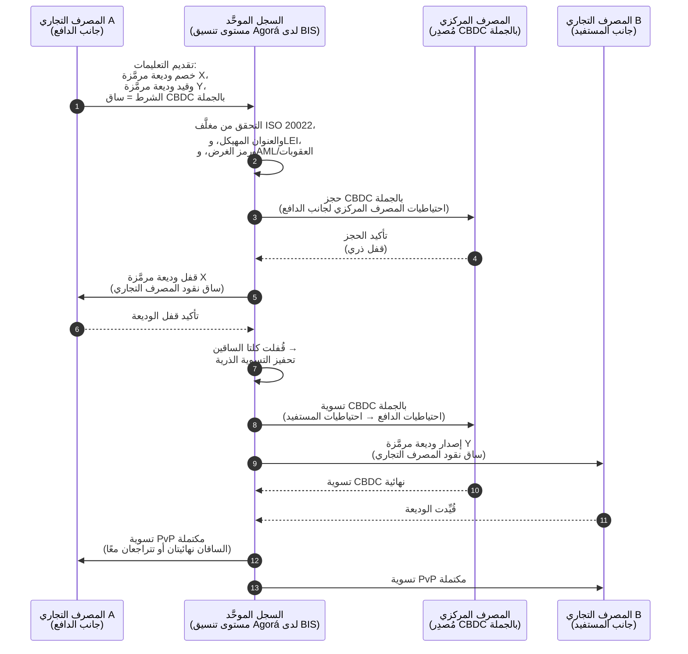

<!-- lead-start: manual -->
<aside class="post-lead" aria-label="ملخص المقال">

<strong>الخلاصة.</strong> تقع المدفوعات بالجملة في 2026 عند تقاطع تحوُّلَين بنيويَّين: ISO 20022 يفرض بيانات المدفوعات المُهيكَلة داخل نموذج التشغيل، والودائع المرمَّزة مع Project Agorá من BIS تدفع التسوية عبر الحدود نحو مسارات ذرية وقابلة للبرمجة وعاملة على مدار الساعة. لم يعد سؤال 2026 لدى المصرف "هل رحَّلنا الرسائل" بل "هل عمليات المدفوعات لدينا قابلة للقياس والتوجيه والإشراف" — والمؤشر يُفصِّل ذلك إلى أربع نسب دقيقة: اكتمال البيانات المُهيكَلة، ومثالية توجيه المسارات، وزمن نهائية التسوية، وتغطية ممرات Agorá.

<strong>النقاط الرئيسية</strong>

<ul class="post-lead-takeaways">
  <li><strong>نوفمبر 2026 موعد نهائي صارم لا توجيه.</strong> SWIFT تُلغي دعم العناوين غير المُهيكَلة في SR 2026؛ والمدفوعات التي تفتقر إلى المدينة والدولة في الحقول المُحدَّدة تتوقف عن المقاصة. كلفة الإصلاح، ونسبة الرفض، وطاقة العمليات تنتقل جميعها من "مقياس" إلى "وضع مرئي للمنظِّم".</li>
  <li><strong>الودائع المرمَّزة تتفوق على العملات المستقرة في الجملة المُنظَّمة.</strong> تحفظ علاقة المصرف بالمودِع وأصل تسوية المصرف المركزي، مع كشف القابلية للبرمجة. تحتفظ العملات المستقرة بدور على الأطراف؛ والودائع المرمَّزة تُرسي النواة.</li>
  <li><strong>Project Agorá من BIS هو المرجع للممرات.</strong> إذا لم يستطع منتج المصرف عبر الحدود العمل داخل ممر Agorá بحلول 2027، فإنه يتنافس على مسار يخرج منه باقي السوق.</li>
  <li><strong>تنسيق المسارات الفورية هو نموذج التشغيل.</strong> قرار تعدُّد المسارات في 2026 (FedNow / RTP / TIPS / SEPA Inst / على السلسلة) ليس "أيُّ مسار" — بل سجل السياسات، وملف السيولة، ومحرِّك التوجيه الذي يختار المسار لكل دفعة.</li>
  <li><strong>قِسْ أو تُقاس.</strong> أربع نسب — اكتمال البيانات المُهيكَلة، ومثالية توجيه المسارات، وزمن نهائية التسوية، وتغطية ممرات Agorá — تُحوِّل وضع المدفوعات إلى دليل جاهز للمشرفين قبل نافذة التدقيق 2026/27.</li>
</ul>
</aside>
<!-- lead-end -->

# مؤشر المدفوعات بالجملة في 2026: ISO 20022، والودائع المرمَّزة، والمسارات الفورية، والتسوية عبر الحدود

تُعاد صياغة المدفوعات بالجملة في 2026 عبر تحوُّلَين متزامنَين: بيانات مدفوعات مُهيكَلة، وتسوية قابلة للبرمجة. محطة العناوين المُهيكَلة لدى SWIFT في نوفمبر 2026 تفرض جودة البيانات داخل نموذج التشغيل، فيما Project Agorá من BIS والودائع المرمَّزة تختبران ما إذا كان بإمكان التسوية عبر الحدود أن تصبح أكثر ذرية وشفافية وعملًا على مدار الساعة.

---

> **الخلاصة التنفيذية / النقاط الرئيسية**
>
> - **نوفمبر 2026 محطة بيانات صارمة.** تقول SWIFT إن المدفوعات التي تحتوي على عناوين غير مُهيكَلة لن تُدعم بعد تغيير SR 2026.
> - **البيانات المُهيكَلة تصبح بنية تحتية للمنتج.** يجب أن تكون المدينة والدولة في الحقول المُحدَّدة كحد أدنى، مما يُحوِّل جودة بيانات المدفوعات إلى مسألة عميل وعمليات وامتثال.
> - **الودائع المرمَّزة خيار تصميم للجملة.** يستكشف Project Agorá ودائع المصارف التجارية المرمَّزة واحتياطيات المصرف المركزي المرمَّزة ضمن نموذج سجل موحَّد.
> - **يجب أن يقيس المؤشر جودة التسوية، لا السرعة وحدها.** النهائية، والشفافية، ومعدلات الإصلاح، واستخدام السيولة، وبيانات الامتثال، ووضوح الرؤية للعميل تهم بقدر التنفيذ الفوري.
> - **المدفوعات عبر الحدود تظل أجندة عامة-خاصة.** يواصل FSB قيادة خارطة طريق G20 عبر التنفيذ، بتنسيق بين القطاعَين العام والخاص.
>
---

## لماذا 2026 هي العام الذي يهم فيه هذا المؤشر

مؤشر Stanford للذكاء الاصطناعي مفيد لأنه يتعامل مع مجال تقني سريع التطوُّر بوصفه شيئًا قابلًا للقياس: المخرجات البحثية، والأداء التقني، والنشر المسؤول، والاقتصاد، وتبني القطاعات، والسياسات، والمزاج العام تُجمع في إطار واحد ([Stanford HAI ⧉](https://hai.stanford.edu/ai-index/2026-ai-index-report "The 2026 AI Index Report")). المصارف والمؤسسات المالية تحتاج الآن نفس الانضباط للبنية التحتية. الذكاء الاصطناعي الوكيل، والأمن الآمن كميًا، والصمود السحابي الأصل، والمدفوعات بالجملة لم تعد مسارات ابتكار منفصلة؛ بل تتقارب في نموذج تشغيل واحد.

السؤال العملي للمصرف ليس ما إذا كان كل مجال مهمًا. بل ما إذا كانت المؤسسة قادرة على قياس الجاهزية عبرها جميعًا في الوقت نفسه. يمكن للمصرف أن ينشر ذكاءً اصطناعيًا وكيلًا ويبقى هشًا إذا لم يكن تشفيره جاهزًا للترحيل. ويمكنه تحديث المنصات السحابية ويفشل مع ذلك إذا ظلت بيانات المدفوعات غير مُهيكَلة. ويمكنه تشغيل تجارب ترميز ومع ذلك يخلق مخاطر نظامية إذا لم تُصمَّم طبقات التسوية والسيولة والهوية والتدقيق معًا.

## بنية مؤشر 2026

| طبقة المؤشر | اتجاه 2026 | مقياس الجاهزية | المخاطرة في حال سوء المعالجة |
|---|---|---|---|
| **بيانات ISO 20022** | الانتقال من نص غير مُهيكَل إلى حقول مُهيكَلة مُحكَمة | جاهزية العناوين المُهيكَلة ونسبة الرفض | رفض المدفوعات والإصلاح اليدوي |
| **تنسيق المسارات** | التوجيه عبر RTGS، والفوري، والمراسلة، والعملات المستقرة، والمسارات المرمَّزة | التكلفة والسرعة والنهائية والتوجيه الواعي بالاختصاص القضائي | مسارات مجزَّأة بضوابط مكرَّرة |
| **التسوية المرمَّزة** | استخدام الودائع المرمَّزة ونقود المصرف المركزي حيث تُخفِّض الاحتكاك | تغطية DvP وPvP والتسوية الذرية | أصول تجريبية بلا قيمة في سير الأعمال |
| **السيولة** | تحسين السيولة خلال اليوم، والنقد المحتجز، ونوافذ التسوية | السيولة الموفَّرة وخفض إخفاق التسوية | استنزاف أسرع للسيولة |
| **الامتثال** | تضمين متطلبات AML والعقوبات وFATF والتدقيق في بيانات المدفوعات | امتثال متواصل وقابلية تفسير | بيانات أغنى بضوابط أضعف |

## إشارات المدفوعات بالجملة الرئيسية مُربَطة بالأولويات العالمية

مجموعة إشارات 2026 ليست أجندة بحثية. هي قائمة تنفيذ يُقاس عليها بالفعل رئيس قسم المدفوعات لدى المصرف. وأعمال المعالجة تظهر في ثلاثة مواضع: مغلَّف الرسالة، وطبقة تنسيق المسارات، وسجل التسوية.

| الإشارة | المرجع لدى G20 / SWIFT / BIS | التنفيذ على المنصة التقنية |
|---|---|---|
| **65% من رسائل المدفوعات لا تزال تحتوي على عناوين غير مُهيكَلة** | [SWIFT SR 2026 — محطة العناوين المُهيكَلة، نوفمبر 2026 ⧉](https://www.swift.com/news-events/news/iso-20022-milestone-november-2026-unstructured-addresses-be-removed "محطة العناوين المُهيكَلة في ISO 20022 نوفمبر 2026") | التحقق من المخطط في وسيط المدفوعات قبل وصول الرسالة إلى محوِّل SWIFTNet؛ تحليل آلي للعناوين عند منفذ القناة المؤسسية ومنفذ المصرف المراسل. |
| **هدف G20 لدى FSB: 75% من المدفوعات عبر الحدود تكتمل خلال ساعة واحدة بحلول 2027** | [خارطة طريق FSB للمدفوعات عبر الحدود، مرحلة التنفيذ 2026 ⧉](https://www.fsb.org/2026/03/fsb-kicks-off-new-implementation-phase-to-enhance-cross-border-payments-through-public-private-partnership/ "مرحلة تنفيذ المدفوعات عبر الحدود") | بوابات تحويل عملات فورية بنوافذ سيولة متفق عليها مسبقًا؛ خطاطيف تأكيد T+0 داخل بوابة العميل؛ محرِّك توجيه مسارات يستبعد أي ممر لا يستطيع الوفاء بظرف الساعة الواحدة. |
| **هدف G20 لدى FSB: متوسط كلفة المعاملة عبر الحدود دون 1%، والتجزئة دون 3%** | [أهداف G20 الكمية لدى FSB ⧉](https://www.fsb.org/2026/03/fsb-kicks-off-new-implementation-phase-to-enhance-cross-border-payments-through-public-private-partnership/ "مرحلة تنفيذ المدفوعات عبر الحدود") | قياس عن بُعد لإسناد التكلفة على كل ممر (هامش الصرف، رسوم المراسلة، كلفة الرفع)؛ سجل سياسة هوامش يكشف التسعير غير المتوافق قبل عرض السعر. |
| **Project Agorá من BIS يدخل مرحلة النموذج الأولي عبر سبعة مصارف مركزية + 41 مصرفًا تجاريًا** | [Project Agorá من BIS ⧉](https://www.bis.org/about/bisih/topics/fmis/agora.htm "Project Agorá") | مواصفة تكامل السجل الموحَّد: عقدة سجل الودائع المرمَّزة + مستوى تسوية CBDC بالجملة + خطاطيف KYC/AML؛ تجمُّعات سيولة على السلسلة بحجم حصة المصرف من الممر. |
| **إطار "النقود الرقمية" لدى Deutsche Bank يتبلور في معمارية العملاء** | [Deutsche Bank — النقود الرقمية: العملات المستقرة والودائع المرمَّزة وعملات البنوك المركزية الرقمية ⧉](https://flow.db.com/publications/flow-white-papers-and-guides/digital-money-a-perspective-on-stablecoins-tokenised-deposits-and-cbdcs "Digital Money: stablecoins, tokenised deposits and CBDCs") | واجهة تسوية محايدة تجاه المحفظة تُجرِّد اختيار العملة المستقرة / الوديعة المرمَّزة / CBDC لكل دفعة؛ شروط قابلة للبرمجة تُقيَّم وفق سجل سياسات المصرف، لا سجل العميل. |

## نقطة الانعطاف في بيانات المدفوعات

انتقل ISO 20022 من مشروع تنسيق رسائل إلى نموذج تشغيل قائم على جودة البيانات. إذا كانت بيانات المستفيد والمَدين والدائن والوكيل والمدينة والدولة والغرض والأطراف ضعيفة، فسيواجه المصرف رفضًا وإصلاحات واحتكاك عقوبات وإحباطًا للعملاء وتحليلات هزيلة.

**SR 2026 يجعل ذلك عقدًا صارمًا، لا توصية إرشادية.** إصدار معايير SWIFT 2026 (نوفمبر 2026) يفرض قاعدة العنوان المهيكل عند طبقة الشبكة — الرسائل التي لا يحمل عنصر `<PstlAdr>` فيها كلًا من `<TwnNm>` و`<Ctry>` تُرفض عند الاستلام بواسطة مكدِّس التحقق في SWIFTNet، ولا تُرفع للإصلاح. طابور الإصلاح يتوقف عن كونه بندًا في كلفة المكتب الخلفي ويصبح حدث إخفاق تسوية بتأخير مرئي للعميل. فِرَق العمليات التي تتعامل مع SR 2026 بوصفه "توجيهًا أكثر تشددًا" تعمل من دليل إجراءات خاطئ.

### الامتثال لبيانات المدفوعات المُهيكَلة بموجب ISO 20022

سطح المعالجة ضيق ومُحدَّد جيدًا. عناصر XML أدناه هي الموضع الذي يُخفق فيه مكدِّس التحقق في SWIFTNet لشهر نوفمبر 2026 الرسائل فعليًا؛ وكل ما عداها تَبَعات لاحقة.

| عنصر البيانات | وسم ISO 20022 XML | متطلب SWIFT لنوفمبر 2026 | استراتيجية المعالجة التقنية |
|---|---|---|---|
| **العنوان المهيكل** | `<PstlAdr>` يحتوي على `<TwnNm>` + `<Ctry>` | إلزامي. النص غير المهيكل في `<AdrLine>` يُحفِّز رفض الشبكة عند محوِّل SWIFTNet المستلِم. | تحليل آلي للعناوين عند بدء الدفع؛ إعادة كتابة نماذج القناة المؤسسية؛ تنظيف القاعدة الخلفية لكل طرف مقابل قبل الخصم التالي. |
| **رمز الكيان القانوني (LEI)** | `<Id>` تحت `<OrgId>` | يُوصى به بشدة للتحقق من الأطراف المقابلة المالية غير الأفراد؛ إلزامي في عدة ممرات CBPR+. | بحث LEI + تحقُّق متبادل مع GLEIF عند إدراج العميل المؤسسي؛ إثراء آلي للأطراف المقابلة في القاعدة الخلفية عبر خدمات البيانات المرجعية. |
| **رموز غرض الدفع** | `<Purp>` يحتوي على `<Cd>` | إلزامي في عدة ممرات فورية إقليمية (CBPR+، SEPA Inst، TIPS) لفحص AML / العقوبات الآلي. | تحويل رموز معاملات المصرف الداخلية القديمة إلى قائمة ISO 20022 ExternalPurposeCode القياسية؛ كشف اختيار الغرض في واجهة القناة المؤسسية؛ رفض افتراضي للرموز غير المعروفة. |
| **الأطراف النهائية** | `<UltmtDbtr>` / `<UltmtCdtr>` | كشف سياق المستفيد النهائي للوفاء بمعايير G20 FATF لقاعدة السفر + العقوبات؛ إلزامي لعدة رموز نوع دفع. | استخراج أسماء الأطراف من طرف إلى طرف من الحسابات الفرعية للسجل؛ التوفيق مع رسم بياني KYC؛ كشف الطرف النهائي في كل تأكيد. |
| **معلومات التحويل (مُهيكَلة)** | `<RmtInf><Strd>` مع `<RfrdDocInf>` | مطلوب للمدفوعات المؤسسية القابلة للمطابقة المرتبطة بالفواتير بموجب CBPR+ المرحلة 2. | التقاط تحويل مُهيكَل عند وقت التسعير في بوابة الشركات؛ رفض الاحتياط بالنص الحر للتدفقات عالية القيمة. |

## الودائع المرمَّزة والعملة الرقمية للمصرف المركزي بالجملة

تحفظ الودائع المرمَّزة نموذج نقود المصارف التجارية مع إضافة القابلية للبرمجة. ونقود المصرف المركزي بالجملة تحفظ نهائية التسوية. ونمط التصميم اللافت هو الجمع بينهما: نقود المصارف التجارية لعلاقات العملاء ووساطة الائتمان، ونقود المصرف المركزي للتسوية النهائية والثقة النظامية.

Project Agorá يجعل هذا الجمع ملموسًا. المعمارية أدناه هي النمط المرجعي لدى BIS لتسوية ذرية بنظام الدفع مقابل الدفع (PvP) عبر الحدود تستخدم سجل ودائع مصرف تجاري ومستوى تسوية CBDC بالجملة معًا، بتنسيق عبر سجل موحَّد.

التسوية ذرية بحكم التصميم: إما أن تثبت كلتا الساقين أو تتراجعا معًا. نهائية التسوية على ساق CBDC بالجملة تجعل تحويل الوديعة المرمَّزة للمصرف التجاري ساري المفعول دون مخاطرة المراسلة. السجل الموحَّد هو مستوى التنسيق، وليس نظام دفع قائمًا بذاته — فالمصرف المركزي لا يزال يُصدِر أصل التسوية، والمصرف التجاري لا يزال يُقيِّد التزام الوديعة.

## منتج المدفوعات بالجملة الجديد

لم يعد المنتج مجرد دفعة. بل حزمة تنفيذ وبيانات وسيولة وامتثال وتتبُّع وإدارة استثناءات. والمصارف القادرة على كشف هذه القدرات عبر واجهات برمجة التطبيقات ولوحات العملاء ستحوِّل امتثال البنية التحتية إلى قيمة للعميل.

## ما يعنيه ذلك بحسب نوع المصرف

### المصارف العالمية ذات الأهمية النظامية

ينبغي أن تتعامل المصارف العالمية مع هذا المؤشر بوصفه بطاقة قياس لمعمارية المؤسسة. الأولوية ليست إثباتًا آخر للمفهوم؛ بل دليل على أن سير العمل المستقل، والترحيل التشفيري، والاعتماد على السحابة، وتحديث المدفوعات يمكن حوكمتها بوصفها منظومة مخاطر وقيمة واحدة.

### مصارف المعاملات ومصارف الشركات

ينبغي أن تُركِّز مصارف المعاملات على المدفوعات بالجملة، والبيانات المُهيكَلة، والسيولة، والودائع المرمَّزة، وخدمات الخزينة الوكيلة. أكثر العروض قيمةً للعميل ليست حركة الأموال الأسرع وحدها؛ بل حركة أموال قابلة للتفسير والتدقيق والبرمجة بعدد أقل من التحقيقات ورؤية أوضح لرأس المال العامل.

### المصارف الإقليمية

ينبغي أن تستخدم المصارف الإقليمية المؤشر لتجنُّب تضخُّم البرامج. ليس عليها أن تتصدَّر كل جبهة، لكنها تحتاج إلى مواقف موثوقة في حوكمة الذكاء الاصطناعي، وجَرد ما بعد الكم، ودليل الخروج السحابي، وجاهزية بيانات المدفوعات.

### شركات التقنية المالية ومقدِّمو خدمات الدفع ومُزوِّدو البنية التحتية

ينبغي أن تُواءم شركات التقنية المالية ومزوِّدو البنية التحتية خرائط منتجاتهم مع جاهزية المصارف القابلة للقياس. وأفضل العروض ستُقلِّص مخاطر التكامل، وتُعزِّز الأدلة، وتُيسِّر على المصارف حوكمة البنية التحتية المعقَّدة.

## الخاتمة

قيمة التقرير على هيئة مؤشر أنه يُحوِّل أجندة تقنية مجزَّأة إلى نموذج تشغيل قابل للقياس. في 2026، لن يكون الفائزون في البنية التحتية المالية أكثر المؤسسات تجاربَ. بل المؤسسات القادرة على إثبات الجاهزية عبر الاستقلالية، والأمن، والصمود، والتسوية، والاقتصاد، والحوكمة في الوقت ذاته.

## الأسئلة الشائعة

**لماذا لا يزال ISO 20022 قضية 2026؟**

لأن الترحيل لا يكتمل حتى تُهيكَل بيانات المدفوعات وتُحكَم وتُلتقَط عند المنبع وتصبح قابلة للاستخدام عبر القنوات والعملاء والبنى التحتية للأسواق.

**ما الوديعة المرمَّزة؟**

الوديعة المرمَّزة تمثيل رقمي لنقود المصارف التجارية، مُصمَّمة لتحفظ علاقة المصرف بالمودِع مع تمكين التسوية القابلة للبرمجة.

**هل تحل الودائع المرمَّزة محل العملات المستقرة؟**

ليس في كل مكان. قد تبقى العملات المستقرة مفيدة في بعض سياقات الأصول الرقمية وعبر الحدود، فيما الودائع المرمَّزة جذَّابة بنيويًا للجملة المصرفية المُنظَّمة.

**ما الذي ينبغي للمصارف قياسه؟**

قِسْ جاهزية البيانات المُهيكَلة، ورفض المدفوعات، وكلفة الإصلاح، وزمن التسوية، واستخدام السيولة، ومخرجات توجيه المسارات، ووضوح الرؤية للعميل.

## المراجع

- SWIFT, (2026). [محطة العناوين المُهيكَلة في ISO 20022 نوفمبر 2026 ⧉](https://www.swift.com/news-events/news/iso-20022-milestone-november-2026-unstructured-addresses-be-removed "محطة العناوين المُهيكَلة في ISO 20022 نوفمبر 2026").
- BIS Innovation Hub, (2026). [Project Agorá ⧉](https://www.bis.org/about/bisih/topics/fmis/agora.htm "Project Agorá").
- FSB, (2026). [مرحلة تنفيذ المدفوعات عبر الحدود ⧉](https://www.fsb.org/2026/03/fsb-kicks-off-new-implementation-phase-to-enhance-cross-border-payments-through-public-private-partnership/ "مرحلة تنفيذ المدفوعات عبر الحدود").
- Deutsche Bank, (2026). [Digital Money: stablecoins, tokenised deposits and CBDCs ⧉](https://flow.db.com/publications/flow-white-papers-and-guides/digital-money-a-perspective-on-stablecoins-tokenised-deposits-and-cbdcs "Digital Money: stablecoins, tokenised deposits and CBDCs").

<!-- enrich-start -->
<aside class="author-card" aria-label="نبذة عن المؤلف"><strong class="author-card-name"><a href="/about/index.html">سيباستيان روسو</a></strong>تقني مصرفي أول يكتب عن الذكاء الاصطناعي التطبيقي، والبنية التحتية للمدفوعات، والنقود المرمَّزة، وISO 20022، والأمن ما بعد الكمي، والخدمات المالية السحابية الأصل، والأسواق الرقمية المُنظَّمة.أكثر من 20 عامًا من الخبرة لدى HSBC للخدمات المصرفية التجارية والاستثمارية، وPayPal، وBarclays، وShazam، وAKQA، ومجموعة Virgin. <a href="/about/index.html">الملف الكامل</a> &middot; <a href="https://www.linkedin.com/in/sebastienrousseau/" rel="external noopener">LinkedIn</a> &middot; <a href="https://github.com/sebastienrousseau" rel="external noopener">GitHub</a></aside>

آخر مراجعة <time datetime="2026-06-06">2026-06-06</time>.

<aside class="related-posts" aria-labelledby="related-heading">
<h2 id="related-heading" class="related-heading">قراءات ذات صلة</h2>

<article class="related-card"><footer class="related-body"><h3><a href="https://sebastienrousseau.com/2026-05-29-iso-20022-after-migration-payment-data-banking-products-2026">ISO 20022 بعد الترحيل: تحويل بيانات المدفوعات إلى منتجات مصرفية في 2026</a></h3>
<time datetime="2026-05-29">2026-05-29</time>
</footer></article>
<article class="related-card"><footer class="related-body"><h3><a href="https://sebastienrousseau.com/2026-05-26-stablecoins-vs-tokenised-deposits-bank-strategy-2026">العملات المستقرة مقابل الودائع المرمَّزة في 2026: ما الذي يجب على البنوك الدفاع عنه فعلاً</a></h3>
<time datetime="2026-05-26">2026-05-26</time>
</footer></article>
<article class="related-card"><footer class="related-body"><h3><a href="https://sebastienrousseau.com/2026-05-19-global-wholesale-payments-economics-2026">اقتصاديات المدفوعات بالجملة العالمية في 2026</a></h3>
<time datetime="2026-05-19">2026-05-19</time>
</footer></article>

</aside>
<!-- enrich-end -->
