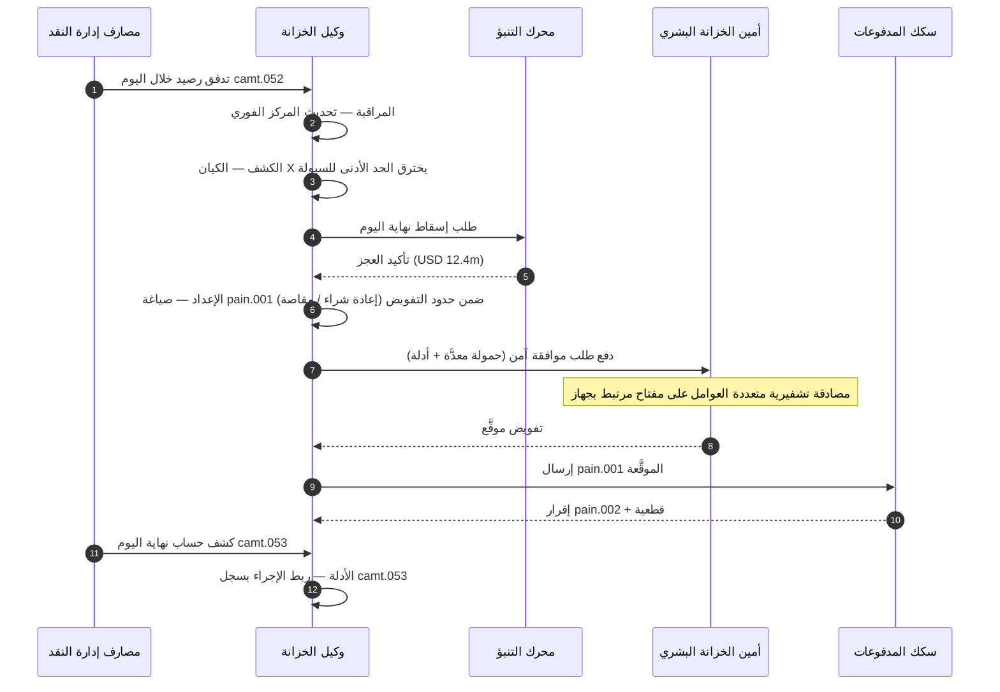

# مؤشر الخزانة المستقلة 2026: الخزانة العميلة والسيولة القابلة للبرمجة والودائع المرمَّزة

<!-- lead-start -->
<aside class="post-lead" aria-label="ملخص المقال">

<strong>الخلاصة.</strong> مؤشر الخزانة المستقلة (autonomous treasury) لعام 2026 — يقيس تدفقات العمل العميلة (Agentic)، وتغطية السيولة القابلة للبرمجة، وتكامل الودائع المرمَّزة، وتنسيق المدفوعات الفورية، والتحكم النقدي الآلي بوصفها نسيجاً تشغيلياً واحداً.

<strong>أبرز النقاط</strong>

<ul class="post-lead-takeaways">
  <li><strong>الخزانة تتحول إلى نظام تشغيل فوري.</strong> لم يعد التنبؤ النقدي الساكن وتجميع الأرصدة الدفعي وحدةَ القياس؛ بل تدفقات العمل العميلة العاملة على بيانات فورية هي الوحدة الجديدة.</li>
  <li><strong>السيولة القابلة للبرمجة باتت ممكنة عملياً.</strong> الودائع المرمَّزة مع السكك الفورية تجعل توفير السيولة لكل حدث وحدةً أولية لسير العمل، لا مبادرةً ربع سنوية.</li>
  <li><strong>الودائع المرمَّزة هي النقد الرقمي المفضَّل للخزانة.</strong> اقتصاديات نقود المصارف، والقابلية للبرمجة، واليقين خلال اليوم — دون أسئلة مخاطر المُصدِر والاحتياطيات التي ترافق العملات المستقرة.</li>
  <li><strong>مستوى التحكم هو سطح التدقيق الجديد.</strong> يجب أن تعمل التفويضات والحدود ومسارات التجاوز اليدوي وأدلة الإلغاء بوصفها أوليات منصةٍ، لا موافقاتٍ يدويةً لكل إجراء.</li>
  <li><strong>بطاقة قياس CFO صارت لكل قرار، لا لكل ربع.</strong> تكلفة النقد، وتخفيض احتياطي السيولة اليومية، وكفاءة FX، ودقة التنبؤ تُقاس بسرعة سير العمل.</li>
</ul>

<strong>قراءات ذات صلة:</strong> <a href="https://sebastienrousseau.com/ar/2026-05-25-programmable-liquidity-ai-tokenised-deposits-real-time-treasury-2026/index.html">السيولة القابلة للبرمجة في 2026: الذكاء الاصطناعي، والودائع المرمَّزة، وتنسيق الخزانة الفوري</a>، <a href="https://sebastienrousseau.com/ar/2026-05-21-tokenised-deposits-banking-services-status-2026/index.html">الودائع المرمَّزة في 2026: الخدمات المصرفية، ومنافسة العملات المستقرة، ووضع نقود المصارف التجارية القابلة للبرمجة</a>.

</aside>
<!-- lead-end -->

الخزانة المستقلة (autonomous treasury) هي نقطة التقاء طبيعية بين الذكاء الاصطناعي العميل، ومدفوعات الجملة، والودائع المرمَّزة، والسيولة الفورية. في 2026، لن تكتفي أفضل هندسات الخزانة بالتنبؤ النقدي؛ بل ستوصي بالإجراءات وتُفسِّرها، ثم تنفِّذها في حدود مرسومة عبر الحسابات والعملات والسكك وأصول التسوية.

---

> **الموجز التنفيذي / أبرز النقاط**
>
> - **الخزانة تتحوَّل من إعداد التقارير إلى التحكم.** الأرصدة الفورية، والتنبؤات، وحالة المدفوعات، وحركة السيولة تنتظم في سير عمل واحد.
> - **الذكاء الاصطناعي العميل يخلق واجهة خزانة جديدة.** تستطيع العملاء مراقبة المراكز، وكشف الشذوذات، وإعداد إجراءات التمويل، وتصعيد القرارات ضمن التفويضات المحددة.
> - **النقد القابل للبرمجة يُغيِّر الشق النقدي.** الودائع المرمَّزة وتجارب CBDC للجملة تخلق إمكانات جديدة للتسوية الذرية، والمدفوعات المشروطة، والسيولة الدائمة.
> - **يجب أن يقيس المؤشر السلطة.** السؤال ليس ما إذا كان العميل قادراً على اقتراح إجراء؛ بل ما إذا كانت السلطة والحدود والموافقات والأدلة واضحة.
> - **قيمة الخزانة قابلة للقياس.** السيولة المُوفَّرة، والتحقيقات اليدوية المُختصرة، وحالات فشل التسوية المُتجنَّبة، ورأس المال العامل المُحرَّر، ينبغي أن تُعرِّف النجاح.
>
---

## لماذا 2026 هو عام أهمية هذا المؤشر

مؤشر ستانفورد للذكاء الاصطناعي مفيد لأنه يُعامل حقلاً تقنياً سريع التطور بوصفه شيئاً قابلاً للقياس: نواتج البحث، والأداء التقني، والتطبيق المسؤول، والاقتصاديات، وتبنِّي القطاعات، والسياسة، والاتجاهات العامة، تُجمَع في إطار واحد ([Stanford HAI ⧉](https://hai.stanford.edu/ai-index/2026-ai-index-report "تقرير مؤشر الذكاء الاصطناعي 2026")). تحتاج المصارف والمؤسسات المالية اليوم إلى الانضباط ذاته لبنيتها التحتية. لم يعد الذكاء الاصطناعي العميل، والأمن المقاوم للكم، والمرونة السحابية الأصل، ومدفوعات الجملة، مسارات ابتكار منفصلة؛ بل تتقارب في نموذج تشغيلي واحد.

السؤال العملي للمصرف ليس ما إذا كان كل مجال مهماً. بل ما إذا كانت المؤسسة قادرةً على قياس الجاهزية في كل المجالات معاً. قد يُطبِّق مصرف ذكاءً اصطناعياً عميلاً ويظل هشَّاً إن لم تكن تشفيره جاهزاً للهجرة. وقد يُحدِّث منصاته السحابية ويفشل إن بقيت بيانات المدفوعات غير منظَّمة. وقد يُجري تجارب الترميز ويخلق مع ذلك مخاطر نظامية إن لم تُصمَّم طبقات التسوية والسيولة والهوية والتدقيق معاً.

## هندسة المؤشر لعام 2026

| طبقة المؤشر | اتجاه 2026 | مقياس الجاهزية | الخطر عند سوء المعالجة |
|---|---|---|---|
| **الرؤية** | توحيد بيانات الحساب والمدفوعات والسيولة والانكشاف | تغطية المراكز النقدية الفورية | تشظِّي رؤية النقد |
| **التنبؤ** | استخدام الذكاء الاصطناعي للتنبؤ بالأرصدة والتدفقات وحاجات التمويل | دقة التنبؤ ومعدل الاستثناءات | ثقة زائفة في بيانات ضعيفة |
| **الاستقلالية** | منح العملاء سلطة محدودة للتوصيات والإجراءات | تغطية التفويضات وجودة الموافقات | إجراء غير مصرَّح أو غير مُفسَّر |
| **القابلية للبرمجة** | استخدام الودائع المرمَّزة والشروط الذكية حيث تُضيف قيمة | حالات استخدام المدفوعات المشروطة والتسوية الذرية | تجارب خزانة تقودها التقنية |
| **الضوابط** | تضمين الحدود والعقوبات وضوابط FX والسيولة والتدقيق | أدلة الضبط لكل إجراء خزانة | حوكمة يدوية بعد التنفيذ |

## إشارات راهنة ينبغي متابعتها

| الإشارة | ما تعنيه للمصارف | المصدر |
|---|---|---|
| **تبنِّي الذكاء الاصطناعي العميل بنسبة 52% في الخدمات المالية** | تستطيع الخزانة الآن استيعاب التدفقات العميلة عبر منصات محوكَمة | [Cambridge CCAF ⧉](https://www.jbs.cam.ac.uk/faculty-research/centres/alternative-finance/publications/2026-global-ai-in-financial-services-report/ "تقرير 2026 العالمي للذكاء الاصطناعي في الخدمات المالية") |
| **المدفوعات المشروطة في Project Agorá** | قد يُتيح الترميز قدرات مدفوعات مشروطة ودائمة | [BIS ⧉](https://www.bis.org/about/bisih/topics/fmis/agora.htm "Project Agorá") |
| **بنك إنجلترا — البيئة التجريبية للأوراق المالية الرقمية (Digital Securities Sandbox)** | تتم تسوية السندات والأسهم المُصدَرة عبر تقنية الدفاتر الموزعة (DLT) على أساس التسليم مقابل الدفع (DvP) — يُسوَّى شق الأصل وشق النقد (CBDC للجملة أو ودائع المصارف التجارية المرمَّزة) في المعاملة الذرية ذاتها، ما يُزيل مخاطر الطرف المقابل على أصل المبلغ | [بنك إنجلترا ⧉](https://www.bankofengland.co.uk/financial-stability/digital-securities-sandbox "Digital Securities Sandbox") |
| **موعد العناوين المنظَّمة في SWIFT** | يجب التقاط بيانات الخزانة بشكل صحيح في المصدر | [SWIFT ⧉](https://www.swift.com/news-events/news/iso-20022-milestone-november-2026-unstructured-addresses-be-removed "محطة ISO 20022 لنوفمبر 2026 للعناوين المنظَّمة") |
| **المؤسسات المالية الكبرى تكافح لقياس قيمة الذكاء الاصطناعي** | تحتاج أتمتة الخزانة إلى مقاييس اقتصادية صلبة | [Cambridge CCAF ⧉](https://www.jbs.cam.ac.uk/faculty-research/centres/alternative-finance/publications/2026-global-ai-in-financial-services-report/ "تقرير 2026 العالمي للذكاء الاصطناعي في الخدمات المالية") |

## تفويض عميل الخزانة

لا ينبغي تصميم عميل الخزانة بوصفه مساعداً عامَّ الأغراض. يحتاج إلى تفويض: مراقبة الحسابات، وكشف الاستثناءات، والتنبؤ بفجوات التمويل، وإعداد الإجراءات، وطلب الموافقات، والتنفيذ ضمن الحدود، وإنتاج الأدلة. لكل خطوة من هذه الخطوات نموذج سلطة مختلف.

تعمل حلقة التحكم وفق التسلسل: المراقبة ← الكشف ← التنبؤ ← الإعداد ← طلب الموافقة — ثم تتوقف. لا يعبر الوكيل حدود التفويض التشفيري من تلقاء نفسه. يتتبع الرسم البياني أدناه دورة كاملة: يظهر عجز سيولة خلال اليوم بملايين الدولارات في قياسات `camt.052`، فيتنبأ الوكيل بمركز نهاية اليوم، ويُعدّ عملية إعادة شراء أو مقاصة بين الشركات بوصفها رسالة `pain.001` كاملة الإعداد، ويُسلِّمها إلى أمين الخزانة البشري للحصول على توقيع تشفيري متعدد العوامل على مفتاح مرتبط بجهاز. ثم يُرسل الوكيل الحمولة الموقَّعة؛ وتصل القطعية بوصفها إقراراً بتسلم `pain.002` ثم رسالة `camt.053` الرسمية التالية.

الحد هو المقصود — كل إجراء يُحرِّك مالاً حقيقياً يقع خلف بوابة تشفيرية لا يستطيع الوكيل اجتيازها بمفرده.

## السيولة القابلة للبرمجة

السيولة القابلة للبرمجة هي القدرة على تحريك القيمة وفق شروط: إذا انكُسر حدٌّ معيَّن، أو إذا كان الضمان مؤهَّلاً، أو إذا اجتاز الطرف المقابل الفحص، أو إذا توفَّرت قطعية التسوية، أو إذا انخفض احتياطي السيولة اليومية. تجعل الودائع المرمَّزة ومنصات التسوية للجملة هذه الأنماط أكثر عملية.

القابلية للبرمجة لا تعني الخروج عن المعيار. مسار التنفيذ هو `pain.001` — رسالة بدء التحويل الائتماني للعميل في ISO 20022. الإجراء الذي يُعدُّه الوكيل هو حمولة `pain.001` كاملة الإعداد تُوجَّه إلى المصرف في القناة ذاتها التي يستخدمها نظام تخطيط موارد المؤسسة (ERP) للشركات، ويُتحقَّق منها مقابل المخطط نفسه، وتُقيَّم بمحركات الاحتيال والعقوبات ذاتها، ويُقَرّ باستلامها في تقارير الحالة `pain.002` ذاتها. أما طبقة الشَّرطية (الحد، أو أهلية الضمان، أو توفر القطعية، أو أرضية الاحتياطي) فتقع فوق الرسالة — إنها تحكم *ما إذا كانت* `pain.001` سترسَل، لا *الشكل* الذي تتخذه. منصات الخزانة التي تخترع حمولات مخصصة للتعبير عن الشروط ستخرج من المسار القابل للاستهلاك المصرفي وتعود إلى التكامل الثنائي.

## غرفة تحكم الخزانة

ينبغي أن يبدو النموذج التشغيلي كغرفة تحكُّم: المراكز، والتنبؤات، وحالات المدفوعات، واستخدام الحدود، والاستثناءات، والموافقات، والأدلة في واجهة واحدة. وعلى المؤشر معاقبة حِزَم الخزانة التي تتطلب من الفرق تجميع البريد الإلكتروني وجداول البيانات وبوابات المصارف ولوحات معلومات منفصلة.

طبقة البيانات خلف هذه الواجهة هي إدارة النقد وفق ISO 20022. المركز خلال اليوم هو `camt.052` — تقرير الحساب من المصرف إلى العميل — يُبَثُّ من كل مصرف لإدارة النقد إلى طبقة المراقبة لدى الوكيل بالوتيرة التي ينشرها المصرف (دقائق لمزوّدي الخدمات المصرفية للشركات من الطبقة الأولى، ونهاية الدورة للذيل الطويل). تسوية نهاية اليوم هي `camt.053` — كشف الحساب من المصرف إلى العميل — السجل القابل للتدقيق الذي يُقيَّم وفقه تنبؤ الوكيل في صباح اليوم التالي. منصات الخزانة التي تقرأ كشوف PDF أو تستخرج بيانات بوابات المصارف بكشط الشاشات لا تستطيع الوصول إلى المستوى 4 من المؤشر؛ إذ ينبغي أن تصل قياسات اليوم بوصفها `camt.052` منظَّمة كي تُغلَق حلقة التنبؤ في الوقت المناسب للتحرك.

## ماذا يعني هذا حسب نوع المصرف

### المصارف العالمية ذات الأهمية النظامية

ينبغي للمصارف العالمية معاملة هذا المؤشر بوصفه بطاقة قياس هندسة مؤسسية. الأولوية ليست إثبات مفهوم إضافي؛ بل إثبات أن التدفقات المستقلة، وهجرة التشفير، والاعتمادية السحابية، وتحديث المدفوعات، يمكن أن تُحوكَم بوصفها نظام مخاطر وقيمة واحد.

### مصارف المعاملات ومصارف الشركات

ينبغي لمصارف المعاملات التركيز على مدفوعات الجملة، والبيانات المنظَّمة، والسيولة، والودائع المرمَّزة، وخدمات الخزانة العميلة. أثمن عرض للعميل ليس مجرد تحريك أسرع للنقد؛ بل تحريك مال قابل للتفسير والتدقيق والبرمجة بتحقيقات أقل ورؤية أفضل لرأس المال العامل.

### المصارف الإقليمية

ينبغي للمصارف الإقليمية استخدام المؤشر لتجنُّب تضخُّم البرامج. لا حاجة لها لقيادة كل مجال، لكنها تحتاج إلى مواقف موثوقة حول حوكمة الذكاء الاصطناعي، وجرد ما بعد الكم، وأدلة الخروج السحابي، وجاهزية بيانات المدفوعات.

### شركات التقنية المالية ومزوِّدو خدمات الدفع ومزوِّدو البنية التحتية

ينبغي لشركات التقنية المالية ومزوِّدي البنية التحتية مواءمة خرائط منتجاتهم مع جاهزية المصارف القابلة للقياس. ستُخفِّض أفضل العروض مخاطر التكامل، وتُعزِّز الأدلة، وتُسهِّل على المصارف حوكمة البنية التحتية المعقَّدة.

## الخلاصة

قيمة التقرير المؤشِّر هي تحويل أجندة تقنية مُشتَّتة إلى نموذج تشغيلي قابل للقياس. في 2026، لن يكون الفائزون في البنية التحتية المالية هم المؤسسات الأكثر تجارب. بل المؤسسات القادرة على إثبات الجاهزية في الاستقلالية والأمن والمرونة والتسوية والاقتصاديات والحوكمة في الوقت ذاته.

## الأسئلة الشائعة

**ما الخزانة المستقلة (autonomous treasury)؟**

الخزانة المستقلة هي استخدام عملاء الذكاء الاصطناعي، والبيانات الفورية، والمدفوعات القابلة للبرمجة لمراقبة إجراءات الخزانة والتوصية بها، وربما تنفيذها، ضمن ضوابط محددة.

**هل يُسمح لعملاء الخزانة بتنفيذ المدفوعات؟**

فقط ضمن تفويضات ضيقة، وحدود قوية، وموافقات صريحة، وقابلية تدقيق كاملة. ينبغي اكتساب سلطة التنفيذ عبر النضج.

**كيف تُساعد الودائع المرمَّزة الخزانة؟**

تستطيع دعم التسوية القابلة للبرمجة، والتنفيذ الذري، وربما تحكُّماً أفضل بالسيولة اليومية، مع الحفاظ على علاقات نقود المصارف التجارية.

**ما خطوة التنفيذ الأولى؟**

بناء الرؤية الفورية وجودة البيانات قبل منح الاستقلالية. لا يستطيع العملاء تحسين النقد بأمان إن لم يستطيعوا رؤيته بدقة.

## المراجع

- Cambridge Centre for Alternative Finance, (2026). [تقرير 2026 العالمي للذكاء الاصطناعي في الخدمات المالية ⧉](https://www.jbs.cam.ac.uk/faculty-research/centres/alternative-finance/publications/2026-global-ai-in-financial-services-report/ "تقرير 2026 العالمي للذكاء الاصطناعي في الخدمات المالية").
- SWIFT, (2026). [محطة ISO 20022 لنوفمبر 2026 للعناوين المنظَّمة ⧉](https://www.swift.com/news-events/news/iso-20022-milestone-november-2026-unstructured-addresses-be-removed "محطة ISO 20022 لنوفمبر 2026 للعناوين المنظَّمة").
- BIS Innovation Hub, (2026). [Project Agorá ⧉](https://www.bis.org/about/bisih/topics/fmis/agora.htm "Project Agorá").
- Bank of England, (2026). [تشكيل المستقبل المالي الرقمي للمملكة المتحدة ⧉](https://www.bankofengland.co.uk/speech/2025/january/sasha-mills-speech-at-the-tokenisation-summit "تشكيل المستقبل المالي الرقمي للمملكة المتحدة").

<!-- enrich-start -->
<aside class="author-card" aria-label="نبذة عن المؤلف"><strong class="author-card-name"><a href="/about/index.html">سيباستيان روسو</a></strong>تقني مصرفي أول يكتب عن الذكاء الاصطناعي التطبيقي، والبنية التحتية للمدفوعات، والنقد المُرمَّز، وISO 20022، والأمن ما بعد الكمومي، والخدمات المالية السحابية الأصل، والأسواق الرقمية المُنظَّمة.أكثر من 20 عاماً من الخبرة لدى HSBC للخدمات المصرفية التجارية والاستثمارية، وPayPal، وBarclays، وShazam، وAKQA، ومجموعة Virgin. <a href="/about/index.html">الملف الكامل</a> &middot; <a href="https://www.linkedin.com/in/sebastienrousseau/" rel="external noopener">LinkedIn</a> &middot; <a href="https://github.com/sebastienrousseau" rel="external noopener">GitHub</a></aside>

آخر مراجعة <time datetime="2026-06-07">2026-06-07</time>.

<!-- enrich-end -->
