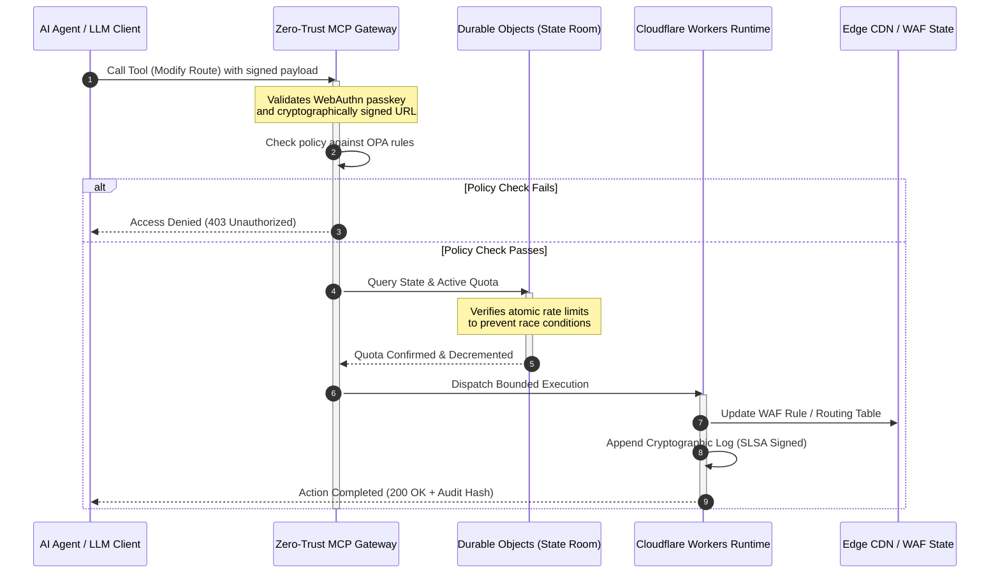

# CloudCDN: مخطط مفتوح المصدر للحافة الأصلية للذكاء الاصطناعي في 2026

<!-- lead-start: manual -->
<aside class="post-lead" aria-label="ملخص المقال">

<strong>الخلاصة.</strong> تتحدد تكنولوجيا المؤسسات في 2026 بتقارب التنفيذ اللاخادمي الموزَّع عالمياً مع الذكاء الاصطناعي الوكيلي. شبكات CDN التقليدية — المبنية لتخزين الملفات الثابتة مؤقتاً والتوجيه الأساسي لحركة المرور — باتت متقادمة بنيوياً في عصر تنسيق البيانات النشط الآني. CloudCDN مخطط مفتوح المصدر يعيد توظيف الحافة بوصفها مستوى تحكم نشطاً: أزمنة تشغيل لاخادمية، وتنسيق ذو حالة عبر Cloudflare Durable Objects، وبوابة بثقة صفرية لبروتوكول سياق النموذج (MCP) تتيح لوكلاء الذكاء الاصطناعي المستقلين تشغيل البنية التحتية للويب داخل أُطر تشغيلية محدودة ومؤمَّنة تشفيرياً.

<strong>أبرز النقاط</strong>

<ul class="post-lead-takeaways">
  <li><strong>من ذاكرة مؤقتة ثابتة إلى مستوى تحكم محدود.</strong> ينقل CloudCDN الحدَّ التشغيلي إلى الحافة، محوِّلاً عُقَد CDN إلى بوابات سياسة نشطة تنفِّذ قرارات الأمن والتوجيه والتحكم في الوصول في أقل من مللي ثانية.</li>
  <li><strong>تنسيق حافة ذو حالة.</strong> تُنفِذ Cloudflare Durable Objects تحديد المعدل الذرِّي الآني وتنسيق الحالة عالمياً — لا حالات تسابق موزَّعة، ولا إساءة استخدام منهجية للحصص عبر مناطق الحافة.</li>
  <li><strong>إدارة وكيلية آمنة للبنية التحتية عبر MCP.</strong> تكشف بوابة بثقة صفرية 42 أداة MCP متخصصة، تتيح لوكلاء الذكاء الاصطناعي فحص البنية التحتية وتكوينها وتشغيلها ضمن حدود موقَّعة تشفيرياً.</li>
  <li><strong>أمن سلسلة التوريد بوصفه مُخرَجاً من خط الأنابيب.</strong> منشأ بناء SLSA Level 3 عبر Sigstore/Cosign و3,185 اختبار وحدة بتغطية 100% في كل إصدار.</li>
  <li><strong>أدلة بمستوى مجلس الإدارة، لا لوحات معلومات.</strong> تُحوَّل قياسات الحافة مباشرة إلى مساءلة مجلس الإدارة بموجب المادة 5 من DORA، وتقارير مخاطر BCBS 239، وقواعد رأس مال المخاطر التشغيلية في Basel III.</li>
</ul>

<strong>قراءات ذات صلة:</strong> <a href="/2026-05-16-best-cloud-infrastructure-architecture-2026/">أفضل هندسة للبنية التحتية السحابية في 2026</a> · <a href="/2026-06-05-cloud-native-banking-index-dora-resilience-platform-engineering-2026/">مؤشر الصيرفة السحابية الأصل في 2026</a> · <a href="/2026-06-03-agentic-ai-index-banks-autonomy-governance-auditability-2026/">مؤشر الذكاء الاصطناعي الوكيلي للمصارف في 2026</a>

</aside>
<!-- lead-end -->

انتهى الجدل حول CDN. لم تَعُد الحافة ذاكرة مؤقتة؛ بل أصبحت مستوى التحكم للبرمجيات الأصلية للذكاء الاصطناعي. ومع استدعاء الوكلاء للأدوات، ونقلهم البيانات، وتطهيرهم الذاكرات المؤقتة، وطلبهم عناوين URL الموقّعة، وتنسيقهم سير العمل، يتوقف النموذج القديم القائم على لوحات معلومات مُعتمة ومستويات تحكم مملوكة عن كونه مجرد إزعاج ويتحول إلى مسؤولية تنظيمية. يدفع CloudCDN باتجاه نموذج مختلف: منصة حافة مفتوحة، قابلة للفحص، قابلة لتحكم الوكلاء، تعامل الأمن والوصول والأداء وقابلية التدقيق بوصفها معايير افتراضية قابلة للإنفاذ، لا وعوداً من المورِّد.

المرجع مفتوح المصدر لهذا المقال هو [cloudcdn.pro ⧉](https://github.com/sebastienrousseau/cloudcdn.pro "cloudcdn.pro"). المستودع شبكة CDN متعددة المستأجرين وأصلية للذكاء الاصطناعي يمكن قراءتها من طرف إلى طرف ونشرها باستقلالية: زمن TTFB دون 100 مللي ثانية عبر نقاط حضور Cloudflare، وتحكم MCP، وتحديد المعدل عبر Durable Objects، ووصول WCAG-AA، وعناوين URL موقّعة، وpasskeys، وSLSA Level 3، و3,185 اختباراً بتغطية 100%.

---

> **الموجز التنفيذي / أبرز النقاط**
>
> - **تصبح الحافة الحدَّ التشغيلي.** يحوِّل CloudCDN عُقَد CDN التقليدية إلى بوابات سياسة نشطة تنفِّذ الأمن والتوجيه والتحكم في الوصول في أقل من مللي ثانية.
> - **تجعل Durable Objects تحديد المعدل ذرِّياً.** إنفاذ حصص آني ومتَّسق عالمياً يُغلق نافذة حالات التسابق التي تتركها المحدِّدات ذات الاتساق النهائي مفتوحةً أمام المهاجمين والوكلاء المعطوبين.
> - **يشغِّل الوكلاء البنية التحتية عبر 42 أداة MCP محدودة.** يُتحقَّق من كل استدعاء مقابل passkeys بمعيار WebAuthn، وحمولات موقَّعة، وسياسات OPA قبل تنفيذ أي شيء.
> - **سلسلة التوريد جزء من المنتج.** يربط منشأ SLSA Level 3 عبر Sigstore/Cosign كل إصدار تشفيرياً بمصدره المُدقَّق.
> - **القياس عن بُعد دليل امتثال.** تُحوَّل عمليات الحافة إلى المادة 5 من DORA، وBCBS 239، ورأس مال المخاطر التشغيلية في Basel III — مباشرةً، لا عبر تقارير لاحقة.
>
---

## لماذا يَهُمُّ هذا المشروع مفتوح المصدر في 2026

انتقلت تكنولوجيا المعلومات المؤسسية في 2026 من التزويد الثابت للبنية التحتية إلى تنسيق بيانات آني قائم على الأحداث. قوتان سوقيتان تدفعان هذا التحوُّل.

الأولى انتشار الذكاء الاصطناعي الوكيلي. تنفِّذ النماذج المستقلة ووكلاء البرمجيات اليوم مهام تشغيلية معقدة — تخفيف آلي للتهديدات، وقرارات توجيه، وموازنة دفاتر آنية. وهي لا تستخدم لوحات المعلومات؛ بل تستدعي الأدوات.

الثانية الإنفاذ الفعلي لـ[قانون المرونة التشغيلية الرقمية (DORA) ⧉](https://eur-lex.europa.eu/legal-content/EN/TXT/?uri=CELEX%3A32022R2554 "اللائحة (EU) 2022/2554 بشأن المرونة التشغيلية الرقمية للقطاع المالي"). لم يَعُد بوسع المؤسسات المصرفية الاعتماد على شبكات CDN خارجية مُعتمة ومملوكة. يطالب المنظِّمون برؤية كاملة لسلسلة توريد البرمجيات، وقدرة خروج قابلة للتحقُّق، ومسارات تدقيق تشفيرية غير قابلة للتغيير.

تفرض هندسات الخوادم المركزية أعباء زمن استجابة لا يستطيع التنسيق الآني استيعابها. وتعمل شبكات CDN المملوكة كصناديق سوداء تُعرِّض المؤسسات لاختراق سلسلة توريد لا تستطيع رؤيته، فضلاً عن إثباته. يسدُّ CloudCDN هذه الفجوة بمخطط شفاف مفتوح المصدر بثقة صفرية يحوِّل الحافة إلى مستوى تحكم نشط. وبالنسبة للمديرين التنفيذيين للتكنولوجيا، ينقل النقاش من تكلفة الامتثال إلى العائد على المرونة (Return on Resilience): رأس مال يُحفَظ بخطوط أنابيب تشغيلية مؤتمتة وجاهزة للتدقيق.

## عدسة الهندسة

تتوزع هندسة CloudCDN على خمس طبقات، مستبدلةً البرمجيات الوسيطة المركزية بعناصر حافة أولية محلية ذات حالة:

| الطبقة | قرار التصميم | لماذا يَهُمُّ | الخطر عند سوء المعالجة |
|---|---|---|---|
| **زمن تشغيل الحافة** | Cloudflare Workers وPages | يُلغي زمن استجابة الأجهزة الافتراضية المركزية؛ ينفِّذ السياسات عالمياً في أقل من مللي ثانية | مكاسب أداء دون انضباط سياسة تُنتج انحرافاً فوضوياً عند الحافة |
| **تنسيق الحالة** | Durable Objects | يضمن اتساقاً ذرِّياً آنياً لحدود المعدل والحالة المشتركة عبر المناطق | حالات تسابق موزَّعة، وإساءة استخدام موارد API، وتجاوز حصص المحيط |
| **واجهة الوكيل** | بوابة MCP بثقة صفرية | تكشف 42 أداة MCP متخصصة ليشغِّل وكلاء الذكاء الاصطناعي البنية التحتية ضمن حدود محكومة | استدعاء أدوات بلا حدود وتغييرات تكوين غير مصرَّح بها |
| **التحكم في الوصول** | passkeys بمعيار WebAuthn وعناوين URL الموقّعة | يستبدل كلمات المرور الثابتة بتوقيعات تشفيرية لعمليات قابلة للتدقيق | تغييرات منسوبة بضعف؛ وسرقة بيانات اعتماد تقود إلى اختراق المحيط |
| **بوابات الجودة** | SLSA Level 3 وتغطية اختبار 100% | يتحقَّق رياضياً من مصدر البناء؛ يحجب حقن التبعيات الخبيثة | إدراج رمز خبيث عبر سلسلة توريد البرمجيات |

## إشارات تشغيلية يجب تتبُّعها

جاهزية الحافة قابلة للقياس. هذه هي المؤشرات الكمية التي تُثبت القدرة على التنفيذ لا مجرد النية:

| الإشارة | المقياس / المعيار | المرجع التنظيمي | تنفيذ المنصة |
|---|---|---|---|
| **42 أداة MCP** | عدد سجل أدوات محدود للإدارة المؤتمتة | COBIT 2019 (BAI06) | بوابة MCP تتحقَّق من توقيعات الوكلاء مقابل سياسات OPA |
| **Durable Objects** | إنفاذ حصص ذرِّي دون تسريب وفي أقل من مللي ثانية | المادة 6 من DORA | Durable Objects تتعقَّب حالة حصص API عالمياً |
| **passkeys وعناوين URL الموقّعة** | 100% من جلسات الإدارة مُتحقَّق منها عبر FIDO2 WebAuthn | المادة 30 من DORA | فحوصات توقيع تشفيرية مدمجة في موجِّه الحافة |
| **SLSA Level 3** | بيانات بناء موقَّعة تشفيرياً (Sigstore) | المادة 30 من DORA | خطوط أنابيب GitHub Actions تولِّد بيانات بناء وصفية موقَّعة |
| **3,185 اختبار وحدة** | تغطية 100%؛ وبوابات انحدار في كل إصدار | NIST CSF 2.0 (PR.DS-01) | خطوط أنابيب CI توقف النشر عند أي إخفاق اختبار |

## تصبح CDN مستوى تحكم نشطاً

صُمِّمت شبكات CDN التقليدية حول تسريع سلبي للمحتوى الثابت. يُعيد CloudCDN تعريف النموذج. فمع تكامل Cloudflare Workers وDurable Objects، تعمل الحافة بوصفها بوابة سياسة نشطة ذات حالة.

عندما يطلب وكيل ذكاء اصطناعي أو عملية مؤتمتة تغييراً في تكوين البنية التحتية أو تعديلاً في التوجيه، فإنه لا يخاطب قاعدة بيانات مركزية هشَّة. يُعترَض الطلب عند أقرب عقدة حافة ويمرُّ بفحوصات الهوية والسياسة والحصص قبل تنفيذ أي شيء:

تُنتج كل خطوة في هذا التسلسل سجلاً موقَّعاً قابلاً للنسب. وهذا هو الفرق بين شبكة CDN تُسرِّع المحتوى ومستوى تحكم يمكن حوكمته.

## لماذا يُغيِّر المصدر المفتوح نموذج الثقة

بالنسبة لرؤساء أمن المعلومات، تمثِّل شبكات CDN المملوكة المُعتمة خطراً متراكماً. شبكات الحافة مغلقة المصدر صناديق سوداء: إذا تعرَّض المورِّد لاختراق داخلي، فلن يرى المصرف شيئاً حتى يُكشف عن الاختراق علناً.

يستبدل CloudCDN هذا اللاتماثل بنموذج ثقة مفتوح المصدر قابل للتدقيق بالكامل، يقوم على ثلاث آليات:

1. **منشأ بناء رياضي.** بموجب SLSA Level 3، يُربط كل إصدار تشفيرياً بمستودعه مفتوح المصدر على GitHub. يستطيع رئيس أمن المعلومات التحقُّق — رياضياً لا تعاقدياً — من أن الملف الثنائي العامل على عُقَد حافة Cloudflare العالمية يحتوي بالضبط على الرمز المصدري المُدقَّق.
2. **تدقيقات أمنية عامة مستمرة.** يخضع الرمز المصدري لفحوصات مؤتمتة، وإفصاح عام عن الثغرات، وتدقيقات رمز بمراجعة الأقران. الغموض ليس ضابطاً؛ المراجعة هي الضابط.
3. **لا احتجاز لدى المورِّد (المادة 28 من DORA).** يُلزم DORA المصارف بإثبات استراتيجية خروج واضحة ومُختبَرة من مزوِّدي الخدمات الخارجيين الحرجين. ولأن CloudCDN مفتوح المصدر ومبني على عناصر لاخادمية قياسية، تستطيع المؤسسات ترحيل تكوينات الحافة من Cloudflare إلى أزمنة تشغيل لاخادمية أخرى أو عناقيد Kubernetes خاصة — وإثبات هذه القدرة أمام المنظِّم.

## نمط الحافة بالدرجة المصرفية

هُندِس CloudCDN لتلبية معايير الامتثال في القطاع المالي العالمي، إذ يربط عمليات الحافة التقنية مباشرة بالأطر التي يفحصها المشرفون فعلياً:

- **إدارة مخاطر النماذج ([SR 11-7 من الاحتياطي الفيدرالي الأمريكي ⧉](https://www.federalreserve.gov/supervisionreg/srletters/sr1107.htm "إرشادات إشرافية بشأن إدارة مخاطر النماذج") / SS1/23 من هيئة PRA البريطانية).** تقع النماذج المستقلة التي تنفِّذ مهام تشغيلية ضمن حوكمة مخاطر النماذج. تعامل بوابة MCP في CloudCDN الأدوات الوكيلية كنماذج كمية: حدود سياسة صارمة، وتسجيل آني، وتجاوزات إلزامية بإشراف بشري للإجراءات عالية الأثر.
- **BCBS 239 (تجميع بيانات المخاطر).** بالتقاط بيانات المعاملات ووسمها وهيكلتها عند الحافة، تُولَّد المقاييس التشغيلية آنياً — بما يطابق متطلبات BCBS 239 لسلامة البيانات وحُسن توقيتها وتتبُّعها التنظيمي.
- **المادة 5 من DORA (مساءلة مجلس الإدارة).** يتحمل مجلس الإدارة المسؤولية الشخصية النهائية عن المرونة التشغيلية. يترجم CloudCDN قياسات الحافة إلى أدلة كمية قابلة للتحقُّق يستطيع أعضاء المجلس غير التقنيين تقديمها في تدقيق مسؤولية شخصية.
- **رأس مال المخاطر التشغيلية في Basel III.** تحتفظ المصارف برأس مال تنظيمي مقابل المخاطر التشغيلية. يُقلِّص التحويل الآلي للتعافي من الكوارث ومنشأ SLSA Level 3 ملف المخاطر التشغيلية للمؤسسة — بما يحفظ رأس المال في الميزانية، لا مجرد إرضاء التدقيق.

## ماذا يعني هذا حسب نوع المصرف

### المصارف العالمية ذات الأهمية النظامية (G-SIB)

تدير المصارف العالمية ذات الأهمية النظامية أحجام معاملات ضخمة عبر ولايات قضائية متعددة. الأولوية هي استبدال ضوابط المحيط الموروثة المجزَّأة بمستوى حافة موحَّد واحد. يتيح نشر نمط CloudCDN لمصرف G-SIB توحيد سياسات الأمن وبوابات API والحوكمة الوكيلية عالمياً — وتوليد خطوط أنابيب أدلة متوافقة مع DORA بوصفها ناتجاً ثانوياً للتشغيل، لا سباقاً ربع سنوي.

### مصارف المعاملات والشركات

بالنسبة لمصارف المعاملات، المنتج الموجَّه للعملاء حزمة من سرعة التنفيذ والأمن وشفافية البيانات. يتيح نمط CloudCDN لهذه المصارف كشف لوحات معلومات API آمنة وخدمات تتبُّع نقدي آنية لأمناء خزانة الشركات — وضعية حافة مرنة تدافع عن ودائع المؤسسات.

### المصارف الإقليمية والصغيرة

تواجه المصارف الإقليمية الجهات المهدِّدة نفسها التي تواجهها مصارف G-SIB من دون ميزانياتها الهندسية. يوفِّر مخطط حافة مفتوح المصدر بدرجة مصرفية الضوابط جاهزةً: مواءمة تنظيمية فورية من دون تكاليف تراخيص مملوكة، ومعها الرمز المصدري لإثبات ذلك.

## دليل مجلس الإدارة

لم تَعُد المرونة التشغيلية مقياساً خفياً لتكنولوجيا المعلومات في المكاتب الخلفية؛ بل أولوية لمجلس الإدارة تترتب عليها مسؤولية شخصية. والمؤسسات التي تحافظ على ثقة المنظِّمين والعملاء والمساهمين في 2026 تعامل التكنولوجيا بوصفها أصلاً قابلاً للتحقُّق والرصد.

خارطة الطريق لقادة التكنولوجيا الكبار قصيرة:

1. **افرضوا الأدلة بوصفها منتجاً.** خصِّصوا ميزانية لخطوط أنابيب مؤتمتة ذاتية التوثيق عند الحافة — أدلة يولِّدها التشغيل، لا تُجمَّع للمدقِّق.
2. **انتقلوا إلى تحكم حافة ذي حالة.** انقلوا تحديد المعدل وWAF والتحقُّق من الهوية من الخوادم المركزية إلى عناصر حافة أولية ذرِّية.
3. **أرسوا حدوداً وكيلية تشفيرية.** أنفِذوا بوابات MCP بثقة صفرية مع تحقُّق passkey وOPA لكل استدعاء أداة مؤتمت.
4. **اشترطوا تدقيقات بناء مفتوحة المصدر.** اجعلوا منشأ بناء SLSA Level 3 شرطاً للنشر، لا طموحاً.

## الأسئلة الشائعة

**هل CloudCDN جاهز لتدقيقات DORA؟**

نعم. هُندِس CloudCDN لإنتاج أدلة امتثال مؤتمتة تُحوَّل مباشرة إلى قوالب المعايير التقنية التنفيذية لسجل المعلومات (من RT.01 إلى RT.15) والبنود التعاقدية في المادة 30 من DORA.

**ما ميزة استخدام Durable Objects لتحديد المعدل؟**

تعتمد محدِّدات المعدل الموزَّعة التقليدية على الاتساق النهائي، ما يترك نافذة زمن استجابة يستطيع المهاجمون أو الوكلاء المعطوبون استغلالها. تضمن Durable Objects اتساقاً ذرِّياً فورياً عالمياً، فتُغلق نافذة حالات التسابق كلياً.

**ما الذي يجعل CloudCDN أصلية للذكاء الاصطناعي؟**

عملياتها تحت تحكم MCP ونموذج تحكمها المُدرِك للوكلاء. تُشغَّل البنية التحتية عبر 42 أداة محكومة بهوية تشفيرية وحدود سياسة — مصمَّمة لسير العمل المستقل، لا للوحات المعلومات البشرية فحسب.

**هل يزيد الرمز مفتوح المصدر خطر استغلال ثغرات يوم الصفر؟**

لا. تعتمد شبكات CDN المملوكة مغلقة المصدر على الأمن بالغموض. أما رمز CloudCDN فيخضع باستمرار لاختبارات مؤتمتة، ومراجعة أقران علنية، وتحقُّق SLSA Level 3 — عتبة ثقة أعلى قابلة للإثبات.

## المراجع

- European Parliament and Council of the European Union, (2022). [اللائحة (EU) 2022/2554 بشأن المرونة التشغيلية الرقمية للقطاع المالي (DORA) ⧉](https://eur-lex.europa.eu/legal-content/EN/TXT/?uri=CELEX%3A32022R2554 "اللائحة (EU) 2022/2554 بشأن المرونة التشغيلية الرقمية للقطاع المالي (DORA)"). بروكسل: الجريدة الرسمية للاتحاد الأوروبي.
- Basel Committee on Banking Supervision (BCBS), (2013). [مبادئ التجميع الفعَّال لبيانات المخاطر ورفع تقارير المخاطر (BCBS 239) ⧉](https://www.bis.org/publ/bcbs239.htm "مبادئ التجميع الفعَّال لبيانات المخاطر ورفع تقارير المخاطر (BCBS 239)"). بازل: بنك التسويات الدولية.
- Board of Governors of the Federal Reserve System, (2011). [إرشادات إشرافية بشأن إدارة مخاطر النماذج (SR Letter 11-7) ⧉](https://www.federalreserve.gov/supervisionreg/srletters/sr1107.htm "إرشادات إشرافية بشأن إدارة مخاطر النماذج (SR Letter 11-7)"). واشنطن العاصمة: الاحتياطي الفيدرالي.
- Cloudflare, (2026). [توثيق Durable Objects: تنسيق حافة ذو حالة ⧉](https://developers.cloudflare.com/durable-objects/ "توثيق Durable Objects"). سان فرانسيسكو: Cloudflare.
- Cloudflare, (2026). [بناء وكلاء الذكاء الاصطناعي بـMCP والمصادقة وDurable Objects ⧉](https://blog.cloudflare.com/building-ai-agents-with-mcp-authn-authz-and-durable-objects/ "بناء وكلاء الذكاء الاصطناعي بـMCP والمصادقة وDurable Objects").
- GitHub, (2026). [مستودع cloudcdn.pro ⧉](https://github.com/sebastienrousseau/cloudcdn.pro "مستودع cloudcdn.pro").

<!-- enrich-start -->
<aside class="author-card" aria-label="نبذة عن الكاتب"><strong class="author-card-name"><a href="/about/index.html">سيباستيان روسو</a></strong>تقني مصرفي أول يكتب عن الذكاء الاصطناعي التطبيقي، والبنية التحتية للمدفوعات، والنقد المُرمَّز، وISO 20022، والأمن ما بعد الكمومي، والخدمات المالية السحابية الأصل، والبنية التحتية مفتوحة المصدر، والأسواق الرقمية المُنظَّمة.أكثر من 20 عاماً من الخبرة لدى HSBC للخدمات المصرفية التجارية والاستثمارية، وPayPal، وBarclays، وShazam، وAKQA، ومجموعة Virgin. <a href="/about/index.html">الملف الكامل</a> &middot; <a href="https://www.linkedin.com/in/sebastienrousseau/" rel="external noopener">LinkedIn</a> &middot; <a href="https://github.com/sebastienrousseau" rel="external noopener">GitHub</a></aside>

آخر مراجعة <time datetime="2026-06-11">2026-06-11</time>.

<!-- enrich-end -->
