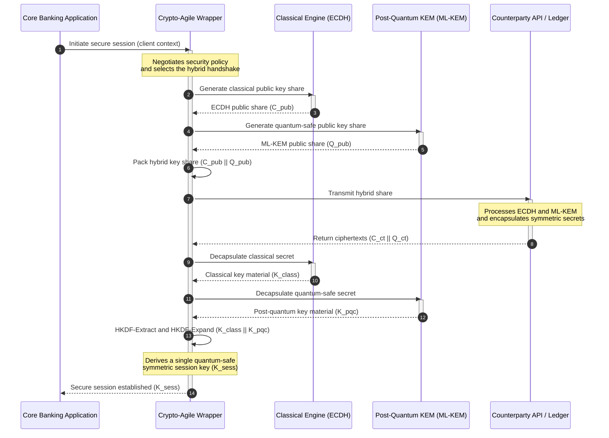

# KyberLib والترحيل ما بعد الكمي للبنوك في 2026: من المعايير إلى الرمز

<!-- lead-start: manual -->
<aside class="post-lead" aria-label="ملخص المقال">

<strong>الخلاصة.</strong> تواجه البنية التحتية المصرفية في 2026 تهديدًا نظاميًّا بنقطة نهاية معلومة: ستكسر الحوسبة ذات النطاق الكمي تبادلَ مفاتيح RSA وECC الذي يحمي حركة النقل اليوم. وقد رفعت المعايير الفيدرالية وأوراق السياسات الإشرافية مستوى الوعي؛ غير أن التنفيذ التقني ما يزال مجزَّأً. <a href="https://github.com/sebastienrousseau/kyberlib">KyberLib</a> مخطط هندسي مفتوح المصدر ينقل السردية ما بعد الكمية إلى رمز Rust ملموس وآمن الذاكرة — ينفّذ ML-KEM المعتمد من NIST‏ (FIPS 203) خلف حدود تجريد مرنة تشفيريًّا، حتى تتمكن المؤسسات من ترقية أمن النقل وتغليف المفاتيح قبل أن تبلغ هجمات «اجمع الآن وفك التشفير لاحقًا» أرشيفاتها.

<strong>أبرز النقاط</strong>

<ul class="post-lead-takeaways">
  <li><strong>من السياسة إلى رمز قابل للفحص.</strong> تنقل KyberLib التشفير ما بعد الكمي من خرائط طريق استراتيجية مجرّدة إلى تنفيذات Rust ملموسة عالية الأداء وقابلة للتدقيق.</li>
  <li><strong>تنفيذ موحَّد لـ ML-KEM وفق FIPS 203.</strong> تنفّذ المكتبة ML-KEM — خوارزمية إنشاء المفاتيح المعتمدة نهائيًّا ضمن NIST FIPS 203 — بما يُبقي المطابقة متوائمة مع التوقعات التنظيمية العالمية.</li>
  <li><strong>مرونة تشفيرية بحكم التصميم.</strong> حدود تجريد مستقرّة تتيح للتطبيقات المصرفية تبديل البدائيات التشفيرية من دون عمليات إعادة كتابة مكلفة وعرضة للخطأ.</li>
  <li><strong>سلامة ذاكرة بقوة Rust.</strong> قواعد الملكية وقت الترجمة تستأصل تجاوزات المخازن المؤقتة وتسريبات الذاكرة التي تبتلي المكتبات التشفيرية الموروثة المبنية على C، وبسرعة التجريدات بلا كلفة.</li>
  <li><strong>تخفيف المسؤولية الائتمانية.</strong> أدلة ترحيل قابلة للرصد والاختبار تمنح أعضاء مجلس الإدارة سجل «الخطوات المعقولة» الذي تطلبه تدقيقات المساءلة الشخصية بموجب المادة 5 من DORA.</li>
</ul>

<strong>قراءات ذات صلة:</strong> <a href="/2026-05-18-quantum-cryptography-standards-developments-2026/">معايير التشفير الكمي 2026</a> · <a href="/2026-05-28-dora-ai-act-data-sovereignty-banking-compliance-stack-2026/">حزمة امتثال DORA وقانون الذكاء الاصطناعي</a> · <a href="/2026-05-20-cloud-native-banking-financial-institutions-2026/">الصيرفة السحابية الأصل</a>

</aside>
<!-- lead-end -->

لم يَعُد الترحيل ما بعد الكمي تمرينًا تخطيطيًّا. ففي 2026 صار متطلَّبًا تشغيليًّا قائمًا، والفجوة بين النية التنظيمية والتنفيذ الهندسي هي حيث يتمركز الخطر اليوم. تسدّ [KyberLib ⧉](https://github.com/sebastienrousseau/kyberlib "kyberlib") جزءًا من تلك الفجوة: مكتبة Rust آمنة الذاكرة موجَّهة للإنتاج تنفّذ ML-KEM وفق معاملات FIPS 203 النهائية وتغلّفها داخل الحدود المرنة تشفيريًّا التي تحتاج إليها فعلًا منظومة المعاملات في المصرف.

---

> **الموجز التنفيذي / أبرز النقاط**
>
> - **التهديد تشغيلي بالفعل.** ينفّذ الخصوم حصاد «اجمع الآن وفك التشفير لاحقًا» اليوم؛ وتسقط سرية البيانات بأثر رجعي يوم وصول حاسوب كمي ذي صلة تشفيرية.
> - **المعايير اكتملت.** يمنح NIST FIPS 203 (ML-KEM) وFIPS 204 (ML-DSA) لجانَ التدقيق مرجعًا واضحًا قابلًا للاختبار — لم يَعُد «انتظار المعايير» دفاعًا مقبولًا.
> - **KyberLib هو المخطط الهندسي.** رمز Rust آمن الذاكرة، وترجمة `no_std` لوحدات HSM والبطاقات الذكية، وأنماط مصافحة هجينة تحفظ التشغيل البيني الكلاسيكي.
> - **المرونة التشفيرية هي الهدف الدائم.** حدود تجريد مستقرّة تتيح تغيير البدائيات من دون إعادة كتابة التطبيقات — الدرس الذي يبقى بعد أي خوارزمية بعينها.
> - **مجالس الإدارة تحمل المسؤولية.** تضع المادة 5 من DORA مسؤولية شخصية على أعضاء المجلس؛ ورمز الترحيل القابل للفحص والرصد هو الدليل الذي يفي بها.
>
---

## لماذا يهمّ هذا المشروع المفتوح المصدر في 2026

مع اقتراب التشفير غير المتماثل من نهاية صلاحيته، لا ينتظر التهديد بناء حاسوب كمي ذي صلة تشفيرية. فالخصوم ينفّذون اليوم هجمات **«اجمع الآن وفك التشفير لاحقًا» (SNDL)** — يحصدون تدفقات النقل المشفّرة لمعاملات بنوك الشركات والأسرار التجارية والاتصالات المؤسسية بنية فك تشفيرها متى نضجت القدرات الكمية. وبالنسبة إلى المصرف، فإن كل مصافحة كلاسيكية تعبر الشبكة اليوم هي خرق للسرية بموعد انفجار مؤجَّل.

وقد ردّت الجهات التنظيمية بالتزامات ملموسة:

1. **المادة 6 من DORA (إدارة مخاطر تقنية المعلومات والاتصالات)** تُلزم المؤسسات برسم خرائط الثغرات وتحديدها والتخفيف منها عبر كامل منظومتها التشفيرية — بما في ذلك تبادل المفاتيح غير المتماثل المدفون في برمجيات وسيطة لم يجردها أحد.
2. **NIST FIPS 203 و204** يُرسيان المعايير الرسمية ما بعد الكمية لتغليف المفاتيح (ML-KEM) والتوقيعات الرقمية (ML-DSA)، بما يمنح لجان التدقيق مرجعًا موحَّدًا يُقاس عليه تقدّم الترحيل.

تنفيذ هذا الترحيل من دون تعطيل العمليات الحية يتطلّب تجاوز أوراق السياسات نحو **بنية تحتية تشفيرية مفتوحة المصدر قابلة للفحص**. تقدّم [KyberLib ⧉](https://github.com/sebastienrousseau/kyberlib "kyberlib") ذلك بالضبط: مكتبة Rust آمنة الذاكرة مطابقة لـ FIPS 203 تحوِّل الانتقال ما بعد الكمي إلى خط هندسي قابل للقياس والتحقق — وتنقل حوار الاستثمار التقني نحو عائد ملموس على المرونة.

## عدسة المعمارية

تقع KyberLib خلف حدود واجهات برمجة مستقرّة، فتعزل تطبيقات المعاملات الجوهرية في المصرف عن التغيّرات في البدائيات التشفيرية منخفضة المستوى.

| الطبقة | قرار التصميم | لماذا يهمّ | الخطر عند سوء المعالجة |
|---|---|---|---|
| **البدائية** | تغليف مفاتيح ML-KEM وفق FIPS 203 | يستبدل ببنى قائمة على الشبيكات تبادلَ المفاتيح الكلاسيكي عبر Diffie-Hellman وRSA | عدم المطابقة مع معاملات FIPS 203 النهائية، بما يفضي إلى إخفاق تدقيقات الامتثال |
| **اللغة** | تنفيذ Rust آمن الذاكرة | يستأصل ثغرات إفساد الذاكرة (تجاوزات المخازن المؤقتة، الاستخدام بعد التحرير) المتوطّنة في C/C++ | تمدُّد التبعيات بما يقوّض سلامة سلسلة البناء |
| **التجريد** | حدود مستقرّة مرنة تشفيريًّا | تبدّل التطبيقات الخوارزميات خلف واجهة موحَّدة مع تطوّر المعايير | بدائيات مثبَّتة في الرمز تفرض إعادة كتابة يدوية في كل ترحيل مقبل |
| **النشر** | مصافحات تشفير هجينة | يجمع آليات KEM ما بعد الكمية مع الخوارزميات الكلاسيكية في غلاف مزدوج التغليف | فقدان التشغيل البيني الموروث أو انجراف صامت في الضبط |
| **الضمان** | إسناد SLSA Level 3 واختبارات قابلة للفحص | يضمن مصدر الرمز وإسناده؛ ويمكن تدقيق الأمثلة سطرًا سطرًا | مسرح أمني — مكتبات صندوق أسود تظهر أخطاء تنفيذها في الإنتاج |

## إشارات تشغيلية يجب تتبُّعها

إثبات الامتثال ما بعد الكمي أمام مجالس الإشراف والجهات التنظيمية يعني تتبُّع مقاييس محدّدة قابلة للقياس الكمي:

| الإشارة | المقياس | المرجع التنظيمي | التنفيذ على المنصة |
|---|---|---|---|
| **مطابقة ML-KEM وفق FIPS 203** | امتثال بنسبة 100% للمعاملات النهائية (ML-KEM-512/768/1024) | NIST FIPS 203 | تشفير شبيكي متحقَّق المعاملات مُترجَم داخل وحدات KyberLib |
| **الجرد التشفيري** | جرد كامل لاستخدام تبادل المفاتيح غير المتماثل عبر جميع الأنظمة | NIST SP 1800-38 | وكلاء فحص آليون يسجّلون حزم التشفير النشطة في سجل مركزي |
| **تبادل المفاتيح الهجين** | نسبة مصافحات طبقة النقل المنفَّذة داخل غلاف هجين | المادة 6 من DORA | وسطاء شبكة يغلّفون مصافحات TLS 1.3 الكلاسيكية بتغليف ما بعد كمي |
| **ترجمة `no_std`** | القدرة على الترجمة من دون مكتبة Rust القياسية للأهداف المقيَّدة | المادة 30 من DORA | ترجمة `no_std` شرطية في KyberLib لوحدات أمن العتاد (HSM) |
| **مؤشر المرونة التشفيرية** | الزمن بالدقائق لتبديل بدائية تشفيرية عبر بوابة واجهات البرمجة | SS1/23 الصادر عن PRA البريطانية | سجلات توجيه مجرَّدة تدير توزيع الخوارزميات عبر متغيرات وقت التشغيل |

## لماذا تهمّ Rust للتشفير ما بعد الكمي

يتطلّب تنفيذ خوارزميات ما بعد كمية مثل ML-KEM عمليات رياضية معقّدة منخفضة المستوى على حلقات كثيرات الحدود. وتاريخيًّا، كان تشغيل تلك العمليات بسرعة الإنتاج يعني C/C++ أو لغة التجميع المكتوبتين يدويًّا — سطح هجوم واسع لإفساد الذاكرة، وفي الرمز الذي لا يحتمل المصرف الخطأ فيه على وجه التحديد.

تغيّر Rust الوضع الأمني للهندسة التشفيرية بثلاث طرق ملموسة:

1. **سلامة الذاكرة وقت الترجمة.** يضمن نموذج الملكية في Rust منع تجاوزات المخازن المؤقتة والتحرير المزدوج وأخطاء الاستخدام بعد التحرير وقت الترجمة. ويكتسب ذلك أهمية حادة لمكتبات ما بعد الكم، حيث أحجام المفاتيح والنصوص المشفّرة أكبر بكثير من نظيراتها الكلاسيكية.
2. **تجريدات حتمية بلا كلفة.** تُترجَم Rust إلى رمز آلة أصلي من دون جامع نفايات، فتضاهي سرعة التنفيذ وبصمة الذاكرة المكتباتِ المبنية على C أو تتجاوزانها مع الحفاظ على السلامة.
3. **توافق `no_std`.** تُترجَم KyberLib من دون مكتبة Rust القياسية، فتعمل في البيئات المقيَّدة على المعدن المجرّد — بما فيها وحدات أمن العتاد والبطاقات الذكية — بما يُبقي التشفير بالدرجة المصرفية داخل حدود الأمن المادي.

## تصميم معمارية مرنة تشفيريًّا

نمط الإخفاق الكلاسيكي في الترحيلات التشفيرية هو التثبيت في الرمز: افتراضات خاصة بخوارزمية بعينها مضمَّنة مباشرة في منطق التطبيق، يُعاد اكتشافها بألم عند كل انتقال. الهدف الدائم لعام 2026 هو **المرونة التشفيرية** — طبقة تجريد تعامل الخوارزميات بوصفها وحدات قابلة للتبديل خلف واجهة مستقرّة، بحيث يصبح الترحيل المقبل تغييرًا في الضبط لا إعادة كتابة على مستوى المنظومة بأكملها.

يُبيّن التسلسل أدناه كيف ينسّق غلاف KyberLib المرن تشفيريًّا مصافحة تبادل مفاتيح هجينة (كلاسيكية وما بعد كمية معًا):

الغلاف الهجين هو التفصيل المهم تشغيليًّا. فإلى أن تراكم البدائيات ما بعد الكمية سنوات من التمحيص الإنتاجي، يُشتق مفتاح الجلسة من السرّين الكلاسيكي وما بعد الكمي معًا: على المهاجم كسر ECDH **و**ML-KEM لاستعادة القناة. الأطراف المقابلة التي لم تهاجر بعدُ تواصل العمل؛ والتي هاجرت تكسب حماية قائمة على الشبيكات فورًا.

## دليل مجلس الإدارة العملي

الأمن ما بعد الكمي ليس شأن تشفير في المكاتب الخلفية؛ بل قضية حوكمة في مجلس الإدارة برهانات شخصية. وينبغي لكبار المديرين تأطير الترحيل من خلال المسؤولية الائتمانية:

- **المادة 5 من DORA (الحوكمة والتنظيم)** تضع المسؤولية الشخصية عن أمن تقنية المعلومات والاتصالات على عاتق مجلس الإدارة. الاختبارات المفتوحة المصدر القابلة للرصد هي الدليل المباشر الذي يطلبه تدقيق المسؤولية الشخصية — «اخترنا تنفيذًا قابلًا للفحص لـ FIPS 203 وهذه نتائج اختبارات مطابقته» إجابة يمكن الدفاع عنها؛ أما «طمأننا المورِّد» فليست كذلك.
- **إدارة مخاطر النماذج (SR 11-7 للاحتياطي الفيدرالي الأميركي / SS1/23 لهيئة PRA البريطانية)** تنطبق على معماريات الأغلفة التشفيرية بقدر انطباقها على نماذج التسعير. وينبغي أن تمرّ طبقات التجريد عبر تحقّق إدارة مخاطر النماذج، بما يشمل الأداء في سيناريوهات الاضطراب القصوى.
- **رأس مال مخاطر التشغيل وفق Basel III** يكافئ نضج الضوابط المُثبَت. فالمصافحات الهجينة المختبَرة تخفض ملف مخاطر التشغيل طويل الأجل للمؤسسة، بما يقلّص علاوة رأس المال ويحرّر طاقة في الميزانية العمومية لنشر الخزانة النشط.

## ماذا يعني هذا حسب نوع البنك

### البنوك ذات الأهمية النظامية العالمية (G-SIB)

تدير بنوك G-SIB منظومات معاملات مثقلة بالأنظمة الموروثة، لذا فإن قيدها الملزم هو الاكتشاف: معرفة المواضع الفعلية لتبادل المفاتيح غير المتماثل. تأتي عمليات الجرد التشفيري المستمرة وفق إرشادات NIST SP 1800-38 أولًا؛ ثم توفّر KyberLib المكتبة الموحَّدة الآمنة الذاكرة لتنفيذ تغليف المفاتيح ما بعد الكمي عبر كل عقدة حديثة يكشفها الجرد.

### بنوك المعاملات وبنوك الشركات

السرية عبر قضبان المدفوعات هي صلب الامتياز التجاري. ولأن KyberLib تُترجَم إلى أهداف `no_std` على المعدن المجرّد، تستطيع بنوك المعاملات نشر مصافحات ما بعد كمية مباشرة داخل عتاد توجيه المدفوعات وإدارة السيولة عند الحافة — لا في طبقة التطبيقات فحسب.

### البنوك الإقليمية والأصغر حجمًا

تواجه المؤسسات الإقليمية الحصاد ذاته المدعوم من دول من دون ميزانيات أبحاث بنوك G-SIB. يمنحها تنفيذ Rust مفتوح المصدر وقابل للفحص مسارًا جاهزًا إلى مطابقة NIST FIPS 203 فورًا، من دون التفاوض على خرائط طريق مورِّدين معتمة.

## من خرائط الطريق إلى رمز قابل للترجمة

الانتقال ما بعد الكمي مهمة هندسية قائمة، والمؤسسات التي تحفظ ثقة المشرفين والأطراف المقابلة وأمناء خزائن الشركات عبر 2026 هي التي تنتقل من خرائط الطريق المجرّدة إلى رمز قابل للرصد والترجمة. ويترتّب التفويض التنفيذي مباشرة: دقّقوا نقاط تبادل المفاتيح الموروثة، وانشروا المصافحات الهجينة على القنوات الأعلى قيمة، وابنوا حدود التجريد المستقرّة التي تجعل كل تبديل بدائية مقبل إجراءً روتينيًّا. تجعل KyberLib كل خطوة من هذه الخطوات قدرة تشغيلية قابلة للقياس لا التزامًا على شرائح العروض.

## الأسئلة الشائعة

**هل تمتثل KyberLib لمعايير NIST النهائية؟**

نعم. صُمِّمت KyberLib حول معاملات ML-KEM كما اعتُمدت نهائيًّا في FIPS 203، بما يُبقي المكتبة المُترجَمة متوائمة مع التوقعات التنظيمية الفيدرالية والعالمية.

**هل تتطلّب مكتبة ما بعد كمية عتادًا متخصصًا؟**

لا. يُترجَم تنفيذ Rust في KyberLib إلى معماريات الأنظمة القياسية. وتتيح قدرته على `no_std` إضافة إلى ذلك تشغيله على وحدات أمن العتاد المتخصصة والبطاقات الذكية حيث تلزم الحيازة المادية للمفاتيح.

**كيف يؤثر «اجمع الآن وفك التشفير لاحقًا» في الامتثال الحالي؟**

إذا اعتمدت طبقة النقل على RSA أو ECC الكلاسيكيتين، يستطيع الخصوم حصاد الحركة اليوم وفك تشفيرها متى نضجت القدرة الكمية. أما تبادل المفاتيح الهجين المنشور الآن فيُبقي البيانات الملتقَطة خلف حماية قائمة على الشبيكات.

**لماذا المصافحات الهجينة بدل الانتقال مباشرة إلى البدائيات ما بعد الكمية؟**

تشتق الأغلفة الهجينة مفتاح الجلسة من سرّ كلاسيكي وسرّ ما بعد كمي معًا، فيصمد الأمن ما لم يُكسَرا كلاهما. ويحفظ ذلك التشغيل البيني مع الأطراف المقابلة غير المهاجرة ريثما تراكم البدائيات الجديدة التمحيص الإنتاجي.

## المراجع

- National Institute of Standards and Technology, (2024). [FIPS 203: معيار آلية تغليف المفاتيح القائمة على الشبيكات المعيارية ⧉](https://www.nist.gov/news-events/news/2024/08/nist-releases-first-3-finalized-post-quantum-encryption-standards "إعلان NIST عن FIPS 203").
- Board of Governors of the Federal Reserve System, (2011). [الإرشادات الإشرافية لإدارة مخاطر النماذج (SR Letter 11-7) ⧉](https://web.archive.org/web/20260414150921/https://www.federalreserve.gov/supervisionreg/srletters/sr1107.htm "SR 11-7 الصادر عن الاحتياطي الفيدرالي").
- European Parliament and Council of the European Union, (2022). [اللائحة (EU) 2022/2554 بشأن المرونة التشغيلية الرقمية للقطاع المالي (DORA) ⧉](https://eur-lex.europa.eu/legal-content/EN/TXT/?uri=CELEX%3A32022R2554 "لائحة DORA").
- NIST National Cybersecurity Center of Excellence, (2025). [الترحيل إلى التشفير ما بعد الكمي (NIST SP 1800-38) ⧉](https://www.nccoe.nist.gov/projects/migration-post-quantum-cryptography "NIST SP 1800-38").
- GitHub, (2026). [مستودع kyberlib مفتوح المصدر ⧉](https://github.com/sebastienrousseau/kyberlib "مستودع kyberlib").

<!-- enrich-start -->
<aside class="author-card" aria-label="نبذة عن الكاتب"><strong class="author-card-name"><a href="/about/index.html">سيباستيان روسو</a></strong>تقني مصرفي أول يكتب عن الذكاء الاصطناعي التطبيقي، والبنية التحتية للمدفوعات، والنقد المُرمَّز، وISO 20022، والأمن ما بعد الكمومي، والخدمات المالية السحابية الأصل، والأسواق الرقمية المُنظَّمة.أكثر من 20 عاماً من الخبرة لدى HSBC للخدمات المصرفية التجارية والاستثمارية، وPayPal، وBarclays، وShazam، وAKQA، ومجموعة Virgin. <a href="/about/index.html">الملف الكامل</a> &middot; <a href="https://www.linkedin.com/in/sebastienrousseau/" rel="external noopener">LinkedIn</a> &middot; <a href="https://github.com/sebastienrousseau" rel="external noopener">GitHub</a></aside>

آخر مراجعة <time datetime="2026-06-12">2026-06-12</time>.

<!-- enrich-end -->
