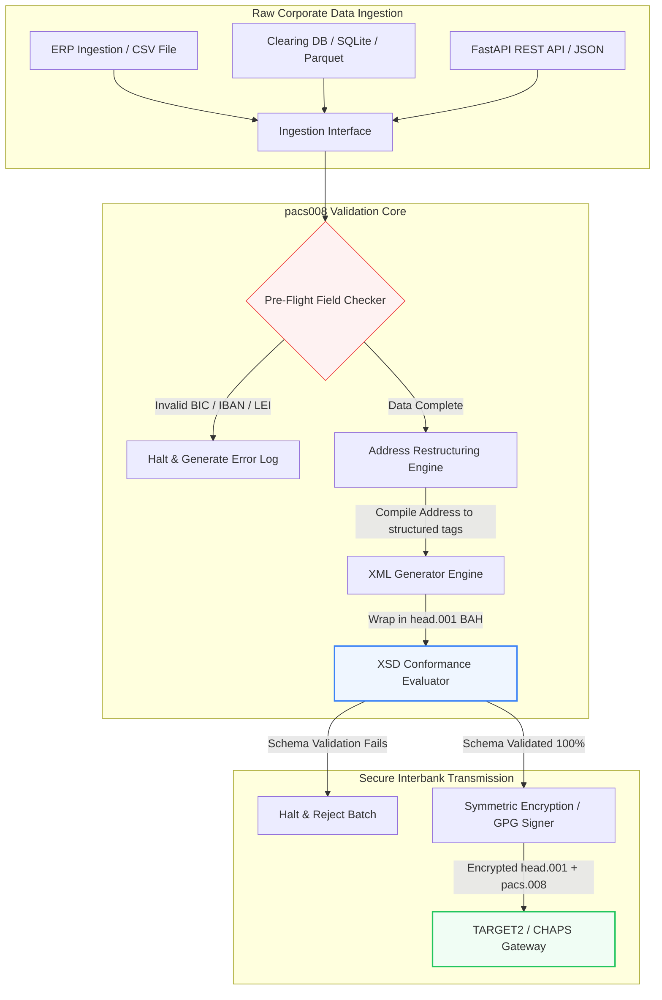

---

# Front Matter (YAML)

author: "contact@sebastienrousseau.com (Sebastien Rousseau)"
banner_alt: "موظف مكتبي مع مساعد صوتي وحاسوب محمول — رمز لرسائل المدفوعات بين البنوك المهيكلة والقابلة للقراءة آلياً التي تجعلها أتمتة pacs.008 قابلة للبرمجة"
banner_height: "1597"
banner_width: "2584"
banner: "https://cloudcdn.pro/stocks/images/tyler-prahm-lmV3gJSAgbo.webp"
cdn: "https://cloudcdn.pro"
charset: "UTF-8"
cname: "sebastienrousseau.com"
copyright: "© Copyright 2025 - 2026 - Sebastien Rousseau. All rights reserved."
date: "June 15, 2026"
description: "pacs008 مكتبة Python مفتوحة المصدر تُؤتمت توليد رسائل التحويل الائتماني للعميل FI-to-FI وفق ISO 20022 pacs.008 والتحقق منها — عناوين مهيكلة، وتغليف BAH head.001، ومجاميع تحقق BIC/LEI/IBAN، وتتبع UETR عبر OpenTelemetry — مبنية لسقف SWIFT في نوفمبر 2026."
format-detection: "telephone=no"
hreflang: "ar"
icon: "https://cloudcdn.pro/clients/sebastienrousseau/v1/logos/sebastienrousseau.svg"
id: "https://sebastienrousseau.com/2026-06-15-pacs008-automation-iso-20022-interbank-payments-2026"
image_alt: "Black and White Portrait of Sebastien Rousseau"
image_height: "162"
image_width: "162"
image: "https://cloudcdn.pro/stocks/images/sebastienrousseau.webp"
keywords: "pacs008, ISO 20022 pacs.008, التحويل الائتماني للعميل FI to FI, العنوان المهيكل, SWIFT CBPR+, BAH head.001, TARGET2, CHAPS, Fedwire, DORA, BCBS 239, Basel III, UETR, التحقق من LEI, SEPA VoP"
language: "ar"
last_reviewed: "2026-06-15"
layout: "report"
locale: "ar_SA"
logo_alt: "Logo for Sebastien Rousseau"
logo_height: "44"
logo_width: "44"
logo: "https://cloudcdn.pro/clients/sebastienrousseau/v1/logos/sebastienrousseau.svg"
menu: ""
measurementID: "G-169G4ET5HQ"
name: "Sebastien Rousseau"
permalink: "https://sebastienrousseau.com/2026-06-15-pacs008-automation-iso-20022-interbank-payments-2026"
rating: "general"
referrer: "no-referrer"
robots: "index, follow"
schema: "FAQPage, Article"
seo_title: "أتمتة pacs.008 لحقبة ISO 20022"
short_name: "sebastienrousseau"
subtitle: "رسالة pacs.008 هي حيث تلتقي بيانات المدفوعات بين البنوك، والعناوين المهيكلة، والامتثال، والتوجيه، وعمليات التسوية."
tags: "pacs008, ISO 20022, المدفوعات بين البنوك, مدفوعات الجملة, Python"
theme-color: "0, 83, 191"
title: "بناء أتمتة pacs.008 لحقبة ISO 20022 بين البنوك في 2026"
url: "https://sebastienrousseau.com/2026-06-15-pacs008-automation-iso-20022-interbank-payments-2026"
viewport: "width=device-width, initial-scale=1, shrink-to-fit=no"

# RSS - The RSS feed front matter (YAML).
atom_link: "https://sebastienrousseau.com/2026-06-15-pacs008-automation-iso-20022-interbank-payments-2026/rss.xml"
category: "Finance"
docs: https://validator.w3.org/feed/docs/rss2.html
generator: "Static Site Generator (SSG) (version 0.0.26)"
item_description: "يوفِّر pacs008 أساساً مفتوح المصدر بلغة Python لأتمتة رسائل التحويل الائتماني للعميل FI-to-FI وفق ISO 20022 في حقبة المدفوعات بين البنوك."
item_guid: "https://sebastienrousseau.com/2026-06-15-pacs008-automation-iso-20022-interbank-payments-2026/rss.xml"
item_link: "https://sebastienrousseau.com/2026-06-15-pacs008-automation-iso-20022-interbank-payments-2026/rss.xml"
item_pub_date: "Mon, 15 Jun 2026 06:06:06 +0000"
item_title: "بناء أتمتة pacs.008 لحقبة ISO 20022 بين البنوك في 2026"
last_build_date: "Mon, 15 Jun 2026 06:06:06 +0000"
managing_editor: "contact@sebastienrousseau.com (Sebastien Rousseau)"
pub_date: "Mon, 15 Jun 2026 06:06:06 +0000"
ttl: "60"
type: "article"
webmaster: "contact@sebastienrousseau.com"

# Apple - The Apple front matter (YAML).
apple_mobile_web_app_orientations: "portrait"
apple_touch_icon_sizes: "192x192"
apple-mobile-web-app-capable: "yes"
apple-mobile-web-app-status-bar-inset: "black"
apple-mobile-web-app-status-bar-style: "black-translucent"
apple-mobile-web-app-title: "أتمتة pacs.008 لحقبة ISO 20022"
apple-touch-fullscreen: "yes"

# MS Application - The MS Application front matter (YAML).

msapplication-navbutton-color: "0, 83, 191"

# Twitter Card - The Twitter Card front matter (YAML).

twitter_card: "summary_large_image"
twitter_creator: "@wwdseb"
twitter_description: "يوفِّر pacs008 أساساً مفتوح المصدر بلغة Python لأتمتة رسائل التحويل الائتماني للعميل FI-to-FI وفق ISO 20022 في حقبة المدفوعات بين البنوك."
twitter_image: "https://cloudcdn.pro/clients/sebastienrousseau/v1/logos/sebastienrousseau.svg"
twitter_image_alt: "Logo of Sebastien Rousseau"
twitter_site: "@wwdseb"
twitter_title: "أتمتة pacs.008 لحقبة ISO 20022"
twitter_url: "https://sebastienrousseau.com/2026-06-15-pacs008-automation-iso-20022-interbank-payments-2026"

excerpt: "pacs008 مجموعة أدوات Python مفتوحة المصدر تجعل رسائل التحويل الائتماني للعميل FI-to-FI وفق ISO 20022 قابلة للبرمجة — عناوين مهيكلة، وتحقق، وتوجيه، وروابط امتثال، وسقف SWIFT في نوفمبر 2026 ضمن الإعدادات الافتراضية."

# Humans.txt - The Humans.txt front matter (YAML).
author_website: "https://sebastienrousseau.com"
author_twitter: "@wwdseb"
author_location: "London, UK"
thanks: "Thanks for reading!"
site_last_updated: "2026-06-15"
site_standards: "HTML5, CSS3, RSS, Atom, JSON, XML, YAML, Markdown, TOML"
site_components: "Kaishi, Kaishi Builder, Kaishi CLI, Kaishi Templates, Kaishi Themes"
site_software: "Static Site Generator, Rust"

---

# أتمتة المدفوعات بين البنوك pacs.008 وفق ISO 20022 بـ Python مفتوحة المصدر في 2026

<!-- lead-start -->
<aside class="post-lead" aria-label="ملخص المقال">

<strong>الخلاصة.</strong> بموجب إرشادات SWIFT CBPR+، يُلغي سقفُ العنوان المهيكل في 14 نوفمبر 2026 العناوينَ البريدية غير المهيكلة عبر TARGET2 وCHAPS وFedwire وLynx وSEPA. pacs008 مكتبة Python مفتوحة المصدر تُؤتمت توليد رسائل التحويل الائتماني للعميل FI-to-FI (pacs.008) وفق ISO 20022 والتحقق منها، وتُغلِّف المدفوعات داخل ترويسات تطبيق الأعمال (BAH head.001)، وتُرسِّخ امتثال العنوان المهيكل داخل مسار البيانات قبل أن تلامس الرسالة شبكة المقاصة.

<strong>أبرز النقاط</strong>

<ul class="post-lead-takeaways">
  <li><strong>سقف العنوان المهيكل قاطع.</strong> بعد 14 نوفمبر 2026، تُسحَب كتل العنوان غير المهيكل من الخدمة. يفرض pacs008 عناصر العنوان البريدي المهيكل (<code>&lt;TwnNm&gt;</code>، <code>&lt;Ctry&gt;</code>، <code>&lt;PstCd&gt;</code>) عند تجميع البيانات لمنع حالات الرفض على الحدود.</li>
  <li><strong>تنسيق موحَّد للرسائل.</strong> تُغلِّف حمولة دفع pacs.008 الأساسية داخل مغلَّف ترويسة تطبيق الأعمال المتوافق (head.001)، وتُوفِّر نموذجاً قياسياً للمعالجة ذهاباً وإياباً.</li>
  <li><strong>سلامة خوارزمية.</strong> أدوات تحقق مدمجة لرموز BIC ولمعرِّفات الكيان القانوني (LEI) عبر حسابات مجموع التحقق ISO 7064 Modulo 97-10.</li>
  <li><strong>قابلية تتبع بمستوى DORA.</strong> قياس كامل عبر OpenTelemetry مُفهرَس على المرجع الفريد للمعاملة طرفاً إلى طرف (UETR) لسجلات تدقيق آنية وتوقيعات تدقيق مُعمَّاة.</li>
  <li><strong>صون المسؤولية الائتمانية على مستوى مجلس الإدارة.</strong> يربط دقة الرسائل بين البنوك بالمادة 5 من DORA، وتقارير BCBS 239، وتوفيرات رأس المال للمخاطر التشغيلية وفق Basel III.</li>
</ul>

<strong>قراءات ذات صلة:</strong> <a href="https://sebastienrousseau.com/2026-05-19-global-wholesale-payments-economics-2026">مدفوعات الجملة العالمية في 2026: ISO 20022، وتجديد RTGS، واقتصاديات التشغيل البيني</a>، <a href="https://sebastienrousseau.com/2026-05-27-ai-operating-system-payments-fraud-routing-resilience-compliance-2026">الذكاء الاصطناعي كنظام تشغيل للمدفوعات: الاحتيال، والتوجيه، والمرونة، والامتثال في 2026</a>، <a href="https://sebastienrousseau.com/2026-05-12-iso-20022-pacs008-structured-address-deadline">سقف العنوان المهيكل لـ pacs.008 في نوفمبر 2026: نظرة بستة أشهر</a>.

</aside>
<!-- lead-end -->

ردمُ الهوة بين البيانات المالية القديمة والرسائل المهيكلة بين البنوك عبر مسار Python قابل للتدقيق ومتحقَّق منه وفق المخطط.

المرجع المفتوح المصدر لهذا المقال هو [pacs008 ⧉](https://github.com/sebastienrousseau/pacs008 "pacs008 — مكتبة Python مفتوحة المصدر"). وُضِع المستودع باعتباره مكتبة Python لأتمتة رسائل XML للتحويل الائتماني للعميل FI-to-FI وفق ISO 20022 pacs.008.

## لماذا يهم هذا المشروع المفتوح المصدر في 2026

تخوض البنية التحتية العالمية لمقاصة المدفوعات بين البنوك أعمق عملية تحديث منذ قرابة نصف قرن.

في يونيو 2026، يقترب قطاع الخدمات المالية بسرعة من **سقف العنوان المهيكل لـ SWIFT في 14 نوفمبر 2026**. اعتباراً من هذا التاريخ، ستُلغي إرشادات SWIFT CBPR+، إلى جانب TARGET2 وCHAPS وFedwire وLynx الكندية، رسمياً أسطر العنوان البريدي غير المهيكل (المستخدِمة `<AdrLine>` فقط داخل كتل `<PstlAdr>`). يجب على جميع المؤسسات المالية المشاركة إرسال العناوين إما بصيغة هجينة (`<TwnNm>` و`<Ctry>` مهيكلين، مع عنصرَي `<AdrLine>` كحدٍّ أقصى للتفاصيل المتبقية) أو بصيغة مهيكلة بالكامل (عناصر مستقلة لاسم الشارع، ورقم المبنى، والرمز البريدي). وأي رسالة لا تستوفي هذا المعيار ستُرفَض على حدود الشبكة.

بالنسبة إلى المؤسسات المالية، يُنشئ هذا التحوُّل قيوداً تشغيلية كبرى:

1. **عقوبة الرفض الحدودي.** ستواجه المدفوعات التي لا تستوفي معيار العنوان المهيكل حالات رفض فورية من الشبكة، ما يُفضي إلى تأخيرات في المعاملات، وانسدادات في السيولة، وتراكمات تشغيلية.
2. **التحقق من المستفيد في SEPA (VoP).** يُلزم جميع مزوِّدي خدمات الدفع (PSPs) داخل منطقة SEPA بالتحقق من تطابق اسم المستفيد مع IBAN قبل تنفيذ التحويلات الائتمانية، ما يُضيف بوابة تحقق إضافية على بدء الرسائل.

[pacs008](https://github.com/sebastienrousseau/pacs008) يُعالج هذه المشكلة. إنه مكتبة Python خفيفة الوزن ومفتوحة المصدر تُؤتمت تحويل البيانات المالية الخام إلى رسائل تحويل ائتماني للعميل بين البنوك وفق ISO 20022 pacs.008، متحقَّق منها بالكامل ومتوافقة مع المخطط. عبر ردم الهوة بين البيانات القديمة والمهيكلة، يُحقِّق pacs008 عائداً مرتفعاً على المرونة (RoR)، فيصون رأس المال العامل ويُؤمِّن التنفيذ الآني عبر الشبكات العالمية.

## لماذا بنيتُ pacs008 على هذا النحو

أنا من كتب `pacs008`، ومن كتب شقيقتها الأعلى في السلسلة `pain001`، وأقضي حياتي
المهنية في المدفوعات بالجملة وإدارة منتجات واجهات البرمجة. هذا المزيج هو سبب الشكل
الذي انتهت إليه المكتبة، ولذلك يستحق الأمر أن تُذكر هذه الاختيارات صراحةً بدل أن
تبقى مضمرة داخل الشيفرة.

**التحقق يعمل قبل التوليد، لا بعده.** الغريزة السائدة في معظم أصول المدفوعات هي
توليد الرسالة أولًا ثم فحصها، لأن دورة المراجعة صيغت هكذا: يُنتَج ملف، ينظر فيه
أحدهم، وتذهب الاستثناءات إلى طابور. هذا الترتيب يضمن اكتشاف العيوب عند النقطة
الأقل نفعًا: بعد أن يكون عمل تركيب الرسالة قد انتهى، وغالبًا بعد أن تكون قد غادرت
المؤسسة. التحقق أولًا يعني أن عنوانًا غير مطابق أو IBAN مشوّهًا يصير فشلًا في
البناء بدل أن يصير رفضًا من الشبكة.

**الرخصة MIT لأن على المصارف أن تقرأ منطق التحقق، لا أن تثق به.** المدقق المغلق
يطلب من المؤسسة أن تقبل قراءة شخص آخر لإرشادات الاستخدام على سبيل الثقة. وهذا طلب
غير معقول من فريق يحمل التزامًا تنظيميًا. كل قاعدة في هذه المكتبة قابلة للفحص
والاعتراض والاشتقاق.

**التحقق يجري في مقابل مخططات XSD الرسمية بدل إعادة تنفيذها.** أي تقريب مكتوب
يدويًا لقواعد ISO 20022 ينحرف عن العقد الفعلي للشبكة لحظة تغيّر أي من الطرفين.
المخطط هو العقد؛ وكل ما عداه مصدر ثانٍ للحقيقة ينتظر أن يتناقض معه.

**إنها تستهدف التكامل المستمر لا خطوة مراجعة.** المدقق الذي يجب أن يتذكر إنسانٌ
تشغيله هو المدقق الذي يتوقف عن العمل تحت ضغط المواعيد، أي في اللحظة التي يكون
فيها الأهم على الإطلاق.

وما تمتنع المكتبة عن فعله متعمَّد بالقدر نفسه. إنها عُدّة على مستوى الرسالة. لا
تحل محل محرك مدفوعات، ولا نظام فحص عقوبات، ولا عملية تصحيح بيانات العملاء
المرجعية التي على المؤسسة أن تنجزها عند المنبع. إنها تجعل ذلك التصحيح قابلًا
للإنفاذ، لا أن تقوم به نيابةً عنك.

## عدسة معمارية pacs008 لعام 2026

بُنيت مكتبة pacs008 بوصفها محرك تحقق وتوليد معزولاً، يضمن أن تُحلَّل المدخلات الخام منهجياً، وتُثرى، وتُغلَّف داخل مغلَّفات قياسية:

| الطبقة | قرار التصميم | لماذا يهم | الخطر عند سوء المعالجة |
|---|---|---|---|
| **طبقة المدخلات** | استيعاب CSV وJSON وSQLite وParquet | يلتقي بفرق التكامل المصرفي حيث توجد بياناتها بالفعل، ويمنع هجرات المنصات. | استيعاب حمولات بيانات خام أو غير متحقَّق منها أو معطوبة. |
| **طبقة التحقق** | تحقق مسبق التحليق مقابل مخططات XSD الرسمية وقواعد عمل مخصصة | يُوقف التنفيذ ويُعلِم بالأخطاء قبل أن يُرسَل ملف الدفع إلى شبكة المقاصة. | ملفات XML غير صالحة تُحدث حالات رفض شبكية فورية وتأخيرات في المقاصة. |
| **طبقة مغلَّف BAH** | تغليف تلقائي عبر ترويسة تطبيق الأعمال (head.001) | يُنمِّط إرسال الرسائل وتوجيهها استناداً إلى وسم `<MsgDefIdr>`. | إرسال حمولات pacs.008 الخام دون المغلَّف الخارجي المطلوب، ما يُسبِّب رفض النظام. |
| **طبقة التسلسل** | دعم XML قياسي وJSON متوافق مع ISO (TS 23029) | يُتيح ترجمة مباشرة بين حمولات XML وJSON، ويدعم واجهات REST API الحديثة وبث Kafka. | تمثيلات بيانات مجزَّأة تخرق الإرشادات الرسمية لـ ISO. |
| **طبقة المراقبة** | تتبع OpenTelemetry مُفهرَس على UETR | يلتقط مسارات التنفيذ وسجلاته التفصيلية، ويُوفِّر قابلية تدقيق آنية. | فجوات تتبع تحجب الرؤية التشغيلية والتدقيق. |

## إشارات وموجَّهات تنظيمية رئيسية بين البنوك

لإثبات المرونة التشغيلية للمعاملات، يجب على كبار مسؤولي التكنولوجيا والمخاطر تتبُّع مؤشرات امتثال محددة وقابلة للقياس:

| الإشارة | المقياس / المعيار التشغيلي | المرجع G20 / SWIFT / DORA | التطبيق على المنصة التقنية |
|---|---|---|---|
| **امتثال العنوان المهيكل** | نسبة رسائل pacs.008 التي تستخدم حقول `<PstlAdr>` مهيكلة بالكامل مع `<TwnNm>` و`<Ctry>` المحدَّدَين. | سقف SWIFT SR 2026 | فحوصات مخطط مسبقة التحليق في pacs008 ترفض أسطر العنوان غير المهيكل. |
| **التحقق من المستفيد في SEPA** | تحقق تطابق بين اسم المستفيد وIBAN قبل تنفيذ الرسالة. | لائحة SEPA VoP | فئات مساعدة VoP مدمجة تُنفِّذ استعلامات تحقق مسبق على IBAN/BIC. |
| **تكامل BAH head.001** | نسبة حمولات الدفع الصادرة التي تُغلَّف بنجاح داخل ترويسات تطبيق الأعمال. | إرشادات TARGET2 / CBPR+ | نظام فرعي لتغليف BAH يُجمِّع المغلَّف الخارجي تلقائياً. |
| **مجموع تحقق LEI Modulo** | تحقق رقم التحقق ISO 7064 Modulo 97-10 على كتل `<LEI>` للمدين والدائن. | تكليف بنك إنجلترا | مدقِّق خوارزمي يتحقق من سلامة المعرِّف ذي 20 حرفاً. |
| **دقة تتبع UETR** | حقن 100% من المدفوعات المُولَّدة بمرجع UETR صالح. | مواصفات SWIFT UETR | توليد وتتبع تلقائي لرمز مرجع UUIDv4 ذي 36 حرفاً. |

## لماذا Python هي المدخل الأمثل للأتمتة بين البنوك

تعتمد مراكز المدفوعات الحديثة وفرق عمليات الخزينة في 2026 اعتماداً كبيراً على Python في تحويل البيانات، والنمذجة المالية، وتكامل قواعد بيانات ERP.

عبر الاستفادة من مكتبة Python مفتوحة المصدر، تُحقِّق المؤسسات مزايا جوهرية:

1. **عبء إدراكي منخفض وقابلية تشغيل بيني عالية.** تعمل Python جسراً متماسكاً. تُمكِّن المطوِّرين من كتابة سكربتات بسيطة تسحب تعليمات الدفع الخام من قواعد البيانات القديمة، وتتحقق منها مقابل قواعد مصرفية دولية معقدة، وتُخرِج XML متوافقاً ضمن سير عمل واحد موحَّد.
2. **التخلص من المترجمات المعتمة "الصندوق الأسود".** غالباً ما تفرض البوابات المصرفية الاحتكارية رسوم ترخيص مرتفعة على مترجمات ملفات الدفع المخصصة. هذه المترجمات صناديق سوداء احتكارية، تجعل من المستحيل على فرق الأمن تدقيق كيفية معالجة البيانات أو أماكن تخزين المفاتيح. مكتبة مفتوحة المصدر وقابلة للفحص مثل pacs008 تضمن شفافية كاملة في الشيفرة.
3. **تكامل سلس مع CI/CD.** يتكامل pacs008 مباشرة مع مسارات التكامل والنشر المستمرَّين، ما يُمكِّن المطوِّرين من أتمتة اختبار ملفات الدفع كجزء من دورة حياة تسليم البرمجيات المعيارية لديهم.

## تصميم مسار محكوم الحدود بين البنوك

ثغرة كبرى في المقاصة بين البنوك هي "توليد الدفعات غير المحكوم" — توليد ملفات دون حلقة تحقق واضحة ومحكومة الحدود. صُمِّم pacs008 ليعمل بوصفه محرك التحقق الجوهري داخل مسار معاملات متعدد المراحل ومضبوط بصرامة.

يُظهر التدفق التشغيلي أدناه كيف تمرُّ بيانات المعاملات الخام عبر مسار pacs008 لتوليد ملف pacs.008 آمن تعمياً ومتوافق مع المخطط، مُغلَّف داخل مغلَّف BAH:

## دليل مجلس الإدارة والمسؤولية الائتمانية

أتمتة المدفوعات بين البنوك مسألة إدارة مخاطر وحوكمة على مستوى مجلس الإدارة. يجب على كبار المسؤولين معالجة جودة بيانات المعاملات من منظور المسؤولية الائتمانية وتقليل المخاطر التشغيلية:

- **DORA المادة 5 (مساءلة مجلس الإدارة).** تُضع مسؤولية مباشرة وشخصية على أعضاء مجلس الإدارة عن مرونة عمليات تكنولوجيا المعلومات والاتصالات للمؤسسة وأمنها. ولأن المقاصة بين البنوك وظيفة مؤسسية حرجة، يجب على المجالس إثبات أنها طبَّقت ضوابط معاملاتية متينة ومتحقَّقة ومؤتمتة لمنع الاختلالات التشغيلية أو تأخر المدفوعات.
- **BCBS 239 (تجميع بيانات المخاطر والإبلاغ عنها).** تُطالب بأن يكون الإبلاغ عن المعاملات المالية دقيقاً وكاملاً ويُولَّد آنياً. يُساعد pacs008 المؤسساتِ على الامتثال لـ BCBS 239 عبر ضمان أن تكون بيانات الدفع مهيكلة ومتحقَّقة بنظافة عند المصدر، فيُلغي فجوات البيانات وأخطاء التسوية اليدوية التي تُعاني منها جداول البيانات القديمة.
- **التخفيف من رسوم رأس مال المخاطر التشغيلية (Basel III).** بموجب إرشادات Basel III، ترفع معدلاتُ أخطاء الدفع المرتفعة وأعباءُ التدخل اليدوي متطلباتِ رأس مال المخاطر التشغيلية للبنك، فتُجمِّد رأس مال كان يمكن توظيفه في الإقراض أو الاستثمار. أتمتة مسار الدفع تُقلِّص هذه العلاوات الرأسمالية مباشرة، فتصون قيمة الميزانية العمومية.

## ماذا يعني هذا بحسب نوع البنك

### البنوك ذات الأهمية النظامية العالمية (G-SIBs)

تُدير G-SIBs أحجاماً ضخمة من المعاملات المؤسسية العابرة للحدود. تحديها الرئيسي هو معالجة البيانات القديمة غير المهيكلة قبل وصولها إلى شبكة المقاصة. عبر دمج pacs008 في بواباتها المصرفية المؤسسية، يمكن لـ G-SIBs توفير أدوات تحقق مؤتمتة لعملائها المؤسسيين، فتُقلِّص عبء الإصلاحات اليدوية للمدفوعات وتُؤمِّن التنفيذ الآني عبر شبكة SWIFT.

### بنوك المعاملات والبنوك المؤسسية

بالنسبة إلى بنوك المعاملات، تُمثِّل جودة بيانات الدفع متغيِّراً تنافسياً. عبر تقديم أداة تحقق مفتوحة المصدر وقابلة للفحص مثل pacs008 لعملاء الخزانة المؤسسية، يمكن لهذه البنوك تسريع الإلحاق، وتقليل حالات رفض ملفات الدفع، وبناء ثقة العملاء عبر معدلات معالجة فورية كاملة متفوقة.

### البنوك الإقليمية والأصغر حجماً

يجب على البنوك الإقليمية الحفاظ على الامتثال لمعايير الدفع الدولية دون ميزانيات تكنولوجيا ضخمة كتلك المتاحة لـ G-SIBs. يُوفِّر pacs008 حلاً خفيف الوزن، وفعَّالاً من حيث التكلفة، ومتوافقاً بالكامل قائماً على Python، يُمكِّن المؤسسات الأصغر من تقديم قدرات بدء دفع حديثة ومهيكلة دون تراخيص باهظة لبرمجيات وسيطة احتكارية.

## الخلاصة: خارطة طريق المقاصة بين البنوك

يُمثِّل سقف SWIFT للعنوان المهيكل في نوفمبر 2026 حداً قاطعاً لعمليات الخزانة المؤسسية. الاعتماد على جداول البيانات القديمة، والإدخال اليدوي، وملفات الدفع غير المهيكلة، خطرٌ تجاريٌّ قائم.

لتأمين استمرارية المعاملات وتقليل الأعباء التشغيلية، ينبغي لكبار مسؤولي التكنولوجيا والمالية تنفيذ خارطة طريق مقاصة واضحة اليوم:

1. **فرض التحقق عند المصدر.** فرض أن تُتحقَّق جميع تعليمات الدفع وتُنسَّق وفق مخططات XSD الرسمية لـ ISO 20022 قبل مغادرة حدود ERP المؤسسية.
2. **تدقيق مسار البيانات.** الانتقال بعيداً عن المعالجة اليدوية لجداول البيانات، وتطبيق مسارات عمل مؤتمتة وقابلة للفحص قائمة على Python باستخدام pacs008.
3. **تطبيق أمن هجين.** ضمان أن تكون ملفات الدفع المُولَّدة مُوقَّعة تعمياً ومُعمَّاة قبل الإرسال، استيفاءً لتوقعات شبكة الثقة المعدومة.
4. **المواءمة مع الأولويات الائتمانية.** الإبلاغ رسمياً عن مقاييس أتمتة المدفوعات وجودة البيانات إلى المجلس، وتأطير الاستثمار باعتباره برنامج تقليل مخاطر تشغيلية حرج وفق DORA.

## الأسئلة الشائعة

**هل pacs008 متوافق مع قواعد عناوين SWIFT SR 2026 المرتقبة؟**

نعم. صُمِّم pacs008 لدعم سقف SWIFT الصارم للعنوان المهيكل في نوفمبر 2026، فيفرض الفصل الإلزامي لعناصر العنوان البريدي (المدينة، والدولة، والرمز البريدي) في حقول XML المُخصَّصة وفق ISO 20022.

**هل يستطيع pacs008 تغليف حمولات الدفع داخل ترويسات تطبيق الأعمال؟**

نعم. لأن pacs008 يدعم أصلاً تغليف ترويسة تطبيق الأعمال (BAH head.001)، فهو يُجمِّع المغلَّف الخارجي المطلوب من شبكات TARGET2 وCHAPS وCBPR+ تلقائياً.

**لماذا تُفضَّل المكتبة المفتوحة المصدر على مترجمات الملفات الاحتكارية؟**

المترجمات الاحتكارية صناديق سوداء معتمة تجعل التدقيقات الأمنية مستحيلة. مكتبة مفتوحة المصدر ومُراجَعَة من الأقران مثل pacs008 تُقدِّم شفافية كاملة في الشيفرة، فتُمكِّن فرق الأمن من التحقق من عدم كشف أي بيانات دفع حسَّاسة أثناء المعالجة.

**ما المعرِّفات التي يتحقق منها pacs008؟**

يأتي pacs008 بأدوات تحقق مدمجة لرموز تعريف البنوك (BICs) ولمعرِّفات الكيان القانوني (LEIs) عبر حسابات مجموع التحقق ISO 7064 Modulo 97-10، إضافة إلى تحقق رقم التحقق لـ IBAN وفحوصات تفرُّد UETR.

## المراجع

- SWIFT, (2024). *ISO 20022 November 2026 Structured Address Milestone*. La Hulpe: SWIFT. متاح عبر: [سقف SWIFT لـ ISO 20022 ⧉](https://www.swift.com/standards/iso-20022/iso-20022-bytes/call-action-november-2026 "سقف SWIFT لـ ISO 20022").
- Basel Committee on Banking Supervision (BCBS), (2013). *Principles for effective risk data aggregation and risk reporting (BCBS 239)*. Basel: Bank for International Settlements. متاح عبر: [مبادئ BCBS 239 ⧉](https://www.bis.org/publ/bcbs239.htm "مبادئ BCBS 239").
- European Parliament and Council of the European Union, (2022). *Regulation (EU) 2022/2554 on digital operational resilience for the financial sector (DORA)*. Brussels: Official Journal of the European Union. متاح عبر: [لائحة DORA ⧉](https://eur-lex.europa.eu/legal-content/EN/TXT/?uri=CELEX%3A32022R2554 "لائحة DORA").
- GitHub, (2026). *pacs008 open-source repository*. متاح عبر: [مستودع pacs008 ⧉](https://github.com/sebastienrousseau/pacs008 "مستودع pacs008").

<!-- enrich-start -->
<aside class="author-card" aria-label="نبذة عن المؤلف"><strong class="author-card-name"><a href="/about/index.html">Sebastien Rousseau</a></strong>تقني مصرفي أول يكتب عن الذكاء الاصطناعي التطبيقي، وهجرة ISO 20022، والتشفير ما بعد الكمومي للخدمات المالية، والتحوُّل البنيوي لمدفوعات الجملة.أكثر من 20 عاماً من الخبرة لدى HSBC للخدمات المصرفية التجارية والاستثمارية، وPayPal، وBarclays، وShazam، وAKQA، ومجموعة Virgin. <a href="/about/index.html">الملف الكامل</a> &middot; <a href="https://www.linkedin.com/in/sebastienrousseau/" rel="external noopener">LinkedIn</a> &middot; <a href="https://github.com/sebastienrousseau" rel="external noopener">GitHub</a></aside>

آخر مراجعة <time datetime="2026-06-15">2026-06-15</time>.

<aside class="related-posts" aria-labelledby="related-heading">
<h2 id="related-heading" class="related-heading">قراءات ذات صلة</h2>

<article class="related-card"><footer class="related-body"><h3><a href="https://sebastienrousseau.com/2026-05-19-global-wholesale-payments-economics-2026">مدفوعات الجملة العالمية في 2026: ISO 20022، وتجديد RTGS، واقتصاديات التشغيل البيني</a></h3>
<time datetime="2026-05-19">2026-05-19</time>
</footer></article>
<article class="related-card"><footer class="related-body"><h3><a href="https://sebastienrousseau.com/2026-05-27-ai-operating-system-payments-fraud-routing-resilience-compliance-2026">الذكاء الاصطناعي كنظام تشغيل للمدفوعات: الاحتيال، والتوجيه، والمرونة، والامتثال في 2026</a></h3>
<time datetime="2026-05-27">2026-05-27</time>
</footer></article>
<article class="related-card"><footer class="related-body"><h3><a href="https://sebastienrousseau.com/2026-05-12-iso-20022-pacs008-structured-address-deadline">سقف العنوان المهيكل لـ pacs.008 في نوفمبر 2026: نظرة بستة أشهر</a></h3>
<time datetime="2026-05-12">2026-05-12</time>
</footer></article>

</aside>
<!-- enrich-end -->
