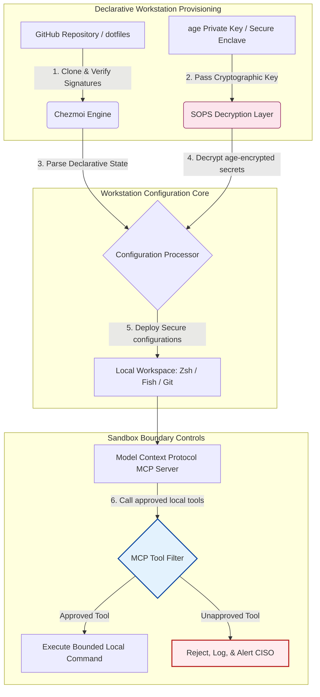

---

# Front Matter (YAML)

author: "contact@sebastienrousseau.com (Sebastien Rousseau)"
banner_alt: "محطة عمل مطور في إضاءة خافتة — ترمز إلى ملفات dotfiles واعية بالذكاء الاصطناعي وقابلة للتكرار وآمنة، لخوادم MCP وتوقيع SLSA وأسرار age/SOPS وتكافؤ متعدد الأصداف"
banner_height: "1597"
banner_width: "2584"
banner: "https://cloudcdn.pro/stocks/images/almas-salakhov-Vq2ap8aFFEs.webp"
cdn: "https://cloudcdn.pro"
charset: "UTF-8"
cname: "sebastienrousseau.com"
copyright: "© Copyright 2025 - 2026 - Sebastien Rousseau. All rights reserved."
date: "June 16, 2026"
description: "ملفات dotfiles الواعية بالذكاء الاصطناعي هي نمط محطة عمل آمنة وقابلة للتكرار في عصر MCP — تكوين تصريحي عبر Chezmoi، وأسرار SOPS/age، ومصدر SLSA Level 3، وتكافؤ متعدد الأصداف، وحدود تنفيذ مضبوطة لوكلاء الذكاء الاصطناعي المحليين."
format-detection: "telephone=no"
hreflang: "ar"
icon: "https://cloudcdn.pro/clients/sebastienrousseau/v1/logos/sebastienrousseau.svg"
id: "https://sebastienrousseau.com/2026-06-16-ai-aware-dotfiles-secure-reproducible-workstation-2026"
image_alt: "صورة بالأبيض والأسود لـ Sebastien Rousseau"
image_height: "162"
image_width: "162"
image: "https://cloudcdn.pro/stocks/images/sebastien-rousseau.png"
keywords: "dotfiles, Chezmoi, MCP, Model Context Protocol, SLSA, SOPS, age encryption, تكوين تصريحي, محطة عمل المطور, DORA Article 5, NIST CSF 2.0, أمن سلسلة التوريد, الذكاء الاصطناعي الوكيلي, تكافؤ متعدد الأصداف, Zsh, Fish, Nushell"
language: "ar"
last_reviewed: "2026-06-16"
layout: "report"
locale: "ar_SA"
logo_alt: "شعار Sebastien Rousseau"
logo_height: "44"
logo_width: "44"
logo: "https://cloudcdn.pro/clients/sebastienrousseau/v1/logos/sebastienrousseau.svg"
menu: ""
measurementID: "G-169G4ET5HQ"
name: "Sebastien Rousseau"
permalink: "https://sebastienrousseau.com/2026-06-16-ai-aware-dotfiles-secure-reproducible-workstation-2026"
rating: "general"
referrer: "no-referrer"
robots: "index, follow"
schema: "FAQPage, Article"
seo_title: "dotfiles واعية بالذكاء الاصطناعي لمحطة عمل مطور آمنة"
short_name: "sebastienrousseau"
subtitle: "محطة عمل المطور باتت جزءاً من سلسلة توريد الذكاء الاصطناعي؛ تحتاج ملفات dotfiles إلى الأمن، وقابلية التكرار، ونظافة الأسرار، وسير عمل واعٍ بـ MCP."
tags: "dotfiles, أدوات المطور, MCP, SLSA, محطة عمل آمنة, chezmoi, macOS, Linux, WSL"
theme-color: "0, 83, 191"
title: "dotfiles واعية بالذكاء الاصطناعي 2026: بناء محطة عمل مطور آمنة وقابلة للتكرار لـ MCP وSLSA وتكافؤ متعدد الأصداف"
url: "https://sebastienrousseau.com/2026-06-16-ai-aware-dotfiles-secure-reproducible-workstation-2026"
viewport: "width=device-width, initial-scale=1, shrink-to-fit=no"

# RSS - The RSS feed front matter (YAML).
atom_link: "https://sebastienrousseau.com/2026-06-16-ai-aware-dotfiles-secure-reproducible-workstation-2026/rss.xml"
category: "Technology"
docs: https://validator.w3.org/feed/docs/rss2.html
generator: "Static Site Generator (SSG) (version 0.0.26)"
item_description: "قراءة في ملفات dotfiles التصريحية لمحطات عمل المطورين، آمنة وقابلة للتكرار عبر macOS وLinux وWSL، مع وعي MCP، وSLSA، وage، وSOPS، وتكافؤ متعدد الأصداف."
item_guid: "https://sebastienrousseau.com/2026-06-16-ai-aware-dotfiles-secure-reproducible-workstation-2026/rss.xml"
item_link: "https://sebastienrousseau.com/2026-06-16-ai-aware-dotfiles-secure-reproducible-workstation-2026/rss.xml"
item_pub_date: "Tue, 16 Jun 2026 06:06:06 +0000"
item_title: "dotfiles واعية بالذكاء الاصطناعي 2026: بناء محطة عمل مطور آمنة وقابلة للتكرار لـ MCP وSLSA وتكافؤ متعدد الأصداف"
last_build_date: "Tue, 16 Jun 2026 06:06:06 +0000"
managing_editor: "contact@sebastienrousseau.com (Sebastien Rousseau)"
pub_date: "Tue, 16 Jun 2026 06:06:06 +0000"
ttl: "60"
type: "article"
webmaster: "contact@sebastienrousseau.com"

# Apple - The Apple front matter (YAML).
apple_mobile_web_app_orientations: "portrait"
apple_touch_icon_sizes: "192x192"
apple-mobile-web-app-capable: "yes"
apple-mobile-web-app-status-bar-inset: "black"
apple-mobile-web-app-status-bar-style: "black-translucent"
apple-mobile-web-app-title: "dotfiles واعية بالذكاء الاصطناعي لمحطة عمل آمنة"
apple-touch-fullscreen: "yes"

# MS Application - The MS Application front matter (YAML).

msapplication-navbutton-color: "0, 83, 191"

# Twitter Card - The Twitter Card front matter (YAML).

twitter_card: "summary_large_image"
twitter_creator: "@wwdseb"
twitter_description: "قراءة في ملفات dotfiles التصريحية لمحطات عمل المطورين، آمنة وقابلة للتكرار عبر macOS وLinux وWSL، مع وعي MCP، وSLSA، وage، وSOPS، وتكافؤ متعدد الأصداف."
twitter_image: "https://cloudcdn.pro/clients/sebastienrousseau/v1/logos/sebastienrousseau.svg"
twitter_image_alt: "شعار Sebastien Rousseau"
twitter_site: "@wwdseb"
twitter_title: "dotfiles واعية بالذكاء الاصطناعي لمحطة عمل مطور آمنة"
twitter_url: "https://sebastienrousseau.com/2026-06-16-ai-aware-dotfiles-secure-reproducible-workstation-2026"

excerpt: "تتعامل ملفات dotfiles الواعية بالذكاء الاصطناعي عام 2026 مع محطة عمل المطور بوصفها بنية تحتية لسلسلة التوريد — تكوين تصريحي يديره chezmoi، مع وعي MCP، وإصدارات موقَّعة بـ SLSA، وأسرار age/SOPS، وبدء تشغيل دون الثانية، وتكافؤ بين macOS وLinux وWSL."

# Humans.txt - The Humans.txt front matter (YAML).
author_website: "https://sebastienrousseau.com"
author_twitter: "@wwdseb"
author_location: "London, UK"
thanks: "شكراً على القراءة!"
site_last_updated: "2026-06-16"
site_standards: "HTML5, CSS3, RSS, Atom, JSON, XML, YAML, Markdown, TOML"
site_components: "Kaishi, Kaishi Builder, Kaishi CLI, Kaishi Templates, Kaishi Themes"
site_software: "Static Site Generator, Rust"

---

# dotfiles واعية بالذكاء الاصطناعي 2026: بناء محطة عمل مطور آمنة وقابلة للتكرار لـ MCP وSLSA وتكافؤ متعدد الأصداف

<!-- lead-start -->
<aside class="post-lead" aria-label="ملخص المقال">

<strong>الخلاصة.</strong> محطة عمل المطور لم تعد مجرد نقطة طرفية؛ بل صارت طرفاً نشطاً في سلسلة توريد البرمجيات، وواجهةً مباشرةً لمستوى التحكم بالذكاء الاصطناعي المحلي. مساعدو الذكاء الاصطناعي الطرفيون وخوادم <a href="https://modelcontextprotocol.io">Model Context Protocol (MCP)</a> ينفذون أوامر صدفة محلية، ويفحصون المستودعات، ويقرؤون ملفات تكوين حساسة مباشرةً. <a href="https://github.com/sebastienrousseau/dotfiles">Dotfiles لـ Sebastien Rousseau</a> إطار عمل مفتوح المصدر، تصريحي، يبني محطات عمل آمنة وقابلة للتكرار عبر macOS وLinux وWindows Subsystem for Linux (WSL) — يدمج <a href="https://www.chezmoi.io/">Chezmoi</a>، و<a href="https://github.com/getsops/sops">SOPS وage</a>، ومصدر بناء SLSA Level 3، لعزلٍ آمنٍ ذاكريّاً للأسرار، ومسارات تنفيذ مضبوطة لنماذج الذكاء الاصطناعي المحلية.

<strong>أبرز النقاط</strong>

<ul class="post-lead-takeaways">
  <li><strong>محطات العمل بنية تحتية لسلسلة التوريد.</strong> ينبغي معاملة تكوينات بيئة المطور بالصرامة التصريحية ذاتها التي تُعامَل بها عمليات نشر الخوادم الإنتاجية، إلغاءً لانجراف التكوين اليدوي.</li>
  <li><strong>تحدي مستوى التحكم بالذكاء الاصطناعي.</strong> يمكن لنماذج الذكاء الاصطناعي الطرفية وأدوات MCP الوصول إلى المجلدات المحلية. ينبغي لـ dotfiles فرض حدود sandbox مضبوطة، وقوائم صارمة لأذونات الأدوات، وسجلات محلية لا تقبل التعديل، منعاً لتسرب البيانات.</li>
  <li><strong>تكافؤ مطلق متعدد المنصات.</strong> أداء صدفة دون الثانية، وملامح أمن متطابقة عبر macOS وLinux (Zsh، Fish، Nushell) وWSL، تختصر زمن تأهيل المطور من أسابيع إلى دقائق.</li>
  <li><strong>عزل أسرار آمن تشفيرياً.</strong> تشفير ملفات SOPS وage يوقف الاعتمادات المضمَّنة بنصٍّ صريح (رموز GitHub، ومفاتيح الوصول السحابي) عن الالتزام في Git أو القراءة من قِبَل نماذج LLM المحلية.</li>
  <li><strong>قيمة ائتمانية بمستوى المجلس.</strong> يترجم امتثال تكوين محطة العمل إلى أولويات مجلسية واضحة، يدعم DORA Article 5، ومعايير نقاط النهاية في NIST CSF 2.0، وتخفيض المخاطر التشغيلية في Basel III.</li>
</ul>

<strong>قراءات ذات صلة:</strong> <a href="https://sebastienrousseau.com/2026-05-23-agentic-payments-banking-consent-liability-new-payment-ux-2026">المدفوعات الوكيلية في المصارف: الموافقة والمسؤولية وتجربة الدفع الجديدة في 2026</a>، <a href="https://sebastienrousseau.com/2024-03-12-revolutionising-real-time-speech-recognition-on-macos-with-openai-whisper/index.html">التعرف السريع على الكلام في الزمن الحقيقي على macOS: OpenAI Whisper</a>، <a href="https://sebastienrousseau.com/2024-02-26-google-gemma-ai-transforming-open-source-ai-development/index.html">Google Gemma AI: تحويل تطوير الذكاء الاصطناعي مفتوح المصدر</a>.

</aside>
<!-- lead-end -->

ردمُ الفجوة بين التكوين التصريحي لمحطة العمل وسلاسل توريد البرمجيات الآمنة، في عصر نماذج الذكاء الاصطناعي المحلية وأدوات المطور الوكيلية.

المرجع مفتوح المصدر لهذه المقالة هو [dotfiles ⧉](https://github.com/sebastienrousseau/dotfiles "dotfiles — تكوين تصريحي لمحطة العمل"). يُقدَّم المستودع بوصفه: dotfiles تصريحية لـ macOS وLinux وWSL، توفر تكافؤاً متعدد الأصداف، وبدء تشغيل دون الثانية، وإصدارات موقَّعة بـ SLSA، وتكويناً واعياً بالذكاء الاصطناعي وMCP.

## لماذا يهم هذا المشروع مفتوح المصدر عام 2026

في يونيو 2026، محطة عمل المطور هي الحلقة الأضعف في سلسلة توريد البرمجيات، وهدفٌ عالي القيمة لجماعات إجرام إلكتروني متطورة ومدعومة من دول.

الوضع الأمني لبيئة التطوير تغيَّر جذرياً مع صعود مساعدي الترميز الطرفيين بالذكاء الاصطناعي (مثل Claude Code)، وتبنّي Model Context Protocol (MCP). وأصبحت طرفيات المطورين المحلية تستضيف وكلاء ذكاء اصطناعي نشطين ومستقلين، قادرين على:

- قراءة ملفات المصدر المحلية وتعديلها.
- استدعاء أدوات CLI المحلية (`git`، `npm`، `aws`، `kubectl`).
- فحص متغيرات بيئة الصدفة، وقواعد البيانات المحلية، وإعدادات التكوين.

إذا افتقرت البيئة المحلية للمطور إلى حدود صارمة، فقد تقرأ هذه الأدوات المستقلة بياناتٍ شخصيةً حساسةً عرَضاً، أو تُسرِّب اعتمادات سحابية إلى واجهات LLM العامة، أو تُنفِّذ حزماً خبيثة خلال البناء الآلي.

بموجب Digital Operational Resilience Act (DORA) وNIST Cybersecurity Framework (CSF) 2.0، المؤسسات المالية ملزمةٌ قانوناً بالتحقق من مصدر كل جهاز يصل إلى سلسلة توريد البرمجيات ومن سلامة أمنه. "حواسيب ندفة الثلج" — تلك المضبوطة يدوياً، غير المدقَّقة، المنجرفة — لم تعد ممتثلةً لمعايير المصارف العالمية.

[Dotfiles لـ Sebastien Rousseau](https://github.com/sebastienrousseau/dotfiles) يحل هذه المشكلة. وهو إطار عمل مفتوح المصدر، تصريحي، لإدارة محطة العمل، يُرسي محطات عمل مطورين آمنة وقابلة للتكرار. وبفرض خطٍّ أساس قياسي وقابل للتدقيق للتكوين، يقدم المشروع عائداً عالياً على الصمود (RoR)، يختصر زمن تأهيل المطور من أسابيع إلى ساعات، ويحمي سلاسل التوريد المالية الحساسة من ثغرات نقاط النهاية.

## عدسة معمارية: محطة العمل الواعية بالذكاء الاصطناعي 2026

يعمل إطار dotfiles بوصفه مدير بيئة آمن وتصريحي — تُدار فيه كل الأصداف المحلية، والأدوات، والأسرار، وتُدقَّق، وتُعزَل بنحوٍ منهجي:

| الطبقة | قرار التصميم | لماذا يهمُّ | المخاطرة عند سوء المعالجة |
|---|---|---|---|
| **طبقة التزويد** | إدارة تكوين تصريحية عبر Chezmoi | تبني محطات عمل قابلة للتكرار تماماً عبر macOS وLinux وWSL، إلغاءً للانجراف. | تكوينات ندفة ثلج، بحالات محلية غير مدقَّقة وقابلة للاختراق. |
| **طبقة الأصداف** | تكافؤ متعدد الأصداف (Zsh، Fish، Nushell) | يضمن بدء تشغيل دون الثانية متطابقاً، وسلوكَ اختصاراتٍ متسقاً عبر بيئات مختلفة. | تباين في أوامر الصدفة يُحدث نتائج سكربتات غير متوقعة. |
| **طبقة الأسرار** | تشفير الملفات عبر SOPS وage | يمنع التزام الاعتمادات المضمَّنة بنص صريح والمفاتيح الخام في Git أو كشفها لنماذج LLM المحلية. | تسرب الاعتمادات إلى تواريخ المستودعات العامة أو اختراقها من وكلاء محليين. |
| **طبقة الذكاء الاصطناعي/MCP** | ضوابط حدود Model Context Protocol | تقيِّد وكلاء الذكاء الاصطناعي المحليين بقائمة محددة من الأدوات المعتمدة، مع تسجيل كل التنفيذات المحلية. | وكلاء بلا حدود ينفذون أوامر جامحة أو مدمرة محلياً. |
| **طبقة سلسلة التوريد** | إصدارات موقَّعة بـ SLSA والتحقق عبر Sigstore | تثبت تشفيرياً صحة سكربتات الإقلاع وملفات التكوين. | سكربتات إعداد مخترقة تحقن أبواباً خلفية خبيثة في بيئات المطورين. |

## إشارات رئيسية لأمن محطة العمل وأتمتتها

للحفاظ على أمنٍ مطلق عبر حظيرة التطوير، على رؤساء أمن المعلومات (CISO) ومديري التكنولوجيا تتبع مؤشرات تشغيلية محددة وقابلة للقياس:

| الإشارة | المقياس / المعيار التشغيلي | مرجع NIST CSF / DORA | التنفيذ التقني على المنصة |
|---|---|---|---|
| **قابلية تكرار محطة العمل** | نسبة حواسيب المطورين التي تُدار بالكامل عبر مستودعات dotfiles تصريحية، دون انجراف في التكوين. | NIST CSF 2.0 (PR.DS-01) | تدقيقات اكتشاف الانجراف في Chezmoi تُنفَّذ تلقائياً عند بدء تشغيل الطرفية. |
| **نظافة الاعتمادات** | صفر أسرار أو مفاتيح غير مشفرة مخزَّنة بنصٍّ صريح عبر ملفات التكوين المحلية. | DORA Article 6 (أمن تقنية المعلومات والاتصالات) | خطاطيف Git pre-commit وعمليات فحص محلية ترفض الملفات غير المشفرة. |
| **مصدر البناء** | 100% من أدوات إقلاع محطة العمل مُتحقَّق منها باستخدام بيانات تعريف موقَّعة تشفيرياً. | DORA Article 30 (سلسلة التوريد) | تحقق Sigstore وSLSA Level 3 مضمَّن في خطوط أنابيب الإعداد. |
| **زمن تأهيل المطور** | الزمن المنقضي من تزويد عتاد خام إلى مساحة عمل تطوير مهيَّأة وممتثلة بالكامل. | العائد على الصمود (RoR) | سكربتات إعداد تصريحية مؤتمتة تُجمِّع البيئة في أقل من 15 دقيقة. |
| **وصول مضبوط لوكيل الذكاء الاصطناعي** | التحقق من أن أدوات الذكاء الاصطناعي المحلية تعمل ضمن حدود مجلدات معرَّفة، بإعدادات قراءة فقط افتراضياً. | إدارة مخاطر النماذج | ملفات تكوين MCP تقيِّد كتالوجات أدوات الوكيل بالعمليات المعتمدة. |

## لماذا التكوين التصريحي هو جوهر أمن محطة العمل

النهج التقليدي لإعداد محطات عمل المطورين يدويٌّ بدرجة عالية، وينتج عنه "حواسيب ندفة الثلج" — بيئات تنجرف فيها التكوينات بمرور الوقت إذ يثبِّت المطورون أدواتٍ مخصصة، ويعدِّلون المتغيرات، ويغيِّرون السكربتات المحلية. هذا الانجراف يُحدث عدة ثغرات حرجة:

1. **تكوينات ظل غير متتبَّعة.** الحواسيب المنجرفة كثيراً ما تُشغِّل حزم برمجيات قديمة وقابلة للاختراق، أو سكربتات محلية تتجاوز أدوات الأمن المؤسسية.
2. **تسرب الأسرار.** يُضمِّن المطورون باستمرار مفاتيح API، ورموز GitHub، أو اعتمادات AWS مباشرةً في سكربتات أو ملفات صدفة بنصٍّ صريح، مما يجعلها معرَّضةً بشدة للسرقة.
3. **تأهيل غير كفء.** إعداد محطة عمل مطور جديد يدوياً قد يستغرق أسبوعين من وقت الهندسة، مما يُضعف سرعة الفريق.

بالانتقال إلى تكوين تصريحي مدفوع بنموذج عبر Chezmoi، تصبح مساحة عمل المطور بأكملها نظامَ سجلٍّ مُدارَ الإصدارات وقابلاً للتكرار. كل تعديل، واختصار، واعتماد على حزمة، وافتراض أمني، يُوثَّق في Git، ويُتحقَّق منه قياساً بسياسات الامتثال المؤسسية، ويُحقَّق تشفيرياً قبل تطبيقه على الحاسوب الفعلي.

## تصميم بيئة مطور مضبوطة للذكاء الاصطناعي

لمنع وكلاء الذكاء الاصطناعي المحليين وأدوات MCP من اكتساب وصولٍ بلا حدود إلى الأصول المحلية، ينبغي لمحطة العمل أن تعمل بوصفها مستوى تنفيذ مضبوطاً.

التدفق التشغيلي أدناه يوضح كيف يُنسِّق إطار dotfiles بين Chezmoi وSOPS وage لفك تشفير ونشر ملفات dotfiles آمنة، مع الحفاظ على حدود تنفيذ معزولة في sandbox لوكلاء الذكاء الاصطناعي المحليين الذين يستدعون أدوات MCP:

## دليل مجلس الإدارة والمسؤولية الائتمانية

أمن محطة عمل المطور وسلامة سلسلة التوريد أولويتان حرجتان لمجلس الإدارة. على الإدارة العليا معالجة مخاطر بيئة المطور من خلال عدسة المسؤولية الائتمانية، والامتثال التنظيمي، وحفظ القيمة الاقتصادية:

- **DORA Article 5 (مساءلة المجلس).** يُلزم بأن يتحمل الجهاز الإداري (المجلس) المسؤولية النهائية عن إدارة مخاطر تقنية المعلومات والاتصالات في المؤسسة. ولأن محطات عمل المطورين بوابةٌ إلى سلسلة توريد البرمجيات، فعلى أعضاء المجلس التحقق من أن نقاط النهاية آمنة، وقابلة للتدقيق بالكامل، ومُدارة ضمن أُطر تكوين صارمة وقابلة للتكرار، استيفاءً للتدقيقات التنظيمية.
- **امتثال NIST CSF 2.0 (أمن نقاط النهاية).** يطلب ألا تصل إلى الشبكات والمستودعات المؤسسية سوى الأجهزة المعتمَدة والمُتحقَّق منها، التي تُشغِّل تكوينات قياسية وآمنة. ملفات dotfiles التصريحية تتيح لفرق الأمن أن تثبت رياضياً أن كل بيئات المطورين ممتثلة لخط الأساس الأمني للمؤسسة، إلغاءً لمخاطر إعدادات "ندفة الثلج" غير المدقَّقة.
- **حفظ قيمة الميزانية العمومية.** اختراقٌ واحدٌ لاعتماد مطور أو خرقٌ في سلسلة التوريد قد يُكلِّف المؤسسة ملايين الدولارات في المعالجة، والغرامات التنظيمية، والضرر السمعي. الانتقال إلى بيئة مطور تصريحية وآمنة يُقلل هذه المخاطر مباشرة، يحفظ قيمة الميزانية العمومية، ويحمي ثقة العميل.

## ماذا يعني ذلك بحسب نوع المصرف

### المصارف ذات الأهمية النظامية العالمية (G-SIBs)

تدير G-SIBs آلاف محطات عمل المطورين عبر قارات متعددة وولايات تنظيمية مختلفة. تحديها الأساس هو الحفاظ على اتساق التكوين ومنع تسرب الاعتمادات عبر فرق هندسية ضخمة. بتبني نموذج dotfiles مفتوح المصدر وتصريحي عبر Chezmoi، تستطيع G-SIBs توحيد أمن نقاط النهاية، وأتمتة تدقيق الامتثال، واختصار أزمنة تأهيل المطورين من أسابيع إلى دقائق عبر المؤسسة العالمية.

### مصارف المعاملات والمصارف المؤسسية

تشغِّل مصارف المعاملات بوابات دفع حساسة، وبنى تحتية لتسوية الجملة. إثبات السلامة المطلقة للشيفرة المنشورة على بيئاتها الإنتاجية مطلبٌ تنظيمي غير قابل للتفاوض. توحيد محطات عمل المطورين تحت إطار dotfiles آمن ومتوافق مع SLSA يضمن تدقيق سلسلة توريد البرمجيات بالكامل، وحمايتها من ثغرات نقاط النهاية المحلية للمطورين.

### المصارف الإقليمية والأصغر

على المصارف الإقليمية الحفاظ على معايير عالية للأمن السيبراني دون ميزانيات الأمن الضخمة الخاصة بـ G-SIBs. يوفر إطار dotfiles مفتوح المصدر حلاً خفيف الوزن، فعّال التكلفة، آمناً بدرجة عالية، وصديقاً لـ Python وRust، يمكِّن المؤسسات الأصغر من تنفيذ أمن نقاط نهاية بدرجة مؤسسية، وحماية سلسلة توريد، دون تراخيص برمجيات احتكارية باهظة.

## الخاتمة: خارطة طريق محطة عمل المطور

محطة عمل المطور لم تعد جهازاً طرفياً؛ بل مستوى تحكم حاسماً في سلسلة توريد البرمجيات. السماح لـ "حواسيب ندفة الثلج" — المضبوطة يدوياً وغير المدقَّقة — بالوصول إلى الأصول المؤسسية مخاطرةٌ تشغيلية وتنظيمية شديدة.

لتأمين سلسلة توريد البرمجيات وحماية نقاط النهاية من ثغرات وكلاء الذكاء الاصطناعي المحليين، ينبغي لكبار مديري التكنولوجيا والأمن تنفيذ خارطة طريق تطوير واضحة اليوم:

1. **فرض التزويد التصريحي.** التخلص من عمليات الإعداد اليدوية القائمة على الوثائق، وفرض تزويد كل بيئات المطورين تصريحياً عبر Chezmoi.
2. **فرض نظافة الأسرار.** فرض خطاطيف pre-commit صارمة وأدوات فحص لضمان عدم تخزين أي اعتمادات خام، أو مفاتيح، أو رموز API بنصٍّ صريح عبر تكوينات محطة العمل المحلية.
3. **إرساء حدود sandbox للذكاء الاصطناعي.** تطبيق ملفات تكوين MCP آمنة ومضبوطة لتقييد مساعدي ووكلاء الترميز بالذكاء الاصطناعي المحليين بأدوات ومجلدات معتمدة وللقراءة فقط.
4. **تأمين سلسلة التوريد.** ضمان التحقق التشفيري من كل سكربتات الإقلاع وتكوينات البيئة باستخدام مصدر SLSA Level 3 قبل النشر.

## الأسئلة الشائعة

**ما Chezmoi ولماذا يُستخدَم لإدارة dotfiles؟**

Chezmoi مدير dotfiles مفتوح المصدر، آمن، وتصريحي. يتيح للمطورين إدارة تكويناتهم المحلية بوصفها مستودعاً مُدار الإصدارات، يضمن اتساقاً وقابليةَ تكرار مطلقَين عبر أنظمة تشغيل مختلفة (macOS، Linux، WSL).

**كيف يحمي الإطار الأسرار؟**

يستخدم الإطار تشفير ملفات SOPS (Secrets Operations) وage لتشفير الاعتمادات الحساسة (مثل رموز GitHub أو مفاتيح الوصول السحابي) مباشرةً داخل مستودع dotfiles. هذا يمنع التزام المفاتيح بنصٍّ صريح، أو قراءتها من قِبَل وكلاء ذكاء اصطناعي محليين غير مصرَّح لهم.

**ما Model Context Protocol (MCP) وكيف يؤثر في الأمن؟**

MCP معيار مفتوح يتيح لنماذج الذكاء الاصطناعي تنفيذ أدوات محلية بأمان والوصول إلى الملفات. يُنفذ إطار dotfiles ملفات تكوين MCP صارمة لتقييد أدوات ووكلاء الذكاء الاصطناعي المحليين بالمجلدات والأوامر المعتمدة.

**أي الأصداف يدعمها الإطار؟**

Bash، Zsh، Fish، Nushell، وPowerShell — مع تكافؤ عبر macOS وLinux وWSL، فيبقى سلوك الأوامر متطابقاً مهما يكن الطرفية التي يفتحها المطور.

## المراجع

- Open Source Security Foundation (OpenSSF)، (2024). *Supply-chain Levels for Software Artifacts (SLSA)*. متاح في: [إطار SLSA ⧉](https://slsa.dev/ "إطار SLSA").
- NIST، (2024). *NIST Cybersecurity Framework 2.0*. غايثرسبيرغ: National Institute of Standards and Technology. متاح في: [NIST CSF 2.0 ⧉](https://www.nist.gov/cyberframework "NIST Cybersecurity Framework 2.0").
- البرلمان الأوروبي ومجلس الاتحاد الأوروبي، (2022). *Regulation (EU) 2022/2554 on digital operational resilience for the financial sector (DORA)*. بروكسل: الجريدة الرسمية للاتحاد الأوروبي. متاح في: [لائحة DORA ⧉](https://eur-lex.europa.eu/legal-content/EN/TXT/?uri=CELEX%3A32022R2554 "لائحة DORA").
- GitHub، (2026). *مستودع dotfiles مفتوح المصدر*. متاح في: [مستودع dotfiles ⧉](https://github.com/sebastienrousseau/dotfiles "مستودع dotfiles").

<!-- enrich-start -->
<aside class="author-card" aria-label="نبذة عن المؤلف"><strong class="author-card-name"><a href="/about/index.html">Sebastien Rousseau</a></strong>تقني مصرفي أول يكتب في الذكاء الاصطناعي التطبيقي، وترحيل ISO 20022، والتشفير ما بعد الكمومي للخدمات المالية، والتحول الهيكلي لمدفوعات الجملة.أكثر من 20 عاماً عبر HSBC Commercial &amp; Investment Bank، وPayPal، وBarclays، وShazam، وAKQA، ومجموعة Virgin. <a href="/about/index.html">الملف الكامل</a> &middot; <a href="https://www.linkedin.com/in/sebastienrousseau/" rel="external noopener">LinkedIn</a> &middot; <a href="https://github.com/sebastienrousseau" rel="external noopener">GitHub</a></aside>

آخر مراجعة <time datetime="2026-06-16">2026-06-16</time>.

<aside class="related-posts" aria-labelledby="related-heading">
<h2 id="related-heading" class="related-heading">قراءات ذات صلة</h2>

<article class="related-card"><footer class="related-body"><h3><a href="https://sebastienrousseau.com/2026-05-23-agentic-payments-banking-consent-liability-new-payment-ux-2026">المدفوعات الوكيلية في المصارف: الموافقة والمسؤولية وتجربة الدفع الجديدة في 2026</a></h3>
<time datetime="2026-05-23">2026-05-23</time>
</footer></article>
<article class="related-card"><footer class="related-body"><h3><a href="https://sebastienrousseau.com/2024-03-12-revolutionising-real-time-speech-recognition-on-macos-with-openai-whisper/index.html">التعرف السريع على الكلام في الزمن الحقيقي على macOS: OpenAI Whisper</a></h3>
<time datetime="2024-03-12">2024-03-12</time>
</footer></article>
<article class="related-card"><footer class="related-body"><h3><a href="https://sebastienrousseau.com/2024-02-26-google-gemma-ai-transforming-open-source-ai-development/index.html">Google Gemma AI: تحويل تطوير الذكاء الاصطناعي مفتوح المصدر</a></h3>
<time datetime="2024-02-26">2024-02-26</time>
</footer></article>

</aside>
<!-- enrich-end -->
