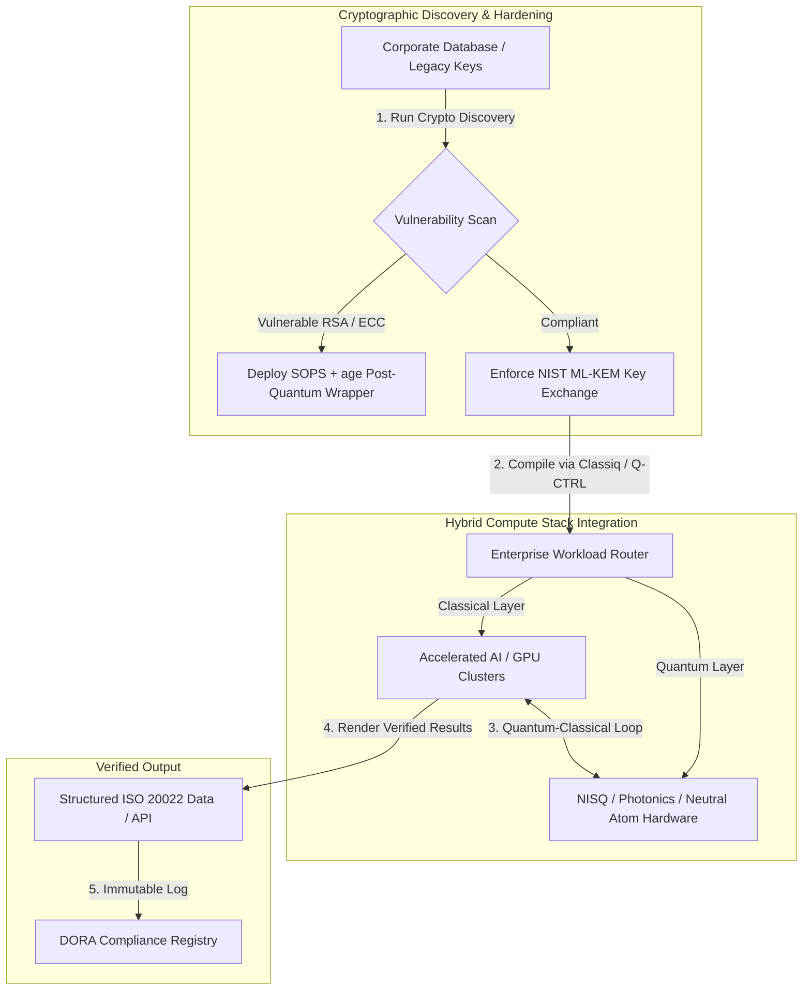

---

# Front Matter (YAML)

author: "contact@sebastienrousseau.com (Sebastien Rousseau)"
banner_alt: "منظر من خشبة قمة Economist Impact الخامسة لتسويق الكم عالمياً 2026 في لندن — يرمز إلى انتقال تقنية الكم من بحوث الفيزياء إلى تدفقات عمل مؤسسية جاهزة"
banner_height: "1597"
banner_width: "2584"
banner: "https://cloudcdn.pro/stocks/images/sebastien-rousseau-20260617-5th-commercialising-quantum-2.webp"
cdn: "https://cloudcdn.pro"
charset: "UTF-8"
cname: "sebastienrousseau.com"
copyright: "© Copyright 2025 - 2026 - Sebastien Rousseau. All rights reserved."
date: "June 17, 2026"
description: "خلاصات لمجلس الإدارة من قمة Economist Impact الخامسة لتسويق الكم عالمياً 2026 — موجة تمويل بقيمة 1.3 مليار دولار، حزم هجينة بلا ندم، إلحاح الانتقال إلى التشفير ما بعد الكمومي، تسويق استشعار الكم، وتوجيه HSBC بأن الانتظار خطأ غير مُجبَر عليه."
format-detection: "telephone=no"
hreflang: "ar"
icon: "https://cloudcdn.pro/clients/sebastienrousseau/v1/logos/sebastienrousseau.svg"
id: "https://sebastienrousseau.com/2026-06-17-economist-commercialising-quantum-summit-2026"
image_alt: "صورة بالأبيض والأسود لـ Sebastien Rousseau"
image_height: "162"
image_width: "162"
image: "https://cloudcdn.pro/stocks/images/sebastienrousseau.webp"
keywords: "تسويق الكم عالمياً 2026, قمة Economist Impact, التشفير ما بعد الكمومي, NIST ML-KEM, الحصاد الآن وفك التشفير لاحقاً, SNDL, الكم في HSBC, Philip Intallura, استشعار الكم, الملاحة المستقلة عن GPS, NQCC, قانون الكم الأوروبي, Quantcore, جائزة qBIG, Lord Vallance, هجين كمومي-كلاسيكي, DORA Article 6"
language: "ar"
last_reviewed: "2026-06-17"
layout: "report"
locale: "ar_SA"
logo_alt: "شعار Sebastien Rousseau"
logo_height: "44"
logo_width: "44"
logo: "https://cloudcdn.pro/clients/sebastienrousseau/v1/logos/sebastienrousseau.svg"
menu: ""
measurementID: "G-169G4ET5HQ"
name: "Sebastien Rousseau"
permalink: "https://sebastienrousseau.com/2026-06-17-economist-commercialising-quantum-summit-2026"
rating: "general"
referrer: "no-referrer"
robots: "index, follow"
schema: "FAQPage, Article"
seo_title: "تسويق الكم 2026: خلاصات لمجلس الإدارة"
short_name: "sebastienrousseau"
subtitle: "عَبَر الكم من علم مختبري نظري إلى تدفقات عمل مؤسسية هجينة؛ وعلى مجلس الإدارة أن يستجيب لتمويل 2026 البالغ 1.3 مليار دولار، وللانتقال الفوري إلى التشفير ما بعد الكمومي، ولتوجيه HSBC بالتوقف عن الانتظار."
tags: "الكم, التشفير ما بعد الكمومي, NIST ML-KEM, الحصاد الآن وفك التشفير لاحقاً, استشعار الكم, HSBC, Economist Impact, الحوسبة الهجينة, DORA, قانون الكم الأوروبي, NQCC, خلاصات القمة"
theme-color: "0, 83, 191"
title: "من الكيوبت إلى الأرباح: خلاصات استراتيجية من قمة Economist الخامسة لتسويق الكم عالمياً 2026"
url: "https://sebastienrousseau.com/2026-06-17-economist-commercialising-quantum-summit-2026"
viewport: "width=device-width, initial-scale=1, shrink-to-fit=no"

# RSS - The RSS feed front matter (YAML).
atom_link: "https://sebastienrousseau.com/2026-06-17-economist-commercialising-quantum-summit-2026/rss.xml"
category: "Technology"
docs: https://validator.w3.org/feed/docs/rss2.html
generator: "Static Site Generator (SSG) (version 0.0.26)"
item_description: "خلاصات لمجلس الإدارة من قمة Economist Impact الخامسة لتسويق الكم عالمياً 2026 — موجة تمويل بقيمة 1.3 مليار دولار، حزم هجينة بلا ندم، إلحاح الانتقال إلى التشفير ما بعد الكمومي، تسويق استشعار الكم، وتوجيه HSBC بأن الانتظار خطأ غير مُجبَر عليه."
item_guid: "https://sebastienrousseau.com/2026-06-17-economist-commercialising-quantum-summit-2026/rss.xml"
item_link: "https://sebastienrousseau.com/2026-06-17-economist-commercialising-quantum-summit-2026/rss.xml"
item_pub_date: "Wed, 17 Jun 2026 06:06:06 +0000"
item_title: "من الكيوبت إلى الأرباح: خلاصات استراتيجية من قمة Economist الخامسة لتسويق الكم عالمياً 2026"
last_build_date: "Wed, 17 Jun 2026 06:06:06 +0000"
managing_editor: "contact@sebastienrousseau.com (Sebastien Rousseau)"
pub_date: "Wed, 17 Jun 2026 06:06:06 +0000"
ttl: "60"
type: "article"
webmaster: "contact@sebastienrousseau.com"

# Apple - The Apple front matter (YAML).
apple_mobile_web_app_orientations: "portrait"
apple_touch_icon_sizes: "192x192"
apple-mobile-web-app-capable: "yes"
apple-mobile-web-app-status-bar-inset: "black"
apple-mobile-web-app-status-bar-style: "black-translucent"
apple-mobile-web-app-title: "تسويق الكم 2026: خلاصات لمجلس الإدارة"
apple-touch-fullscreen: "yes"

# MS Application - The MS Application front matter (YAML).

msapplication-navbutton-color: "0, 83, 191"

# Twitter Card - The Twitter Card front matter (YAML).

twitter_card: "summary_large_image"
twitter_creator: "@wwdseb"
twitter_description: "خلاصات لمجلس الإدارة من قمة Economist Impact الخامسة لتسويق الكم عالمياً 2026 — موجة تمويل بقيمة 1.3 مليار دولار، حزم هجينة بلا ندم، إلحاح الانتقال إلى التشفير ما بعد الكمومي، تسويق استشعار الكم، وتوجيه HSBC بأن الانتظار خطأ غير مُجبَر عليه."
twitter_image: "https://cloudcdn.pro/clients/sebastienrousseau/v1/logos/sebastienrousseau.svg"
twitter_image_alt: "شعار Sebastien Rousseau"
twitter_site: "@wwdseb"
twitter_title: "تسويق الكم 2026: خلاصات لمجلس الإدارة"
twitter_url: "https://sebastienrousseau.com/2026-06-17-economist-commercialising-quantum-summit-2026"

excerpt: "أكدت قمة Economist Impact الخامسة لتسويق الكم عالمياً 2026 محورية الكم نحو تدفقات العمل المؤسسية: 1.3 مليار دولار جُمعت في خمسة أشهر، التشفير ما بعد الكمومي بات مسألة ائتمانية على مستوى المجلس في ظل حصاد SNDL، استشعار الكم يُشحَن اليوم للملاحة المستقلة عن GPS، وقدَّم Philip Intallura من HSBC توجيهاً بأن انتظار العتاد المتحمل للأعطال خطأ غير مُجبَر عليه."

# Humans.txt - The Humans.txt front matter (YAML).
author_website: "https://sebastienrousseau.com"
author_twitter: "@wwdseb"
author_location: "London, UK"
thanks: "شكراً على القراءة!"
site_last_updated: "2026-06-17"
site_standards: "HTML5, CSS3, RSS, Atom, JSON, XML, YAML, Markdown, TOML"
site_components: "Kaishi, Kaishi Builder, Kaishi CLI, Kaishi Templates, Kaishi Themes"
site_software: "Static Site Generator, Rust"

---

# من الكيوبت إلى الأرباح: خلاصات استراتيجية من قمة Economist الخامسة لتسويق الكم عالمياً 2026

الجاهزية المؤسسية، وعمليات الانتقال إلى التشفير ما بعد الكمومي، وحزم الحوسبة الهجينة، والمشهد التجاري الناشئ لاستشعار الكم وشبكاته.

**الخلاصة.** جمعت الدورة الخامسة لمؤتمر تسويق الكم عالمياً 2026، الذي استضافته Economist Impact في 16-17 يونيو 2026 في Business Design Centre بلندن، أكثر من 1,100 قائد عالمي من المؤسسات والمالية والسياسة والبحث. وضع المحور الرئيس علامة فارقة على محورٍ هيكلي واضح: انتقلت تقنية الكم من علم مختبري نظري إلى تدفقات عمل مؤسسية هجينة عملية. وبدعم 1.3 مليار دولار من رأس المال الجريء جُمعت في الأشهر الخمسة الأولى من 2026 وحدها، لم يعد نقاش مجلس الإدارة منصبّاً على عدّ الكيوبتات الفيزيائية، بل على إرساء حزم حوسبة هجينة "بلا ندم"، وتأمين الأصول الرقمية ضد التهديد التشفيري المتمثل في "الحصاد الآن، وفك التشفير لاحقاً" (SNDL)، ونشر منظومات استشعار كمومي قريبة المدى للملاحة المستقلة عن GPS.

## أبرز النقاط

- **تحول مؤسسي إلى تدفقات عمل عملية.** أكد قادة الصناعة ([Steve Suarez](https://www.linkedin.com/in/stevesuarez) من HorizonX، و[Phil Intallura](https://www.linkedin.com/in/intallura) من HSBC) أن دمج الكم لم يعد مشكلة فيزيائية بل تشغيلية. تنشر المصارف والمؤسسات تجارب هجينة كمومية-كلاسيكية لإعداد المواهب وتحسين أحمال العمل النشطة.
- **التشفير ما بعد الكمومي (PQC) أولوية مجلسية.** حذّر خبراء الأمن والقانون (CMS UK، [Joanne Miller](https://www.linkedin.com/in/joanne-miller-nso) من Microsoft، [Craig Farrell](https://www.linkedin.com/in/craig-farrell) من EY) من أن المؤسسات لا تستطيع انتظار العتاد المتحمل للأعطال لنشر PQC. حصاد "الحصاد الآن، وفك التشفير لاحقاً" يحدث اليوم، مما يجعل الانتقال إلى معايير NIST ML-KEM شأناً ائتمانياً فورياً.
- **استشعار الكم يقود الربحية القريبة.** بينما تظل الحوسبة المتحملة للأعطال على بُعد سنوات، يتنامى استشعار الكم بسرعة ([Matthew Kinsella](https://www.linkedin.com/in/matthewkinsella) من Infleqtion). تُنشر الساعات الكمومية والمستشعرات العطالية في الملاحة المستقلة عن GPS، والأمن الوطني، وشبكات الطاقة فائقة الاستقرار.
- **السيادة والعناقيد وإلحاح السياسات.** عرض وزير العلوم البريطاني [Lord Vallance](https://www.linkedin.com/in/patrick-vallance) و[Lord William Hague](https://www.linkedin.com/in/williamhague) مهمات وطنية لتحويل البحث إلى "عناقيد عملاقة" بمقياس صناعي بالتنسيق مع National Quantum Computing Centre (NQCC). كما يُبرز قانون الكم الأوروبي المرتقب السباق الجيوسياسي على قدرات الحوسبة السيادية.
- **Quantcore تفوز بجائزة qBIG.** حصدت شركة Quantcore، المنبثقة عن University of Glasgow، جائزة IOP qBIG عن مكوناتها فائقة التوصيل المعتمدة على النيوبيوم، التي تعمل في درجات حرارة أعلى من المواد التقليدية، مما يقلص بنحوٍ كبير عبء البنية التحتية للتبريد المتطلَّبة.

**قراءات ذات صلة:** [KyberLib والانتقال المصرفي إلى ما بعد الكم في 2026: من المعايير إلى الشيفرة](https://sebastienrousseau.com/2026-06-12-kyberlib-post-quantum-banking-migration-standards-code-2026/)، [مؤشر صمود المصارف 2026: الذكاء الاصطناعي، والسحابة، والكم، والمدفوعات، ومخاطر تمركز الطرف الثالث](https://sebastienrousseau.com/2026-06-08-banking-resilience-index-ai-cloud-quantum-payments-third-party-risk-2026/)، [مؤشر المصرفية السحابية الأصيلة 2026: DORA، وهندسة المنصات، والسحابة السيادية، والصمود التشغيلي](https://sebastienrousseau.com/2026-06-05-cloud-native-banking-index-dora-resilience-platform-engineering-2026/).

## 01. لماذا تهم قمة 2026 لمجلس الإدارة

شكَّلت نسخة 2026 من قمة Economist لتسويق الكم عالمياً محوراً دائماً في كيفية تقييم عالم الشركات للتقنية العميقة.

تاريخياً، أُحيلت الحوسبة الكمومية إلى أقسام R&D بوصفها مسعى علمياً متعدد العقود. في يونيو 2026، هذا المنظور بات عتيقاً. على المؤسسات الانتقال من الفضول "المتمركز على الفيزياء" إلى التطبيق "المتمركز على الأعمال". والسبب مزدوج:

1. **تقارب الكم والذكاء الاصطناعي.** تَنصهر حزم الحوسبة عالية الأداء (HPC) — الكلاسيكية، والذكاء الاصطناعي المُسارَع، وعُقد NISQ (Noisy Intermediate-Scale Quantum) — في طبقة حوسبة موحدة. والمؤسسات التي تؤجل بناء تطبيقات جاهزة للكم ستكتشف أن نافذة اقتناص الميزة الاستراتيجية تُغلَق أسرع من المتوقع.
2. **إلحاح جيوسياسي وائتماني.** مع البرنامج الكمومي البريطاني المُوجَّه بالمهام، وقانون الكم الأوروبي المرتقب، صارت السعة الكمومية شأناً يتصل بالسيادة الوطنية واستمرارية الشركات.

كذلك، لم تعد الأمن السيبراني ما بعد الكمومي مطلباً امتثالياً مستقبلياً. فتهديد هجمات "التخزين الآن، وفك التشفير لاحقاً" (SNDL) العدائية يعني أن البيانات المؤسسية المعترضة اليوم ستُفكَّك تشفيراً عند اتساع نطاق الأنظمة الكمومية التجارية، فيخلق ذلك مسؤولية فورية بموجب التفويضات العالمية للصمود التشغيلي مثل Digital Operational Resilience Act (DORA).

## 02. عدسة تسويق الكم الاستراتيجية 2026

على قادة التكنولوجيا المؤسسية رسم نضج الكم عبر خمس طبقات تشغيلية متمايزة، مع تقييم آفاق الزمن ومخاطر الميزانية العمومية.

### الجدول 1: عدسة تسويق الكم الاستراتيجية 2026

| الطبقة | تركيز الشركة | الأفق / الزمن | المخاطرة المؤسسية الرئيسة |
| ---- | ---- | ---- | ---- |
| **العتاد والمُجمِّع** | الاختيار بين أساليب متنافسة (فائقة التوصيل، الأيونات المحبوسة، الذرات المحايدة، الفوتونيات) | 3 – 5 سنوات (التحمل التام للأعطال) | الانغلاق على معمارية مسدودة، أو دعم منصة وحيدة باكراً جداً. |
| **التحصين التشفيري** | اكتشاف وجرد الاعتمادات التشفيرية؛ والانتقال إلى NIST ML-KEM | فوري (انتقال نشط) | اختراقات بيانات نظامية، وإخفاقات امتثالية بموجب DORA وNIST CSF 2.0. |
| **استشعار الكم** | نشر الملاحة المستقلة عن GPS، والساعات فائقة الاستقرار، ومقاييس الجاذبية | 1 – 2 سنة (تجاري فوري) | اضطراب تشغيلي للوجستيات، والشحن، وشبكات الطاقة بسبب تشويش GPS. |
| **تكامل الأنظمة** | ربط العتاد الكمومي ضمن مراكز بيانات HPC والحوسبة الفائقة الكلاسيكية القائمة | 1 – 3 سنوات (طور هجين) | كمون عالٍ، واختناقات في نقل البيانات، وصوامع حوسبة مجزَّأة. |
| **برمجيات المؤسسات** | عرض خوارزميات الكم عبر طبقات تجريد رفيعة وواجهات برمجة (Classiq، Q-CTRL) | فوري (بناء المهارات) | عزل المواهب وتدفقات العمل عن التنفيذ الهندسي الفعلي. |

## 03. إشارات الكم الرئيسة ومحفزات مجلس الإدارة

على قادة التكنولوجيا رصد مقاييس سوقية وتنظيمية محددة وقابلة للقياس، توجيهاً لاستثماراتهم الكمومية.

### الجدول 2: إشارات الكم الرئيسة ومحفزات مجلس الإدارة

| الإشارة | المقياس الكمي | المرجع التنظيمي / السياسي | أولوية المنصة القابلة للتنفيذ |
| ---- | ---- | ---- | ---- |
| **موجة تمويل الكم** | 1.3 مليار دولار جُمعت عالمياً في الأشهر الخمسة الأولى من 2026 | العائد على الصمود (RoR) | نقل الميزانيات من تجارب نظرية إلى أحمال هجينة كمومية-كلاسيكية "بلا ندم". |
| **تعرض فك تشفير البيانات** | 100% من البيانات المشفَّرة المنقولة عبر قنوات عامة معرَّضة لحصاد SNDL | DORA Article 6 (أمن ICT) | تطبيق أدوات اكتشاف تشفيرية لتحديد مفاتيح RSA/ECC الهشة عبر المؤسسة. |
| **بنية تحتية سيادية** | 2.5 مليار جنيه إسترليني مخصصة للاستراتيجية الكمومية الوطنية البريطانية | المهمات الكمومية البريطانية / Lord Vallance | إقامة شراكات محلية مع العناقيد العملاقة الوطنية مثل NQCC. |
| **مواعيد الامتثال النهائية** | 14 نوفمبر 2026، تحويل SWIFT للعنوان الهيكلي | توجيه SWIFT SR 2026 | تنظيف وتنسيق قواعد البيانات البَيْنبنكية لاستيفاء مواصفات XML الهيكلية. |

## 04. غوص عميق في محاور القمة الجوهرية

### الكم يبلغ نقطة تحوّل استثمارية

شهد تمويل رأس المال الجريء تسارعاً ملحوظاً، إذ جُمع **1.3 مليار دولار** في الأشهر الخمسة الأولى من 2026 وحدها. وبخلاف دورات الضجيج التخمينية في السنوات الماضية، تستند موجة رأس المال الحالية إلى أحمال عمل واقعية قريبة المدى. وعرض متحدثون من Classiq وIBM Quantum Platform كيف تُتيح طبقات تجريد البرمجيات والمُجمِّعات المؤتمتة لفرق المطورين من غير المتخصصين تنفيذ خوارزميات هجينة كمومية-كلاسيكية على بنية تحتية كلاسيكية اليوم. واستراتيجية "بلا ندم" هذه تُمكِّن المؤسسات من بناء مواهب وتدفقات عمل جاهزة للكم على الفور.

### تحذيرات قانونية وتنظيمية بشأن "الحصاد الآن، وفك التشفير لاحقاً"

أثار شركاء قانونيون ومسؤولو أمن سيبراني تفاعلاً كبيراً حول فورية مخاطر البيانات. ووجَّه ممثلون عن شركة المحاماة الراعية CMS UK، ومسؤولة الأمن الرئيسة في Microsoft [Joanne Miller](https://www.linkedin.com/in/joanne-miller-nso)، تحذيراً صارخاً إلى الإدارة العليا: *إن انتظار وصول العتاد المتحمل للأعطال قبل نشر التشفير ما بعد الكمومي هو إخفاق ائتماني حرج.*

في ظل نموذج "التخزين الآن، وفك التشفير لاحقاً" (SNDL)، تحصد جهات معادية بنشاط بياناتٍ مؤسسية مشفَّرة اليوم، بنيّة فك تشفيرها فور ظهور حواسيب كمومية ذات صلة تشفيرياً. ويجب على المؤسسات نشر حمايات ما بعد الكم (كـ NIST ML-KEM) فوراً، لحماية مجموعات البيانات الحساسة طويلة العمر، والملكية الفكرية، وسجلات العملاء التاريخية.

### إعادة ضبط ضجيج "استشعار الكم"

بينما تظل الحوسبة الكمومية المتحملة للأعطال على بُعد سنوات، أبرزت القمة استشعار الكم بوصفه أول موجة ربحية حقيقية للنشر الفعلي. وفصَّل الرئيس التنفيذي [Matthew Kinsella](https://www.linkedin.com/in/matthewkinsella) من Infleqtion كيف تتنامى الساعات الكمومية، والمستشعرات العطالية، وأنظمة الترددات الراديوية بسرعة عبر صناعات متعددة.

ولأن هذه التقنيات تقيس ثوابت فيزيائية بدقة دون ذرية، فهي تُتيح **ملاحة مستقلة عن GPS**، وشبكات طاقة فائقة الاستقرار، واتصالات الفضاء العميق. وهذه التطبيقات بالغة الأهمية للطيران والنقل البحري وأنظمة الدفاع الوطني التي تواجه تهديدات تشويش GPS المتنامية.

### تعاون النظام البيئي والعناقيد

استغل النظام البيئي الكمومي البريطاني قمة لندن لإبراز عناقيد الابتكار المحلية العملاقة. وقدَّمت تحديثات حية من National Quantum Computing Centre (NQCC) وDigital Catapult تفاصيل كيف يمكن للشركات المنبثقة من التقنية العميقة في مراحلها المبكرة جسر "فجوة التقنية" بدمج العتاد الكمومي مباشرةً في مراكز بيانات الحوسبة الفائقة الكلاسيكية.

تلقَّى [Wridhdhisom Karar](https://www.linkedin.com/in/wridhdhisomkarar)، المؤسس المشارك للشركة الناشئة الكمومية الاسكتلندية Quantcore، جائزة Institute of Physics (IOP) المرموقة Quantum Business Innovation and Growth (qBIG) عن مكونات الشركة فائقة التوصيل المعتمدة على النيوبيوم. تعمل هذه المكونات في درجات حرارة أعلى من المواد التقليدية، مما يقلص بنحوٍ كبير عبء البنية التحتية للتبريد المتطلَّبة لتوسيع نطاق المعالجات الكمومية.

### دراسة حالة HSBC: لماذا انتظار الكم "خطأ غير مُجبَر عليه"

قدَّمت رؤى [**Philip Intallura, Ph.D.**](https://www.linkedin.com/in/intallura) (رئيس تقنيات الكم العالمية في HSBC، ومستشار الحكومة البريطانية، ومستشار مجلس الإدارة) في فعالية Economist الخامسة لتسويق الكم (2026) توجيهاً قوياً لمجلس الإدارة: *"انتظار الكم المتحمل للأعطال قبل أن تبدأ خطأ غير مُجبَر عليه."*

أكد الدكتور Intallura أن نهج "الانتظار والترقّب" الشائع لدى المؤسسات المالية هدفٌ في المرمى يقوم على ثلاث افتراضات خاطئة:

- **العائد القريب المدى حقيقي.** في الاختبارات التجريبية، تفوَّقت HSBC على نماذج تعمل حالياً في الإنتاج، وربطت العمل الكمومي بأجزاء أخرى من الأعمال، واستخدمت الكم لتعميق العلاقات مع بعض أكبر عملائها، واجتذبت أعمالاً جديدة وفيرة إلى **HSBC Innovation Banking**.
- **الكم منحنى تبنٍّ شديد الانحدار.** بناء القدرة، وضع الاستراتيجية، تأمين التمويل، وتشغيل دورات التجارب داخل مؤسسة شديدة التنظيم ليس مهمة قصيرة. ويجب اختبار العمليات وتكييفها منهجياً للتقنية.
- **الكم نظام بيئي.** لا يبلغ أحدٌ هناك وحده. كل ورقة بحثية، وإثبات مفهوم، وتجريب نفَّذته HSBC كان بتعاون وثيق مع مزوِّد كمومي — وفي بعض الحالات يمتد التعاون إلى الأوساط الأكاديمية، والمنظِّمين، والحكومة.

**التوجيه الختامي لمجلس الإدارة:** *"القدرة التي ستحتاجها في اليوم الأول من التحمل التام للأعطال هي القدرة التي تبنيها الآن."*

## 05. تكامل الكم المؤسسي وخط إنتاج التشفير

لتأمين الأصول الرقمية مع بناء جاهزية الكم، يجب على المؤسسة إرساء خط إنتاج تكامل واضح.

## 06. دليل مجلس الإدارة: حتميات قابلة للتنفيذ

لترجمة رؤى قمة تسويق الكم عالمياً 2026 إلى قيمة عمل فورية، على الإدارة العليا تنفيذ دليل المجلس التالي ذي الخطوات الأربع:

1. **تكليف باكتشاف تشفيري.** توجيه مسؤول أمن المعلومات الرئيس (CISO) لجرد جميع الأصول التشفيرية، ورسم خرائط لكل مفتاح RSA وECC قديم عبر المؤسسة، استعداداً للانتقال إلى ما بعد الكم.
2. **نشر استراتيجية هجينة "بلا ندم".** تَجَنُّب انتظار العتاد المثالي. والاستثمار في برمجيات مستوحاة من الكم وتجارب هجينة كلاسيكية-كمومية، تطويراً لمواهب داخلية وتحسيناً للوجستيات أو محافظ المخاطر المعقدة اليوم.
3. **تقييم استشعار الكم في اللوجستيات.** إن كانت مؤسستك تعتمد على سلاسل توريد عالمية، أو شحن، أو بنية تحتية حرجة، فقيِّم بنشاط منظومات استشعار الكم (كالملاحة المستقلة عن GPS)، تخفيفاً لمخاطر الاضطراب الجيوسياسي.
4. **التسجيل لساعة الرؤية في 30 يونيو.** التأكد من تسجيل قادة التكنولوجيا في **Commercialising Quantum Global Insight Hour** الافتراضية في 30 يونيو 2026، الساعة 3:00 مساءً BST (بدعم من IonQ)، لمواصلة تتبع استراتيجيات إدارة المخاطر المؤسسية وتخصيص المواهب.

## 07. الأسئلة الشائعة

**ما "الحصاد الآن، وفك التشفير لاحقاً" (SNDL) ولماذا يهم اليوم؟**
SNDL هو ممارسة اعتراض البيانات المشفَّرة وتخزينها اليوم، بنيَّة فك تشفيرها لاحقاً متى توافرت الحواسيب الكمومية ذات الصلة تشفيرياً. مجموعات البيانات الحساسة طويلة العمر — الملكية الفكرية، وسجلات العملاء، والاتصالات الحكومية — مستهدفة بالفعل. والانتقال إلى NIST ML-KEM قرار ائتماني لا يستطيع المجلس تأجيله.

**لماذا استشعار الكم هو الموجة التجارية الأولى بدلاً من الحوسبة؟**
تقيس مستشعرات الكم ثوابت فيزيائية بدقة دون ذرية، ولا تتطلب العتاد المتحمل للأعطال الذي تتطلبه الحوسبة الكمومية. الساعات الكمومية، ومقاييس الجاذبية، والمستشعرات العطالية موجودة فعلاً في نشر تجريبي للملاحة المستقلة عن GPS، وشبكات الطاقة فائقة الاستقرار، واتصالات الفضاء العميق.

**هل عمل HSBC الكمومي مجرد R&D، أم حقَّق عوائد قابلة للقياس؟**
وفقاً لـ Philip Intallura في القمة، تفوَّقت HSBC على نماذج تعمل حالياً في الإنتاج، واستخدمت الكم لتعميق العلاقات مع أكبر عملائها، واجتذبت أعمالاً جديدة وفيرة إلى HSBC Innovation Banking. وقد انتقل العمل من البحث إلى التكامل التشغيلي.

## 08. المراجع

- **Economist Impact, (2026).** *5th Annual Commercialising Quantum Global 2026.* وقائع مؤتمر حية، 16-17 يونيو 2026. لندن: Business Design Centre. متاح في: [Economist Impact](https://events.economist.com/commercialising-quantum/).
- **National Institute of Standards and Technology (NIST), (2024).** *First Three Finalized Post-Quantum Encryption Standards (FIPS 203, 204, and 205).* غايثرسبيرغ: U.S. Department of Commerce. متاح في: [معايير NIST](https://www.nist.gov/news-events/news/2024/08/nist-releases-first-3-finalized-post-quantum-encryption-standards).
- **البرلمان الأوروبي ومجلس الاتحاد الأوروبي، (2022).** *Regulation (EU) 2022/2554 on digital operational resilience for the financial sector (DORA).* بروكسل: الجريدة الرسمية للاتحاد الأوروبي. متاح في: [لائحة DORA](https://eur-lex.europa.eu/legal-content/EN/TXT/?uri=CELEX%3A32022R2554).
- **SWIFT, (2024).** *ISO 20022 November 2026 Structured Address Milestone.* لا هول: SWIFT. متاح في: [معلَم SWIFT ISO 20022](https://www.swift.com/standards/iso-20022/iso-20022-bytes/call-action-november-2026).
