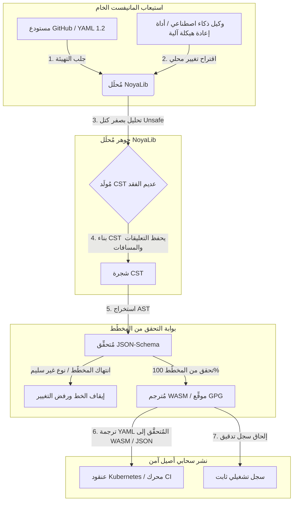

---

# Front Matter (YAML)

author: "contact@sebastienrousseau.com (Sebastien Rousseau)"
banner_alt: "هندسة معمارية بإضاءة درامية — ترمز إلى دور NoyaLib بوصفه المُحلِّل الآمن لـ YAML بلغة Rust الحاملَ لأعباء CI، وKubernetes، وMCP، وتهيئة الخدمات المالية"
banner_height: "1597"
banner_width: "2584"
banner: "https://cloudcdn.pro/stocks/images/ken-cheung-KonWFWUaAuk.webp"
cdn: "https://cloudcdn.pro"
charset: "UTF-8"
cname: "sebastienrousseau.com"
copyright: "© Copyright 2025 - 2026 - Sebastien Rousseau. All rights reserved."
date: "June 18, 2026"
description: "NoyaLib، مُحلِّل YAML 1.2 بلغة Rust بصفر unsafe، ومطابقة كاملة 406/406 للمواصفات، والتحقق وفق JSON-Schema، وشجرة CST عديمة الفقد، وروابط MCP/WASM للبنية التحتية المالية."
format-detection: "telephone=no"
hreflang: "ar"
icon: "https://cloudcdn.pro/clients/sebastienrousseau/v1/logos/sebastienrousseau.svg"
id: "https://sebastienrousseau.com/2026-06-18-noyalib-safe-yaml-rust-ai-mcp-financial-infrastructure-2026"
image_alt: "صورة بالأبيض والأسود لـ Sebastien Rousseau"
image_height: "162"
image_width: "162"
image: "https://cloudcdn.pro/stocks/images/sebastien-rousseau.png"
keywords: "مُحلِّل YAML بلغة Rust أكثر أماناً, NoyaLib, مطابقة مواصفات YAML 1.2, Rust بصفر unsafe, التحقق وفق JSON-Schema, شجرة CST عديمة الفقد, MCP, Model Context Protocol, WebAssembly, مانيفستات Kubernetes, تهيئة CI/CD, DORA المادة 5, BCBS 239, مخاطر تشغيلية بازل III, البنية التحتية المالية, أمن التهيئة, أمن سلسلة توريد البرمجيات"
language: "ar"
last_reviewed: "2026-06-18"
layout: "report"
locale: "ar_SA"
logo_alt: "شعار Sebastien Rousseau"
logo_height: "44"
logo_width: "44"
logo: "https://cloudcdn.pro/clients/sebastienrousseau/v1/logos/sebastienrousseau.svg"
menu: ""
measurementID: "G-169G4ET5HQ"
name: "Sebastien Rousseau"
permalink: "https://sebastienrousseau.com/2026-06-18-noyalib-safe-yaml-rust-ai-mcp-financial-infrastructure-2026"
rating: "general"
referrer: "no-referrer"
robots: "index, follow"
schema: "FAQPage, Article"
seo_title: "NoyaLib: مُحلِّل YAML بلغة Rust للذكاء وMCP والمال"
short_name: "sebastienrousseau"
subtitle: "حزمة YAML بلغة Rust أكثر أماناً — NoyaLib — تُحوِّل YAML 1.2 من تنسيق راحة إلى مستوى تحكم تهيئة مطابق للمواصفات وآمن تشفيرياً لوكلاء الذكاء الاصطناعي وMCP وKubernetes والبنية التحتية للخدمات المالية."
tags: "مُحلِّل YAML بلغة Rust أكثر أماناً, NoyaLib, YAML 1.2, Rust بصفر unsafe, JSON-Schema, MCP, WebAssembly, Kubernetes, DORA, BCBS 239, بازل III, البنية التحتية المالية, أمن سلسلة التوريد"
theme-color: "0, 83, 191"
title: "لماذا يحتاج YAML إلى حزمة Rust أكثر أماناً للذكاء الاصطناعي وMCP والبنية التحتية المالية في 2026"
url: "https://sebastienrousseau.com/2026-06-18-noyalib-safe-yaml-rust-ai-mcp-financial-infrastructure-2026"
viewport: "width=device-width, initial-scale=1, shrink-to-fit=no"

# RSS - The RSS feed front matter (YAML).
atom_link: "https://sebastienrousseau.com/2026-06-18-noyalib-safe-yaml-rust-ai-mcp-financial-infrastructure-2026/rss.xml"
category: "Technology"
docs: https://validator.w3.org/feed/docs/rss2.html
generator: "Static Site Generator (SSG) (version 0.0.26)"
item_description: "NoyaLib، مُحلِّل YAML 1.2 بلغة Rust بصفر unsafe، ومطابقة كاملة 406/406 للمواصفات، والتحقق وفق JSON-Schema، وشجرة CST عديمة الفقد، وروابط MCP/WASM للبنية التحتية المالية."
item_guid: "https://sebastienrousseau.com/2026-06-18-noyalib-safe-yaml-rust-ai-mcp-financial-infrastructure-2026/rss.xml"
item_link: "https://sebastienrousseau.com/2026-06-18-noyalib-safe-yaml-rust-ai-mcp-financial-infrastructure-2026/rss.xml"
item_pub_date: "Thu, 18 Jun 2026 06:06:06 +0000"
item_title: "لماذا يحتاج YAML إلى حزمة Rust أكثر أماناً للذكاء الاصطناعي وMCP والبنية التحتية المالية في 2026"
last_build_date: "Thu, 18 Jun 2026 06:06:06 +0000"
managing_editor: "contact@sebastienrousseau.com (Sebastien Rousseau)"
pub_date: "Thu, 18 Jun 2026 06:06:06 +0000"
ttl: "60"
type: "article"
webmaster: "contact@sebastienrousseau.com"

# Apple - The Apple front matter (YAML).
apple_mobile_web_app_orientations: "portrait"
apple_touch_icon_sizes: "192x192"
apple-mobile-web-app-capable: "yes"
apple-mobile-web-app-status-bar-inset: "black"
apple-mobile-web-app-status-bar-style: "black-translucent"
apple-mobile-web-app-title: "NoyaLib: مُحلِّل YAML بلغة Rust للذكاء وMCP والمال"
apple-touch-fullscreen: "yes"

# MS Application - The MS Application front matter (YAML).

msapplication-navbutton-color: "0, 83, 191"

# Twitter Card - The Twitter Card front matter (YAML).

twitter_card: "summary_large_image"
twitter_creator: "@wwdseb"
twitter_description: "NoyaLib، مُحلِّل YAML 1.2 بلغة Rust بصفر unsafe، ومطابقة كاملة 406/406 للمواصفات، والتحقق وفق JSON-Schema، وشجرة CST عديمة الفقد، وروابط MCP/WASM للبنية التحتية المالية."
twitter_image: "https://cloudcdn.pro/clients/sebastienrousseau/v1/logos/sebastienrousseau.svg"
twitter_image_alt: "شعار Sebastien Rousseau"
twitter_site: "@wwdseb"
twitter_title: "NoyaLib: مُحلِّل YAML بلغة Rust للذكاء وMCP والمال"
twitter_url: "https://sebastienrousseau.com/2026-06-18-noyalib-safe-yaml-rust-ai-mcp-financial-infrastructure-2026"

excerpt: "NoyaLib حزمة YAML بلغة Rust أكثر أماناً — صفر كتل unsafe، مطابقة كاملة 406/406 لمواصفات YAML 1.2، شجرة CST عديمة الفقد، وتحقق وفق JSON-Schema (Draft 2020-12)، وروابط MCP/WASM — مُهندَسة لوكلاء الذكاء الاصطناعي وKubernetes وCI/CD ومستوى تحكم التهيئة خلف البنية التحتية المالية."

# Humans.txt - The Humans.txt front matter (YAML).
author_website: "https://sebastienrousseau.com"
author_twitter: "@wwdseb"
author_location: "London, UK"
thanks: "شكراً على القراءة!"
site_last_updated: "2026-06-18"
site_standards: "HTML5, CSS3, RSS, Atom, JSON, XML, YAML, Markdown, TOML"
site_components: "Kaishi, Kaishi Builder, Kaishi CLI, Kaishi Templates, Kaishi Themes"
site_software: "Static Site Generator, Rust"

---

# لماذا يحتاج YAML إلى حزمة Rust أكثر أماناً للذكاء الاصطناعي وMCP والبنية التحتية المالية في 2026

تكمن أهمية حزمة YAML بلغة Rust أكثر أماناً في أن YAML بات يحمل خطوط أنابيب CI/CD، ومانيفستات Kubernetes، وقواعد [Open Policy Agent](https://www.openpolicyagent.org/)، وسجلات أدوات Model Context Protocol (MCP) — وتحليل واحد ملتبس قد يُعطِّل نظام مقاصة، أو يُخطئ تهيئة مجموعة أمان، أو يُسلِّم وكيل ذكاء اصطناعي محلي صلاحيات خاطئة. [NoyaLib](https://github.com/sebastienrousseau/noyalib) منظومة تحليل وتحقق لـ [YAML 1.2](https://yaml.org/spec/1.2.2/) خالصة بلغة Rust بصفر unsafe، مُهندَسة لجعل تلك البنية التحتية آمنة افتراضياً.

## إجابة سريعة

**ما NoyaLib في جملة واحدة؟** NoyaLib منظومة تحليل وتحقق مفتوحة المصدر لـ YAML 1.2 خالصة بلغة Rust بصفر شيفرة `unsafe`، ومطابقة 100% للمواصفات عبر مجموعة YAML الرسمية ذات الـ406 اختباراً، وشجرة CST عديمة الفقد، وتحقق آني وفق [JSON Schema](https://json-schema.org/) — مُهندَسة لجعل تهيئة وكلاء الذكاء الاصطناعي وMCP وKubernetes والبنية التحتية المالية آمنة افتراضياً.

## ملخص تنفيذي

يبدو YAML متواضعاً حتى يُعطِّل تحليلٌ ملتبس أو انتهاكُ مخطَّط نظامَ مقاصة إنتاجياً بمليارات الدولارات. في 2026، صار YAML المعيار الفعلي لخطوط [CI/CD](https://docs.github.com/en/actions/learn-github-actions/workflow-syntax-for-github-actions)، ومانيفستات [Kubernetes](https://kubernetes.io/docs/concepts/configuration/overview/)، وقواعد [Open Policy Agent](https://www.openpolicyagent.org/)، وسجلات أدوات Model Context Protocol (MCP). والمُحلِّلات القديمة المُعتمة — بثغرات الذاكرة والتحليل المُدمِّر — تُمثِّل مخاطرة أمنية غير مقبولة. NoyaLib منظومة YAML 1.2 خالصة بلغة Rust بصفر unsafe: مطابقة 100% عبر اختبارات المجموعة الرسمية الـ406، وشجرة CST عديمة الفقد تحفظ التعليقات والمسافات، وتحقق وفق JSON-Schema مُدمج. والنتيجة هي إعادة صَوغ YAML بوصفه مستوى تحكم تهيئة قابلاً للتدقيق، وآمناً، ومتاحاً للوكلاء.

## أبرز النقاط

- **التهيئة شيفرة إنتاج.** ملف YAML واحد مُشوَّه قد يُخطئ تهيئة مجموعات أمان سحابية أصيلة أو صلاحيات وكلاء الذكاء الاصطناعي. NoyaLib يتعامل مع YAML بوصفه بنية تحتية حرجة.
- **تصميم بصفر unsafe.** مبنياً كلياً بلغة Rust الآمنة بصفر كتل `unsafe`، يستبعد NoyaLib ثغرات أمان الذاكرة — تجاوزات المخزن المؤقت، وتنفيذ الشيفرة عن بُعد — في طبقات التحليل الجوهرية.
- **مطابقة مطلقة للمواصفات 406/406.** يتحقق رياضياً من بنى التهيئة، فيستبعد فوارق التحليل والانحراف البنيوي بين بيئتي التهيئة والإنتاج.
- **شجرة CST عديمة الفقد.** بخلاف المُحلِّلات القديمة التي تُلغي التعليقات والتنسيق، يحفظ NoyaLib المسافات والتعليقات التوضيحية، مُمكِّناً إعادة هيكلة آلية آمنة ذهاباً وإياباً بواسطة وكلاء الذكاء الاصطناعي.
- **قيمة ائتمانية على مستوى المجلس.** يربط سلامة التهيئة بـ[DORA المادة 5](https://eur-lex.europa.eu/legal-content/EN/TXT/?uri=CELEX%3A32022R2554) وبمقاييس رأس مال المخاطر التشغيلية في [Basel III](https://www.bis.org/bcbs/publ/d424.htm)، مُحصِّناً الإدارة العليا مباشرةً من المسؤولية الشخصية.

**قراءات ذات صلة:** [KyberLib والانتقال المصرفي إلى ما بعد الكم في 2026: من المعايير إلى الشيفرة](https://sebastienrousseau.com/2026-06-12-kyberlib-post-quantum-banking-migration-standards-code-2026/)، [مؤشر المصرفية السحابية الأصيلة 2026: DORA، وهندسة المنصات، والسحابة السيادية، والصمود التشغيلي](https://sebastienrousseau.com/2026-06-05-cloud-native-banking-index-dora-resilience-platform-engineering-2026/)، [Dotfiles واعية بالذكاء الاصطناعي في 2026: بناء محطة عمل مطوِّر آمنة وقابلة للنسخ لـ MCP وSLSA وتكافؤ متعدد الأصداف](https://sebastienrousseau.com/2026-06-16-ai-aware-dotfiles-secure-reproducible-workstation-2026/).

## 01. لماذا تهم حزمة YAML بلغة Rust أكثر أماناً في 2026

في يونيو 2026، باتت البنى التحتية لتقنية المعلومات المؤسسية موزَّعة ومؤتمتة بدرجة عالية ومتصاعدة.

تحوَّل YAML بهدوء إلى لغة التهيئة الحاملة للأعباء عبر حزمة هندسة البرمجيات بأكملها. فهو يحمل تدفقات التكامل المستمر (CI) التي تجمع الأصول الإنتاجية، ومانيفستات [Kubernetes](https://kubernetes.io/docs/concepts/overview/) التي تُنسِّق العناقيد السحابية الأصيلة العالمية، ومخطَّطات خوادم [Model Context Protocol](https://modelcontextprotocol.io/) (MCP) التي تمنح وكلاء الذكاء الاصطناعي المحليين صلاحية تنفيذ عمليات محلية.

تحمل مُحلِّلات YAML القديمة — [PyYAML](https://pyyaml.org/) وyaml-cpp وlibyaml — مخاطرتين بنيويتين:

1. **ثغرات الإكراه النوعي ("مشكلة النرويج").** كثيراً ما تُكرِه المُحلِّلات القديمة سلاسل غير مقتبسة (رمز دولة `NO` إلى منطقي `false`، وكذلك `yes`/`no`) — انظر [وسم YAML 1.1 مقابل 1.2 المنطقي](https://yaml.org/type/bool.html) — مُسبِّبةً أعطالاً نظامية حرجة أو إخفاقات تهيئة أمنية صامتة.
2. **استغلال أمان الذاكرة.** المُحلِّلات المُعتمة المكتوبة بـ C/C++ تعاني تسرُّب الذاكرة واستغلالات تجاوز المخزن المؤقت، التي قد تؤدي إلى تنفيذ الشيفرة عن بُعد (RCE) على خوادم البناء الجوهرية.

يُعالج [NoyaLib](https://github.com/sebastienrousseau/noyalib) هذه التحديات. فهو منظومة تحليل وتحقق لـ YAML 1.2 خالصة بلغة Rust بصفر unsafe. وبتحقيق مطابقة مطلقة 406/406 للمواصفات وإنفاذ تحقق صارم وفق JSON-Schema مباشرةً أثناء التحليل، يُحقِّق NoyaLib **عائداً مرتفعاً على الصمود (RoR)** — يمنع التعطُّل الناجم عن التهيئة ويُؤمِّن سلاسل توريد البرمجيات بمستوى مالي.

## 02. عدسة معمارية NoyaLib 2026

تعمل منظومة NoyaLib بوصفها مُحلِّل تهيئة آمناً عديم الفقد. فكل مانيفست محلي وسحابي يخضع لتحقق بنيوي ويتلقى حماية في أدنى طبقة تنفيذ.

### الجدول 1: طبقات معمارية NoyaLib وتخفيف المخاطر

| الطبقة | قرار التصميم | لماذا يهم | المخاطرة عند سوء التعامل |
| ---- | ---- | ---- | ---- |
| **طبقة المُحلِّل** | مُحلِّل YAML 1.2 خالص بلغة Rust بصفر كتل `unsafe` | يستبعد ثغرات أمان الذاكرة وتجاوزات المخزن المؤقت في أدنى طبقة تنفيذ. | تنفيذ الشيفرة عن بُعد (RCE) على خوادم البناء الجوهرية. |
| **طبقة المطابقة** | مطابقة 100% عبر اختبارات مجموعة YAML 1.2 الرسمية 406/406 | يستبعد فوارق التحليل وانحراف الإكراه النوعي بين التهيئة والإنتاج. | أخطاء إكراه نوعي من نوع "مشكلة النرويج" تُعطِّل مجموعات الأمان. |
| **طبقة شجرة الصياغة** | شجرة CST عديمة الفقد | تحفظ التعليقات والمسافات والترتيب أثناء التحليل ذهاباً وإياباً وإعادة الهيكلة البرمجية. | إعادة هيكلة آلية بواسطة الذكاء الاصطناعي تُتلف التعليقات التوضيحية للمطوِّر. |
| **طبقة التحقق** | التحقق وفق [JSON Schema (Draft 2020-12)](https://json-schema.org/draft/2020-12/release-notes) أثناء التحليل | تُنفِّذ نماذج بيانات صارمة على ملفات التهيئة قبل وصولها إلى عناقيد الإنتاج. | ملفات تهيئة مُشوَّهة تُسبِّب أعطال العناقيد السحابية الأصيلة. |
| **طبقة الواجهة** | روابط WebAssembly (WASM) وMCP | تُتيح تشغيل تحقق التهيئة مباشرةً داخل المتصفحات، وعقد الحافة، وأدوات الوكلاء المحلية. | صوامع أدوات لا يستطيع التحقق فيها التنفيذ على أجهزة الحافة. |

## 03. إشارات أمن محطة العمل والتهيئة الرئيسة

للحفاظ على أمن مطلق عبر منشأة التطوير والعمليات، يجب على رؤساء أمن المعلومات (CISOs) رصد مقاييس محددة وقابلة للقياس.

### الجدول 2: إشارات أمن محطة العمل والتهيئة

| الإشارة | المقياس / المرجع التشغيلي | مرجع NIST CSF / DORA | تنفيذ المنصة التقني |
| ---- | ---- | ---- | ---- |
| **مطابقة المُحلِّل** | معدل نجاح 100% عبر مجموعة اختبارات YAML 1.2 الرسمية (406/406). | [DORA المادة 6](https://eur-lex.europa.eu/legal-content/EN/TXT/?uri=CELEX%3A32022R2554) (أمن ICT) | جوهر مُحلِّل NoyaLib يتحقق من كل المانيفستات قبل تنفيذ CI. |
| **ملف أمان الذاكرة** | صفر كتل Rust `unsafe` داخل المُحلِّل ومتطلبات المُسلسِل. | DORA المادة 30 (سلسلة التوريد) | فحوصات مُترجِم آلية ([`forbid(unsafe_code)`](https://doc.rust-lang.org/reference/attributes/diagnostics.html#the-forbid-attribute)) في بنى cargo. |
| **التحقق من المخطَّط** | 100% من ملفات التهيئة المُحلَّلة مُتحقَّقاً منها وفق نماذج [JSON Schema](https://json-schema.org/) سليمة. | [NIST CSF 2.0](https://www.nist.gov/cyberframework) (PR.DS-01) | بوابة تحقق آني توقف خطوط البناء عند انتهاكات المخطَّط. |
| **انحراف التهيئة** | كشف آني واستعادة ملفات التهيئة المحلية إلى الحالة الموسومة بـ git. | العائد على الصمود (RoR) | تليمتري مستمر يُسجِّل كل تعديلات الملفات المحلية. |
| **التحكم بوصول الوكيل** | صلاحيات مقيَّدة للقراءة فقط لأدوات الذكاء الاصطناعي المحلية العاملة عبر تهيئات MCP. | إدارة مخاطر النماذج ([SR 11-7](https://www.federalreserve.gov/supervisionreg/srletters/sr1107.htm)) | حدود خوادم MCP تُقيِّد عمليات الوكلاء بالأدلة المعتمدة. |

## 04. مغالطة تحليل التهيئة المُعتم

ثغرة كبرى في العمليات السحابية الأصيلة هي *التحليل المُعتم* — استخدام مُحلِّلات تُلغي البيانات الوصفية البنيوية (التعليقات والمسافات وترتيب الوثيقة) أو تُكرِه الأنواع بصمت أثناء الترجمة. ويُحدث هذا السلوك مخاطرتين أمنيتين شديدتين:

1. **إعادة هيكلة مُدمِّرة.** عندما يُحدِّث مساعد ترميز ذكاء اصطناعي أو أداة إعادة هيكلة آلية مانيفست نشر، تُلغي المُحلِّلات التقليدية تعليقات المطوِّر والتنسيق، مُتلِفةً السياق اللازم للمراجعات البشرية وتحقيقات ما بعد الحادث.
2. **فوارق في التحليل.** إن استخدمت بيئة التهيئة مُحلِّلاً مبنياً على Python بينما يعمل الإنتاج بمُحلِّل مبني على C، فقد تُسبِّب فروق صغيرة في مطابقة مواصفات YAML 1.2 إخفاق مانيفست تهيئة سليم أو سلوكه مختلفاً في الإنتاج، فينشأ ثغرات أمنية خفية.

تحلّ **شجرة CST عديمة الفقد** في NoyaLib هذه المشكلة. فهي تحفظ كل مسافة وتعليق وسطر وثيقة أثناء حلقة التحليل والتسلسل. ويستطيع مساعدو الذكاء الاصطناعي الآليون تحرير ملفات التهيئة وإعادة هيكلتها وإيداعها مع الحفاظ على 100% من التعليقات البشرية المكتوبة — مسار تدقيق مطلق.

## 05. تصميم خط أنابيب تهيئة ذكاء اصطناعي مقيَّد

لمنع تغييرات التهيئة الخبيثة من بلوغ بيئات الإنتاج، يجب على المؤسسة تنفيذ خط أنابيب تهيئة مقيَّد بصرامة، ومُتحقَّق وفق المخطَّط.

يُظهر التدفق التشغيلي أدناه كيف يُحلِّل NoyaLib YAML الخام، ويُنشئ شجرة CST عديمة الفقد، ويتحقق من AST وفق نموذج JSON-Schema، ويُترجم روابط WebAssembly لبيئات المتصفح أو الحافة.

## 06. دليل مجلس الإدارة والمسؤولية الائتمانية

أمن التهيئة وسلامة سلسلة توريد البرمجيات أولويتان حرجتان في غرفة المجلس. وعلى الإدارة العليا التعامل مع إدارة التهيئة من منظور الواجب الائتماني والصمود التشغيلي.

- **DORA المادة 5 (مساءلة المجلس).** تُملي أن المجلس يتحمل المسؤولية النهائية غير القابلة للتفويض عن إدارة مخاطر ICT لدى المؤسسة. ولأن ملفات التهيئة تتحكم في مجموعات الأمان السحابية الأصيلة الحرجة ومسارات توجيه المدفوعات، فعلى المجالس التحقق من أن الأنظمة المُحلِّلة لهذه المانيفستات آمنة من حيث الذاكرة ومطابقة كاملة للمواصفات لاجتياز عمليات التدقيق التنظيمية. ([لائحة (EU) 2022/2554](https://eur-lex.europa.eu/legal-content/EN/TXT/?uri=CELEX%3A32022R2554))
- **BCBS 239 (تجميع بيانات المخاطر وإبلاغها).** يتطلب أن يكون إبلاغ المخاطر ومقاييس البنية التحتية دقيقاً وكاملاً، ومُنشَأً وفق ضوابط جودة بيانات صارمة. يدعم NoyaLib BCBS 239 بتحليل ملفات التهيئة والتحقق منها وفق مخطَّطات صارمة في المنبع، فيمنع تسرُّب البيانات الصامت أو الأعطال الناجمة عن سوء التهيئة. ([معيار BCBS 239](https://www.bis.org/publ/bcbs239.htm))
- **تخفيف رسوم رأس المال للمخاطر التشغيلية (Basel III).** الأعطال الناجمة عن التهيئة تُضخِّم مباشرةً رسوم رأس المال للمخاطر التشغيلية بموجب Basel III، فتُجمِّد رأس مال الميزانية. وتوحيد حزمة تهيئة المؤسسة على مُحلِّل آمن خالص بلغة Rust كـ NoyaLib يُقلِّل هذه المخاطرة، فيحفظ رأس المال ويحمي ثقة العملاء. ([معايير Basel III](https://www.bis.org/bcbs/publ/d424.htm))

## 07. ماذا يعني هذا بحسب نوع المصرف

### المصارف ذات الأهمية النظامية العالمية (G-SIBs)

تُدير G-SIBs آلاف الخدمات المُصغَّرة وخطوط النشر عبر ولايات قضائية متعددة. وتحديها الرئيس هو الحفاظ على اتساق التهيئة ومنع انحراف الأمن عبر منشآت سحابية أصيلة ضخمة. وتوحيد المعيار على حزمة YAML بلغة Rust أكثر أماناً كـ NoyaLib يضمن تحليل جميع مانيفستات Kubernetes وخطوط CI/CD وسياسات الأمن والتحقق منها ضمن إطار موحَّد آمن من حيث الذاكرة — فيستبعد مخاطرة التهيئات "فريدة الشكل" غير المُدقَّقة.

### مصارف المعاملات والمصارف المؤسسية

تُشغِّل مصارف المعاملات بوابات مدفوعات حساسة وبنى تحتية للمقاصة بالجملة. وإثبات الأمن المطلق للشيفرة والتهيئة المنشورة في هذه البيئات الإنتاجية مطلب تنظيمي غير قابل للتفاوض. ودمج NoyaLib يضمن أن سلسلة توريد البرمجيات مُدقَّقة كلياً، وعديمة الفقد، ومحمية من ثغرات التحليل — وهو ضابط يُقابل بوضوح DORA المادة 6 و[PCI DSS v4.0](https://www.pcisecuritystandards.org/document_library/) القسم 6.

### المصارف الإقليمية والأصغر حجماً

على المصارف الإقليمية الحفاظ على معايير عالية للأمن السيبراني دون موازنات تقنية بحجم G-SIB. ويوفر إطار NoyaLib مفتوح المصدر حلاً خفيف الوزن وفعال التكلفة وآمناً جداً وصديقاً لـ Rust، فيُمكِّن المؤسسات الأصغر من تطبيق أمن تهيئة وحماية سلسلة توريد بمستوى مؤسسي دون رسوم ترخيص ملكية.

## 08. الخاتمة: خارطة طريق أمن التهيئة

محطة عمل المطوِّر وتهيئات البنية التحتية السحابية الأصيلة مستويات تحكم حرجة في سلسلة توريد البرمجيات. والسماح بوصول ملفات تهيئة غير مُدقَّقة أو ملتبسة أو غير آمنة إلى الأصول المؤسسية مخاطرة تشغيلية وتنظيمية غير مقبولة.

لتأمين سلسلة توريد البرمجيات وحماية نقاط النهاية من ثغرات التهيئة، يجب على قادة التقنية والأمن العليا تنفيذ خارطة طريق تطوير واضحة اليوم:

1. **فرض التهيئة التصريحية.** التخلص التدريجي من تعديلات التهيئة اليدوية غير المُدقَّقة، وفرض إدارة كل المانيفستات بوصفها نظام سجل تصريحي خاضعاً للإصدار.
2. **إنفاذ التحقق من المخطَّط.** إنفاذ خطافات pre-commit صارمة وأدوات فحص لضمان التحقق من كل ملفات التهيئة وفق نماذج JSON-Schema سليمة قبل النشر.
3. **تطبيق دورة عديمة الفقد.** ضمان أن جميع مساعدي ترميز الذكاء الاصطناعي وأدوات إعادة الهيكلة تستخدم تحليلاً عديم الفقد لحفظ التعليقات والمسافات وسياق المطوِّر.
4. **تأمين سلسلة التوريد.** ضمان التحقق التشفيري من جميع إعدادات التهيئة وأدوات التحليل باستخدام مكتبات Rust خالصة بصفر unsafe كـ NoyaLib قبل التنفيذ. ([إطار SLSA](https://slsa.dev/))

## 09. الأسئلة الشائعة

**ما NoyaLib ولماذا يُستخدم لتحليل YAML؟**
NoyaLib مُحلِّل YAML 1.2 مفتوح المصدر، خالص بلغة Rust وبصفر unsafe. يُحقِّق مطابقة 100% للمواصفات عبر مجموعة الاختبار الرسمية ذات الـ406، ويُنفِّذ تحققاً صارماً وفق [JSON Schema](https://json-schema.org/) أثناء التحليل، ويُتيح روابط WASM و[MCP](https://modelcontextprotocol.io/) — مما يجعله حزمة YAML بلغة Rust أكثر أماناً لوكلاء الذكاء الاصطناعي وKubernetes والبنية التحتية المالية.

**لماذا التصميم بصفر unsafe مهم لتحليل التهيئة؟**
ثغرات أمان الذاكرة — تجاوزات المخزن المؤقت، والاستخدام بعد التحرير — داخل المُحلِّلات القديمة المكتوبة بـ C/C++ قد تؤدي إلى تنفيذ الشيفرة عن بُعد على خوادم البناء الجوهرية. وتصميم NoyaLib الخالص بـ Rust مع [`#![forbid(unsafe_code)]`](https://doc.rust-lang.org/reference/attributes/diagnostics.html#the-forbid-attribute) يستبعد هذه الثغرات رياضياً عند الترجمة.

**ما شجرة CST عديمة الفقد ولماذا تهم؟**
المُحلِّلات التقليدية تُلغي التعليقات والتنسيق، فتُصبح تعديلات وكلاء الذكاء الاصطناعي الآلية مُدمِّرة. شجرة CST عديمة الفقد في NoyaLib تحفظ كل تعليق ومسافة وسطر وثيقة — فيستطيع مساعدو الذكاء الاصطناعي تحرير ملفات التهيئة وإعادة هيكلتها بأمان مع إبقاء سياق المطوِّر، وتحقيقات ما بعد الحادث، ومسار التدقيق سليمة.

**كيف يتقابل NoyaLib مع DORA وBCBS 239 وBasel III؟**
DORA المادة 5 تضع مساءلة مخاطر ICT على المجلس؛ وBCBS 239 يطلب ضوابط جودة بيانات على إبلاغ المخاطر؛ وBasel III يفرض ضريبة على رأس مال المخاطر التشغيلية. ويُورِّد NoyaLib طبقة التحليل الآمنة من حيث الذاكرة والمُتحقَّقة وفق المخطَّط التي تتطلبها هذه اللوائح للتهيئة بوصفها شيفرة — مما يجعل التقابل التنظيمي مباشراً، ورسوم رأس المال للمخاطر التشغيلية أصغر.

## 10. المراجع

- **YAML, (2026).** *مواصفات YAML 1.2*. متاح في: [مواصفات YAML 1.2](https://yaml.org/spec/1.2.2/).
- **JSON Schema, (2026).** *ملاحظات إصدار JSON Schema Draft 2020-12*. متاح في: [JSON Schema Draft 2020-12](https://json-schema.org/draft/2020-12/release-notes).
- **البرلمان الأوروبي ومجلس الاتحاد الأوروبي، (2022).** *Regulation (EU) 2022/2554 on digital operational resilience for the financial sector (DORA)*. بروكسل: الجريدة الرسمية للاتحاد الأوروبي. متاح في: [لائحة DORA](https://eur-lex.europa.eu/legal-content/EN/TXT/?uri=CELEX%3A32022R2554).
- **Basel Committee on Banking Supervision, (2013).** *Principles for effective risk data aggregation and risk reporting (BCBS 239)*. بازل: Bank for International Settlements. متاح في: [معيار BCBS 239](https://www.bis.org/publ/bcbs239.htm).
- **Basel Committee on Banking Supervision, (2017).** *Basel III: finalising post-crisis reforms*. بازل: Bank for International Settlements. متاح في: [معايير Basel III](https://www.bis.org/bcbs/publ/d424.htm).
- **Anthropic, (2025).** *مواصفات Model Context Protocol (MCP)*. متاح في: [Model Context Protocol](https://modelcontextprotocol.io/).
- **GitHub, (2026).** *مستودع noyalib مفتوح المصدر*. متاح في: [مستودع NoyaLib](https://github.com/sebastienrousseau/noyalib).
